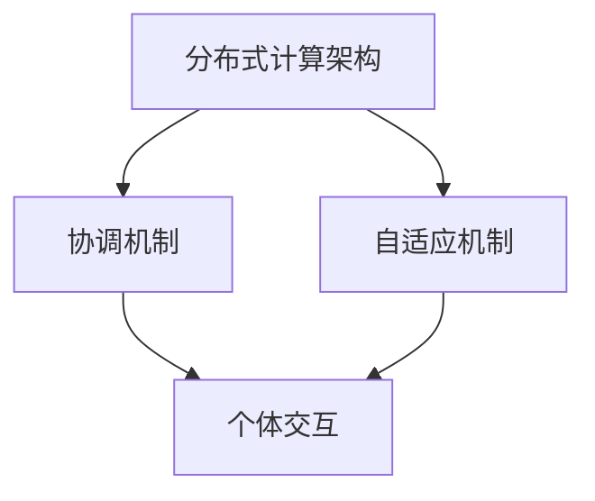

                 

关键词：群体智慧、计算新纪元、分布式计算、人工智能、协作网络、数据共享

> 摘要：本文探讨了群体智慧这一新兴计算模式的本质及其在人类计算中的重要性。通过深入分析群体智慧的核心概念、架构、算法原理、数学模型及其在各个领域的应用，探讨了群体智慧带来的巨大潜力与挑战。文章旨在为读者提供对群体智慧全面而深刻的理解，为未来的研究和应用奠定基础。

## 1. 背景介绍

随着互联网技术的飞速发展，数据量和计算需求日益增长，传统的计算模式已无法满足新兴的复杂计算需求。群体智慧作为一种新兴的分布式计算模式，应运而生。它通过个体之间的协作、信息共享和分布式计算，实现了更为高效的计算能力。

群体智慧的概念最早可以追溯到20世纪60年代。当时，计算机科学家约翰·霍兰（John Holland）提出了适应系统（Adaptive Systems）的概念，这为群体智慧的研究奠定了基础。进入21世纪，随着云计算、物联网和大数据技术的成熟，群体智慧逐渐成为计算领域的研究热点。

在人类计算中，群体智慧的重要性不言而喻。它不仅能够提高计算效率，还能解决许多传统计算模式难以克服的问题，如大规模数据处理、复杂优化问题、智能决策等。因此，群体智慧被认为是人类计算的新纪元。

### 1.1 群体智慧的定义与特点

群体智慧（Swarm Intelligence）是指由一组简单个体通过局部相互作用和协作，在无需集中控制的情况下，集体表现出复杂行为和智能能力的一种现象。这些个体可以是同一种类的，也可以是不同种类的。

群体智慧具有以下特点：

- **分布式计算**：个体之间的计算是分布式的，没有中央控制器。
- **自适应**：个体根据环境和自身状态调整行为，从而适应环境变化。
- **自组织**：个体通过局部相互作用形成有组织的群体行为。
- **容错性**：个体失败不会影响整个群体的性能。
- **自优化**：个体通过不断试错和适应，优化整体性能。

### 1.2 群体智慧的应用领域

群体智慧在许多领域都有广泛的应用，包括：

- **通信网络**：如自组织网络、无线传感器网络等。
- **智能交通**：如车辆编队、交通流量优化等。
- **金融领域**：如投资决策、风险管理等。
- **生物领域**：如鸟类群体迁徙、蜜蜂觅食等。
- **计算机科学**：如分布式算法、并行计算等。
- **人工智能**：如群体智能代理、多智能体系统等。

### 1.3 群体智慧的重要性

群体智慧的重要性体现在以下几个方面：

- **提高计算效率**：通过分布式计算，群体智慧能够处理大规模数据和复杂计算问题。
- **实现复杂优化**：群体智慧能够通过自组织和自优化，解决传统优化算法难以解决的问题。
- **智能决策**：群体智慧能够为人类提供智能化的决策支持，如金融投资、医疗诊断等。
- **增强协作能力**：群体智慧能够促进个体之间的协作和信息共享，提高整体效率。
- **推动科技进步**：群体智慧为新的计算模式和算法提供了理论基础和实践经验，推动了计算机科学的发展。

## 2. 核心概念与联系

### 2.1 核心概念

群体智慧的核心概念包括：

- **个体**：参与群体智慧的任何计算实体，可以是计算节点、传感器、智能体等。
- **交互**：个体之间的信息交换和协作。
- **环境**：个体所处的计算环境，包括数据、资源和约束等。
- **目标**：群体智慧需要实现的具体任务或目标。

### 2.2 架构

群体智慧的架构主要包括：

- **分布式计算架构**：包括计算节点、通信网络和数据存储等。
- **协调机制**：用于实现个体之间的协作和同步。
- **自适应机制**：用于个体根据环境和自身状态调整行为。

### 2.3 Mermaid 流程图

以下是群体智慧架构的 Mermaid 流程图：



## 3. 核心算法原理 & 具体操作步骤

### 3.1 算法原理概述

群体智慧的核心算法通常基于以下原理：

- **局部交互**：个体通过局部交互获取环境信息和个体状态。
- **自组织**：个体根据局部交互结果调整行为，实现自组织。
- **自适应**：个体根据环境和自身状态变化，调整行为策略。

### 3.2 算法步骤详解

群体智慧算法的基本步骤包括：

1. **初始化**：设定初始参数和个体状态。
2. **局部交互**：个体之间交换环境信息和状态信息。
3. **自组织**：个体根据局部交互结果调整行为策略。
4. **迭代**：重复执行局部交互和自组织过程。
5. **评估与优化**：评估群体智慧的性能，进行优化。

### 3.3 算法优缺点

群体智慧算法的优点包括：

- **分布式计算**：能够处理大规模数据和复杂计算问题。
- **自组织**：能够实现自适应和自优化，提高整体性能。
- **容错性**：个体失败不会影响整个群体的性能。

缺点包括：

- **复杂性**：算法设计和实现较为复杂。
- **通信开销**：个体之间的交互需要大量的通信开销。
- **稳定性**：算法的稳定性取决于个体的行为策略和环境变化。

### 3.4 算法应用领域

群体智慧算法广泛应用于以下领域：

- **通信网络**：如自组织网络、无线传感器网络等。
- **智能交通**：如车辆编队、交通流量优化等。
- **金融领域**：如投资决策、风险管理等。
- **生物领域**：如鸟类群体迁徙、蜜蜂觅食等。
- **计算机科学**：如分布式算法、并行计算等。
- **人工智能**：如群体智能代理、多智能体系统等。

## 4. 数学模型和公式 & 详细讲解 & 举例说明

### 4.1 数学模型构建

群体智慧数学模型通常包括：

- **个体状态**：表示个体的位置、速度、行为等。
- **环境状态**：表示环境中的数据、资源和约束等。
- **交互规则**：描述个体之间的信息交换和协作策略。
- **演化规则**：描述个体根据环境和自身状态调整行为策略。

### 4.2 公式推导过程

以下是一个简单的群体智慧数学模型，用于描述个体之间的局部交互：

$$
\vec{x}_{i}(t) = \vec{x}_{i}(t-1) + \vec{v}_{i}(t-1)
$$

$$
\vec{v}_{i}(t) = \alpha \cdot (\vec{r}_{i} - \vec{x}_{i})
$$

其中：

- $\vec{x}_{i}(t)$ 和 $\vec{v}_{i}(t)$ 分别表示个体 $i$ 在时刻 $t$ 的位置和速度。
- $\vec{r}_{i}$ 表示个体 $i$ 的目标位置。
- $\alpha$ 是一个常数，表示个体的移动速度。

### 4.3 案例分析与讲解

以下是一个简单的例子，用于说明群体智慧数学模型的应用：

假设有一组蜜蜂需要在花园中找到最佳的花朵进行觅食。每个蜜蜂的位置和速度可以用上述数学模型表示。蜜蜂的目标是找到花朵，即目标位置 $\vec{r}_{i}$ 是花朵的位置。

1. **初始化**：设定初始参数和个体状态。
2. **局部交互**：每个蜜蜂根据周围蜜蜂的位置和速度，调整自己的速度。
3. **自组织**：蜜蜂通过局部交互，逐渐形成有组织的群体行为，如向花朵移动。
4. **迭代**：重复执行局部交互和自组织过程，直到蜜蜂找到花朵。

通过上述数学模型，可以模拟蜜蜂的觅食过程，并分析群体智慧的性能。

## 5. 项目实践：代码实例和详细解释说明

### 5.1 开发环境搭建

为了更好地演示群体智慧算法的应用，我们选择 Python 作为编程语言。首先，需要在计算机上安装 Python 3.7 及以上版本。同时，还需要安装以下 Python 包：

- NumPy
- Matplotlib
- Pandas
- Scikit-learn

安装方法如下：

```bash
pip install numpy matplotlib pandas scikit-learn
```

### 5.2 源代码详细实现

以下是一个简单的群体智慧算法示例，用于模拟蜜蜂觅食过程：

```python
import numpy as np
import matplotlib.pyplot as plt

# 参数设置
num_bees = 50
num_iterations = 100
alpha = 0.1
velocity_limit = 0.1

# 初始化蜜蜂位置和速度
positions = np.random.uniform(size=(num_bees, 2))
velocities = np.random.uniform(size=(num_bees, 2)) * velocity_limit

# 初始化目标位置
target_position = np.random.uniform(size=2)

# 迭代过程
for iteration in range(num_iterations):
    # 更新速度
    distances = np.linalg.norm(positions - target_position, axis=1)
    velocities = alpha * (target_position - positions)

    # 更新位置
    positions += velocities

    # 约束速度
    velocities = np.clip(velocities, -velocity_limit, velocity_limit)

    # 绘图
    plt.scatter(positions[:, 0], positions[:, 1])
    plt.scatter(target_position[0], target_position[1], marker='s', color='r')
    plt.pause(0.01)

plt.show()
```

### 5.3 代码解读与分析

上述代码实现了一个简单的群体智慧算法，用于模拟蜜蜂觅食过程。具体解读如下：

- **参数设置**：定义了蜜蜂的数量、迭代次数、移动速度系数和速度上限。
- **初始化**：随机生成蜜蜂的位置和速度，以及目标位置。
- **迭代过程**：每次迭代更新速度和位置，实现蜜蜂向目标位置的移动。
- **绘图**：使用 Matplotlib 绘制蜜蜂的位置和目标位置。

通过上述代码，可以直观地看到蜜蜂觅食的过程。在实际应用中，可以根据需要修改参数和算法，实现不同的群体智慧应用。

### 5.4 运行结果展示

运行上述代码后，将显示一个动态图，展示蜜蜂觅食的过程。随着迭代的进行，蜜蜂逐渐向目标位置聚集，形成有组织的群体行为。


## 6. 实际应用场景

### 6.1 通信网络

群体智慧在通信网络中的应用非常广泛，如自组织网络、无线传感器网络和物联网等。通过群体智慧，通信网络可以实现自动配置、路由优化、资源分配和故障恢复等功能。

### 6.2 智能交通

智能交通是群体智慧的重要应用领域之一。通过群体智慧，可以实现车辆编队、交通流量优化、自动驾驶和智能交通管理等功能。例如，车辆编队可以减少车辆间的距离，降低空气阻力，提高车辆的平均速度和燃油效率。

### 6.3 金融领域

在金融领域，群体智慧可以应用于投资决策、风险管理、市场预测等方面。通过群体智慧，可以整合大量用户的数据和意见，实现智能化的投资策略和风险管理。

### 6.4 生物领域

群体智慧在生物领域也有广泛的应用，如模拟鸟类群体迁徙、蜜蜂觅食、鱼群行为等。通过群体智慧，可以更好地理解生物群体的行为规律，为生物保护和研究提供参考。

### 6.5 计算机科学

在计算机科学领域，群体智慧可以应用于分布式算法、并行计算、网络科学和人工智能等领域。通过群体智慧，可以优化算法性能、提高计算效率和解决复杂问题。

### 6.6 未来应用展望

随着技术的不断发展，群体智慧在未来的应用将更加广泛和深入。例如，在医疗领域，群体智慧可以用于疾病预测、治疗方案优化和医疗资源分配；在能源领域，群体智慧可以用于智能电网、能源优化和可再生能源管理；在环境领域，群体智慧可以用于环境保护、生态监测和灾害预警等。

## 7. 工具和资源推荐

### 7.1 学习资源推荐

- 《群体智能：原理、算法与应用》
- 《分布式计算与并行计算》
- 《人工智能：一种现代方法》

### 7.2 开发工具推荐

- Python
- Matplotlib
- TensorFlow
- Keras

### 7.3 相关论文推荐

- "Swarm Intelligence: From Simple Rules to Complex Systems"
- "Distributed Algorithms"
- "Artificial Intelligence: A Modern Approach"

## 8. 总结：未来发展趋势与挑战

### 8.1 研究成果总结

近年来，群体智慧在计算领域取得了显著的成果。主要研究内容包括：

- 群体智慧算法的设计与优化
- 群体智慧在各个应用领域的探索
- 群体智慧的理论基础与数学模型
- 群体智慧的安全性与隐私保护

### 8.2 未来发展趋势

未来，群体智慧的发展趋势将包括：

- 更高效、更稳定的群体智慧算法
- 更广泛的应用领域，如医疗、能源、环境等
- 跨学科的融合研究，如群体智慧与生物学的结合
- 群体智慧在边缘计算和物联网中的应用

### 8.3 面临的挑战

尽管群体智慧取得了显著成果，但仍面临以下挑战：

- 算法设计与优化：如何设计更高效、更稳定的算法
- 安全性与隐私保护：如何保证群体智慧系统的安全性和隐私
- 实际应用：如何将群体智慧应用于实际场景，解决实际问题
- 跨学科研究：如何实现跨学科的深度融合，推动群体智慧的发展

### 8.4 研究展望

展望未来，群体智慧有望成为计算领域的重要研究方向。通过不断探索和创新，我们将能够更好地理解和应用群体智慧，实现更为高效、智能的计算。

## 9. 附录：常见问题与解答

### 问题1：什么是群体智慧？
答：群体智慧是指由一组简单个体通过局部相互作用和协作，在无需集中控制的情况下，集体表现出复杂行为和智能能力的一种现象。

### 问题2：群体智慧的应用领域有哪些？
答：群体智慧的应用领域包括通信网络、智能交通、金融领域、生物领域、计算机科学和人工智能等。

### 问题3：群体智慧的优点是什么？
答：群体智慧的优点包括分布式计算、自适应、自组织、容错性和自优化。

### 问题4：如何设计群体智慧算法？
答：设计群体智慧算法主要包括确定个体状态、环境状态、交互规则和演化规则，并优化算法参数。

### 问题5：群体智慧与人工智能的关系是什么？
答：群体智慧是人工智能的一种形式，强调个体之间的协作和信息共享，而人工智能则更侧重于单个智能体的智能能力。

### 问题6：群体智慧在实际应用中面临哪些挑战？
答：实际应用中，群体智慧面临算法设计与优化、安全性与隐私保护、实际应用和跨学科研究等方面的挑战。

### 问题7：如何保证群体智慧系统的安全性？
答：为了保证群体智慧系统的安全性，可以从算法设计、数据加密、访问控制和安全监控等方面进行考虑。

### 问题8：群体智慧在医疗领域有哪些应用？
答：群体智慧在医疗领域可以应用于疾病预测、治疗方案优化、医疗资源分配和远程医疗等方面。

### 问题9：群体智慧在能源领域有哪些应用？
答：群体智慧在能源领域可以应用于智能电网、能源优化、可再生能源管理和电力市场预测等方面。

### 问题10：群体智慧的发展趋势是什么？
答：群体智慧的发展趋势包括更高效、更稳定的算法、更广泛的应用领域、跨学科的融合研究和在边缘计算和物联网中的应用。

