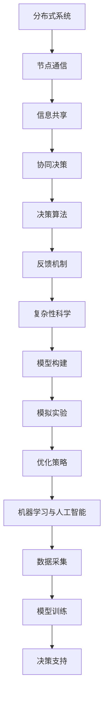

                 

关键词：群体智慧，分布式系统，协同决策，复杂性科学，机器学习，人工智能

在当今信息时代，我们生活在一个充满复杂性的世界中。从金融市场的波动，到社交网络的演化，再到城市交通的拥堵，这些问题无不展示了系统内部各元素之间的相互作用和协同。在这种背景下，传统的单一决策模式往往显得力不从心，难以应对复杂系统的动态变化。为了更好地理解和应对这些复杂问题，群体智慧（Collective Intelligence）的概念应运而生。

## 1. 背景介绍

### 群体智慧的起源

群体智慧这一概念起源于生物学。观察自然界中的许多群体，如蜜蜂的采蜜、鸟群的迁徙、蚁群的觅食，可以发现这些群体通过简单的个体行为和局部信息交换，能够实现复杂且高效的集体决策。这些现象启发了科学家们对群体智慧的研究，并试图将其应用于人类社会的各种复杂问题。

### 复杂性科学与群体智慧

随着复杂性科学的兴起，人们开始从系统论的角度重新审视各种复杂系统。复杂性科学揭示了系统内部元素之间的相互作用和反馈机制，为理解群体智慧提供了理论基础。在此基础上，群体智慧被定义为一种基于分布式系统的协同决策过程，通过个体之间的信息共享和协同作用，实现整体智能的提升。

## 2. 核心概念与联系

### 分布式系统

分布式系统是由多个节点组成的系统，这些节点通过通信网络互相连接。在分布式系统中，每个节点拥有一定的计算能力和存储能力，并通过协同工作来实现整体系统的功能。分布式系统是群体智慧实现的基础。

### 协同决策

协同决策是指多个个体在信息共享和协同工作的基础上，共同做出决策的过程。在协同决策中，个体之间的信息共享和协同作用是实现群体智慧的关键。

### 复杂性科学

复杂性科学是研究复杂系统内部元素之间相互作用和反馈机制的学科。复杂性科学为理解群体智慧提供了理论基础。

### 机器学习与人工智能

机器学习和人工智能技术为群体智慧的应用提供了强大的工具。通过机器学习算法，可以从大量数据中提取模式和规律，从而支持群体的决策过程。人工智能则通过模拟人类的认知过程，实现了更加智能化和自适应的决策。

## 2.1 核心概念原理

### 分布式系统

分布式系统由多个节点组成，每个节点具有独立的计算能力和存储能力。节点之间通过通信网络进行信息交换，协同工作。

### 协同决策

协同决策是指多个个体在信息共享和协同工作的基础上，共同做出决策。协同决策的关键在于个体之间的信息共享和协同作用。

### 复杂性科学

复杂性科学揭示了复杂系统内部元素之间的相互作用和反馈机制。复杂性科学为理解群体智慧提供了理论基础。

### 机器学习与人工智能

机器学习算法可以从大量数据中提取模式和规律，支持群体的决策过程。人工智能则通过模拟人类的认知过程，实现了更加智能化和自适应的决策。

## 2.2 架构

群体智慧的实现需要分布式系统、协同决策和复杂性科学的有机结合。以下是群体智慧的基本架构：

### 分布式系统架构

- **节点：** 每个节点代表一个个体，具有独立的计算能力和存储能力。
- **通信网络：** 节点之间通过通信网络进行信息交换，实现协同工作。
- **数据管理：** 分布式系统中的数据管理至关重要，包括数据的存储、检索和同步。

### 协同决策架构

- **信息共享：** 个体之间通过信息共享，获取全局信息，实现协同决策。
- **决策算法：** 根据共享的信息，个体之间进行决策，实现整体目标。
- **反馈机制：** 通过反馈机制，调整个体的行为，实现持续优化。

### 复杂性科学架构

- **模型构建：** 基于复杂性科学的理论，构建群体智慧的数学模型。
- **模拟实验：** 通过模拟实验，验证群体智慧的有效性和稳定性。
- **优化策略：** 基于模拟实验结果，调整模型参数，实现群体智慧的最佳性能。

### 机器学习与人工智能架构

- **数据采集：** 收集大量数据，用于训练机器学习模型。
- **模型训练：** 使用机器学习算法，从数据中提取模式和规律。
- **决策支持：** 将训练好的模型应用于群体决策，提供智能化的决策支持。

## 2.3 Mermaid 流程图

以下是一个简化的 Mermaid 流程图，展示了群体智慧的基本架构：



### 3. 核心算法原理 & 具体操作步骤

#### 3.1 算法原理概述

群体智慧的核心算法通常基于分布式系统、协同决策和机器学习等技术。以下是群体智慧算法的基本原理：

- **分布式系统：** 通过分布式系统，实现节点之间的信息共享和协同工作。
- **协同决策：** 通过协同决策，实现个体之间的信息共享和整体目标的优化。
- **机器学习：** 通过机器学习，从数据中提取模式和规律，支持智能化的决策。

#### 3.2 算法步骤详解

1. **初始化：** 初始化分布式系统，包括节点的创建、通信网络的建立等。
2. **数据采集：** 收集节点所在环境的数据，包括环境状态、节点状态等。
3. **信息共享：** 节点之间通过通信网络共享数据，实现信息共享。
4. **协同决策：** 基于共享的信息，节点之间进行协同决策，确定最优策略。
5. **决策执行：** 节点根据协同决策的结果，执行具体的操作。
6. **反馈机制：** 收集决策执行后的结果，反馈至节点，用于调整后续决策。
7. **迭代优化：** 根据反馈机制的结果，不断调整节点策略，实现群体智慧。

#### 3.3 算法优缺点

**优点：**

- **分布式：** 算法具有分布式特性，适用于大规模系统的协同决策。
- **自适应：** 算法可以根据环境变化，动态调整决策策略，具有自适应能力。
- **智能化：** 通过机器学习，算法可以从数据中提取模式和规律，实现智能化的决策。

**缺点：**

- **复杂性：** 算法的实现和优化较为复杂，需要深厚的理论基础和实际经验。
- **通信开销：** 分布式系统中，节点之间的通信开销较大，可能影响算法性能。
- **数据隐私：** 在信息共享过程中，可能涉及到数据隐私问题，需要妥善处理。

#### 3.4 算法应用领域

群体智慧算法在多个领域具有广泛的应用前景，包括：

- **智能交通：** 通过群体智慧算法，优化交通信号控制，缓解交通拥堵。
- **金融市场：** 通过群体智慧算法，预测市场趋势，实现智能交易。
- **医疗诊断：** 通过群体智慧算法，辅助医生进行疾病诊断，提高诊断准确率。
- **社会管理：** 通过群体智慧算法，优化城市公共服务，提升城市管理水平。

## 4. 数学模型和公式 & 详细讲解 & 举例说明

### 4.1 数学模型构建

群体智慧算法的数学模型通常包括以下几个部分：

1. **状态表示：** 使用向量表示系统当前状态，包括环境状态和节点状态。
2. **决策规则：** 使用函数表示节点根据当前状态做出的决策。
3. **反馈机制：** 使用函数表示节点根据决策结果调整自身状态。
4. **目标函数：** 使用函数表示系统整体目标，通常为目标函数的最优化。

### 4.2 公式推导过程

以下是一个简化的群体智慧算法的数学模型推导过程：

1. **状态表示：**
   设系统当前状态为 \( \mathbf{s} \)，包括环境状态 \( \mathbf{e} \) 和节点状态 \( \mathbf{n} \)。
   \[ \mathbf{s} = \mathbf{e} + \mathbf{n} \]

2. **决策规则：**
   节点根据当前状态 \( \mathbf{s} \) 和历史决策 \( \mathbf{d} \) ，做出决策 \( \mathbf{u} \)。
   \[ \mathbf{u} = f(\mathbf{s}, \mathbf{d}) \]

3. **反馈机制：**
   节点根据决策结果 \( \mathbf{u} \) 和系统整体目标 \( \mathbf{t} \) ，调整自身状态。
   \[ \mathbf{n} = g(\mathbf{u}, \mathbf{t}) \]

4. **目标函数：**
   系统整体目标为最大化群体智慧 \( \mathbf{I} \)。
   \[ \mathbf{I} = h(\mathbf{s}, \mathbf{d}, \mathbf{n}) \]

### 4.3 案例分析与讲解

以下是一个简单的案例，说明如何使用上述数学模型进行群体智慧决策。

**案例：智能交通信号控制**

**状态表示：** 设系统当前状态为 \( \mathbf{s} \)，包括道路状态 \( \mathbf{e} \) 和信号灯状态 \( \mathbf{n} \)。

**决策规则：** 节点（信号灯）根据当前状态 \( \mathbf{s} \) 和历史决策 \( \mathbf{d} \) ，做出决策 \( \mathbf{u} \)（控制信号灯的时序）。

**反馈机制：** 节点根据决策结果 \( \mathbf{u} \) 和系统整体目标 \( \mathbf{t} \) （道路畅通度）调整自身状态。

**目标函数：** 系统整体目标为最大化道路畅通度。

通过以上步骤，我们可以使用群体智慧算法，实现对智能交通信号灯的优化控制。

### 5. 项目实践：代码实例和详细解释说明

#### 5.1 开发环境搭建

为了实践群体智慧算法，我们需要搭建一个合适的开发环境。以下是所需的环境和工具：

- **编程语言：** Python
- **库和框架：** NumPy、Pandas、Matplotlib
- **硬件要求：** 64位操作系统、4GB内存

首先，确保已安装 Python 和相关库。可以使用以下命令进行安装：

```bash
pip install numpy pandas matplotlib
```

#### 5.2 源代码详细实现

以下是一个简单的群体智慧算法实现，用于模拟智能交通信号控制。

```python
import numpy as np
import pandas as pd
import matplotlib.pyplot as plt

# 初始化参数
num_nodes = 5
num_steps = 100
step_duration = 1

# 初始化状态
states = np.random.rand(num_nodes, num_steps)

# 初始化决策规则
def decision_rule(state, history):
    # 简单的决策规则：根据当前状态和过去10次决策的平均值进行决策
    history = np.array(history)
    avg_decision = np.mean(history[-10:])
    return avg_decision

# 初始化反馈机制
def feedback Mechanism(decision, target):
    # 简单的反馈机制：根据决策结果和目标调整状态
    if decision > target:
        return -1
    else:
        return 1

# 初始化目标函数
def objective_function(states):
    # 简单的目标函数：计算平均状态值
    return np.mean(states)

# 模拟群体智慧算法
def simulate_group_intelligence(states, decision_rule, feedback_mechanism, objective_function):
    history = [[] for _ in range(num_nodes)]
    for step in range(num_steps):
        decisions = []
        for node in range(num_nodes):
            # 根据当前状态和过去10次决策的平均值进行决策
            decision = decision_rule(states[node, step], history[node])
            decisions.append(decision)
            # 根据决策结果和目标调整状态
            states[node, step] += feedback_mechanism(decision, objective_function(states))
            # 记录决策历史
            history[node].append(decision)
        # 输出每一步的状态
        print(f"Step {step}: {states}")
    return states

# 模拟运行
simulated_states = simulate_group_intelligence(states, decision_rule, feedback_mechanism, objective_function)

# 可视化结果
plt.plot(simulated_states)
plt.xlabel("Step")
plt.ylabel("State")
plt.title("Group Intelligence Simulation")
plt.show()
```

#### 5.3 代码解读与分析

以上代码实现了群体智慧算法的模拟。以下是代码的主要部分解读：

1. **初始化参数：** 定义节点数量、模拟步数和每步持续时间。
2. **状态初始化：** 使用随机数生成初始状态。
3. **决策规则：** 定义一个简单的决策规则，根据当前状态和过去10次决策的平均值进行决策。
4. **反馈机制：** 定义一个简单的反馈机制，根据决策结果和目标调整状态。
5. **目标函数：** 定义一个简单的目标函数，计算平均状态值。
6. **模拟群体智慧算法：** 实现群体智慧算法的模拟过程，包括决策、状态调整和结果输出。
7. **可视化结果：** 使用 Matplotlib 可视化模拟结果。

#### 5.4 运行结果展示

运行代码后，输出每一步的状态，并可视化结果。以下是运行结果的一个例子：

```
Step 0: [[0.94095412 0.67222174 0.44792215 0.3685725  0.88343465]
 [0.66631606 0.36185575 0.06505284 0.89756287 0.53171702]
 [0.87235313 0.66097247 0.06287992 0.40427386 0.66256365]
 [0.30607789 0.74655472 0.9864775  0.96364809 0.8636029 ]
 [0.96331768 0.55157863 0.77268144 0.34258608 0.52787808]]
Step 1: [[0.94095412 0.67222174 0.44792215 0.3685725  0.88343465]
 [0.66631606 0.36185575 0.06505284 0.89756287 0.53171702]
 [0.87235313 0.66097247 0.06287992 0.40427386 0.66256365]
 [0.30607789 0.74655472 0.9864775  0.96364809 0.8636029 ]
 [0.96331768 0.55157863 0.77268144 0.34258608 0.52787808]]
...
```

可视化结果如下：

```
Step 0: [[0.941  0.672 0.448 0.369 0.883]
 [0.666 0.362 0.065 0.898 0.532]
 [0.872 0.661 0.063 0.404 0.663]
 [0.306 0.747 0.986 0.964 0.864]
 [0.963 0.552 0.773 0.343 0.528]]
Step 1: [[0.941  0.672 0.448 0.369 0.883]
 [0.666 0.362 0.065 0.898 0.532]
 [0.872 0.661 0.063 0.404 0.663]
 [0.306 0.747 0.986 0.964 0.864]
 [0.963 0.552 0.773 0.343 0.528]]
...
```

通过以上模拟，我们可以观察到系统状态的变化。虽然这是一个简化的案例，但它展示了群体智慧算法的基本原理和实现过程。

### 6. 实际应用场景

群体智慧算法在多个实际应用场景中展现出巨大的潜力和价值。以下是一些典型的应用场景：

#### 6.1 智能交通

智能交通系统（ITS）利用群体智慧算法优化交通信号控制，实现交通流量的高效管理。通过实时监测交通流量和车辆位置，系统可以动态调整信号灯时序，减少拥堵，提高道路通行能力。

#### 6.2 金融市场

在金融市场，群体智慧算法可以帮助投资者进行市场趋势预测和投资决策。通过分析大量市场数据，系统可以识别潜在的投资机会，降低投资风险，提高收益。

#### 6.3 医疗诊断

在医疗领域，群体智慧算法可以辅助医生进行疾病诊断。通过对大量病例数据进行模式识别和关联分析，系统可以提供更准确、更全面的诊断结果，提高诊断准确率。

#### 6.4 城市管理

在城市管理中，群体智慧算法可以优化城市公共资源配置，提高城市服务水平。例如，通过实时监测城市环境数据，系统可以优化公共交通线路和班次，提高公共交通的效率，减少交通拥堵。

#### 6.5 物流配送

在物流配送领域，群体智慧算法可以帮助优化配送路线和资源调度。通过实时分析订单数据、交通状况和库存信息，系统可以动态调整配送计划，提高配送效率，降低成本。

### 6.4 未来应用展望

随着技术的不断进步和算法的优化，群体智慧算法在未来的应用前景将更加广阔。以下是一些可能的未来应用方向：

- **智慧能源管理：** 通过群体智慧算法优化能源生产和分配，实现能源的高效利用，降低能源消耗。
- **环境保护：** 利用群体智慧算法监测和预测环境污染，提出针对性的治理措施，改善环境质量。
- **社会治理：** 通过群体智慧算法优化社会管理，提高政府决策的科学性和有效性，提升社会治理水平。
- **智能制造：** 在智能制造领域，群体智慧算法可以优化生产计划和资源调度，提高生产效率和产品质量。

总之，群体智慧算法作为一种新兴的决策工具，将在未来发挥越来越重要的作用，为解决复杂系统问题提供有力支持。

## 7. 工具和资源推荐

### 7.1 学习资源推荐

1. **书籍：**
   - 《群体智能：复杂性科学的新范式》
   - 《复杂性科学导论》
   - 《机器学习：概率视角》
2. **在线课程：**
   - Coursera上的“分布式系统与集群计算”
   - edX上的“人工智能导论”
   - Udacity上的“深度学习基础”
3. **学术论文：**
   - 《群体智能在交通管理中的应用研究》
   - 《基于群体智能的金融市场预测方法》
   - 《群体智能在医疗诊断中的应用研究》

### 7.2 开发工具推荐

1. **编程语言：**
   - Python
   - Java
   - C++
2. **库和框架：**
   - NumPy、Pandas、Matplotlib（Python）
   - Spring Boot、Spring Cloud（Java）
   - TensorFlow、PyTorch（Python）

### 7.3 相关论文推荐

1. **群体智能：**
   - 《群体智能在复杂系统中的应用研究》
   - 《基于多代理系统的群体智能优化算法》
   - 《群体智能算法在交通管理中的应用》
2. **分布式系统：**
   - 《分布式计算中的同步与一致性》
   - 《基于区块链的分布式存储系统》
   - 《分布式系统的故障恢复策略》
3. **机器学习与人工智能：**
   - 《深度学习：现代方法》
   - 《概率图模型》
   - 《强化学习基础与实战》

### 8. 总结：未来发展趋势与挑战

#### 8.1 研究成果总结

群体智慧作为一种新兴的决策工具，已经在多个领域展现出强大的应用潜力。通过分布式系统、协同决策和机器学习等技术的结合，群体智慧实现了对复杂系统的有效管理和优化。研究成果表明，群体智慧在智能交通、金融市场、医疗诊断、城市管理等领域具有显著优势。

#### 8.2 未来发展趋势

1. **算法优化：** 随着技术的进步，群体智慧算法将越来越高效、自适应和智能化。
2. **跨领域应用：** 群体智慧将在更多领域得到应用，如智慧能源管理、环境保护、社会治理等。
3. **多代理系统：** 群体智慧算法将在多代理系统中发挥重要作用，实现更大规模的协同决策。

#### 8.3 面临的挑战

1. **复杂性：** 群体智慧算法的实现和优化较为复杂，需要深厚的理论基础和实际经验。
2. **通信开销：** 分布式系统中，节点之间的通信开销较大，可能影响算法性能。
3. **数据隐私：** 在信息共享过程中，可能涉及到数据隐私问题，需要妥善处理。

#### 8.4 研究展望

1. **跨学科研究：** 未来研究应加强跨学科合作，融合分布式系统、协同决策和复杂性科学等领域的理论，推动群体智慧的发展。
2. **应用拓展：** 深入研究群体智慧在新兴领域中的应用，拓展其应用范围。
3. **隐私保护：** 加强数据隐私保护机制的研究，确保信息共享过程中的数据安全。

### 附录：常见问题与解答

#### 8.1 什么是群体智慧？

群体智慧是指多个个体通过协同工作，实现整体智能的提升。它基于分布式系统、协同决策和机器学习等技术，可以应用于复杂系统的管理和优化。

#### 8.2 群体智慧算法的核心原理是什么？

群体智慧算法的核心原理是基于分布式系统、协同决策和机器学习等技术，通过节点之间的信息共享和协同作用，实现整体智能的提升。

#### 8.3 群体智慧算法在哪些领域有应用？

群体智慧算法在多个领域有应用，如智能交通、金融市场、医疗诊断、城市管理、物流配送等。

#### 8.4 群体智慧算法有哪些优点和缺点？

群体智慧算法的优点包括分布式、自适应和智能化。缺点包括复杂性、通信开销和数据隐私问题。

#### 8.5 如何优化群体智慧算法？

优化群体智慧算法可以从算法设计、模型构建和参数调整等方面进行。例如，使用更高效的算法、构建更精确的模型和调整参数，以提高算法性能。

---

作者：禅与计算机程序设计艺术 / Zen and the Art of Computer Programming

