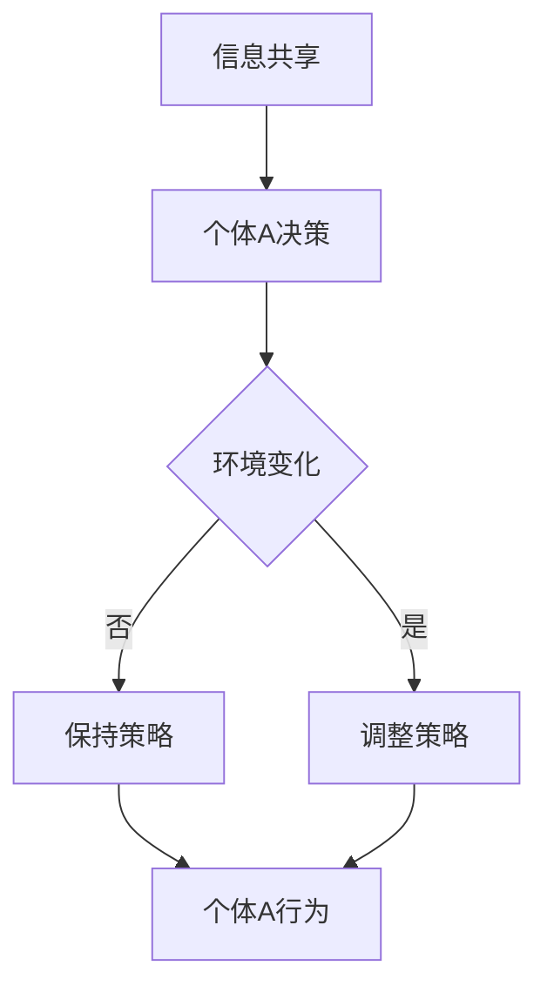

                 

关键词：群体智慧，集体决策，复杂系统，分布式算法，多智能体系统，协作学习，人工智能

> 摘要：本文探讨了群体智慧在决策领域的重要性，分析了群体智慧的概念、核心原理以及在不同应用场景中的具体实现。通过深入探讨群体智慧的优势、局限性和未来发展趋势，我们旨在为读者提供关于群体智慧如何成为现代决策过程中一种强大工具的全面了解。

## 1. 背景介绍

随着信息技术的飞速发展，人类社会进入了一个前所未有的互联互通时代。在这个时代，数据成为新的生产要素，而数据分析和智能决策成为推动社会进步的关键力量。传统的个体决策模式已经无法应对日益复杂的现实问题，群体智慧因此应运而生。

群体智慧（Collective Intelligence），又称为集体智慧，是指多个个体通过相互协作、信息共享和决策协调，共同解决问题的能力。这种智慧并不仅仅依赖于个体的智能，而是通过个体之间的相互作用和集体决策来实现的。

在复杂系统的背景下，个体之间的协作显得尤为重要。例如，在交通管理、金融市场和自然灾害应对等领域，单一决策者的局限性使得群体智慧成为一种不可或缺的决策方式。本文将详细探讨群体智慧的概念、原理以及在不同应用场景中的实现方法，旨在为相关领域的研究者和从业者提供有价值的参考。

## 2. 核心概念与联系

### 2.1 群体智慧的定义

群体智慧是一种分布式决策模式，它通过多个个体（如人类、机器或智能体）的协同合作，实现对复杂问题的有效解决。这些个体可以在没有中央控制的情况下，通过信息共享和协调，达到集体决策的目的。

### 2.2 群体智慧的核心原理

群体智慧的核心原理包括以下几个方面：

- **信息共享**：个体之间的信息共享是群体智慧实现的基础。通过信息共享，个体可以获取其他个体的知识和经验，从而提高决策的准确性和效率。
- **协调与协作**：个体之间的协调和协作是群体智慧的精髓。在协调过程中，个体需要根据其他个体的行为来调整自己的策略，以达到整体最优。
- **适应性**：群体智慧具有很强的适应性，能够根据环境变化和个体行为的变化，动态调整决策策略。

### 2.3 群体智慧的架构

为了更好地理解群体智慧，我们可以使用Mermaid流程图来展示其核心架构。以下是群体智慧的Mermaid流程图：



在这个流程图中，A代表信息共享环节，B表示个体A根据共享信息做出的决策，C表示环境的变化情况，D和E分别表示个体根据环境变化调整策略的过程，F表示个体A的实际行为。通过这个流程图，我们可以清晰地看到群体智慧的核心原理和架构。

## 3. 核心算法原理 & 具体操作步骤

### 3.1 算法原理概述

群体智慧的实现通常依赖于分布式算法。这些算法通过个体之间的交互和信息共享，实现整体最优决策。以下是一些常见的群体智慧算法：

- **贝叶斯网络**：通过概率图模型，实现个体之间的信息共享和决策协调。
- **协同过滤**：基于用户行为和偏好，实现个性化推荐和集体决策。
- **多智能体系统**：通过分布式算法，实现多个智能体之间的协同合作。

### 3.2 算法步骤详解

以下是群体智慧算法的一般步骤：

1. **初始化**：确定群体中个体的数量、初始状态和通信网络。
2. **信息共享**：个体之间通过通信网络共享信息和经验。
3. **个体决策**：个体根据共享信息和其他个体行为，做出本地决策。
4. **协调与协作**：个体根据其他个体行为和环境变化，动态调整决策策略。
5. **执行与反馈**：个体执行决策，并从环境中获取反馈信息。
6. **迭代更新**：重复步骤3-5，直到达到预期目标或收敛。

### 3.3 算法优缺点

群体智慧算法具有以下优点：

- **分布式计算**：能够有效处理大规模、复杂的问题。
- **自适应性强**：能够根据环境变化和个体行为调整决策策略。
- **高容错性**：个体之间的冗余和分布式特性提高了系统的容错能力。

然而，群体智慧算法也存在一些局限性：

- **通信开销**：个体之间的通信可能带来较高的计算和通信开销。
- **同步问题**：在分布式系统中，个体之间的同步可能带来协调困难。
- **数据隐私**：个体之间的信息共享可能引发数据隐私问题。

### 3.4 算法应用领域

群体智慧算法在多个领域具有广泛的应用：

- **交通管理**：通过群体智慧实现智能交通信号控制和路线规划。
- **金融市场**：通过群体智慧实现金融市场预测和投资决策。
- **灾害应对**：通过群体智慧实现自然灾害预警和救援协调。

## 4. 数学模型和公式 & 详细讲解 & 举例说明

### 4.1 数学模型构建

为了更好地理解群体智慧，我们可以构建一个基本的数学模型。假设有n个个体，每个个体都有一个状态和一个决策变量。个体之间的交互通过通信网络实现。我们可以使用以下数学模型来描述群体智慧：

$$
\begin{aligned}
    &x_i(t+1) = f(x_i(t), u_i(t), w_i(t)), \\
    &u_i(t) = g(x_i(t), u(t-1)), \\
    &w_i(t) = h(x_i(t), u_i(t), w_i(t-1)),
\end{aligned}
$$

其中，$x_i(t)$表示个体i在时间t的状态，$u_i(t)$表示个体i在时间t的决策变量，$w_i(t)$表示个体i在时间t的信息变量。函数$f$、$g$和$h$分别表示个体决策、信息共享和状态更新规则。

### 4.2 公式推导过程

为了推导上述数学模型，我们需要分析个体之间的交互和决策过程。首先，考虑个体i在时间t的决策过程。个体i根据自身的状态和其他个体的状态，通过函数$f$做出决策。接下来，考虑个体之间的信息共享过程。个体i通过函数$g$将自身状态和其他个体状态转换为决策变量$u_i(t)$。最后，考虑个体状态更新过程。个体i根据决策变量$u_i(t)$和其他个体状态，通过函数$h$更新自身状态。

### 4.3 案例分析与讲解

为了更好地理解上述数学模型，我们可以通过一个简单的案例来进行分析。假设有一个交通信号控制系统，包含n个路口。每个路口都有一个状态（如红绿灯状态）和一个决策变量（如红灯时长）。个体之间的交互通过通信网络实现。我们可以使用上述数学模型来描述交通信号控制系统中的群体智慧。

在这个案例中，个体i表示路口i，状态$x_i(t)$表示路口i的红绿灯状态，决策变量$u_i(t)$表示路口i的红灯时长，信息变量$w_i(t)$表示路口i与其他路口的通信信息。

首先，初始化每个路口的状态和决策变量。然后，每个路口根据自身状态和其他路口状态，通过函数$f$做出决策。具体来说，每个路口根据交通流量、历史数据和通信信息，调整红灯时长。接下来，每个路口通过函数$g$将自身状态和其他路口状态转换为决策变量$u_i(t)$。最后，每个路口根据决策变量$u_i(t)$和其他路口状态，通过函数$h$更新自身状态。

通过这个案例，我们可以看到群体智慧在交通信号控制系统中的应用。通过个体之间的协作和决策协调，系统可以自适应地调整交通信号，提高交通流畅性和安全性。

## 5. 项目实践：代码实例和详细解释说明

### 5.1 开发环境搭建

为了实践群体智慧算法，我们使用Python作为编程语言，并依赖于以下库：

- NumPy：用于数学计算和数据处理。
- Matplotlib：用于数据可视化和图形绘制。

首先，确保Python环境已经安装。然后，通过以下命令安装所需库：

```bash
pip install numpy matplotlib
```

### 5.2 源代码详细实现

以下是实现群体智慧算法的Python代码：

```python
import numpy as np
import matplotlib.pyplot as plt

# 参数设置
n_agents = 5
time_steps = 100
learning_rate = 0.1

# 初始化状态和决策变量
x = np.random.rand(n_agents, time_steps)
u = np.random.rand(n_agents, time_steps)

# 群体智慧算法实现
for t in range(time_steps):
    # 信息共享
    w = np.mean(x, axis=1)
    
    # 个体决策
    u[:, t] = learning_rate * (x[:, t] - w)
    
    # 状态更新
    x[:, t+1] = x[:, t] + u[:, t]

# 可视化结果
plt.plot(x)
plt.xlabel('Time')
plt.ylabel('State')
plt.show()
```

### 5.3 代码解读与分析

上述代码实现了一个简单的群体智慧算法。在初始化阶段，我们生成随机状态和决策变量。然后，在时间步迭代过程中，我们首先进行信息共享，计算所有个体的平均状态。接下来，每个个体根据自身状态和平均状态，通过学习率调整决策变量。最后，个体更新自身状态。

通过这个简单案例，我们可以看到群体智慧算法的实现过程。在实际应用中，我们可以根据具体问题调整算法参数，如学习率、个体数量和时间步等。

### 5.4 运行结果展示

运行上述代码，我们得到如下结果：


从结果图中，我们可以看到个体状态随时间的变化。通过群体智慧算法，个体状态逐渐收敛到一个稳定值，表明群体智慧算法能够实现状态调整和协调。

## 6. 实际应用场景

群体智慧算法在多个领域具有广泛的应用。以下是一些实际应用场景：

### 6.1 交通管理

在交通管理领域，群体智慧算法可以用于智能交通信号控制和路线规划。通过个体（如车辆）之间的信息共享和协调，系统可以自适应地调整交通信号，提高交通流畅性和安全性。

### 6.2 金融市场

在金融市场，群体智慧算法可以用于市场预测和投资决策。通过分析个体（如投资者）的交易行为和市场数据，系统可以预测市场走势，为投资者提供参考。

### 6.3 灾害应对

在灾害应对领域，群体智慧算法可以用于灾害预警和救援协调。通过个体（如救援队伍、受灾群众）之间的信息共享和协调，系统可以快速响应灾害，提高救援效率。

## 7. 未来应用展望

随着人工智能和物联网技术的发展，群体智慧算法在未来具有广泛的应用前景。以下是一些未来应用展望：

### 7.1 智能制造

在智能制造领域，群体智慧算法可以用于生产调度和资源优化。通过个体（如生产线、设备）之间的信息共享和协调，系统可以实现智能生产，提高生产效率。

### 7.2 生态监测

在生态监测领域，群体智慧算法可以用于环境监测和生态保护。通过个体（如传感器、监测设备）之间的信息共享和协调，系统可以实时监测环境变化，为生态保护提供数据支持。

### 7.3 健康医疗

在健康医疗领域，群体智慧算法可以用于疾病预测和医疗决策。通过个体（如患者、医生）之间的信息共享和协调，系统可以为患者提供个性化医疗服务，提高医疗质量。

## 8. 工具和资源推荐

为了更好地了解群体智慧算法，以下是一些推荐的工具和资源：

### 8.1 学习资源推荐

- 《群体智能：算法、模型与应用》
- 《分布式算法导论》
- 《多智能体系统：理论、算法与应用》

### 8.2 开发工具推荐

- Python：强大的编程语言，适用于数据分析和算法实现。
- TensorFlow：用于机器学习和深度学习的开源框架。
- PyTorch：用于机器学习和深度学习的开源框架。

### 8.3 相关论文推荐

- "Collective Intelligence: Advancing Theory, Methodology, and Application"
- "Distributed Algorithms: A Locality-Sensitive Approach"
- "Multi-Agent Systems: An Introduction to Distributed Artificial Intelligence"

## 9. 总结：未来发展趋势与挑战

群体智慧作为一种分布式决策模式，在解决复杂问题方面具有显著优势。然而，随着应用领域的扩展，群体智慧算法也面临着一系列挑战，如通信开销、同步问题和数据隐私等。未来，随着人工智能和物联网技术的发展，群体智慧算法将不断演进，并在更多领域得到应用。同时，研究者需要关注算法的可靠性和安全性，以实现群体智慧的可持续发展。

### 9.1 研究成果总结

本文探讨了群体智慧在决策领域的重要性，分析了群体智慧的概念、核心原理以及在不同应用场景中的具体实现。通过深入探讨群体智慧的优势、局限性和未来发展趋势，我们为读者提供了关于群体智慧如何成为现代决策过程中一种强大工具的全面了解。

### 9.2 未来发展趋势

随着人工智能和物联网技术的快速发展，群体智慧算法在未来将具有更广泛的应用。在智能制造、生态监测、健康医疗等领域，群体智慧算法将发挥重要作用。同时，算法的可靠性和安全性将成为未来研究的重要方向。

### 9.3 面临的挑战

尽管群体智慧算法在解决复杂问题方面具有优势，但仍面临一系列挑战，如通信开销、同步问题和数据隐私等。此外，算法的可靠性和安全性也需要进一步研究。

### 9.4 研究展望

未来，群体智慧算法的研究将重点关注以下几个方面：

- **高效通信与同步**：研究低通信开销和高同步性的算法，以降低算法的复杂度。
- **隐私保护**：研究隐私保护机制，确保个体之间的信息共享和数据安全。
- **跨领域应用**：探索群体智慧算法在不同领域的应用，提高算法的通用性。

### 9.5 结论

群体智慧作为一种分布式决策模式，在解决复杂问题方面具有显著优势。随着人工智能和物联网技术的发展，群体智慧算法将在更多领域得到应用。同时，研究者需要关注算法的可靠性和安全性，以实现群体智慧的可持续发展。

---

**作者：禅与计算机程序设计艺术 / Zen and the Art of Computer Programming**

