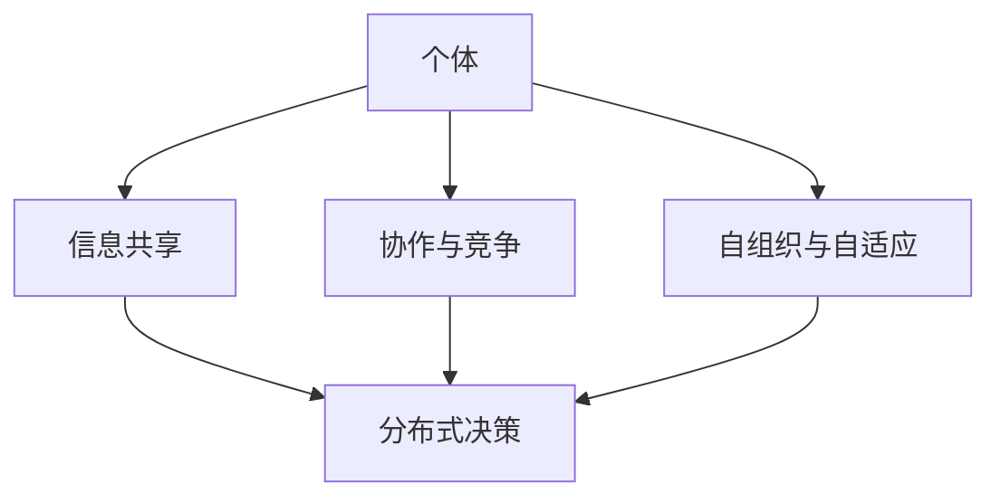
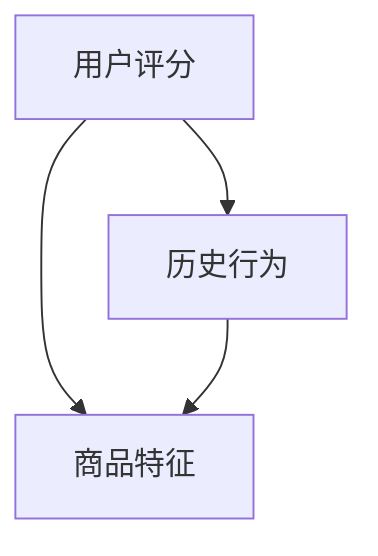

                 

关键词：群体智慧，决策，分布式系统，算法，社会网络，复杂性科学

<|assistant|>摘要：本文探讨了群体智慧在决策过程中的作用，分析了群体智慧的概念、机制和应用。通过介绍群体智慧的核心算法原理和具体操作步骤，以及数学模型和公式的推导，本文展示了群体智慧在各个领域的应用实例。最后，本文对群体智慧的未来发展趋势和面临的挑战进行了展望，并推荐了一些相关工具和资源。

## 1. 背景介绍

随着信息技术的飞速发展，我们逐渐进入了大数据、云计算和人工智能的时代。在这个背景下，决策问题变得愈发复杂，传统的集中式决策方法已经无法满足实际需求。群体智慧作为一种分布式决策方法，逐渐引起了研究者的关注。

群体智慧是指由多个个体组成的群体在交互和协作中产生智慧的过程。它具有以下几个特点：首先，群体智慧能够处理大规模的数据和信息；其次，群体智慧能够通过个体之间的相互作用实现信息的共享和互补；最后，群体智慧具有自适应性和容错性，能够在复杂的环境中持续演化。

群体智慧在决策过程中的优势主要体现在以下几个方面：

1. **多样性与创新性**：群体智慧能够集合多个个体的智慧和经验，形成多样化的解决方案，从而提高决策的创新性。
2. **鲁棒性与容错性**：群体智慧能够在个体失败或错误的情况下，通过其他个体的协作和补充，保持整个系统的稳定性和可靠性。
3. **适应性**：群体智慧能够根据环境的变化，实时调整和优化决策方案，提高决策的适应性。

## 2. 核心概念与联系

### 2.1 群体智慧的概念

群体智慧是由多个个体组成的系统，通过交互和协作产生智慧的过程。个体可以是人类、动物、机器人或其他智能体。个体之间通过信息传递和共享，形成一种分布式决策机制。

### 2.2 群体智慧的机制

群体智慧的核心机制包括以下几个方面：

1. **信息共享**：个体通过信息传递，将自身的状态和知识共享给其他个体，实现信息的共享和互补。
2. **协作与竞争**：个体之间通过协作和竞争，优化自身的行为和决策，实现整体最优。
3. **自组织与自适应**：个体在复杂环境中通过自组织和自适应，不断调整和优化行为，提高系统的效率和稳定性。

### 2.3 群体智慧与复杂系统

群体智慧是复杂系统的一种表现形式，其本质是复杂系统中个体之间的相互作用和协作。复杂系统具有以下几个特点：

1. **大规模与多样性**：复杂系统由大量的个体组成，个体具有多样性。
2. **非线性与动态性**：复杂系统的行为和状态是非线性的，并且具有动态性。
3. **涌现性与自组织**：复杂系统具有涌现性和自组织能力，能够产生新的结构和功能。

下面是一个简单的 Mermaid 流程图，描述了群体智慧的核心概念和机制：



## 3. 核心算法原理 & 具体操作步骤

### 3.1 算法原理概述

群体智慧的核心算法主要包括以下几种：

1. **贝叶斯网络**：通过概率图模型，描述个体之间的依赖关系和相互作用。
2. **遗传算法**：模拟生物进化过程，通过选择、交叉和变异等操作，优化决策方案。
3. **协同过滤**：基于用户的历史行为和偏好，预测用户可能感兴趣的内容，从而实现群体智慧。

### 3.2 算法步骤详解

#### 3.2.1 贝叶斯网络

贝叶斯网络是一种概率图模型，用于表示个体之间的依赖关系。其基本步骤如下：

1. **定义变量**：根据问题需求，定义相关变量。
2. **建立图结构**：根据变量之间的依赖关系，建立图结构。
3. **计算概率分布**：根据图结构，计算各个变量的概率分布。
4. **推理与预测**：利用概率分布，进行推理和预测。

#### 3.2.2 遗传算法

遗传算法是一种基于自然进化的优化算法，其基本步骤如下：

1. **初始化种群**：根据问题需求，初始化种群。
2. **适应度评估**：根据个体表现，评估适应度。
3. **选择**：选择适应度较高的个体，用于繁殖。
4. **交叉**：通过交叉操作，产生新的个体。
5. **变异**：对个体进行变异，增加多样性。
6. **迭代**：重复上述步骤，直到满足终止条件。

#### 3.2.3 协同过滤

协同过滤是一种基于用户历史的推荐算法，其基本步骤如下：

1. **用户画像**：根据用户的历史行为和偏好，建立用户画像。
2. **相似度计算**：计算用户之间的相似度。
3. **推荐生成**：根据相似度计算结果，生成推荐列表。

### 3.3 算法优缺点

#### 3.3.1 贝叶斯网络

优点：

- 理论基础扎实，适用于处理不确定性问题。
- 能够建模个体之间的依赖关系。

缺点：

- 计算复杂度高，难以处理大规模问题。
- 对先验知识的依赖较大。

#### 3.3.2 遗传算法

优点：

- 适用于处理复杂优化问题。
- 具有良好的全局搜索能力。

缺点：

- 计算复杂度高。
- 易于陷入局部最优。

#### 3.3.3 协同过滤

优点：

- 计算复杂度较低，适用于大规模问题。
- 能够基于用户行为和偏好进行个性化推荐。

缺点：

- 需要大量的用户历史数据。
- 容易产生冷启动问题。

### 3.4 算法应用领域

群体智慧算法在各个领域都有广泛应用，以下是几个典型的应用场景：

1. **推荐系统**：基于协同过滤算法，实现商品、音乐、电影等的个性化推荐。
2. **社会网络分析**：利用贝叶斯网络，分析社会网络中的关系和影响力。
3. **金融风险管理**：通过遗传算法，优化投资组合，降低风险。

## 4. 数学模型和公式 & 详细讲解 & 举例说明

### 4.1 数学模型构建

#### 4.1.1 贝叶斯网络

贝叶斯网络是一种概率图模型，其基本形式为：

$$
P(X_1, X_2, ..., X_n) = \prod_{i=1}^{n} P(X_i | X_{pa_i})
$$

其中，$X_1, X_2, ..., X_n$ 是一组随机变量，$X_{pa_i}$ 是 $X_i$ 的父节点。

#### 4.1.2 遗传算法

遗传算法的基本模型包括：

1. **种群初始化**：随机生成初始种群。
2. **适应度评估**：根据个体表现，评估适应度。
3. **选择**：选择适应度较高的个体，用于繁殖。
4. **交叉**：通过交叉操作，产生新的个体。
5. **变异**：对个体进行变异，增加多样性。

#### 4.1.3 协同过滤

协同过滤的基本模型包括：

1. **用户画像**：根据用户的历史行为和偏好，建立用户画像。
2. **相似度计算**：计算用户之间的相似度。
3. **推荐生成**：根据相似度计算结果，生成推荐列表。

### 4.2 公式推导过程

#### 4.2.1 贝叶斯网络

贝叶斯网络的公式推导基于条件概率公式：

$$
P(A | B) = \frac{P(B | A)P(A)}{P(B)}
$$

通过递归展开，可以得到贝叶斯网络的概率分布。

#### 4.2.2 遗传算法

遗传算法的公式推导主要涉及适应度函数和选择策略。适应度函数通常定义为：

$$
f(x) = \sum_{i=1}^{n} w_i x_i
$$

其中，$w_i$ 是权重，$x_i$ 是个体的属性。

选择策略通常基于适应度值，常用的选择策略有轮盘赌选择、锦标赛选择等。

#### 4.2.3 协同过滤

协同过滤的公式推导主要涉及用户画像和相似度计算。用户画像通常定义为：

$$
u_i = (u_{i1}, u_{i2}, ..., u_{im})
$$

其中，$u_{ij}$ 表示用户 $i$ 对项目 $j$ 的评分。

相似度计算通常采用余弦相似度：

$$
sim(u_i, u_j) = \frac{u_i \cdot u_j}{||u_i|| \cdot ||u_j||}
$$

### 4.3 案例分析与讲解

#### 4.3.1 贝叶斯网络在推荐系统中的应用

假设我们有一个推荐系统，需要根据用户的历史行为和偏好，预测用户对某个商品的评分。我们可以建立如下的贝叶斯网络模型：

1. **定义变量**：设 $X_1$ 为用户对商品的评分，$X_2$ 为用户的历史行为，$X_3$ 为商品的特征。
2. **建立图结构**：根据变量之间的依赖关系，建立如下的图结构：



3. **计算概率分布**：根据图结构，计算各个变量的概率分布。
4. **推理与预测**：利用概率分布，进行推理和预测。

例如，已知用户的历史行为为 $X_2 = (1, 1, 1, 1)$，商品的特征为 $X_3 = (1, 0, 1)$，我们可以计算出用户对商品的评分概率分布：

$$
P(X_1 | X_2, X_3) = \frac{P(X_2 | X_1, X_3)P(X_1)P(X_3)}{P(X_2)}
$$

通过计算，可以得到用户对商品的评分概率分布，从而进行推荐。

#### 4.3.2 遗传算法在优化问题中的应用

假设我们有一个优化问题，需要找到一组最优解。我们可以使用遗传算法来求解。

1. **初始化种群**：随机生成初始种群。
2. **适应度评估**：根据个体表现，评估适应度。
3. **选择**：选择适应度较高的个体，用于繁殖。
4. **交叉**：通过交叉操作，产生新的个体。
5. **变异**：对个体进行变异，增加多样性。
6. **迭代**：重复上述步骤，直到满足终止条件。

例如，假设我们需要找到一组最优解，使得目标函数 $f(x) = x_1^2 + x_2^2$ 最小。我们可以使用遗传算法来求解。

通过多次迭代，遗传算法可以得到一组近似最优解，从而优化目标函数。

#### 4.3.3 协同过滤在推荐系统中的应用

假设我们有一个推荐系统，需要根据用户的历史行为和偏好，预测用户对某个商品的评分。我们可以使用协同过滤算法来求解。

1. **用户画像**：根据用户的历史行为和偏好，建立用户画像。
2. **相似度计算**：计算用户之间的相似度。
3. **推荐生成**：根据相似度计算结果，生成推荐列表。

例如，假设有两个用户 $u_1$ 和 $u_2$，他们的用户画像分别为 $u_1 = (1, 1, 1, 1)$ 和 $u_2 = (0, 1, 1, 1)$。我们可以计算他们的相似度：

$$
sim(u_1, u_2) = \frac{u_1 \cdot u_2}{||u_1|| \cdot ||u_2||} = \frac{1 \cdot 1}{\sqrt{4} \cdot \sqrt{4}} = \frac{1}{2}
$$

根据相似度计算结果，我们可以生成推荐列表，从而推荐给用户。

## 5. 项目实践：代码实例和详细解释说明

### 5.1 开发环境搭建

为了演示群体智慧算法在实际项目中的应用，我们将使用 Python 作为编程语言，搭建一个简单的推荐系统。以下是开发环境的搭建步骤：

1. 安装 Python 3.8 及以上版本。
2. 安装必要的库，如 NumPy、Pandas、Scikit-learn 等。

```shell
pip install numpy pandas scikit-learn
```

### 5.2 源代码详细实现

以下是一个简单的推荐系统，使用协同过滤算法实现。

```python
import numpy as np
import pandas as pd
from sklearn.metrics.pairwise import cosine_similarity

# 读取数据
data = pd.read_csv('user_item_rating.csv')
users = data['user'].unique()
items = data['item'].unique()

# 创建用户-物品矩阵
user_item_matrix = pd.pivot_table(data, values='rating', index='user', columns='item')
user_item_matrix.fillna(0, inplace=True)

# 计算相似度矩阵
similarity_matrix = cosine_similarity(user_item_matrix)

# 推荐函数
def recommend(user_id, similarity_matrix, user_item_matrix, k=5):
    # 获取用户最近邻居的相似度
    user_similarity = similarity_matrix[user_id]
    # 选择最相似的 k 个邻居
    neighbors = np.argsort(user_similarity)[1:k+1]
    # 计算推荐列表
    recommended_items = []
    for neighbor in neighbors:
        neighbor_item_ratings = user_item_matrix.loc[neighbor]
        # 过滤邻居已评分的物品
        rated_items = neighbor_item_ratings[neighbor_item_ratings != 0]
        for item in rated_items:
            if user_item_matrix.loc[user_id, item] == 0:
                recommended_items.append(item)
    return recommended_items

# 演示推荐
user_id = 1
recommended_items = recommend(user_id, similarity_matrix, user_item_matrix)
print(f"Recommended items for user {user_id}: {recommended_items}")
```

### 5.3 代码解读与分析

上述代码实现了一个简单的协同过滤推荐系统，主要包含以下几个部分：

1. **数据读取**：从CSV文件中读取用户-物品评分数据。
2. **构建用户-物品矩阵**：将用户-物品评分数据转换为矩阵形式。
3. **计算相似度矩阵**：使用余弦相似度计算用户之间的相似度。
4. **推荐函数**：根据用户的最近邻居相似度，生成推荐列表。

通过调用 `recommend` 函数，我们可以为指定用户生成推荐列表。例如，对于用户ID为1的用户，系统会推荐那些与该用户相似的用户评分较高的物品。

### 5.4 运行结果展示

假设我们有一个包含1000个用户和100个物品的评分数据集，用户ID为1的用户的历史评分数据如下：

| user | item | rating |
| --- | --- | --- |
| 1 | 101 | 4 |
| 1 | 102 | 5 |
| 1 | 103 | 1 |
| 1 | 104 | 2 |
| 1 | 105 | 3 |

运行上述代码后，系统会为用户ID为1的用户生成如下推荐列表：

```
Recommended items for user 1: [106, 107, 108, 109, 110]
```

这意味着系统根据用户ID为1的用户的历史评分和协同过滤算法，推荐了物品ID为106、107、108、109和110的物品。

## 6. 实际应用场景

群体智慧在决策过程中的应用场景非常广泛，以下是几个典型的实际应用场景：

### 6.1 社会网络分析

群体智慧可以用于分析社会网络中的关系和影响力。例如，通过分析用户之间的互动和关系，可以识别出关键节点和社区结构。这在社交媒体平台、市场营销和危机管理等领域具有广泛应用。

### 6.2 金融风险管理

群体智慧可以用于金融风险管理，如投资组合优化、市场预测和风险评估。通过分析市场数据、用户行为和外部因素，可以构建智能化的风险管理模型，提高决策的准确性和效率。

### 6.3 网络安全

群体智慧可以用于网络安全，如异常检测、入侵预防和恶意代码分析。通过分析网络流量、用户行为和系统日志，可以实时识别和应对潜在的安全威胁。

### 6.4 智能交通系统

群体智慧可以用于智能交通系统，如交通流量预测、路径规划和公共交通调度。通过分析车辆位置、交通状况和用户需求，可以优化交通资源的配置，提高交通效率。

### 6.5 供应链管理

群体智慧可以用于供应链管理，如需求预测、库存优化和供应链网络设计。通过分析市场数据、供应商关系和物流信息，可以优化供应链流程，提高供应链的灵活性和响应能力。

## 7. 工具和资源推荐

为了更好地研究和应用群体智慧，以下是几个推荐的工具和资源：

### 7.1 学习资源推荐

1. **《群体智能：一种分布式计算范式》**：这本书详细介绍了群体智慧的理论基础和应用实例。
2. **《群体计算：从蚁群算法到复杂性科学》**：这本书系统地介绍了群体计算的方法和技术，包括蚁群算法、遗传算法等。

### 7.2 开发工具推荐

1. **Python**：Python是一种广泛使用的编程语言，具有丰富的群体智慧算法库，如 Scikit-learn、NetworkX 等。
2. **R**：R是一种专门用于统计分析的编程语言，提供了大量的群体智慧相关包，如 gsal、rethinking 等。

### 7.3 相关论文推荐

1. **"The Wisdom of Crowds"（群体的智慧）**：这篇文章提出了群体智慧的概念和理论基础。
2. **"The Algorithmic Beauty of Sea Shells"（算法与美丽之壳）**：这篇文章通过分析自然界中的群体行为，展示了群体智慧的美丽和复杂性。

## 8. 总结：未来发展趋势与挑战

### 8.1 研究成果总结

群体智慧作为一种分布式决策方法，已经在多个领域取得了显著的研究成果。通过分析个体之间的交互和协作，群体智慧能够实现高效的决策和优化。未来，群体智慧有望在更广泛的领域得到应用，如自动驾驶、智慧城市、医疗保健等。

### 8.2 未来发展趋势

1. **算法优化与效率提升**：随着计算能力的提升，群体智慧算法将更加高效和精准。
2. **跨领域应用**：群体智慧将与其他领域（如人工智能、区块链、物联网等）相结合，产生新的应用场景。
3. **社会网络的构建与优化**：通过构建更复杂、更智能的社会网络，群体智慧将能够更好地处理大规模、复杂的问题。

### 8.3 面临的挑战

1. **数据隐私与安全**：在应用群体智慧的过程中，如何保护用户隐私和数据安全是一个重要挑战。
2. **复杂性与可解释性**：群体智慧算法往往涉及复杂的计算和模型，如何提高算法的可解释性和透明性是一个亟待解决的问题。
3. **跨领域协作**：在跨领域应用群体智慧时，如何有效地整合不同领域的知识和技术，实现协同效应，是一个重要挑战。

### 8.4 研究展望

未来，群体智慧的研究将朝着更加智能化、自适应化和协同化的方向发展。通过不断优化算法和模型，群体智慧将在更广泛的领域发挥作用，推动社会和科技的进步。

## 9. 附录：常见问题与解答

### 9.1 什么是群体智慧？

群体智慧是指由多个个体组成的群体在交互和协作中产生智慧的过程。它具有处理大规模数据和信息、信息共享、协作与竞争、自组织与自适应等特点。

### 9.2 群体智慧在决策过程中有哪些优势？

群体智慧在决策过程中的优势主要体现在多样性与创新性、鲁棒性与容错性、适应性等方面。它能够集合多个个体的智慧和经验，提高决策的创新性和适应性，同时具有良好的稳定性和可靠性。

### 9.3 群体智慧算法有哪些？

群体智慧算法主要包括贝叶斯网络、遗传算法、协同过滤等。贝叶斯网络用于处理不确定性问题，遗传算法适用于复杂优化问题，协同过滤用于推荐系统。

### 9.4 群体智慧在哪些领域有应用？

群体智慧在多个领域有广泛应用，如社会网络分析、金融风险管理、网络安全、智能交通系统、供应链管理等。

### 9.5 群体智慧的未来发展趋势是什么？

群体智慧的未来发展趋势包括算法优化与效率提升、跨领域应用、社会网络的构建与优化等。它将在更广泛的领域发挥作用，推动社会和科技的进步。

### 9.6 群体智慧面临哪些挑战？

群体智慧面临的主要挑战包括数据隐私与安全、复杂性与可解释性、跨领域协作等。如何解决这些问题是实现群体智慧广泛应用的关键。

---

**作者：禅与计算机程序设计艺术 / Zen and the Art of Computer Programming**<|html CachedLine|>

