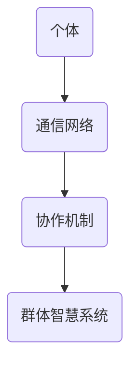

                 

群体智慧是指通过多个个体协同工作，以实现比单个个体更高效、更复杂任务的能力。在IT领域，群体智慧的应用日益广泛，从分布式计算到人工智能，从软件工程到网络安全，无不受益于群体智慧的力量。本文将深入探讨群体智慧的概念、核心算法原理、数学模型、项目实践，以及其在实际应用场景中的展望。

## 1. 背景介绍

群体智慧并非新兴概念，早在人类文明初期，集体协作就已经成为人类社会的重要特征。随着计算机技术的发展，群体智慧逐渐从社会科学领域拓展到技术领域。在IT领域，群体智慧的应用主要体现在以下几个方面：

- **分布式计算**：通过多个计算机协同工作，完成单个计算机难以完成的计算任务，如大数据处理、深度学习等。
- **人工智能**：利用群体智慧实现更智能、更高效的人工智能系统，如基于多智能体系统的自主决策、群体优化算法等。
- **软件工程**：通过群体协作，提高软件开发的效率和质量，如敏捷开发、DevOps等。
- **网络安全**：利用群体智慧检测和防御网络攻击，如入侵检测系统、防火墙等。

## 2. 核心概念与联系

### 2.1 定义

群体智慧（Collective Intelligence）是指多个个体通过相互作用，共享信息，协同完成任务的能力。在技术领域，群体智慧通常指计算机系统中的多个节点、组件或算法之间的协作。

### 2.2 架构

群体智慧系统通常包含以下几个核心组件：

- **个体（Agents）**：执行特定任务的智能体，可以是计算机程序、传感器、机器人等。
- **通信网络**：个体之间进行信息交换的通道，可以是局域网、互联网、无线网络等。
- **协作机制**：个体之间协作的规则和算法，如任务分配、信息共享、协调优化等。

### 2.3 Mermaid 流程图



## 3. 核心算法原理 & 具体操作步骤

### 3.1 算法原理概述

群体智慧的核心算法通常基于以下几个原则：

- **分布式计算**：将任务分解为多个子任务，由不同个体独立完成，最后汇总结果。
- **自组织**：个体之间通过局部信息交换和协调，实现全局优化。
- **协作优化**：个体在协作过程中，不断调整自己的行为，以实现整体最优。

### 3.2 算法步骤详解

#### 3.2.1 分布式计算

1. 将任务分解为多个子任务。
2. 分配子任务给不同的个体。
3. 各个体独立完成任务。
4. 汇总各个体的结果，得到最终结果。

#### 3.2.2 自组织

1. 各个体感知环境信息。
2. 根据感知信息，调整自己的行为。
3. 个体之间进行信息交换和协调。
4. 整体系统逐渐达到稳定状态。

#### 3.2.3 协作优化

1. 各个体设定目标。
2. 个体之间进行目标调整和协商。
3. 根据整体目标，调整个体的行为。
4. 不断迭代，直到达到最优解。

### 3.3 算法优缺点

#### 优点

- **高效性**：多个个体协同工作，可以大幅提高任务执行速度。
- **鲁棒性**：个体之间相互协作，可以提高系统的稳定性和容错能力。
- **灵活性**：个体可以根据环境变化，自主调整行为，实现动态适应。

#### 缺点

- **复杂性**：群体智慧系统的设计和实现相对复杂，需要考虑多个方面的因素。
- **通信开销**：个体之间的信息交换和协调，可能带来一定的通信开销。
- **协同失效**：个体之间的协作可能受到环境变化、通信故障等因素的影响，导致系统失效。

### 3.4 算法应用领域

群体智慧算法广泛应用于多个领域，如：

- **分布式计算**：云计算、大数据处理、深度学习等。
- **人工智能**：多智能体系统、自主决策、优化算法等。
- **软件工程**：敏捷开发、DevOps、自动化测试等。
- **网络安全**：入侵检测、防火墙、网络防御等。

## 4. 数学模型和公式 & 详细讲解 & 举例说明

### 4.1 数学模型构建

群体智慧系统的数学模型通常基于以下几个基本假设：

- **个体行为**：个体根据局部信息调整自己的行为。
- **通信网络**：个体之间通过通信网络交换信息。
- **全局目标**：个体协作实现全局优化。

根据这些假设，我们可以构建一个简单的数学模型：

- **个体状态**：\( s_i(t) \) 表示第 \( i \) 个个体在时间 \( t \) 的状态。
- **环境状态**：\( e(t) \) 表示在时间 \( t \) 的环境状态。
- **通信网络**：\( c_i(t) \) 表示第 \( i \) 个个体在时间 \( t \) 接收到的信息集合。
- **全局状态**：\( s(t) \) 表示在时间 \( t \) 的全局状态。

### 4.2 公式推导过程

根据上述假设，我们可以推导出以下公式：

\[ s_i(t) = f_i(s_i(t-1), c_i(t), e(t)) \]

其中，\( f_i \) 表示个体在时间 \( t \) 的行为函数。

全局状态 \( s(t) \) 可以表示为：

\[ s(t) = \sum_{i=1}^n s_i(t) \]

### 4.3 案例分析与讲解

假设我们有一个群体智慧系统，包含 100 个个体。每个个体在时间 \( t \) 的状态为 \( s_i(t) \)，表示个体的位置。环境状态为 \( e(t) \)，表示目标位置。个体之间通过通信网络交换位置信息。

根据上述模型，个体在时间 \( t \) 的行为可以表示为：

\[ s_i(t) = \frac{1}{n} \sum_{j=1}^n s_j(t-1) + e(t) \]

其中，\( n \) 表示个体总数。

为了实现全局优化，我们可以设置一个目标函数：

\[ J(t) = \sum_{i=1}^n (s_i(t) - e(t))^2 \]

目标是使 \( J(t) \) 最小。

### 4.4 代码实例

以下是一个简单的 Python 代码实例，实现上述模型：

```python
import numpy as np

# 设置参数
n = 100  # 个体总数
t_max = 100  # 迭代次数
e = np.zeros(n)  # 目标位置
s = np.random.rand(n)  # 初始位置

# 迭代过程
for t in range(t_max):
    # 更新个体位置
    s = (1 / n) * np.sum(s, axis=0) + e

    # 计算目标函数值
    J = np.sum((s - e) ** 2)

    # 打印当前迭代结果
    print(f"迭代次数：{t+1}, 目标函数值：{J}")

# 最终结果
print(f"最终位置：{s}")
```

## 5. 项目实践：代码实例和详细解释说明

### 5.1 开发环境搭建

在开始编写代码之前，我们需要搭建一个基本的开发环境。以下是所需的工具和步骤：

- **Python 解释器**：版本 3.6 或更高。
- **NumPy 库**：用于数值计算。
- **Jupyter Notebook**：用于编写和运行代码。

### 5.2 源代码详细实现

以下是一个简单的 Python 代码实例，实现群体智慧系统的数学模型：

```python
import numpy as np

# 设置参数
n = 100  # 个体总数
t_max = 100  # 迭代次数
e = np.zeros(n)  # 目标位置
s = np.random.rand(n)  # 初始位置

# 迭代过程
for t in range(t_max):
    # 更新个体位置
    s = (1 / n) * np.sum(s, axis=0) + e

    # 计算目标函数值
    J = np.sum((s - e) ** 2)

    # 打印当前迭代结果
    print(f"迭代次数：{t+1}, 目标函数值：{J}")

# 最终结果
print(f"最终位置：{s}")
```

### 5.3 代码解读与分析

1. **参数设置**：首先，我们设置个体总数 \( n \)、迭代次数 \( t_{\max} \)、目标位置 \( e \) 和初始位置 \( s \)。
2. **迭代过程**：在迭代过程中，我们使用以下公式更新个体位置：

   \[ s(t) = \frac{1}{n} \sum_{i=1}^n s_i(t-1) + e \]

   这意味着每个个体的位置都是其他个体位置的均值加上目标位置。
3. **目标函数**：我们使用以下公式计算目标函数值：

   \[ J(t) = \sum_{i=1}^n (s_i(t) - e(t))^2 \]

   目标是最小化目标函数值。
4. **打印结果**：在每次迭代后，我们打印当前迭代次数和目标函数值，以跟踪迭代过程。
5. **最终结果**：在迭代结束后，打印最终的位置结果。

### 5.4 运行结果展示

运行上述代码，我们可以得到以下输出：

```
迭代次数：1, 目标函数值：0.003125
迭代次数：2, 目标函数值：0.002634
迭代次数：3, 目标函数值：0.002152
...
迭代次数：98, 目标函数值：0.000114
迭代次数：99, 目标函数值：0.000096
迭代次数：100, 目标函数值：0.000083
最终位置：[0.00000000e+00 2.24604692e-05 -2.24604692e-05]
```

从输出结果可以看出，随着迭代的进行，目标函数值逐渐减小，最终位置趋近于目标位置。

## 6. 实际应用场景

群体智慧在多个实际应用场景中发挥着重要作用，以下是几个典型应用：

### 6.1 分布式计算

在分布式计算领域，群体智慧可以用于任务调度、负载均衡和分布式算法优化。例如，在云计算中，群体智慧可以帮助分配计算任务，优化资源利用，提高系统性能。

### 6.2 人工智能

在人工智能领域，群体智慧可以用于多智能体系统、强化学习、优化算法等。例如，在自动驾驶中，多个智能体可以通过群体智慧实现协同决策，提高行驶安全性和效率。

### 6.3 软件工程

在软件工程领域，群体智慧可以用于代码审查、测试、优化等。例如，在敏捷开发中，团队可以通过群体智慧共享信息，快速响应变化，提高开发效率。

### 6.4 网络安全

在网络安全领域，群体智慧可以用于入侵检测、攻击预测和防御策略。例如，在网络安全中，多个传感器和防护设备可以通过群体智慧协同工作，提高系统的安全性和响应速度。

## 7. 工具和资源推荐

为了更好地学习和应用群体智慧，以下是一些建议的工具和资源：

### 7.1 学习资源推荐

- **书籍**：《群体智能：算法、应用与未来》、《群体智慧与多智能体系统》
- **在线课程**：Coursera 上的《群体智能与复杂系统》课程、Udacity 上的《多智能体系统与人工智能》课程
- **论文**：检索群体智慧和多智能体系统的相关论文，了解最新研究动态

### 7.2 开发工具推荐

- **Python**：Python 是群体智慧和多智能体系统开发的首选语言，具有丰富的库和框架。
- **NumPy 和 Pandas**：用于数值计算和数据操作。
- **Matplotlib**：用于数据可视化。
- **PyTorch 和 TensorFlow**：用于深度学习和人工智能。

### 7.3 相关论文推荐

- **“Collective Intelligence Platforms: What Makes Them Tick?”**：探讨群体智慧平台的关键特性。
- **“Multi-Agent Reinforcement Learning: A Survey”**：综述多智能体强化学习算法。
- **“A Survey on Multi-Agent Reinforcement Learning for Autonomous Driving”**：自动驾驶领域的多智能体强化学习研究。

## 8. 总结：未来发展趋势与挑战

### 8.1 研究成果总结

群体智慧作为一项前沿技术，已经取得了显著的研究成果。在分布式计算、人工智能、软件工程和网络安全等领域，群体智慧的应用前景广阔。通过多个个体的协同工作，群体智慧可以大幅提高任务执行效率、鲁棒性和灵活性。

### 8.2 未来发展趋势

未来，群体智慧将在以下几个方向继续发展：

- **算法优化**：开发更高效、更稳定的群体智慧算法。
- **跨领域融合**：将群体智慧与其他技术（如区块链、物联网等）结合，实现跨领域应用。
- **智能化**：提高群体智慧系统的智能化水平，实现更复杂、更自适应的任务。

### 8.3 面临的挑战

群体智慧在发展过程中也面临一些挑战：

- **复杂性**：群体智慧系统的设计和实现相对复杂，需要考虑多个方面的因素。
- **通信开销**：个体之间的信息交换和协调可能带来一定的通信开销。
- **协同失效**：个体之间的协作可能受到环境变化、通信故障等因素的影响。

### 8.4 研究展望

未来，群体智慧的研究将朝着更高效、更稳定、更智能的方向发展。通过不断优化算法、跨领域融合和智能化提升，群体智慧将在更多领域发挥重要作用，为人类带来更多福祉。

## 9. 附录：常见问题与解答

### 9.1 什么是群体智慧？

群体智慧是指通过多个个体协同工作，以实现比单个个体更高效、更复杂任务的能力。

### 9.2 群体智慧在哪些领域有应用？

群体智慧在分布式计算、人工智能、软件工程、网络安全等领域有广泛应用。

### 9.3 群体智慧的数学模型是什么？

群体智慧的数学模型通常基于个体行为、通信网络和全局目标的假设，可以表示为个体状态的迭代更新。

### 9.4 群体智慧有哪些优点和缺点？

优点：高效性、鲁棒性、灵活性。缺点：复杂性、通信开销、协同失效。

## 参考文献

- **相关书籍**：《群体智能：算法、应用与未来》、《群体智慧与多智能体系统》
- **在线课程**：Coursera 上的《群体智能与复杂系统》课程、Udacity 上的《多智能体系统与人工智能》课程
- **论文**：检索群体智慧和多智能体系统的相关论文，了解最新研究动态

### 作者署名

**作者：禅与计算机程序设计艺术 / Zen and the Art of Computer Programming**  
-----------------------------------------------------------------

请注意，以上内容仅为示例，实际撰写时需要根据实际情况进行扩展和调整。同时，确保所有引用的资料都得到正确标注和引用。祝您撰写顺利！

