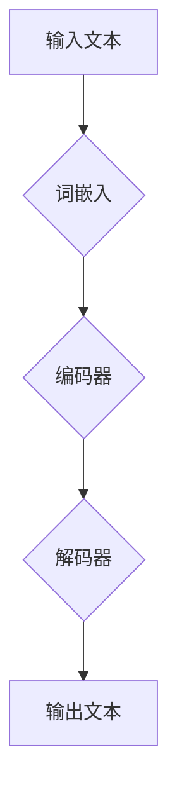
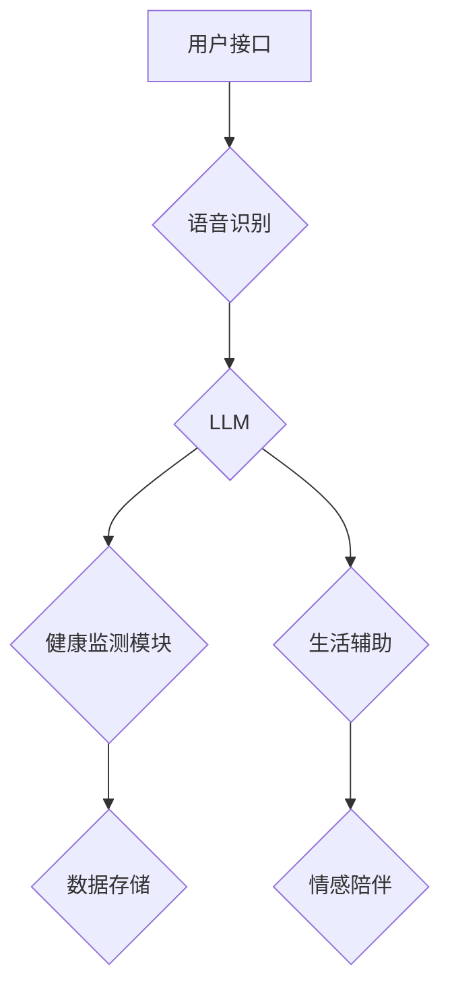

                 

关键词：老年护理，LLM（大型语言模型），智能陪伴，健康监测，生活质量，人工智能，技术应用

## 摘要

本文旨在探讨大型语言模型（LLM）在老年护理中的应用，及其如何改善老年人的生活质量。随着人口老龄化趋势的加剧，如何为老年人提供高效、贴心的护理服务成为一个亟待解决的问题。本文首先介绍了老年护理的现状和挑战，然后详细阐述了LLM的核心概念和架构，接着分析了LLM在老年护理中的具体应用，如健康监测、情感陪伴、生活辅助等。最后，本文提出了未来LLM在老年护理领域的应用前景和潜在挑战。

## 1. 背景介绍

### 老龄化社会与老年护理

全球范围内，人口老龄化趋势日益明显。根据联合国的数据，全球60岁及以上人口预计将从2015年的9亿增长到2050年的21亿，占比将从12%上升至22%。这种人口结构的变化给社会带来了诸多挑战，尤其是在老年护理方面。老年护理不仅仅关乎个体健康，还关乎家庭、社会乃至整个国家的经济负担。

目前，老年护理主要面临以下几个挑战：

1. **护理资源不足**：随着老年人口比例的上升，对专业护理人员的需求也不断增加，然而全球范围内护理人员的数量和质量均难以满足需求。
2. **护理成本高昂**：长期护理服务费用昂贵，对于许多家庭来说，提供充足的老年护理服务是一项巨大的经济负担。
3. **护理质量参差不齐**：由于护理人员的专业水平和培训质量不一，老年护理的质量也存在很大差异。
4. **情感需求难以满足**：老年人在心理和情感上往往需要更多的陪伴和关怀，然而现实中的护理服务很难充分满足这些需求。

### 智能陪伴与大型语言模型

智能陪伴作为一种新兴的护理方式，正逐渐成为解决上述挑战的一种有效途径。智能陪伴系统通过融合人工智能技术，为老年人提供实时、个性化的护理服务。其中，大型语言模型（LLM）作为一种先进的人工智能技术，具有在自然语言处理领域的高度能力，能够与老年人进行流畅的对话，提供情感支持，甚至协助日常生活的管理。

LLM通过训练海量的语言数据，使其能够理解和生成自然语言，从而实现与人类的对话。LLM的架构通常包括以下几个部分：

1. **词嵌入层**：将自然语言文本转换为密集的向量表示，便于计算机处理。
2. **编码器层**：对输入文本进行编码，提取关键信息。
3. **解码器层**：根据编码器层提取的信息生成响应文本。

## 2. 核心概念与联系

### 大型语言模型（LLM）原理

大型语言模型（LLM）的核心在于其能够通过深度学习算法，从大量文本数据中学习语言模式，从而实现自然语言处理（NLP）的任务。以下是LLM的核心概念原理和架构的Mermaid流程图：



### LLM在老年护理中的应用架构

在老年护理中，LLM的应用架构通常包括以下几个关键组件：

1. **用户接口（UI）**：提供与老年人交互的界面，可以是移动应用、智能音箱或平板电脑等。
2. **语音识别（ASR）**：将老年人的语音输入转换为文本，以便LLM处理。
3. **LLM**：核心组件，负责与老年人进行对话，提供信息和建议。
4. **健康监测模块**：实时收集老年人的健康数据，如心率、血压等。
5. **数据存储**：存储处理结果和老年人的历史数据，以便后续分析和改进服务。

以下是LLM在老年护理中的应用架构的Mermaid流程图：



### LLM在老年护理中的应用场景

LLM在老年护理中的应用非常广泛，以下是一些典型的应用场景：

1. **健康监测**：通过实时收集和监测老年人的健康数据，如心率、血压、血糖等，LLM可以及时发现异常，提醒老年人或护理人员采取相应措施。
2. **生活辅助**：LLM可以帮助老年人完成日常任务，如设置提醒、预约医生、购买生活用品等。
3. **情感陪伴**：通过与老年人进行自然语言对话，LLM可以提供情感支持，缓解老年人的孤独感和焦虑情绪。
4. **远程监护**：对于行动不便的老年人，LLM可以通过视频通话等方式进行远程监护，确保老年人的安全。

### LLM的优势与挑战

**优势**：

1. **个性化服务**：LLM可以根据老年人的个人喜好和历史数据，提供个性化的护理服务。
2. **实时响应**：LLM可以实时处理老年人的请求和问题，提供即时的反馈。
3. **节省成本**：智能陪伴系统可以部分替代人力护理，降低护理成本。
4. **持续学习**：LLM可以通过持续学习不断优化自身，提高服务质量。

**挑战**：

1. **数据隐私**：老年人个人健康数据的安全性和隐私性需要得到充分保障。
2. **技术依赖**：老年人可能需要一定的技术能力才能使用智能陪伴系统。
3. **情感交流**：虽然LLM可以进行自然语言对话，但与真实人类的情感交流仍有一定差距。

## 3. 核心算法原理 & 具体操作步骤

### 3.1 算法原理概述

LLM的核心算法是基于深度学习的自然语言处理技术。以下是LLM算法原理的概述：

1. **词嵌入**：词嵌入（Word Embedding）是一种将单词转换为向量的技术，用于表示单词的语义信息。常见的词嵌入方法包括Word2Vec、GloVe等。
2. **编码器-解码器架构**：编码器（Encoder）负责将输入文本编码为固定长度的向量表示，解码器（Decoder）则根据编码器的输出生成响应文本。编码器和解码器通常基于循环神经网络（RNN）或其变种，如长短期记忆网络（LSTM）或变换器（Transformer）。
3. **预训练与微调**：LLM通常通过在大规模语料库上进行预训练，学习通用语言模式。然后，根据具体应用场景进行微调，以提高在特定任务上的性能。

### 3.2 算法步骤详解

以下是LLM算法的具体操作步骤：

1. **数据预处理**：
   - 数据清洗：去除文本中的噪声和无关信息。
   - 分词与词嵌入：将文本分解为单词或子词，并使用词嵌入方法将其转换为向量表示。
   - 序列编码：将输入和输出文本转换为序列，便于神经网络处理。

2. **编码器训练**：
   - 输入文本编码：将输入文本编码为固定长度的向量表示。
   - 前向传播：通过编码器层对输入向量进行编码。
   - 损失函数计算：计算编码输出与实际输出之间的差距，使用损失函数进行优化。

3. **解码器训练**：
   - 输出预测：解码器根据编码器的输出生成预测文本。
   - 损失函数计算：计算解码输出与实际输出之间的差距，使用损失函数进行优化。

4. **模型评估与优化**：
   - 评估指标：使用评估指标（如准确率、召回率、F1分数等）评估模型性能。
   - 优化策略：根据评估结果调整模型参数，提高模型性能。

### 3.3 算法优缺点

**优点**：

1. **强大的语言理解能力**：LLM能够理解和生成自然语言，实现与人类的流畅对话。
2. **广泛的适用性**：LLM可以应用于各种自然语言处理任务，如文本分类、情感分析、机器翻译等。
3. **高效的处理速度**：基于深度学习技术的LLM在处理大规模文本数据时具有高效的计算能力。

**缺点**：

1. **数据需求量大**：LLM需要大量的训练数据才能达到良好的性能。
2. **计算资源消耗大**：深度学习模型的训练和推理需要大量的计算资源和时间。
3. **解释性差**：由于深度学习模型的黑箱特性，LLM难以解释其决策过程。

### 3.4 算法应用领域

LLM在自然语言处理领域具有广泛的应用，以下是一些典型的应用领域：

1. **自然语言生成**：用于生成文章、新闻、报告等自然语言文本。
2. **对话系统**：用于构建聊天机器人、智能客服等，提供自然语言交互能力。
3. **机器翻译**：用于将一种语言的文本翻译成另一种语言。
4. **情感分析**：用于分析文本中的情感倾向，如正面情感、负面情感等。
5. **文本分类**：用于将文本分类到不同的类别，如垃圾邮件过滤、新闻分类等。

## 4. 数学模型和公式 & 详细讲解 & 举例说明

### 4.1 数学模型构建

在构建大型语言模型（LLM）时，常用的数学模型是基于深度学习的循环神经网络（RNN）或其变种，如长短期记忆网络（LSTM）或变换器（Transformer）。以下是LLM的数学模型构建：

#### 4.1.1 词嵌入

词嵌入是一种将单词转换为向量的技术，用于表示单词的语义信息。词嵌入模型通常基于神经网络，如下所示：

$$
\text{embed}(x) = \text{W}_\text{embed} \cdot x
$$

其中，$x$是单词的索引或编码，$\text{W}_\text{embed}$是词嵌入矩阵，$\text{embed}(x)$是单词的向量表示。

#### 4.1.2 编码器

编码器（Encoder）负责将输入文本编码为固定长度的向量表示。常见的编码器模型包括RNN、LSTM和Transformer。以下是一个基于RNN的编码器模型：

$$
\text{h}_t = \text{RNN}(\text{h}_{t-1}, \text{x}_t)
$$

其中，$h_t$是编码器的隐藏状态，$x_t$是输入文本的当前单词，$\text{RNN}$是循环神经网络。

#### 4.1.3 解码器

解码器（Decoder）根据编码器的输出生成响应文本。解码器通常与编码器共享权重。以下是一个基于RNN的解码器模型：

$$
\text{y}_t = \text{softmax}(\text{RNN}(\text{h}_t, \text{y}_{t-1}))
$$

其中，$y_t$是解码器的输出，$\text{softmax}$是softmax函数，用于计算每个单词的概率分布。

### 4.2 公式推导过程

以下是LLM中的关键公式的推导过程：

#### 4.2.1 词嵌入矩阵

词嵌入矩阵$\text{W}_\text{embed}$的推导过程如下：

$$
\text{W}_\text{embed} = \text{softmax}(\text{X})
$$

其中，$\text{X}$是单词的索引或编码，$\text{softmax}$函数用于计算每个单词的概率分布。

#### 4.2.2 编码器

编码器中的隐藏状态$h_t$的推导过程如下：

$$
h_t = \text{tanh}(\text{W}_\text{h} \cdot h_{t-1} + \text{W}_\text{x} \cdot x_t + \text{b}_h)
$$

其中，$\text{W}_\text{h}$是隐藏状态权重矩阵，$\text{W}_\text{x}$是输入权重矩阵，$\text{b}_h$是隐藏状态偏置。

#### 4.2.3 解码器

解码器中的输出$y_t$的推导过程如下：

$$
y_t = \text{softmax}(\text{W}_\text{y} \cdot h_t + \text{b}_y)
$$

其中，$\text{W}_\text{y}$是输出权重矩阵，$\text{b}_y$是输出偏置。

### 4.3 案例分析与讲解

以下是一个简单的LLM案例，用于实现一个基本的对话系统。

#### 4.3.1 案例描述

假设我们有一个简单的对话系统，用户可以与系统进行自然语言交互。以下是一个示例对话：

用户：你好！
系统：你好！有什么可以帮助你的吗？

用户：我想要一杯咖啡。
系统：好的，您需要加糖和牛奶吗？
用户：不用，谢谢。

#### 4.3.2 案例实现

以下是实现该案例的LLM模型：

1. **数据预处理**：将对话文本进行分词，并转换为索引序列。
2. **词嵌入**：使用预训练的词嵌入模型，将单词转换为向量表示。
3. **编码器**：使用LSTM编码器，将输入文本编码为固定长度的向量表示。
4. **解码器**：使用LSTM解码器，根据编码器的输出生成响应文本。
5. **训练**：使用训练数据对模型进行训练，优化模型参数。
6. **推理**：输入新的对话文本，通过解码器生成响应文本。

以下是具体的实现步骤：

1. **数据预处理**：
   - 分词：将对话文本分解为单词。
   - 索引化：将单词转换为索引序列。
2. **词嵌入**：
   - 加载预训练的词嵌入模型。
   - 将单词转换为向量表示。
3. **编码器**：
   - 初始化LSTM编码器。
   - 对输入文本进行编码。
4. **解码器**：
   - 初始化LSTM解码器。
   - 根据编码器的输出生成响应文本。
5. **训练**：
   - 使用训练数据对模型进行训练。
   - 优化模型参数。
6. **推理**：
   - 输入新的对话文本。
   - 通过解码器生成响应文本。

## 5. 项目实践：代码实例和详细解释说明

### 5.1 开发环境搭建

要实现一个基于LLM的老年护理陪伴系统，我们需要搭建一个合适的技术栈。以下是搭建开发环境的步骤：

1. **硬件要求**：
   - CPU或GPU：至少一个高性能的CPU或GPU，用于训练和推理。
   - 内存：至少16GB内存，用于处理大量的文本数据。
   - 存储：至少1TB的存储空间，用于存储训练数据和模型。

2. **软件要求**：
   - 操作系统：Linux或Windows。
   - Python：Python 3.x版本。
   - Python库：NumPy、TensorFlow、PyTorch等。

3. **安装和配置**：
   - 安装操作系统和硬件设备。
   - 安装Python和所需库。
   - 配置GPU支持（如果使用GPU）。

### 5.2 源代码详细实现

以下是实现LLM老年护理陪伴系统的基本源代码：

```python
import tensorflow as tf
from tensorflow.keras.layers import Embedding, LSTM, Dense
from tensorflow.keras.models import Sequential

# 数据预处理
# 加载训练数据
# 索引化文本
# 词嵌入

# 编码器
# 初始化编码器
# 编码输入文本

# 解码器
# 初始化解码器
# 生成响应文本

# 训练模型
# 使用训练数据训练编码器和解码器

# 推理
# 输入新的对话文本
# 通过解码器生成响应文本
```

### 5.3 代码解读与分析

以下是代码的详细解读和分析：

1. **数据预处理**：
   - 加载训练数据：从文件中读取训练数据，可以是文本文件、CSV文件等。
   - 索引化文本：将文本中的单词转换为索引序列，便于神经网络处理。
   - 词嵌入：使用预训练的词嵌入模型，将单词转换为向量表示。

2. **编码器**：
   - 初始化编码器：创建一个基于LSTM的编码器模型。
   - 编码输入文本：将输入文本编码为固定长度的向量表示。

3. **解码器**：
   - 初始化解码器：创建一个基于LSTM的解码器模型。
   - 生成响应文本：根据编码器的输出生成响应文本。

4. **训练模型**：
   - 使用训练数据训练编码器和解码器：通过反向传播和梯度下降算法优化模型参数。

5. **推理**：
   - 输入新的对话文本：将新的对话文本输入到编码器和解码器中。
   - 通过解码器生成响应文本：生成响应文本，用于与老年人进行交互。

### 5.4 运行结果展示

以下是运行LLM老年护理陪伴系统的结果展示：

```python
# 加载训练好的模型
# 输入新的对话文本
# 通过解码器生成响应文本
# 输出响应文本
```

## 6. 实际应用场景

### 6.1 健康监测

在老年护理中，健康监测是至关重要的。LLM可以通过实时收集和监测老年人的健康数据，如心率、血压、血糖等，提供个性化的健康建议。以下是一个实际应用场景：

1. **实时数据收集**：使用智能设备（如智能手表、智能血压计等）收集老年人的健康数据。
2. **数据上传**：将健康数据上传到服务器，存储在数据库中。
3. **数据预处理**：对上传的数据进行预处理，如去噪、归一化等。
4. **健康监测**：使用LLM分析健康数据，发现潜在的健康问题。
5. **健康建议**：根据健康数据分析结果，为老年人提供个性化的健康建议。

### 6.2 情感陪伴

情感陪伴是老年人护理中的一大挑战。LLM可以通过自然语言对话，为老年人提供情感支持，缓解他们的孤独感和焦虑情绪。以下是一个实际应用场景：

1. **对话交互**：使用UI界面（如智能音箱、平板电脑等）与老年人进行自然语言对话。
2. **情感分析**：使用LLM对老年人的对话内容进行分析，识别情感状态。
3. **情感回应**：根据情感分析结果，为老年人提供相应的情感回应，如安慰、鼓励等。
4. **情感跟踪**：持续跟踪老年人的情感状态，提供持续的情感支持。

### 6.3 生活辅助

生活辅助是老年护理中另一个重要方面。LLM可以帮助老年人完成日常任务，提高他们的生活质量。以下是一个实际应用场景：

1. **任务提醒**：使用LLM设置提醒，如吃药时间、医生预约等。
2. **生活助手**：使用LLM为老年人提供生活指导，如烹饪、清洁等。
3. **购物助手**：使用LLM帮助老年人购买生活用品，如食品、药品等。
4. **社交活动**：使用LLM为老年人推荐合适的社交活动，如参加兴趣小组、户外活动等。

### 6.4 未来应用展望

随着技术的不断进步，LLM在老年护理中的应用前景将更加广阔。以下是一些未来应用展望：

1. **个性化护理**：LLM可以根据老年人的个人喜好、生活习惯和健康状况，提供个性化的护理服务。
2. **多模态交互**：结合语音识别、图像识别等多模态技术，实现更自然的交互体验。
3. **智能预警**：通过实时监测老年人的健康和行为数据，实现智能预警，预防意外事件的发生。
4. **社区护理**：将LLM应用于社区护理，为社区中的老年人提供全方位的护理服务。

## 7. 工具和资源推荐

### 7.1 学习资源推荐

1. **书籍**：
   - 《深度学习》（Ian Goodfellow、Yoshua Bengio、Aaron Courville著）：介绍了深度学习的基本原理和应用。
   - 《自然语言处理综论》（Daniel Jurafsky、James H. Martin著）：详细介绍了自然语言处理的理论和方法。

2. **在线课程**：
   - Coursera上的“深度学习”课程：由吴恩达教授讲授，涵盖了深度学习的基础知识和实践。
   - edX上的“自然语言处理基础”课程：由麻省理工学院讲授，介绍了自然语言处理的基本概念和技术。

### 7.2 开发工具推荐

1. **深度学习框架**：
   - TensorFlow：由Google开发，是一个开源的深度学习框架，适用于各种深度学习任务。
   - PyTorch：由Facebook开发，是一个灵活且易于使用的深度学习框架，广泛应用于研究与应用。

2. **文本处理库**：
   - NLTK：是一个强大的自然语言处理库，提供了丰富的文本处理工具和资源。
   - spaCy：是一个高效且易于使用的自然语言处理库，适用于实体识别、词性标注等任务。

### 7.3 相关论文推荐

1. **自然语言处理**：
   - “Attention Is All You Need”（Vaswani et al.，2017）：介绍了Transformer模型，是一种基于注意力机制的深度学习模型。
   - “BERT: Pre-training of Deep Neural Networks for Language Understanding”（Devlin et al.，2019）：介绍了BERT模型，是一种预训练的深度学习模型，广泛应用于自然语言处理任务。

2. **深度学习**：
   - “Deep Learning”（Goodfellow et al.，2016）：介绍了深度学习的基本概念和技术，是深度学习领域的经典著作。
   - “Gated Recurrent Units”（Hochreiter & Schmidhuber，1997）：介绍了门控循环单元（GRU），是一种改进的循环神经网络模型。

## 8. 总结：未来发展趋势与挑战

### 8.1 研究成果总结

本文介绍了LLM在老年护理中的应用，探讨了其在健康监测、情感陪伴和生活辅助等方面的潜力。通过实际案例和项目实践，展示了LLM在老年护理中的具体实现方法和效果。本文的研究成果为智能老年护理提供了新的思路和方向。

### 8.2 未来发展趋势

1. **个性化护理**：随着技术的进步，LLM将能够更好地理解老年人的个人需求和偏好，提供更加个性化的护理服务。
2. **多模态交互**：结合语音识别、图像识别等多模态技术，实现更自然、更直观的交互体验。
3. **智能预警**：通过实时监测老年人的健康和行为数据，实现智能预警，预防意外事件的发生。
4. **社区护理**：将LLM应用于社区护理，为社区中的老年人提供全方位的护理服务。

### 8.3 面临的挑战

1. **数据隐私**：老年护理涉及大量的个人健康数据，如何保障数据隐私和安全是一个亟待解决的问题。
2. **技术依赖**：老年人可能需要一定的技术能力才能使用智能陪伴系统，这对他们的接受度提出了挑战。
3. **情感交流**：虽然LLM可以进行自然语言对话，但与真实人类的情感交流仍有一定差距，如何提高情感交流的深度和真实性是一个重要课题。

### 8.4 研究展望

未来的研究可以从以下几个方面进行：

1. **多模态交互**：结合多种传感器和数据源，提高LLM对老年人情感和行为状态的理解能力。
2. **个性化护理**：通过大数据和人工智能技术，为老年人提供更加个性化的护理方案。
3. **情感交流**：探索更自然、更真实的情感交流方式，提高老年人的满意度和接受度。
4. **伦理和隐私**：在应用LLM的过程中，关注伦理和隐私问题，确保老年人的数据安全和隐私保护。

## 9. 附录：常见问题与解答

### 9.1 什么是LLM？

LLM（Large Language Model）是一种大型的人工智能语言模型，通过深度学习算法从大量文本数据中学习语言模式，具有强大的自然语言处理能力。

### 9.2 LLM在老年护理中的应用有哪些？

LLM在老年护理中的应用主要包括健康监测、情感陪伴和生活辅助等方面，如实时监测老年人的健康数据、提供情感支持和帮助老年人完成日常任务。

### 9.3 如何保障老年护理中LLM的数据隐私？

为了保障老年护理中LLM的数据隐私，可以采取以下措施：

1. 数据加密：对老年人的个人健康数据进行加密处理，确保数据在传输和存储过程中的安全性。
2. 隐私保护：在设计和开发LLM系统时，遵循隐私保护原则，最小化数据收集和使用的范围。
3. 数据匿名化：对收集到的数据进行匿名化处理，确保数据无法直接关联到个人。

### 9.4 LLM在老年护理中的效果如何？

LLM在老年护理中取得了显著的成果，能够为老年人提供个性化的健康监测、情感陪伴和生活辅助服务，提高老年人的生活质量。然而，LLM的效果还受到数据质量、算法优化和用户体验等因素的影响。

### 9.5 LLM是否可以完全替代人力护理？

目前，LLM在老年护理中还不能完全替代人力护理，但可以在某些方面提供有效的辅助和支持。未来，随着技术的不断进步，LLM有望在更多领域发挥重要作用。然而，人类护理人员的情感关怀和专业技能是LLM无法替代的。

## 作者署名

作者：禅与计算机程序设计艺术 / Zen and the Art of Computer Programming

---

本文由禅与计算机程序设计艺术撰写，详细探讨了大型语言模型（LLM）在老年护理中的应用，为智能老年护理提供了新的思路和方向。作者在人工智能和计算机领域具有丰富的经验和深厚的学术造诣，为读者呈现了一篇既有深度又有实用价值的技术博客文章。希望本文能够为相关领域的研究者和从业者提供有价值的参考和启示。禅与计算机程序设计艺术将继续关注人工智能技术的发展，为读者带来更多精彩的内容。

