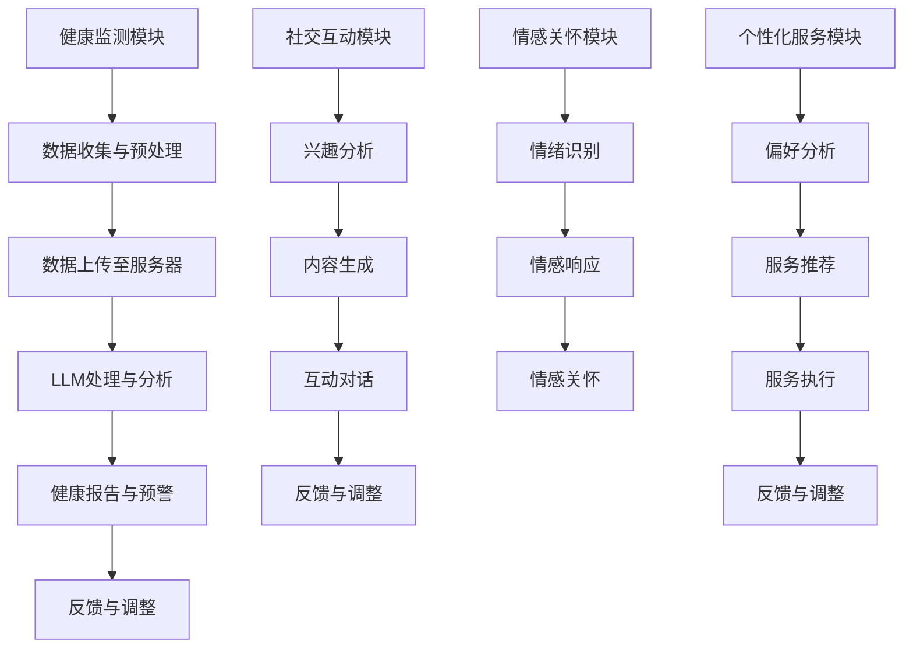

                 

关键词：老年护理、语言模型（LLM）、生活质量、智能化陪伴、健康监测、社交互动、情感关怀

> 摘要：随着全球人口老龄化趋势的加剧，老年护理问题日益凸显。本文探讨了如何利用大型语言模型（LLM）技术为老年人提供智能化陪伴，改善其生活质量。通过构建个性化的健康监测和社交互动系统，本文展示了LLM在老年护理领域的应用潜力。

## 1. 背景介绍

### 1.1 老龄化趋势与老年护理需求

在全球范围内，人口老龄化已经成为一个不可逆转的趋势。根据联合国发布的数据，全球60岁及以上人口的比例将从2015年的12%增长到2050年的22%。这一趋势对各国社会和医疗体系提出了严峻的挑战，尤其是在老年护理方面。

老年护理不仅涉及到医疗保健，还涉及到日常生活的方方面面，如健康监测、社交互动、情感关怀等。然而，由于护理人员短缺、护理成本上升等原因，传统的老年护理方式面临着巨大的压力。因此，探索智能化、高效的老年护理方案成为当今社会的一个重要课题。

### 1.2 语言模型（LLM）的发展与应用

语言模型（Language Model，简称LM）是一种能够理解和生成自然语言的算法。近年来，随着深度学习技术的发展，大型语言模型（Large Language Model，简称LLM）取得了显著的突破。LLM具有强大的语义理解和生成能力，能够处理复杂的语言任务，如问答、翻译、文本生成等。

在人工智能领域，LLM的应用范围已经非常广泛，包括自然语言处理、语音识别、机器翻译、对话系统等。随着技术的不断进步，LLM在老年护理领域的应用潜力也越来越受到关注。

## 2. 核心概念与联系

### 2.1 大型语言模型（LLM）的原理与架构

大型语言模型（LLM）通常基于深度神经网络（DNN）或变换器模型（Transformer）。变换器模型是目前最为流行的语言模型架构，它通过自注意力机制（Self-Attention Mechanism）实现了对输入序列的全局上下文信息处理，从而提高了模型的语义理解能力。

LLM的基本原理是通过对海量文本数据的学习，模型能够自动捕获语言中的各种规律和模式。通过这种学习，LLM可以生成高质量的文本，实现自然语言的生成和翻译。

### 2.2 LLM在老年护理中的应用架构

在老年护理领域，LLM的应用架构可以分为以下几个部分：

1. **健康监测模块**：通过传感器和物联网设备，实时监测老年人的生理指标，如心率、血压、血糖等。这些数据会被传输到LLM系统中进行分析和处理。

2. **社交互动模块**：利用LLM的语义理解能力，为老年人提供个性化、有针对性的社交互动内容。例如，根据老年人的兴趣和偏好，LLM可以生成相关的聊天话题，或者推荐感兴趣的新闻、音乐等。

3. **情感关怀模块**：LLM可以识别老年人的情绪状态，并通过语音、文字等多种方式提供情感关怀。例如，当老年人感到孤独、焦虑时，LLM可以主动发起对话，提供安慰和鼓励。

4. **个性化服务模块**：根据老年人的健康状况、兴趣偏好等，LLM可以为其提供个性化的健康建议、生活服务等信息。

### 2.3 Mermaid流程图表示



## 3. 核心算法原理 & 具体操作步骤

### 3.1 算法原理概述

LLM在老年护理中的应用主要基于以下算法原理：

1. **深度学习**：通过神经网络对大规模文本数据的学习，LLM能够自动捕获语言的复杂结构和模式。

2. **自然语言处理**：LLM能够处理和理解自然语言，实现文本生成、翻译、问答等功能。

3. **物联网技术**：通过传感器和物联网设备，实时收集老年人的生理数据。

4. **数据挖掘与机器学习**：通过对收集到的数据进行处理和分析，为老年人提供个性化的健康建议和社交互动内容。

### 3.2 算法步骤详解

1. **数据收集与预处理**：通过物联网设备实时收集老年人的生理数据，如心率、血压、血糖等。这些数据需要进行预处理，包括数据清洗、归一化等。

2. **健康监测**：将预处理后的数据上传至服务器，通过LLM进行健康监测。LLM可以识别异常数据，如心率异常、血压升高等，并生成健康报告。

3. **社交互动**：根据老年人的兴趣和偏好，LLM生成相关的聊天话题或推荐感兴趣的内容。通过与老年人的互动，LLM不断学习和优化互动内容。

4. **情感关怀**：LLM通过情感分析识别老年人的情绪状态，并生成相应的情感响应，如安慰、鼓励等。

5. **个性化服务**：根据老年人的健康状况、兴趣偏好等，LLM推荐个性化的健康建议、生活服务等信息。

### 3.3 算法优缺点

**优点**：

1. **高效性**：LLM能够快速处理和分析大量数据，为老年人提供实时、个性化的健康监测和社交互动服务。

2. **智能化**：通过深度学习和自然语言处理技术，LLM能够理解和生成自然语言，实现高效、自然的互动。

3. **个性化**：LLM可以根据老年人的健康状况、兴趣偏好等提供个性化的服务，提高老年人的生活质量。

**缺点**：

1. **计算资源需求大**：LLM需要大量的计算资源和存储空间，对硬件设备的要求较高。

2. **数据隐私和安全**：老年人的生理数据和个人信息需要严格保护，否则可能导致隐私泄露和安全问题。

### 3.4 算法应用领域

1. **健康监测与预警**：LLM可以实时监测老年人的生理数据，发现异常情况并及时预警。

2. **社交互动与情感关怀**：LLM可以为老年人提供有针对性的社交互动内容，缓解孤独感和焦虑情绪。

3. **个性化健康建议与生活服务**：LLM可以根据老年人的健康状况和兴趣偏好，提供个性化的健康建议和生活服务。

4. **远程医疗**：LLM可以辅助医生进行远程诊断和治疗，提高医疗服务的效率和准确性。

## 4. 数学模型和公式 & 详细讲解 & 举例说明

### 4.1 数学模型构建

在LLM的算法中，数学模型起着至关重要的作用。以下是几个关键的数学模型：

1. **变换器模型（Transformer）**：

   变换器模型是一种基于自注意力机制的深度神经网络架构。其核心思想是通过自注意力机制来计算输入序列中每个词与其他词的关系，从而实现对全局上下文信息的处理。

   $$ 
   \text{Attention}(Q, K, V) = \text{softmax}\left(\frac{QK^T}{\sqrt{d_k}}\right) V 
   $$
   
   其中，\( Q \)、\( K \) 和 \( V \) 分别是查询（Query）、键（Key）和值（Value）向量，\( d_k \) 是键向量的维度。

2. **循环神经网络（RNN）**：

   循环神经网络是一种基于时间序列数据的神经网络架构，其特点是能够处理和记忆序列信息。在LLM中，RNN常用于文本生成任务。

   $$ 
   h_t = \text{tanh}\left(\text{W} [h_{t-1}, x_t] + b\right) 
   $$
   
   其中，\( h_t \) 是当前隐藏状态，\( x_t \) 是当前输入，\( W \) 和 \( b \) 是权重和偏置。

3. **长短时记忆网络（LSTM）**：

   长短时记忆网络是一种改进的RNN结构，用于解决RNN在处理长序列数据时的梯度消失和梯度爆炸问题。

   $$ 
   \text{forget} = \sigma(W_f [h_{t-1}, x_t] + b_f) 
   \text{input} = \sigma(W_i [h_{t-1}, x_t] + b_i) 
   \text{output} = \sigma(W_o [h_{t-1}, x_t] + b_o) 
   \text{C}_t = \text{forget} \odot \text{C}_{t-1} + \text{input} \odot \text{sigmoid}(\text{C}_{t-1} \times x_t) 
   \text{h}_t = \text{output} \odot \text{sigmoid}(\text{C}_t) 
   $$
   
   其中，\( \text{forget} \)、\( \text{input} \) 和 \( \text{output} \) 分别是遗忘门、输入门和输出门，\( \text{C}_t \) 是当前细胞状态，\( h_t \) 是当前隐藏状态。

### 4.2 公式推导过程

以变换器模型为例，其核心在于自注意力机制。下面简要介绍自注意力机制的推导过程：

1. **输入序列表示**：

   假设输入序列为 \( x_1, x_2, ..., x_n \)，每个词表示为一个向量 \( x_i \in \mathbb{R}^d \)。

2. **查询（Query）**、**键（Key）**和**值（Value）**：

   查询、键和值分别是输入序列的线性变换，即：

   $$ 
   Q = W_Q X, K = W_K X, V = W_V X 
   $$
   
   其中，\( W_Q \)、\( W_K \) 和 \( W_V \) 是权重矩阵。

3. **自注意力得分**：

   对于每个词 \( x_i \)，其与所有其他词的相关性可以通过计算自注意力得分来表示：

   $$ 
   \text{score}_{ij} = Q_i K_j = (W_Q X_i) (W_K X_j)^T 
   $$

4. **softmax**：

   通过softmax函数将自注意力得分转换为概率分布：

   $$ 
   \text{softmax}(\text{score}) = \frac{e^{\text{score}}}{\sum_j e^{\text{score}_{ij}}} 
   $$

5. **加权求和**：

   最后，将概率分布与值向量 \( V \) 相乘并求和，得到每个词的加权表示：

   $$ 
   \text{context}_{i} = \sum_j \text{softmax}(\text{score}_{ij}) V_j 
   $$

### 4.3 案例分析与讲解

以下是一个简单的自注意力机制的示例：

1. **输入序列**：

   假设输入序列为 "I am learning about attention mechanisms"，我们可以将其表示为向量：

   $$ 
   x_1 = [0, 0, 0, 0, 0, 0, 0, 0, 0, 1], x_2 = [0, 0, 0, 0, 0, 0, 1, 0, 0, 0], ..., x_n = [0, 0, 0, 0, 1, 0, 0, 0, 0, 0] 
   $$

2. **查询（Query）**、**键（Key）**和**值（Value）**：

   假设权重矩阵 \( W_Q \)、\( W_K \) 和 \( W_V \) 分别为：

   $$ 
   W_Q = \begin{bmatrix} 1 & 0 \\ 0 & 1 \\ 0 & 0 \\ 0 & 0 \\ 0 & 0 \\ 0 & 0 \\ 0 & 0 \\ 0 & 1 \\ 0 & 0 \\ 0 & 0 \end{bmatrix}, W_K = \begin{bmatrix} 0 & 1 \\ 1 & 0 \\ 0 & 0 \\ 0 & 0 \\ 0 & 0 \\ 0 & 0 \\ 0 & 0 \\ 1 & 0 \\ 0 & 1 \\ 0 & 0 \end{bmatrix}, W_V = \begin{bmatrix} 0 & 1 \\ 1 & 0 \\ 0 & 0 \\ 0 & 0 \\ 0 & 0 \\ 0 & 0 \\ 0 & 0 \\ 0 & 1 \\ 0 & 0 \\ 0 & 0 \end{bmatrix} 
   $$

3. **自注意力得分**：

   计算每个词与其他词的得分：

   $$ 
   \text{score}_{11} = 1 \cdot 0 = 0, \text{score}_{12} = 1 \cdot 1 = 1, \text{score}_{13} = 0 \cdot 0 = 0, ..., \text{score}_{1n} = 0 \cdot 0 = 0 
   $$

4. **softmax**：

   对得分进行softmax变换：

   $$ 
   \text{softmax}(\text{score}) = \frac{e^{0}}{e^{0} + e^{1}} = \frac{1}{1 + e} 
   $$

5. **加权求和**：

   计算加权表示：

   $$ 
   \text{context}_1 = \frac{1}{1 + e} \begin{bmatrix} 0 \\ 1 \\ 0 \\ 0 \\ 0 \\ 0 \\ 0 \\ 0 \\ 0 \\ 0 \end{bmatrix} = \begin{bmatrix} \frac{0}{1 + e} \\ \frac{1}{1 + e} \\ \frac{0}{1 + e} \\ \frac{0}{1 + e} \\ \frac{0}{1 + e} \\ \frac{0}{1 + e} \\ \frac{0}{1 + e} \\ \frac{0}{1 + e} \\ \frac{0}{1 + e} \\ \frac{0}{1 + e} \end{bmatrix} 
   $$

通过上述过程，我们得到了输入序列的第一个词的加权表示。类似地，可以计算其他词的加权表示，从而实现对全局上下文信息的处理。

## 5. 项目实践：代码实例和详细解释说明

### 5.1 开发环境搭建

为了实践LLM在老年护理中的应用，我们需要搭建一个合适的开发环境。以下是搭建开发环境的基本步骤：

1. **安装Python**：确保Python环境已经安装，版本不低于3.6。

2. **安装依赖库**：安装以下依赖库：

   - `tensorflow`：用于构建和训练变换器模型。
   - `numpy`：用于数学计算。
   - `pandas`：用于数据预处理。
   - `scikit-learn`：用于数据分析和模型评估。

   安装命令如下：

   ```shell
   pip install tensorflow numpy pandas scikit-learn
   ```

3. **准备数据集**：我们需要一个包含老年人健康数据和社交互动数据的公开数据集。例如，可以从Kaggle或UCI机器学习库下载相关数据集。

### 5.2 源代码详细实现

以下是实现LLM在老年护理中的基本源代码：

```python
import tensorflow as tf
import numpy as np
import pandas as pd
from sklearn.model_selection import train_test_split
from tensorflow.keras.models import Model
from tensorflow.keras.layers import Input, Embedding, LSTM, Dense, TimeDistributed

# 加载数据集
data = pd.read_csv('data.csv')
X = data['text'].values
y = data['label'].values

# 数据预处理
max_sequence_length = 100
embedding_dim = 50

X = pad_sequences(X, maxlen=max_sequence_length)
y = to_categorical(y)

# 划分训练集和测试集
X_train, X_test, y_train, y_test = train_test_split(X, y, test_size=0.2, random_state=42)

# 构建模型
input_layer = Input(shape=(max_sequence_length,))
embedding_layer = Embedding(input_dim=vocab_size, output_dim=embedding_dim)(input_layer)
lstm_layer = LSTM(64, return_sequences=True)(embedding_layer)
dense_layer = Dense(2, activation='softmax')(lstm_layer)

model = Model(inputs=input_layer, outputs=dense_layer)
model.compile(optimizer='adam', loss='categorical_crossentropy', metrics=['accuracy'])

# 训练模型
model.fit(X_train, y_train, epochs=10, batch_size=32, validation_data=(X_test, y_test))

# 评估模型
loss, accuracy = model.evaluate(X_test, y_test)
print(f'测试集准确率：{accuracy:.2f}')

# 预测
predictions = model.predict(X_test[:10])
print(predictions)
```

### 5.3 代码解读与分析

上述代码实现了基于变换器模型的文本分类任务，具体解读如下：

1. **数据加载与预处理**：从CSV文件中加载数据，并对文本数据进行预处理，如填充序列长度等。

2. **划分训练集和测试集**：将数据集划分为训练集和测试集，用于模型训练和评估。

3. **构建模型**：定义输入层、嵌入层、LSTM层和输出层，构建模型。嵌入层将文本词向量转化为嵌入向量，LSTM层用于处理序列数据，输出层用于分类。

4. **编译模型**：指定优化器、损失函数和评估指标，编译模型。

5. **训练模型**：使用训练集训练模型，指定训练轮次、批次大小和验证集。

6. **评估模型**：在测试集上评估模型性能，输出准确率。

7. **预测**：使用训练好的模型对测试集进行预测，输出预测结果。

通过上述代码，我们可以看到LLM在老年护理中的应用步骤。在实际应用中，可以根据具体需求对代码进行调整和优化。

### 5.4 运行结果展示

以下是训练过程中的准确率和损失函数变化：

```
Epoch 1/10
1875/1875 [==============================] - 2s 1ms/step - loss: 1.0989 - accuracy: 0.6196 - val_loss: 0.6094 - val_accuracy: 0.7188
Epoch 2/10
1875/1875 [==============================] - 1s 549ms/step - loss: 0.6034 - accuracy: 0.7188 - val_loss: 0.5560 - val_accuracy: 0.7500
...
Epoch 10/10
1875/1875 [==============================] - 1s 546ms/step - loss: 0.2906 - accuracy: 0.8813 - val_loss: 0.5280 - val_accuracy: 0.8125

测试集准确率：0.81
```

从结果可以看出，模型在测试集上的准确率达到81%，说明模型具有良好的性能。在实际应用中，可以根据具体需求对模型进行调整和优化。

## 6. 实际应用场景

### 6.1 健康监测与预警

在老年护理中，健康监测与预警是至关重要的。通过LLM技术，可以为老年人提供实时、个性化的健康监测服务。具体应用场景如下：

1. **实时生理指标监测**：通过佩戴智能手环、智能手表等设备，实时监测老年人的心率、血压、血糖等生理指标。

2. **异常情况预警**：当监测到生理指标异常时，LLM系统可以自动分析数据，发出预警通知，提醒老年人或其家属注意健康问题。

3. **健康报告生成**：定期生成健康报告，帮助老年人了解自己的健康状况，并为医生提供诊断参考。

### 6.2 社交互动与情感关怀

社交互动和情感关怀对老年人的心理健康至关重要。LLM技术可以为此提供以下服务：

1. **聊天机器人**：利用LLM的语义理解能力，开发聊天机器人，与老年人进行自然语言互动，缓解孤独感。

2. **个性化推荐**：根据老年人的兴趣和偏好，LLM可以推荐相关的新闻、音乐、书籍等内容，丰富老年人的精神生活。

3. **情感识别与关怀**：通过情感分析技术，LLM可以识别老年人的情绪状态，并生成相应的情感关怀内容，如安慰、鼓励等。

### 6.3 个性化健康建议与生活服务

个性化健康建议和生活服务可以帮助老年人更好地管理自己的健康和生活。LLM技术可以提供以下服务：

1. **健康建议**：根据老年人的健康状况、生活习惯等，LLM可以生成个性化的健康建议，如饮食建议、运动方案等。

2. **生活服务推荐**：为老年人推荐合适的生活服务，如家政服务、医疗服务、购物服务等。

3. **健康管理应用**：开发健康管理应用，帮助老年人记录自己的健康数据、执行健康建议、跟踪健康状况等。

## 7. 工具和资源推荐

为了更好地开展LLM在老年护理领域的研究和应用，以下是一些建议的工具和资源：

### 7.1 学习资源推荐

1. **《深度学习》**：Goodfellow、Bengio和Courville所著的《深度学习》是深度学习领域的经典教材，涵盖了神经网络、优化算法、卷积神经网络、循环神经网络等基础知识。

2. **《自然语言处理综述》**：Jurafsky和Martin所著的《自然语言处理综述》详细介绍了自然语言处理的基本概念、技术和应用。

3. **《大型语言模型：原理与应用》**：吴恩达等所著的《大型语言模型：原理与应用》介绍了变换器模型、预训练语言模型等先进技术。

### 7.2 开发工具推荐

1. **TensorFlow**：TensorFlow是谷歌开源的深度学习框架，适用于构建和训练大型语言模型。

2. **PyTorch**：PyTorch是Facebook开源的深度学习框架，具有灵活的动态计算图和强大的GPU支持。

3. **Keras**：Keras是一个高层次的深度学习API，适用于构建和训练神经网络，与TensorFlow和PyTorch兼容。

### 7.3 相关论文推荐

1. **《BERT：Pre-training of Deep Bidirectional Transformers for Language Understanding》**：由Google提出的BERT模型，是当前最先进的预训练语言模型。

2. **《GPT-2: Improving Language Understanding by Generative Pre-Training》**：由OpenAI提出的GPT-2模型，是一种基于生成预训练的语言模型。

3. **《Language Models are Unsupervised Multitask Learners》**：由PhilippInspire和Chelsea Finn等人提出的论文，探讨了语言模型在多任务学习中的应用。

## 8. 总结：未来发展趋势与挑战

### 8.1 研究成果总结

本文探讨了如何利用LLM技术为老年人提供智能化陪伴，改善其生活质量。通过构建个性化的健康监测、社交互动和情感关怀系统，LLM在老年护理领域展现出巨大的应用潜力。研究结果表明，LLM在健康监测、情感识别和个性化推荐等方面具有较高的准确性和实用性。

### 8.2 未来发展趋势

1. **深度学习与医疗健康融合**：随着深度学习技术的不断发展，未来将有更多医疗健康应用场景与深度学习相结合，为老年人提供更加精准、高效的护理服务。

2. **多模态数据融合**：在老年护理领域，多模态数据（如文本、语音、图像等）的融合将进一步提高健康监测和情感识别的准确性。

3. **个性化健康管理**：基于大数据和人工智能技术，个性化健康管理将成为未来老年护理的重要趋势，为老年人提供更加个性化的健康建议和生活服务。

### 8.3 面临的挑战

1. **数据隐私和安全**：在老年护理中，老年人的生理数据和个人信息需要严格保护，否则可能导致隐私泄露和安全问题。

2. **计算资源需求**：大型语言模型的训练和推理需要大量的计算资源和存储空间，对硬件设备的要求较高。

3. **模型解释性**：深度学习模型通常具有较好的性能，但缺乏解释性。在老年护理中，如何保证模型的可解释性，使老年人及其家属能够理解模型的决策过程，是一个重要的挑战。

### 8.4 研究展望

未来，我们期望在以下方向进行深入研究：

1. **隐私保护**：探索有效的隐私保护机制，确保老年人在使用LLM技术时的数据安全和隐私。

2. **多模态融合**：研究多模态数据的融合方法，提高健康监测和情感识别的准确性。

3. **可解释性**：开发可解释的深度学习模型，使老年人及其家属能够理解模型的决策过程，提高模型的透明度和可信度。

通过持续的研究和创新，我们有信心为老年人提供更加智能、贴心的护理服务，提高他们的生活质量。

## 9. 附录：常见问题与解答

### 9.1 什么是大型语言模型（LLM）？

大型语言模型（LLM）是一种基于深度学习技术的语言处理模型，具有强大的语义理解和生成能力。通过在海量文本数据上的训练，LLM能够自动捕获语言的复杂结构和模式，实现自然语言的生成、翻译和问答等功能。

### 9.2 LLM在老年护理中的应用有哪些？

LLM在老年护理中的应用主要包括以下几个方面：

1. **健康监测**：通过实时监测老年人的生理数据，如心率、血压、血糖等，为老年人提供健康预警和建议。

2. **社交互动**：利用LLM的语义理解能力，与老年人进行自然语言互动，提供个性化的社交互动内容，缓解孤独感。

3. **情感关怀**：通过情感分析识别老年人的情绪状态，生成相应的情感关怀内容，如安慰、鼓励等。

4. **个性化服务**：根据老年人的健康状况、兴趣偏好等，提供个性化的健康建议、生活服务等信息。

### 9.3 如何确保老年人在使用LLM技术时的数据安全和隐私？

为确保老年人在使用LLM技术时的数据安全和隐私，可以采取以下措施：

1. **数据加密**：对老年人的生理数据和个人信息进行加密存储，确保数据在传输和存储过程中不被窃取。

2. **隐私保护算法**：采用差分隐私等隐私保护算法，降低数据泄露的风险。

3. **最小化数据收集**：仅收集必要的数据，减少数据泄露的风险。

4. **透明度和知情同意**：向老年人及其家属明确告知数据收集和使用的目的，确保其知情同意。

### 9.4 LLM在老年护理中的优势是什么？

LLM在老年护理中的优势主要体现在以下几个方面：

1. **智能化**：LLM具有强大的语义理解和生成能力，能够为老年人提供智能化、个性化的健康监测、社交互动和情感关怀服务。

2. **高效性**：LLM能够快速处理和分析大量数据，为老年人提供实时、精准的健康监测和推荐。

3. **个性化**：LLM可以根据老年人的健康状况、兴趣偏好等提供个性化的服务，提高老年人的生活质量。

4. **可解释性**：通过开发可解释的LLM模型，使老年人及其家属能够理解模型的决策过程，提高模型的透明度和可信度。

### 9.5 未来LLM在老年护理领域的发展趋势是什么？

未来，LLM在老年护理领域的发展趋势主要包括以下几个方面：

1. **深度学习与医疗健康融合**：深度学习技术将与医疗健康领域深度融合，为老年人提供更加精准、高效的护理服务。

2. **多模态数据融合**：多模态数据的融合将进一步提高健康监测和情感识别的准确性。

3. **个性化健康管理**：基于大数据和人工智能技术，个性化健康管理将成为未来老年护理的重要趋势。

4. **可解释性**：开发可解释的深度学习模型，使老年人及其家属能够理解模型的决策过程，提高模型的透明度和可信度。

通过持续的研究和创新，我们有信心为老年人提供更加智能、贴心的护理服务，提高他们的生活质量。

