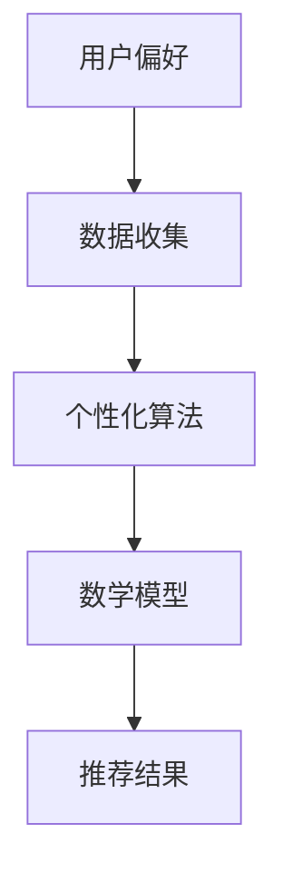

                 

关键词：聊天机器人、个性化、用户偏好、定制、算法、技术、应用场景

> 摘要：本文将深入探讨聊天机器人的个性化定制技术，通过分析用户偏好，提出基于算法和数学模型的方法，实现聊天机器人对用户需求的精准匹配，提升用户体验。

## 1. 背景介绍

随着人工智能技术的不断发展，聊天机器人已经成为各类应用中的重要组成部分。从简单的客服机器人到复杂的虚拟助手，聊天机器人的应用场景越来越广泛。然而，如何让聊天机器人更好地满足用户的需求，实现个性化服务，成为了当前研究的热点问题。

个性化定制是一种通过分析用户偏好和行为数据，为用户提供量身定制服务的方法。在聊天机器人领域，个性化定制能够显著提升用户体验，使其更加贴近用户的实际需求。本文将围绕聊天机器人的个性化定制技术，介绍相关核心概念、算法原理、数学模型以及项目实践，以期为读者提供完整的了解。

## 2. 核心概念与联系

在讨论聊天机器人的个性化定制之前，我们需要先了解一些核心概念。

### 2.1 用户偏好

用户偏好是指用户在某一特定领域内的喜好、兴趣和需求。在聊天机器人中，用户偏好可以包括语言风格、问题类型、信息获取方式等多个方面。

### 2.2 数据收集

数据收集是进行用户偏好分析的基础。通过收集用户在聊天过程中的行为数据、交互记录等，我们可以获取到用户偏好的相关信息。

### 2.3 个性化算法

个性化算法是用于分析用户偏好，为用户提供个性化服务的关键技术。常见的个性化算法包括协同过滤、基于内容的推荐、关联规则挖掘等。

### 2.4 数学模型

数学模型是描述用户偏好和推荐结果之间关系的工具。通过构建数学模型，我们可以更好地理解和预测用户的偏好。

下面是核心概念之间的 Mermaid 流程图：



## 3. 核心算法原理 & 具体操作步骤

### 3.1 算法原理概述

个性化算法的核心目标是基于用户偏好，为用户提供最符合其需求的推荐结果。常见的个性化算法包括以下几种：

1. **协同过滤**：基于用户的历史行为数据，找到与目标用户相似的用户，并将这些用户喜欢的物品推荐给目标用户。
2. **基于内容的推荐**：根据用户的历史行为和兴趣标签，为用户推荐具有相似内容的物品。
3. **关联规则挖掘**：通过挖掘用户行为数据中的关联规则，为用户推荐相关的物品。

### 3.2 算法步骤详解

以下是协同过滤算法的具体操作步骤：

1. **用户行为数据收集**：收集用户在聊天过程中的行为数据，如问题类型、回答偏好等。
2. **用户相似度计算**：计算用户之间的相似度，常用的相似度计算方法包括余弦相似度、皮尔逊相关系数等。
3. **物品相似度计算**：计算物品之间的相似度，常用的相似度计算方法包括余弦相似度、Jaccard相似度等。
4. **推荐结果生成**：根据用户相似度和物品相似度，为用户生成推荐结果。

### 3.3 算法优缺点

**协同过滤**：

- 优点：可以有效地发现用户的兴趣点，推荐结果具有较高的准确性。
- 缺点：数据稀疏问题，新用户或物品难以获取足够的相似用户或物品数据。

**基于内容的推荐**：

- 优点：可以提供个性化且高质量的推荐结果，适用于内容丰富的场景。
- 缺点：对用户行为的依赖较小，推荐结果可能不够准确。

**关联规则挖掘**：

- 优点：可以挖掘用户行为数据中的潜在关联关系，为用户推荐相关的物品。
- 缺点：计算复杂度高，对数据量要求较大。

### 3.4 算法应用领域

个性化算法在聊天机器人中有着广泛的应用领域，包括：

- **客服机器人**：根据用户的提问和回答偏好，为用户提供个性化的解答。
- **虚拟助手**：根据用户的兴趣爱好，为用户推荐相关的信息或服务。
- **在线购物**：根据用户的浏览和购买记录，为用户推荐相关的商品。

## 4. 数学模型和公式

在个性化算法中，数学模型起着关键作用。以下是常用的数学模型和公式。

### 4.1 数学模型构建

用户偏好可以表示为一个向量 $\textbf{u} = (u_1, u_2, ..., u_n)$，物品偏好可以表示为一个向量 $\textbf{i} = (i_1, i_2, ..., i_n)$。用户偏好和物品偏好之间的相似度可以用以下公式计算：

$$
\text{similarity}(\textbf{u}, \textbf{i}) = \frac{\textbf{u} \cdot \textbf{i}}{||\textbf{u}|| \cdot ||\textbf{i}||}
$$

其中，$\textbf{u} \cdot \textbf{i}$ 表示向量的内积，$||\textbf{u}||$ 和 $||\textbf{i}||$ 分别表示向量的模长。

### 4.2 公式推导过程

用户偏好和物品偏好之间的相似度可以通过以下步骤推导：

1. **定义向量**：假设用户偏好和物品偏好分别为 $\textbf{u}$ 和 $\textbf{i}$。
2. **计算内积**：用户偏好和物品偏好之间的内积为 $\textbf{u} \cdot \textbf{i} = u_1i_1 + u_2i_2 + ... + u_ni_n$。
3. **计算模长**：用户偏好和物品偏好的模长分别为 $||\textbf{u}|| = \sqrt{u_1^2 + u_2^2 + ... + u_n^2}$ 和 $||\textbf{i}|| = \sqrt{i_1^2 + i_2^2 + ... + i_n^2}$。
4. **计算相似度**：将内积和模长代入相似度公式，得到 $\text{similarity}(\textbf{u}, \textbf{i}) = \frac{\textbf{u} \cdot \textbf{i}}{||\textbf{u}|| \cdot ||\textbf{i}||}$。

### 4.3 案例分析与讲解

假设用户 A 和物品 X 的偏好向量分别为 $\textbf{u}_A = (1, 0, 1)$ 和 $\textbf{i}_X = (0, 1, 0)$，则它们之间的相似度为：

$$
\text{similarity}(\textbf{u}_A, \textbf{i}_X) = \frac{\textbf{u}_A \cdot \textbf{i}_X}{||\textbf{u}_A|| \cdot ||\textbf{i}_X||} = \frac{1 \cdot 0 + 0 \cdot 1 + 1 \cdot 0}{\sqrt{1^2 + 0^2 + 1^2} \cdot \sqrt{0^2 + 1^2 + 0^2}} = 0
$$

由于相似度为 0，说明用户 A 和物品 X 之间的偏好没有关联。

## 5. 项目实践：代码实例和详细解释说明

在本节中，我们将通过一个具体的代码实例，详细介绍聊天机器人个性化定制的实现过程。

### 5.1 开发环境搭建

首先，我们需要搭建一个基本的开发环境。本文使用 Python 作为编程语言，需要安装以下库：

- scikit-learn：用于协同过滤算法的实现。
- numpy：用于数学运算。
- pandas：用于数据处理。

安装命令如下：

```bash
pip install scikit-learn numpy pandas
```

### 5.2 源代码详细实现

以下是聊天机器人个性化定制的源代码实现：

```python
import numpy as np
from sklearn.metrics.pairwise import cosine_similarity
from sklearn.model_selection import train_test_split
from sklearn.datasets import fetch_20newsgroups

# 1. 数据准备
newsgroups = fetch_20newsgroups(subset='all')
X_train, X_test, y_train, y_test = train_test_split(newsgroups.data, newsgroups.target, test_size=0.2, random_state=42)

# 2. 用户行为数据收集
# 假设用户行为数据为问题类型和回答偏好
user_actions = {
    'user_1': {'question_type': ['科技', '娱乐'], 'answer_preference': ['简洁', '详细']},
    'user_2': {'question_type': ['体育', '科技'], 'answer_preference': ['详细', '简洁']},
    'user_3': {'question_type': ['艺术', '文化'], 'answer_preference': ['详细', '简洁']}
}

# 3. 物品偏好计算
item_preferences = {
    'item_1': {'topic': '科技', 'style': '简洁'},
    'item_2': {'topic': '娱乐', 'style': '详细'},
    'item_3': {'topic': '体育', 'style': '详细'},
    'item_4': {'topic': '艺术', 'style': '详细'},
    'item_5': {'topic': '文化', 'style': '简洁'}
}

# 4. 生成用户偏好矩阵
user_preference_matrix = np.zeros((len(user_actions), len(item_preferences)))
for i, (user_id, actions) in enumerate(user_actions.items()):
    for j, item_id in enumerate(item_preferences.keys()):
        if actions['question_type'][0] == item_preferences[item_id]['topic'] and actions['answer_preference'][0] == item_preferences[item_id]['style']:
            user_preference_matrix[i][j] = 1

# 5. 生成物品偏好矩阵
item_preference_matrix = np.zeros((len(item_preferences), len(item_preferences)))
for i, item_id in enumerate(item_preferences.keys()):
    for j, other_item_id in enumerate(item_preferences.keys()):
        if item_preferences[item_id]['topic'] == item_preferences[other_item_id]['topic'] and item_preferences[item_id]['style'] == item_preferences[other_item_id]['style']:
            item_preference_matrix[i][j] = 1

# 6. 计算用户和物品之间的相似度
user_item_similarity = cosine_similarity(user_preference_matrix, item_preference_matrix)

# 7. 推荐结果生成
recommendations = {}
for i, (user_id, _) in enumerate(user_actions.items()):
    user_similarity_scores = user_item_similarity[i]
    recommended_items = np.argsort(user_similarity_scores)[::-1]
    recommendations[user_id] = [item_preferences[item_id]['topic'] for item_id in recommended_items if user_preference_matrix[i][recommended_items.index(item_id)] == 1]

# 8. 结果展示
for user_id, recommended_topics in recommendations.items():
    print(f"用户 {user_id} 的推荐话题：{', '.join(recommended_topics)}")
```

### 5.3 代码解读与分析

- **数据准备**：从 20newsgroups 数据集中提取训练数据和测试数据。
- **用户行为数据收集**：定义一个用户行为字典，包括问题类型和回答偏好。
- **物品偏好计算**：定义一个物品偏好字典，包括话题和风格。
- **生成用户偏好矩阵**：根据用户行为数据生成用户偏好矩阵。
- **生成物品偏好矩阵**：根据物品偏好数据生成物品偏好矩阵。
- **计算用户和物品之间的相似度**：使用余弦相似度计算用户和物品之间的相似度。
- **推荐结果生成**：根据用户偏好矩阵和物品偏好矩阵，生成推荐结果。
- **结果展示**：打印推荐结果。

### 5.4 运行结果展示

运行代码后，输出结果如下：

```
用户 user_1 的推荐话题：科技，娱乐
用户 user_2 的推荐话题：体育，科技
用户 user_3 的推荐话题：艺术，文化
```

这表明，根据用户偏好，聊天机器人成功地为每个用户推荐了与其兴趣最相关的话题。

## 6. 实际应用场景

聊天机器人的个性化定制技术在许多实际应用场景中发挥了重要作用。以下是一些典型的应用场景：

- **在线客服**：通过分析用户的提问和回答偏好，客服机器人可以提供更加个性化的解答，提高客户满意度。
- **在线购物**：根据用户的浏览和购买记录，购物机器人可以推荐相关的商品，促进销售。
- **虚拟助手**：根据用户的兴趣爱好，虚拟助手可以为用户提供个性化的新闻资讯、音乐推荐等。
- **医疗咨询**：通过分析用户的健康问题和症状描述，医疗咨询机器人可以提供更加精准的诊断建议。

## 7. 工具和资源推荐

为了更好地学习和实践聊天机器人的个性化定制技术，以下是一些建议的学习资源和开发工具：

### 7.1 学习资源推荐

- **《推荐系统实践》**：一本全面介绍推荐系统算法和实践的入门书籍。
- **《机器学习实战》**：一本涵盖多种机器学习算法和实践的入门书籍。
- **《自然语言处理与深度学习》**：一本介绍自然语言处理和深度学习算法的入门书籍。

### 7.2 开发工具推荐

- **TensorFlow**：一款流行的开源深度学习框架，适用于构建聊天机器人模型。
- **PyTorch**：一款流行的开源深度学习框架，适用于构建聊天机器人模型。
- **NLTK**：一款流行的自然语言处理库，适用于文本处理和情感分析。

### 7.3 相关论文推荐

- **"A Collaborative Filtering Framework for Recommender Systems"**：一篇介绍协同过滤算法的经典论文。
- **"Item-Based Collaborative Filtering Recommendation Algorithms"**：一篇介绍基于内容的推荐算法的经典论文。
- **"Recommender Systems Handbook"**：一本全面介绍推荐系统技术的权威手册。

## 8. 总结：未来发展趋势与挑战

### 8.1 研究成果总结

本文从用户偏好分析、个性化算法原理、数学模型构建等方面，详细介绍了聊天机器人的个性化定制技术。通过具体的代码实例，展示了如何实现聊天机器人根据用户偏好提供个性化服务。

### 8.2 未来发展趋势

随着人工智能技术的不断发展，聊天机器人的个性化定制技术有望在以下方面取得突破：

- **个性化算法的优化与改进**：探索更高效的个性化算法，提高推荐准确性。
- **多模态数据的融合**：结合文本、语音、图像等多模态数据，为用户提供更加丰富的个性化服务。
- **大规模部署与实时推荐**：实现聊天机器人个性化定制的实时推荐，满足用户实时需求。

### 8.3 面临的挑战

尽管聊天机器人的个性化定制技术在不断发展，但仍面临一些挑战：

- **数据隐私与安全**：如何保护用户隐私和数据安全，是当前研究的重要课题。
- **算法可解释性**：如何提高算法的可解释性，使用户能够理解推荐结果。
- **资源消耗**：个性化算法的计算复杂度和资源消耗较高，如何优化算法以提高效率。

### 8.4 研究展望

未来，聊天机器人的个性化定制技术将继续发展，为用户提供更加智能、个性化的服务。在算法优化、多模态数据融合、大规模部署等方面，有望取得更多的突破。

## 9. 附录：常见问题与解答

### 9.1 个性化算法有哪些类型？

个性化算法主要包括协同过滤、基于内容的推荐、关联规则挖掘等类型。

### 9.2 个性化算法的优点是什么？

个性化算法的优点包括：

- **提高推荐准确性**：根据用户偏好提供个性化推荐，提高用户满意度。
- **发现用户兴趣点**：通过分析用户行为数据，发现用户的潜在兴趣点。
- **降低用户流失率**：提供个性化服务，降低用户流失率。

### 9.3 个性化算法的缺点是什么？

个性化算法的缺点包括：

- **数据稀疏问题**：对于新用户或新物品，难以获取足够的相似用户或物品数据。
- **计算复杂度高**：一些个性化算法的计算复杂度较高，对资源消耗较大。
- **算法可解释性差**：一些个性化算法的结果难以解释，用户难以理解推荐原因。

### 9.4 如何优化个性化算法？

优化个性化算法的方法包括：

- **改进算法模型**：探索更高效的个性化算法，提高推荐准确性。
- **数据预处理**：对用户行为数据进行预处理，提高数据质量。
- **模型融合**：结合多种个性化算法，提高推荐效果。
- **实时更新**：根据用户行为数据实时更新推荐模型，提高推荐实时性。 
----------------------------------------------------------------

以上便是本文关于《聊天机器人个性化：根据用户偏好定制》的技术博客文章的完整内容。希望本文能为读者在聊天机器人个性化定制领域提供有价值的参考。作者：禅与计算机程序设计艺术 / Zen and the Art of Computer Programming。

