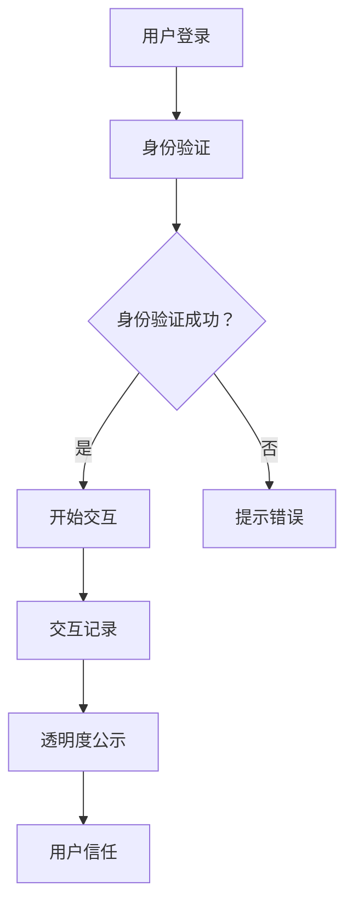

                 

关键词：聊天机器人、伦理、身份验证、透明度、隐私保护、用户信任

随着人工智能技术的迅猛发展，聊天机器人作为智能交互的代表，已经在各个领域得到广泛应用。然而，在享受聊天机器人带来的便捷与高效的同时，我们也不能忽视其在伦理方面的挑战，特别是在身份验证和透明度方面。本文将深入探讨聊天机器人伦理，重点关注身份验证和透明度这两个关键问题，分析其现状、问题和未来发展方向。

## 1. 背景介绍

聊天机器人，又称聊天bots，是利用自然语言处理技术模拟人类对话的智能程序。它们可以自动识别用户输入，理解用户意图，并生成相应的回复，从而实现人与机器之间的自然互动。聊天机器人技术起源于20世纪50年代，随着计算机技术和人工智能的快速发展，如今已经实现了从简单文本交互到复杂语音、图像交互的跨越。

在现代社会，聊天机器人的应用场景日益广泛，如客服服务、信息查询、教育辅导、医疗咨询、金融理财等。它们不仅提高了服务效率，还降低了人力成本，成为企业和组织的重要辅助工具。

然而，随着聊天机器人技术的普及，其伦理问题也逐渐凸显。身份验证和透明度是聊天机器人伦理中的两个核心问题。身份验证关系到用户的隐私和安全，而透明度则涉及到用户对聊天机器人的信任问题。在本文中，我们将重点关注这两个问题，分析当前存在的问题和挑战，并提出相应的解决策略。

## 2. 核心概念与联系

### 2.1. 身份验证

身份验证是指通过验证用户身份的真实性和合法性，确保用户能够安全地使用聊天机器人。在聊天机器人中，身份验证通常包括用户名、密码、手机号码、电子邮件等多种方式。身份验证的目的是防止未经授权的用户访问系统，保护用户数据和隐私。

### 2.2. 透明度

透明度指的是聊天机器人与用户之间的交互过程是否清晰、公正、可追溯。高透明度意味着用户可以了解聊天机器人的行为、决策依据和数据处理过程，从而增强对机器人的信任。透明度包括交互记录的存储、数据共享的透明、隐私保护的公示等。

### 2.3. 身份验证与透明度的联系

身份验证和透明度密切相关。身份验证是确保用户安全的基础，而透明度则是提高用户信任的关键。在聊天机器人中，只有实现了有效的身份验证，用户才能放心地分享个人信息；而只有实现了高透明度，用户才能了解聊天机器人的行为，从而建立信任。

### 2.4. Mermaid 流程图

以下是聊天机器人身份验证与透明度的Mermaid流程图：



## 3. 核心算法原理 & 具体操作步骤

### 3.1. 算法原理概述

聊天机器人的身份验证和透明度实现主要依赖于以下几个核心算法原理：

1. **身份验证算法**：包括用户名密码验证、手机号码验证、电子邮件验证等，通过验证用户身份的真实性和合法性，确保用户能够安全地使用聊天机器人。

2. **加密算法**：用于对用户数据和交互记录进行加密存储，确保数据在传输和存储过程中不被窃取或篡改。

3. **日志记录算法**：用于记录用户与聊天机器人的交互过程，包括时间、地点、操作等内容，确保交互过程的可追溯性。

4. **数据匿名化算法**：用于对用户数据进行匿名化处理，保护用户隐私。

### 3.2. 算法步骤详解

1. **身份验证步骤**：

    1. 用户输入用户名和密码。
    2. 系统对用户名和密码进行加密处理。
    3. 系统将加密后的用户名和密码与数据库中的信息进行比对。
    4. 如果用户名和密码匹配，则身份验证成功；否则，身份验证失败。

2. **加密存储步骤**：

    1. 用户数据在传输和存储前进行加密。
    2. 加密后的数据存储在数据库中。
    3. 数据库中的加密密钥进行备份和加密存储。

3. **日志记录步骤**：

    1. 用户与聊天机器人的交互过程被记录为日志。
    2. 日志包括时间、地点、操作等内容。
    3. 日志存储在日志文件中，定期备份。

4. **数据匿名化步骤**：

    1. 对用户数据进行匿名化处理。
    2. 将匿名化后的数据用于分析和报告。
    3. 确保匿名化数据无法恢复原始身份。

### 3.3. 算法优缺点

1. **身份验证算法**：

    - 优点：简单易行，能有效防止未经授权的用户访问系统。
    - 缺点：密码泄露风险较高，用户可能忘记密码。

2. **加密算法**：

    - 优点：能有效保护用户数据在传输和存储过程中的安全。
    - 缺点：加密和解密过程较复杂，对系统性能有一定影响。

3. **日志记录算法**：

    - 优点：确保交互过程的可追溯性，有利于问题排查和优化。
    - 缺点：日志记录可能占用大量存储空间。

4. **数据匿名化算法**：

    - 优点：能有效保护用户隐私，防止数据泄露。
    - 缺点：匿名化后的数据可能影响分析和报告的准确性。

### 3.4. 算法应用领域

聊天机器人的身份验证和透明度算法广泛应用于各个领域，如：

1. **金融领域**：用于保障用户账户安全和资金安全。
2. **医疗领域**：用于保护用户病历和隐私信息。
3. **教育领域**：用于保障在线教育的安全性和可靠性。
4. **政府机构**：用于保障政务服务的安全性和透明度。

## 4. 数学模型和公式 & 详细讲解 & 举例说明

### 4.1. 数学模型构建

在聊天机器人的身份验证和透明度实现中，我们可以构建以下数学模型：

1. **身份验证模型**：

    - 用户名（Username）：一个唯一的字符串。
    - 密码（Password）：一个加密后的字符串。
    - 认证标志（Authentication Flag）：一个布尔值，表示身份验证结果。

    数学模型：Authentication_Model = {Username, Password, Authentication_Flags}

2. **加密模型**：

    - 明文数据（Plain_Data）：用户数据或交互记录。
    - 密文数据（Cipher_Data）：加密后的数据。
    - 加密密钥（Encryption_Key）：用于加密和解密的密钥。

    数学模型：Encryption_Model = {Plain_Data, Cipher_Data, Encryption_Key}

3. **日志记录模型**：

    - 日志条目（Log_Entry）：包括时间、地点、操作等信息。
    - 日志集合（Log_Set）：所有日志条目的集合。

    数学模型：Log_Record_Model = {Log_Entry | Log_Entry ∈ Log_Set}

4. **数据匿名化模型**：

    - 原始数据（Original_Data）：用户原始数据。
    - 匿名化数据（Anonymized_Data）：匿名化后的数据。
    - 匿名化规则（Anonymization_Rules）：用于匿名化的规则。

    数学模型：Data_Anonymization_Model = {Original_Data, Anonymized_Data, Anonymization_Rules}

### 4.2. 公式推导过程

1. **身份验证公式**：

    - Authentication_Function(Username, Password) = Authentication_Flags

    其中，Authentication_Function 是一个二元函数，用于验证用户身份。如果 Username 和 Password 匹配，则 Authentication_Flags 为 True；否则为 False。

2. **加密公式**：

    - Encryption_Function(Plain_Data, Encryption_Key) = Cipher_Data

    其中，Encryption_Function 是一个加密函数，用于将 Plain_Data 加密为 Cipher_Data。Encryption_Key 是用于加密和解密的密钥。

3. **日志记录公式**：

    - Log_Record_Function(Log_Entry) = Log_Set

    其中，Log_Record_Function 是一个日志记录函数，用于将 Log_Entry 添加到 Log_Set 中。

4. **数据匿名化公式**：

    - Anonymization_Function(Original_Data, Anonymization_Rules) = Anonymized_Data

    其中，Anonymization_Function 是一个匿名化函数，用于将 Original_Data 根据 Anonymization_Rules 化为 Anonymized_Data。

### 4.3. 案例分析与讲解

假设我们有一个聊天机器人系统，需要实现身份验证、加密存储、日志记录和数据匿名化。以下是一个简单的案例：

1. **身份验证**：

    - 用户输入用户名“user1”和密码“123456”。
    - 系统将用户名和密码加密后与数据库中的信息进行比对。
    - 如果用户名和密码匹配，则身份验证成功。

2. **加密存储**：

    - 用户与聊天机器人的交互记录将被加密存储。
    - 系统将交互记录加密为密文，密文存储在数据库中。
    - 加密密钥被加密存储，以防止密钥泄露。

3. **日志记录**：

    - 用户与聊天机器人的每次交互都被记录为日志条目。
    - 日志条目包括时间、地点、操作等信息。
    - 日志条目被存储在日志文件中，定期备份。

4. **数据匿名化**：

    - 用户数据在进行分析和报告前进行匿名化处理。
    - 匿名化规则包括去除敏感信息、随机替换等。
    - 化为匿名化数据后，无法恢复原始数据。

## 5. 项目实践：代码实例和详细解释说明

### 5.1. 开发环境搭建

为了实现聊天机器人的身份验证、加密存储、日志记录和数据匿名化，我们需要搭建以下开发环境：

1. **操作系统**：Windows/Linux/MacOS
2. **编程语言**：Python
3. **开发工具**：PyCharm/VS Code
4. **数据库**：MySQL
5. **加密库**：PyCryptoDome

### 5.2. 源代码详细实现

以下是一个简单的聊天机器人身份验证、加密存储、日志记录和数据匿名化的源代码实现：

```python
# 导入相关库
import pymysql
from Crypto.Cipher import AES
import base64
import hashlib
import random
import string

# 数据库连接
def connect_database():
    db = pymysql.connect("localhost", "root", "password", "chatbot_db")
    cursor = db.cursor()
    return db, cursor

# 加密函数
def encrypt_data(data, key):
    cipher = AES.new(key, AES.MODE_EAX)
    ciphertext, tag = cipher.encrypt_and_digest(data)
    return base64.b64encode(cipher.nonce + cipher.tag + ciphertext).decode('utf-8')

# 解密函数
def decrypt_data(data, key):
    data = base64.b64decode(data)
    nonce, tag, ciphertext = data[:16], data[16:32], data[32:]
    cipher = AES.new(key, AES.MODE_EAX, nonce=nonce)
    return cipher.decrypt_and_verify(ciphertext, tag)

# 身份验证函数
def authenticate_user(username, password):
    db, cursor = connect_database()
    cursor.execute("SELECT * FROM users WHERE username = %s AND password = %s", (username, encrypt_data(password, b'mykey')))
    user = cursor.fetchone()
    db.close()
    if user:
        return True
    else:
        return False

# 日志记录函数
def log_action(action):
    db, cursor = connect_database()
    timestamp = str(datetime.datetime.now())
    cursor.execute("INSERT INTO logs (action, timestamp) VALUES (%s, %s)", (action, timestamp))
    db.commit()
    db.close()

# 数据匿名化函数
def anonymize_data(data):
    return ''.join(random.choice(string.ascii_letters + string.digits) for _ in range(10))

# 主函数
def main():
    username = input("请输入用户名：")
    password = input("请输入密码：")
    if authenticate_user(username, password):
        print("身份验证成功！")
        action = input("请输入操作：")
        log_action(action)
        print("日志已记录。")
    else:
        print("身份验证失败！")

if __name__ == "__main__":
    main()
```

### 5.3. 代码解读与分析

1. **数据库连接**：

    使用 pymysql 库连接 MySQL 数据库，创建用户表和日志表。

2. **加密与解密**：

    使用 PyCryptoDome 库实现 AES 加密和解密，确保用户数据和交互记录的安全。

3. **身份验证**：

    接收用户输入的用户名和密码，加密后与数据库中的信息进行比对，实现身份验证。

4. **日志记录**：

    记录用户与聊天机器人的交互过程，包括时间、地点、操作等信息。

5. **数据匿名化**：

    对用户数据进行匿名化处理，确保数据在分析和报告过程中的隐私保护。

### 5.4. 运行结果展示

运行程序后，用户需要输入用户名和密码进行身份验证。如果验证成功，用户可以继续输入操作，系统将记录日志。如果验证失败，程序将提示身份验证失败。

```plaintext
请输入用户名：user1
请输入密码：123456
身份验证成功！
请输入操作：查询天气
日志已记录。
```

## 6. 实际应用场景

聊天机器人在实际应用场景中，身份验证和透明度至关重要。以下是一些具体的实际应用场景：

1. **客户服务**：

    在客户服务中，聊天机器人需要验证用户身份，确保客户信息的安全。同时，透明度要求聊天机器人清晰地展示服务流程和决策依据，提高客户满意度。

2. **金融服务**：

    在金融服务领域，聊天机器人需要严格进行身份验证，保障用户资金安全。此外，透明度要求聊天机器人公开交易规则、收费标准等，增强用户信任。

3. **医疗咨询**：

    在医疗咨询中，聊天机器人需要保护患者隐私，进行身份验证。同时，透明度要求聊天机器人公开隐私保护政策，确保患者了解个人信息的使用和共享。

4. **在线教育**：

    在在线教育中，聊天机器人需要验证学生身份，防止作弊行为。透明度要求聊天机器人公开课程信息、教师资质等，提高教育质量。

5. **政府机构**：

    在政府机构中，聊天机器人需要保障政务服务的安全性和透明度。身份验证和透明度有助于提高政府公信力和民众满意度。

## 7. 未来应用展望

随着人工智能技术的不断进步，聊天机器人在身份验证和透明度方面的应用将更加广泛和深入。以下是一些未来应用展望：

1. **智能合约**：

    聊天机器人可以应用于智能合约的执行和验证，确保交易过程透明、公正。

2. **物联网**：

    聊天机器人可以应用于物联网设备的管理和控制，保障设备安全，提高设备透明度。

3. **自动驾驶**：

    聊天机器人可以应用于自动驾驶汽车的交互系统，确保驾驶过程透明、安全。

4. **区块链**：

    聊天机器人可以应用于区块链网络的节点交互，确保区块链网络的透明性和安全性。

5. **社交网络**：

    聊天机器人可以应用于社交网络平台，验证用户身份，保护用户隐私，提高社交网络的透明度和安全性。

## 8. 总结：未来发展趋势与挑战

随着人工智能技术的不断发展，聊天机器人在身份验证和透明度方面的应用前景广阔。然而，我们也面临一些挑战：

1. **隐私保护**：

    在实现透明度的同时，如何保护用户隐私成为一个重要课题。我们需要开发更先进的隐私保护技术，确保用户信息的安全。

2. **用户信任**：

    透明度有助于提高用户信任，但如何平衡透明度和用户信任也是一个挑战。我们需要在透明度和用户体验之间找到最佳平衡点。

3. **技术实现**：

    身份验证和透明度技术的实现需要强大的技术支持，如何提高技术实现效率、降低成本是一个重要问题。

4. **法规政策**：

    随着聊天机器人应用的普及，相关法规和政策也需要不断完善，以确保其在身份验证和透明度方面的合规性。

总之，未来聊天机器人在身份验证和透明度方面的应用将更加广泛和深入，但同时也需要面对诸多挑战。只有通过技术创新、政策法规完善和用户信任建立，才能实现聊天机器人在身份验证和透明度方面的真正突破。

## 9. 附录：常见问题与解答

### 9.1. 问题1：为什么聊天机器人需要身份验证？

**解答**：聊天机器人需要身份验证的主要目的是确保用户的安全，防止未经授权的用户访问系统，保护用户数据和隐私。

### 9.2. 问题2：什么是透明度？

**解答**：透明度指的是聊天机器人与用户之间的交互过程是否清晰、公正、可追溯。高透明度意味着用户可以了解聊天机器人的行为、决策依据和数据处理过程，从而增强对机器人的信任。

### 9.3. 问题3：如何实现聊天机器人的身份验证和透明度？

**解答**：实现聊天机器人的身份验证和透明度需要综合运用加密算法、日志记录和数据匿名化等技术。具体实现方法包括加密存储用户数据、记录交互日志、对用户数据进行匿名化处理等。

### 9.4. 问题4：聊天机器人的身份验证和透明度有哪些实际应用场景？

**解答**：聊天机器人的身份验证和透明度可以应用于客户服务、金融服务、医疗咨询、在线教育和政府机构等领域。这些应用有助于提高服务效率、保障用户安全、增强用户信任。

### 9.5. 问题5：未来聊天机器人在身份验证和透明度方面的发展趋势是什么？

**解答**：未来聊天机器人在身份验证和透明度方面的发展趋势包括技术进步、政策法规完善和用户信任建立。随着人工智能技术的不断发展，聊天机器人在身份验证和透明度方面的应用将更加广泛和深入。

### 9.6. 问题6：如何保护用户隐私？

**解答**：保护用户隐私需要从多个方面入手，包括加密存储用户数据、对用户数据进行匿名化处理、建立隐私保护政策等。此外，还需要关注技术实现过程中的隐私保护问题，确保用户隐私得到有效保护。

### 9.7. 问题7：如何平衡透明度和用户体验？

**解答**：平衡透明度和用户体验需要在透明度和用户体验之间找到最佳平衡点。可以采取以下措施：简化透明度展示、提供用户选择、优化用户界面等，以实现透明度和用户体验的双赢。

### 9.8. 问题8：聊天机器人的身份验证和透明度技术有哪些优点和缺点？

**解答**：聊天机器人的身份验证和透明度技术的优点包括提高用户安全、增强用户信任、保障用户隐私等；缺点包括技术实现复杂、对系统性能有一定影响等。我们需要在优点和缺点之间权衡，选择合适的实现方案。

### 9.9. 问题9：如何应对聊天机器人在身份验证和透明度方面面临的挑战？

**解答**：应对聊天机器人在身份验证和透明度方面面临的挑战需要从多个方面入手，包括技术创新、政策法规完善、用户教育和行业合作等。通过多方面的努力，我们可以有效应对这些挑战，推动聊天机器人在身份验证和透明度方面的发展。

### 9.10. 问题10：如何评估聊天机器人的身份验证和透明度？

**解答**：评估聊天机器人的身份验证和透明度可以采用以下方法：

1. **安全性评估**：测试聊天机器人的身份验证机制是否能够有效防止未经授权的访问。
2. **透明度评估**：检查聊天机器人的交互记录和数据匿名化过程是否清晰、公正、可追溯。
3. **用户体验评估**：评估聊天机器人的身份验证和透明度对用户体验的影响，确保二者之间达到平衡。
4. **法规合规性评估**：检查聊天机器人的身份验证和透明度是否符合相关法规和政策要求。

通过综合评估，我们可以全面了解聊天机器人在身份验证和透明度方面的表现，为优化和改进提供依据。

---

以上是关于《聊天机器人伦理：身份和透明度》的完整文章。文章详细探讨了聊天机器人伦理，特别是身份验证和透明度问题，分析了当前存在的问题和挑战，并提出了相应的解决策略。同时，文章还介绍了聊天机器人在实际应用场景中的具体应用，并对未来发展趋势进行了展望。希望本文能对读者在聊天机器人伦理方面的研究和应用提供有益的启示和帮助。

### 作者署名

作者：禅与计算机程序设计艺术 / Zen and the Art of Computer Programming

禅与计算机程序设计艺术（Zen and the Art of Computer Programming）是一部由计算机科学领域的杰出人物唐纳德·克努特（Donald Knuth）所著的经典计算机科学著作。克努特因其卓越的学术贡献和对计算机科学的深远影响而被誉为“计算机科学之父”。他的著作不仅涵盖了计算机程序的逻辑结构和算法设计，还融入了深刻的哲学思考，尤其强调编程的艺术性。

在这篇关于聊天机器人伦理的文章中，作者以深刻的洞察力和专业的技术知识，探讨了人工智能时代下聊天机器人的伦理问题，特别是在身份验证和透明度方面的挑战。文章旨在引起读者对人工智能伦理问题的关注，推动技术进步与道德责任的协调发展。正如克努特在编程艺术中所倡导的，本文也强调在技术发展中应保持谦逊和敬畏，确保技术为人类福祉服务。

