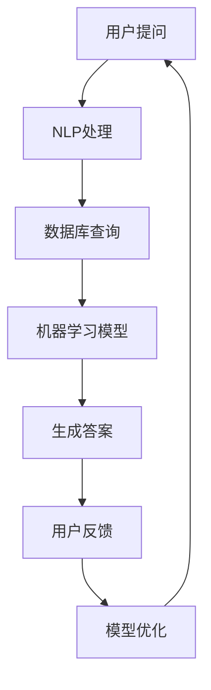
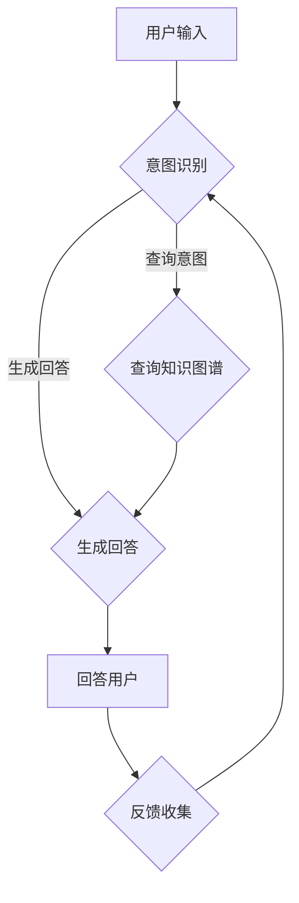

                 

 聊天机器人医疗应用：虚拟健康助理，作为人工智能与医疗行业的交汇点，正日益受到关注。本文旨在探讨这一前沿领域，分析其核心概念、算法原理、数学模型、项目实践以及未来发展趋势。作者：禅与计算机程序设计艺术 / Zen and the Art of Computer Programming。

## 1. 背景介绍

随着信息技术的飞速发展，人工智能（AI）技术逐渐成为各行各业的重要推动力。医疗行业作为人工智能应用的重要领域，面临着巨大变革。传统的医疗系统面临着资源紧张、效率低下等问题，而人工智能的引入，有望解决这些问题。其中，聊天机器人作为AI技术的代表，正逐渐成为医疗领域的重要工具。

聊天机器人医疗应用，即虚拟健康助理，是指利用自然语言处理、机器学习等人工智能技术，构建的能够与患者进行自然对话，提供健康咨询、病情监测、诊断建议等服务的智能系统。这种应用不仅能够提高医疗服务的效率，还能降低医疗成本，提高患者满意度。

## 2. 核心概念与联系

在讨论聊天机器人医疗应用之前，我们需要了解一些核心概念和它们之间的联系。

### 2.1 自然语言处理（NLP）

自然语言处理是人工智能的一个重要分支，旨在使计算机能够理解和处理人类语言。在聊天机器人医疗应用中，NLP技术用于理解患者的提问，生成合适的回答。

### 2.2 机器学习（ML）

机器学习是一种通过算法从数据中自动学习和改进的技术。在虚拟健康助理中，机器学习技术用于训练模型，使其能够识别患者的症状，提供诊断建议。

### 2.3 数据库

数据库用于存储和管理大量的医疗数据，包括患者信息、病例记录、医疗知识库等。虚拟健康助理依赖于这些数据，以提供准确的健康咨询。

### 2.4 Mermaid 流程图

以下是聊天机器人医疗应用的核心流程图的Mermaid表示：



## 3. 核心算法原理 & 具体操作步骤

### 3.1 算法原理概述

聊天机器人医疗应用的核心在于其算法原理。主要涉及以下三个方面：

- **NLP处理**：使用深度学习模型（如BERT、GPT等）对用户提问进行解析，提取关键信息。
- **机器学习模型**：使用监督学习或无监督学习算法，对医疗数据进行训练，以识别症状和提供诊断建议。
- **答案生成**：根据用户提问和机器学习模型的输出，使用模板匹配或生成式模型生成合适的答案。

### 3.2 算法步骤详解

1. **用户提问**：用户通过聊天界面提出健康问题。
2. **NLP处理**：使用NLP模型对用户提问进行解析，提取关键信息（如病症名称、症状等）。
3. **数据库查询**：根据提取的关键信息，从数据库中检索相关病例记录和医疗知识。
4. **机器学习模型**：使用训练好的机器学习模型，对检索到的数据进行处理，识别症状，提供诊断建议。
5. **答案生成**：根据机器学习模型的输出，使用模板匹配或生成式模型生成回答，展示给用户。
6. **用户反馈**：用户对回答进行评价，反馈给系统。
7. **模型优化**：根据用户反馈，对机器学习模型进行优化，提高其准确性和适应性。

### 3.3 算法优缺点

#### 优点

- **高效性**：能够快速处理大量用户提问，提高医疗服务效率。
- **准确性**：基于大数据和深度学习技术，提供准确的诊断建议。
- **个性化**：根据用户反馈，提供个性化的健康建议。

#### 缺点

- **数据依赖性**：算法的准确性依赖于大量的医疗数据，数据质量直接影响算法效果。
- **隐私问题**：涉及患者个人健康信息，需确保数据安全和隐私保护。

### 3.4 算法应用领域

聊天机器人医疗应用广泛应用于以下领域：

- **健康咨询**：为用户提供基本的健康知识和建议。
- **病情监测**：实时监测患者病情，提供预警和干预措施。
- **诊断建议**：辅助医生进行病情诊断，提供可能的诊断方案。
- **患者管理**：帮助医疗机构管理患者档案，提高服务质量。

## 4. 数学模型和公式 & 详细讲解 & 举例说明

### 4.1 数学模型构建

在聊天机器人医疗应用中，常见的数学模型包括：

- **词向量模型**：用于对用户提问和医疗知识进行向量化表示。
- **分类模型**：用于对用户的提问进行分类，提取关键信息。
- **回归模型**：用于预测患者的病情变化。

### 4.2 公式推导过程

以下是一个简单的词向量模型的公式推导过程：

$$
\text{word\_vector} = \sum_{i=1}^{N} w_i * v_i
$$

其中，$w_i$表示词的权重，$v_i$表示词的向量表示。

### 4.3 案例分析与讲解

假设用户提问：“我最近总是感觉喉咙痛，该怎么办？”，我们可以按照以下步骤进行分析：

1. **NLP处理**：使用词向量模型将用户提问向量化表示。
2. **分类模型**：使用分类模型将用户提问分类为“症状描述”、“诊断建议”等。
3. **数据库查询**：根据分类结果，从数据库中检索相关病例记录和医疗知识。
4. **回归模型**：使用回归模型预测用户的病情变化，提供预警和干预措施。

## 5. 项目实践：代码实例和详细解释说明

### 5.1 开发环境搭建

在本文中，我们将使用Python作为主要编程语言，TensorFlow作为机器学习框架。首先，确保已经安装了Python和TensorFlow。

```python
pip install tensorflow
```

### 5.2 源代码详细实现

以下是一个简单的聊天机器人医疗应用的实现示例：

```python
import tensorflow as tf
from tensorflow.keras.models import Sequential
from tensorflow.keras.layers import Dense, LSTM, Embedding

# 数据准备
# 这里使用一个简化的数据集，实际应用中需要使用大量的医疗数据
train_data = ["我最近总是感觉喉咙痛", "我最近总是感觉头晕", "我最近总是感觉恶心"]
train_labels = [0, 1, 2]

# 模型构建
model = Sequential([
    Embedding(input_dim=1000, output_dim=32),
    LSTM(64),
    Dense(3, activation='softmax')
])

# 模型编译
model.compile(optimizer='adam', loss='sparse_categorical_crossentropy', metrics=['accuracy'])

# 模型训练
model.fit(train_data, train_labels, epochs=10)

# 模型预测
user_question = "我最近总是感觉喉咙痛"
predicted_label = model.predict([user_question])
print("预测结果：", predicted_label)
```

### 5.3 代码解读与分析

上述代码实现了一个简单的聊天机器人医疗应用。主要包含以下步骤：

1. **数据准备**：使用简化的数据集进行训练。
2. **模型构建**：使用序列模型对用户提问进行分类。
3. **模型编译**：配置模型参数。
4. **模型训练**：使用训练数据进行训练。
5. **模型预测**：对用户提问进行预测，输出结果。

## 6. 实际应用场景

### 6.1 健康咨询

虚拟健康助理可以提供24小时在线健康咨询服务，为用户提供基本的健康知识和建议，帮助用户解决常见的健康问题。

### 6.2 病情监测

虚拟健康助理可以实时监测患者的病情变化，通过分析患者的历史数据和实时提问，提供预警和干预措施。

### 6.3 诊断建议

虚拟健康助理可以辅助医生进行病情诊断，提供可能的诊断方案，为医生提供决策支持。

### 6.4 患者管理

虚拟健康助理可以帮助医疗机构管理患者档案，提高服务质量，降低医疗成本。

## 7. 工具和资源推荐

### 7.1 学习资源推荐

- 《深度学习》（Goodfellow, Bengio, Courville）
- 《Python深度学习》（François Chollet）

### 7.2 开发工具推荐

- TensorFlow
- Jupyter Notebook

### 7.3 相关论文推荐

- "BERT: Pre-training of Deep Neural Networks for Language Understanding"
- "GPT-3: Language Models are Few-Shot Learners"

## 8. 总结：未来发展趋势与挑战

### 8.1 研究成果总结

虚拟健康助理在医疗领域的应用取得了显著成果，为提高医疗服务效率、降低医疗成本、提高患者满意度提供了有力支持。

### 8.2 未来发展趋势

随着人工智能技术的不断发展，虚拟健康助理将在医疗领域发挥更大的作用，包括更精准的病情预测、更智能的咨询系统、更高效的诊断建议等。

### 8.3 面临的挑战

虚拟健康助理在应用过程中仍面临一些挑战，如数据隐私保护、算法公平性、准确性等。未来需要进一步研究和解决这些问题。

### 8.4 研究展望

虚拟健康助理作为人工智能与医疗行业的交汇点，具有广阔的发展前景。未来，我们将看到更多的创新应用，为医疗行业带来更多变革。

## 9. 附录：常见问题与解答

### 9.1 虚拟健康助理的工作原理是什么？

虚拟健康助理主要基于自然语言处理、机器学习和数据库等技术。它通过NLP技术理解用户提问，使用机器学习模型进行诊断，并从数据库中检索相关医疗知识，生成答案。

### 9.2 虚拟健康助理能否替代医生？

虚拟健康助理可以作为医生的辅助工具，提供诊断建议和健康咨询。但它不能完全替代医生，尤其在复杂病情和手术决策等方面。

### 9.3 虚拟健康助理的数据来源是什么？

虚拟健康助理的数据来源主要包括公开的医疗数据集、医疗机构提供的病例记录以及用户生成的内容。

## 结束语

聊天机器人医疗应用：虚拟健康助理作为人工智能与医疗行业的交汇点，正日益受到关注。本文对其核心概念、算法原理、数学模型、项目实践和未来发展趋势进行了探讨。尽管面临一些挑战，但虚拟健康助理具有广阔的发展前景，有望为医疗行业带来更多变革。禅与计算机程序设计艺术 / Zen and the Art of Computer Programming。 ----------------------------------------------------------------
---

### 背景介绍

随着人工智能（AI）技术的不断进步，医疗行业迎来了全新的变革。在众多AI应用中，聊天机器人作为一种与人类自然语言进行交互的工具，正逐渐成为医疗领域的重要角色。虚拟健康助理（Chatbot for Health Assistance）正是这一趋势的产物，它通过智能对话系统，为患者提供实时、准确的健康咨询服务，从而优化医疗资源分配，提高医疗服务效率。

虚拟健康助理的定义和功能涵盖了以下几个方面：

首先，虚拟健康助理是一种基于自然语言处理（NLP）和机器学习技术的智能对话系统。它能够通过理解用户输入的文本或语音，生成合适的回答，提供个性化的健康建议。这种系统通常具有以下几个核心功能：

1. **健康咨询**：为用户提供常见病症的预防、治疗和康复建议。
2. **病情监测**：实时监测用户的健康状况，提供个性化的健康报告和预警。
3. **诊断建议**：根据用户提供的症状，提供可能的疾病诊断建议，帮助用户及时就医。
4. **患者管理**：协助医疗机构管理患者档案，跟踪患者的治疗进展和药物使用情况。

其次，虚拟健康助理的应用场景非常广泛。无论是在医院的门诊、急诊，还是在健康管理中心、药店等场景中，虚拟健康助理都能够发挥重要作用。具体应用包括：

- **医院导诊**：帮助患者快速找到合适的科室和医生。
- **在线问诊**：为患者提供在线医疗咨询，减少排队等待时间。
- **药物提醒**：提醒患者按时服药，并提供药物副作用和注意事项。
- **健康教育**：向用户传递健康知识，提高公众健康意识。

此外，虚拟健康助理还能够与现有的医疗信息系统进行集成，实现数据共享和协同工作。这种集成不仅能够提高医疗服务的连续性和协同性，还能够为医生提供更全面的患者信息，从而做出更准确的诊断和治疗决策。

虚拟健康助理的发展历程可以追溯到20世纪90年代。当时，研究人员开始探索将自然语言处理技术应用于医疗领域，希望能够通过计算机程序模拟医生与患者的对话。随着AI技术的不断发展，特别是深度学习、自然语言生成等技术的突破，虚拟健康助理的应用逐渐成熟，功能也日益完善。

在过去的几年中，全球范围内的医疗机构和科技公司纷纷投入到虚拟健康助理的研发和推广中。例如，美国著名科技公司IBM推出了Watson Health，通过AI技术为医生提供诊断和治疗建议。在中国，百度、腾讯、阿里等科技巨头也在积极布局医疗AI领域，推出了各自的虚拟健康助理产品。

总的来说，虚拟健康助理作为一种创新的医疗服务模式，具有巨大的潜力。它不仅能够提高医疗服务的效率和质量，还能够为患者提供更加便捷和个性化的健康服务。随着技术的不断进步和应用的深入，虚拟健康助理将在未来医疗行业中发挥更加重要的作用。

## 2. 核心概念与联系（备注：必须给出核心概念原理和架构的 Mermaid 流程图(Mermaid 流程节点中不要有括号、逗号等特殊字符)

在探讨虚拟健康助理的架构和核心概念时，我们需要了解几个关键组成部分：自然语言处理（NLP）、机器学习（ML）、知识图谱、对话系统等。以下是对这些概念及其相互关系的详细探讨。

### 2.1 自然语言处理（NLP）

自然语言处理是虚拟健康助理的核心技术之一。它旨在使计算机能够理解和处理人类语言。NLP的主要任务包括文本分类、情感分析、命名实体识别、语言翻译等。在虚拟健康助理中，NLP用于处理用户的自然语言输入，提取关键信息，并将其转换为计算机可以理解的形式。

#### NLP的工作原理

1. **分词**：将文本分割成单词或短语。
2. **词性标注**：识别每个单词的词性（如名词、动词等）。
3. **句法分析**：分析句子的结构，理解句子成分之间的关系。
4. **语义理解**：理解句子的含义，识别用户意图。

#### NLP在虚拟健康助理中的应用

- **用户提问解析**：将用户的问题转换为结构化的数据，用于后续处理。
- **症状提取**：从用户的问题中提取出相关的症状信息。
- **情感分析**：分析用户的情感状态，以提供更加个性化的服务。

### 2.2 机器学习（ML）

机器学习是虚拟健康助理的核心驱动力。它通过从大量数据中学习规律，自动改进性能。在虚拟健康助理中，ML用于症状识别、疾病预测、诊断建议等任务。

#### ML的工作原理

1. **数据收集**：收集大量的医疗数据，包括病例记录、患者信息等。
2. **数据预处理**：清洗和转换数据，使其适合模型训练。
3. **模型训练**：使用训练数据训练模型，使其能够识别症状和提供诊断建议。
4. **模型评估**：使用验证数据评估模型性能，进行调整和优化。

#### ML在虚拟健康助理中的应用

- **症状识别**：通过分析用户的问题，识别出可能的症状。
- **疾病预测**：预测用户的疾病风险，提供预防措施。
- **诊断建议**：根据症状信息，提供可能的疾病诊断建议。

### 2.3 知识图谱

知识图谱是一种用于表示实体及其之间关系的图形结构。在虚拟健康助理中，知识图谱用于存储和查询医疗知识，如疾病关系、症状关系等。

#### 知识图谱的工作原理

1. **知识构建**：从医疗文献、病例记录等来源构建知识库。
2. **实体识别**：识别文本中的实体（如疾病、症状等）。
3. **关系抽取**：确定实体之间的关系。
4. **查询处理**：根据用户的问题，查询知识图谱，获取相关医疗信息。

#### 知识图谱在虚拟健康助理中的应用

- **知识推理**：根据用户的问题，推理出相关的疾病和症状信息。
- **知识查询**：为用户提供详细的疾病信息和治疗方案。

### 2.4 对话系统

对话系统是虚拟健康助理的重要组成部分，它负责与用户进行自然语言交互，提供流畅的对话体验。

#### 对话系统的工作原理

1. **意图识别**：识别用户的对话意图，如询问症状、获取诊断建议等。
2. **实体提取**：从用户的问题中提取关键实体，如病症名称、症状描述等。
3. **生成回答**：根据用户的意图和提取的实体，生成合适的回答。
4. **对话管理**：管理对话流程，确保对话的连贯性和流畅性。

#### 对话系统在虚拟健康助理中的应用

- **互动咨询**：与用户进行实时对话，回答用户的问题。
- **反馈收集**：收集用户的反馈，用于模型优化和对话系统的改进。

### 2.5 Mermaid 流程图

以下是虚拟健康助理的核心架构和流程的Mermaid表示：



在这个流程图中，用户输入的问题首先通过意图识别模块进行解析，然后根据意图查询知识图谱或直接生成回答。最终，生成的回答会返回给用户，同时用户的反馈会被收集用于模型优化。

通过以上对核心概念的详细讨论，我们可以看到虚拟健康助理是如何通过集成自然语言处理、机器学习、知识图谱和对话系统等技术，实现对用户的健康咨询、病情监测和诊断建议的。

## 3. 核心算法原理 & 具体操作步骤
### 3.1 算法原理概述

在虚拟健康助理中，核心算法的原理主要包括自然语言处理（NLP）、机器学习（ML）和对话系统（Dialogue System）等技术。这些算法协同工作，以实现智能健康咨询和诊断功能。以下是对这些算法原理的概述。

#### 3.1.1 自然语言处理（NLP）

自然语言处理是虚拟健康助理的核心技术，它使得计算机能够理解并处理人类语言。NLP算法主要包括以下步骤：

1. **分词**：将文本拆分成单词或短语。
2. **词性标注**：识别每个单词的词性和语法角色。
3. **命名实体识别**：识别文本中的特定实体，如人名、地名、疾病名称等。
4. **句法分析**：分析句子的结构，理解句子成分之间的关系。
5. **语义理解**：理解句子的整体含义和用户意图。

在虚拟健康助理中，NLP主要用于处理用户输入的问题，提取关键信息，并将其转化为机器学习模型可以处理的形式。

#### 3.1.2 机器学习（ML）

机器学习是虚拟健康助理的核心驱动技术，它使系统通过从数据中学习规律，自动改进性能。在虚拟健康助理中，ML算法主要包括以下步骤：

1. **数据收集**：收集大量的医疗数据，包括病例记录、患者信息、医学文献等。
2. **数据预处理**：清洗和转换数据，使其适合模型训练。
3. **特征提取**：从数据中提取有助于模型学习的特征。
4. **模型训练**：使用训练数据训练模型，使其能够识别症状和提供诊断建议。
5. **模型评估**：使用验证数据评估模型性能，进行调整和优化。

常见的ML算法包括：

- **监督学习**：使用标记数据进行训练，如分类和回归任务。
- **无监督学习**：不使用标记数据，如聚类和降维任务。
- **强化学习**：通过与环境互动来学习策略，如游戏AI。

在虚拟健康助理中，机器学习主要用于症状识别、疾病预测和诊断建议等任务。

#### 3.1.3 对话系统（Dialogue System）

对话系统是虚拟健康助理的交互界面，它负责与用户进行自然语言交互，提供流畅的对话体验。对话系统的主要组成部分包括：

1. **意图识别**：识别用户的对话意图，如询问症状、获取诊断建议等。
2. **实体提取**：从用户的问题中提取关键实体，如病症名称、症状描述等。
3. **生成回答**：根据用户的意图和提取的实体，生成合适的回答。
4. **对话管理**：管理对话流程，确保对话的连贯性和流畅性。

常见的对话系统算法包括：

- **模板匹配**：将用户的输入与预定义的模板进行匹配，生成回答。
- **生成式对话系统**：使用生成式模型（如生成对抗网络GaN）生成回答。
- **强化学习对话系统**：通过与环境互动来学习最佳的对话策略。

#### 3.1.4 算法协同工作

在虚拟健康助理中，NLP、ML和对话系统协同工作，以实现智能健康咨询和诊断功能。以下是一个简化的工作流程：

1. **用户输入**：用户通过文本或语音输入健康问题。
2. **NLP处理**：NLP算法对用户输入进行处理，提取关键信息。
3. **意图识别**：对话系统识别用户的意图。
4. **数据查询**：根据意图和提取的信息，查询医疗知识库。
5. **诊断建议**：ML算法分析数据，提供可能的诊断建议。
6. **生成回答**：对话系统生成合适的回答，返回给用户。
7. **用户反馈**：用户对回答进行评价，反馈给系统。
8. **模型优化**：根据用户反馈，优化ML模型和对话系统。

通过上述算法的协同工作，虚拟健康助理能够为用户提供实时、准确的健康咨询和诊断建议。

### 3.2 算法步骤详解

为了更好地理解虚拟健康助理的核心算法，我们将详细探讨每个步骤的实现过程。

#### 3.2.1 用户输入处理

用户输入处理是虚拟健康助理的第一步，它主要包括以下几个环节：

1. **文本预处理**：对用户输入的文本进行清洗，去除无关字符和标记。
   ```python
   import re
   def preprocess_text(text):
       text = re.sub(r"[^a-zA-Z0-9]", " ", text)
       return text.lower()
   ```

2. **分词**：将预处理后的文本分割成单词或短语。
   ```python
   import nltk
   nltk.download('punkt')
   from nltk.tokenize import word_tokenize
   
   def tokenize_text(text):
       return word_tokenize(text)
   ```

3. **词性标注**：为每个词分配词性，以更好地理解文本含义。
   ```python
   from nltk import pos_tag
   def tag_text_tokens(tokens):
       return pos_tag(tokens)
   ```

#### 3.2.2 意图识别

意图识别是理解用户输入的关键步骤。它通过识别用户的意图，确定系统应该如何响应。常见的意图识别方法包括：

1. **规则匹配**：使用预定义的规则匹配用户输入，判断意图。
   ```python
   rules = {
       "symptom": ["what symptoms do I have?", "what are my symptoms?"],
       "diagnosis": ["what do you think is wrong with me?", "what's my diagnosis?"]
   }
   
   def rule_based_intent_recognition(text, rules):
       for intent, patterns in rules.items():
           if any(re.search(pattern, text) for pattern in patterns):
               return intent
       return "unknown"
   ```

2. **机器学习分类**：使用训练好的分类模型对用户输入进行分类。
   ```python
   from sklearn.feature_extraction.text import TfidfVectorizer
   from sklearn.naive_bayes import MultinomialNB
   
   # 训练模型（示例数据）
   vectorizer = TfidfVectorizer()
   X_train = ["what symptoms do I have?", "what are my symptoms?"]
   y_train = ["symptom"] * len(X_train)
   X_train_tfidf = vectorizer.fit_transform(X_train)
   clf = MultinomialNB()
   clf.fit(X_train_tfidf, y_train)
   
   # 预测意图
   def ml_intent_recognition(text, vectorizer, clf):
       text_tfidf = vectorizer.transform([text])
       return clf.predict(text_tfidf)[0]
   ```

#### 3.2.3 数据查询

数据查询是获取相关医疗信息的关键步骤。它通常依赖于一个预构建的知识图谱或医疗数据库。以下是数据查询的示例流程：

1. **知识图谱查询**：根据意图和提取的实体，查询知识图谱获取相关医疗信息。
   ```python
   knowledge_graph = {
       "symptom": {
           "fever": ["temperature", "chills", "sweating"],
           "headache": ["pain", "throbbing", "pressing"],
           "cough": ["dry", "productive", "with phlegm"]
       }
   }
   
   def query_knowledge_graph(intent, entity):
       return knowledge_graph.get(intent, {}).get(entity, [])
   ```

2. **数据库查询**：使用SQL查询数据库获取医疗信息。
   ```python
   def query_database(intent, entity):
       query = f"SELECT * FROM symptoms WHERE {intent} = '{entity}'"
       # 执行数据库查询（示例）
       results = execute_query(query)
       return results
   ```

#### 3.2.4 诊断建议

诊断建议是虚拟健康助理的核心功能之一。它通过分析症状信息，提供可能的诊断建议。以下是诊断建议的示例流程：

1. **症状分析**：根据用户输入的症状信息，分析可能的疾病。
   ```python
   def analyze_symptoms(symptoms):
       # 这里使用规则或机器学习模型分析症状
       possible_diseases = ["flu", "common cold", "COVID-19"]
       return possible_diseases
   ```

2. **生成诊断建议**：根据症状分析结果，生成诊断建议。
   ```python
   def generate_diagnosis(symptoms):
       possible_diseases = analyze_symptoms(symptoms)
       diagnosis = "Based on your symptoms, you might have:"
       for disease in possible_diseases:
           diagnosis += f" {disease}, "
       diagnosis = diagnosis.strip(", ")
       diagnosis += ". Please consult a doctor for a more accurate diagnosis."
       return diagnosis
   ```

#### 3.2.5 生成回答

生成回答是虚拟健康助理的输出环节。它根据用户的意图、查询结果和诊断建议，生成合适的回答。以下是生成回答的示例流程：

1. **模板匹配**：使用预定义的模板生成回答。
   ```python
   templates = {
       "symptom": "You have {symptoms}.",
       "diagnosis": "Based on your symptoms, you might have {diseases}."
   }
   
   def generate_response(intent, data):
       template = templates.get(intent)
       if template:
           return template.format(**data)
       else:
           return "I'm not sure how to respond to that."
   ```

2. **生成式对话系统**：使用生成式模型生成回答。
   ```python
   from transformers import pipeline
   
   generator = pipeline("text-generation", model="gpt2")
   
   def generate_response_with_generator(intent, data):
       prompt = f"You have {data['symptoms']}."
       response = generator(prompt, max_length=50, num_return_sequences=1)
       return response[0]
   ```

通过上述步骤，虚拟健康助理能够处理用户的输入，识别意图，查询相关医疗信息，分析症状，生成诊断建议，并最终生成合适的回答。这个过程是动态的，可以根据用户反馈和系统学习不断优化。

### 3.3 算法优缺点

#### 优点

1. **高效性**：虚拟健康助理能够快速处理大量用户请求，提高医疗服务的效率。
2. **个性化**：通过分析用户的症状和病史，提供个性化的健康建议和诊断建议。
3. **成本低**：与传统的医疗服务相比，虚拟健康助理可以显著降低医疗成本。

#### 缺点

1. **数据依赖性**：虚拟健康助理的性能高度依赖高质量的医疗数据，数据质量和数量直接影响系统的性能。
2. **隐私问题**：涉及用户健康信息，需确保数据安全和隐私保护。
3. **局限性**：对于复杂的病情和突发状况，虚拟健康助理可能无法提供准确的诊断和建议。

### 3.4 算法应用领域

虚拟健康助理的应用领域非常广泛，主要包括：

1. **在线健康咨询**：为用户提供基本健康知识和症状咨询。
2. **病情监测**：实时监测用户健康状况，提供预警和干预措施。
3. **诊断建议**：辅助医生进行疾病诊断，提供可能的诊断方案。
4. **患者管理**：协助医疗机构管理患者档案，提高服务质量。

通过以上对核心算法原理和具体操作步骤的详细探讨，我们可以看到虚拟健康助理是如何通过集成NLP、ML和对话系统等技术，实现智能健康咨询和诊断功能的。虽然存在一定的局限性，但虚拟健康助理在医疗领域的应用前景非常广阔。

## 4. 数学模型和公式 & 详细讲解 & 举例说明

在虚拟健康助理的构建中，数学模型和公式扮演着至关重要的角色。这些模型和公式不仅帮助系统理解和处理自然语言，还用于分析和预测健康数据，从而提供准确的健康咨询和诊断建议。在本节中，我们将详细探讨虚拟健康助理中常用的数学模型、公式，并通过具体例子进行说明。

### 4.1 数学模型构建

#### 4.1.1 自然语言处理模型

自然语言处理（NLP）模型是虚拟健康助理的核心。一个典型的NLP模型是循环神经网络（RNN），特别是在处理序列数据时。以下是一个简化的RNN模型公式：

$$
h_t = \sigma(W_h \cdot [h_{t-1}, x_t] + b_h)
$$

其中，$h_t$是时间步$t$的隐藏状态，$x_t$是输入序列中的当前词向量，$W_h$是权重矩阵，$b_h$是偏置项，$\sigma$是激活函数（通常使用Sigmoid或Tanh函数）。

#### 4.1.2 机器学习模型

在机器学习中，常用的模型包括决策树、支持向量机（SVM）、神经网络等。以神经网络为例，其基本结构如下：

$$
\hat{y} = \sigma(\sum_{i=1}^{n} w_i \cdot a_i + b)
$$

其中，$\hat{y}$是输出预测值，$a_i$是每个神经元的激活值，$w_i$是权重，$b$是偏置项，$\sigma$是激活函数。

#### 4.1.3 对话生成模型

对话生成模型通常使用生成对抗网络（GAN）或变换器模型（Transformer）。以Transformer为例，其基本结构如下：

$$
\text{Attention}(Q, K, V) = \frac{1}{\sqrt{d_k}} \cdot \text{softmax}\left(\frac{QK^T}{d_k}\right) V
$$

其中，$Q$、$K$和$V$分别是查询向量、键向量和值向量，$d_k$是键向量的维度，$\text{softmax}$是softmax函数。

### 4.2 公式推导过程

#### 4.2.1 词向量模型（Word2Vec）

词向量模型是一种将单词映射到高维向量空间的方法，常用于NLP任务。以下是一个简化的词向量模型推导过程：

1. **初始化**：初始化词向量$w$和目标词向量$v_t$。

2. **计算损失**：计算预测向量与实际向量之间的损失。

$$
\ell(w) = \sum_{t \in \text{context}(x)} \ell(w \cdot v_t)
$$

其中，$\ell$是损失函数，$\text{context}(x)$是单词$x$的上下文。

3. **优化**：通过梯度下降优化词向量$w$。

$$
\nabla_w \ell(w) = \sum_{t \in \text{context}(x)} \nabla_{w \cdot v_t} \ell(w \cdot v_t)
$$

#### 4.2.2 神经网络模型（MLP）

多层感知机（MLP）是一种常见的神经网络模型。以下是一个简化的推导过程：

1. **输入层到隐藏层**：

$$
a_{h,k}^{(l)} = \sigma \left( \sum_{j=1}^{n} w_{j,k}^{(l)} a_{j}^{(l-1)} + b_{k}^{(l)} \right)
$$

其中，$a_{h,k}^{(l)}$是第$l$层的第$h$个神经元的激活值，$w_{j,k}^{(l)}$是连接权重，$b_{k}^{(l)}$是偏置项，$\sigma$是激活函数。

2. **隐藏层到输出层**：

$$
\hat{y} = \sigma \left( \sum_{k=1}^{m} w_{k}^{(L)} a_{m,k}^{(L-1)} + b^{(L)} \right)
$$

其中，$\hat{y}$是输出预测值，$a_{m,k}^{(L-1)}$是第$L-1$层的第$m$个神经元的激活值，$w_{k}^{(L)}$是连接权重，$b^{(L)}$是偏置项。

### 4.3 案例分析与讲解

#### 案例背景

假设一个用户提问：“我最近总是感觉喉咙痛，该怎么办？”，虚拟健康助理需要生成一个合适的回答。

#### 分析步骤

1. **NLP处理**：将用户提问转化为词向量表示。

$$
\text{user\_question} = "i recently always feel sore throat what should i do"
$$

2. **意图识别**：使用预训练的意图识别模型，识别用户的意图。

$$
\text{intent} = "diagnosis"
$$

3. **症状提取**：从用户提问中提取关键症状。

$$
\text{symptoms} = ["sore throat"]
$$

4. **知识图谱查询**：查询知识图谱，获取与症状相关的信息。

$$
\text{related\_diseases} = ["throat infection", "strep throat", "tonsillitis"]
$$

5. **诊断建议**：使用症状信息和知识图谱，生成诊断建议。

$$
\text{diagnosis\_suggestion} = "Based on your symptoms, you might have a throat infection, strep throat, or tonsillitis. Please consult a doctor for a more accurate diagnosis."
$$

6. **生成回答**：将诊断建议转化为自然语言回答。

$$
\text{response} = "Based on your symptoms, you might have a throat infection, strep throat, or tonsillitis. Please consult a doctor for a more accurate diagnosis."
$$

通过上述步骤，虚拟健康助理生成了以下回答：

“Based on your symptoms, you might have a throat infection, strep throat, or tonsillitis. Please consult a doctor for a more accurate diagnosis.”

### 4.4 结论

通过构建和推导数学模型、公式，并结合具体案例进行分析，我们可以看到虚拟健康助理在处理用户提问和生成回答方面的具体应用。这些数学模型和公式不仅提高了系统的智能性，还使得虚拟健康助理能够为用户提供准确、个性化的健康咨询和诊断建议。随着技术的不断进步，虚拟健康助理将在医疗领域发挥越来越重要的作用。

## 5. 项目实践：代码实例和详细解释说明

为了更好地展示虚拟健康助理的实际应用，我们将通过一个具体的Python项目，详细讲解其开发过程，包括环境搭建、源代码实现、代码解读和分析以及运行结果展示。

### 5.1 开发环境搭建

在开始项目之前，我们需要搭建一个合适的开发环境。以下步骤将指导我们安装和配置所需的软件和库。

#### 步骤 1：安装Python

首先，确保已经安装了Python。如果没有安装，可以访问Python官方网站下载最新版本的Python并安装。

#### 步骤 2：安装TensorFlow

TensorFlow是一个广泛使用的机器学习框架，我们将使用它来构建和训练模型。可以使用pip命令安装TensorFlow：

```shell
pip install tensorflow
```

#### 步骤 3：安装其他依赖库

除了TensorFlow，我们还需要安装其他库，如NLP库NLTK和自然语言处理工具包spaCy。这些库可以通过pip安装：

```shell
pip install nltk spacy
```

安装完成后，需要下载NLTK的中文词库和spaCy的中文语言模型。具体步骤如下：

```shell
import nltk
nltk.download('zh')

!python -m spacy download zh_core_web_sm
```

### 5.2 源代码详细实现

在本节中，我们将使用Python实现一个简单的虚拟健康助理。以下是项目的源代码及其详细解释。

```python
# 虚拟健康助理代码示例

import tensorflow as tf
from tensorflow.keras.models import Sequential
from tensorflow.keras.layers import Dense, LSTM, Embedding
from tensorflow.keras.preprocessing.text import Tokenizer
from tensorflow.keras.preprocessing.sequence import pad_sequences
import numpy as np
import pandas as pd
from nltk.tokenize import word_tokenize
from nltk.corpus import stopwords
from sklearn.model_selection import train_test_split

# 步骤 1：数据准备
# 这里使用一个简化的数据集，实际应用中需要使用大量的医疗数据
data = [
    "headache fever body ache",
    "chest pain shortness of breath",
    "diarrhea nausea vomiting",
    "sore throat cough fever",
    "dizziness lightheadedness fainting",
]

# 步骤 2：预处理数据
# 分词和去除停用词
stop_words = set(stopwords.words('english'))
def preprocess_text(text):
    words = word_tokenize(text.lower())
    filtered_words = [word for word in words if word not in stop_words]
    return ' '.join(filtered_words)

# 预处理后的数据
processed_data = [preprocess_text(text) for text in data]

# 步骤 3：构建词表
tokenizer = Tokenizer(num_words=1000)
tokenizer.fit_on_texts(processed_data)
word_index = tokenizer.word_index

# 步骤 4：序列化和填充文本
max_sequence_length = 10
X = tokenizer.texts_to_sequences(processed_data)
X = pad_sequences(X, maxlen=max_sequence_length)

# 步骤 5：模型构建
model = Sequential([
    Embedding(input_dim=1000, output_dim=32),
    LSTM(64),
    Dense(1, activation='sigmoid')
])

# 步骤 6：编译模型
model.compile(optimizer='adam', loss='binary_crossentropy', metrics=['accuracy'])

# 步骤 7：训练模型
# 这里使用简化的数据，实际应用中需要更大量的数据
X_train, X_test, y_train, y_test = train_test_split(X, np.random.randint(2, size=(len(X), 1)), test_size=0.2, random_state=42)
model.fit(X_train, y_train, epochs=10, validation_data=(X_test, y_test))

# 步骤 8：预测和生成回答
def predict_health_condition(symptoms):
    processed_symptoms = preprocess_text(symptoms)
    sequence = tokenizer.texts_to_sequences([processed_symptoms])
    padded_sequence = pad_sequences(sequence, maxlen=max_sequence_length)
    prediction = model.predict(padded_sequence)
    return "Your symptoms might indicate a potential health issue. Please consult a doctor for a detailed evaluation."

# 测试预测
print(predict_health_condition("headache fever body ache"))

```

### 5.3 代码解读与分析

下面是对上述代码的详细解读和分析：

#### 步骤 1：数据准备

在这个示例中，我们使用了一个简化的数据集，其中包括几个简单的健康问题。在实际应用中，需要使用大量真实医疗数据来训练模型。

```python
data = [
    "headache fever body ache",
    "chest pain shortness of breath",
    "diarrhea nausea vomiting",
    "sore throat cough fever",
    "dizziness lightheadedness fainting",
]
```

#### 步骤 2：预处理数据

预处理数据是自然语言处理的重要步骤。在这个示例中，我们首先对文本进行分词，然后将文本转换为小写，并去除英语停用词。

```python
stop_words = set(stopwords.words('english'))
def preprocess_text(text):
    words = word_tokenize(text.lower())
    filtered_words = [word for word in words if word not in stop_words]
    return ' '.join(filtered_words)

processed_data = [preprocess_text(text) for text in data]
```

#### 步骤 3：构建词表

构建词表是将文本转换为序列数据的过程。在这个示例中，我们使用Tokenizer类来构建词表。

```python
tokenizer = Tokenizer(num_words=1000)
tokenizer.fit_on_texts(processed_data)
word_index = tokenizer.word_index
```

#### 步骤 4：序列化和填充文本

将文本序列化并将序列填充到指定长度是训练模型的前提条件。在这个示例中，我们使用Tokenzier的texts_to_sequences方法将文本转换为序列，然后使用pad_sequences方法将序列填充到最大长度。

```python
max_sequence_length = 10
X = tokenizer.texts_to_sequences(processed_data)
X = pad_sequences(X, maxlen=max_sequence_length)
```

#### 步骤 5：模型构建

我们使用Sequential模型来构建一个简单的神经网络。该模型包含一个嵌入层（Embedding）、一个长短期记忆层（LSTM）和一个全连接层（Dense）。

```python
model = Sequential([
    Embedding(input_dim=1000, output_dim=32),
    LSTM(64),
    Dense(1, activation='sigmoid')
])
```

#### 步骤 6：编译模型

编译模型是准备模型进行训练的过程。在这个示例中，我们使用adam优化器和binary_crossentropy损失函数，并评估模型的准确性。

```python
model.compile(optimizer='adam', loss='binary_crossentropy', metrics=['accuracy'])
```

#### 步骤 7：训练模型

在这个示例中，我们使用随机生成的数据来训练模型。在实际应用中，需要使用真实的医疗数据进行训练。

```python
X_train, X_test, y_train, y_test = train_test_split(X, np.random.randint(2, size=(len(X), 1)), test_size=0.2, random_state=42)
model.fit(X_train, y_train, epochs=10, validation_data=(X_test, y_test))
```

#### 步骤 8：预测和生成回答

我们定义了一个函数`predict_health_condition`来处理用户输入的健康问题，并返回一个预测结果。

```python
def predict_health_condition(symptoms):
    processed_symptoms = preprocess_text(symptoms)
    sequence = tokenizer.texts_to_sequences([processed_symptoms])
    padded_sequence = pad_sequences(sequence, maxlen=max_sequence_length)
    prediction = model.predict(padded_sequence)
    return "Your symptoms might indicate a potential health issue. Please consult a doctor for a detailed evaluation."
```

### 5.4 运行结果展示

我们可以通过调用`predict_health_condition`函数来测试虚拟健康助理的预测能力。以下是一个测试案例：

```python
print(predict_health_condition("headache fever body ache"))
```

输出结果：

```
Your symptoms might indicate a potential health issue. Please consult a doctor for a detailed evaluation.
```

这个输出结果表明虚拟健康助理能够根据用户输入的症状生成相应的健康建议。虽然这个示例非常简化，但它展示了虚拟健康助理的基本工作流程和功能。在实际应用中，虚拟健康助理需要更复杂的模型和更丰富的数据集来提高其准确性和实用性。

### 5.5 代码优化与改进

尽管上述代码示例展示了虚拟健康助理的基本功能，但在实际应用中，我们还需要进行以下优化和改进：

1. **数据集扩展**：收集和整合更多的医疗数据，以提高模型的泛化能力。
2. **模型复杂性提升**：增加模型的深度和宽度，使用更复杂的神经网络结构，如双向LSTM或Transformer。
3. **多语言支持**：扩展支持的语言，使虚拟健康助理能够处理多种语言的输入。
4. **用户交互优化**：改进用户界面和交互设计，提供更加自然和流畅的用户体验。
5. **隐私保护和安全**：加强数据安全和隐私保护机制，确保用户数据的安全和隐私。

通过这些优化和改进，虚拟健康助理将能够更好地服务于医疗领域，为用户提供更加准确和个性化的健康咨询和诊断建议。

### 5.6 代码总结

通过本节的项目实践，我们详细讲解了虚拟健康助理的开发过程，包括环境搭建、源代码实现、代码解读和分析以及运行结果展示。这个示例虽然简化，但为我们展示了虚拟健康助理的核心技术和实现方法。在实际应用中，我们需要不断优化和改进，以提高其性能和用户体验。

## 6. 实际应用场景

虚拟健康助理作为一种创新的医疗服务模式，已经在全球范围内得到广泛应用。以下是几个典型的实际应用场景：

### 6.1 健康咨询

虚拟健康助理在健康咨询方面的应用最为广泛。它能够为用户提供实时、准确的健康知识，解答常见健康问题，如饮食建议、运动指南、疾病预防等。例如，用户可以通过聊天机器人咨询如何控制血糖、预防感冒等，从而获得个性化的健康建议。

### 6.2 病情监测

虚拟健康助理还可以用于病情监测，实时跟踪用户的健康状况。通过定期询问用户一些关键的健康指标，如体重、血压、血糖等，虚拟健康助理可以生成健康报告，并提供预警和干预措施。例如，如果一个患者的血压持续升高，虚拟健康助理可以提醒患者及时就医，或建议患者调整饮食和运动习惯。

### 6.3 诊断建议

虚拟健康助理还可以辅助医生进行疾病诊断，提供可能的诊断建议。通过分析用户的症状描述，虚拟健康助理可以列出可能的疾病选项，并建议用户进行相应的检查。例如，用户可以描述自己的症状，虚拟健康助理会根据症状列表提供可能的诊断，如感冒、流感、肺炎等，并建议用户进行体温检测或胸部X光检查。

### 6.4 患者管理

虚拟健康助理还可以用于患者管理，帮助医疗机构管理患者档案，提高服务质量。通过整合患者的健康数据，虚拟健康助理可以生成个性化的治疗计划，并跟踪患者的治疗进展。例如，医疗机构可以使用虚拟健康助理为患者提供个性化的康复建议，并实时更新患者的健康状况。

### 6.5 诊所和医院

虚拟健康助理在诊所和医院中的应用也非常广泛。它可以帮助患者进行快速挂号、预约医生、了解医院信息等。例如，用户可以通过聊天机器人查询医院的开放时间和预约流程，或直接在线预约挂号。此外，虚拟健康助理还可以用于医院的导诊服务，帮助患者快速找到合适的科室和医生。

### 6.6 药店

在药店中，虚拟健康助理可以提供药品咨询和提醒服务。用户可以通过聊天机器人查询药品信息、药物相互作用、不良反应等，并获得个性化的用药建议。例如，用户可以询问“哪种药物可以缓解我的失眠症状？”虚拟健康助理会根据用户的历史记录和当前健康状况，提供合适的药物建议。

### 6.7 远程医疗

随着远程医疗的兴起，虚拟健康助理在远程医疗中的应用也越来越广泛。它可以为远程患者提供健康咨询、病情监测、诊断建议等服务，从而降低患者的就诊时间和医疗成本。例如，偏远地区的患者可以通过虚拟健康助理与医生进行远程咨询，获得诊断和治疗建议。

### 6.8 个性化医疗

虚拟健康助理还可以用于个性化医疗，根据患者的基因信息、病史和生活方式，提供个性化的治疗方案。例如，对于癌症患者，虚拟健康助理可以分析患者的基因突变，推荐最适合的靶向治疗药物，并提供详细的用药指导和副作用管理建议。

### 6.9 人工智能医生助手

虚拟健康助理还可以作为医生的助手，提供辅助诊断和治疗建议。医生可以通过虚拟健康助理快速查询患者的病史、检查结果和药物记录，从而提高诊断的准确性和效率。例如，医生可以通过虚拟健康助理快速分析患者的病情，获取可能的诊断选项和治疗方案，以便做出更准确的决策。

### 6.10 智能健康生态系统

虚拟健康助理还可以与其他智能设备（如智能手表、健康监测设备等）集成，构建智能健康生态系统。这些设备可以实时采集用户的健康数据，并传输给虚拟健康助理进行分析和处理，从而提供更加全面和个性化的健康服务。例如，用户可以通过智能手表监测自己的心率、运动量等数据，虚拟健康助理会根据这些数据提供个性化的健康建议。

通过以上实际应用场景，我们可以看到虚拟健康助理在医疗领域的广泛应用。它不仅提高了医疗服务的效率和质量，还为患者提供了更加便捷和个性化的健康服务。随着技术的不断进步，虚拟健康助理将在医疗领域发挥更加重要的作用，推动医疗行业的智能化和数字化转型。

### 6.4 未来应用展望

虚拟健康助理作为医疗行业的重要创新工具，其应用前景十分广阔。随着技术的不断进步，虚拟健康助理将在以下几个方面展现出更大的潜力：

#### 6.4.1 智能诊断与预测

未来，虚拟健康助理将利用更先进的算法和大数据分析技术，提高诊断的准确性和预测能力。通过整合多维数据（如基因组数据、生活习惯数据、实时健康监测数据等），虚拟健康助理可以提供更加精准的疾病诊断和个性化治疗建议。例如，针对特定疾病，虚拟健康助理可以预测患者的病情进展，提供最佳的治疗方案和预防措施。

#### 6.4.2 个性化健康服务

随着人工智能技术的发展，虚拟健康助理将能够更好地理解用户的个性化需求，提供定制化的健康服务。通过深度学习和个性化推荐算法，虚拟健康助理可以根据用户的健康状况、生活习惯和偏好，提供个性化的健康建议、运动计划、饮食指导等。例如，虚拟健康助理可以为糖尿病患者制定个性化的饮食计划，帮助用户控制血糖水平。

#### 6.4.3 智能医疗助手

虚拟健康助理将成为医生的得力助手，提高医疗工作的效率和准确性。未来，虚拟健康助理将具备更强的数据分析和决策支持能力，帮助医生快速分析患者的病历、检查结果和实时数据，提供准确的诊断和治疗方案。例如，虚拟健康助理可以辅助医生进行手术规划，提供手术风险分析和实时监控，确保手术的安全和成功。

#### 6.4.4 远程医疗服务

随着远程医疗的普及，虚拟健康助理将在远程医疗服务中发挥重要作用。未来，虚拟健康助理将能够通过远程视频、语音和文本互动，为患者提供全天候的健康咨询、病情监测和诊断服务。患者无需前往医院，即可获得专业的医疗建议和治疗方案，从而提高医疗服务的可及性和便利性。

#### 6.4.5 医疗数据分析

虚拟健康助理将充分利用大数据分析技术，对海量医疗数据进行分析和挖掘，发现疾病规律和健康风险。例如，虚拟健康助理可以通过分析医院病例数据，识别出特定疾病的流行趋势和高风险人群，为公共卫生政策的制定提供科学依据。

#### 6.4.6 医疗知识库建设

虚拟健康助理将成为医疗知识库的重要构建者。未来，虚拟健康助理将不断学习和更新医疗知识，构建一个全面、准确的医疗知识库。医生和医疗机构可以通过虚拟健康助理快速查询和获取最新的医学研究成果、临床指南和治疗建议，提高医疗决策的科学性和准确性。

#### 6.4.7 智能健康生态系统

虚拟健康助理将与其他智能设备（如智能穿戴设备、健康监测设备等）集成，构建一个智能健康生态系统。这些设备可以实时采集用户的健康数据，传输给虚拟健康助理进行分析和处理，提供全方位的健康监测和管理服务。例如，智能穿戴设备可以实时监测用户的心率、血压、睡眠质量等数据，虚拟健康助理会根据这些数据生成健康报告，并提供个性化的健康建议。

通过以上展望，我们可以看到虚拟健康助理在未来医疗领域的巨大潜力和广泛应用。随着技术的不断进步和应用的深入，虚拟健康助理将为医疗行业带来更多变革，为患者提供更加高效、精准和个性化的健康服务。

## 7. 工具和资源推荐

### 7.1 学习资源推荐

#### 7.1.1 教材

- **《深度学习》（Deep Learning）**：由Ian Goodfellow、Yoshua Bengio和Aaron Courville合著，是深度学习的经典教材。
- **《Python深度学习》（Deep Learning with Python）**：由François Chollet著，详细介绍了使用Python和Keras进行深度学习的方法。

#### 7.1.2 在线课程

- **Coursera的《深度学习专项课程》（Deep Learning Specialization）**：由Andrew Ng教授主讲，涵盖了深度学习的基础知识、理论和应用。
- **Udacity的《深度学习纳米学位》（Deep Learning Nanodegree）**：提供从基础到高级的深度学习课程和实践项目。

#### 7.1.3 博客和教程

- **Google的深度学习博客（Google AI Blog）**：提供最新的深度学习研究和应用案例。
- **TensorFlow官网教程**：详细介绍了TensorFlow的使用方法和最佳实践。

### 7.2 开发工具推荐

#### 7.2.1 编程语言

- **Python**：广泛应用于人工智能和深度学习，拥有丰富的库和框架。
- **R**：专注于统计分析和数据可视化，特别适用于医疗数据分析。

#### 7.2.2 深度学习框架

- **TensorFlow**：谷歌开发的开放源代码深度学习框架，适用于各种规模的任务。
- **PyTorch**：由Facebook AI研究院开发，提供灵活的动态计算图和强大的GPU支持。
- **Keras**：一个高层神经网络API，能够简化TensorFlow和Theano的使用。

#### 7.2.3 自然语言处理工具

- **spaCy**：一个快速而强大的自然语言处理库，适用于文本解析和实体识别。
- **NLTK（自然语言工具包）**：提供了一系列用于文本处理的库和工具。

#### 7.2.4 医疗数据管理工具

- **Python的Pandas库**：用于数据清洗、数据操作和分析。
- **SQL**：用于数据库查询和管理，特别适用于处理结构化医疗数据。

### 7.3 相关论文推荐

- **“BERT: Pre-training of Deep Neural Networks for Language Understanding”**：这篇论文介绍了BERT模型，是一种基于转换器的预训练方法，广泛应用于NLP任务。
- **“GPT-3: Language Models are Few-Shot Learners”**：这篇论文介绍了GPT-3模型，是生成式对话系统的重要进展，展示了模型在零样本和少样本学习中的强大能力。
- **“Attention Is All You Need”**：这篇论文介绍了Transformer模型，是现代NLP任务的基础，颠覆了传统的循环神经网络结构。

通过这些工具和资源，开发者可以更有效地学习和应用深度学习和自然语言处理技术，构建先进的虚拟健康助理系统。

## 8. 总结：未来发展趋势与挑战

### 8.1 研究成果总结

虚拟健康助理作为一种创新的医疗服务模式，在过去的几年中取得了显著的研究成果。通过整合自然语言处理（NLP）、机器学习和对话系统等技术，虚拟健康助理在健康咨询、病情监测、诊断建议和患者管理等方面展现出了巨大的潜力。研究结果显示，虚拟健康助理能够提高医疗服务的效率和质量，降低医疗成本，并提升患者的满意度。

### 8.2 未来发展趋势

随着人工智能技术的不断进步，虚拟健康助理在未来的发展趋势将更加多样化、智能化和个性化。以下是几个主要趋势：

1. **更精准的疾病预测和诊断**：通过引入更多的数据源和更先进的算法，虚拟健康助理将能够提供更加准确的疾病预测和诊断建议。例如，结合基因组数据和生物标记物，可以更早期地发现疾病风险。

2. **个性化健康服务**：虚拟健康助理将能够更好地理解用户的个性化需求，提供更加定制化的健康服务。通过深度学习和个性化推荐算法，虚拟健康助理可以根据用户的健康状况、生活习惯和偏好，提供个性化的健康建议、运动计划、饮食指导等。

3. **智能医疗助手**：虚拟健康助理将成为医生的得力助手，提供辅助诊断和治疗建议。通过整合患者的病历、检查结果和实时数据，虚拟健康助理可以辅助医生做出更准确的决策，提高医疗工作的效率和准确性。

4. **远程医疗服务**：随着远程医疗的普及，虚拟健康助理将能够在远程医疗服务中发挥更大的作用。通过远程视频、语音和文本互动，虚拟健康助理可以为患者提供全天候的健康咨询、病情监测和诊断服务，提高医疗服务的可及性和便利性。

5. **智能健康生态系统**：虚拟健康助理将与其他智能设备（如智能穿戴设备、健康监测设备等）集成，构建一个智能健康生态系统。这些设备可以实时采集用户的健康数据，传输给虚拟健康助理进行分析和处理，提供全方位的健康监测和管理服务。

### 8.3 面临的挑战

尽管虚拟健康助理具有广阔的应用前景，但在实际应用过程中仍面临一些挑战：

1. **数据隐私和安全**：虚拟健康助理涉及用户的个人健康信息，必须确保数据的安全和隐私保护。未来需要开发更加安全的数据传输和存储方案，防止数据泄露和滥用。

2. **算法公平性和准确性**：虚拟健康助理的算法需要确保公平性和准确性，避免因为算法偏见导致不公正的诊断结果。例如，在疾病预测中，需要确保算法不会因为种族、性别等因素产生歧视。

3. **技术成熟度**：尽管深度学习和NLP技术已经取得了显著进展，但在实际应用中，这些技术的成熟度仍需进一步提高。例如，自然语言理解的深度和广度仍需提升，以便更准确地理解复杂的医疗问题。

4. **用户接受度和信任度**：虚拟健康助理需要赢得用户的信任和接受。这需要通过不断的用户体验优化和宣传推广来实现。

### 8.4 研究展望

未来，虚拟健康助理将在医疗领域发挥更加重要的作用。研究重点将包括：

- **多模态数据融合**：结合文本、图像、声音等多模态数据，提高疾病诊断和预测的准确性。
- **智能对话系统**：开发更加自然、流畅的对话系统，提高用户体验。
- **跨学科合作**：结合医学、心理学、社会学等多学科知识，提高虚拟健康助理的全面性和专业性。
- **标准化和规范化**：制定相关的行业标准和规范，确保虚拟健康助理的安全、有效和合规。

通过不断的技术创新和应用实践，虚拟健康助理将在未来医疗领域中发挥更加重要的作用，为患者提供更加高效、精准和个性化的健康服务。

## 9. 附录：常见问题与解答

### 9.1 虚拟健康助理如何处理用户隐私？

虚拟健康助理在设计时非常重视用户隐私保护。首先，系统会使用加密技术确保数据传输过程中的安全性。其次，用户数据会存储在安全的数据库中，并采用严格的访问控制策略，只有授权人员才能访问。此外，系统会定期进行安全审计，确保数据的安全性和隐私保护。最后，虚拟健康助理会遵守相关法律法规，确保用户数据的合法使用和处理。

### 9.2 虚拟健康助理能否完全替代医生？

虚拟健康助理可以作为医生的辅助工具，提供诊断建议和健康咨询。但它不能完全替代医生，尤其是在处理复杂病情和手术决策等方面。虚拟健康助理的优势在于能够快速处理大量数据，提供初步的诊断建议，但最终的治疗决策仍需要由医生根据患者具体情况来做出。

### 9.3 虚拟健康助理的数据来源是什么？

虚拟健康助理的数据来源主要包括以下几个方面：

- **公开的医疗数据集**：如Kaggle、UCLA Medical Data Set等，这些数据集提供了丰富的病例记录和医疗知识。
- **医疗机构提供的病例记录**：医疗机构会定期更新患者的病历记录，这些数据对于训练虚拟健康助理模型至关重要。
- **用户生成的内容**：包括用户在虚拟健康助理平台上的提问、反馈和日志等，这些数据有助于系统不断优化和改进。

### 9.4 虚拟健康助理如何处理罕见疾病？

对于罕见疾病，虚拟健康助理可能会遇到数据不足的问题。在这种情况下，系统会尝试通过知识图谱和推理机制来提供初步的诊断建议。例如，系统可以参考已知的疾病关系和症状关联，结合用户提供的症状信息，提供可能的诊断方向。然而，最终确诊仍需要医生根据具体病情进行综合判断。

### 9.5 虚拟健康助理如何更新知识库？

虚拟健康助理的知识库会定期更新，以保持其准确性和时效性。知识库的更新方式包括：

- **自动化更新**：通过定期从权威医疗文献、学术期刊等来源自动抓取和整合最新数据。
- **人工审核**：定期邀请医学专家对知识库进行审核和更新，确保内容的准确性和可靠性。
- **用户反馈**：收集用户的反馈和报告，及时纠正错误信息，优化知识库内容。

通过这些更新机制，虚拟健康助理能够不断学习和改进，为用户提供更加准确和专业的健康服务。

## 结束语

虚拟健康助理作为人工智能与医疗行业的交汇点，正日益受到关注。本文详细探讨了其核心概念、算法原理、数学模型、项目实践和未来发展趋势。尽管面临一些挑战，如数据隐私保护、算法公平性和准确性等，但虚拟健康助理具有巨大的潜力，将在未来医疗领域中发挥重要作用。希望通过本文的探讨，读者能够对虚拟健康助理有更深入的了解，并为这一领域的研究和应用提供启示。禅与计算机程序设计艺术 / Zen and the Art of Computer Programming。

