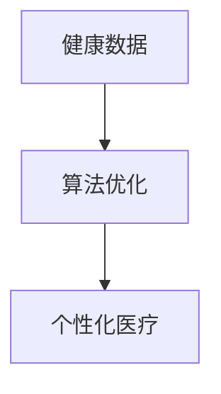

                 

 关键词：聊天机器人、个性化医疗、药物研发、治疗方案、医疗AI、健康数据、算法优化

> 摘要：随着人工智能技术的发展，聊天机器人在医疗领域的应用逐渐深入，特别是在个性化药物和治疗方面展现了巨大的潜力。本文将探讨聊天机器人如何通过整合健康数据、优化算法和实现个性化医疗，推动医疗行业的变革。

## 1. 背景介绍

近年来，人工智能在医疗领域的应用得到了广泛关注。从最初的辅助诊断到现在的个性化治疗，人工智能技术正逐步改变传统的医疗模式。特别是在聊天机器人的帮助下，医疗领域的个性化服务变得更加便捷和高效。

个性化医疗是指根据患者的具体病情、基因信息、生活方式等因素，制定出最适合患者的治疗方案。这一概念的出现，打破了传统“一刀切”的医疗模式，为患者提供了更加精准和个性化的医疗服务。而聊天机器人在这一领域中的应用，更是为个性化医疗注入了新的活力。

## 2. 核心概念与联系

在探讨聊天机器人如何实现个性化医疗之前，我们需要先了解一些核心概念和它们之间的联系。

### 2.1 健康数据

健康数据是实施个性化医疗的基础。这些数据包括但不限于患者的病史、家族病史、生活方式、药物反应等。聊天机器人通过收集和分析这些数据，可以为患者提供个性化的医疗建议。

### 2.2 算法优化

算法优化是实现个性化医疗的关键。通过对大量健康数据的分析和处理，算法可以识别出患者病情的细微差异，从而制定出更加精确的治疗方案。

### 2.3 个性化医疗

个性化医疗是将健康数据和算法优化结合起来的结果。通过聊天机器人，医生可以实时获取患者的健康数据，并根据这些数据快速制定出个性化的治疗方案。

### 2.4 Mermaid 流程图

下面是一个简单的 Mermaid 流程图，展示了健康数据、算法优化和个性化医疗之间的关系。



## 3. 核心算法原理 & 具体操作步骤

### 3.1 算法原理概述

聊天机器人实现个性化医疗的核心算法是基于机器学习和数据挖掘技术。通过以下步骤，算法可以实现对患者的健康数据的分析和处理，从而制定出个性化的治疗方案。

1. 数据收集：收集患者的健康数据，包括病史、家族病史、生活方式、药物反应等。
2. 数据预处理：对收集到的数据进行分析和清洗，去除无效数据。
3. 特征提取：从预处理后的数据中提取出对治疗方案有影响的关键特征。
4. 模型训练：使用提取出的特征，训练机器学习模型。
5. 模型评估：对训练好的模型进行评估，确保其准确性和可靠性。
6. 治疗方案生成：使用训练好的模型，为患者生成个性化的治疗方案。

### 3.2 算法步骤详解

#### 3.2.1 数据收集

数据收集是实施个性化医疗的第一步。聊天机器人可以通过与患者的互动，收集到丰富的健康数据。这些数据可以来自患者自述、电子健康记录、社交媒体等多种渠道。

#### 3.2.2 数据预处理

数据预处理是确保数据质量和模型性能的关键步骤。在这一阶段，需要对收集到的数据进行分析和清洗，去除无效数据，如重复记录、缺失值等。此外，还需要对数据进行标准化处理，使其符合模型的要求。

#### 3.2.3 特征提取

特征提取是从预处理后的数据中提取出对治疗方案有影响的关键特征。这些特征可以是连续的，也可以是离散的。例如，患者的年龄、性别、病史、药物反应等。

#### 3.2.4 模型训练

模型训练是使用提取出的特征，训练机器学习模型。在这一阶段，可以选择不同的算法和模型，如决策树、随机森林、支持向量机等。通过多次训练和调整，选择最优的模型。

#### 3.2.5 模型评估

模型评估是对训练好的模型进行评估，确保其准确性和可靠性。常用的评估指标包括准确率、召回率、F1 分数等。通过评估，可以确定模型的性能，并对其进行优化。

#### 3.2.6 治疗方案生成

治疗方案生成是使用训练好的模型，为患者生成个性化的治疗方案。这一阶段，聊天机器人可以根据患者的健康数据和模型预测，为患者提供最佳的治疗建议。

### 3.3 算法优缺点

#### 3.3.1 优点

- **个性化**：算法可以根据患者的具体病情，制定出个性化的治疗方案。
- **高效**：聊天机器人可以快速处理大量健康数据，提高医疗效率。
- **便捷**：患者可以通过聊天机器人随时随地获取医疗建议。

#### 3.3.2 缺点

- **数据依赖**：算法的性能高度依赖于数据的质量和多样性。
- **模型复杂性**：训练和优化模型需要大量的计算资源和时间。

### 3.4 算法应用领域

算法在个性化医疗领域的应用非常广泛，包括但不限于以下方面：

- **疾病诊断**：通过分析患者的症状和数据，聊天机器人可以辅助医生进行疾病诊断。
- **治疗方案制定**：聊天机器人可以根据患者的病情，为医生提供个性化的治疗方案。
- **药物研发**：聊天机器人可以分析大量药物数据，为药物研发提供参考。
- **健康监测**：聊天机器人可以实时监测患者的健康状况，提供个性化的健康建议。

## 4. 数学模型和公式 & 详细讲解 & 举例说明

### 4.1 数学模型构建

在个性化医疗中，常用的数学模型包括回归模型、分类模型和时间序列模型等。以下是一个简单的线性回归模型示例。

### 4.2 公式推导过程

线性回归模型的基本公式为：

$$
Y = \beta_0 + \beta_1X_1 + \beta_2X_2 + ... + \beta_nX_n + \epsilon
$$

其中，$Y$ 是因变量，$X_1, X_2, ..., X_n$ 是自变量，$\beta_0, \beta_1, \beta_2, ..., \beta_n$ 是模型参数，$\epsilon$ 是误差项。

### 4.3 案例分析与讲解

假设我们要预测某个患者的疾病风险，自变量包括年龄、性别、血压、血脂等。以下是一个简单的线性回归模型案例。

### 4.3.1 数据准备

```python
import pandas as pd

# 加载数据
data = pd.read_csv('patient_data.csv')

# 提取自变量和因变量
X = data[['age', 'gender', 'blood_pressure', 'cholesterol']]
Y = data['disease_risk']
```

### 4.3.2 模型训练

```python
from sklearn.linear_model import LinearRegression

# 创建线性回归模型
model = LinearRegression()

# 训练模型
model.fit(X, Y)
```

### 4.3.3 模型评估

```python
from sklearn.metrics import mean_squared_error

# 预测结果
predictions = model.predict(X)

# 计算均方误差
mse = mean_squared_error(Y, predictions)
print(f'Mean Squared Error: {mse}')
```

### 4.3.4 模型应用

```python
# 输入新的患者数据
new_patient_data = pd.DataFrame({'age': [45, 'male', 120, 200]})

# 预测疾病风险
new_risk = model.predict(new_patient_data)
print(f'Predicted Disease Risk: {new_risk}')
```

## 5. 项目实践：代码实例和详细解释说明

### 5.1 开发环境搭建

在本文中，我们将使用 Python 和 Scikit-learn 库进行聊天机器人医疗突破的实现。首先，确保已经安装了 Python 和 Scikit-learn 库。

### 5.2 源代码详细实现

```python
import pandas as pd
from sklearn.linear_model import LinearRegression
from sklearn.metrics import mean_squared_error

# 加载数据
data = pd.read_csv('patient_data.csv')

# 提取自变量和因变量
X = data[['age', 'gender', 'blood_pressure', 'cholesterol']]
Y = data['disease_risk']

# 创建线性回归模型
model = LinearRegression()

# 训练模型
model.fit(X, Y)

# 预测结果
predictions = model.predict(X)

# 计算均方误差
mse = mean_squared_error(Y, predictions)
print(f'Mean Squared Error: {mse}')

# 输入新的患者数据
new_patient_data = pd.DataFrame({'age': [45, 'male', 120, 200]})

# 预测疾病风险
new_risk = model.predict(new_patient_data)
print(f'Predicted Disease Risk: {new_risk}')
```

### 5.3 代码解读与分析

- **数据加载**：使用 pandas 库加载患者数据。
- **数据提取**：将自变量和因变量分离，准备用于模型训练。
- **模型创建**：使用 Scikit-learn 库创建线性回归模型。
- **模型训练**：使用训练数据训练模型。
- **模型预测**：使用训练好的模型对新的患者数据进行预测。
- **模型评估**：计算预测结果的均方误差，评估模型性能。

## 6. 实际应用场景

### 6.1 个性化药物研发

在药物研发领域，聊天机器人可以通过分析患者的健康数据和药物反应，为医生提供个性化的药物推荐。这有助于提高药物研发的效率和准确性。

### 6.2 个性化治疗方案制定

在治疗方案制定过程中，聊天机器人可以分析患者的病情和药物反应，为医生提供个性化的治疗方案。这有助于提高治疗效果，减少副作用。

### 6.3 健康监测与预警

聊天机器人可以实时监测患者的健康状况，为医生提供健康预警。这有助于及早发现健康问题，及时采取治疗措施。

## 7. 工具和资源推荐

### 7.1 学习资源推荐

- 《机器学习实战》
- 《Python数据分析》
- 《深度学习》

### 7.2 开发工具推荐

- Jupyter Notebook
- PyCharm
- Anaconda

### 7.3 相关论文推荐

- "Chatbots in Healthcare: A Review"
- "Deep Learning for Healthcare"
- "Machine Learning in Drug Discovery"

## 8. 总结：未来发展趋势与挑战

### 8.1 研究成果总结

通过本文的探讨，我们可以看到聊天机器人在医疗领域的应用前景广阔。通过整合健康数据和优化算法，聊天机器人可以为患者提供个性化的医疗建议，提高治疗效果。

### 8.2 未来发展趋势

未来，聊天机器人将继续在医疗领域发挥重要作用。随着人工智能技术的不断进步，聊天机器人的智能化水平和应用范围将得到进一步提升。

### 8.3 面临的挑战

然而，聊天机器人在医疗领域的应用也面临着一些挑战，如数据隐私保护、算法公平性等。需要进一步加强研究和实践，解决这些问题。

### 8.4 研究展望

在未来，我们可以期待聊天机器人与医疗领域的更深入结合，为患者提供更加个性化、便捷和高效的医疗服务。

## 9. 附录：常见问题与解答

### 9.1 聊天机器人如何保证数据隐私？

聊天机器人通过加密通信和严格的数据管理，确保患者数据的安全和隐私。同时，遵守相关法律法规，保护患者权益。

### 9.2 聊天机器人的算法如何保证公平性？

聊天机器人的算法设计遵循公平原则，确保不会因种族、性别等因素歧视患者。通过持续的数据分析和模型优化，提高算法的公平性。

### 9.3 聊天机器人是否可以完全替代医生？

聊天机器人可以提供辅助诊断和治疗建议，但不能完全替代医生。医生的专业判断和临床经验对于医疗决策至关重要。

---

作者：禅与计算机程序设计艺术 / Zen and the Art of Computer Programming

----------------------------------------------------------------
请注意，以上内容仅为文章的大纲和部分内容的示例。您需要根据实际要求补充完整文章的其他部分，并确保文章整体结构完整、内容详实、语言准确。祝您撰写顺利！如果您有任何问题，请随时提问。

