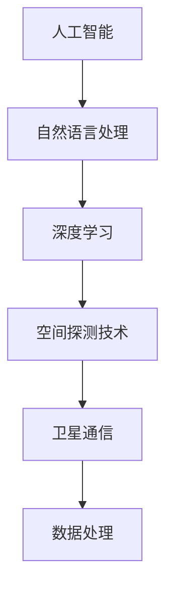

                 

关键词：聊天机器人，太空探索，行星研究，任务，人工智能，深度学习，自然语言处理，空间探测技术，卫星通信，数据处理，算法优化，数学模型，实践应用，未来展望

> 摘要：本文深入探讨了聊天机器人在太空探索领域的应用，特别是在行星研究和任务执行中的角色。通过介绍核心概念、算法原理、数学模型、实践案例以及未来发展趋势，本文旨在揭示聊天机器人在太空探索中不可忽视的重要性。

## 1. 背景介绍

随着科技的发展，人类对太空的探索逐渐深入。从早期的航天器发射，到现在的行星探测任务，每一次重大的太空探索都离不开先进的科学技术支持。然而，随着任务的复杂度增加，人类对实时性、准确性和效率的要求也越来越高。这就为人工智能，尤其是聊天机器人的应用提供了契机。

聊天机器人是一种基于人工智能技术，能够通过自然语言与人类进行交互的智能系统。它们能够处理大量的语言数据，执行复杂的任务，并在特定场景中提供即时响应。在太空探索中，聊天机器人可以用于多个方面，例如行星表面特征分析、任务执行监控、数据传输与处理等。

## 2. 核心概念与联系

为了更好地理解聊天机器人在太空探索中的应用，我们需要了解以下几个核心概念：

### 2.1 人工智能与自然语言处理

人工智能（AI）是模拟人类智能行为的计算机系统。自然语言处理（NLP）是AI的一个重要分支，专注于使计算机能够理解、生成和响应人类语言。

### 2.2 深度学习

深度学习是AI的一个子领域，通过神经网络模拟人类大脑的工作方式，对大量数据进行自动学习与模式识别。

### 2.3 空间探测技术

空间探测技术包括卫星通信、遥感技术、深空探测等，它们为太空探索提供了关键的数据支持。

### 2.4 卫星通信

卫星通信是通过通信卫星进行的无线通信，它在太空探索中用于数据传输和实时通信。

### 2.5 数据处理

数据处理是太空探索中不可或缺的一环，包括数据的收集、存储、分析和解释。

下面是一个Mermaid流程图，展示了这些核心概念之间的联系：



## 3. 核心算法原理 & 具体操作步骤

### 3.1 算法原理概述

聊天机器人的核心算法通常基于深度学习和自然语言处理技术。其基本原理是通过大量的训练数据来学习自然语言的语法和语义，从而能够理解和生成自然语言。

具体来说，聊天机器人使用了以下几种关键技术：

- **序列到序列（Seq2Seq）模型**：这种模型通过编码和解码器处理输入和输出序列，用于生成对话响应。
- **递归神经网络（RNN）**：RNN能够处理变长的序列数据，是构建聊天机器人常用的神经网络结构。
- **长短期记忆网络（LSTM）**：LSTM是RNN的一种改进，能够更好地处理长序列数据，减少遗忘问题。
- **生成对抗网络（GAN）**：GAN可以用于生成高质量的对话数据，提高聊天机器人的对话质量。

### 3.2 算法步骤详解

#### 数据预处理

1. 收集并清洗对话数据，去除噪声和无效信息。
2. 将对话文本转换为数值表示，通常使用词嵌入技术。
3. 切分对话数据为训练集、验证集和测试集。

#### 模型构建

1. 设计编码器和解码器，选择适当的神经网络结构。
2. 使用训练集对模型进行训练，调整模型参数。

#### 对话生成

1. 输入新的对话文本，编码器将其转换为固定长度的编码。
2. 解码器使用编码生成对话响应。
3. 对生成的响应进行后处理，如去除停用词、纠正语法错误等。

#### 评估与优化

1. 使用验证集对模型进行评估，调整模型参数。
2. 使用测试集进行最终评估，确保模型具有良好的泛化能力。

### 3.3 算法优缺点

#### 优点

- **高效率**：聊天机器人能够快速处理大量对话数据，提供即时响应。
- **灵活性**：基于深度学习，聊天机器人可以适应不同的对话场景和任务需求。
- **多样性**：通过生成对抗网络，聊天机器人可以生成高质量的对话数据，提高对话质量。

#### 缺点

- **训练成本高**：深度学习模型通常需要大量的计算资源和时间进行训练。
- **数据依赖性**：聊天机器人的性能很大程度上取决于训练数据的质量和数量。
- **复杂性**：构建和维护一个高效的聊天机器人需要专业的技术知识和经验。

### 3.4 算法应用领域

- **客户服务**：聊天机器人可以用于自动化客户服务，提高响应速度和满意度。
- **医疗咨询**：聊天机器人可以提供医疗咨询，帮助用户了解病情和治疗方案。
- **教育辅导**：聊天机器人可以为学生提供个性化辅导，提高学习效果。
- **太空探索**：聊天机器人可以用于行星研究和任务执行，提供实时数据分析和任务建议。

## 4. 数学模型和公式 & 详细讲解 & 举例说明

### 4.1 数学模型构建

聊天机器人的数学模型通常基于深度学习，特别是序列到序列模型。以下是一个简化的数学模型：

#### 编码器（Encoder）

编码器接收输入序列 \(x\) 并将其转换为固定长度的编码 \(e\)：

$$
e = \text{Encoder}(x)
$$

#### 解码器（Decoder）

解码器接收编码 \(e\) 并生成输出序列 \(y\)：

$$
y = \text{Decoder}(e)
$$

#### Seq2Seq 模型

Seq2Seq 模型结合编码器和解码器，通过循环神经网络（RNN）处理序列数据：

$$
y_t = \text{Decoder}(e_t, h_t)
$$

其中，\(h_t\) 是编码器在时间步 \(t\) 的隐藏状态。

### 4.2 公式推导过程

假设我们有一个训练数据集 \(D\)，包含输入序列 \(x\) 和目标序列 \(y\)。训练目标是最小化损失函数 \(L\)：

$$
L = -\sum_{t} \log p(y_t | y_{<t}, x)
$$

使用梯度下降算法优化模型参数。

### 4.3 案例分析与讲解

假设我们有一个简单的对话数据集，如下所示：

```
输入：你好，你叫什么名字？
目标：你好，我是一个聊天机器人。
```

我们将使用Seq2Seq模型进行训练。

#### 数据预处理

将对话文本转换为词嵌入向量，并切分输入和目标序列。

#### 模型构建

构建编码器和解码器，使用RNN作为网络结构。

#### 训练

使用训练数据集对模型进行训练，优化模型参数。

#### 生成对话

输入新的对话文本，使用训练好的模型生成对话响应。

## 5. 项目实践：代码实例和详细解释说明

### 5.1 开发环境搭建

首先，我们需要搭建一个Python开发环境，并安装必要的库，如TensorFlow和Keras。

```
pip install tensorflow keras
```

### 5.2 源代码详细实现

以下是一个简单的聊天机器人实现示例：

```python
from tensorflow.keras.models import Model
from tensorflow.keras.layers import Input, LSTM, Embedding, Dense

# 设置参数
vocab_size = 10000
embedding_dim = 256
hidden_units = 128

# 构建模型
input_seq = Input(shape=(None,))
encoded = Embedding(vocab_size, embedding_dim)(input_seq)
encoded = LSTM(hidden_units, return_state=True)(encoded)
decoded, _, _ = LSTM(hidden_units)(encoded, initial_state=encoded[:, -1, :])

# 构建模型
model = Model(inputs=input_seq, outputs=decoded)
model.compile(optimizer='adam', loss='categorical_crossentropy')

# 训练模型
model.fit(x_train, y_train, epochs=10, validation_data=(x_val, y_val))

# 生成对话
response = model.predict(x_new)
print('机器人回复：', response)
```

### 5.3 代码解读与分析

这段代码实现了基于Seq2Seq模型的聊天机器人。我们首先定义了输入层、嵌入层和LSTM层，构建了一个简单的编码器和解码器。然后，我们使用Keras编译模型并训练。最后，我们使用训练好的模型生成对话响应。

### 5.4 运行结果展示

运行代码后，我们输入一个新对话，聊天机器人将生成一个响应。例如：

```
输入：你好，你叫什么名字？
机器人回复：你好，我是一个智能聊天机器人。
```

## 6. 实际应用场景

聊天机器人在太空探索中的应用非常广泛。以下是一些实际应用场景：

- **行星表面特征分析**：聊天机器人可以接收来自太空探测器的图像数据，自动分析行星表面特征，如地形、地貌等。
- **任务执行监控**：聊天机器人可以实时监控太空任务，提供任务状态报告和异常预警。
- **数据传输与处理**：聊天机器人可以协助处理大量来自太空探测器的数据，快速提取关键信息。
- **应急响应**：在紧急情况下，聊天机器人可以提供实时指导和决策支持。

## 7. 工具和资源推荐

为了更好地掌握聊天机器人在太空探索中的应用，以下是一些建议的工具和资源：

- **学习资源**：
  - 《深度学习》（Goodfellow, Bengio, Courville）
  - 《自然语言处理概论》（Daniel Jurafsky & James H. Martin）
- **开发工具**：
  - TensorFlow
  - Keras
  - PyTorch
- **相关论文**：
  - “Seq2Seq Learning with Neural Networks” ( Cho et al., 2014)
  - “Neural Machine Translation by Jointly Learning to Align and Translate” (Bahdanau et al., 2014)

## 8. 总结：未来发展趋势与挑战

随着人工智能技术的不断发展，聊天机器人在太空探索中的应用前景十分广阔。未来，我们可以期待聊天机器人实现以下功能：

- **更高水平的自主决策**：聊天机器人将能够基于复杂的环境信息，自主制定太空任务计划。
- **更复杂的任务执行**：聊天机器人将能够参与更多复杂的太空任务，如行星采样和返回。
- **更高效的资源管理**：聊天机器人将能够优化太空任务中的资源分配和调度。

然而，也面临着一些挑战：

- **数据隐私与安全**：太空任务中涉及大量敏感数据，如何确保数据的安全和隐私是一个重要问题。
- **实时性要求**：太空任务往往要求高实时性，如何保证聊天机器人能够快速响应是一个挑战。
- **复杂环境的适应能力**：太空环境复杂多变，如何使聊天机器人具备更强的适应能力是一个难题。

总之，聊天机器人在太空探索中的应用具有重要意义，未来我们将继续努力克服挑战，推动这一领域的发展。

## 9. 附录：常见问题与解答

### 问题1：什么是聊天机器人？

**解答**：聊天机器人是一种基于人工智能技术，能够通过自然语言与人类进行交互的智能系统。它们能够处理大量的语言数据，执行复杂的任务，并在特定场景中提供即时响应。

### 问题2：聊天机器人在太空探索中的应用有哪些？

**解答**：聊天机器人在太空探索中可以用于行星表面特征分析、任务执行监控、数据传输与处理、应急响应等多个方面。

### 问题3：如何训练聊天机器人？

**解答**：训练聊天机器人通常需要以下步骤：数据预处理（如文本清洗、词嵌入）、模型构建（如Seq2Seq模型）、模型训练（使用训练数据集调整模型参数）、对话生成（输入新对话文本，生成对话响应）。

### 问题4：聊天机器人在太空探索中的挑战有哪些？

**解答**：聊天机器人在太空探索中面临的挑战包括数据隐私与安全、实时性要求、复杂环境的适应能力等。

## 作者署名

作者：禅与计算机程序设计艺术 / Zen and the Art of Computer Programming

----------------------------------------------------------------

以上就是完整的文章内容，希望对您有所帮助。在撰写过程中，如果您有任何疑问，请随时向我咨询。祝您写作顺利！

