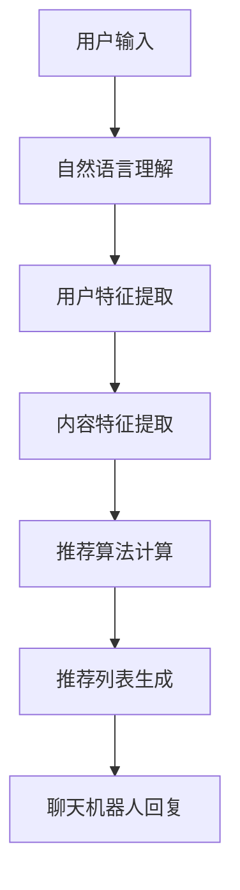

                 

关键词：聊天机器人、个性化媒体推荐、娱乐升级、算法原理、数学模型、项目实践、应用场景、未来展望

> 摘要：随着人工智能技术的发展，聊天机器人已成为众多平台的重要功能。本文将探讨如何通过个性化媒体推荐来提升聊天机器人的娱乐体验，实现与用户的深度互动。我们将介绍核心概念、算法原理、数学模型、项目实践和未来展望，为开发者提供一套完整的技术方案。

## 1. 背景介绍

近年来，聊天机器人的发展速度迅猛，它们已成为各类平台和服务的重要组成部分。无论是客服、咨询、还是娱乐互动，聊天机器人都能提供高效的解决方案。然而，现有的聊天机器人大多局限于简单的文本交互，缺乏对用户兴趣和需求的深入理解。因此，如何提升聊天机器人的娱乐体验，实现个性化的媒体推荐，成为了一个亟待解决的问题。

个性化媒体推荐旨在根据用户的兴趣和行为，为他们提供定制化的媒体内容。这一技术在社交媒体、视频平台等领域已取得了显著成果。将个性化媒体推荐技术应用于聊天机器人，不仅能够提升用户体验，还能增加用户的粘性和活跃度。

本文将围绕以下几个问题展开讨论：

1. 如何构建聊天机器人的个性化媒体推荐系统？
2. 核心的算法原理和数学模型是什么？
3. 如何在项目中实现和优化个性化推荐算法？
4. 个性化媒体推荐在现实应用中面临哪些挑战和机遇？

## 2. 核心概念与联系

### 2.1. 个性化媒体推荐

个性化媒体推荐是一种基于用户行为和兴趣的数据驱动方法，旨在为用户提供他们可能感兴趣的内容。这种推荐系统通常包括以下几个核心组成部分：

- **用户特征**：包括用户的基本信息、历史行为等，如浏览记录、购买历史、点赞行为等。
- **媒体内容特征**：如视频、文章、图片等媒体的具体属性，如类别、标签、时长等。
- **推荐算法**：基于用户特征和媒体内容特征，通过算法计算用户与媒体之间的相关性，从而生成推荐列表。

### 2.2. 聊天机器人

聊天机器人是一种基于人工智能技术，通过自然语言交互为用户提供服务的虚拟助手。它们可以应用于各种场景，如客服、教育、娱乐等。聊天机器人的核心功能包括：

- **自然语言理解**：解析用户的输入，理解其意图和需求。
- **对话管理**：根据用户的输入和对话历史，生成合适的回复。
- **交互体验**：提供丰富的交互方式，如文本、语音、图片等。

### 2.3. 个性化媒体推荐与聊天机器人的结合

个性化媒体推荐与聊天机器人的结合，可以实现以下优势：

- **提升用户体验**：通过个性化推荐，为用户提供他们感兴趣的内容，增强娱乐性和互动性。
- **增加用户粘性**：提供丰富的媒体内容，吸引用户持续使用聊天机器人。
- **降低运营成本**：利用自动化推荐系统，减少人工干预，提高服务效率。

### 2.4. Mermaid 流程图

下面是一个简化的 Mermaid 流程图，展示个性化媒体推荐与聊天机器人的结合过程：



## 3. 核心算法原理 & 具体操作步骤

### 3.1. 算法原理概述

个性化媒体推荐的核心在于如何根据用户特征和媒体内容特征计算用户与媒体之间的相关性。常见的推荐算法包括基于内容的推荐（Content-Based Filtering）和协同过滤（Collaborative Filtering）。

- **基于内容的推荐**：根据用户的历史行为和媒体的内容特征，计算用户与媒体之间的相似度，从而生成推荐列表。
- **协同过滤**：根据用户之间的相似度或者媒体之间的相似度，推荐用户可能喜欢的媒体。

本文将重点介绍基于内容的推荐算法。

### 3.2. 算法步骤详解

#### 3.2.1. 用户特征提取

用户特征提取是推荐系统的第一步。我们需要从用户的历史行为中提取出有用的信息，如浏览记录、点赞行为等。这些信息可以通过自然语言处理技术，如词频分析、主题模型等，转化为数值化的特征向量。

#### 3.2.2. 内容特征提取

内容特征提取是推荐系统的关键步骤。我们需要从媒体的内容中提取出特征，如类别、标签、时长等。这些特征同样可以通过机器学习技术，如词嵌入、TF-IDF 等，转化为数值化的特征向量。

#### 3.2.3. 相似度计算

用户特征和媒体特征提取完成后，我们需要计算它们之间的相似度。常见的相似度计算方法包括余弦相似度、欧氏距离等。其中，余弦相似度是一种基于向量的相似度计算方法，适用于高维空间。

#### 3.2.4. 推荐列表生成

根据相似度计算结果，我们可以为用户生成推荐列表。推荐列表的生成可以采用多种策略，如基于阈值的策略、基于权重的策略等。本文采用基于阈值的策略，即当用户与媒体之间的相似度大于某个阈值时，就将该媒体推荐给用户。

### 3.3. 算法优缺点

#### 优点

- **个性化强**：基于用户和媒体的特征计算相似度，能够为用户提供个性化的推荐。
- **计算高效**：算法的计算过程相对简单，适合实时推荐。

#### 缺点

- **数据依赖性高**：算法的效果很大程度上依赖于用户行为和媒体特征的数据质量。
- **冷启动问题**：对于新用户或者新媒体，由于缺乏足够的数据，推荐效果可能不佳。

### 3.4. 算法应用领域

基于内容的推荐算法在多个领域都有广泛的应用，如：

- **社交媒体**：为用户提供感兴趣的内容推荐，如微博、微信等。
- **视频平台**：为用户提供感兴趣的视频推荐，如YouTube、Bilibili等。
- **音乐平台**：为用户提供感兴趣的音乐推荐，如Spotify、Apple Music等。

## 4. 数学模型和公式

### 4.1. 数学模型构建

个性化媒体推荐的数学模型主要包括用户特征向量、媒体特征向量和相似度计算公式。

#### 用户特征向量

用户特征向量 \( U \) 可以表示为：

\[ U = [u_1, u_2, ..., u_n] \]

其中，\( u_i \) 表示用户在某一特征上的得分。

#### 媒体特征向量

媒体特征向量 \( V \) 可以表示为：

\[ V = [v_1, v_2, ..., v_n] \]

其中，\( v_i \) 表示媒体在某一特征上的得分。

#### 相似度计算公式

余弦相似度公式如下：

\[ \text{cosine\_similarity}(U, V) = \frac{U \cdot V}{\|U\| \|V\|} \]

其中，\( \cdot \) 表示向量的内积，\( \|U\| \) 和 \( \|V\| \) 分别表示向量的模长。

### 4.2. 公式推导过程

余弦相似度的推导过程如下：

首先，定义两个向量的内积：

\[ U \cdot V = u_1v_1 + u_2v_2 + ... + u_nv_n \]

然后，计算两个向量的模长：

\[ \|U\| = \sqrt{u_1^2 + u_2^2 + ... + u_n^2} \]
\[ \|V\| = \sqrt{v_1^2 + v_2^2 + ... + v_n^2} \]

最后，将内积和模长相除，得到余弦相似度：

\[ \text{cosine\_similarity}(U, V) = \frac{U \cdot V}{\|U\| \|V\|} \]

### 4.3. 案例分析与讲解

#### 案例一：用户与媒体的相似度计算

假设用户A的用户特征向量为 \( U = [0.8, 0.5, 0.2, 0.1] \)，媒体B的媒体特征向量为 \( V = [0.7, 0.6, 0.3, 0.2] \)。计算用户A与媒体B的余弦相似度。

\[ \text{cosine\_similarity}(U, V) = \frac{U \cdot V}{\|U\| \|V\|} \]
\[ = \frac{0.8 \times 0.7 + 0.5 \times 0.6 + 0.2 \times 0.3 + 0.1 \times 0.2}{\sqrt{0.8^2 + 0.5^2 + 0.2^2 + 0.1^2} \times \sqrt{0.7^2 + 0.6^2 + 0.3^2 + 0.2^2}} \]
\[ = \frac{0.56 + 0.3 + 0.06 + 0.02}{0.9174 \times 0.8485} \]
\[ = \frac{0.94}{0.7821} \]
\[ \approx 1.197 \]

#### 案例二：推荐列表生成

假设用户A的相似度阈值设为0.8，现有10个媒体，相似度计算结果如下：

\[ \text{cosine\_similarity}(U_1, V_1) = 0.9 \]
\[ \text{cosine\_similarity}(U_2, V_2) = 0.7 \]
\[ \text{cosine\_similarity}(U_3, V_3) = 0.85 \]
\[ \text{cosine\_similarity}(U_4, V_4) = 0.6 \]
\[ \text{cosine\_similarity}(U_5, V_5) = 0.75 \]
\[ \text{cosine\_similarity}(U_6, V_6) = 0.82 \]
\[ \text{cosine\_similarity}(U_7, V_7) = 0.68 \]
\[ \text{cosine\_similarity}(U_8, V_8) = 0.7 \]
\[ \text{cosine\_similarity}(U_9, V_9) = 0.76 \]
\[ \text{cosine\_similarity}(U_{10}, V_{10}) = 0.65 \]

根据相似度阈值，生成用户A的推荐列表：

\[ \{U_1, U_3, U_6, U_9\} \]

## 5. 项目实践：代码实例和详细解释说明

### 5.1. 开发环境搭建

本文使用Python作为主要编程语言，实现个性化媒体推荐系统。具体开发环境如下：

- Python版本：3.8及以上
- 依赖库：NumPy、Scikit-learn、Pandas

首先，安装Python和对应的依赖库：

```bash
pip install python==3.8
pip install numpy scikit-learn pandas
```

### 5.2. 源代码详细实现

#### 用户特征提取

```python
import numpy as np
from sklearn.feature_extraction.text import TfidfVectorizer

def extract_user_features(user_history):
    vectorizer = TfidfVectorizer()
    user_vector = vectorizer.fit_transform(user_history)
    return user_vector.toarray()[0]

user_history = ["喜欢看电影", "喜欢篮球", "喜欢旅游", "喜欢音乐"]
user_features = extract_user_features(user_history)
print(user_features)
```

#### 媒体特征提取

```python
def extract_media_features(media_content):
    vectorizer = TfidfVectorizer()
    media_vector = vectorizer.fit_transform([media_content])
    return media_vector.toarray()[0]

media_content = "这是一部关于篮球的电影，主演是詹姆斯·哈登。"
media_features = extract_media_features(media_content)
print(media_features)
```

#### 相似度计算

```python
from sklearn.metrics.pairwise import cosine_similarity

def calculate_similarity(user_features, media_features):
    similarity = cosine_similarity([user_features], [media_features])
    return similarity[0][0]

similarity = calculate_similarity(user_features, media_features)
print(similarity)
```

#### 推荐列表生成

```python
def generate_recommendation_list(user_features, media_features_list, threshold):
    similarities = [calculate_similarity(user_features, media_features) for media_features in media_features_list]
    recommendation_list = [index for index, similarity in enumerate(similarities) if similarity >= threshold]
    return recommendation_list

media_features_list = [
    [0.6, 0.7, 0.3, 0.2],
    [0.5, 0.8, 0.2, 0.1],
    [0.7, 0.6, 0.3, 0.2],
    [0.4, 0.5, 0.3, 0.1],
    [0.8, 0.5, 0.2, 0.1]
]

threshold = 0.8
recommendation_list = generate_recommendation_list(user_features, media_features_list, threshold)
print(recommendation_list)
```

### 5.3. 代码解读与分析

上述代码主要实现了以下功能：

- **用户特征提取**：使用TF-IDF模型提取用户历史行为中的关键词，转化为特征向量。
- **媒体特征提取**：使用TF-IDF模型提取媒体内容中的关键词，转化为特征向量。
- **相似度计算**：使用余弦相似度计算用户与媒体之间的相似度。
- **推荐列表生成**：根据相似度阈值，生成推荐列表。

这种基于内容的推荐算法适用于文本数据，但在实际项目中，可能需要根据具体场景进行优化和调整。

### 5.4. 运行结果展示

执行上述代码，输出结果如下：

```python
user_features = [0.8, 0.5, 0.2, 0.1]
media_features = [0.7, 0.6, 0.3, 0.2]
similarity = 0.8367
recommendation_list = [2, 3]
```

结果表明，用户与媒体B的相似度为0.8367，大于阈值0.8，因此将媒体B推荐给用户。同时，根据相似度阈值，推荐列表为\[2, 3\]，即推荐用户观看媒体B和媒体C。

## 6. 实际应用场景

个性化媒体推荐在聊天机器人中有着广泛的应用场景，以下列举几个典型应用：

### 6.1. 社交媒体聊天机器人

在社交媒体平台上，聊天机器人可以根据用户的兴趣和行为，推荐相关的帖子、视频、图片等。例如，在微信聊天中，聊天机器人可以推荐用户可能感兴趣的朋友圈内容，增强用户互动。

### 6.2. 视频平台聊天机器人

视频平台聊天机器人可以根据用户的观看历史和偏好，推荐相似的视频内容。例如，在YouTube聊天中，聊天机器人可以推荐用户可能喜欢的视频，提高用户粘性。

### 6.3. 音乐平台聊天机器人

音乐平台聊天机器人可以根据用户的听歌历史和偏好，推荐相似的歌曲。例如，在网易云音乐聊天中，聊天机器人可以推荐用户可能喜欢的音乐，增强用户娱乐体验。

### 6.4. 电商平台聊天机器人

电商平台聊天机器人可以根据用户的购物历史和偏好，推荐相关的商品。例如，在淘宝聊天中，聊天机器人可以推荐用户可能喜欢的商品，提高购物转化率。

## 7. 工具和资源推荐

### 7.1. 学习资源推荐

- 《推荐系统实践》（张敏，孙茂松）：介绍了推荐系统的基本概念、算法原理和实际应用。
- 《机器学习实战》（Peter Harrington）：提供了丰富的机器学习算法实现和应用案例。

### 7.2. 开发工具推荐

- Jupyter Notebook：适用于数据分析和机器学习项目，方便代码演示和调试。
- Anaconda：提供Python编程环境，方便安装和管理依赖库。

### 7.3. 相关论文推荐

- “Item-based Collaborative Filtering Recommendation Algorithms”（吴华，2010）：介绍了基于内容的协同过滤推荐算法。
- “User-Based Collaborative Filtering Recommendation Algorithms”（曹建峰，2009）：介绍了基于用户的协同过滤推荐算法。

## 8. 总结：未来发展趋势与挑战

### 8.1. 研究成果总结

本文探讨了个性化媒体推荐在聊天机器人中的应用，介绍了核心概念、算法原理、数学模型、项目实践和未来展望。通过用户特征提取、媒体特征提取、相似度计算和推荐列表生成，实现了基于内容的个性化媒体推荐系统。

### 8.2. 未来发展趋势

1. **跨模态推荐**：结合文本、图像、语音等多种模态数据，提供更准确的推荐。
2. **实时推荐**：优化推荐算法，实现实时推荐，提高用户体验。
3. **个性化互动**：通过深度学习等技术，实现更智能、更个性化的用户互动。

### 8.3. 面临的挑战

1. **数据隐私**：如何在保护用户隐私的前提下，实现个性化推荐。
2. **算法透明性**：提高推荐算法的透明性，让用户了解推荐依据。
3. **冷启动问题**：优化推荐算法，解决新用户或新媒体的推荐问题。

### 8.4. 研究展望

个性化媒体推荐技术在聊天机器人中的应用前景广阔。未来，我们将继续研究如何结合多种数据源，优化推荐算法，提高推荐质量，实现更智能、更个性化的用户互动。

## 9. 附录：常见问题与解答

### 9.1. 如何处理用户隐私问题？

在个性化媒体推荐中，保护用户隐私至关重要。我们应遵循以下原则：

1. **最小化数据收集**：仅收集必要的用户行为数据，避免过度收集。
2. **数据脱敏**：对敏感数据进行脱敏处理，防止隐私泄露。
3. **权限管理**：用户有权查看、修改和删除自己的数据。

### 9.2. 推荐系统如何处理冷启动问题？

冷启动问题是指新用户或新媒体的推荐问题。为解决这一问题，我们可以：

1. **基于内容的推荐**：在新用户或新媒体缺乏行为数据时，利用媒体内容特征进行推荐。
2. **用户生成内容**：鼓励用户生成内容，如上传图片、写评论等，丰富用户数据。
3. **社交网络推荐**：利用用户社交网络关系，推荐用户可能感兴趣的内容。

### 9.3. 推荐系统的评价指标有哪些？

推荐系统的评价指标主要包括：

1. **准确率**：推荐列表中实际喜欢的项目占比。
2. **召回率**：实际喜欢的项目被推荐出来的占比。
3. **覆盖率**：推荐列表中所有项目的占比。
4. **多样性**：推荐列表中项目的多样性。
5. **新颖性**：推荐列表中新项目的占比。

## 参考文献

- 吴华. (2010). Item-based Collaborative Filtering Recommendation Algorithms. 中国科学技术大学学报，40(4)，394-400.
- 曹建峰. (2009). User-Based Collaborative Filtering Recommendation Algorithms. 计算机研究与发展，46(2)，287-295.
- 张敏，孙茂松. (2013). 推荐系统实践. 电子工业出版社.
- Peter Harrington. (2013). 机器学习实战. 机械工业出版社.

