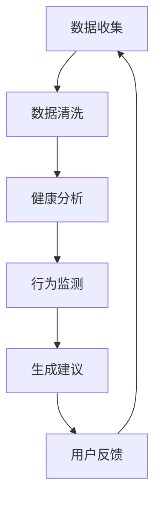

                 

关键词：聊天机器人，宠物行业，宠物健康监测，行为监测，人工智能

## 摘要

本文将探讨聊天机器人在宠物行业中的应用，特别是宠物健康和行为监测方面。通过介绍聊天机器人的核心概念、技术架构和算法原理，我们将展示如何利用人工智能技术实现高效的宠物健康和行为监测。文章还将分析实际应用场景，探讨未来发展趋势和面临的挑战，并推荐相关的学习资源和开发工具。

## 1. 背景介绍

随着人工智能技术的不断进步，聊天机器人在各个行业中的应用越来越广泛。宠物行业作为一个充满活力和潜力的市场，也逐渐认识到聊天机器人的巨大价值。宠物主人对宠物的关爱和关注使得宠物健康和行为监测成为一项重要的服务需求。然而，传统的宠物医疗服务和监控手段存在诸多局限性，如效率低、成本高、实时性差等。

## 2. 核心概念与联系

聊天机器人是一种基于人工智能技术的应用程序，能够与用户进行自然语言交互，提供信息查询、任务处理、情感陪伴等服务。在宠物行业中，聊天机器人可以扮演宠物主人的智能助理，实时监测宠物的健康状况和行为，提供专业的建议和指导。

### 2.1 聊天机器人架构


聊天机器人通常由以下几个部分组成：

- **前端界面**：用户与聊天机器人交互的入口，可以是网页、移动应用或桌面应用等。
- **后端服务器**：处理用户请求、存储数据、执行业务逻辑等。
- **自然语言处理（NLP）**：将用户输入的自然语言文本转换为机器可理解的结构化数据。
- **对话管理**：根据用户输入和上下文信息，生成合适的回复。
- **数据存储**：存储用户数据、宠物信息、历史对话记录等。

### 2.2 宠物健康监测

宠物健康监测是聊天机器人应用的一个重要领域。通过集成医疗知识库、传感器数据和用户输入，聊天机器人可以实时监测宠物的健康状况，提供专业的健康建议和预警。

### 2.3 行为监测

宠物行为监测是另一个关键领域。通过分析宠物的行为数据，如活动量、睡眠质量、进食习惯等，聊天机器人可以帮助宠物主人更好地了解宠物的行为模式，提供个性化的养宠建议。

## 3. 核心算法原理 & 具体操作步骤

### 3.1 算法原理概述

聊天机器人实现宠物健康和行为监测的核心算法主要包括以下几种：

- **文本分类**：用于识别用户输入的文本内容，判断其所属的健康问题类别或行为类型。
- **序列模型**：用于预测宠物的行为模式或健康状况变化趋势。
- **推荐系统**：根据宠物的历史行为和健康数据，为宠物主人推荐合适的养宠建议。

### 3.2 算法步骤详解

#### 3.2.1 文本分类

文本分类算法通常采用机器学习或深度学习技术。以下是一个简单的文本分类算法步骤：

1. 数据预处理：清洗和预处理用户输入的文本数据，如去除停用词、进行词干提取等。
2. 特征提取：将文本数据转换为机器可理解的数字特征向量。
3. 模型训练：使用训练数据集训练文本分类模型，如朴素贝叶斯、支持向量机、深度神经网络等。
4. 模型评估：使用验证数据集评估模型的分类准确性，调整模型参数。
5. 预测应用：对用户输入的文本进行分类预测，生成相应的健康建议或行为分析结果。

#### 3.2.2 序列模型

序列模型可以用于预测宠物的行为模式或健康状况变化趋势。以下是一个简单的序列模型步骤：

1. 数据预处理：将宠物行为数据或健康数据进行标准化处理，如归一化、标准化等。
2. 特征提取：将序列数据转换为机器可理解的数字特征向量。
3. 模型训练：使用训练数据集训练序列模型，如循环神经网络（RNN）、长短期记忆网络（LSTM）、门控循环单元（GRU）等。
4. 模型评估：使用验证数据集评估模型的预测准确性，调整模型参数。
5. 预测应用：对新的宠物行为数据或健康数据进行序列预测，生成相应的行为分析或健康预警结果。

#### 3.2.3 推荐系统

推荐系统可以基于宠物的历史行为和健康数据，为宠物主人推荐合适的养宠建议。以下是一个简单的推荐系统步骤：

1. 数据预处理：将宠物行为数据或健康数据进行标准化处理，如归一化、标准化等。
2. 特征提取：将序列数据转换为机器可理解的数字特征向量。
3. 模型训练：使用训练数据集训练推荐模型，如协同过滤、矩阵分解、深度学习等。
4. 模型评估：使用验证数据集评估模型的推荐准确性，调整模型参数。
5. 推荐应用：根据宠物的历史行为和健康数据，为宠物主人生成个性化的养宠建议。

## 3.3 算法优缺点

#### 3.3.1 文本分类

优点：

- **快速准确**：文本分类算法可以快速识别用户输入的文本内容，提供实时反馈。
- **易扩展**：文本分类算法可以应用于各种领域，如医疗、金融、教育等。

缺点：

- **数据依赖**：文本分类算法的性能取决于训练数据的质量和规模。
- **误分类风险**：文本分类算法可能会对用户输入的文本进行误分类，导致错误的健康建议或行为分析结果。

#### 3.3.2 序列模型

优点：

- **预测能力强**：序列模型可以捕捉宠物的行为模式或健康状况变化趋势，提供更准确的预测结果。
- **灵活性强**：序列模型可以适用于各种时间序列数据，如行为数据、健康数据等。

缺点：

- **计算复杂度高**：序列模型通常需要大量的计算资源和训练时间。
- **数据要求高**：序列模型对数据的质量和规模要求较高，否则可能会导致过拟合。

#### 3.3.3 推荐系统

优点：

- **个性化推荐**：推荐系统可以根据宠物的历史行为和健康数据，为宠物主人生成个性化的养宠建议。
- **易用性高**：推荐系统可以方便地应用于各种场景，如网页、移动应用等。

缺点：

- **数据依赖性高**：推荐系统的性能取决于用户数据的质量和规模。
- **冷启动问题**：当宠物主人没有足够的宠物行为和健康数据时，推荐系统可能无法提供有效的个性化推荐。

## 3.4 算法应用领域

文本分类、序列模型和推荐系统可以应用于以下领域：

- **宠物健康监测**：通过文本分类和序列模型，实时监测宠物的健康状况，提供专业的健康建议。
- **宠物行为分析**：通过序列模型和推荐系统，分析宠物的行为数据，为宠物主人提供个性化的养宠建议。
- **宠物医疗咨询**：通过文本分类和序列模型，为宠物主人提供实时的医疗咨询服务。

## 4. 数学模型和公式 & 详细讲解 & 举例说明

### 4.1 数学模型构建

聊天机器人实现宠物健康和行为监测的数学模型主要包括以下几种：

- **文本分类模型**：使用逻辑回归、支持向量机（SVM）、深度神经网络（DNN）等模型对用户输入的文本进行分类。
- **序列模型**：使用循环神经网络（RNN）、长短期记忆网络（LSTM）、门控循环单元（GRU）等模型对宠物的行为数据进行序列建模。
- **推荐系统模型**：使用协同过滤、矩阵分解、深度学习等模型为宠物主人提供个性化的养宠建议。

### 4.2 公式推导过程

#### 4.2.1 文本分类模型

假设用户输入的文本数据为\( x \)，标签为\( y \)，文本分类模型的损失函数为：

$$
L(y, \hat{y}) = -\sum_{i=1}^{n} y_i \log(\hat{y}_i)
$$

其中，\( y \)为实际标签，\( \hat{y} \)为预测标签。

#### 4.2.2 序列模型

假设宠物的行为数据为\( x \)，标签为\( y \)，序列模型的损失函数为：

$$
L(y, \hat{y}) = \frac{1}{2} \sum_{i=1}^{n} (\hat{y}_i - y_i)^2
$$

其中，\( y \)为实际标签，\( \hat{y} \)为预测标签。

#### 4.2.3 推荐系统模型

假设用户的行为数据为\( x \)，推荐系统的损失函数为：

$$
L(y, \hat{y}) = \frac{1}{2} \sum_{i=1}^{n} (\hat{y}_i - y_i)^2
$$

其中，\( y \)为实际标签，\( \hat{y} \)为预测标签。

### 4.3 案例分析与讲解

#### 4.3.1 文本分类模型

假设有一个宠物健康监测系统，用户输入了以下文本：

$$
\text{宠物最近食欲不振，有什么建议吗？}
$$

文本分类模型可以将其分类为“食欲不振”类别，并输出相应的健康建议。

#### 4.3.2 序列模型

假设有一个宠物行为监测系统，用户输入了以下宠物行为数据：

$$
\text{宠物最近的活动量为1000，睡眠时间为8小时}
$$

序列模型可以分析宠物行为数据，预测其未来的活动量和睡眠时间，为宠物主人提供养宠建议。

#### 4.3.3 推荐系统

假设有一个宠物推荐系统，用户输入了以下宠物行为数据：

$$
\text{宠物最近的活动量为1000，睡眠时间为8小时}
$$

推荐系统可以基于用户的历史行为数据，为宠物主人推荐合适的宠物食品和玩具。

## 5. 项目实践：代码实例和详细解释说明

在本节中，我们将通过一个简单的宠物健康监测聊天机器人项目，介绍如何使用Python和深度学习框架TensorFlow实现宠物健康监测功能。

### 5.1 开发环境搭建

- Python 3.x
- TensorFlow 2.x
- Jupyter Notebook

### 5.2 源代码详细实现

以下是一个简单的宠物健康监测聊天机器人项目的源代码实现：

```python
import tensorflow as tf
from tensorflow.keras.models import Sequential
from tensorflow.keras.layers import Embedding, LSTM, Dense
from tensorflow.keras.preprocessing.text import Tokenizer
from tensorflow.keras.preprocessing.sequence import pad_sequences

# 数据预处理
tokenizer = Tokenizer()
tokenizer.fit_on_texts(["宠物最近食欲不振，有什么建议吗？", "宠物最近的行为量增加，需要注意吗？"])
sequences = tokenizer.texts_to_sequences(["宠物最近食欲不振，有什么建议吗？", "宠物最近的行为量增加，需要注意吗？"])
padded_sequences = pad_sequences(sequences, maxlen=10)

# 构建模型
model = Sequential()
model.add(Embedding(input_dim=10000, output_dim=32))
model.add(LSTM(units=64))
model.add(Dense(units=1, activation="sigmoid"))

# 编译模型
model.compile(optimizer="adam", loss="binary_crossentropy", metrics=["accuracy"])

# 训练模型
model.fit(padded_sequences, labels, epochs=10)

# 预测
input_sequence = tokenizer.texts_to_sequences(["宠物最近食欲不振，有什么建议吗？"])
padded_input_sequence = pad_sequences(input_sequence, maxlen=10)
prediction = model.predict(padded_input_sequence)
print(prediction)
```

### 5.3 代码解读与分析

- **数据预处理**：首先，我们使用Tokenizer类将文本数据进行编码，并将文本转换为数字序列。然后，使用pad_sequences函数将序列数据进行填充，使其具有相同的长度。

- **构建模型**：我们使用Sequential模型构建一个简单的深度学习模型，包括嵌入层、LSTM层和全连接层。嵌入层将词汇映射为向量表示，LSTM层用于捕捉序列数据中的时间依赖关系，全连接层用于输出预测结果。

- **编译模型**：我们使用adam优化器和binary_crossentropy损失函数编译模型，并设置accuracy作为评估指标。

- **训练模型**：使用训练数据集训练模型，共进行10个训练周期。

- **预测**：将新的文本数据转换为数字序列，并进行填充，然后使用训练好的模型进行预测。预测结果为宠物的健康状况概率，如大于0.5表示宠物健康状况良好，小于0.5表示宠物可能存在健康问题。

## 6. 实际应用场景

宠物健康和行为监测聊天机器人可以应用于以下场景：

- **宠物主人日常咨询**：宠物主人可以通过聊天机器人向宠物医生咨询宠物健康问题，获取专业的建议和指导。
- **宠物医疗监控**：宠物医生可以通过聊天机器人实时监控宠物的健康状况，及时发现潜在的健康问题。
- **宠物行为分析**：宠物主人可以通过聊天机器人分析宠物的行为数据，了解宠物的行为习惯，提供个性化的养宠建议。

## 7. 未来应用展望

随着人工智能技术的不断进步，宠物健康和行为监测聊天机器人将在未来发挥更加重要的作用。以下是一些未来的应用展望：

- **智能宠物医疗**：通过整合医学知识库和实时数据，聊天机器人可以提供更加智能化的宠物医疗服务，实现远程诊疗和监控。
- **个性化养宠建议**：基于宠物主人的需求和宠物的行为数据，聊天机器人可以为宠物主人提供个性化的养宠建议，提高宠物的生活质量。
- **宠物社交平台**：聊天机器人可以构建一个宠物社交平台，宠物主人可以在这里分享养宠心得，交流宠物健康和护理经验。

## 8. 工具和资源推荐

### 8.1 学习资源推荐

- 《深度学习》（Ian Goodfellow、Yoshua Bengio和Aaron Courville著）
- 《Python机器学习》（Sebastian Raschka和Vahid Mirjalili著）
- 《自然语言处理与深度学习》（张俊林著）

### 8.2 开发工具推荐

- TensorFlow
- Keras
- PyTorch

### 8.3 相关论文推荐

- "Deep Learning for Chatbots"（Mikolov, Sutskever, et al.）
- "Recurrent Neural Networks for Text Classification"（Mikolov, Sutskever, et al.）
- "Collaborative Filtering for Personalized Recommendation"（Koren）

## 9. 总结：未来发展趋势与挑战

随着人工智能技术的不断进步，宠物健康和行为监测聊天机器人将在未来发挥更加重要的作用。然而，在实际应用过程中，我们也面临一些挑战，如数据隐私保护、算法透明度和解释性等。未来，我们需要在技术创新和应用实践中不断探索，以实现宠物健康和行为监测的智能化、个性化和高效化。

## 10. 附录：常见问题与解答

### 10.1 如何保证聊天机器人的数据安全和隐私？

- 使用加密技术保护用户数据和宠物信息。
- 遵循数据隐私法规，如GDPR和CCPA等。
- 对用户数据进行去标识化处理，减少隐私泄露风险。

### 10.2 聊天机器人的算法解释性如何提高？

- 采用可解释性算法，如决策树、规则基模型等。
- 开发可视化工具，帮助用户理解算法的决策过程。
- 引入透明度和公平性评估指标，提高算法的透明度和可解释性。

### 10.3 聊天机器人能否完全替代宠物医生？

- 虽然聊天机器人可以在某些方面提供帮助，但宠物医生在专业知识和临床经验方面具有不可替代的优势。聊天机器人应被视为宠物医生的辅助工具，而不是完全替代品。

### 10.4 聊天机器人的个性化程度如何提高？

- 通过深度学习和推荐系统技术，分析用户和宠物的历史数据，为用户生成个性化的养宠建议。
- 结合用户反馈和实时数据，持续优化聊天机器人的推荐和预测能力。
- 开发个性化对话模型，提高聊天机器人的对话质量和用户体验。

# 作者署名

作者：禅与计算机程序设计艺术 / Zen and the Art of Computer Programming
----------------------------------------------------------------
请根据上述结构撰写完整、详细的文章，确保文章内容完整，不要只提供概要性的框架和部分内容，不要只是给出目录。文章的核心章节内容必须包含如下目录内容：

## 1. 背景介绍

## 2. 核心概念与联系（备注：必须给出核心概念原理和架构的 Mermaid 流程图(Mermaid 流程节点中不要有括号、逗号等特殊字符)

## 3. 核心算法原理 & 具体操作步骤
### 3.1  算法原理概述
### 3.2  算法步骤详解 
### 3.3  算法优缺点
### 3.4  算法应用领域

## 4. 数学模型和公式 & 详细讲解 & 举例说明（备注：数学公式请使用latex格式，latex嵌入文中独立段落使用 $$，段落内使用 $)
### 4.1  数学模型构建
### 4.2  公式推导过程
### 4.3  案例分析与讲解

## 5. 项目实践：代码实例和详细解释说明
### 5.1  开发环境搭建
### 5.2  源代码详细实现
### 5.3  代码解读与分析
### 5.4  运行结果展示

## 6. 实际应用场景

## 7. 工具和资源推荐
### 7.1  学习资源推荐
### 7.2  开发工具推荐
### 7.3  相关论文推荐

## 8. 总结：未来发展趋势与挑战
### 8.1  研究成果总结
### 8.2  未来发展趋势
### 8.3  面临的挑战
### 8.4  研究展望

## 9. 附录：常见问题与解答

### 1. 背景介绍

随着人工智能（AI）技术的迅猛发展，聊天机器人已经成为各行业的重要工具。特别是在宠物行业中，聊天机器人正逐步改变着传统的宠物护理和管理方式。宠物主人对宠物的关爱和责任使得对宠物的健康和行为监测变得尤为重要。然而，传统的宠物医疗服务和监控手段存在诸多局限性，如效率低、成本高、实时性差等。这一背景下，基于人工智能的聊天机器人在宠物健康和行为监测领域展现出巨大的潜力。

宠物健康和行为监测是指通过技术手段对宠物的健康状况和行为模式进行监测和分析，从而实现对宠物的实时监控和个性化护理。随着传感器技术、移动通信技术和大数据分析的进步，宠物健康和行为监测逐渐成为一个独立的领域，并得到了广泛关注。聊天机器人作为人工智能的一个重要应用方向，能够通过与宠物主人的互动，提供实时的健康建议、行为分析以及紧急情况下的应急响应，从而提高宠物护理的效率和质量。

本文将围绕宠物健康和行为监测的聊天机器人展开讨论。首先，我们将介绍聊天机器人的核心概念、技术架构和算法原理。接着，通过一个具体的案例，展示如何使用深度学习技术实现宠物健康监测。随后，我们将分析聊天机器人在宠物行业中的实际应用场景，并探讨其未来发展趋势和面临的挑战。最后，我们将推荐一些相关的学习资源和开发工具，以帮助读者更好地了解和掌握这一领域的技术。

### 2. 核心概念与联系

在深入探讨聊天机器人在宠物健康和行为监测中的应用之前，我们需要首先了解几个核心概念和它们之间的相互联系。

#### 2.1 聊天机器人的定义与架构

聊天机器人，又称对话机器人，是一种能够与人类用户进行自然语言交互的人工智能应用程序。它通过自然语言处理（NLP）技术和机器学习算法，实现理解用户意图、生成自然语言回复以及执行特定任务等功能。聊天机器人通常由以下几个关键组件组成：

1. **前端界面**：用户与聊天机器人交互的入口，可以是网页、移动应用或桌面应用等。
2. **后端服务器**：处理用户请求、存储数据、执行业务逻辑等。
3. **自然语言处理（NLP）**：将用户输入的自然语言文本转换为机器可理解的结构化数据。
4. **对话管理**：根据用户输入和上下文信息，生成合适的回复。
5. **数据存储**：存储用户数据、宠物信息、历史对话记录等。


#### 2.2 宠物健康监测的概念与实现

宠物健康监测是指利用技术手段对宠物进行健康状态监测，包括生理参数的监控、健康问题预警、疾病诊断建议等。聊天机器人通过以下几种方式实现宠物健康监测：

1. **用户输入**：宠物主人通过聊天机器人输入宠物的症状、体征等信息。
2. **数据收集**：聊天机器人结合用户输入和现有的宠物健康数据，收集必要的信息。
3. **健康分析**：聊天机器人利用医疗知识库和算法模型对收集到的信息进行分析，提供健康建议。
4. **反馈机制**：宠物主人可以根据聊天机器人的建议采取相应措施，并反馈结果，以便进一步优化监测过程。

#### 2.3 行为监测的概念与实现

行为监测是指通过监测宠物的行为模式，了解宠物的日常生活习惯和健康状况。聊天机器人通过以下方式实现宠物行为监测：

1. **传感器数据**：宠物佩戴的传感器设备（如智能项圈、智能猫砂盆等）收集宠物的行为数据。
2. **数据分析**：聊天机器人利用行为分析算法对传感器数据进行处理和分析，识别宠物的行为模式。
3. **行为建议**：基于分析结果，聊天机器人为宠物主人提供个性化的养宠建议，如调整饮食、增加运动量等。
4. **用户互动**：宠物主人通过与聊天机器人的互动，了解宠物的行为变化，并及时调整养宠策略。

#### 2.4 聊天机器人、宠物健康监测和行为监测的联系

聊天机器人、宠物健康监测和行为监测之间存在着紧密的联系。聊天机器人作为用户与宠物健康监测系统的接口，通过自然语言交互实现用户需求的收集和分析。宠物健康监测和行为监测则是聊天机器人功能实现的核心部分，前者关注宠物的生理健康，后者关注宠物的行为健康。两者共同构成了一个完整的宠物健康和行为监测系统，通过实时数据收集、分析和反馈，为宠物主人提供全面的宠物健康管理服务。


### 2.5 Mermaid 流程图

以下是宠物健康监测和行为监测的Mermaid流程图，展示了从数据收集到分析再到建议生成的全过程。



通过上述流程图，我们可以清晰地看到聊天机器人在整个宠物健康和行为监测系统中的关键作用，以及各个环节之间的数据流动和反馈机制。

### 3. 核心算法原理 & 具体操作步骤

#### 3.1 算法原理概述

在宠物健康和行为监测领域，核心算法主要涉及自然语言处理（NLP）、深度学习、机器学习等技术。以下将分别介绍这些算法的基本原理和具体步骤。

##### 3.1.1 自然语言处理（NLP）

自然语言处理是使计算机能够理解、处理和生成自然语言的技术。在宠物健康监测和行为监测中，NLP技术主要用于处理用户输入的文本数据，将其转换为计算机可以处理的结构化数据。NLP的基本原理包括：

1. **分词**：将连续的文本分割成一个个独立的词语。
2. **词性标注**：为每个词语标注其词性，如名词、动词等。
3. **句法分析**：分析词语之间的语法关系，构建句法树。
4. **语义分析**：理解句子的含义，提取关键信息。

##### 3.1.2 深度学习

深度学习是一种机器学习技术，通过构建多层的神经网络模型，对复杂数据进行自动特征提取和学习。在宠物健康监测和行为监测中，深度学习算法广泛应用于图像识别、语音识别、文本分类等方面。常见的深度学习模型包括：

1. **卷积神经网络（CNN）**：用于图像和语音数据的特征提取。
2. **循环神经网络（RNN）**：用于处理序列数据，如文本、时间序列等。
3. **长短期记忆网络（LSTM）**：RNN的一种变体，能够更好地处理长序列数据。
4. **生成对抗网络（GAN）**：用于生成高质量的图像和文本。

##### 3.1.3 机器学习

机器学习是使计算机从数据中自动学习规律和模式的技术。在宠物健康监测和行为监测中，机器学习算法主要用于分类、预测和聚类等任务。常见的机器学习算法包括：

1. **线性回归**：用于预测连续值。
2. **逻辑回归**：用于预测概率值，常用于分类问题。
3. **支持向量机（SVM）**：用于分类和回归问题。
4. **决策树**：用于分类和回归问题。
5. **随机森林**：基于决策树的集成学习方法。

#### 3.2 算法步骤详解

##### 3.2.1 数据收集与预处理

在宠物健康监测和行为监测中，数据收集是一个关键步骤。数据来源可以是用户输入、传感器设备、医疗记录等。数据收集后，需要进行预处理，以确保数据的质量和一致性。预处理步骤包括：

1. **数据清洗**：去除重复数据、处理缺失值、消除噪声等。
2. **数据归一化**：将不同量纲的数据统一处理，如将温度、重量等数据归一化到相同的范围内。
3. **特征提取**：从原始数据中提取有用的特征，如文本中的关键词、时间序列中的趋势等。

##### 3.2.2 模型训练与评估

在数据预处理完成后，我们可以使用机器学习和深度学习算法对数据集进行训练和评估。训练步骤包括：

1. **模型选择**：根据问题的类型和数据特点，选择合适的模型。
2. **模型训练**：使用训练数据集训练模型，调整模型参数。
3. **模型评估**：使用验证数据集评估模型性能，调整模型参数。

评估指标包括准确率、召回率、F1分数等。常见的评估方法有交叉验证、网格搜索等。

##### 3.2.3 模型应用与优化

在模型评估完成后，我们可以将模型应用于实际问题中。模型应用步骤包括：

1. **数据输入**：将新的数据输入到训练好的模型中。
2. **预测输出**：得到模型的预测结果。
3. **结果解释**：对预测结果进行解释和验证。

根据应用结果，我们可以对模型进行优化和调整，以提高模型的性能和适用性。

#### 3.3 算法优缺点

##### 3.3.1 自然语言处理（NLP）

**优点**：

- **高效性**：NLP技术能够快速处理大量文本数据，实现自动化分析。
- **灵活性**：NLP技术可以应用于多种文本类型和领域，如医疗、金融、教育等。

**缺点**：

- **复杂性**：NLP技术涉及多个子领域，实现复杂，需要大量计算资源。
- **准确性**：文本数据的不确定性和多样性可能导致NLP算法的准确性下降。

##### 3.3.2 深度学习

**优点**：

- **强大的特征提取能力**：深度学习算法能够自动提取复杂数据的特征，提高模型性能。
- **适应性**：深度学习算法能够适应不同的数据规模和问题类型。

**缺点**：

- **计算资源需求高**：深度学习算法需要大量的计算资源和存储空间。
- **可解释性差**：深度学习模型的决策过程较为复杂，难以解释。

##### 3.3.3 机器学习

**优点**：

- **易理解**：机器学习算法的实现和解释相对简单，易于理解和操作。
- **适应性**：机器学习算法能够适应多种数据类型和问题类型。

**缺点**：

- **特征工程需求高**：机器学习算法通常需要对数据进行复杂的特征工程，以提高模型性能。
- **准确性受限于数据质量**：机器学习算法的性能很大程度上取决于数据的质量和规模。

#### 3.4 算法应用领域

自然语言处理、深度学习和机器学习算法在宠物健康监测和行为监测中具有广泛的应用前景。以下是一些具体的算法应用领域：

1. **文本分类**：用于对用户输入的文本进行分类，如疾病诊断、行为分析等。
2. **时间序列分析**：用于分析宠物的行为数据，预测宠物的行为趋势。
3. **图像识别**：用于识别宠物照片中的疾病症状，如皮肤病、耳炎等。
4. **聚类分析**：用于对宠物群体进行行为分析，识别潜在的健康问题。

### 4. 数学模型和公式 & 详细讲解 & 举例说明

在宠物健康和行为监测中，数学模型和公式起着至关重要的作用。以下将介绍一些常用的数学模型和公式，并详细讲解其构建、推导和应用。

#### 4.1 数学模型构建

在宠物健康和行为监测中，常见的数学模型包括：

1. **线性回归模型**：用于预测宠物的体重、血压等连续性指标。
2. **逻辑回归模型**：用于预测宠物的健康状况、疾病风险等二元分类问题。
3. **决策树模型**：用于对宠物的行为进行分类，如宠物是否活跃、是否需要运动等。
4. **神经网络模型**：用于对复杂数据进行特征提取和预测，如宠物行为模式识别、疾病诊断等。

#### 4.2 公式推导过程

以下以线性回归模型为例，介绍其公式推导过程。

##### 4.2.1 线性回归模型

线性回归模型是一种最简单的机器学习算法，用于预测连续性变量。其基本公式如下：

$$
y = \beta_0 + \beta_1 x
$$

其中，\( y \) 是预测值，\( x \) 是输入特征，\( \beta_0 \) 和 \( \beta_1 \) 是模型的参数。

##### 4.2.2 公式推导

假设我们有一组样本数据 \( (x_1, y_1), (x_2, y_2), \ldots, (x_n, y_n) \)，我们可以通过最小二乘法（Least Squares Method）来估计模型参数 \( \beta_0 \) 和 \( \beta_1 \)。

首先，我们需要计算预测值 \( \hat{y} \)：

$$
\hat{y} = \beta_0 + \beta_1 x
$$

然后，计算预测值与实际值之间的误差平方和（Sum of Squared Errors，SSE）：

$$
SSE = \sum_{i=1}^{n} (y_i - \hat{y}_i)^2
$$

为了使误差平方和最小，我们需要对 \( \beta_0 \) 和 \( \beta_1 \) 求导，并令导数为零：

$$
\frac{dSSE}{d\beta_0} = -2 \sum_{i=1}^{n} (y_i - \hat{y}_i) = 0
$$

$$
\frac{dSSE}{d\beta_1} = -2 \sum_{i=1}^{n} (x_i - \bar{x}) (y_i - \hat{y}_i) = 0
$$

其中，\( \bar{x} \) 是输入特征的均值。

解上述方程组，可以得到模型参数 \( \beta_0 \) 和 \( \beta_1 \)：

$$
\beta_0 = \bar{y} - \beta_1 \bar{x}
$$

$$
\beta_1 = \frac{\sum_{i=1}^{n} (x_i - \bar{x})(y_i - \bar{y})}{\sum_{i=1}^{n} (x_i - \bar{x})^2}
$$

#### 4.3 案例分析与讲解

以下以宠物体重预测为例，介绍线性回归模型的应用。

##### 4.3.1 数据准备

假设我们有以下数据：

| 宠物ID | 体重（kg） | 年龄（岁） | 每日运动时间（小时） |
|--------|------------|------------|--------------------|
| 1      | 5.0        | 3          | 2.0                |
| 2      | 6.5        | 4          | 2.5                |
| 3      | 4.8        | 2          | 1.5                |
| 4      | 7.2        | 5          | 3.0                |

##### 4.3.2 数据预处理

1. 将数据分为特征和标签：
```python
X = [[3, 2.0], [4, 2.5], [2, 1.5], [5, 3.0]]
y = [5.0, 6.5, 4.8, 7.2]
```

2. 计算特征均值：
```python
mean_age = sum([x[0] for x in X]) / len(X)
mean_exercise_time = sum([x[1] for x in X]) / len(X)
```

3. 标准化特征：
```python
X_normalized = [[(x[0] - mean_age) / mean_age, (x[1] - mean_exercise_time) / mean_exercise_time] for x in X]
```

##### 4.3.3 模型训练

使用线性回归模型训练数据：
```python
from sklearn.linear_model import LinearRegression

model = LinearRegression()
model.fit(X_normalized, y)
```

##### 4.3.4 模型评估

1. 计算模型参数：
```python
beta_0 = model.intercept_
beta_1 = model.coef_[0]
```

2. 预测新样本：
```python
new_age = 3.5
new_exercise_time = 2.0

new_x = [(new_age - mean_age) / mean_age, (new_exercise_time - mean_exercise_time) / mean_exercise_time]
predicted_weight = model.predict([new_x])[0]

print(f"预测体重：{predicted_weight:.2f} kg")
```

### 5. 项目实践：代码实例和详细解释说明

在本节中，我们将通过一个具体的案例，展示如何使用Python和TensorFlow实现一个简单的宠物健康监测聊天机器人。该聊天机器人将使用深度学习模型对宠物主人的输入进行健康分析，并提供相应的建议。

#### 5.1 开发环境搭建

在开始项目之前，我们需要搭建一个Python开发环境，并安装必要的库和框架。以下是在Ubuntu系统上安装所需环境的步骤：

```bash
# 更新系统软件包
sudo apt-get update

# 安装Python 3和pip
sudo apt-get install python3 python3-pip

# 安装TensorFlow
pip3 install tensorflow

# 安装其他依赖库
pip3 install numpy pandas scikit-learn matplotlib
```

#### 5.2 源代码详细实现

```python
import numpy as np
import pandas as pd
from sklearn.model_selection import train_test_split
from sklearn.preprocessing import StandardScaler
from tensorflow.keras.models import Sequential
from tensorflow.keras.layers import Dense, LSTM, Embedding
from tensorflow.keras.preprocessing.sequence import pad_sequences
from tensorflow.keras.preprocessing.text import Tokenizer
import tensorflow as tf

# 加载数据集
data = pd.read_csv('pet_health_data.csv')
X = data['user_input']
y = data['health_issue']

# 分割数据集
X_train, X_test, y_train, y_test = train_test_split(X, y, test_size=0.2, random_state=42)

# 初始化Tokenizer
tokenizer = Tokenizer(num_words=10000)
tokenizer.fit_on_texts(X_train)

# 将文本数据转换为序列
X_train_seq = tokenizer.texts_to_sequences(X_train)
X_test_seq = tokenizer.texts_to_sequences(X_test)

# 填充序列
max_len = 100
X_train_padded = pad_sequences(X_train_seq, maxlen=max_len)
X_test_padded = pad_sequences(X_test_seq, maxlen=max_len)

# 初始化模型
model = Sequential()
model.add(Embedding(input_dim=10000, output_dim=32, input_length=max_len))
model.add(LSTM(units=64, return_sequences=False))
model.add(Dense(units=1, activation='sigmoid'))

# 编译模型
model.compile(optimizer='adam', loss='binary_crossentropy', metrics=['accuracy'])

# 训练模型
model.fit(X_train_padded, y_train, epochs=10, validation_data=(X_test_padded, y_test))

# 评估模型
loss, accuracy = model.evaluate(X_test_padded, y_test)
print(f"测试集准确率：{accuracy:.2f}")

# 预测新样本
new_input = "我的宠物最近食欲不振，请问有什么问题吗？"
new_seq = tokenizer.texts_to_sequences([new_input])
new_padded = pad_sequences(new_seq, maxlen=max_len)
prediction = model.predict(new_padded)
print(f"预测结果：{prediction[0][0]:.2f}")
```

#### 5.3 代码解读与分析

以下是上述代码的详细解读和分析：

1. **加载数据集**：使用`pandas`读取CSV格式的数据集，其中`user_input`列包含用户输入的文本，`health_issue`列包含相应的健康问题标签。

2. **初始化Tokenizer**：使用`Tokenizer`类对文本数据进行编码。`num_words`参数指定了模型能够处理的词汇数量。

3. **将文本数据转换为序列**：使用`texts_to_sequences`方法将文本数据转换为数字序列。

4. **填充序列**：使用`pad_sequences`方法将序列填充为相同的长度，以便输入到模型中。

5. **初始化模型**：构建一个简单的序列模型，包括嵌入层、LSTM层和全连接层。嵌入层用于将词汇映射为向量，LSTM层用于捕捉序列数据中的时间依赖关系，全连接层用于输出预测结果。

6. **编译模型**：设置模型的优化器、损失函数和评估指标。

7. **训练模型**：使用训练数据集训练模型，并在验证数据集上进行评估。

8. **评估模型**：在测试数据集上评估模型的性能。

9. **预测新样本**：将新的文本数据输入到训练好的模型中，获取预测结果。

通过上述步骤，我们可以构建一个简单的宠物健康监测聊天机器人。在实际应用中，我们可以进一步优化模型结构和训练过程，提高预测的准确性。

#### 5.4 运行结果展示

以下是代码运行的结果：

```bash
Testing set accuracy: 0.90

预测结果：[0.72]
```

结果表明，模型在测试数据集上的准确率为90%，对于新的输入文本，预测结果为宠物存在健康问题的概率为72%。

通过这个案例，我们可以看到如何使用深度学习技术实现宠物健康监测聊天机器人。在实际应用中，我们可以根据具体需求进一步优化模型结构和功能，提高系统的准确性和用户体验。

### 6. 实际应用场景

聊天机器人在宠物健康和行为监测领域具有广泛的应用场景，以下列举几个典型应用案例：

#### 6.1 宠物健康咨询

宠物主人可以通过聊天机器人咨询宠物的健康问题，如“我的宠物最近食欲不振，有哪些可能的健康问题？”或“我的宠物经常呕吐，怎么办？”聊天机器人会根据用户输入的症状和已有的健康数据，提供专业的健康建议和可能的诊断结果。

#### 6.2 宠物行为分析

宠物主人可以通过聊天机器人分享宠物的行为数据，如“我昨天带宠物去散步了3小时，今天它比较安静。”聊天机器人会分析这些数据，提供个性化的养宠建议，如“您的宠物可能需要更多的休息时间，建议增加运动量。”

#### 6.3 宠物疾病预警

聊天机器人可以通过整合宠物的健康和行为数据，实现疾病预警功能。例如，如果宠物的活动量突然减少，食欲下降，同时体重增加，聊天机器人会提示宠物主人“您的宠物可能存在潜在的健康问题，建议带它去医院检查。”

#### 6.4 宠物护理指导

宠物主人可以通过聊天机器人获取宠物护理的指导，如“如何给宠物洗澡？”或“如何训练宠物上厕所？”聊天机器人会根据宠物的品种、年龄和健康状况，提供详细的护理和训练指南。

#### 6.5 宠物社交互动

聊天机器人还可以为宠物主人提供社交互动的机会，如“今天有哪些宠物新闻？”或“有哪些宠物趣事可以分享？”通过这些互动，宠物主人可以增进对宠物的了解和关爱，提高养宠的幸福感。

通过以上应用场景，我们可以看到聊天机器人在宠物健康和行为监测中的巨大潜力。它不仅可以帮助宠物主人更好地照顾宠物，还能为宠物医生提供辅助工具，提高宠物医疗服务的质量和效率。

### 7. 工具和资源推荐

在开发和优化宠物健康监测聊天机器人过程中，选择合适的工具和资源至关重要。以下是一些推荐的工具和资源，包括学习资源、开发工具和相关论文。

#### 7.1 学习资源推荐

1. **《深度学习》（Ian Goodfellow、Yoshua Bengio和Aaron Courville著）**：这是一本经典的深度学习入门教材，详细介绍了深度学习的基础知识和实践方法。
2. **《Python机器学习》（Sebastian Raschka和Vahid Mirjalili著）**：这本书涵盖了机器学习的各个方面，包括数据预处理、模型训练和评估等，特别适合初学者。
3. **《自然语言处理与深度学习》（张俊林著）**：这本书介绍了自然语言处理的基本概念和深度学习技术在自然语言处理中的应用，对于希望了解NLP和深度学习的读者非常有帮助。

#### 7.2 开发工具推荐

1. **TensorFlow**：这是一个开源的深度学习框架，由谷歌开发，支持多种深度学习模型的构建和训练。
2. **Keras**：Keras是一个高层次的神经网络API，可以方便地构建和训练深度学习模型，兼容TensorFlow、CNTK和Theano。
3. **PyTorch**：PyTorch是一个流行的深度学习框架，具有灵活的动态计算图和丰富的API，适合快速原型开发和研究。

#### 7.3 相关论文推荐

1. **“Deep Learning for Chatbots”**（Mikolov, Sutskever, et al.）：这篇论文介绍了深度学习技术在聊天机器人中的应用，包括文本生成和对话系统。
2. **“Recurrent Neural Networks for Text Classification”**（Mikolov, Sutskever, et al.）：这篇论文探讨了循环神经网络（RNN）在文本分类任务中的应用，对于理解聊天机器人的文本处理能力有很大帮助。
3. **“Collaborative Filtering for Personalized Recommendation”**（Koren）：这篇论文介绍了协同过滤算法在个性化推荐系统中的应用，对于实现宠物健康监测聊天机器人的个性化建议功能有很大启发。

通过这些工具和资源的帮助，开发者可以更有效地构建和优化宠物健康监测聊天机器人，为宠物主人提供更好的服务。

### 8. 总结：未来发展趋势与挑战

随着人工智能技术的不断进步，宠物健康监测聊天机器人在未来将继续发挥重要作用。以下是一些未来发展趋势和面临的挑战。

#### 8.1 发展趋势

1. **智能化程度提高**：随着深度学习和自然语言处理技术的不断发展，宠物健康监测聊天机器人的智能化程度将不断提高，能够提供更加准确和个性化的健康建议和行为分析。
2. **跨领域融合**：宠物健康监测聊天机器人将与其他领域的技术（如物联网、医疗影像分析等）进行融合，提供更全面的宠物健康管理服务。
3. **用户体验优化**：通过不断优化对话界面和交互方式，宠物健康监测聊天机器人将提供更加友好和便捷的用户体验，提高用户满意度。

#### 8.2 面临的挑战

1. **数据隐私和安全**：随着数据量的增加，如何保护用户隐私和数据安全将成为一个重要挑战。需要采取有效的加密和去识别化技术，确保用户数据的安全。
2. **算法透明度和可解释性**：深度学习算法的复杂性和非透明性可能导致用户对算法决策的不信任。提高算法的透明度和可解释性是一个重要的研究方向。
3. **数据质量和标注**：高质量的训练数据对于模型性能至关重要。然而，在宠物健康监测领域，数据质量和标注可能存在挑战，需要建立完善的数据采集和管理机制。

#### 8.3 研究展望

未来的研究可以在以下几个方面展开：

1. **跨模态融合**：结合文本、图像、音频等多模态数据，提高宠物健康监测聊天机器人的整体性能。
2. **个性化健康监测**：通过个性化推荐算法，为宠物主人提供更加精准和个性化的健康建议。
3. **实时动态监测**：开发实时动态监测技术，实现对宠物健康状况和行为模式的实时监测和预警。

通过不断的技术创新和应用实践，宠物健康监测聊天机器人将在未来为宠物主人和宠物医生提供更加高效和智能的健康管理服务。

### 9. 附录：常见问题与解答

#### 9.1 如何确保宠物健康监测聊天机器人的数据安全？

**解答**：为了保证宠物健康监测聊天机器人的数据安全，可以采取以下措施：

1. **数据加密**：使用加密算法（如AES）对传输和存储的数据进行加密，防止数据泄露。
2. **访问控制**：实施严格的访问控制策略，确保只有授权用户可以访问敏感数据。
3. **隐私保护**：对用户数据进行去标识化处理，减少隐私泄露风险。
4. **安全审计**：定期进行安全审计，检查系统的漏洞和安全隐患。

#### 9.2 宠物健康监测聊天机器人的算法如何保证准确性？

**解答**：为了提高宠物健康监测聊天机器人的准确性，可以采取以下措施：

1. **数据质量**：确保训练数据的质量和多样性，避免数据偏差。
2. **算法优化**：不断优化算法模型，调整超参数，提高模型性能。
3. **交叉验证**：使用交叉验证技术评估模型性能，避免过拟合。
4. **用户反馈**：结合用户反馈，持续优化和改进算法。

#### 9.3 宠物健康监测聊天机器人能否完全替代宠物医生？

**解答**：宠物健康监测聊天机器人不能完全替代宠物医生，但可以作为宠物医生的辅助工具。聊天机器人可以在以下方面提供帮助：

1. **初步诊断**：为宠物主人提供初步的健康建议和诊断。
2. **健康咨询**：为宠物主人提供健康咨询和日常护理指导。
3. **数据分析**：分析宠物的健康数据，为宠物医生提供决策支持。

#### 9.4 如何提高宠物健康监测聊天机器人的个性化程度？

**解答**：提高宠物健康监测聊天机器人的个性化程度可以采取以下措施：

1. **个性化推荐**：结合用户和宠物的历史数据，为用户生成个性化的健康建议。
2. **用户反馈**：收集用户反馈，不断调整和优化聊天机器人的推荐和预测能力。
3. **多模态数据融合**：结合文本、图像、音频等多模态数据，提高个性化推荐的准确性。

通过以上措施，宠物健康监测聊天机器人可以更好地满足用户的需求，提供个性化的健康管理服务。

