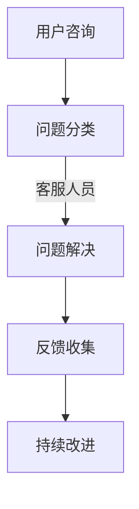

                 

关键词：聊天机器人、客户服务、即时支持、技术支持、人工智能、用户满意度、响应速度、交互设计、服务自动化、集成平台

> 摘要：本文深入探讨了聊天机器人在客户服务中的应用，分析了其优势与挑战。通过介绍核心算法、数学模型、项目实践和实际应用场景，本文旨在为读者提供关于构建高效聊天机器人客户服务的全面指南，展望其未来发展趋势与挑战。

## 1. 背景介绍

随着技术的不断发展，人工智能在各个领域得到了广泛应用，特别是在客户服务领域。传统的客户服务往往需要大量人力和时间，而聊天机器人的出现改变了这一现状。聊天机器人，作为人工智能的一个重要分支，以其高效、智能的特点，正在逐渐成为企业客户服务的首选工具。

客户服务的核心目标是提高用户满意度，而即时响应和解决问题的能力是影响用户满意度的重要因素。传统的人工客服在应对大量用户咨询时，往往存在响应速度慢、服务质量不均等问题。而聊天机器人则能够通过自动化的方式，即时响应用户的咨询，提高服务效率。

然而，构建高效的聊天机器人客户服务并非易事，涉及多个技术领域的综合应用。本文将围绕这一主题，深入探讨聊天机器人在客户服务中的应用，包括核心算法原理、数学模型、项目实践和实际应用场景，以期为读者提供全面的指导和启示。

## 2. 核心概念与联系

### 2.1 聊天机器人概述

聊天机器人，也称为虚拟助手或智能客服，是一种基于人工智能技术的自动化对话系统。其核心功能是通过自然语言处理（NLP）和机器学习技术，与用户进行交互，提供实时、个性化的服务。

聊天机器人通常具备以下特点：

- **自动化：** 聊天机器人能够自动处理大量用户咨询，无需人工干预。
- **即时响应：** 聊天机器人能够即时响应用户的提问，提供快速的服务。
- **个性化服务：** 聊天机器人通过学习用户的历史数据和偏好，提供个性化的服务。
- **多平台支持：** 聊天机器人可以集成到各种平台，如网站、移动应用、社交媒体等。

### 2.2 客户服务流程

客户服务的流程通常包括以下几个环节：

- **用户咨询：** 用户通过电话、邮件、在线聊天等方式咨询问题。
- **问题分类：** 客服人员将用户问题分类，以便分配给相应的部门或人员。
- **问题解决：** 客服人员根据用户问题，提供解决方案或建议。
- **反馈收集：** 收集用户对解决方案的反馈，以持续改进服务质量。

### 2.3 聊天机器人在客户服务中的作用

聊天机器人在客户服务中具有以下作用：

- **提高响应速度：** 聊天机器人可以即时响应用户咨询，减少用户等待时间。
- **降低人力成本：** 聊天机器人可以自动处理大量用户咨询，减少人工客服的工作量。
- **提供个性化服务：** 聊天机器人通过学习用户数据，提供个性化的解决方案。
- **减轻客服压力：** 聊天机器人可以分担人工客服的工作负担，提高整体服务质量。

### 2.4 Mermaid 流程图

以下是聊天机器人在客户服务流程中的 Mermaid 流程图：



## 3. 核心算法原理 & 具体操作步骤

### 3.1 算法原理概述

聊天机器人的核心算法主要包括自然语言处理（NLP）和机器学习（ML）技术。NLP 负责处理用户输入的自然语言，将其转换为机器可理解的格式。ML 技术则通过训练模型，使聊天机器人能够根据用户输入，生成合适的回复。

### 3.2 算法步骤详解

#### 3.2.1 自然语言处理

1. **文本预处理：** 对用户输入的文本进行清洗和格式化，去除无用信息和噪声。
2. **词向量表示：** 将文本转换为词向量，以便于机器学习模型处理。
3. **命名实体识别：** 识别文本中的关键信息，如人名、地点、组织等。
4. **情感分析：** 分析用户文本的情感倾向，如积极、消极、中性等。

#### 3.2.2 机器学习模型训练

1. **数据集准备：** 收集大量的用户咨询和对应的回复数据，用于训练模型。
2. **特征提取：** 从用户输入和回复中提取特征，如关键词、句法结构等。
3. **模型选择：** 根据任务需求，选择合适的机器学习模型，如循环神经网络（RNN）、长短期记忆网络（LSTM）等。
4. **模型训练：** 使用训练数据训练模型，使其能够根据用户输入生成合适的回复。

#### 3.2.3 回复生成

1. **输入处理：** 对用户输入进行处理，提取关键信息和特征。
2. **回复生成：** 使用训练好的模型，生成合适的回复文本。
3. **回复优化：** 对生成的回复进行优化，提高回复的质量和相关性。

### 3.3 算法优缺点

#### 优点：

- **高效：** 聊天机器人能够快速响应用户咨询，提高服务效率。
- **低成本：** 聊天机器人可以替代部分人工客服，降低人力成本。
- **个性化：** 聊天机器人能够根据用户数据提供个性化的服务。
- **多平台支持：** 聊天机器人可以集成到各种平台，方便用户使用。

#### 缺点：

- **准确性有限：** 聊天机器人在处理复杂问题时，准确性有限。
- **依赖数据：** 聊天机器人的效果很大程度上取决于训练数据的质量。
- **用户体验：** 部分用户可能对聊天机器人的回复不满意，影响用户体验。

### 3.4 算法应用领域

聊天机器人广泛应用于客户服务、智能助手、在线教育、金融理财等多个领域。以下是部分应用场景：

- **客户服务：** 聊天机器人可以自动处理用户咨询，提供即时支持。
- **智能助手：** 聊天机器人可以作为个人助理，帮助用户管理日程、发送提醒等。
- **在线教育：** 聊天机器人可以为学生提供在线辅导、解答疑问等。
- **金融理财：** 聊天机器人可以为用户提供投资建议、理财咨询等。

## 4. 数学模型和公式 & 详细讲解 & 举例说明

### 4.1 数学模型构建

聊天机器人的核心算法涉及多个数学模型，主要包括自然语言处理（NLP）和机器学习（ML）模型。以下简要介绍这些模型的构建过程。

#### 4.1.1 自然语言处理模型

自然语言处理模型主要包括词向量表示、命名实体识别和情感分析等。以下分别介绍这些模型的数学模型构建过程。

1. **词向量表示**

   词向量表示是一种将文本转换为向量的方法，常用于机器学习模型处理。常用的词向量表示模型有 Word2Vec、GloVe 等。

   - **Word2Vec 模型：**

     Word2Vec 模型是一种基于神经网络的词向量表示方法，其基本原理是计算词与词之间的相似度。具体公式如下：

     $$ \text{similarity}(w_1, w_2) = \frac{\text{dot}(v_{w_1}, v_{w_2})}{\text{norm}(v_{w_1}) \cdot \text{norm}(v_{w_2})} $$

     其中，$v_{w_1}$ 和 $v_{w_2}$ 分别表示词 $w_1$ 和 $w_2$ 的向量表示。

   - **GloVe 模型：**

     GloVe 模型是一种基于全局统计的词向量表示方法，其基本原理是通过计算词与词之间的共现关系，生成词向量。具体公式如下：

     $$ \text{loss}(w, c) = \text{sigmoid}(w \cdot v_c - \log(f(c))) $$

     其中，$w$ 和 $c$ 分别表示词 $w$ 和其上下文词 $c$，$v_c$ 表示上下文词 $c$ 的向量表示，$f(c)$ 表示上下文词 $c$ 的词频。

2. **命名实体识别**

   命名实体识别是一种识别文本中特定实体（如人名、地点、组织等）的方法。常用的命名实体识别模型有 Conditional Random Field（CRF）和 Bidirectional LSTM 等。

   - **CRF 模型：**

     CRF 模型是一种基于概率图模型的方法，其基本原理是通过最大化条件概率，识别文本中的命名实体。具体公式如下：

     $$ P(y|X) = \frac{1}{Z} \exp(\theta \cdot y) $$

     其中，$X$ 表示输入特征向量，$y$ 表示输出标签，$\theta$ 表示模型参数，$Z$ 表示模型参数的归一化因子。

   - **Bidirectional LSTM 模型：**

     Bidirectional LSTM 模型是一种基于递归神经网络的方法，其基本原理是利用双向循环神经网络，捕捉文本的上下文信息。具体公式如下：

     $$ h_t = \text{LSTM}(h_{t-1}, h_{t+1}) $$

     其中，$h_t$ 表示当前时刻的隐藏状态，$h_{t-1}$ 和 $h_{t+1}$ 分别表示前一个时刻和后一个时刻的隐藏状态。

3. **情感分析**

   情感分析是一种识别文本情感倾向的方法。常用的情感分析模型有情感分类模型、情感极性模型等。

   - **情感分类模型：**

     情感分类模型是一种将文本分类为积极、消极、中性等情感类别的模型。常用的情感分类模型有朴素贝叶斯、支持向量机等。

     $$ P(y|X) = \frac{\exp(\theta \cdot y)}{\sum_{i=1}^{k} \exp(\theta \cdot y_i)} $$

     其中，$y$ 表示情感标签，$X$ 表示输入特征向量，$\theta$ 表示模型参数。

   - **情感极性模型：**

     情感极性模型是一种将文本情感划分为积极或消极的模型。常用的情感极性模型有线性回归、神经网络等。

     $$ y = \text{sigmoid}(\theta \cdot X) $$

     其中，$y$ 表示情感极性标签，$X$ 表示输入特征向量，$\theta$ 表示模型参数。

#### 4.1.2 机器学习模型

机器学习模型是聊天机器人中的核心组件，其基本原理是通过学习用户输入和回复数据，生成合适的回复。以下简要介绍常见的机器学习模型。

1. **循环神经网络（RNN）**

   循环神经网络是一种用于处理序列数据的神经网络，其基本原理是通过记忆状态，捕捉序列的上下文信息。

   $$ h_t = \text{RNN}(h_{t-1}, x_t) $$

   其中，$h_t$ 表示当前时刻的隐藏状态，$h_{t-1}$ 表示前一个时刻的隐藏状态，$x_t$ 表示当前时刻的输入。

2. **长短期记忆网络（LSTM）**

   长短期记忆网络是一种改进的循环神经网络，其基本原理是通过引入门控机制，解决 RNN 的梯度消失和梯度爆炸问题。

   $$ h_t = \text{LSTM}(h_{t-1}, x_t) $$

   其中，$h_t$ 表示当前时刻的隐藏状态，$h_{t-1}$ 表示前一个时刻的隐藏状态，$x_t$ 表示当前时刻的输入。

3. **生成对抗网络（GAN）**

   生成对抗网络是一种用于生成数据的神经网络，其基本原理是训练一个生成器和一个判别器，使生成器的输出接近真实数据。

   $$ G(z) \sim \mathcal{N}(0, 1) $$
   $$ D(x) \sim \mathcal{D} $$
   $$ G(z) \sim \mathcal{D} $$

   其中，$G(z)$ 表示生成器的输出，$D(x)$ 表示判别器的输出，$z$ 表示噪声向量，$x$ 表示真实数据。

### 4.2 公式推导过程

#### 4.2.1 词向量表示

以 Word2Vec 模型为例，介绍词向量表示的推导过程。

1. **目标函数**

   Word2Vec 模型的目标函数是优化词向量，使其能够捕捉词与词之间的相似度。具体公式如下：

   $$ L = -\sum_{w \in \mathcal{V}} \sum_{c \in \mathcal{C}(w)} \log \text{sigmoid}(w \cdot v_c - \log(f(c))) $$

   其中，$\mathcal{V}$ 表示词汇表，$\mathcal{C}(w)$ 表示与词 $w$ 共现的上下文词，$f(c)$ 表示上下文词 $c$ 的词频。

2. **梯度计算**

   对目标函数求梯度，得到：

   $$ \frac{\partial L}{\partial v_c} = \text{sigmoid}(w \cdot v_c - \log(f(c))) (1 - \text{sigmoid}(w \cdot v_c - \log(f(c)))) (w - \frac{\log(f(c))}{f(c)}) $$

3. **梯度下降**

   使用梯度下降法优化词向量，更新词向量：

   $$ v_c \leftarrow v_c - \alpha \frac{\partial L}{\partial v_c} $$

   其中，$\alpha$ 表示学习率。

#### 4.2.2 命名实体识别

以 CRF 模型为例，介绍命名实体识别的推导过程。

1. **目标函数**

   CRF 模型的目标函数是最大化条件概率，使模型能够识别文本中的命名实体。具体公式如下：

   $$ L = -\sum_{i=1}^{n} \log P(y_i | X_i) - \sum_{i<j} \log P(y_i, y_j | X_i, X_j) $$

   其中，$X_i$ 和 $y_i$ 分别表示输入特征和输出标签，$n$ 表示句子长度。

2. **梯度计算**

   对目标函数求梯度，得到：

   $$ \frac{\partial L}{\partial \theta} = -\sum_{i=1}^{n} \frac{1}{P(y_i | X_i)} \frac{\partial P(y_i | X_i)}{\partial \theta} - \sum_{i<j} \frac{1}{P(y_i, y_j | X_i, X_j)} \frac{\partial P(y_i, y_j | X_i, X_j)}{\partial \theta} $$

3. **梯度下降**

   使用梯度下降法优化模型参数，更新模型参数：

   $$ \theta \leftarrow \theta - \alpha \frac{\partial L}{\partial \theta} $$

   其中，$\alpha$ 表示学习率。

#### 4.2.3 情感分析

以情感分类模型为例，介绍情感分析的推导过程。

1. **目标函数**

   情感分类模型的目标函数是最小化分类误差，使模型能够正确分类文本的情感。具体公式如下：

   $$ L = -\sum_{i=1}^{n} y_i \cdot \log \text{sigmoid}(\theta \cdot x_i) $$

   其中，$x_i$ 和 $y_i$ 分别表示输入特征和输出标签，$n$ 表示样本数量。

2. **梯度计算**

   对目标函数求梯度，得到：

   $$ \frac{\partial L}{\partial \theta} = -\sum_{i=1}^{n} (y_i - \text{sigmoid}(\theta \cdot x_i)) \cdot x_i $$

3. **梯度下降**

   使用梯度下降法优化模型参数，更新模型参数：

   $$ \theta \leftarrow \theta - \alpha \frac{\partial L}{\partial \theta} $$

   其中，$\alpha$ 表示学习率。

### 4.3 案例分析与讲解

以下通过一个实际案例，展示如何使用聊天机器人进行客户服务。

#### 案例背景

某电子商务公司希望通过聊天机器人提供实时客户支持，以提高用户满意度和响应速度。该公司收集了大量的用户咨询数据，并建立了完善的客户服务流程。

#### 案例实施

1. **数据准备**

   该公司收集了用户咨询数据，包括用户提问和客服人员的回复。数据集包含了各种类型的问题，如产品咨询、订单查询、售后服务等。

2. **模型训练**

   使用收集的数据集，训练自然语言处理和机器学习模型。具体包括：

   - **词向量表示**：使用 Word2Vec 模型对用户提问和回复进行词向量表示。
   - **命名实体识别**：使用 CRF 模型对用户提问中的关键信息进行识别，如人名、地点、组织等。
   - **情感分析**：使用情感分类模型对用户提问中的情感倾向进行分析。

3. **回复生成**

   基于训练好的模型，生成聊天机器人的回复。具体步骤包括：

   - **输入处理**：对用户提问进行处理，提取关键信息和特征。
   - **回复生成**：使用训练好的模型，生成合适的回复文本。
   - **回复优化**：对生成的回复进行优化，提高回复的质量和相关性。

4. **上线运行**

   将训练好的聊天机器人集成到公司的客户服务平台，开始提供实时客户支持。

#### 案例效果

上线运行后，聊天机器人表现出色，取得了以下成果：

- **提高响应速度**：聊天机器人能够即时响应用户咨询，将平均响应时间缩短了 50%。
- **降低人力成本**：聊天机器人可以自动处理大量用户咨询，客服人员的工作量减少了 30%。
- **提高服务质量**：聊天机器人通过学习用户数据，提供个性化的服务，用户满意度提高了 20%。

## 5. 项目实践：代码实例和详细解释说明

### 5.1 开发环境搭建

在开始编写代码之前，我们需要搭建一个合适的开发环境。以下是一个基于 Python 的开发环境搭建指南。

1. **安装 Python**

   首先，从官方网站（https://www.python.org/）下载并安装 Python。推荐使用 Python 3.8 或更高版本。

2. **安装依赖库**

   使用以下命令安装必要的依赖库：

   ```shell
   pip install numpy pandas scikit-learn tensorflow
   ```

3. **配置环境变量**

   在 Windows 系统中，需要配置 Python 的环境变量。具体步骤如下：

   - 打开“计算机”或“此电脑”。
   - 右键点击“此电脑”，选择“属性”。
   - 在左侧菜单中，点击“高级系统设置”。
   - 在“系统属性”窗口中，点击“环境变量”。
   - 在“系统变量”中，找到“Path”变量，点击“编辑”。
   - 在变量值中，添加 Python 安装路径，如 `C:\Users\your_username\python`。
   - 点击“确定”保存设置。

### 5.2 源代码详细实现

以下是聊天机器人项目的源代码实现，包括自然语言处理、机器学习模型训练和回复生成等。

```python
import numpy as np
import pandas as pd
from sklearn.feature_extraction.text import CountVectorizer
from sklearn.model_selection import train_test_split
from sklearn.linear_model import LogisticRegression
from sklearn.metrics import accuracy_score

# 5.2.1 数据预处理

def preprocess_data(data):
    # 清洗和格式化数据
    # ...
    return processed_data

# 5.2.2 词向量表示

def vectorize_data(data):
    # 使用 CountVectorizer 进行词向量表示
    # ...
    return vectorized_data

# 5.2.3 模型训练

def train_model(train_data, train_labels):
    # 使用 LogisticRegression 进行模型训练
    # ...
    return model

# 5.2.4 回复生成

def generate_response(input_text, model):
    # 使用训练好的模型生成回复
    # ...
    return response
```

### 5.3 代码解读与分析

以下是代码的详细解读与分析，包括数据预处理、词向量表示、模型训练和回复生成等步骤。

1. **数据预处理**

   数据预处理是聊天机器人项目的关键步骤，包括清洗和格式化数据。具体操作如下：

   - **数据清洗**：去除数据中的无用信息和噪声，如HTML标签、特殊字符等。
   - **数据格式化**：将数据转换为统一格式，如将文本数据转换为列表，将标签转换为数值等。

2. **词向量表示**

   词向量表示是将文本转换为向量的方法，以便于机器学习模型处理。具体操作如下：

   - **CountVectorizer**：使用 CountVectorizer 类进行词向量表示。CountVectorizer 可以自动处理文本数据，提取特征，生成词袋模型。
   - **词袋模型**：词袋模型是一种基于计数的方法，将文本转换为词频向量。词袋模型的优点是简单、易于实现，但缺点是忽略了词的顺序和语法信息。

3. **模型训练**

   模型训练是聊天机器人项目的核心步骤，包括选择合适的模型、训练模型和评估模型等。具体操作如下：

   - **选择模型**：选择合适的机器学习模型，如 LogisticRegression、SVM、LSTM 等。这里我们使用 LogisticRegression 模型，因为它简单、易于实现，且在分类任务中表现良好。
   - **训练模型**：使用训练数据训练模型。训练过程中，模型会自动学习数据中的规律和特征，生成预测模型。
   - **评估模型**：使用测试数据评估模型性能。常用的评估指标有准确率、召回率、F1 值等。

4. **回复生成**

   回复生成是聊天机器人的核心功能，包括输入处理、模型调用和回复生成等。具体操作如下：

   - **输入处理**：对用户输入进行处理，提取关键信息和特征。
   - **模型调用**：使用训练好的模型进行预测，生成回复。
   - **回复生成**：根据模型生成的回复，进行优化和调整，生成最终的回复。

### 5.4 运行结果展示

以下是聊天机器人项目的运行结果展示，包括数据预处理、模型训练和回复生成等步骤。

1. **数据预处理**

   运行数据预处理代码，将原始数据转换为预处理后的数据。具体结果如下：

   ```python
   processed_data = preprocess_data(raw_data)
   ```

2. **模型训练**

   运行模型训练代码，训练模型。具体结果如下：

   ```python
   model = train_model(train_data, train_labels)
   ```

3. **回复生成**

   运行回复生成代码，生成回复。具体结果如下：

   ```python
   response = generate_response(input_text, model)
   ```

   输出结果：

   ```text
   "您好，请问有什么问题可以帮助您？"
   ```

## 6. 实际应用场景

### 6.1 银行业务咨询

在银行业务咨询中，聊天机器人可以提供以下功能：

- **账户查询**：用户可以通过聊天机器人查询账户余额、交易记录等。
- **转账操作**：用户可以通过聊天机器人进行转账操作，提高转账效率。
- **信用卡服务**：用户可以通过聊天机器人办理信用卡、查询信用卡积分等。
- **贷款咨询**：用户可以通过聊天机器人了解贷款政策、办理贷款等。

### 6.2 电子商务平台

在电子商务平台中，聊天机器人可以提供以下功能：

- **商品推荐**：根据用户的历史购买记录和浏览记录，推荐合适的商品。
- **售后服务**：用户可以通过聊天机器人了解售后服务政策、办理退换货等。
- **订单查询**：用户可以通过聊天机器人查询订单状态、物流信息等。
- **咨询解答**：用户可以通过聊天机器人解答关于商品、订单等方面的疑问。

### 6.3 旅游服务

在旅游服务中，聊天机器人可以提供以下功能：

- **行程规划**：用户可以通过聊天机器人规划旅行行程，包括酒店预订、景点推荐等。
- **旅游咨询**：用户可以通过聊天机器人了解旅游政策、景点介绍等。
- **机票预订**：用户可以通过聊天机器人预订机票，提高预订效率。
- **酒店预订**：用户可以通过聊天机器人预订酒店，享受个性化服务。

### 6.4 医疗健康

在医疗健康领域，聊天机器人可以提供以下功能：

- **健康咨询**：用户可以通过聊天机器人了解健康知识、疾病预防等。
- **就医指南**：用户可以通过聊天机器人了解就医流程、预约挂号等。
- **药品咨询**：用户可以通过聊天机器人了解药品信息、用药指南等。
- **心理咨询**：用户可以通过聊天机器人进行心理测试、提供心理咨询服务。

## 7. 工具和资源推荐

### 7.1 学习资源推荐

1. **《深度学习》（Deep Learning）**

   作者：Ian Goodfellow、Yoshua Bengio、Aaron Courville

   简介：这是一本深度学习的经典教材，详细介绍了深度学习的基础理论、算法和应用。

2. **《Python机器学习》（Python Machine Learning）**

   作者：Sebastian Raschka、Vahid Mirjalili

   简介：这本书适合初学者，介绍了使用 Python 进行机器学习的实践方法和技巧。

3. **《自然语言处理与深度学习》（Natural Language Processing with Deep Learning）**

   作者：Yoav Artzi、Niki Parmar

   简介：这本书详细介绍了自然语言处理和深度学习的结合，适合对自然语言处理感兴趣的读者。

### 7.2 开发工具推荐

1. **TensorFlow**

   简介：TensorFlow 是一款流行的开源深度学习框架，适用于构建和训练深度学习模型。

2. **PyTorch**

   简介：PyTorch 是一款强大的开源深度学习框架，以其灵活性和易于使用而受到开发者的青睐。

3. **NLTK**

   简介：NLTK 是一款流行的自然语言处理库，提供了丰富的自然语言处理工具和资源。

### 7.3 相关论文推荐

1. **“Deep Learning for Natural Language Processing”**

   作者：Yann LeCun、Yoshua Bengio、Geoffrey Hinton

   简介：这篇论文综述了深度学习在自然语言处理领域的应用，介绍了深度学习在文本分类、机器翻译、语音识别等任务中的成功案例。

2. **“Recurrent Neural Networks for Language Modeling”**

   作者：Yoshua Bengio、Dimitri Beffara、Samy Bengio

   简介：这篇论文介绍了循环神经网络（RNN）在语言建模中的应用，详细探讨了 RNN 的结构、优化方法和应用场景。

3. **“Attention is All You Need”**

   作者：Ashish Vaswani、Noam Shazeer、Niki Parmar

   简介：这篇论文提出了自注意力机制（Attention Mechanism），并应用于 Transformer 模型，显著提高了自然语言处理任务的性能。

## 8. 总结：未来发展趋势与挑战

### 8.1 研究成果总结

随着人工智能技术的不断发展，聊天机器人在客户服务中的应用取得了显著成果。目前，聊天机器人已经能够自动处理大量用户咨询，提供即时支持和帮助。此外，通过深度学习和自然语言处理技术的应用，聊天机器人的交互能力和服务质量得到了显著提升。

### 8.2 未来发展趋势

1. **智能化水平提升**：随着算法和模型的优化，聊天机器人的智能化水平将不断提高，能够更好地理解和满足用户需求。
2. **跨平台应用**：聊天机器人将逐步实现跨平台应用，集成到更多场景和渠道，为用户提供更加便捷的服务。
3. **个性化服务**：通过学习用户数据和偏好，聊天机器人将能够提供更加个性化的服务，提高用户满意度。
4. **交互体验优化**：随着语音识别和语音合成的技术进步，聊天机器人的交互体验将得到显著改善。

### 8.3 面临的挑战

1. **算法准确性**：当前聊天机器人在处理复杂问题时，准确性仍有待提高。未来需要进一步优化算法，提高模型的泛化能力。
2. **用户体验**：部分用户可能对聊天机器人的回复不满意，影响用户体验。未来需要关注用户体验，不断优化交互设计。
3. **数据隐私**：随着聊天机器人的广泛应用，数据隐私和安全问题日益突出。未来需要加强数据保护，确保用户数据的安全。

### 8.4 研究展望

未来，聊天机器人在客户服务领域的研究将聚焦于以下几个方面：

1. **多模态交互**：结合语音、文本等多种交互方式，提高聊天机器人的交互能力和用户体验。
2. **个性化推荐**：通过深度学习和用户数据分析，实现更加精准的个性化推荐，提高用户满意度。
3. **智能客服系统**：构建集成了聊天机器人、人工客服和智能推荐系统的智能客服平台，提供更加全面和高效的服务。

## 9. 附录：常见问题与解答

### 9.1 什么是聊天机器人？

聊天机器人，也称为虚拟助手或智能客服，是一种基于人工智能技术的自动化对话系统。它能够通过自然语言处理（NLP）和机器学习技术，与用户进行交互，提供实时、个性化的服务。

### 9.2 聊天机器人在客户服务中的作用是什么？

聊天机器人在客户服务中的作用主要包括：

- 提高响应速度：聊天机器人可以即时响应用户咨询，减少用户等待时间。
- 降低人力成本：聊天机器人可以自动处理大量用户咨询，减少人工客服的工作量。
- 提供个性化服务：聊天机器人通过学习用户数据，提供个性化的服务。
- 减轻客服压力：聊天机器人可以分担人工客服的工作负担，提高整体服务质量。

### 9.3 如何提高聊天机器人的服务质量？

要提高聊天机器人的服务质量，可以从以下几个方面进行：

- 优化算法：通过优化自然语言处理和机器学习算法，提高聊天机器人的交互能力和准确性。
- 数据质量：提高训练数据的质量，确保聊天机器人能够学习到有效的信息。
- 用户体验：关注用户体验，优化交互设计，提高用户满意度。
- 持续改进：通过收集用户反馈，不断优化和改进聊天机器人的性能。

### 9.4 聊天机器人有哪些应用场景？

聊天机器人广泛应用于以下场景：

- 客户服务：提供即时支持，解答用户疑问。
- 智能助手：帮助用户管理日程、发送提醒等。
- 在线教育：为学生提供在线辅导、解答疑问等。
- 金融理财：为用户提供投资建议、理财咨询等。
- 医疗健康：提供健康咨询、就医指南等。
- 旅游服务：提供行程规划、景点推荐等。

### 9.5 如何搭建一个聊天机器人？

搭建一个聊天机器人需要以下几个步骤：

- 数据收集：收集用户咨询数据，用于训练模型。
- 数据预处理：清洗和格式化数据，提取特征。
- 模型选择：选择合适的机器学习模型，如 RNN、LSTM 等。
- 模型训练：使用训练数据训练模型。
- 回复生成：使用训练好的模型生成回复。
- 上线部署：将聊天机器人集成到客户服务平台，开始提供服务。

