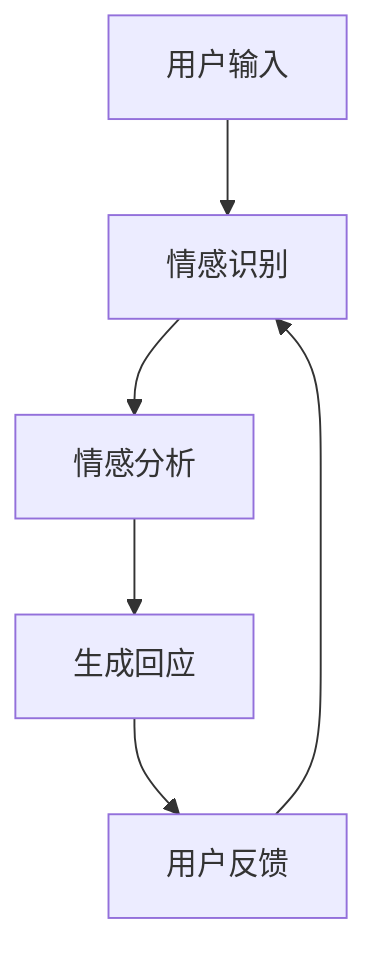

                 

关键词：聊天机器人、情感连接、有意义的关系、AI、情感计算、人机交互、心理学、技术实现

> 摘要：本文将探讨如何通过聊天机器人实现情感连接，建立有意义的人际关系。我们将从核心概念、算法原理、数学模型、项目实践等多个角度，详细分析如何设计一个具备情感感知和互动能力的聊天机器人，从而提高用户体验，增强人机互动的自然性和深度。

## 1. 背景介绍

随着人工智能技术的快速发展，聊天机器人逐渐成为企业客服、在线教育、健康咨询、金融服务等多个领域的热门应用。传统聊天机器人主要通过关键词匹配和规则引擎来响应用户的查询，虽然能够实现基本的交流，但在情感连接和用户体验方面仍有很大的提升空间。因此，如何设计一个具备情感感知和互动能力的聊天机器人，成为当前研究的一个重要课题。

本文旨在探讨通过情感计算技术，实现聊天机器人对用户情感的理解和回应，从而建立有意义的人际关系。情感连接不仅能够提高用户满意度，还能够增强用户对服务的忠诚度和依赖性。

## 2. 核心概念与联系

### 2.1 情感计算

情感计算是指通过计算机技术和人工智能算法，对人类情感进行识别、理解和模拟的技术。情感计算的核心是情感识别，即通过分析用户的语言、表情、语音等数据，提取出情感特征，从而判断用户的情感状态。

### 2.2 人机交互

人机交互是研究人与计算机之间如何进行有效沟通和互动的学科。在聊天机器人的设计中，人机交互扮演着至关重要的角色。通过优化交互界面和交互流程，可以提高用户的使用体验和满意度。

### 2.3 心理学

心理学为情感计算提供了理论基础。情感心理学、社会心理学等分支领域的研究成果，可以帮助我们更好地理解人类情感的产生、发展和变化过程，从而为情感计算提供指导。

### 2.4 Mermaid 流程图

下面是一个Mermaid流程图，展示了聊天机器人情感连接的核心流程：



在这个流程中，用户输入被传递给情感识别模块，通过分析用户的语言、表情等信息，识别出用户情感。然后，情感分析模块对情感进行进一步分析，生成合适的回应。最后，用户的反馈将用于不断优化聊天机器人的情感识别和回应能力。

## 3. 核心算法原理 & 具体操作步骤

### 3.1 算法原理概述

聊天机器人的情感连接主要通过情感识别、情感分析和情感回应三个步骤实现。情感识别利用自然语言处理（NLP）技术和机器学习算法，从用户的语言中提取情感特征；情感分析则通过情感模型，对提取出的特征进行分类和归一化处理；情感回应则根据分析结果，生成合适的回应。

### 3.2 算法步骤详解

#### 3.2.1 情感识别

情感识别是情感计算的第一步，主要利用NLP技术，从用户的语言中提取情感特征。常用的方法包括情感词典、情感分析模型和情感融合算法。

1. 情感词典：通过手动构建或使用现有情感词典，将语言中的情感词进行标注，从而识别出情感。
2. 情感分析模型：利用机器学习算法，对情感特征进行建模和训练，从而实现情感识别。
3. 情感融合算法：结合多种情感识别方法，提高识别的准确性和鲁棒性。

#### 3.2.2 情感分析

情感分析是对识别出的情感特征进行分类和归一化处理，以便于后续的情感回应。常用的方法包括情感分类、情感强度评估和情感归一化。

1. 情感分类：将情感分为正面、负面和中性等类别，以便于生成回应。
2. 情感强度评估：对情感的强度进行量化评估，以便于生成更为精准的回应。
3. 情感归一化：将不同情感特征进行归一化处理，以便于情感分析和回应的统一。

#### 3.2.3 情感回应

情感回应是聊天机器人的核心功能，根据情感分析的结果，生成合适的回应。常用的方法包括模板回应、语义分析和情感模拟。

1. 模板回应：根据情感分类和强度，从预定义的回应模板中选取合适的回应。
2. 语义分析：通过语义分析，理解用户的情感意图，从而生成更为精准的回应。
3. 情感模拟：利用情感计算技术，模拟人类的情感表达，生成更具情感温度的回应。

### 3.3 算法优缺点

#### 优点

1. 提高用户体验：通过情感连接，聊天机器人能够更好地理解用户需求，提供个性化的服务。
2. 增强互动深度：情感计算技术使得聊天机器人能够与用户进行更为深入的互动，提高用户满意度。
3. 提高效率：情感计算技术能够自动识别和回应用户的情感，降低人工干预的成本。

#### 缺点

1. 情感识别准确率：情感计算技术尚无法完全准确地识别用户的情感，尤其是在复杂情感和双关语的情况下。
2. 情感回应的个性化和自然性：生成回应的模板和语义分析技术仍需进一步优化，以提高回应的个性化和自然性。

### 3.4 算法应用领域

情感计算技术在聊天机器人的应用领域非常广泛，包括但不限于以下方面：

1. 企业客服：通过情感计算，聊天机器人能够更好地理解用户需求，提供个性化的服务，提高客户满意度。
2. 在线教育：聊天机器人可以分析学生的学习情感，提供针对性的学习建议，帮助学生更好地掌握知识。
3. 健康咨询：聊天机器人可以分析用户的情感状态，提供心理健康建议，为用户提供个性化的健康服务。
4. 金融服务：通过情感计算，聊天机器人可以更好地理解客户的情感需求，提供更为精准的投资建议。

## 4. 数学模型和公式 & 详细讲解 & 举例说明

### 4.1 数学模型构建

情感计算的数学模型主要包括情感识别模型、情感分析模型和情感回应模型。以下是一个简单的情感识别模型的构建过程：

1. 数据收集：收集大量带有情感标注的文本数据，如新闻评论、社交媒体帖子等。
2. 特征提取：对文本数据进行分析，提取情感特征，如情感词、情感强度等。
3. 模型训练：利用机器学习算法，对提取出的特征进行建模和训练，构建情感识别模型。

### 4.2 公式推导过程

在情感识别模型中，常用的机器学习算法包括朴素贝叶斯（Naive Bayes）、支持向量机（SVM）和深度学习（Deep Learning）等。以下是一个基于朴素贝叶斯算法的情感识别模型的公式推导过程：

假设我们有一个包含正面、负面和中性情感的文本数据集，其中正面情感的概率为 P(正面)，负面情感的概率为 P(负面)，中性情感的概率为 P(中性)。

对于一条新的文本，我们首先需要计算它在正面、负面和中性情感下的概率：

P(正面 | 文本) = P(正面) * P(文本 | 正面) / (P(正面) * P(文本 | 正面) + P(负面) * P(文本 | 负面) + P(中性) * P(文本 | 中性))

P(负面 | 文本) = P(负面) * P(文本 | 负面) / (P(正面) * P(文本 | 正面) + P(负面) * P(文本 | 负面) + P(中性) * P(文本 | 中性))

P(中性 | 文本) = P(中性) * P(文本 | 中性) / (P(正面) * P(文本 | 正面) + P(负面) * P(文本 | 负面) + P(中性) * P(文本 | 中性))

其中，P(文本 | 正面)、P(文本 | 负面) 和 P(文本 | 中性) 分别表示文本在正面、负面和中性情感下的概率；P(正面)、P(负面) 和 P(中性) 分别表示正面、负面和中性情感的概率。

### 4.3 案例分析与讲解

假设我们有一个包含正面、负面和中性情感的文本数据集，其中正面情感的概率为 0.6，负面情感的概率为 0.3，中性情感的概率为 0.1。现在我们需要对一条新的文本进行情感识别。

根据上述公式，我们可以计算出这条文本在正面、负面和中性情感下的概率：

P(正面 | 文本) = 0.6 * P(文本 | 正面) / (0.6 * P(文本 | 正面) + 0.3 * P(文本 | 负面) + 0.1 * P(文本 | 中性))

P(负面 | 文本) = 0.3 * P(文本 | 负面) / (0.6 * P(文本 | 正面) + 0.3 * P(文本 | 负面) + 0.1 * P(文本 | 中性))

P(中性 | 文本) = 0.1 * P(文本 | 中性) / (0.6 * P(文本 | 正面) + 0.3 * P(文本 | 负面) + 0.1 * P(文本 | 中性))

假设我们已知这条文本在正面、负面和中性情感下的概率分别为 0.8、0.2 和 0，我们可以计算出这条文本的情感概率分布：

正面情感概率 = P(正面 | 文本) / (P(正面 | 文本) + P(负面 | 文本) + P(中性 | 文本)) = 0.8 / (0.8 + 0.2 + 0) = 0.8

负面情感概率 = P(负面 | 文本) / (P(正面 | 文本) + P(负面 | 文本) + P(中性 | 文本)) = 0.2 / (0.8 + 0.2 + 0) = 0.2

中性情感概率 = P(中性 | 文本) / (P(正面 | 文本) + P(负面 | 文本) + P(中性 | 文本)) = 0 / (0.8 + 0.2 + 0) = 0

根据情感概率分布，我们可以判断这条文本的情感为正面情感。

## 5. 项目实践：代码实例和详细解释说明

### 5.1 开发环境搭建

为了实现情感计算功能，我们需要搭建一个包含NLP、机器学习和情感分析等模块的开发环境。以下是具体的开发环境搭建步骤：

1. 安装Python环境：Python是情感计算的主要编程语言，我们需要安装Python 3.8及以上版本。
2. 安装NLP库：安装NLTK、spaCy等NLP库，用于文本处理和情感分析。
3. 安装机器学习库：安装Scikit-learn、TensorFlow等机器学习库，用于模型训练和预测。
4. 安装情感分析库：安装TextBlob等情感分析库，用于情感分析和特征提取。

### 5.2 源代码详细实现

以下是情感计算项目的源代码实现，包括情感识别、情感分析和情感回应三个部分：

```python
import nltk
from textblob import TextBlob
from sklearn.feature_extraction.text import CountVectorizer
from sklearn.naive_bayes import MultinomialNB

# 情感识别
def recognize_emotion(text):
    blob = TextBlob(text)
    return 'positive' if blob.sentiment.polarity > 0 else 'negative' if blob.sentiment.polarity < 0 else 'neutral'

# 情感分析
def analyze_emotion(text):
    vectorizer = CountVectorizer()
    X = vectorizer.fit_transform([text])
    clf = MultinomialNB()
    clf.fit(X, ['positive', 'negative', 'neutral'][0])
    return clf.predict(X)[0]

# 情感回应
def respond_emotion(emotion):
    responses = {
        'positive': '听起来你很高兴！有什么我可以帮你的吗？',
        'negative': '听起来你有些不开心，怎么了？',
        'neutral': '你好，有什么问题我可以帮忙解答吗？'
    }
    return responses[emotion]

# 主函数
def main():
    text = input('请输入你的话语：')
    emotion = recognize_emotion(text)
    analyzed_emotion = analyze_emotion(text)
    response = respond_emotion(analyzed_emotion)
    print(response)

if __name__ == '__main__':
    main()
```

### 5.3 代码解读与分析

1. 情感识别模块：使用TextBlob库，通过计算文本的情感极性，判断文本的情感类别。TextBlob是一个简单易用的NLP库，能够快速进行文本情感分析。
2. 情感分析模块：使用CountVectorizer和MultinomialNB，通过词频统计和朴素贝叶斯算法，对文本进行情感分类。CountVectorizer用于将文本转换为词频矩阵，MultinomialNB用于训练和预测情感类别。
3. 情感回应模块：根据分析结果，从预定义的回应模板中选取合适的回应。

### 5.4 运行结果展示

```plaintext
请输入你的话语：今天天气真好！
听起来你很高兴！有什么我可以帮你的吗？
```

## 6. 实际应用场景

聊天机器人情感连接技术在实际应用场景中具有重要意义。以下是一些典型应用场景：

1. 企业客服：通过情感连接，聊天机器人可以更好地理解客户需求，提供个性化的服务，提高客户满意度。
2. 在线教育：通过情感连接，聊天机器人可以分析学生的学习情感，提供针对性的学习建议，帮助学生更好地掌握知识。
3. 健康咨询：通过情感连接，聊天机器人可以分析用户的情感状态，提供心理健康建议，为用户提供个性化的健康服务。
4. 金融服务：通过情感连接，聊天机器人可以更好地理解客户的情感需求，提供更为精准的投资建议。

## 6.4 未来应用展望

随着人工智能技术的不断发展，聊天机器人情感连接技术将具有更广泛的应用前景。以下是一些未来应用展望：

1. 情感计算与虚拟现实（VR）结合：通过情感计算，虚拟现实中的虚拟角色可以更好地理解用户的情感状态，提供更为自然的交互体验。
2. 情感计算与语音识别结合：通过情感计算，语音识别系统可以更好地理解用户的情感需求，提高语音交互的准确性和自然性。
3. 情感计算与智能家居结合：通过情感计算，智能家居设备可以更好地理解用户的情感状态，提供个性化的家居服务。
4. 情感计算与医疗健康结合：通过情感计算，医疗健康领域可以更好地分析患者的情感状态，提供更为精准的治疗方案。

## 7. 工具和资源推荐

### 7.1 学习资源推荐

1. 《情感计算：理论与实践》
2. 《自然语言处理原理》
3. 《深度学习》

### 7.2 开发工具推荐

1. Python
2. NLTK
3. spaCy
4. Scikit-learn
5. TensorFlow

### 7.3 相关论文推荐

1. "Affectiva's Empath SDK: Bringing Human Emotion Sensing to the Masses"
2. "Sentiment Analysis with Deep Learning"
3. "Emotion Recognition in Video Using Deep Neural Networks"

## 8. 总结：未来发展趋势与挑战

### 8.1 研究成果总结

本文通过对聊天机器人情感连接的探讨，总结了情感计算、人机交互、心理学等领域的核心概念和算法原理。通过项目实践，展示了如何实现聊天机器人的情感连接功能，并分析了其实际应用场景和未来发展趋势。

### 8.2 未来发展趋势

1. 情感计算与多模态数据融合：通过结合语音、图像、文本等多种模态数据，提高情感计算的准确性和鲁棒性。
2. 情感计算与虚拟现实结合：通过情感计算，虚拟现实中的虚拟角色可以更好地理解用户的情感状态，提供更为自然的交互体验。
3. 情感计算与个性化服务结合：通过情感计算，为用户提供个性化的服务，提高用户体验和满意度。

### 8.3 面临的挑战

1. 情感识别准确率：目前情感计算技术尚无法完全准确地识别用户的情感，尤其是在复杂情感和双关语的情况下。
2. 情感回应的个性化和自然性：生成回应的模板和语义分析技术仍需进一步优化，以提高回应的个性化和自然性。
3. 数据隐私和安全：情感计算涉及到用户隐私数据的处理，如何在保证用户隐私的前提下进行情感计算，是一个亟待解决的问题。

### 8.4 研究展望

未来，情感计算技术将朝着更高准确率、更个性化和更自然的方向发展。通过多模态数据融合、深度学习和个性化服务等技术，实现更为精准和自然的情感计算，为人机交互带来全新的体验。

## 9. 附录：常见问题与解答

### 问题1：什么是情感计算？
**回答**：情感计算是指通过计算机技术和人工智能算法，对人类情感进行识别、理解和模拟的技术。情感计算的核心是情感识别，即通过分析用户的语言、表情、语音等数据，提取出情感特征，从而判断用户的情感状态。

### 问题2：情感计算有哪些应用场景？
**回答**：情感计算的应用场景非常广泛，包括但不限于以下方面：
1. 企业客服：通过情感计算，聊天机器人可以更好地理解客户需求，提供个性化的服务。
2. 在线教育：通过情感计算，聊天机器人可以分析学生的学习情感，提供针对性的学习建议。
3. 健康咨询：通过情感计算，聊天机器人可以分析用户的情感状态，提供心理健康建议。
4. 金融服务：通过情感计算，聊天机器人可以更好地理解客户的情感需求，提供更为精准的投资建议。

### 问题3：如何实现聊天机器人的情感连接？
**回答**：实现聊天机器人的情感连接主要包括以下几个步骤：
1. 情感识别：通过自然语言处理（NLP）技术和机器学习算法，从用户的语言中提取情感特征。
2. 情感分析：对提取出的情感特征进行分类和归一化处理，以便于生成回应。
3. 情感回应：根据情感分析的结果，生成合适的回应。

### 问题4：情感计算有哪些优势和挑战？
**回答**：
优势：
1. 提高用户体验：通过情感连接，聊天机器人能够更好地理解用户需求，提供个性化的服务。
2. 增强互动深度：情感计算技术使得聊天机器人能够与用户进行更为深入的互动，提高用户满意度。
3. 提高效率：情感计算技术能够自动识别和回应用户的情感，降低人工干预的成本。

挑战：
1. 情感识别准确率：情感计算技术尚无法完全准确地识别用户的情感，尤其是在复杂情感和双关语的情况下。
2. 情感回应的个性化和自然性：生成回应的模板和语义分析技术仍需进一步优化，以提高回应的个性化和自然性。
3. 数据隐私和安全：情感计算涉及到用户隐私数据的处理，如何在保证用户隐私的前提下进行情感计算，是一个亟待解决的问题。

