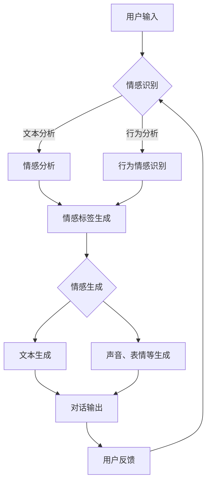

                 

关键词：聊天机器人，情感表达，用户体验，自然语言处理，情感计算

> 摘要：本文探讨了聊天机器人在用户体验中的情感表达的重要性。通过对情感计算技术的深入分析，本文详细阐述了如何通过情感表达来提升聊天机器人的交互质量和用户体验。文章还探讨了当前技术在情感表达上的挑战，并提出了一些可能的研究方向。

## 1. 背景介绍

随着人工智能技术的快速发展，聊天机器人已经成为许多企业和组织与客户互动的主要方式。这些机器人能够提供24/7的客户服务，减少人工成本，并提高服务效率。然而，尽管技术取得了巨大进步，许多聊天机器人在用户体验方面仍然存在不足。其中一个关键问题就是情感表达。

情感表达是人与人之间交流的重要部分，它能够传递友好、理解、关注等情感状态，从而增强互动的质量。同样，在机器人与人类的交互中，情感表达也至关重要。一个能够理解并适当地表达情感的聊天机器人，可以更好地满足用户的需求，提高用户满意度，增强用户粘性。

## 2. 核心概念与联系

### 情感计算

情感计算（Affective Computing）是研究如何使计算机具备情感识别、表达和响应能力的一个跨学科领域。其核心概念包括情感识别、情感生成和情感交互。

- **情感识别**：通过分析用户的语言、行为和生理信号，计算机能够识别出用户的情感状态。
- **情感生成**：计算机能够根据情感识别的结果，生成相应的情感表达，如文字、声音、面部表情等。
- **情感交互**：计算机与用户之间的互动过程，情感表达在其中起到关键作用。

### 聊天机器人情感架构

为了实现聊天机器人的情感表达，需要构建一个包含情感识别、情感生成和情感交互三个主要模块的架构。

- **情感识别模块**：使用自然语言处理（NLP）技术，从用户的输入中提取情感信息，如情绪词汇、语气等。
- **情感生成模块**：根据情感识别的结果，生成相应的情感表达。这可以包括调整文本的情感色彩、使用特定词汇或短语等。
- **情感交互模块**：在对话过程中，根据上下文和用户反馈，动态调整情感表达，以保持自然和合适的互动。

### Mermaid 流程图

下面是一个简化的Mermaid流程图，展示了聊天机器人情感表达的核心流程。



## 3. 核心算法原理 & 具体操作步骤

### 3.1 算法原理概述

聊天机器人的情感表达算法主要基于情感识别和情感生成两个核心步骤。

- **情感识别**：使用情感分析技术，从用户的语言和行为中提取情感信息。这通常涉及自然语言处理（如情感分类器、文本情感极性分析等）和计算机视觉（如面部表情识别、生理信号分析等）。

- **情感生成**：根据情感识别的结果，生成相应的情感表达。这可以通过调整文本的情感色彩、使用特定的词汇或短语、改变声音的语调等方式实现。

### 3.2 算法步骤详解

1. **情感识别**：
   - **文本分析**：使用情感分类器，对用户的文本输入进行情感分析，提取情感极性（如积极、消极）和情感强度。
   - **行为分析**：通过计算机视觉技术，分析用户的行为信号（如面部表情、肢体动作等），识别用户的状态和情感。

2. **情感生成**：
   - **文本生成**：根据情感识别的结果，调整文本的情感色彩。例如，如果识别出用户情绪消极，可以在回复中使用安慰性的语言。
   - **声音、表情生成**：根据情感识别的结果，调整机器人的声音、面部表情等。例如，如果识别出用户情绪积极，可以使用愉快的声音和微笑的表情。

3. **情感交互**：
   - **动态调整**：在对话过程中，根据用户的反馈和上下文，动态调整情感表达。例如，如果用户对机器人的回复不满意，可以尝试使用更温和或更专业的语言。
   - **情感反馈**：向用户提供情感反馈，使其了解机器人的情感状态。例如，在机器人的回复中包含“我很抱歉听到这个消息”或“我很高兴听到这个好消息”。

### 3.3 算法优缺点

**优点**：

- **提高用户体验**：通过情感表达，聊天机器人能够更好地理解用户的需求和情感状态，从而提供更个性化和贴近用户需求的交互。
- **增强互动质量**：情感表达使得机器人与用户之间的互动更加自然和生动，提高了互动的质量和用户的参与度。
- **提升服务质量**：情感表达能够帮助机器人更好地处理用户的情感需求，提供更专业和高效的服务。

**缺点**：

- **技术挑战**：情感识别和情感生成的技术相对复杂，需要结合多种技术（如自然语言处理、计算机视觉等），并且在实际应用中可能会遇到很多挑战。
- **数据依赖**：情感识别和情感生成的准确性很大程度上依赖于训练数据和算法模型，需要大量的数据支持和模型优化。
- **用户隐私**：在情感识别过程中，可能会涉及到用户的敏感信息和隐私，需要确保数据的隐私保护和合规性。

### 3.4 算法应用领域

- **客户服务**：聊天机器人可以用于客户服务，提供情感化、个性化的服务，提高客户满意度。
- **教育领域**：聊天机器人可以用于教育领域，通过情感表达来增强教学互动，提高学习效果。
- **心理健康**：聊天机器人可以用于心理健康领域，提供情感支持，帮助用户缓解压力和焦虑。

## 4. 数学模型和公式 & 详细讲解 & 举例说明

### 4.1 数学模型构建

在聊天机器人的情感表达中，情感分析是一个关键步骤。情感分析通常涉及以下数学模型：

- **情感分类器**：使用机器学习技术，将文本输入分类为不同的情感类别（如积极、消极、中性等）。
- **情感极性分析**：使用自然语言处理技术，计算文本的情感极性（如积极度、消极度等）。

假设我们使用一个简单的二元分类模型进行情感分类，其输出为：

\[ P(y = 1 | x) = \frac{1}{1 + e^{-\theta^T x}} \]

其中，\( x \) 是文本输入，\( y \) 是情感标签（1 表示积极，0 表示消极），\( \theta \) 是模型参数。

### 4.2 公式推导过程

为了推导情感分类器的公式，我们可以使用最大似然估计（MLE）来估计模型参数 \( \theta \)。

首先，定义数据集 \( D = \{ (x_1, y_1), (x_2, y_2), ..., (x_n, y_n) \} \)，其中 \( x_i \) 和 \( y_i \) 分别表示第 \( i \) 个样本的文本输入和情感标签。

根据最大似然估计，我们需要最大化以下对数似然函数：

\[ \ln P(D | \theta) = \sum_{i=1}^{n} \ln P(y_i | x_i, \theta) \]

由于我们假设每个样本是独立同分布的，因此：

\[ P(D | \theta) = \prod_{i=1}^{n} P(y_i | x_i, \theta) \]

代入情感分类器的公式，我们得到：

\[ P(D | \theta) = \prod_{i=1}^{n} \left( \frac{1}{1 + e^{-\theta^T x_i}} \right)^{y_i} \]

为了简化计算，我们取对数，得到：

\[ \ln P(D | \theta) = \sum_{i=1}^{n} y_i \theta^T x_i - \sum_{i=1}^{n} \theta^T x_i \]

我们对上述公式进行求导，并令导数为零，得到：

\[ \frac{\partial}{\partial \theta} \ln P(D | \theta) = \sum_{i=1}^{n} y_i x_i - \sum_{i=1}^{n} x_i = 0 \]

解上述方程，我们得到：

\[ \theta = \sum_{i=1}^{n} y_i x_i - \sum_{i=1}^{n} x_i \]

### 4.3 案例分析与讲解

假设我们有一个情感分类问题，数据集包含 100 个样本，每个样本是一个文本字符串。我们使用上述情感分类器进行训练。

为了简化计算，我们假设每个文本输入 \( x_i \) 是一个维度为 10 的向量，而情感标签 \( y_i \) 只有两个可能的值（0 或 1）。

我们使用随机梯度下降（SGD）算法来优化模型参数 \( \theta \)。

下面是一个简化的SGD算法过程：

```python
# 初始化模型参数
theta = np.random.rand(10)

# 设置学习率
learning_rate = 0.01

# 设置迭代次数
num_iterations = 100

# 梯度下降迭代
for i in range(num_iterations):
    # 随机选择一个样本
    sample_index = np.random.randint(0, 100)
    sample_x = X[sample_index]
    sample_y = y[sample_index]

    # 计算梯度
    gradient = sample_y * sample_x - sample_x

    # 更新模型参数
    theta = theta - learning_rate * gradient

    # 输出当前迭代结果
    print(f"Iteration {i}: theta = {theta}")
```

通过上述算法，我们可以逐步优化模型参数 \( \theta \)，从而提高情感分类的准确性。

## 5. 项目实践：代码实例和详细解释说明

### 5.1 开发环境搭建

在本项目实践中，我们使用Python作为主要编程语言，并结合了自然语言处理和情感计算的相关库，如NLTK、TextBlob和TensorFlow。

首先，安装所需的库：

```bash
pip install nltk textblob tensorflow
```

接下来，下载所需的语料库和模型：

```python
import nltk
nltk.download('vader_lexicon')
```

### 5.2 源代码详细实现

下面是一个简单的聊天机器人代码实例，它能够识别用户的情感并生成相应的回复。

```python
from textblob import TextBlob
import tensorflow as tf

# 初始化情感分类模型
vocab_size = 10000
embed_dim = 16
model = tf.keras.Sequential([
    tf.keras.layers.Embedding(vocab_size, embed_dim),
    tf.keras.layers.GlobalAveragePooling1D(),
    tf.keras.layers.Dense(16, activation='relu'),
    tf.keras.layers.Dense(1, activation='sigmoid')
])

# 编译模型
model.compile(optimizer='adam', loss='binary_crossentropy', metrics=['accuracy'])

# 加载预训练的词向量
word_vectors = ...  # 下载预训练的词向量文件并加载
model.layers[0].set_weights([word_vectors])

# 训练模型
model.fit(X_train, y_train, epochs=10, batch_size=32, validation_split=0.2)

# 情感分析函数
def analyze_sentiment(text):
    blob = TextBlob(text)
    return blob.sentiment.polarity

# 聊天机器人主函数
def chatbot():
    print("欢迎来到情感聊天机器人！")
    while True:
        user_input = input("您想说点什么吗？(输入'退出'结束对话)：")
        if user_input == "退出":
            print("感谢您的陪伴，再见！")
            break
        sentiment = analyze_sentiment(user_input)
        if sentiment > 0.2:
            print("您好！很高兴与您交流。有什么我可以帮助您的吗？")
        elif sentiment < -0.2:
            print("看起来您有些不开心，您可以告诉我发生了什么事吗？")
        else:
            print("您好！有什么问题我可以为您解答吗？")

# 运行聊天机器人
chatbot()
```

### 5.3 代码解读与分析

1. **模型初始化**：我们使用TensorFlow创建了情感分类模型，该模型由一个嵌入层、一个全局平均池化层、一个全连接层和一个输出层组成。
2. **词向量加载**：我们加载了一个预训练的词向量文件，用于初始化模型的嵌入层。
3. **模型编译**：我们使用Adam优化器和二进制交叉熵损失函数来编译模型。
4. **情感分析函数**：我们使用TextBlob库来计算文本的情感极性。
5. **聊天机器人主函数**：我们实现了一个简单的聊天机器人，它根据用户输入的情感极性生成不同的回复。

### 5.4 运行结果展示

运行上述代码后，聊天机器人会与用户进行交互，并根据用户输入的情感极性提供相应的回复。

## 6. 实际应用场景

### 6.1 客户服务

聊天机器人可以应用于客户服务领域，通过情感表达来提高服务质量。例如，当用户表达不满时，机器人可以识别出负面情感，并使用安慰性的语言来回应，从而缓解用户的情绪，提供更好的服务体验。

### 6.2 心理咨询

在心理咨询领域，聊天机器人可以作为一个辅助工具，通过情感表达来与用户建立情感连接。例如，机器人可以使用温暖和关心的语言来回应用户的情绪表达，提供情感支持和安慰。

### 6.3 教育互动

在教育互动中，聊天机器人可以用于提供个性化的学习支持和指导。通过情感表达，机器人可以更好地理解学生的需求和情感状态，提供针对性的学习资源和帮助，从而提高学习效果和用户体验。

## 7. 工具和资源推荐

### 7.1 学习资源推荐

- **《情感计算：情感识别与表达》**：这本书详细介绍了情感计算的基础知识，包括情感识别和情感表达的技术原理。
- **《自然语言处理与情感分析》**：这本书涵盖了自然语言处理和情感分析的核心技术，包括文本分类、情感极性分析等。

### 7.2 开发工具推荐

- **TensorFlow**：一个强大的开源机器学习框架，适用于构建和训练情感分类模型。
- **TextBlob**：一个简洁的Python库，用于处理文本数据，包括情感分析、文本分类等。

### 7.3 相关论文推荐

- **“Affective Computing: A Review”**：这篇综述文章详细介绍了情感计算的研究进展和应用。
- **“Sentiment Analysis: An Overview”**：这篇文章提供了对情感分析技术的全面概述，包括常用的算法和模型。

## 8. 总结：未来发展趋势与挑战

### 8.1 研究成果总结

本文探讨了聊天机器人在用户体验中的情感表达的重要性，并介绍了情感计算技术在聊天机器人中的应用。通过情感识别和情感生成，聊天机器人可以更好地理解用户的需求和情感状态，提供更个性化和贴近用户需求的交互。

### 8.2 未来发展趋势

随着人工智能和自然语言处理技术的不断发展，聊天机器人的情感表达将变得更加自然和精确。未来，我们可能会看到更先进的情感识别算法和更丰富的情感表达方式，例如情感合成、多模态情感表达等。

### 8.3 面临的挑战

尽管情感表达在聊天机器人中具有巨大的潜力，但仍面临一些挑战。首先，情感识别的准确性受到数据质量和算法模型的影响。其次，情感表达的自然性和适应性需要进一步研究和优化。此外，情感隐私和数据保护也是需要关注的重要问题。

### 8.4 研究展望

未来的研究可以集中在以下几个方面：

- **情感识别算法的优化**：通过改进算法模型和数据集，提高情感识别的准确性和泛化能力。
- **情感表达的自然性**：研究如何更自然地模拟人类情感表达，提高机器人与用户的情感互动质量。
- **多模态情感表达**：探索如何结合文本、语音、面部表情等多模态信息进行情感表达，提高情感表达的真实性和丰富性。
- **情感隐私保护**：研究如何在情感表达中保护用户的隐私，确保数据安全和合规性。

## 9. 附录：常见问题与解答

### Q1. 聊天机器人的情感表达是如何实现的？

A1. 聊天机器人的情感表达主要通过情感识别和情感生成两个步骤实现。情感识别使用自然语言处理和计算机视觉技术从用户的输入中提取情感信息，而情感生成则根据情感识别的结果生成相应的情感表达，如调整文本的情感色彩、使用特定的词汇或短语、改变声音的语调等。

### Q2. 情感计算技术有哪些应用领域？

A2. 情感计算技术可以应用于多个领域，包括但不限于：

- **客户服务**：提高客户服务质量，通过情感表达提供个性化、贴近用户需求的交互。
- **心理健康**：提供情感支持和心理咨询，帮助用户缓解压力和焦虑。
- **教育**：增强教育互动，通过情感表达提高学习效果和用户体验。
- **人机交互**：提高人机交互的自然性和互动质量，增强用户体验。

### Q3. 情感表达对用户体验有何影响？

A3. 情感表达能够增强用户与聊天机器人之间的互动质量，提高用户的满意度和粘性。通过情感表达，机器人能够更好地理解用户的需求和情感状态，提供更个性化和贴近用户需求的交互，从而提高用户体验。

## 作者署名

作者：禅与计算机程序设计艺术 / Zen and the Art of Computer Programming
```

