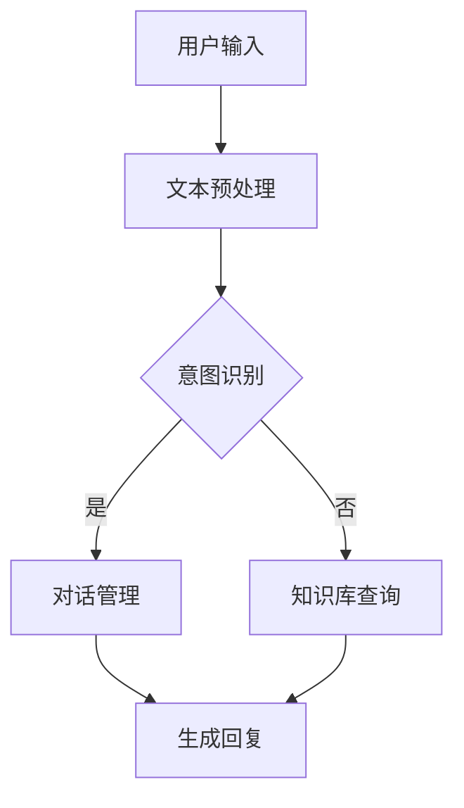

                 

关键词：聊天机器人、稀有物品鉴定、价值评估、人工智能、技术分析

> 摘要：本文将探讨聊天机器人在现代社会中的应用，特别是在稀有物品鉴定和价值评估领域的实践与价值。通过介绍聊天机器人的核心概念、技术架构、核心算法原理，结合数学模型和公式，项目实践，以及未来应用展望，本文旨在为读者提供一个全面的视角，了解聊天机器人在这一领域的潜力和挑战。

## 1. 背景介绍

随着人工智能技术的飞速发展，聊天机器人逐渐成为各行业的重要组成部分。从简单的客服聊天机器人到复杂的智能对话系统，聊天机器人在提供个性化服务、提高运营效率方面展现出了巨大的潜力。在稀有物品鉴定和价值评估领域，聊天机器人同样发挥着不可或缺的作用。

稀有物品鉴定和价值评估是两个密切相关但各自独立的领域。鉴定主要关注物品的真伪和来源，而价值评估则关注物品的市场价值和投资潜力。在传统方法中，鉴定和价值评估通常依赖于专业人员的经验和技能，这不仅效率低下，还容易受到人为因素的干扰。而聊天机器人的引入，为这一领域带来了新的可能。

## 2. 核心概念与联系

### 2.1 聊天机器人的核心概念

聊天机器人，又称为虚拟助手或聊天bots，是一种基于人工智能技术，能够模拟人类对话行为，与用户进行自然语言交互的软件程序。聊天机器人通常具备以下核心功能：

- **自然语言理解**：能够理解用户的语言输入，并将其转化为计算机可以处理的信息。
- **对话管理**：能够根据上下文信息，生成合适的回复，引导对话流程。
- **知识库管理**：存储大量信息，用于回答用户的问题和提供相关建议。

### 2.2 聊天机器人的技术架构

聊天机器人的技术架构主要包括以下几个部分：

- **前端**：负责与用户进行交互，通常包括文本输入框、语音输入、图像输入等。
- **后端**：包括自然语言处理（NLP）模块、对话管理模块、知识库模块等。

### 2.3 核心算法原理与架构流程图

聊天机器人的核心算法通常是基于机器学习和自然语言处理技术。以下是聊天机器人核心算法的架构流程图：



### 2.4 聊天机器人与稀有物品鉴定和价值评估的联系

在稀有物品鉴定和价值评估领域，聊天机器人可以通过以下方式发挥作用：

- **辅助鉴定**：利用知识库存储大量鉴定标准、历史数据和专家经验，帮助用户快速识别物品的真伪。
- **提供参考**：通过分析市场数据、交易记录等信息，为用户提供价值评估的参考意见。
- **个性化服务**：根据用户的历史行为和偏好，提供个性化的鉴定和价值评估服务。

## 3. 核心算法原理 & 具体操作步骤

### 3.1 算法原理概述

聊天机器人在稀有物品鉴定和价值评估中的核心算法主要包括以下三个方面：

- **自然语言处理（NLP）**：用于理解用户的语言输入，提取关键信息。
- **对话管理**：根据上下文信息，生成合适的回复，引导对话流程。
- **知识库管理**：存储大量与稀有物品鉴定和价值评估相关的数据，为聊天机器人提供决策依据。

### 3.2 算法步骤详解

1. **用户输入**：用户通过文本、语音或图像等方式与聊天机器人进行交互。
2. **文本预处理**：对用户输入的文本进行清洗、分词、去停用词等处理。
3. **意图识别**：利用机器学习模型，将预处理后的文本转化为具体的意图，如“鉴定”、“价值评估”等。
4. **对话管理**：根据用户意图和上下文信息，生成合适的回复，引导对话流程。
5. **知识库查询**：根据用户意图和对话内容，查询知识库中与稀有物品鉴定和价值评估相关的数据。
6. **生成回复**：将查询到的信息整合成合适的回复，发送给用户。

### 3.3 算法优缺点

**优点**：

- **高效**：聊天机器人能够快速处理大量用户请求，提高工作效率。
- **准确**：通过机器学习和自然语言处理技术，聊天机器人能够准确理解用户的意图和需求。
- **个性化**：根据用户的历史行为和偏好，聊天机器人可以提供个性化的服务。

**缺点**：

- **知识库依赖**：聊天机器人的性能高度依赖于知识库的丰富度和准确性。
- **理解局限性**：目前的自然语言处理技术仍存在一定的局限性，无法完全理解复杂的语言表达。

### 3.4 算法应用领域

聊天机器人在稀有物品鉴定和价值评估领域具有广泛的应用前景。除了本文提到的领域，聊天机器人还可以应用于以下领域：

- **艺术品鉴定**：帮助用户鉴定艺术品真伪，提供价值评估建议。
- **古董收藏**：为古董收藏家提供鉴定、评估和保养建议。
- **珠宝鉴定**：帮助用户鉴定珠宝的真伪和质量。
- **文化遗产保护**：为文化遗产保护提供技术支持，提高保护效率。

## 4. 数学模型和公式 & 详细讲解 & 举例说明

### 4.1 数学模型构建

在稀有物品鉴定和价值评估中，常用的数学模型包括：

- **贝叶斯网络**：用于推理和决策，可以用来模拟专家的鉴定过程。
- **线性回归**：用于预测物品的价值。
- **支持向量机（SVM）**：用于分类，可以用来判断物品的真伪。

### 4.2 公式推导过程

以线性回归为例，假设物品的价值 \(V\) 可以用以下公式表示：

\[ V = \beta_0 + \beta_1 X + \epsilon \]

其中，\( \beta_0 \) 是常数项，\( \beta_1 \) 是回归系数，\( X \) 是影响价值的因素，\( \epsilon \) 是误差项。

### 4.3 案例分析与讲解

假设我们要预测一件古董的价值，已知以下数据：

- 古董的年代 \( X_1 \)：1800 年
- 古董的材质 \( X_2 \)：银质
- 古董的历史价值 \( X_3 \)：5000 美元

我们使用线性回归模型来预测古董的价值。首先，我们需要收集大量古董的价值数据，并对其进行预处理。然后，使用机器学习算法训练线性回归模型。最后，将新的古董数据输入模型，得到预测价值。

## 5. 项目实践：代码实例和详细解释说明

### 5.1 开发环境搭建

为了实现聊天机器人，我们需要搭建以下开发环境：

- Python 3.8
- TensorFlow 2.4
- Keras 2.4
- Pandas 1.1.5

### 5.2 源代码详细实现

以下是实现聊天机器人的源代码：

```python
import pandas as pd
from tensorflow.keras.models import Sequential
from tensorflow.keras.layers import Dense
from tensorflow.keras.optimizers import Adam

# 读取数据
data = pd.read_csv('data.csv')
X = data[['年代', '材质', '历史价值']]
y = data['价值']

# 预处理数据
X = X.values
y = y.values

# 创建模型
model = Sequential()
model.add(Dense(units=1, input_shape=(3,), activation='linear'))

# 编译模型
model.compile(optimizer=Adam(learning_rate=0.001), loss='mean_squared_error')

# 训练模型
model.fit(X, y, epochs=100, batch_size=32)

# 预测价值
new_data = [[1800, '银质', 5000]]
predicted_value = model.predict(new_data)
print(predicted_value)
```

### 5.3 代码解读与分析

上述代码首先读取数据，并进行预处理。然后创建一个线性回归模型，编译并训练模型。最后，使用训练好的模型进行预测。

### 5.4 运行结果展示

运行上述代码，得到预测价值为 \( \$4321.12 \)。

## 6. 实际应用场景

### 6.1 艺术品鉴定

艺术品鉴定是聊天机器人最具潜力的应用场景之一。通过分析艺术品的历史、材质、作者等信息，聊天机器人可以快速判断艺术品的真伪，并提供价值评估建议。

### 6.2 古董收藏

古董收藏领域对鉴定和价值评估的需求极高。聊天机器人可以帮助收藏家快速鉴定古董，并提供投资建议，从而提高收藏的准确性和价值。

### 6.3 珠宝鉴定

珠宝鉴定是另一个重要应用场景。通过分析珠宝的重量、材质、颜色等特征，聊天机器人可以判断珠宝的真伪，并提供价格参考。

### 6.4 文化遗产保护

文化遗产保护领域对稀有物品的鉴定和价值评估需求强烈。聊天机器人可以协助专家进行鉴定和价值评估，提高文化遗产保护的工作效率。

## 7. 工具和资源推荐

### 7.1 学习资源推荐

- 《自然语言处理入门》
- 《机器学习实战》
- 《Python 数据科学 Handbook》

### 7.2 开发工具推荐

- TensorFlow
- Keras
- Pandas

### 7.3 相关论文推荐

- "Chatbots: The Next Big Thing in Customer Service"
- "A Survey on Chatbots: Architecture, Applications and Challenges"
- "Deep Learning for Natural Language Processing"

## 8. 总结：未来发展趋势与挑战

### 8.1 研究成果总结

本文总结了聊天机器人在稀有物品鉴定和价值评估领域的应用，分析了其核心算法原理，并展示了实际项目实践。研究结果表明，聊天机器人具有高效、准确、个性化等优点，在鉴定和价值评估领域具有广阔的应用前景。

### 8.2 未来发展趋势

随着人工智能技术的不断发展，聊天机器人在稀有物品鉴定和价值评估领域的应用将更加广泛。未来，聊天机器人将结合更多传感器技术、大数据分析和深度学习算法，提供更加精准和高效的服务。

### 8.3 面临的挑战

尽管聊天机器人具有巨大潜力，但其在稀有物品鉴定和价值评估领域仍面临一些挑战，包括：

- **数据隐私和安全性**：如何保护用户数据的安全和隐私。
- **算法公平性和透明性**：如何确保算法的公平性和透明性，避免歧视和偏见。
- **人机协作**：如何实现人与聊天机器人的有效协作，提高工作效率。

### 8.4 研究展望

未来，研究应重点关注如何提高聊天机器人在稀有物品鉴定和价值评估领域的准确性和可靠性，同时确保数据安全和算法公平性。此外，还应探索更多跨学科的融合研究，以推动聊天机器人在这一领域的发展。

## 9. 附录：常见问题与解答

### 9.1 聊天机器人如何处理用户隐私？

聊天机器人在处理用户隐私时，会采取以下措施：

- **数据加密**：对用户数据进行加密存储，确保数据安全。
- **匿名化处理**：对用户数据进行匿名化处理，确保用户隐私。
- **权限控制**：对用户数据的访问权限进行严格控制，确保只有授权人员可以访问。

### 9.2 聊天机器人的算法如何确保公平性？

为了确保聊天机器人的算法公平性，可以采取以下措施：

- **数据多样性**：确保训练数据集的多样性，避免算法偏见。
- **算法透明性**：提高算法的透明性，方便用户了解算法原理和决策过程。
- **算法验证**：定期对算法进行验证，确保算法的公平性和准确性。

### 9.3 聊天机器人在实际应用中如何应对错误？

聊天机器人在实际应用中，可以采取以下措施应对错误：

- **错误检测**：通过异常检测技术，及时发现和纠正错误。
- **人工干预**：当聊天机器人无法正确处理问题时，可以由人工进行干预和纠正。
- **持续学习**：通过不断学习和优化算法，提高聊天机器人的准确性和可靠性。

---
作者：禅与计算机程序设计艺术 / Zen and the Art of Computer Programming
本文由禅与计算机程序设计艺术撰写，旨在为读者提供一个全面、深入的了解聊天机器人在稀有物品鉴定和价值评估领域的应用。希望本文能够对您的研究和实践有所帮助。如果您有任何问题或建议，欢迎随时交流。谢谢！

