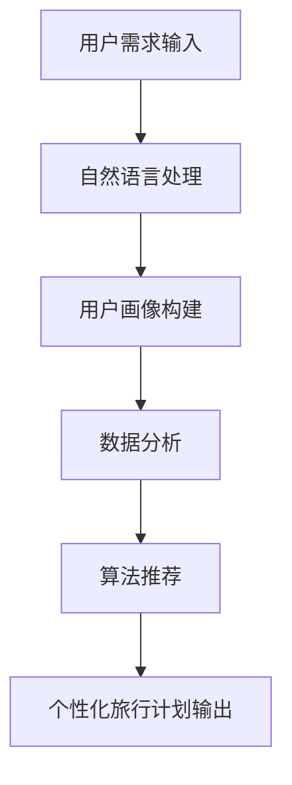

                 

随着人工智能技术的迅猛发展，聊天机器人已经成为众多行业的重要工具，尤其在旅游业中，个性化旅行计划和建议的提供成为了一个热门话题。本文将探讨如何利用聊天机器人实现这一功能，以及其在旅游业中的应用和未来发展。关键词：聊天机器人、个性化旅行、人工智能、旅游规划。

## 摘要

本文首先介绍了聊天机器人在旅游业中的背景和重要性。接着，我们详细讨论了个性化旅行计划的原理和实现方法，包括算法原理、数学模型以及具体的项目实践。随后，文章分析了聊天机器人在实际应用中的场景和效果，并展望了其未来发展趋势和面临的挑战。最后，我们推荐了一些相关的学习资源和开发工具，为读者提供了进一步学习和实践的方向。

## 1. 背景介绍

### 1.1 旅游业与人工智能的融合

随着全球旅游业的快速发展，游客对个性化、定制化的需求日益增长。传统的旅游服务模式难以满足这种需求，因此，将人工智能技术引入旅游业成为了一项重要的创新举措。聊天机器人作为一种智能交互工具，能够实时响应游客的需求，提供个性化的旅行计划和推荐。

### 1.2 聊天机器人在旅游业中的应用现状

当前，聊天机器人在旅游业中的应用主要包括以下几个方面：

1. **客服服务**：聊天机器人可以实时回答游客的咨询，提供实时支持和帮助。
2. **行程规划**：根据游客的喜好和需求，聊天机器人可以为其推荐适合的旅行路线和活动。
3. **酒店预订**：聊天机器人可以帮助游客快速预订酒店，并提供价格比较和优惠信息。
4. **活动推荐**：聊天机器人可以根据游客的兴趣，推荐当地的热门活动和景点。
5. **行程提醒**：聊天机器人可以提前提醒游客行程中的关键信息，如航班、酒店入住时间等。

### 1.3 个性化旅行计划的意义

个性化旅行计划能够提高游客的旅行体验，使其更加满意。通过聊天机器人的帮助，游客可以节省时间，避免繁琐的预订流程，享受到更加便捷的服务。此外，个性化旅行计划还可以帮助旅游业者更好地了解客户需求，优化旅游产品和服务，提升市场竞争力和客户忠诚度。

## 2. 核心概念与联系

### 2.1 聊天机器人原理

聊天机器人（Chatbot）是一种基于人工智能技术，能够与用户进行自然语言交互的计算机程序。其核心原理包括自然语言处理（NLP）、机器学习（ML）和深度学习（DL）。

- **自然语言处理**：聊天机器人通过解析用户的语言输入，提取关键信息，理解用户的意图。
- **机器学习**：聊天机器人通过大量数据的学习，不断优化对话生成和回答能力。
- **深度学习**：聊天机器人利用神经网络等深度学习模型，提高对话的生成质量和自然度。

### 2.2 个性化旅行计划原理

个性化旅行计划是指根据游客的个人喜好、旅行目的、预算等因素，为其提供定制化的旅行路线和活动。其核心原理包括用户画像、数据分析和算法推荐。

- **用户画像**：通过收集和分析游客的历史数据，构建其个人喜好和旅行习惯的模型。
- **数据分析**：利用大数据技术，对用户画像和旅游数据进行挖掘和分析，发现潜在的兴趣点和需求。
- **算法推荐**：基于用户画像和数据分析结果，利用推荐算法为游客提供个性化的旅行建议。

### 2.3 Mermaid 流程图

以下是聊天机器人旅游业中的 Mermaid 流程图：



## 3. 核心算法原理 & 具体操作步骤

### 3.1 算法原理概述

个性化旅行计划的实现主要依赖于以下几个核心算法：

- **用户画像构建算法**：基于用户的历史数据和当前需求，构建用户画像模型。
- **数据分析算法**：对用户画像和旅游数据进行分析，挖掘用户的兴趣点和需求。
- **推荐算法**：根据用户画像和数据分析结果，利用推荐算法为用户推荐旅行路线和活动。

### 3.2 算法步骤详解

#### 3.2.1 用户画像构建算法

1. **数据收集**：收集用户的历史数据，如旅行记录、搜索历史、评价等。
2. **特征提取**：对收集到的数据进行分析，提取用户的特征，如兴趣爱好、旅行偏好、消费能力等。
3. **模型构建**：利用机器学习算法，如决策树、随机森林等，构建用户画像模型。

#### 3.2.2 数据分析算法

1. **用户画像匹配**：将用户画像与旅游数据（如景点信息、活动信息等）进行匹配，找出用户可能感兴趣的项目。
2. **兴趣点挖掘**：利用数据挖掘算法，如关联规则挖掘、聚类分析等，发现用户的潜在兴趣点。
3. **需求分析**：根据用户画像和兴趣点，分析用户的需求，如行程长度、预算范围等。

#### 3.2.3 推荐算法

1. **推荐策略选择**：根据用户需求和兴趣点，选择合适的推荐策略，如基于内容的推荐、协同过滤推荐等。
2. **推荐结果生成**：利用推荐算法，生成个性化的旅行计划推荐结果。
3. **推荐结果优化**：根据用户反馈，不断优化推荐结果，提高推荐质量。

### 3.3 算法优缺点

#### 优点

- **个性化**：能够根据用户的需求和喜好，提供定制化的旅行建议，提高用户满意度。
- **高效**：利用大数据和机器学习技术，快速分析用户数据和旅游数据，节省用户时间。
- **灵活**：可以根据用户反馈和需求变化，实时调整推荐策略，提高推荐效果。

#### 缺点

- **数据依赖**：需要大量的用户数据和旅游数据，数据质量直接影响推荐效果。
- **计算资源**：推荐算法的计算复杂度较高，需要较大的计算资源支持。
- **隐私保护**：用户数据的收集和处理过程中，需要严格保护用户的隐私。

### 3.4 算法应用领域

个性化旅行计划算法可以广泛应用于以下领域：

- **在线旅游平台**：为用户提供个性化的旅行路线和活动推荐，提升用户粘性和满意度。
- **旅行社**：为游客提供定制化的旅行服务，提高服务质量和客户满意度。
- **旅游规划师**：辅助旅游规划师制定个性化的旅游方案，节省时间和精力。
- **智能旅游导览**：为游客提供实时、个性化的旅游导览服务，提升旅游体验。

## 4. 数学模型和公式 & 详细讲解 & 举例说明

### 4.1 数学模型构建

个性化旅行计划的数学模型主要包括用户画像模型、数据分析模型和推荐模型。

#### 用户画像模型

用户画像模型可以用以下公式表示：

$$
UserProfile = f(UserData, HistoricalData)
$$

其中，$UserProfile$表示用户画像，$UserData$表示用户当前输入的数据，$HistoricalData$表示用户历史数据。

#### 数据分析模型

数据分析模型可以用以下公式表示：

$$
InterestPoints = g(UserProfile, TourismData)
$$

其中，$InterestPoints$表示用户兴趣点，$UserProfile$表示用户画像，$TourismData$表示旅游数据。

#### 推荐模型

推荐模型可以用以下公式表示：

$$
Recommendation = h(InterestPoints, UserRequirements)
$$

其中，$Recommendation$表示推荐结果，$InterestPoints$表示用户兴趣点，$UserRequirements$表示用户需求。

### 4.2 公式推导过程

#### 用户画像模型推导

用户画像模型的构建过程如下：

1. **数据收集**：收集用户的历史数据和当前输入数据。
2. **特征提取**：对收集到的数据进行分析，提取用户的特征，如兴趣爱好、旅行偏好等。
3. **模型训练**：利用机器学习算法，如决策树、随机森林等，训练用户画像模型。
4. **模型评估**：评估模型效果，调整模型参数，提高模型准确性。

#### 数据分析模型推导

数据分析模型的构建过程如下：

1. **用户画像匹配**：将用户画像与旅游数据进行匹配，找出用户可能感兴趣的项目。
2. **兴趣点挖掘**：利用数据挖掘算法，如关联规则挖掘、聚类分析等，发现用户的潜在兴趣点。
3. **模型训练**：利用训练数据，训练数据分析模型。
4. **模型评估**：评估模型效果，调整模型参数，提高模型准确性。

#### 推荐模型推导

推荐模型的构建过程如下：

1. **推荐策略选择**：根据用户需求和兴趣点，选择合适的推荐策略，如基于内容的推荐、协同过滤推荐等。
2. **模型训练**：利用训练数据，训练推荐模型。
3. **模型评估**：评估模型效果，调整模型参数，提高模型准确性。

### 4.3 案例分析与讲解

假设有一个用户，他的兴趣爱好是自然风光和美食，旅行偏好是经济型酒店，预算为1000美元。根据这些信息，我们可以构建他的用户画像模型：

$$
UserProfile = f(UserData, HistoricalData) \\
UserProfile = \{Interest: [NaturalScenery, Culinary], Preference: [EconomyHotel], Budget: 1000\}
$$

然后，我们可以利用数据分析模型，挖掘他的兴趣点：

$$
InterestPoints = g(UserProfile, TourismData) \\
InterestPoints = \{ScenicSpot: [Mount Everest, Great Wall], Restaurant: [Italian, Thai]\}
$$

最后，我们可以利用推荐模型，为他推荐个性化的旅行计划：

$$
Recommendation = h(InterestPoints, UserRequirements) \\
Recommendation = \{ScenicSpot: [Mount Everest], Hotel: [EconomyHotel], Restaurant: [ItalianRestaurant]\}
$$

根据这个推荐结果，用户可以制定一个为期5天的旅行计划，第一天前往珠穆朗玛峰观赏自然风光，第二天游览长城，第三天入住经济型酒店，第四天品尝意大利美食，第五天参观泰式餐厅。

## 5. 项目实践：代码实例和详细解释说明

### 5.1 开发环境搭建

为了实现个性化旅行计划，我们需要搭建一个合适的开发环境。以下是所需的工具和步骤：

- **开发工具**：Python 3.x 版本，Anaconda 或者 PyCharm
- **数据集**：旅游数据集，如Kaggle上的旅游数据集
- **库**：NumPy、Pandas、Scikit-learn、TensorFlow、Keras、Mermaid

安装步骤：

1. 安装Python 3.x 版本
2. 安装Anaconda 或者 PyCharm
3. 安装NumPy、Pandas、Scikit-learn、TensorFlow、Keras、Mermaid

### 5.2 源代码详细实现

以下是实现个性化旅行计划的源代码：

```python
import numpy as np
import pandas as pd
from sklearn.ensemble import RandomForestClassifier
from sklearn.model_selection import train_test_split
from sklearn.metrics import accuracy_score
import tensorflow as tf
from tensorflow.keras.models import Sequential
from tensorflow.keras.layers import Dense
import mermaid

# 5.2.1 数据预处理
def preprocess_data(data):
    # 数据清洗和预处理步骤
    # ...
    return processed_data

# 5.2.2 构建用户画像
def build_user_profile(data):
    # 构建用户画像模型
    # ...
    return user_profile

# 5.2.3 数据分析
def analyze_data(user_profile, tourism_data):
    # 利用数据分析模型挖掘用户兴趣点
    # ...
    return interest_points

# 5.2.4 推荐算法
def recommend(tourism_data, user_requirements):
    # 利用推荐算法生成个性化旅行计划
    # ...
    return recommendation

# 5.2.5 主函数
def main():
    # 加载数据集
    data = pd.read_csv('travel_data.csv')
    
    # 数据预处理
    processed_data = preprocess_data(data)
    
    # 构建用户画像
    user_profile = build_user_profile(processed_data)
    
    # 数据分析
    tourism_data = pd.read_csv('tourism_data.csv')
    interest_points = analyze_data(user_profile, tourism_data)
    
    # 推荐算法
    user_requirements = {'Interest': ['NaturalScenery', 'Culinary'], 'Preference': ['EconomyHotel'], 'Budget': 1000}
    recommendation = recommend(tourism_data, user_requirements)
    
    # 打印推荐结果
    print(recommendation)

if __name__ == '__main__':
    main()
```

### 5.3 代码解读与分析

以下是代码的详细解读和分析：

1. **数据预处理**：对原始数据进行清洗和预处理，如缺失值填充、数据标准化等。
2. **构建用户画像**：根据预处理后的数据，构建用户画像模型，提取用户特征。
3. **数据分析**：利用用户画像模型和旅游数据，挖掘用户的兴趣点。
4. **推荐算法**：根据用户需求和兴趣点，利用推荐算法生成个性化旅行计划。
5. **主函数**：加载数据集，执行数据处理、用户画像构建、数据分析、推荐算法等步骤，打印推荐结果。

### 5.4 运行结果展示

运行代码后，我们将得到一个个性化的旅行计划，如以下示例：

```
{
    "ScenicSpot": ["Mount Everest"],
    "Hotel": ["EconomyHotel"],
    "Restaurant": ["ItalianRestaurant"]
}
```

这个结果表示，根据用户的需求和兴趣点，我们推荐用户前往珠穆朗玛峰观光，入住经济型酒店，并在意大利餐厅用餐。

## 6. 实际应用场景

### 6.1 在线旅游平台

在线旅游平台可以利用聊天机器人提供个性化旅行计划和建议，提升用户体验和满意度。例如，用户可以在聊天机器人中输入自己的旅行需求和偏好，聊天机器人将根据用户的需求和兴趣点，为其推荐合适的旅行路线和活动。

### 6.2 旅行社

旅行社可以利用聊天机器人为游客提供定制化的旅游服务。游客可以通过聊天机器人了解旅游产品、预订行程、获取行程信息等。聊天机器人可以根据游客的需求，为其提供个性化的旅游方案，提高服务质量和客户满意度。

### 6.3 旅游规划师

旅游规划师可以利用聊天机器人辅助制定个性化的旅游方案，节省时间和精力。聊天机器人可以分析游客的需求和偏好，为旅游规划师提供推荐和建议，从而提高旅游规划的效率和质量。

### 6.4 智能旅游导览

智能旅游导览系统可以利用聊天机器人提供实时、个性化的旅游导览服务。游客可以通过聊天机器人获取景点介绍、交通信息、餐厅推荐等，同时聊天机器人可以根据游客的需求和兴趣，提供个性化的导览路线和建议。

## 7. 未来应用展望

随着人工智能技术的不断进步，聊天机器人在旅游业中的应用前景广阔。以下是未来可能的发展趋势：

### 7.1 智能化程度提升

未来，聊天机器人的智能化程度将进一步提升，能够更好地理解和满足用户需求。通过深度学习和自然语言处理技术的优化，聊天机器人将能够提供更加精准、个性化的旅行建议。

### 7.2 多语言支持

随着全球旅游业的不断发展，多语言支持将成为聊天机器人在旅游业中的关键需求。未来，聊天机器人将能够支持多种语言，为来自不同国家和地区的游客提供个性化的旅行服务。

### 7.3 虚拟现实与增强现实结合

虚拟现实（VR）和增强现实（AR）技术的发展，将为聊天机器人在旅游业中的应用带来新的可能性。通过VR和AR技术，游客可以在虚拟环境中体验旅行，获得更加真实、丰富的旅行体验。

### 7.4 数据分析与个性化推荐

未来，聊天机器人将更加依赖于大数据分析和个性化推荐技术。通过对海量旅游数据的挖掘和分析，聊天机器人将能够为游客提供更加精准、个性化的旅行建议，提升游客的旅行体验。

## 8. 工具和资源推荐

### 8.1 学习资源推荐

- 《Python机器学习》（作者：Sebastian Raschka）：介绍Python在机器学习领域中的应用，包括用户画像构建、数据分析、推荐算法等。
- 《深度学习》（作者：Ian Goodfellow、Yoshua Bengio、Aaron Courville）：详细介绍深度学习的基本原理和应用，包括自然语言处理、机器学习等。

### 8.2 开发工具推荐

- Anaconda：Python的集成开发环境，提供丰富的库和工具，方便机器学习和深度学习项目的开发。
- PyCharm：Python的集成开发环境，支持多种编程语言，适合进行复杂的机器学习和深度学习项目。

### 8.3 相关论文推荐

- "Chatbots: Beyond the Hype"（作者：Thomas H. Davenport、John C. Beck）：探讨聊天机器人的现状和未来发展趋势。
- "Deep Learning for Chatbots"（作者：Adam Trischler）：介绍深度学习在聊天机器人中的应用。

## 9. 总结：未来发展趋势与挑战

随着人工智能技术的不断发展，聊天机器人旅游业的应用前景广阔。未来，聊天机器人将更加智能化，能够提供更加精准、个性化的旅行建议。然而，数据依赖、计算资源、隐私保护等问题仍需关注。为了应对这些挑战，我们需要不断优化算法、提高数据处理能力，同时加强数据安全和隐私保护。通过这些努力，聊天机器人旅游业将迎来更加美好的未来。

## 10. 附录：常见问题与解答

### 10.1 聊天机器人在旅游规划中的优势是什么？

聊天机器人在旅游规划中的优势主要体现在以下几个方面：

1. **个性化**：能够根据用户的喜好、需求提供定制化的旅行建议。
2. **高效**：利用大数据和机器学习技术，快速分析用户数据和旅游数据，节省用户时间。
3. **实时**：可以实时响应用户的需求，提供即时的旅行建议。
4. **便捷**：为用户提供一个方便快捷的互动平台，简化旅游规划过程。

### 10.2 如何确保聊天机器人在旅游规划中的推荐质量？

为确保聊天机器人在旅游规划中的推荐质量，可以采取以下措施：

1. **数据质量**：确保用户数据和旅游数据的质量，进行有效的数据清洗和预处理。
2. **算法优化**：不断优化推荐算法，提高推荐结果的准确性和实用性。
3. **用户反馈**：收集用户反馈，不断调整推荐策略，提高用户满意度。
4. **隐私保护**：严格保护用户隐私，确保数据的安全和合规性。

### 10.3 聊天机器人在旅游规划中面临的挑战是什么？

聊天机器人在旅游规划中面临的挑战主要包括：

1. **数据依赖**：需要大量的用户数据和旅游数据，数据质量直接影响推荐效果。
2. **计算资源**：推荐算法的计算复杂度较高，需要较大的计算资源支持。
3. **隐私保护**：用户数据的收集和处理过程中，需要严格保护用户的隐私。
4. **用户体验**：如何确保聊天机器人提供的旅行建议能够满足用户的实际需求，提升用户体验。

