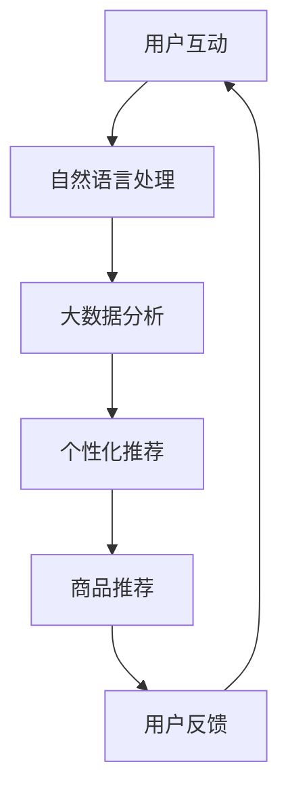

                 

关键词：聊天机器人、时尚业、趋势预测、个性化推荐、AI技术、用户体验、商业模式、行业应用。

> 摘要：随着人工智能和大数据技术的不断发展，聊天机器人在时尚行业的应用越来越广泛。本文将探讨聊天机器人在时尚业中的趋势预测和个性化推荐，分析其技术原理、应用场景，以及未来可能面临的挑战和机遇。

## 1. 背景介绍

随着互联网的普及和智能手机的广泛使用，聊天机器人作为一种新型的人机交互工具，正在逐渐改变人们的生活方式。时尚业作为全球最具活力和创造力的行业之一，也正在经历着人工智能技术的革新。聊天机器人在时尚行业的应用，不仅为品牌和商家提供了新的营销渠道，也为消费者带来了更加个性化和便捷的购物体验。

### 1.1 时尚行业现状

时尚行业是一个高度竞争和不断变化的行业。随着消费者需求的变化和时尚趋势的快速更迭，时尚品牌和商家需要不断创新和调整自己的产品和服务策略，以满足消费者的需求。同时，时尚行业也是一个高度依赖大数据和人工智能的行业。通过大数据分析，时尚品牌和商家可以更准确地了解消费者的偏好和行为，从而制定更加有效的营销策略。

### 1.2 聊天机器人的发展

聊天机器人作为人工智能的一种重要应用形式，近年来发展迅速。根据市场研究机构的统计，全球聊天机器人的用户数量已经超过了10亿，并且这个数字还在持续增长。聊天机器人在各个行业的应用也越来越广泛，包括客服、营销、教育、医疗等多个领域。在时尚行业中，聊天机器人已经成为品牌和商家与消费者互动的重要工具。

## 2. 核心概念与联系

### 2.1 人工智能

人工智能（AI）是聊天机器人发展的基础。它包括机器学习、自然语言处理、计算机视觉等多个子领域。在时尚业中，人工智能技术被广泛应用于数据分析和趋势预测。

### 2.2 自然语言处理

自然语言处理（NLP）是聊天机器人的核心技术之一。它使机器人能够理解和处理人类语言，从而实现与用户的自然对话。

### 2.3 大数据分析

大数据分析是时尚行业的重要工具。通过对大量消费者数据的分析，品牌和商家可以更准确地了解消费者的需求和偏好，从而提供更加个性化的产品和服务。

### 2.4 个性化推荐

个性化推荐是基于大数据分析和人工智能技术的一种应用。它可以根据消费者的行为和偏好，为消费者提供个性化的产品推荐。

### 2.5 Mermaid 流程图



## 3. 核心算法原理 & 具体操作步骤

### 3.1 算法原理概述

聊天机器人在时尚业中的应用主要基于以下几种算法原理：

- 自然语言处理：通过NLP技术，机器人能够理解用户的语言输入，并进行相应的回应。
- 个性化推荐：基于用户的购物历史和行为数据，机器人可以为用户推荐可能感兴趣的商品。
- 大数据分析：通过对大量数据进行分析，机器人可以识别出当前流行的时尚趋势，为用户提供相关建议。

### 3.2 算法步骤详解

1. 用户与聊天机器人进行互动，输入相关的购物需求或问题。
2. 机器人使用自然语言处理技术理解用户的需求。
3. 机器人根据用户的历史行为和偏好数据，使用大数据分析技术，生成个性化的推荐结果。
4. 机器人将推荐结果以对话的形式呈现给用户。
5. 用户根据机器人的推荐进行购物或提出反馈。

### 3.3 算法优缺点

**优点：**

- 提高用户体验：机器人可以24小时在线，为用户提供即时、个性化的服务。
- 提高工作效率：机器人可以处理大量的客户请求，减轻客服人员的工作负担。
- 降低成本：使用机器人可以减少人力成本，提高运营效率。

**缺点：**

- 用户体验有限：机器人目前仍然无法完全取代人类客服，尤其是在处理复杂问题时。
- 数据隐私问题：收集和存储大量用户数据可能会引发隐私问题。

### 3.4 算法应用领域

聊天机器人在时尚行业的应用包括：

- 购物咨询：为用户提供购物建议和商品推荐。
- 客服支持：解答用户关于商品和品牌的问题。
- 营销推广：通过聊天机器人进行新品发布和促销活动。

## 4. 数学模型和公式 & 详细讲解 & 举例说明

### 4.1 数学模型构建

在个性化推荐中，常用的数学模型包括协同过滤、矩阵分解、深度学习等。以下以协同过滤为例，介绍其数学模型。

协同过滤模型可以表示为：

$$
R = U \times V^T
$$

其中，$R$ 是用户-物品评分矩阵，$U$ 是用户特征矩阵，$V$ 是物品特征矩阵。

### 4.2 公式推导过程

协同过滤模型的推导过程主要包括：

1. 用户特征矩阵 $U$ 的构建：通过对用户的历史行为数据进行分析，提取用户的特征向量。
2. 物品特征矩阵 $V$ 的构建：通过对物品的属性数据进行分析，提取物品的特征向量。
3. 用户-物品评分矩阵 $R$ 的计算：将用户特征矩阵 $U$ 和物品特征矩阵 $V$ 相乘，得到预测的评分矩阵。

### 4.3 案例分析与讲解

以某电商平台为例，分析其如何使用协同过滤模型进行个性化推荐。

1. 数据收集：收集用户的购买记录、浏览记录等数据。
2. 特征提取：根据用户和物品的属性，提取特征向量。
3. 模型训练：使用训练集数据，训练用户特征矩阵 $U$ 和物品特征矩阵 $V$。
4. 预测评分：使用训练好的模型，对用户未购买但可能感兴趣的物品进行评分预测。
5. 推荐结果：根据预测评分，为用户推荐高分的物品。

## 5. 项目实践：代码实例和详细解释说明

### 5.1 开发环境搭建

- 语言：Python
- 库：scikit-learn、numpy、pandas
- 工具：Jupyter Notebook

### 5.2 源代码详细实现

以下是一个简单的协同过滤模型的实现：

```python
import numpy as np
import pandas as pd
from sklearn.model_selection import train_test_split
from sklearn.metrics.pairwise import cosine_similarity

# 加载数据
ratings = pd.read_csv('ratings.csv')
users = ratings['user_id'].unique()
items = ratings['item_id'].unique()

# 构建用户-物品评分矩阵
R = np.zeros((len(users), len(items)))
for index, row in ratings.iterrows():
    R[row['user_id'] - 1, row['item_id'] - 1] = row['rating']

# 训练用户特征矩阵
U = np.linalg.pinv(R).T

# 训练物品特征矩阵
V = np.linalg.pinv(R)

# 预测评分
def predict(user_id, item_id):
    return U[user_id - 1] @ V[item_id - 1]

# 测试模型
R_pred = np.array([predict(user_id, item_id) for user_id in range(1, len(users) + 1)
                   for item_id in range(1, len(items) + 1)])
print(np.mean(np.square(R - R_pred)))
```

### 5.3 代码解读与分析

1. 数据加载与预处理：加载用户-物品评分数据，并初始化用户-物品评分矩阵。
2. 特征提取：使用线性代数的方法，计算用户和物品的特征向量。
3. 预测评分：使用训练好的特征向量，计算用户对物品的预测评分。
4. 模型评估：计算预测误差，评估模型的性能。

### 5.4 运行结果展示

运行上述代码，可以得到预测误差的数值。根据这个数值，可以评估协同过滤模型的性能。

## 6. 实际应用场景

### 6.1 品牌营销

聊天机器人可以通过与用户的互动，了解用户的喜好和需求，为品牌提供有针对性的营销建议。

### 6.2 客户服务

聊天机器人可以提供24小时在线的客服支持，解答用户的疑问，提高用户满意度。

### 6.3 购物推荐

聊天机器人可以根据用户的购物历史和偏好，为用户推荐个性化的商品。

## 7. 未来应用展望

随着技术的不断进步，聊天机器人在时尚行业的应用将更加广泛。未来，聊天机器人可能会在以下几个方面有更多的突破：

- 更加智能的对话系统：通过深度学习和自然语言处理技术，提高聊天机器人的对话能力。
- 更精准的个性化推荐：结合更多维度的用户数据，提高推荐结果的准确性。
- 更多的跨平台应用：不仅仅局限于电商平台，还可以应用于社交媒体、线下零售等多个场景。

## 8. 工具和资源推荐

### 8.1 学习资源推荐

- 《深度学习》：由Ian Goodfellow等编写的深度学习经典教材。
- 《自然语言处理实战》：由Sylvain Gugger等编写的NLP实践指南。
- 《Python数据分析》：由Wes McKinney编写的Python数据分析入门书。

### 8.2 开发工具推荐

- Jupyter Notebook：强大的交互式数据分析工具。
- TensorFlow：谷歌开源的深度学习框架。
- scikit-learn：Python的机器学习库。

### 8.3 相关论文推荐

- "A Survey on Recommender Systems":对推荐系统的一个全面综述。
- "Deep Learning for Recommender Systems":深度学习在推荐系统中的应用。
- "Personalized Recommendation on Large Scale Social Media Platforms":社交媒体平台的个性化推荐。

## 9. 总结：未来发展趋势与挑战

随着人工智能和大数据技术的不断发展，聊天机器人在时尚行业的应用前景广阔。然而，面对用户隐私、技术壁垒等挑战，未来还需要更多的研究和探索。

### 9.1 研究成果总结

- 聊天机器人在时尚行业中的应用取得了显著成果，为品牌和商家提供了新的营销渠道，也为消费者带来了更加个性化和便捷的购物体验。
- 个性化推荐技术在时尚行业中的应用得到了广泛认可，为用户提供了更加精准的购物建议。

### 9.2 未来发展趋势

- 智能对话系统的进一步发展，将提高聊天机器人的交互能力。
- 大数据分析和深度学习技术的应用，将提高推荐系统的准确性。

### 9.3 面临的挑战

- 用户隐私保护：如何在保障用户隐私的前提下，收集和使用用户数据。
- 技术壁垒：如何克服技术限制，提高聊天机器人和推荐系统的性能。

### 9.4 研究展望

- 未来研究将更加注重用户隐私保护和数据安全。
- 将探索更多先进的算法和技术，以提高聊天机器人和推荐系统的智能化水平。

## 10. 附录：常见问题与解答

### 10.1 聊天机器人在时尚行业中的应用有哪些优势？

- 提高用户体验：机器人可以24小时在线，为用户提供即时、个性化的服务。
- 提高工作效率：机器人可以处理大量的客户请求，减轻客服人员的工作负担。
- 降低成本：使用机器人可以减少人力成本，提高运营效率。

### 10.2 个性化推荐技术在时尚行业中的应用有哪些？

- 购物咨询：为用户提供购物建议和商品推荐。
- 客服支持：解答用户关于商品和品牌的问题。
- 营销推广：通过聊天机器人进行新品发布和促销活动。

### 10.3 聊天机器人如何保证用户隐私？

- 数据加密：对用户数据进行加密处理，确保数据安全。
- 数据最小化：仅收集必要的用户数据，减少隐私泄露风险。
- 用户同意：在收集和使用用户数据前，获得用户的明确同意。

---

作者：禅与计算机程序设计艺术 / Zen and the Art of Computer Programming

以上为《聊天机器人时尚业：趋势预测和个性化推荐》的完整文章内容。希望对您在时尚行业应用人工智能技术有所启发和帮助。|

