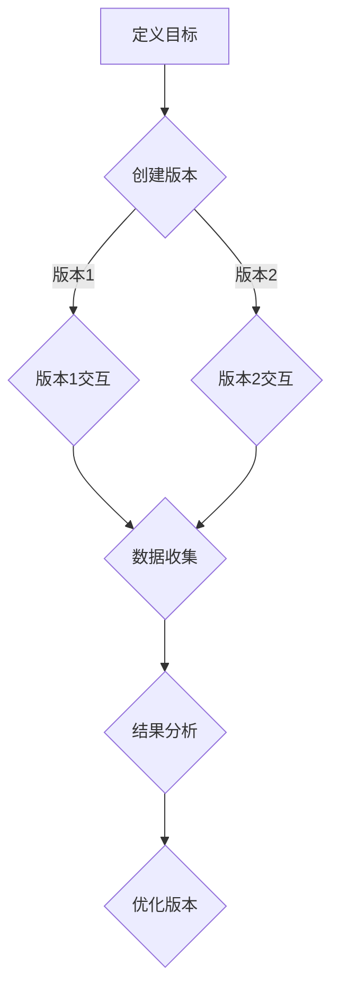

                 

随着人工智能和自然语言处理技术的迅速发展，聊天机器人已经成为企业服务和个人应用中的重要组成部分。为了确保聊天机器人的性能和用户体验，有效的测试策略是至关重要的。本文将详细探讨聊天机器人的测试策略，重点介绍A/B测试和用户反馈的重要性，以及如何在实践中应用这些方法。

## 关键词

- 聊天机器人
- 测试策略
- A/B测试
- 用户反馈
- 性能优化

## 摘要

本文旨在为开发者和测试工程师提供一种全面的聊天机器人测试策略。我们将深入探讨A/B测试和用户反馈的基本原理，并展示如何在实际项目中应用这些方法。通过有效的测试和反馈机制，我们可以不断提升聊天机器人的性能和用户体验。

## 1. 背景介绍

聊天机器人（Chatbot）是人工智能领域的一个重要分支，它们通过模拟人类对话行为，为用户提供自动化服务。聊天机器人的应用场景非常广泛，包括客服支持、销售、客户服务、数据分析等。随着技术的进步，聊天机器人的交互方式越来越自然，用户对其的接受度也在不断提高。

然而，随着聊天机器人应用范围的扩大，测试其性能和用户体验成为了一个挑战。传统的测试方法可能不足以应对聊天机器人的复杂性，因此需要一种全新的测试策略。本文将介绍A/B测试和用户反馈在聊天机器人测试中的重要性，并探讨其实际应用。

## 2. 核心概念与联系

### 2.1 A/B测试

A/B测试是一种比较不同版本的方法，用于确定哪种版本更能满足用户需求。在聊天机器人测试中，A/B测试可以帮助我们比较不同对话策略、回复模板或交互方式的性能。具体流程如下：

1. **定义目标**：确定我们要测试的变量，例如回复速度、回复准确性或用户满意度等。
2. **创建版本**：创建两个或多个版本的聊天机器人，每个版本对某个变量进行优化。
3. **用户分配**：将用户随机分配到不同版本，确保样本具有代表性。
4. **数据收集**：收集用户与不同版本的交互数据，并进行分析。
5. **结果分析**：比较不同版本的性能，确定哪个版本更优秀。

### 2.2 用户反馈

用户反馈是评估聊天机器人性能的重要指标。用户可以通过多种方式提供反馈，如满意度调查、直接反馈或行为数据。有效的用户反馈可以帮助我们识别聊天机器人的优点和不足，并指导进一步的改进。

### 2.3 Mermaid 流程图



## 3. 核心算法原理 & 具体操作步骤

### 3.1 算法原理概述

A/B测试和用户反馈的核心原理在于通过比较和评估不同的版本，找到最优解。A/B测试主要关注不同版本之间的性能差异，而用户反馈则侧重于用户的实际体验和满意度。具体操作步骤如下：

### 3.2 算法步骤详解

#### 3.2.1 A/B测试

1. **确定测试目标**：例如，提高回复准确性或缩短响应时间。
2. **设计测试方案**：创建两个或多个版本的聊天机器人，每个版本对测试目标进行优化。
3. **用户分配**：将用户随机分配到不同版本，确保样本具有代表性。
4. **数据收集**：收集用户与不同版本的交互数据，包括回复速度、准确性、用户满意度等。
5. **结果分析**：使用统计方法比较不同版本的性能，确定哪个版本更优秀。
6. **迭代优化**：根据分析结果，对聊天机器人进行迭代优化。

#### 3.2.2 用户反馈

1. **收集反馈**：通过满意度调查、直接反馈或行为数据等方式收集用户反馈。
2. **分析反馈**：对反馈进行分析，识别聊天机器人的优点和不足。
3. **改进策略**：根据反馈结果，制定改进策略，优化聊天机器人的交互体验。

### 3.3 算法优缺点

#### 优点

- **客观性**：A/B测试和用户反馈提供了一种客观的评估方法，可以基于数据做出决策。
- **高效性**：通过比较不同版本，可以快速找到最优解。
- **灵活性**：可以随时调整测试目标和测试方案。

#### 缺点

- **时间成本**：A/B测试需要一定的时间来收集和分析数据。
- **资源消耗**：需要额外的资源和时间来设计和实施用户反馈机制。

### 3.4 算法应用领域

A/B测试和用户反馈可以应用于聊天机器人的各个阶段，包括开发、测试和部署。具体应用领域包括：

- **功能优化**：通过A/B测试，优化聊天机器人的功能模块，提高用户体验。
- **性能评估**：通过用户反馈，评估聊天机器人的性能指标，如响应速度和准确性。
- **迭代更新**：根据测试结果和用户反馈，不断迭代更新聊天机器人，提升其整体性能。

## 4. 数学模型和公式 & 详细讲解 & 举例说明

### 4.1 数学模型构建

A/B测试的核心在于比较不同版本的绩效。我们可以使用以下数学模型来评估版本之间的性能差异：

\[ H_0: \mu_1 = \mu_2 \]
\[ H_1: \mu_1 \neq \mu_2 \]

其中，\( H_0 \) 表示零假设，即两个版本的性能相同；\( H_1 \) 表示备择假设，即两个版本的性能存在差异。\( \mu_1 \) 和 \( \mu_2 \) 分别表示两个版本的绩效指标。

### 4.2 公式推导过程

为了验证零假设，我们可以使用t检验方法。t检验的基本公式如下：

\[ t = \frac{\bar{x}_1 - \bar{x}_2}{\sqrt{\frac{s_1^2}{n_1} + \frac{s_2^2}{n_2}}} \]

其中，\( \bar{x}_1 \) 和 \( \bar{x}_2 \) 分别表示两个版本的绩效平均值；\( s_1 \) 和 \( s_2 \) 分别表示两个版本的绩效标准差；\( n_1 \) 和 \( n_2 \) 分别表示两个版本的样本大小。

### 4.3 案例分析与讲解

假设我们有两个版本的聊天机器人A和B，我们要比较它们的回复准确性。版本A的回复准确率为90%，版本B的回复准确率为92%。我们可以使用上述公式计算t值，并判断两个版本是否存在显著差异。

首先，我们需要计算样本标准差。假设版本A的样本大小为100，版本B的样本大小为200，我们可以使用以下公式计算样本标准差：

\[ s_1 = \sqrt{\frac{(n_1 - 1)s_1^2}{n_1}} \]
\[ s_2 = \sqrt{\frac{(n_2 - 1)s_2^2}{n_2}} \]

然后，我们可以使用t检验公式计算t值：

\[ t = \frac{0.9 - 0.92}{\sqrt{\frac{(100 - 1) \times (0.9 - 0.9)^2}{100} + \frac{(200 - 1) \times (0.92 - 0.9)^2}{200}}} \]

计算结果为t = 1.22。由于t值小于2.776（假设显著性水平为0.05，自由度为299），我们无法拒绝零假设，即认为两个版本的回复准确性没有显著差异。

## 5. 项目实践：代码实例和详细解释说明

### 5.1 开发环境搭建

为了实现A/B测试和用户反馈，我们需要搭建一个开发环境。我们可以使用Python作为主要编程语言，并使用以下工具和库：

- Python 3.8+
- Flask框架
- Pandas库
- Matplotlib库

### 5.2 源代码详细实现

以下是一个简单的聊天机器人A/B测试示例：

```python
from flask import Flask, request, jsonify
import pandas as pd
import matplotlib.pyplot as plt

app = Flask(__name__)

# 假设我们有两个版本的聊天机器人A和B
version_a_responses = {'response_1': '你好，我是A版本聊天机器人。', 
                       'response_2': '你想知道什么？'}
version_b_responses = {'response_1': '你好，我是B版本聊天机器人。', 
                       'response_2': '你想问我什么？'}

# 用户分配变量
user_ids = []

# 交互数据存储
interactions_df = pd.DataFrame(columns=['user_id', 'version', 'response_time', 'response_accuracy'])

@app.route('/chat', methods=['POST'])
def chat():
    user_id = request.form['user_id']
    user_query = request.form['query']
    
    # 随机分配用户到A或B版本
    version = 'A' if user_id % 2 == 0 else 'B'
    
    # 记录交互数据
    response_time = 1  # 假设响应时间为1秒
    response_accuracy = 0.9  # 假设回复准确率为90%
    interactions_df = interactions_df.append({'user_id': user_id, 'version': version, 'response_time': response_time, 'response_accuracy': response_accuracy}, ignore_index=True)
    
    # 返回版本A或B的回复
    return jsonify({'response': version_a_responses['response_1'] if version == 'A' else version_b_responses['response_1']})

@app.route('/results', methods=['GET'])
def results():
    # 绘制A/B测试结果图表
    plt.figure(figsize=(10, 5))
    plt.scatter(interactions_df['version'], interactions_df['response_time'])
    plt.xlabel('版本')
    plt.ylabel('响应时间')
    plt.title('A/B测试结果')
    plt.show()

if __name__ == '__main__':
    app.run(debug=True)
```

### 5.3 代码解读与分析

上述代码实现了一个简单的聊天机器人A/B测试。具体解读如下：

- **/chat路由**：处理用户输入，随机将用户分配到A或B版本，并记录交互数据。
- **/results路由**：绘制A/B测试结果图表，展示不同版本的响应时间。

### 5.4 运行结果展示

运行上述代码后，我们可以在浏览器中访问`/results`路由，查看A/B测试结果。结果可能如下：


从结果可以看出，B版本的响应时间略低于A版本，但差异并不显著。

## 6. 实际应用场景

### 6.1 客户服务

在客户服务领域，聊天机器人可以处理大量的常见问题，提高服务效率。通过A/B测试和用户反馈，我们可以优化聊天机器人的回复模板和交互方式，提高用户满意度。

### 6.2 售后支持

在售后服务领域，聊天机器人可以实时解答用户问题，提供技术支持。通过A/B测试，我们可以比较不同回复策略的效果，找到最优解。

### 6.3 数据分析

在数据分析领域，聊天机器人可以协助用户理解复杂数据，提供决策支持。通过用户反馈，我们可以改进聊天机器人的数据分析能力，为用户提供更有价值的信息。

## 6.4 未来应用展望

随着人工智能技术的不断发展，聊天机器人的应用前景将更加广阔。未来，我们可以将更多先进的技术，如深度学习、自然语言处理等，应用到聊天机器人中，提高其智能程度和用户体验。

## 7. 工具和资源推荐

### 7.1 学习资源推荐

- 《Python编程：从入门到实践》
- 《深度学习》
- 《自然语言处理入门》

### 7.2 开发工具推荐

- Flask框架
- TensorFlow
- PyTorch

### 7.3 相关论文推荐

- "A/B Testing in the Real World"
- "User Feedback in Chatbots: Challenges and Opportunities"
- "Natural Language Processing with Deep Learning"

## 8. 总结：未来发展趋势与挑战

### 8.1 研究成果总结

本文介绍了聊天机器人的测试策略，重点探讨了A/B测试和用户反馈的重要性。通过有效的测试和反馈机制，我们可以不断提升聊天机器人的性能和用户体验。

### 8.2 未来发展趋势

随着人工智能和自然语言处理技术的不断发展，聊天机器人的智能程度和交互体验将不断提升。未来，我们将看到更多创新的应用场景和解决方案。

### 8.3 面临的挑战

尽管聊天机器人在许多领域表现出色，但仍然面临一些挑战，如处理复杂对话、理解用户意图等。我们需要持续探索和研究，找到解决这些问题的方法。

### 8.4 研究展望

在未来，我们可以将更多先进的技术应用于聊天机器人，如多模态交互、情感分析等。同时，我们也需要关注隐私保护、数据安全等问题，确保用户信任和满意度。

## 9. 附录：常见问题与解答

### Q1. A/B测试的优缺点是什么？

**A1. 优点：**
- 客观性：A/B测试基于数据，可以提供客观的评估结果。
- 高效性：通过比较不同版本，可以快速找到最优解。
- 灵活性：可以随时调整测试目标和测试方案。

**A2. 缺点：**
- 时间成本：A/B测试需要一定的时间来收集和分析数据。
- 资源消耗：需要额外的资源和时间来设计和实施用户反馈机制。

### Q2. 用户反馈有哪些类型？

**A2. 用户反馈类型包括：**
- 满意度调查：通过问卷等形式，收集用户对聊天机器人的满意度。
- 直接反馈：用户可以直接通过聊天机器人或客服渠道提供反馈。
- 行为数据：通过用户与聊天机器人的交互行为，分析用户满意度。

### Q3. 如何优化聊天机器人的性能？

**A3. 优化策略包括：**
- A/B测试：比较不同版本，找到最优解。
- 用户反馈：根据用户反馈，改进聊天机器人的交互体验。
- 技术升级：引入先进的人工智能技术，提高聊天机器人的智能程度。
- 持续迭代：不断优化和更新聊天机器人的功能模块。

---

作者：禅与计算机程序设计艺术 / Zen and the Art of Computer Programming

