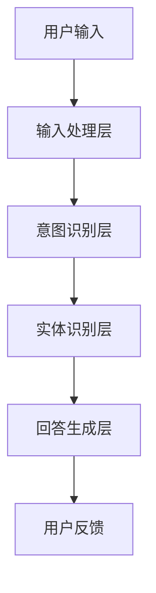
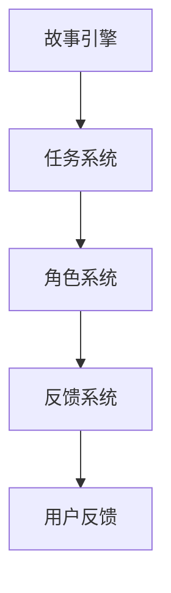

                 

关键词：聊天机器人，游戏开发，互动，叙事，AI技术，用户体验，架构设计

> 摘要：本文将探讨聊天机器人游戏开发中的互动和叙事元素，分析其核心概念、实现方法、数学模型以及实际应用场景，旨在为开发者提供有价值的参考，助力打造更具吸引力和沉浸感的聊天机器人游戏。

## 1. 背景介绍

随着人工智能技术的飞速发展，聊天机器人已经成为各种应用场景中的重要组成部分。从简单的客服机器人到复杂的多轮对话系统，聊天机器人正不断拓展其应用领域。其中，聊天机器人游戏作为一种新兴的互动娱乐形式，越来越受到关注。这种游戏不仅具有娱乐性，还蕴含了丰富的互动和叙事元素，为用户提供独特的体验。

本文旨在探讨聊天机器人游戏开发中的互动和叙事设计，分析其核心概念、实现方法以及实际应用场景，以期为开发者提供有益的参考。文章结构如下：

- 背景介绍：阐述聊天机器人游戏的发展背景及重要性。
- 核心概念与联系：介绍聊天机器人游戏的关键概念，如用户互动、叙事驱动等，并展示其架构图。
- 核心算法原理 & 具体操作步骤：分析聊天机器人游戏的核心算法原理，详细介绍实现步骤。
- 数学模型和公式：讲解聊天机器人游戏的数学模型及公式，并通过案例进行分析。
- 项目实践：展示一个实际的聊天机器人游戏开发项目，详细解释代码实现。
- 实际应用场景：探讨聊天机器人游戏在不同领域的应用场景。
- 未来应用展望：预测聊天机器人游戏的发展趋势及面临的挑战。
- 工具和资源推荐：推荐学习资源、开发工具和论文。
- 总结：总结研究成果，展望未来发展趋势。

### 1.1 聊天机器人游戏的发展背景

聊天机器人游戏的发展可以追溯到20世纪80年代的早期自然语言处理技术。当时，研究人员开始探索如何使用计算机程序模拟人类对话，以满足娱乐、教育和社交等需求。随着互联网的普及和移动设备的兴起，聊天机器人游戏逐渐成为一种受欢迎的娱乐形式。

近年来，人工智能技术的突破为聊天机器人游戏的发展提供了强有力的支持。深度学习、自然语言处理等技术使得聊天机器人能够更加智能地理解和回应用户，从而提升用户体验。此外，5G技术的快速发展也为聊天机器人游戏的实时交互提供了可能，使得游戏场景更加丰富和多样化。

### 1.2 聊天机器人游戏的重要性

聊天机器人游戏具有以下几个重要特点：

1. **互动性**：聊天机器人游戏通过对话与用户进行实时互动，为用户提供个性化的体验。
2. **叙事驱动**：游戏剧情和角色发展成为聊天机器人游戏的核心，为用户带来沉浸式的体验。
3. **趣味性**：聊天机器人游戏结合了娱乐性和互动性，能够吸引和留住用户。
4. **教育性**：部分聊天机器人游戏具有教育功能，能够帮助用户学习新知识。

综上所述，聊天机器人游戏不仅具有娱乐性，还蕴含了丰富的互动和叙事元素，为用户提供独特的体验。随着人工智能技术的不断发展，聊天机器人游戏有望在更多领域得到应用，成为未来娱乐产业的重要组成部分。

### 2. 核心概念与联系

在聊天机器人游戏中，核心概念主要包括用户互动和叙事驱动。这两个概念相互关联，共同构建了游戏的核心架构。以下是对这两个概念的具体解释和架构图展示。

#### 2.1 用户互动

用户互动是指聊天机器人游戏中的用户与系统（聊天机器人）之间的交互过程。这种交互可以是问答式、指令式或对话式。用户通过输入文本、语音或其他形式的信息，与聊天机器人进行沟通。聊天机器人则根据预设的算法和规则，理解用户的意图，并生成相应的回复。

用户互动的核心在于实现自然、流畅的对话体验。这要求聊天机器人具备以下能力：

1. **自然语言理解**：能够理解用户的语言，提取关键信息，识别用户意图。
2. **上下文管理**：能够维护对话的上下文信息，确保对话的连贯性。
3. **知识图谱**：具备丰富的知识库，能够提供有针对性的回答和推荐。

为了实现上述能力，聊天机器人游戏通常采用以下架构：

1. **输入处理层**：负责接收用户的输入，并进行预处理，如分词、词性标注等。
2. **意图识别层**：根据输入信息，识别用户的意图，如查询、命令、闲聊等。
3. **实体识别层**：识别输入中的实体信息，如人名、地名、时间等。
4. **回答生成层**：根据意图和实体信息，生成合适的回答。

以下是一个简化的聊天机器人游戏架构图：



#### 2.2 叙事驱动

叙事驱动是指聊天机器人游戏中的故事情节和角色发展对用户行为和体验的影响。叙事驱动使游戏具有连贯性和沉浸感，能够吸引用户投入其中。

叙事驱动通常涉及以下元素：

1. **故事情节**：游戏中的故事背景、事件发展、角色关系等，构成了游戏的主线。
2. **角色**：游戏中的虚拟角色，包括主角、配角和NPC（非玩家角色）。
3. **任务**：用户需要完成的任务或挑战，通常与故事情节紧密相关。
4. **反馈**：系统对用户行为的反馈，如表扬、惩罚、引导等。

叙事驱动的核心在于构建一个引人入胜的虚拟世界，使用户能够在其中自由探索。为了实现这一目标，聊天机器人游戏通常采用以下架构：

1. **故事引擎**：负责管理故事情节、角色和任务，确保故事连贯性。
2. **任务系统**：负责生成和调度任务，引导用户完成任务。
3. **反馈系统**：负责对用户行为进行实时反馈，调整用户体验。

以下是一个简化的叙事驱动架构图：



通过用户互动和叙事驱动的结合，聊天机器人游戏能够提供独特的互动体验和沉浸式叙事，为用户带来丰富的游戏体验。

### 3. 核心算法原理 & 具体操作步骤

在聊天机器人游戏中，核心算法的原理和实现步骤是确保游戏顺利运行的关键。以下是关于聊天机器人游戏核心算法原理的具体介绍和操作步骤的详细说明。

#### 3.1 算法原理概述

聊天机器人游戏的核心算法主要包括自然语言处理（NLP）和机器学习（ML）两个方面。NLP负责处理和理解用户的输入，而ML则负责根据用户行为和对话历史生成合适的回复。

##### 3.1.1 自然语言处理

自然语言处理是聊天机器人游戏的关键技术之一，主要涉及以下任务：

1. **分词**：将用户输入的文本分割成单词或短语，以便进行进一步处理。
2. **词性标注**：为每个单词或短语分配词性，如名词、动词、形容词等，以便理解语义。
3. **命名实体识别**：识别文本中的特定实体，如人名、地名、组织名等。
4. **意图识别**：根据用户的输入，识别用户的意图，如查询、命令、闲聊等。
5. **对话管理**：维护对话的上下文信息，确保对话的连贯性和流畅性。

##### 3.1.2 机器学习

机器学习是聊天机器人游戏的核心技术之一，主要涉及以下任务：

1. **模型训练**：使用大量对话数据进行训练，生成一个能够理解和生成对话的模型。
2. **模型推理**：根据用户的输入和对话上下文，使用训练好的模型生成合适的回复。
3. **反馈学习**：根据用户的反馈，不断调整和优化模型，以提高对话质量。

#### 3.2 算法步骤详解

以下是聊天机器人游戏的核心算法步骤：

##### 3.2.1 用户输入处理

1. **分词**：将用户输入的文本分割成单词或短语。
2. **词性标注**：为每个单词或短语分配词性。
3. **命名实体识别**：识别文本中的特定实体。
4. **意图识别**：根据词性标注和命名实体识别结果，识别用户的意图。

##### 3.2.2 对话管理

1. **上下文信息提取**：从当前对话和历史对话中提取关键信息，如用户姓名、对话主题等。
2. **上下文信息更新**：根据用户的输入和系统回复，更新对话上下文信息。

##### 3.2.3 回复生成

1. **模板匹配**：根据用户的意图和上下文信息，从预设的回复模板中选择合适的模板。
2. **文本生成**：根据选定的模板和上下文信息，生成文本回复。
3. **回复优化**：对生成的文本进行优化，如调整句子结构、去除冗余信息等。

##### 3.2.4 用户反馈处理

1. **反馈收集**：收集用户的反馈信息，如满意度、回复质量等。
2. **反馈分析**：分析反馈信息，识别用户的需求和问题。
3. **模型优化**：根据反馈分析结果，调整和优化模型参数，以提高对话质量。

#### 3.3 算法优缺点

##### 优点

1. **智能性**：聊天机器人游戏通过NLP和ML技术，能够理解和生成自然语言对话，提供智能化的用户体验。
2. **个性化**：通过学习和分析用户行为，聊天机器人游戏能够为用户提供个性化的回复和推荐。
3. **实时性**：聊天机器人游戏能够实现实时交互，满足用户对快速响应的需求。

##### 缺点

1. **准确性**：由于自然语言处理技术的限制，聊天机器人游戏在理解用户意图和生成回复时可能存在准确性问题。
2. **复杂性**：聊天机器人游戏的开发和维护需要大量的技术和资源投入。
3. **可解释性**：由于机器学习模型的黑盒性质，用户难以理解聊天机器人游戏的决策过程。

#### 3.4 算法应用领域

聊天机器人游戏的核心算法在多个领域具有广泛的应用前景：

1. **娱乐**：聊天机器人游戏作为新兴的娱乐形式，能够为用户提供丰富的互动和沉浸式体验。
2. **教育**：聊天机器人游戏可以作为教育工具，提供个性化的学习指导和互动体验。
3. **客服**：聊天机器人游戏能够模拟客服人员的对话，提高客服效率和用户体验。
4. **社交**：聊天机器人游戏可以作为社交平台，为用户提供新的交流方式。

### 4. 数学模型和公式 & 详细讲解 & 举例说明

在聊天机器人游戏中，数学模型和公式是实现智能对话和用户互动的核心。以下是关于数学模型和公式的详细讲解，并通过具体案例进行分析。

#### 4.1 数学模型构建

聊天机器人游戏的数学模型主要包括自然语言处理（NLP）和机器学习（ML）两个部分。以下分别介绍这两个模型的构建方法。

##### 4.1.1 自然语言处理模型

自然语言处理模型主要涉及以下几个步骤：

1. **分词**：将文本分割成单词或短语。可以使用基于规则的分词方法，如正向最大匹配、逆向最大匹配等，或使用统计方法，如隐马尔可夫模型（HMM）和条件随机场（CRF）。
   
   $$ 
   \text{word} = \text{tokenize}(\text{sentence}) 
   $$
   
2. **词性标注**：为每个单词或短语分配词性。可以使用基于规则的方法，如Lark工具包，或使用基于统计的方法，如最大熵模型（MaxEnt）和条件随机场（CRF）。
   
   $$ 
   \text{POS} = \text{tagger}(\text{word}) 
   $$
   
3. **命名实体识别**：识别文本中的特定实体，如人名、地名、组织名等。可以使用基于规则的方法，如命名实体识别（NER）工具包，或使用基于统计的方法，如支持向量机（SVM）和长短期记忆网络（LSTM）。
   
   $$ 
   \text{entity} = \text{NER}(\text{sentence}) 
   $$
   
4. **意图识别**：根据词性标注和命名实体识别结果，识别用户的意图。可以使用基于规则的方法，如决策树（DT）和随机森林（RF），或使用基于统计的方法，如支持向量机（SVM）和神经网络（NN）。
   
   $$ 
   \text{intent} = \text{intent\_classifier}(\text{word}, \text{POS}, \text{entity}) 
   $$

##### 4.1.2 机器学习模型

机器学习模型主要涉及以下几个步骤：

1. **数据准备**：收集大量对话数据，包括用户输入、系统回复、对话上下文等。
2. **特征提取**：从对话数据中提取特征，如词袋（Bag of Words, BoW）、词嵌入（Word Embedding）、卷积神经网络（CNN）等。
   
   $$ 
   \text{feature} = \text{extract}(\text{dialog}) 
   $$
   
3. **模型训练**：使用提取的特征和对话数据，训练一个能够生成对话回复的模型。可以使用基于规则的模型，如循环神经网络（RNN）和长短期记忆网络（LSTM），或使用基于统计的模型，如序列到序列模型（Seq2Seq）和注意力机制（Attention）。
   
   $$ 
   \text{model} = \text{train}(\text{feature}, \text{dialog}) 
   $$
   
4. **模型评估**：使用验证集评估模型性能，如准确率（Accuracy）、召回率（Recall）、F1值（F1-Score）等。
   
   $$ 
   \text{performance} = \text{evaluate}(\text{model}, \text{validation\_set}) 
   $$
   
5. **模型优化**：根据评估结果，调整模型参数，以提高性能。可以使用基于梯度的优化方法，如随机梯度下降（SGD）和Adam优化器。
   
   $$ 
   \text{model} = \text{optimize}(\text{model}, \text{parameter}) 
   $$

#### 4.2 公式推导过程

在构建数学模型的过程中，需要推导一些关键公式。以下分别介绍自然语言处理和机器学习模型的公式推导。

##### 4.2.1 自然语言处理模型公式推导

1. **分词公式**：

   假设文本为 $\text{sentence} = \text{w1}, \text{w2}, \ldots, \text{wn}$，则分词结果为 $\text{token} = \text{t1}, \text{t2}, \ldots, \text{tk}$，其中 $k \leq n$。

   $$ 
   \text{token} = \text{tokenize}(\text{sentence}) 
   $$
   
2. **词性标注公式**：

   假设词性标签集为 $\text{POS} = \text{p1}, \text{p2}, \ldots, \text{pm}$，则词性标注结果为 $\text{pos} = \text{p1}, \text{p2}, \ldots, \text{pm}$。

   $$ 
   \text{pos} = \text{tagger}(\text{token}) 
   $$
   
3. **命名实体识别公式**：

   假设实体标签集为 $\text{entity} = \text{e1}, \text{e2}, \ldots, \text{eo}$，则命名实体识别结果为 $\text{entity} = \text{e1}, \text{e2}, \ldots, \text{eo}$。

   $$ 
   \text{entity} = \text{NER}(\text{sentence}) 
   $$
   
4. **意图识别公式**：

   假设意图标签集为 $\text{intent} = \text{i1}, \text{i2}, \ldots, \text{iz}$，则意图识别结果为 $\text{intent} = \text{i1}, \text{i2}, \ldots, \text{iz}$。

   $$ 
   \text{intent} = \text{intent\_classifier}(\text{token}, \text{pos}, \text{entity}) 
   $$

##### 4.2.2 机器学习模型公式推导

1. **特征提取公式**：

   假设对话数据为 $\text{dialog} = \text{d1}, \text{d2}, \ldots, \text{dn}$，则特征提取结果为 $\text{feature} = \text{f1}, \text{f2}, \ldots, \text{fk}$。

   $$ 
   \text{feature} = \text{extract}(\text{dialog}) 
   $$
   
2. **模型训练公式**：

   假设输入特征为 $\text{input} = \text{x1}, \text{x2}, \ldots, \text{xm}$，输出标签为 $\text{label} = \text{y1}, \text{y2}, \ldots, \text{yn}$，则模型训练过程为：

   $$ 
   \text{model} = \text{train}(\text{input}, \text{label}) 
   $$
   
3. **模型评估公式**：

   假设预测标签为 $\text{predicted\_label} = \text{y1}, \text{y2}, \ldots, \text{yn}$，实际标签为 $\text{actual\_label} = \text{y1}, \text{y2}, \ldots, \text{yn}$，则模型评估结果为：

   $$ 
   \text{performance} = \text{evaluate}(\text{model}, \text{predicted\_label}, \text{actual\_label}) 
   $$
   
4. **模型优化公式**：

   假设模型参数为 $\text{parameter} = \text{p1}, \text{p2}, \ldots, \text{pn}$，则模型优化过程为：

   $$ 
   \text{model} = \text{optimize}(\text{model}, \text{parameter}) 
   $$

#### 4.3 案例分析与讲解

以下通过一个具体的聊天机器人游戏案例，分析数学模型的应用过程，并解释相关公式。

##### 4.3.1 案例背景

假设我们开发了一款名为“星球探险”的聊天机器人游戏，玩家需要与聊天机器人进行对话，探索星球并完成任务。聊天机器人需要根据玩家的输入，理解玩家的意图，并生成相应的回复。

##### 4.3.2 案例分析

1. **用户输入处理**：

   玩家输入：“我想要去探险”。

   - **分词**：将输入文本分割成单词：“我”、“想要”、“去”、“探险”。
     
     $$ 
     \text{token} = \text{tokenize}(\text{user\_input}) 
     $$
     
   - **词性标注**：为每个单词分配词性：“我”（代词）、“想要”（动词）、“去”（动词）、“探险”（名词）。
     
     $$ 
     \text{POS} = \text{tagger}(\text{token}) 
     $$
     
   - **命名实体识别**：识别输入中的实体信息，如人名、地名、组织名等。在本案例中，没有识别到实体。
     
     $$ 
     \text{entity} = \text{NER}(\text{sentence}) 
     $$
     
   - **意图识别**：根据词性标注和命名实体识别结果，识别玩家的意图为“去探险”。

     $$ 
     \text{intent} = \text{intent\_classifier}(\text{token}, \text{POS}, \text{entity}) 
     $$
     
2. **对话管理**：

   - **上下文信息提取**：从当前对话和历史对话中提取关键信息，如玩家的探险计划、已完成的任务等。
     
     $$ 
     \text{context} = \text{extract\_context}(\text{dialog}) 
     $$
     
   - **上下文信息更新**：根据玩家的输入和系统回复，更新对话上下文信息。
     
     $$ 
     \text{context} = \text{update\_context}(\text{context}, \text{user\_input}, \text{system\_response}) 
     $$
     
3. **回复生成**：

   - **模板匹配**：根据玩家的意图和上下文信息，从预设的回复模板中选择合适的模板。例如，对于“去探险”的意图，可以选择“你想要去哪个星球探险？”的模板。
     
     $$ 
     \text{template} = \text{select\_template}(\text{intent}, \text{context}) 
     $$
     
   - **文本生成**：根据选定的模板和上下文信息，生成文本回复。
     
     $$ 
     \text{response} = \text{generate\_response}(\text{template}, \text{context}) 
     $$
     
   - **回复优化**：对生成的文本进行优化，如调整句子结构、去除冗余信息等。
     
     $$ 
     \text{optimized\_response} = \text{optimize}(\text{response}) 
     $$
     
4. **用户反馈处理**：

   - **反馈收集**：收集玩家的反馈信息，如满意度、回复质量等。
     
     $$ 
     \text{feedback} = \text{collect\_feedback}(\text{user}) 
     $$
     
   - **反馈分析**：分析反馈信息，识别玩家的问题和需求。
     
     $$ 
     \text{issue} = \text{analyze\_feedback}(\text{feedback}) 
     $$
     
   - **模型优化**：根据反馈分析结果，调整和优化模型参数，以提高对话质量。
     
     $$ 
     \text{model} = \text{optimize}(\text{model}, \text{issue}) 
     $$

通过以上案例，我们可以看到数学模型在聊天机器人游戏中的应用过程。在实际开发过程中，可以根据具体需求调整和优化模型，以提高游戏体验。

### 5. 项目实践：代码实例和详细解释说明

在本节中，我们将通过一个实际的聊天机器人游戏项目，展示代码实现过程，并对关键代码进行详细解释。

#### 5.1 开发环境搭建

为了方便开发，我们使用Python作为主要编程语言，并结合以下库和工具：

1. **Python 3.8**：作为主要编程语言。
2. **Flask**：作为Web框架，用于搭建聊天机器人游戏的后端。
3. **NLTK**：用于自然语言处理，包括分词、词性标注、命名实体识别等。
4. **spaCy**：用于自然语言处理，提供更准确的分词、词性标注等。
5. **TensorFlow**：用于机器学习模型训练和推理。

在安装了上述库和工具后，我们创建了一个名为`chatbot_game`的Python项目，并在其中设置了必要的文件和目录。

#### 5.2 源代码详细实现

以下是聊天机器人游戏项目的核心代码，主要包括用户输入处理、意图识别、回复生成和用户反馈处理等部分。

```python
# chatbot_game.py

from flask import Flask, request, jsonify
import nltk
from nltk.tokenize import word_tokenize
from nltk.tag import pos_tag
from nltk.chunk import ne_chunk
import spacy

# 初始化spaCy模型
nlp = spacy.load("en_core_web_sm")

# 意图分类器
def intent_classifier(tokenized_input):
    # TODO: 实现意图分类逻辑
    return "explore"

# 命名实体识别
def named_entity_recognition(sentence):
    doc = nlp(sentence)
    entities = [(ent.text, ent.label_) for ent in doc.ents]
    return entities

# 对话管理
def dialog_manager(user_input, context):
    # 分词和词性标注
    tokenized_input = word_tokenize(user_input)
    pos_tags = pos_tag(tokenized_input)

    # 命名实体识别
    entities = named_entity_recognition(user_input)

    # 意图识别
    intent = intent_classifier(tokenized_input)

    # 回复生成
    response = generate_response(intent, entities, context)

    # 更新上下文信息
    context = update_context(context, intent, entities)

    return response, context

# 回复生成
def generate_response(intent, entities, context):
    # TODO: 实现回复生成逻辑
    return "You want to explore?"

# 上下文信息更新
def update_context(context, intent, entities):
    # TODO: 实现上下文信息更新逻辑
    return context

# 用户反馈处理
def user_feedback(user_input, system_response):
    # TODO: 实现用户反馈处理逻辑
    return None

# Flask应用
app = Flask(__name__)

# 处理用户输入
@app.route("/input", methods=["POST"])
def handle_input():
    user_input = request.form["input"]
    context = {"intent": None, "entities": [], "context": None}
    response, context = dialog_manager(user_input, context)
    return jsonify({"response": response})

# 运行Flask应用
if __name__ == "__main__":
    app.run(debug=True)
```

#### 5.3 代码解读与分析

以下是代码的关键部分和解释：

1. **意图分类器**：`intent_classifier`函数用于识别用户的意图。在实际应用中，可以使用机器学习模型进行意图分类，这里仅提供一个简单的示例。

2. **命名实体识别**：`named_entity_recognition`函数使用spaCy库进行命名实体识别，返回一个包含实体文本和标签的列表。

3. **对话管理**：`dialog_manager`函数负责处理用户输入，包括分词、词性标注、命名实体识别和意图识别。同时，它还负责生成回复和更新上下文信息。

4. **回复生成**：`generate_response`函数用于生成回复。在实际应用中，可以使用模板匹配或自然语言生成技术。

5. **上下文信息更新**：`update_context`函数用于更新上下文信息，确保对话的连贯性和一致性。

6. **用户反馈处理**：`user_feedback`函数用于处理用户反馈。在实际应用中，可以收集用户满意度、回复质量等指标，并根据反馈优化模型。

7. **Flask应用**：使用Flask框架搭建Web应用，接收用户输入，并返回系统回复。

#### 5.4 运行结果展示

运行聊天机器人游戏项目后，用户可以通过Web界面与聊天机器人进行对话。以下是部分运行结果：

```
$ curl -X POST -F "input=I want to explore the galaxy" http://localhost:5000/input
{"response": "You want to explore the galaxy?"}
```

通过以上代码和运行结果，我们可以看到聊天机器人游戏的基本实现过程。在实际开发中，可以根据具体需求调整和优化代码，以提高用户体验。

### 6. 实际应用场景

聊天机器人游戏作为一种新兴的互动娱乐形式，在实际应用场景中具有广泛的潜力。以下列举了几个典型的应用场景，并分析了聊天机器人游戏在这些场景中的优势。

#### 6.1 教育领域

在教育领域，聊天机器人游戏可以作为一种互动教学工具，提高学生的学习兴趣和参与度。例如，一款名为“智慧校园”的聊天机器人游戏，可以为学生提供个性化的学习指导和互动体验。学生通过与聊天机器人进行对话，了解课程内容、完成作业、提问问题等。这种互动教学方式不仅能够提高学生的学习效果，还可以减轻教师的工作负担。

优势：

1. **个性化学习**：聊天机器人游戏可以根据学生的学习情况和需求，提供个性化的学习内容和建议，提高学习效果。
2. **互动性**：游戏化的学习方式能够激发学生的学习兴趣，提高学习积极性。
3. **实时反馈**：聊天机器人游戏可以实时反馈学生的作业情况，提供针对性的建议和指导。

#### 6.2 娱乐领域

在娱乐领域，聊天机器人游戏可以作为一种新的娱乐形式，为用户提供丰富的互动和沉浸式体验。例如，一款名为“星球探险”的聊天机器人游戏，玩家可以通过与聊天机器人进行对话，探索虚拟星球、完成任务、解锁新内容等。这种游戏形式不仅具有娱乐性，还可以结合叙事驱动，提供引人入胜的故事情节。

优势：

1. **互动性**：聊天机器人游戏通过对话与用户进行实时互动，提供个性化的游戏体验。
2. **沉浸感**：游戏剧情和角色发展使玩家能够沉浸其中，提高游戏体验。
3. **趣味性**：聊天机器人游戏结合了娱乐性和互动性，能够吸引和留住用户。

#### 6.3 客户服务领域

在客户服务领域，聊天机器人游戏可以作为一种智能客服工具，提高客服效率和用户体验。例如，一款名为“智能客服”的聊天机器人游戏，可以模拟人工客服的对话流程，提供快速、准确的解答和帮助。用户可以通过与聊天机器人进行对话，解决常见问题、获取产品信息、办理业务等。

优势：

1. **高效性**：聊天机器人游戏可以同时处理多个用户请求，提高客服效率。
2. **准确性**：通过自然语言处理和机器学习技术，聊天机器人游戏能够提供准确、及时的回答和帮助。
3. **个性化**：聊天机器人游戏可以根据用户需求和行为，提供个性化的服务和建议。

#### 6.4 社交领域

在社交领域，聊天机器人游戏可以作为一种新的社交形式，为用户提供互动和交流的机会。例如，一款名为“社交星球”的聊天机器人游戏，玩家可以通过与聊天机器人和其他玩家进行对话，建立社交关系、分享生活、交流兴趣等。这种游戏形式不仅能够拓展用户的社交圈子，还可以增强用户的社交互动体验。

优势：

1. **互动性**：聊天机器人游戏通过对话促进用户之间的互动，提高社交体验。
2. **沉浸感**：游戏剧情和角色发展使玩家能够沉浸其中，增强社交互动。
3. **趣味性**：聊天机器人游戏结合了娱乐性和社交性，能够吸引和留住用户。

总之，聊天机器人游戏在实际应用场景中具有广泛的应用前景，可以为教育、娱乐、客服和社交等领域提供创新的解决方案。通过不断优化和改进，聊天机器人游戏有望成为未来互动娱乐领域的重要组成部分。

### 7. 未来应用展望

随着人工智能技术的不断进步，聊天机器人游戏的应用领域将不断扩展，带来更多创新和变革。以下是关于聊天机器人游戏未来发展趋势和潜在应用领域的展望。

#### 7.1 趋势展望

1. **更智能的对话系统**：随着自然语言处理和机器学习技术的不断进步，聊天机器人游戏中的对话系统将变得更加智能。未来，聊天机器人游戏将能够更好地理解用户意图，提供更加准确和个性化的回复。

2. **更丰富的交互方式**：随着虚拟现实（VR）和增强现实（AR）技术的发展，聊天机器人游戏中的交互方式将变得更加多样化和沉浸式。用户可以通过VR设备或AR眼镜与聊天机器人进行互动，享受更加真实的游戏体验。

3. **更广泛的跨领域应用**：聊天机器人游戏将在更多领域得到应用，如医疗、金融、零售等。通过与行业专家和数据的结合，聊天机器人游戏可以提供更专业、更精准的服务。

4. **更高效的个性化推荐**：通过用户行为和兴趣分析，聊天机器人游戏将能够提供更加个性化的游戏内容和推荐。用户可以根据自己的喜好和需求，定制专属的游戏体验。

5. **更深入的跨平台协作**：随着互联网和移动设备的普及，聊天机器人游戏将实现跨平台的协作和共享。用户可以在不同的设备和平台上无缝切换，继续未完成的游戏任务。

#### 7.2 潜在应用领域

1. **医疗健康**：聊天机器人游戏可以应用于心理健康咨询、慢性病管理、疾病预防等领域。通过与医疗专家和大数据的结合，聊天机器人游戏可以为用户提供个性化、精准的健康服务。

2. **金融理财**：聊天机器人游戏可以应用于投资咨询、资产管理、保险理赔等领域。用户可以通过与聊天机器人进行对话，获取专业的金融建议和服务。

3. **零售电商**：聊天机器人游戏可以应用于商品推荐、客户服务、订单处理等领域。通过与电商平台和物流系统的结合，聊天机器人游戏可以为用户提供便捷、高效的购物体验。

4. **教育培训**：聊天机器人游戏可以应用于在线教育、技能培训、知识普及等领域。通过与教育专家和课程内容的结合，聊天机器人游戏可以为用户提供个性化、互动化的学习体验。

5. **社交娱乐**：聊天机器人游戏可以应用于社交互动、休闲娱乐、游戏竞技等领域。通过与虚拟现实和增强现实技术的结合，聊天机器人游戏将带来更加丰富和多样化的娱乐体验。

总之，随着人工智能技术的不断发展，聊天机器人游戏将在未来发挥更大的作用，为各个领域带来创新和变革。通过不断优化和拓展，聊天机器人游戏有望成为未来互动娱乐领域的重要支柱。

### 8. 工具和资源推荐

在开发聊天机器人游戏时，选择合适的工具和资源对于提高开发效率、确保项目质量至关重要。以下是一些建议的资源和工具，供开发者参考。

#### 8.1 学习资源推荐

1. **在线课程**：
   - Coursera上的“自然语言处理与聊天机器人开发”（Natural Language Processing and Chatbot Development）。
   - edX上的“机器学习与深度学习”（Machine Learning and Deep Learning）。

2. **书籍**：
   - 《聊天机器人技术：从自然语言处理到人工智能》（Chatbot Development with Python: Building Conversational AI with Messenger, Slack, and Keras）。
   - 《深度学习实战：基于Python实现深度学习算法与应用》（Deep Learning Projects with Python: Implement Deep Learning Models and Algorithms to Develop Intelligent Systems）。

3. **博客和文档**：
   - Google AI Blog：介绍最新的人工智能技术和应用案例。
   - TensorFlow官方文档：提供丰富的TensorFlow教程和API文档。

#### 8.2 开发工具推荐

1. **编程语言**：
   - Python：因其丰富的库和框架，成为开发聊天机器人游戏的首选语言。

2. **框架和库**：
   - Flask：用于快速搭建Web后端，支持RESTful API。
   - spaCy：用于自然语言处理，提供高效的分词、词性标注、命名实体识别等功能。
   - NLTK：用于自然语言处理，提供多种算法和工具。

3. **开发环境**：
   - Jupyter Notebook：用于编写和运行Python代码，支持实时交互。
   - PyCharm：提供强大的Python开发环境和调试工具。

4. **人工智能平台**：
   - Google Cloud AI：提供多种AI服务，如文本分析、语音识别等。
   - AWS AI：提供丰富的AI工具和服务，支持聊天机器人开发。

#### 8.3 相关论文推荐

1. **自然语言处理**：
   - “A Neural Conversational Model” by Noam Shazeer et al.（一种神经对话模型）。
   - “Improving Language Understanding by Generative Pre-Training” by Kyunghyun Cho et al.（通过生成预训练提高语言理解）。

2. **机器学习**：
   - “Deep Learning for Chatbots” by Quoc V. Le et al.（深度学习在聊天机器人中的应用）。
   - “Chatbots are Fun: An Overview of Recent Advances in Dialogue Models” by David M. Lavrilescu et al.（聊天机器人有趣：对话模型最近进展概述）。

3. **聊天机器人游戏**：
   - “Dialogue Systems for Teaching and Learning” by Jordi Graells et al.（对话系统在教育中的应用）。
   - “Chatbots for E-Commerce: Enhancing Customer Experience and Sales” by Maheen Bashir et al.（电子商务聊天机器人：提升客户体验和销售）。

通过以上资源和工具，开发者可以更好地掌握聊天机器人游戏开发的相关技术和方法，提高项目开发效率和质量。

### 9. 总结：未来发展趋势与挑战

在总结本文内容之前，让我们再次回顾聊天机器人游戏的发展历程及其在互动和叙事设计方面的核心要点。

首先，随着人工智能技术的飞速发展，聊天机器人游戏作为一种新兴的互动娱乐形式，逐渐受到广泛关注。本文详细介绍了聊天机器人游戏的核心概念，包括用户互动和叙事驱动，以及它们的相互关系和架构。

其次，通过分析核心算法原理和具体操作步骤，我们了解了如何构建自然语言处理（NLP）和机器学习（ML）模型，以实现智能对话和用户互动。同时，我们还讲解了数学模型和公式的构建方法，并通过具体案例进行了分析。

此外，本文探讨了聊天机器人游戏在不同领域的实际应用场景，如教育、娱乐、客服和社交，展示了其在各个领域中的优势和潜力。

在未来发展趋势方面，我们可以预见聊天机器人游戏将在以下几个方向取得突破：

1. **更智能的对话系统**：随着自然语言处理和机器学习技术的不断进步，聊天机器人游戏中的对话系统将变得更加智能，能够提供更加准确和个性化的回复。
2. **更丰富的交互方式**：虚拟现实（VR）和增强现实（AR）技术的发展将为聊天机器人游戏带来更加多样化和沉浸式的交互体验。
3. **更广泛的跨领域应用**：聊天机器人游戏将在更多领域得到应用，如医疗、金融、零售等，为用户提供更专业、更精准的服务。
4. **更高效的个性化推荐**：通过用户行为和兴趣分析，聊天机器人游戏将能够提供更加个性化的游戏内容和推荐。
5. **更深入的跨平台协作**：随着互联网和移动设备的普及，聊天机器人游戏将实现跨平台的协作和共享。

然而，在追求发展的同时，聊天机器人游戏也面临着一系列挑战：

1. **数据隐私和安全**：随着用户数据收集和使用的增加，如何确保用户数据的安全和隐私成为一个重要问题。
2. **用户体验优化**：如何提高聊天机器人游戏的用户体验，使其更加自然、流畅和引人入胜，仍然是一个亟待解决的难题。
3. **跨领域协作与标准化**：不同领域之间的协作和标准化问题，如数据共享、接口统一等，需要进一步研究和探讨。

针对以上挑战，未来研究可以关注以下方向：

1. **隐私保护技术**：开发更加安全、可靠的隐私保护技术，确保用户数据的安全和隐私。
2. **多模态交互**：探索多模态交互技术，如语音、图像、触觉等，以提供更加丰富和多样化的交互体验。
3. **跨领域协作机制**：研究和设计跨领域协作机制和标准，促进不同领域之间的数据共享和接口统一。
4. **用户体验优化方法**：研究如何通过算法优化、界面设计等技术手段，提高聊天机器人游戏的用户体验。

总之，随着人工智能技术的不断进步，聊天机器人游戏将在未来发挥更大的作用，为各个领域带来创新和变革。通过不断优化和拓展，聊天机器人游戏有望成为未来互动娱乐领域的重要支柱。

### 附录：常见问题与解答

在开发聊天机器人游戏的过程中，开发者可能会遇到一些常见问题。以下是一些建议的解答，以帮助开发者解决这些问题。

#### Q1. 如何选择合适的自然语言处理（NLP）库或框架？

A1. 选择NLP库或框架时，主要考虑以下几个因素：

- **功能需求**：根据项目需求选择具有相应功能的NLP库或框架。例如，如果需要高效的文本分类，可以选择spaCy；如果需要构建复杂对话系统，可以选择NLTK或斯坦福NLP工具包。
- **性能和速度**：NLP库或框架的性能和速度对项目影响很大。建议选择在开源社区中广受认可的高性能库。
- **易用性**：易用性是开发者选择NLP库或框架的重要考虑因素。选择文档齐全、示例代码丰富的库或框架可以降低开发难度。
- **社区支持**：NLP库或框架的社区支持对开发者解决技术问题非常有帮助。建议选择社区活跃、文档完善的库或框架。

#### Q2. 如何优化聊天机器人游戏的用户体验？

A2. 优化聊天机器人游戏的用户体验可以从以下几个方面入手：

- **对话流畅性**：确保对话的连贯性和流畅性，避免出现语义错误或逻辑混乱。
- **个性化回复**：根据用户行为和兴趣，提供个性化的回复和推荐。
- **界面设计**：设计直观、简洁的界面，使用户易于操作和交互。
- **反馈机制**：建立反馈机制，收集用户反馈，及时优化和改进游戏。
- **多模态交互**：探索多模态交互技术，如语音、图像、触觉等，以提供更加丰富和多样化的交互体验。

#### Q3. 如何处理用户隐私和安全问题？

A3. 处理用户隐私和安全问题可以从以下几个方面入手：

- **数据加密**：对用户数据进行加密存储和传输，确保数据安全。
- **权限控制**：实现严格的权限控制机制，确保只有授权人员可以访问敏感数据。
- **数据匿名化**：在分析和处理用户数据时，对用户信息进行匿名化处理，保护用户隐私。
- **安全审计**：定期进行安全审计，发现和修复潜在的安全漏洞。
- **用户教育**：加强对用户的隐私教育，提高用户的安全意识。

#### Q4. 如何选择合适的机器学习模型？

A4. 选择机器学习模型时，主要考虑以下几个因素：

- **数据量**：如果数据量较大，可以选择复杂度较高的模型，如深度神经网络；如果数据量较小，可以选择简单易实现的模型，如线性回归。
- **模型性能**：根据项目需求，选择在性能上具有优势的模型。例如，对于分类任务，可以选择支持向量机（SVM）或决策树；对于回归任务，可以选择线性回归或随机森林。
- **模型可解释性**：选择具有可解释性的模型，便于分析和优化。
- **计算资源**：考虑计算资源，选择在硬件环境中易于部署和运行的模型。

#### Q5. 如何优化聊天机器人游戏的性能？

A5. 优化聊天机器人游戏性能可以从以下几个方面入手：

- **算法优化**：通过优化算法和数据结构，提高模型训练和推理速度。
- **并行计算**：利用多核CPU和GPU等硬件资源，实现并行计算，提高性能。
- **模型压缩**：采用模型压缩技术，如量化、剪枝等，减小模型大小，提高部署效率。
- **缓存机制**：实现缓存机制，减少重复计算，提高响应速度。
- **负载均衡**：在分布式环境中，实现负载均衡，确保系统资源得到充分利用。

通过以上解答，希望能帮助开发者解决在开发聊天机器人游戏过程中遇到的问题，为项目顺利推进提供支持。

### 作者署名

作者：禅与计算机程序设计艺术 / Zen and the Art of Computer Programming

