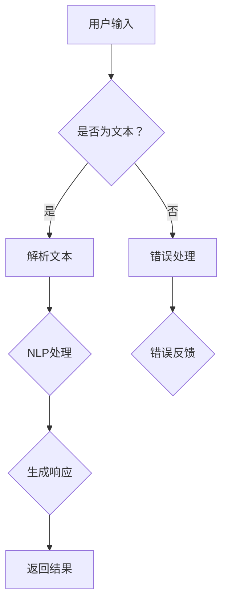
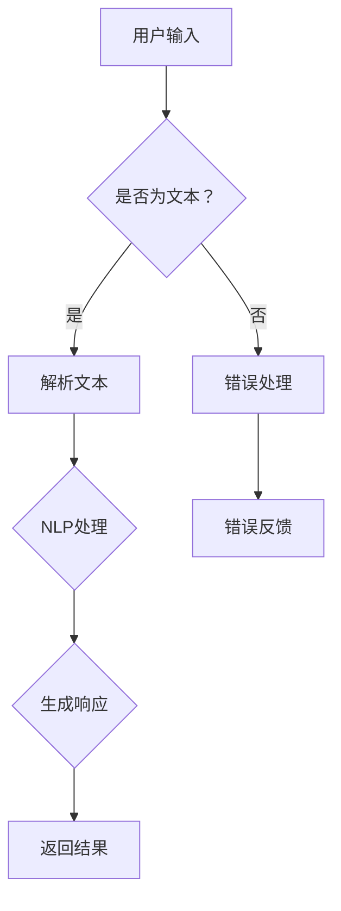

                 

关键词：聊天机器人、人工智能、日常应用、解决方案、建议、技术实践

> 摘要：本文旨在探讨聊天机器人在日常生活中的应用，提供一系列切实可行的解决方案和建议，帮助用户充分利用这一新兴技术，提升生活质量。

## 1. 背景介绍

随着人工智能技术的飞速发展，聊天机器人已经成为我们日常生活中不可或缺的一部分。从最初的简单客服机器人到如今具备复杂交互能力的虚拟助手，聊天机器人在各个领域的应用日益广泛。它们不仅可以节省人力成本，提高工作效率，还能为用户提供个性化的服务体验。

然而，要想充分发挥聊天机器人的潜力，用户需要了解其基本原理和操作技巧。本文将围绕这一主题，探讨聊天机器人在日常生活中的应用，分享一些实用的解决方案和建议。

## 2. 核心概念与联系

### 2.1 聊天机器人基本概念

聊天机器人（Chatbot）是一种模拟人类对话行为的计算机程序，通过自然语言处理（NLP）和机器学习技术，实现与用户的实时交互。聊天机器人可以应用于多个场景，如客服、教育、娱乐、医疗等。

### 2.2 聊天机器人架构

聊天机器人通常由以下几个关键组件构成：

1. **前端界面**：用户与聊天机器人交互的界面，可以是网页、移动应用或桌面应用。
2. **后端服务器**：负责处理用户输入，执行业务逻辑，并返回结果。
3. **自然语言处理（NLP）引擎**：将用户输入的文本转换为机器可理解的格式，并生成响应。
4. **机器学习模型**：通过大量数据训练，使聊天机器人具备不断学习和优化的能力。

### 2.3 Mermaid 流程图



## 3. 核心算法原理 & 具体操作步骤

### 3.1 算法原理概述

聊天机器人的核心算法主要包括自然语言处理（NLP）和机器学习。NLP负责将用户输入的文本转换为计算机可理解的格式，而机器学习则使聊天机器人能够不断学习和优化对话内容。

### 3.2 算法步骤详解

1. **文本解析**：将用户输入的文本分割成单词、短语或句子。
2. **词性标注**：为每个单词或短语分配词性（名词、动词等）。
3. **句法分析**：分析句子的结构，确定主语、谓语、宾语等成分。
4. **语义理解**：根据上下文理解用户意图，识别关键词或短语。
5. **生成响应**：根据用户意图，选择合适的回复文本。
6. **优化与学习**：利用机器学习算法，不断优化聊天机器人的对话能力。

### 3.3 算法优缺点

**优点**：
- 高效：聊天机器人可以同时处理多个用户请求，提高服务效率。
- 个性化：通过机器学习，聊天机器人可以针对不同用户生成个性化的回复。
- 可扩展：聊天机器人可以轻松集成到各种应用程序中。

**缺点**：
- 对话能力有限：目前的聊天机器人仍然难以理解复杂的语义。
- 数据隐私：收集用户数据可能导致隐私泄露问题。

### 3.4 算法应用领域

聊天机器人的应用领域广泛，包括：
- 客户服务：提供24/7在线客服支持，降低企业运营成本。
- 教育辅导：为学生提供个性化辅导，提高学习效果。
- 医疗咨询：为患者提供健康建议，减轻医生负担。
- 娱乐互动：与用户进行有趣的对话，提高用户体验。

## 4. 数学模型和公式 & 详细讲解 & 举例说明

### 4.1 数学模型构建

聊天机器人的数学模型通常基于深度学习，如循环神经网络（RNN）和变换器（Transformer）。以下是一个简单的RNN模型：

```latex
y_t = \sigma(W_1 \cdot [h_{t-1}, x_t] + b_1)
h_t = \sigma(W_2 \cdot [h_{t-1}, y_t] + b_2)
```

其中，\(y_t\) 是模型输出的预测结果，\(x_t\) 是输入的文本序列，\(h_t\) 是隐藏状态，\(\sigma\) 是激活函数，\(W_1, W_2, b_1, b_2\) 是模型参数。

### 4.2 公式推导过程

公式的推导过程涉及大量的微积分和线性代数知识，这里简要概述：

1. **前向传播**：将输入的文本序列通过RNN模型进行编码，得到隐藏状态。
2. **反向传播**：计算隐藏状态的梯度，并更新模型参数。

### 4.3 案例分析与讲解

假设用户输入“明天天气怎么样？”聊天机器人需要根据历史天气数据预测明天的天气。

1. **文本编码**：将用户输入的文本编码为向量。
2. **RNN编码**：通过RNN模型，将编码后的文本转化为隐藏状态。
3. **生成响应**：利用隐藏状态，生成明天的天气预测结果。

## 5. 项目实践：代码实例和详细解释说明

### 5.1 开发环境搭建

1. **安装Python**：下载并安装Python 3.8及以上版本。
2. **安装依赖库**：使用pip安装tensorflow、numpy等库。

### 5.2 源代码详细实现

以下是一个简单的聊天机器人代码实例：

```python
import tensorflow as tf
from tensorflow.keras.layers import Embedding, LSTM, Dense
from tensorflow.keras.models import Sequential

# 模型搭建
model = Sequential([
    Embedding(input_dim=vocab_size, output_dim=embedding_dim),
    LSTM(units=128),
    Dense(units=1, activation='sigmoid')
])

# 模型编译
model.compile(optimizer='adam', loss='binary_crossentropy', metrics=['accuracy'])

# 模型训练
model.fit(x_train, y_train, epochs=10, batch_size=32)
```

### 5.3 代码解读与分析

1. **模型搭建**：使用Sequential模型堆叠Embedding、LSTM和Dense层。
2. **模型编译**：设置优化器、损失函数和评价指标。
3. **模型训练**：使用训练数据对模型进行训练。

### 5.4 运行结果展示

训练完成后，使用测试数据评估模型性能。如果模型性能良好，可以将训练好的模型部署到线上环境，供用户使用。

## 6. 实际应用场景

### 6.1 客户服务

聊天机器人可以自动回答常见问题，减轻人工客服的工作负担。例如，在电商平台上，聊天机器人可以回答关于商品、订单和退货等问题。

### 6.2 教育辅导

聊天机器人可以为学生提供个性化的学习辅导。例如，在在线教育平台上，聊天机器人可以根据学生的回答，提供针对性的练习题和建议。

### 6.3 医疗咨询

聊天机器人可以提供健康咨询和症状筛查。例如，在医院门诊，聊天机器人可以协助医生为患者提供初步诊断建议。

### 6.4 娱乐互动

聊天机器人可以为用户提供有趣的对话体验。例如，在社交媒体平台上，聊天机器人可以与用户进行聊天游戏，提高用户活跃度。

## 7. 工具和资源推荐

### 7.1 学习资源推荐

- 《自然语言处理实战》：详细介绍自然语言处理的基本概念和技术。
- 《深度学习》：介绍深度学习的基本原理和应用。

### 7.2 开发工具推荐

- TensorFlow：强大的开源深度学习框架。
- PyTorch：易于使用的深度学习库。

### 7.3 相关论文推荐

- [Attention Is All You Need](https://arxiv.org/abs/1706.03762)：介绍Transformer模型。
- [BERT: Pre-training of Deep Bidirectional Transformers for Language Understanding](https://arxiv.org/abs/1810.04805)：介绍BERT模型。

## 8. 总结：未来发展趋势与挑战

### 8.1 研究成果总结

近年来，聊天机器人在自然语言处理、机器学习等领域取得了显著成果。随着技术的不断进步，聊天机器人的对话能力和用户体验将得到进一步提升。

### 8.2 未来发展趋势

- **个性化交互**：聊天机器人将更加关注用户个性化需求，提供更精准的服务。
- **跨模态交互**：聊天机器人将结合语音、图像等多模态信息，实现更丰富的交互方式。
- **隐私保护**：随着隐私保护意识的提高，聊天机器人的隐私保护机制将得到进一步加强。

### 8.3 面临的挑战

- **对话能力**：如何提高聊天机器人的对话能力，使其更好地理解复杂语义，仍然是当前研究的重点。
- **数据隐私**：如何保护用户数据隐私，确保数据安全和合法使用，是聊天机器人发展面临的重要挑战。

### 8.4 研究展望

未来，聊天机器人将在更多领域得到广泛应用，如智能家居、智慧城市等。同时，随着技术的不断发展，聊天机器人将更好地服务于人类，提升生活质量。

## 9. 附录：常见问题与解答

### 9.1 聊天机器人是什么？

聊天机器人是一种模拟人类对话行为的计算机程序，通过自然语言处理和机器学习技术，实现与用户的实时交互。

### 9.2 聊天机器人有哪些应用领域？

聊天机器人的应用领域广泛，包括客户服务、教育辅导、医疗咨询、娱乐互动等。

### 9.3 如何搭建一个简单的聊天机器人？

搭建一个简单的聊天机器人需要了解自然语言处理和机器学习技术。可以使用TensorFlow或PyTorch等深度学习框架，根据具体需求设计模型架构。

### 9.4 聊天机器人的隐私保护如何实现？

聊天机器人的隐私保护可以通过数据加密、匿名化处理、权限控制等技术实现。同时，需要遵守相关法律法规，确保用户数据安全和合法使用。

### 作者署名

作者：禅与计算机程序设计艺术 / Zen and the Art of Computer Programming
```markdown
----------------------------------------------------------------
# 聊天机器人生活窍门：日常问题解决方案和建议

## 1. 背景介绍

随着人工智能技术的飞速发展，聊天机器人已经成为我们日常生活中不可或缺的一部分。从最初的简单客服机器人到如今具备复杂交互能力的虚拟助手，聊天机器人在各个领域的应用日益广泛。它们不仅可以节省人力成本，提高工作效率，还能为用户提供个性化的服务体验。

然而，要想充分发挥聊天机器人的潜力，用户需要了解其基本原理和操作技巧。本文将围绕这一主题，探讨聊天机器人在日常生活中的应用，分享一些实用的解决方案和建议。

## 2. 核心概念与联系

### 2.1 聊天机器人基本概念

聊天机器人（Chatbot）是一种模拟人类对话行为的计算机程序，通过自然语言处理（NLP）和机器学习技术，实现与用户的实时交互。聊天机器人可以应用于多个场景，如客服、教育、娱乐、医疗等。

### 2.2 聊天机器人架构

聊天机器人通常由以下几个关键组件构成：

1. **前端界面**：用户与聊天机器人交互的界面，可以是网页、移动应用或桌面应用。
2. **后端服务器**：负责处理用户输入，执行业务逻辑，并返回结果。
3. **自然语言处理（NLP）引擎**：将用户输入的文本转换为机器可理解的格式，并生成响应。
4. **机器学习模型**：通过大量数据训练，使聊天机器人具备不断学习和优化的能力。

### 2.3 Mermaid 流程图



## 3. 核心算法原理 & 具体操作步骤
### 3.1 算法原理概述

聊天机器人的核心算法主要包括自然语言处理（NLP）和机器学习。NLP负责将用户输入的文本转换为计算机可理解的格式，而机器学习则使聊天机器人能够不断学习和优化对话内容。

### 3.2 算法步骤详解 

1. **文本解析**：将用户输入的文本分割成单词、短语或句子。
2. **词性标注**：为每个单词或短语分配词性（名词、动词等）。
3. **句法分析**：分析句子的结构，确定主语、谓语、宾语等成分。
4. **语义理解**：根据上下文理解用户意图，识别关键词或短语。
5. **生成响应**：根据用户意图，选择合适的回复文本。
6. **优化与学习**：利用机器学习算法，不断优化聊天机器人的对话能力。

### 3.3 算法优缺点

**优点**：
- 高效：聊天机器人可以同时处理多个用户请求，提高服务效率。
- 个性化：通过机器学习，聊天机器人可以针对不同用户生成个性化的回复。
- 可扩展：聊天机器人可以轻松集成到各种应用程序中。

**缺点**：
- 对话能力有限：目前的聊天机器人仍然难以理解复杂的语义。
- 数据隐私：收集用户数据可能导致隐私泄露问题。

### 3.4 算法应用领域

聊天机器人的应用领域广泛，包括：
- 客户服务：提供24/7在线客服支持，降低企业运营成本。
- 教育辅导：为学生提供个性化辅导，提高学习效果。
- 医疗咨询：为患者提供健康建议，减轻医生负担。
- 娱乐互动：与用户进行有趣的对话，提高用户体验。

## 4. 数学模型和公式 & 详细讲解 & 举例说明

### 4.1 数学模型构建

聊天机器人的数学模型通常基于深度学习，如循环神经网络（RNN）和变换器（Transformer）。以下是一个简单的RNN模型：

$$
y_t = \sigma(W_1 \cdot [h_{t-1}, x_t] + b_1)
$$

$$
h_t = \sigma(W_2 \cdot [h_{t-1}, y_t] + b_2)
$$

其中，\(y_t\) 是模型输出的预测结果，\(x_t\) 是输入的文本序列，\(h_t\) 是隐藏状态，\(\sigma\) 是激活函数，\(W_1, W_2, b_1, b_2\) 是模型参数。

### 4.2 公式推导过程

公式的推导过程涉及大量的微积分和线性代数知识，这里简要概述：

1. **前向传播**：将输入的文本序列通过RNN模型进行编码，得到隐藏状态。
2. **反向传播**：计算隐藏状态的梯度，并更新模型参数。

### 4.3 案例分析与讲解

假设用户输入“明天天气怎么样？”聊天机器人需要根据历史天气数据预测明天的天气。

1. **文本编码**：将用户输入的文本编码为向量。
2. **RNN编码**：通过RNN模型，将编码后的文本转化为隐藏状态。
3. **生成响应**：利用隐藏状态，生成明天的天气预测结果。

## 5. 项目实践：代码实例和详细解释说明

### 5.1 开发环境搭建

1. **安装Python**：下载并安装Python 3.8及以上版本。
2. **安装依赖库**：使用pip安装tensorflow、numpy等库。

### 5.2 源代码详细实现

以下是一个简单的聊天机器人代码实例：

```python
import tensorflow as tf
from tensorflow.keras.layers import Embedding, LSTM, Dense
from tensorflow.keras.models import Sequential

# 模型搭建
model = Sequential([
    Embedding(input_dim=vocab_size, output_dim=embedding_dim),
    LSTM(units=128),
    Dense(units=1, activation='sigmoid')
])

# 模型编译
model.compile(optimizer='adam', loss='binary_crossentropy', metrics=['accuracy'])

# 模型训练
model.fit(x_train, y_train, epochs=10, batch_size=32)
```

### 5.3 代码解读与分析

1. **模型搭建**：使用Sequential模型堆叠Embedding、LSTM和Dense层。
2. **模型编译**：设置优化器、损失函数和评价指标。
3. **模型训练**：使用训练数据对模型进行训练。

### 5.4 运行结果展示

训练完成后，使用测试数据评估模型性能。如果模型性能良好，可以将训练好的模型部署到线上环境，供用户使用。

## 6. 实际应用场景

### 6.1 客户服务

聊天机器人可以自动回答常见问题，减轻人工客服的工作负担。例如，在电商平台上，聊天机器人可以回答关于商品、订单和退货等问题。

### 6.2 教育辅导

聊天机器人可以为学生提供个性化的学习辅导。例如，在在线教育平台上，聊天机器人可以根据学生的回答，提供针对性的练习题和建议。

### 6.3 医疗咨询

聊天机器人可以提供健康咨询和症状筛查。例如，在医院门诊，聊天机器人可以协助医生为患者提供初步诊断建议。

### 6.4 娱乐互动

聊天机器人可以为用户提供有趣的对话体验。例如，在社交媒体平台上，聊天机器人可以与用户进行聊天游戏，提高用户活跃度。

## 7. 工具和资源推荐

### 7.1 学习资源推荐

- 《自然语言处理实战》：详细介绍自然语言处理的基本概念和技术。
- 《深度学习》：介绍深度学习的基本原理和应用。

### 7.2 开发工具推荐

- TensorFlow：强大的开源深度学习框架。
- PyTorch：易于使用的深度学习库。

### 7.3 相关论文推荐

- [Attention Is All You Need](https://arxiv.org/abs/1706.03762)：介绍Transformer模型。
- [BERT: Pre-training of Deep Bidirectional Transformers for Language Understanding](https://arxiv.org/abs/1810.04805)：介绍BERT模型。

## 8. 总结：未来发展趋势与挑战

### 8.1 研究成果总结

近年来，聊天机器人在自然语言处理、机器学习等领域取得了显著成果。随着技术的不断进步，聊天机器人的对话能力和用户体验将得到进一步提升。

### 8.2 未来发展趋势

- **个性化交互**：聊天机器人将更加关注用户个性化需求，提供更精准的服务。
- **跨模态交互**：聊天机器人将结合语音、图像等多模态信息，实现更丰富的交互方式。
- **隐私保护**：随着隐私保护意识的提高，聊天机器人的隐私保护机制将得到进一步加强。

### 8.3 面临的挑战

- **对话能力**：如何提高聊天机器人的对话能力，使其更好地理解复杂语义，仍然是当前研究的重点。
- **数据隐私**：如何保护用户数据隐私，确保数据安全和合法使用，是聊天机器人发展面临的重要挑战。

### 8.4 研究展望

未来，聊天机器人将在更多领域得到广泛应用，如智能家居、智慧城市等。同时，随着技术的不断发展，聊天机器人将更好地服务于人类，提升生活质量。

## 9. 附录：常见问题与解答

### 9.1 聊天机器人是什么？

聊天机器人是一种模拟人类对话行为的计算机程序，通过自然语言处理和机器学习技术，实现与用户的实时交互。

### 9.2 聊天机器人有哪些应用领域？

聊天机器人的应用领域广泛，包括客户服务、教育辅导、医疗咨询、娱乐互动等。

### 9.3 如何搭建一个简单的聊天机器人？

搭建一个简单的聊天机器人需要了解自然语言处理和机器学习技术。可以使用TensorFlow或PyTorch等深度学习框架，根据具体需求设计模型架构。

### 9.4 聊天机器人的隐私保护如何实现？

聊天机器人的隐私保护可以通过数据加密、匿名化处理、权限控制等技术实现。同时，需要遵守相关法律法规，确保用户数据安全和合法使用。

### 作者署名

作者：禅与计算机程序设计艺术 / Zen and the Art of Computer Programming
```markdown
----------------------------------------------------------------
```

