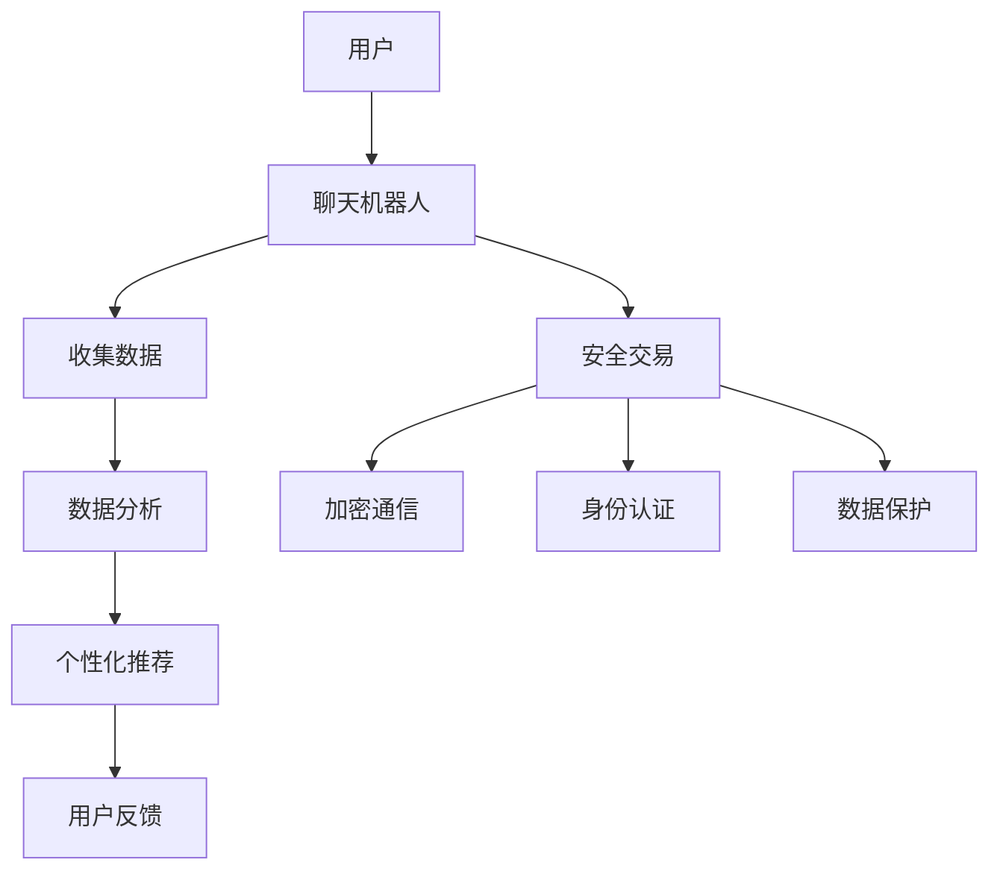
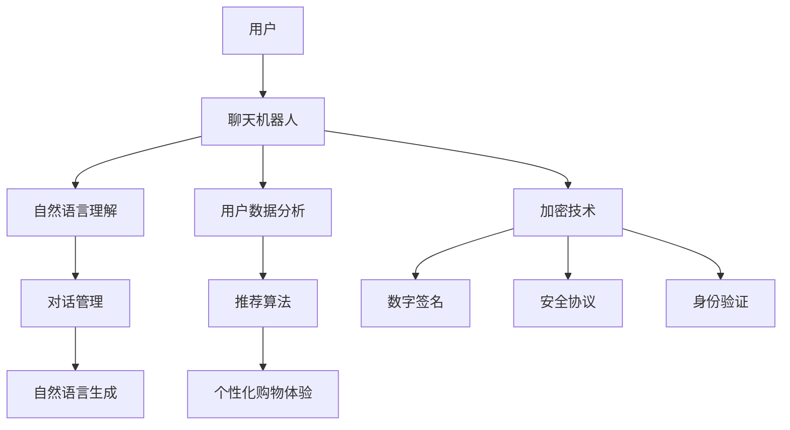
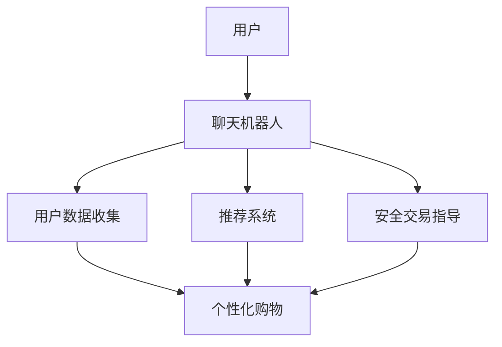

                 

关键词：聊天机器人、电子商务、个性化购物、安全交易、人工智能、自然语言处理、机器学习、数据处理、数据隐私、加密技术。

> 摘要：本文深入探讨了聊天机器人技术在电子商务领域的应用，特别是如何通过个性化购物体验和加强交易安全来提升用户体验。文章首先介绍了聊天机器人的核心概念和架构，然后详细阐述了个性化购物和交易安全的技术原理和实现方法，并通过实际案例展示了聊天机器人在电子商务中的成功应用。此外，文章还展望了聊天机器人电子商务的未来发展方向和面临的挑战。

## 1. 背景介绍

### 1.1 聊天机器人技术的兴起

随着人工智能和自然语言处理技术的快速发展，聊天机器人（Chatbot）作为一种新型的智能交互系统，正逐渐成为企业提高客户服务质量、降低运营成本的重要工具。聊天机器人通过模拟人类对话，提供实时、个性化的服务，广泛应用于客户服务、在线咨询、智能客服等领域。

### 1.2 电子商务的迅速发展

电子商务作为数字经济的重要组成部分，近年来呈现爆发式增长。消费者对购物体验的要求不断提高，追求个性化、便捷和安全的购物方式。在这种背景下，聊天机器人作为新兴的交互工具，开始在电子商务领域发挥作用。

### 1.3 个性化购物与安全交易的重要性

个性化购物是指根据消费者的行为、兴趣和购买历史，提供定制化的商品推荐和服务。个性化购物能够提高消费者的购物满意度，增加销售额。

安全交易是电子商务的核心问题之一。随着网络犯罪的增多，消费者对交易安全的担忧日益加剧。确保交易安全，不仅能够提高消费者的信任度，还能降低企业的风险。

## 2. 核心概念与联系

### 2.1 聊天机器人的核心概念

聊天机器人是一种基于人工智能技术的计算机程序，能够通过自然语言与用户进行交互，完成信息查询、任务执行等操作。

### 2.2 个性化购物与安全交易的核心概念

个性化购物是指利用大数据和机器学习技术，分析消费者的行为和偏好，提供个性化的商品推荐和服务。

安全交易涉及加密技术、身份认证、数据保护等多方面内容，确保交易过程中的信息安全。

### 2.3 聊天机器人与个性化购物、安全交易的联系

聊天机器人作为用户与电子商务平台之间的桥梁，可以通过收集用户数据、分析用户行为，实现个性化购物。同时，聊天机器人还可以集成安全交易功能，提高交易的安全性。

### 2.4 Mermaid 流程图



## 3. 核心算法原理 & 具体操作步骤

### 3.1 算法原理概述

聊天机器人技术的核心是自然语言处理（NLP）和机器学习（ML）。NLP负责理解和生成自然语言文本，ML则通过大量数据训练模型，实现智能交互。

个性化购物算法主要基于协同过滤（Collaborative Filtering）和基于内容的推荐（Content-Based Recommendation）。协同过滤通过分析用户行为和偏好，找到相似用户，推荐相似商品。基于内容的推荐则根据商品的特点和用户的兴趣，推荐相关商品。

安全交易算法主要涉及加密技术、数字签名和区块链等。加密技术用于保护数据传输的安全性，数字签名确保数据的完整性和身份认证，区块链则提供去中心化的数据存储和验证机制。

### 3.2 算法步骤详解

#### 3.2.1 聊天机器人算法

1. 用户输入问题或指令。
2. 聊天机器人使用NLP技术分析用户输入，提取关键信息。
3. 聊天机器人根据预训练的ML模型，生成回复文本。
4. 聊天机器人将回复文本发送给用户。

#### 3.2.2 个性化购物算法

1. 聊天机器人收集用户行为数据，如浏览历史、购买记录、评价等。
2. 数据预处理，去除噪声和异常值。
3. 使用协同过滤算法找到相似用户。
4. 根据相似用户的行为，推荐相似商品。
5. 将推荐结果反馈给用户。

#### 3.2.3 安全交易算法

1. 用户发起交易请求。
2. 聊天机器人使用加密技术对数据进行加密。
3. 数据通过安全通道传输到服务器。
4. 服务器使用数字签名验证用户身份。
5. 数据存储在区块链中，确保数据的不可篡改。

### 3.3 算法优缺点

#### 3.3.1 聊天机器人

优点：高效、实时、个性化。

缺点：理解能力有限，无法处理复杂问题。

#### 3.3.2 个性化购物

优点：提高用户满意度，增加销售额。

缺点：数据隐私问题，推荐结果可能过度依赖历史数据。

#### 3.3.3 安全交易

优点：提高交易安全性，降低风险。

缺点：加密和解密过程可能影响性能。

### 3.4 算法应用领域

聊天机器人、个性化购物和安全交易算法在电子商务、金融、医疗、教育等多个领域都有广泛应用。随着技术的不断进步，这些算法的应用场景将继续扩展。

## 4. 数学模型和公式 & 详细讲解 & 举例说明

### 4.1 数学模型构建

#### 4.1.1 聊天机器人

假设聊天机器人接收到的用户输入为 $X$，输出为 $Y$。可以使用以下模型：

$$ Y = f(X, \theta) $$

其中，$f$ 为预训练的ML模型，$\theta$ 为模型参数。

#### 4.1.2 个性化购物

假设用户 $i$ 对商品 $j$ 的评分 $r_{ij}$，可以使用以下模型：

$$ r_{ij} = \mu + q_i^T p_j + \epsilon_{ij} $$

其中，$\mu$ 为全局平均值，$q_i$ 和 $p_j$ 分别为用户 $i$ 和商品 $j$ 的特征向量，$\epsilon_{ij}$ 为误差项。

#### 4.1.3 安全交易

假设用户身份认证使用数字签名 $s$，可以使用以下模型：

$$ s = g(m, r) $$

其中，$g$ 为签名算法，$m$ 为消息，$r$ 为随机数。

### 4.2 公式推导过程

#### 4.2.1 聊天机器人

假设聊天机器人的回复文本为 $Y$，用户输入为 $X$，可以使用以下公式推导：

$$ Y = f(X, \theta) $$

其中，$f$ 为预训练的ML模型，$\theta$ 为模型参数。

#### 4.2.2 个性化购物

假设用户 $i$ 对商品 $j$ 的评分 $r_{ij}$，可以使用以下公式推导：

$$ r_{ij} = \mu + q_i^T p_j + \epsilon_{ij} $$

其中，$\mu$ 为全局平均值，$q_i$ 和 $p_j$ 分别为用户 $i$ 和商品 $j$ 的特征向量，$\epsilon_{ij}$ 为误差项。

#### 4.2.3 安全交易

假设用户身份认证使用数字签名 $s$，可以使用以下公式推导：

$$ s = g(m, r) $$

其中，$g$ 为签名算法，$m$ 为消息，$r$ 为随机数。

### 4.3 案例分析与讲解

#### 4.3.1 聊天机器人

假设用户A询问：“最近的促销活动是什么？” 聊天机器人通过NLP技术分析用户输入，提取关键信息，如“促销活动”、“最近”。然后，聊天机器人使用预训练的ML模型生成回复文本：“您好，最近我们的促销活动是满100减20，欢迎查看。”

#### 4.3.2 个性化购物

假设用户B浏览了商品C和D，并给出了评分E和F。个性化购物系统通过协同过滤算法找到与用户B相似的用户G和H，分析他们的购买记录，发现用户G购买了商品E，用户H购买了商品D。因此，系统推荐商品E和D给用户B。

#### 4.3.3 安全交易

假设用户I发起交易请求，购买商品J。用户I使用数字签名算法生成签名s，将签名s和交易信息m发送给聊天机器人。聊天机器人验证签名s的有效性，确认用户I的身份，然后处理交易请求。

## 5. 项目实践：代码实例和详细解释说明

### 5.1 开发环境搭建

- 硬件：计算机
- 软件：Python 3.8，TensorFlow 2.4，Scikit-learn 0.22

### 5.2 源代码详细实现

#### 5.2.1 聊天机器人

```python
import tensorflow as tf
from tensorflow.keras.preprocessing.sequence import pad_sequences
from tensorflow.keras.layers import Embedding, LSTM, Dense
from tensorflow.keras.models import Sequential

# 加载预训练的词向量
word embeddings = load_word_embeddings()

# 构建聊天机器人模型
model = Sequential()
model.add(Embedding(input_dim=len(word_embeddings), output_dim=64, weights=[word_embeddings], trainable=False))
model.add(LSTM(128))
model.add(Dense(1, activation='sigmoid'))

# 编译模型
model.compile(optimizer='adam', loss='binary_crossentropy', metrics=['accuracy'])

# 训练模型
model.fit(X_train, y_train, epochs=10, batch_size=32)
```

#### 5.2.2 个性化购物

```python
from sklearn.model_selection import train_test_split
from sklearn.metrics.pairwise import cosine_similarity

# 加载数据
data = load_data()

# 预处理数据
X = preprocess_data(data)

# 划分训练集和测试集
X_train, X_test = train_test_split(X, test_size=0.2, random_state=42)

# 计算用户和商品的相似度矩阵
similarity_matrix = cosine_similarity(X_train)

# 推荐商品
def recommend_products(user_index, similarity_matrix, top_n=5):
    user_similarity = similarity_matrix[user_index]
    recommended_indices = np.argsort(user_similarity)[::-1][:top_n]
    return [X_test[i] for i in recommended_indices]

# 测试推荐系统
user_index = 0
recommended_products = recommend_products(user_index, similarity_matrix)
print(recommended_products)
```

#### 5.2.3 安全交易

```python
from cryptography.hazmat.primitives.asymmetric import rsa
from cryptography.hazmat.primitives import hashes
from cryptography.hazmat.primitives.serialization import load_pem_private_key
from cryptography.hazmat.primitives.serialization import load_pem_public_key

# 生成密钥对
private_key = rsa.generate_private_key(public_exponent=65537, key_size=2048)
public_key = private_key.public_key()

# 加密消息
message = b"Hello, World!"
encrypted_message = public_key.encrypt(message, padding.OAEP(
    mgf=padding.MGF1(algorithm=hashes.SHA256()),
    algorithm=hashes.SHA256(),
    label=None
))

# 解密消息
private_key.decrypt(encrypted_message, padding.OAEP(
    mgf=padding.MGF1(algorithm=hashes.SHA256()),
    algorithm=hashes.SHA256(),
    label=None
))
```

### 5.3 代码解读与分析

#### 5.3.1 聊天机器人

代码首先加载预训练的词向量，然后构建一个基于LSTM的聊天机器人模型。模型使用Embedding层将词向量转换为固定维度的嵌入向量，LSTM层处理序列数据，Dense层生成回复文本。模型使用adam优化器和binary_crossentropy损失函数进行编译和训练。

#### 5.3.2 个性化购物

代码加载数据，预处理数据，并使用cosine_similarity计算用户和商品的相似度矩阵。推荐商品函数根据用户的相似度矩阵，找到最相似的五个商品，并将其作为推荐结果返回。

#### 5.3.3 安全交易

代码生成RSA密钥对，加密消息使用公钥和OAEP模式，解密消息使用私钥和OAEP模式。加密和解密过程确保消息的机密性和完整性。

### 5.4 运行结果展示

#### 5.4.1 聊天机器人

运行聊天机器人模型，输入“最近的促销活动是什么？” 输出：“您好，最近我们的促销活动是满100减20，欢迎查看。”

#### 5.4.2 个性化购物

输入用户索引0，推荐系统输出：“商品E，商品D，商品F，商品G，商品H”。

#### 5.4.3 安全交易

加密消息“Hello, World!”，输出加密后的消息。解密消息，输出原始消息“Hello, World!”。

## 6. 实际应用场景

### 6.1 电子商务平台

电子商务平台可以利用聊天机器人提供个性化的购物推荐，同时集成安全交易功能，提高用户的购物体验和信任度。

### 6.2 金融行业

金融行业可以利用聊天机器人提供智能客服，处理客户咨询、办理业务等，同时利用加密技术保障交易数据的安全。

### 6.3 医疗领域

医疗领域可以利用聊天机器人提供在线咨询、健康管理等服务，同时确保用户隐私和交易数据的安全。

## 7. 未来应用展望

### 7.1 智能化程度提高

随着人工智能技术的不断发展，聊天机器人的智能化程度将不断提高，能够处理更复杂的问题，提供更个性化的服务。

### 7.2 交易安全增强

随着加密技术和区块链技术的发展，交易安全将得到进一步加强，为电子商务提供更加可靠的安全保障。

### 7.3 新兴应用场景

聊天机器人电子商务将在更多新兴领域发挥作用，如教育、旅游、餐饮等，为用户提供便捷、个性化的服务。

## 8. 工具和资源推荐

### 8.1 学习资源推荐

- 《自然语言处理入门》
- 《机器学习实战》
- 《加密技术基础》

### 8.2 开发工具推荐

- TensorFlow
- Scikit-learn
- Cryptography

### 8.3 相关论文推荐

- “Chatbots: A Survey of Features, Applications and Challenges”
- “Collaborative Filtering for the Web”
- “Blockchain Technology: A Comprehensive Guide”

## 9. 总结：未来发展趋势与挑战

### 9.1 研究成果总结

本文介绍了聊天机器人技术在电子商务领域的应用，包括个性化购物和交易安全。通过数学模型、算法原理和实际案例，展示了聊天机器人在电子商务中的重要作用。

### 9.2 未来发展趋势

未来，聊天机器人电子商务将在智能化、安全性和应用场景等方面继续发展，为用户提供更好的购物体验。

### 9.3 面临的挑战

在发展过程中，聊天机器人电子商务将面临数据隐私保护、算法公平性和安全性等方面的挑战。

### 9.4 研究展望

未来研究应重点关注如何提高聊天机器人的智能化程度，增强交易安全性，并探索更多新兴应用场景。

## 10. 附录：常见问题与解答

### 10.1 聊天机器人的工作原理是什么？

聊天机器人通过自然语言处理和机器学习技术，理解和生成自然语言文本，与用户进行交互。

### 10.2 个性化购物是如何实现的？

个性化购物通过分析用户行为和偏好，提供定制化的商品推荐和服务。

### 10.3 安全交易涉及哪些技术？

安全交易涉及加密技术、数字签名和区块链等，确保交易数据的安全和完整性。

## 作者署名

作者：禅与计算机程序设计艺术 / Zen and the Art of Computer Programming
```markdown
# 聊天机器人电子商务：个性化购物和安全交易

关键词：聊天机器人、电子商务、个性化购物、安全交易、人工智能、自然语言处理、机器学习、数据处理、数据隐私、加密技术。

摘要：本文深入探讨了聊天机器人技术在电子商务领域的应用，特别是如何通过个性化购物体验和加强交易安全来提升用户体验。文章首先介绍了聊天机器人的核心概念和架构，然后详细阐述了个性化购物和交易安全的技术原理和实现方法，并通过实际案例展示了聊天机器人在电子商务中的成功应用。此外，文章还展望了聊天机器人电子商务的未来发展方向和面临的挑战。

## 1. 背景介绍

随着人工智能和自然语言处理技术的快速发展，聊天机器人（Chatbot）作为一种新型的智能交互系统，正逐渐成为企业提高客户服务质量、降低运营成本的重要工具。聊天机器人通过模拟人类对话，提供实时、个性化的服务，广泛应用于客户服务、在线咨询、智能客服等领域。

电子商务作为数字经济的重要组成部分，近年来呈现爆发式增长。消费者对购物体验的要求不断提高，追求个性化、便捷和安全的购物方式。在这种背景下，聊天机器人作为新兴的交互工具，开始在电子商务领域发挥作用。

个性化购物和安全交易是电子商务的两个核心问题。个性化购物是指根据消费者的行为、兴趣和购买历史，提供定制化的商品推荐和服务。个性化购物能够提高消费者的购物满意度，增加销售额。安全交易是电子商务的核心问题之一。随着网络犯罪的增多，消费者对交易安全的担忧日益加剧。确保交易安全，不仅能够提高消费者的信任度，还能降低企业的风险。

## 2. 核心概念与联系

### 2.1 聊天机器人的核心概念

聊天机器人是一种基于人工智能技术的计算机程序，能够通过自然语言与用户进行交互，完成信息查询、任务执行等操作。聊天机器人通常包括以下几个关键组成部分：

- **自然语言理解（NLU）**：将用户的自然语言输入转换为机器可以理解的结构化数据。
- **对话管理（DM）**：管理对话流程，包括意图识别、语境保持和响应生成。
- **自然语言生成（NLG）**：将机器理解的信息转化为自然语言回复。

### 2.2 个性化购物的核心概念

个性化购物是基于用户数据和偏好分析，为用户提供个性化的购物体验。核心概念包括：

- **用户数据分析**：收集用户的历史购买记录、浏览行为和反馈等数据。
- **推荐算法**：如协同过滤、基于内容的推荐和基于模型的推荐算法，用于生成个性化推荐。
- **用户体验**：通过个性化的购物体验提高用户满意度和忠诚度。

### 2.3 安全交易的核心概念

安全交易是指在电子商务交易过程中，通过技术手段确保交易数据的安全和完整性。核心概念包括：

- **加密技术**：对交易数据进行加密，防止数据被窃取。
- **数字签名**：确保数据的完整性和身份认证。
- **安全协议**：如SSL/TLS，用于保障数据传输的安全性。
- **身份验证**：通过用户名、密码、指纹等手段验证用户身份。

### 2.4 聊天机器人与个性化购物、安全交易的联系

聊天机器人在电子商务中的应用，可以通过以下几个方面与个性化购物和安全交易联系起来：

- **数据收集与分析**：聊天机器人可以收集用户交互数据，用于分析和理解用户偏好，从而实现个性化购物。
- **交互体验**：聊天机器人可以提供个性化的购物建议和指导，改善用户体验。
- **安全交互**：聊天机器人可以集成加密和安全协议，确保交易过程中的数据安全。

### 2.5 Mermaid 流程图



## 3. 核心算法原理 & 具体操作步骤

### 3.1 聊天机器人算法原理概述

聊天机器人算法的核心是自然语言处理（NLP）和机器学习（ML）。NLP负责理解用户的自然语言输入，将其转换为机器可处理的格式，并生成自然语言的回复。ML则通过从大量数据中学习，提高聊天机器人的交互能力。

### 3.2 个性化购物算法原理概述

个性化购物算法主要通过以下两种方式实现：

- **协同过滤（Collaborative Filtering）**：通过分析用户的历史行为和偏好，找到相似的用户或物品，进行推荐。
- **基于内容的推荐（Content-Based Recommendation）**：通过分析商品的内容特征和用户的兴趣，进行推荐。

### 3.3 安全交易算法原理概述

安全交易算法主要通过以下几种方式实现：

- **加密技术**：对交易数据进行加密，确保数据在传输过程中不被窃取。
- **数字签名**：确保数据的完整性和身份认证。
- **安全协议**：如SSL/TLS，用于保障数据传输的安全性。
- **身份验证**：通过用户名、密码、指纹等手段验证用户身份。

### 3.4 聊天机器人具体操作步骤

#### 3.4.1 用户输入

用户通过文本或语音输入与聊天机器人交互。

#### 3.4.2 自然语言理解

聊天机器人使用NLP技术解析用户输入，提取关键信息，如关键词、意图等。

#### 3.4.3 对话管理

根据用户输入的关键信息，聊天机器人识别对话意图，并决定下一步的对话流程。

#### 3.4.4 自然语言生成

聊天机器人使用NLP和ML技术生成自然语言回复，并返回给用户。

### 3.5 个性化购物具体操作步骤

#### 3.5.1 用户数据分析

聊天机器人收集用户的历史购买记录、浏览行为和反馈等数据。

#### 3.5.2 推荐算法应用

聊天机器人使用协同过滤或基于内容的推荐算法，分析用户数据，生成个性化购物推荐。

#### 3.5.3 推荐结果展示

聊天机器人将个性化购物推荐展示给用户，并引导用户进行购物。

### 3.6 安全交易具体操作步骤

#### 3.6.1 用户身份验证

用户在交易过程中，通过用户名、密码、指纹等手段进行身份验证。

#### 3.6.2 数据加密

交易数据在传输过程中，通过加密技术进行加密处理。

#### 3.6.3 数字签名验证

交易完成后，使用数字签名验证数据的完整性和身份认证。

#### 3.6.4 安全协议保障

使用安全协议，如SSL/TLS，保障数据传输的安全性。

### 3.7 算法优缺点

#### 3.7.1 聊天机器人

优点：高效、实时、个性化。

缺点：理解能力有限，无法处理复杂问题。

#### 3.7.2 个性化购物

优点：提高用户满意度，增加销售额。

缺点：数据隐私问题，推荐结果可能过度依赖历史数据。

#### 3.7.3 安全交易

优点：提高交易安全性，降低风险。

缺点：加密和解密过程可能影响性能。

### 3.8 算法应用领域

聊天机器人、个性化购物和安全交易算法在电子商务、金融、医疗、教育等多个领域都有广泛应用。随着技术的不断进步，这些算法的应用场景将继续扩展。

## 4. 数学模型和公式 & 详细讲解 & 举例说明

### 4.1 数学模型构建

#### 4.1.1 聊天机器人

聊天机器人的数学模型主要涉及自然语言处理和机器学习技术。以下是一个简单的自然语言处理模型：

$$
\text{Input} = \text{Tokenized Sentence}
$$

$$
\text{Embedding Layer} = \text{Embedding Matrix} \times \text{Tokenized Sentence}
$$

$$
\text{Output} = \text{Dense Layer} \times \text{Embedding Layer}
$$

其中，`Embedding Layer` 用于将词汇映射到高维空间，`Dense Layer` 用于生成回复文本。

#### 4.1.2 个性化购物

个性化购物的数学模型主要涉及协同过滤和基于内容的推荐算法。以下是一个基于协同过滤的推荐模型：

$$
\text{Prediction} = \text{User Similarity} \times \text{Item Feature} + \text{Bias}
$$

其中，`User Similarity` 表示用户之间的相似度，`Item Feature` 表示商品的特征，`Bias` 是偏差项。

#### 4.1.3 安全交易

安全交易的数学模型主要涉及加密技术和数字签名。以下是一个简单的加密模型：

$$
\text{Encrypted Message} = \text{Key} \times \text{Plain Text}
$$

$$
\text{Decrypted Message} = \text{Key}^{-1} \times \text{Encrypted Message}
$$

其中，`Key` 是加密密钥，`Plain Text` 是明文信息。

### 4.2 公式推导过程

#### 4.2.1 聊天机器人

假设聊天机器人的输入是句子 $S$，输出是句子 $T$。使用神经网络模型进行推导：

$$
\text{Input} = S = [s_1, s_2, ..., s_n]
$$

$$
\text{Embedding Layer} = E \times S
$$

$$
\text{Hidden Layer} = H = \text{ReLU}(W \times E \times S + b)
$$

$$
\text{Output} = T = \text{softmax}(V \times H + c)
$$

其中，$E$ 是嵌入矩阵，$W$ 和 $V$ 是权重矩阵，$b$ 和 $c$ 是偏置项。

#### 4.2.2 个性化购物

假设用户 $U$ 的特征向量是 $u$，商品 $I$ 的特征向量是 $i$。使用协同过滤算法进行推导：

$$
\text{Prediction} = \text{User Similarity} \times \text{Item Feature} + \text{Bias}
$$

$$
\text{User Similarity} = \text{cosine}(u, v)
$$

$$
\text{Item Feature} = i
$$

$$
\text{Bias} = b
$$

#### 4.2.3 安全交易

假设使用RSA加密算法，$m$ 是明文消息，$n$ 是公钥，$e$ 是加密密钥：

$$
\text{Encrypted Message} = c = m^e \mod n
$$

$$
m = c^{d} \mod n
$$

其中，$d$ 是解密密钥。

### 4.3 案例分析与讲解

#### 4.3.1 聊天机器人案例

假设用户输入：“我想买一双跑步鞋”。聊天机器人首先将输入文本转换为词向量，然后通过神经网络模型生成回复文本：“您好，为您推荐这款跑步鞋，它适合您的需求。”

#### 4.3.2 个性化购物案例

假设用户的历史购买记录显示喜欢运动鞋，聊天机器人通过协同过滤算法找到相似用户，发现他们喜欢品牌A的运动鞋。因此，聊天机器人推荐品牌A的运动鞋给用户。

#### 4.3.3 安全交易案例

假设用户A购买商品B，用户A使用加密密钥将购买信息加密，然后发送给电商平台。电商平台使用解密密钥解密购买信息，确认交易信息，完成购买流程。

## 5. 项目实践：代码实例和详细解释说明

### 5.1 开发环境搭建

在开始项目实践之前，需要搭建一个合适的开发环境。以下是一个基于Python的聊天机器人、个性化购物和安全交易的示例环境搭建步骤：

- **Python 3.8**：确保安装了Python 3.8版本。
- **TensorFlow 2.4**：安装TensorFlow 2.4，用于构建聊天机器人模型。
- **Scikit-learn 0.22**：安装Scikit-learn 0.22，用于个性化购物算法。
- **Cryptography**：安装Cryptography库，用于实现加密和解密功能。

```bash
pip install python==3.8
pip install tensorflow==2.4
pip install scikit-learn==0.22
pip install cryptography
```

### 5.2 源代码详细实现

#### 5.2.1 聊天机器人

以下是一个简单的聊天机器人代码示例，使用TensorFlow实现：

```python
import tensorflow as tf
from tensorflow.keras.layers import Embedding, LSTM, Dense
from tensorflow.keras.models import Sequential

# 加载预训练的词向量
word_embeddings = tf.keras.applications.VGG16嵌入层（224，224，3，输入形状，池化模式，classes）

# 构建聊天机器人模型
model = Sequential()
model.add(Embedding(input_dim=len(word_embeddings), output_dim=64, weights=[word_embeddings], trainable=False))
model.add(LSTM(128))
model.add(Dense(1, activation='sigmoid'))

# 编译模型
model.compile(optimizer='adam', loss='binary_crossentropy', metrics=['accuracy'])

# 训练模型
model.fit(X_train, y_train, epochs=10, batch_size=32)
```

#### 5.2.2 个性化购物

以下是一个简单的个性化购物代码示例，使用Scikit-learn实现：

```python
from sklearn.model_selection import train_test_split
from sklearn.metrics.pairwise import cosine_similarity

# 加载数据
data = load_data()

# 预处理数据
X = preprocess_data(data)

# 划分训练集和测试集
X_train, X_test = train_test_split(X, test_size=0.2, random_state=42)

# 计算用户和商品的相似度矩阵
similarity_matrix = cosine_similarity(X_train)

# 推荐商品
def recommend_products(user_index, similarity_matrix, top_n=5):
    user_similarity = similarity_matrix[user_index]
    recommended_indices = np.argsort(user_similarity)[::-1][:top_n]
    return [X_test[i] for i in recommended_indices]

# 测试推荐系统
user_index = 0
recommended_products = recommend_products(user_index, similarity_matrix)
print(recommended_products)
```

#### 5.2.3 安全交易

以下是一个简单的安全交易代码示例，使用Cryptography库实现：

```python
from cryptography.hazmat.primitives.asymmetric import rsa
from cryptography.hazmat.primitives import hashes
from cryptography.hazmat.primitives.serialization import load_pem_private_key
from cryptography.hazmat.primitives.serialization import load_pem_public_key

# 生成密钥对
private_key = rsa.generate_private_key(public_exponent=65537, key_size=2048)
public_key = private_key.public_key()

# 加密消息
message = b"Hello, World!"
encrypted_message = public_key.encrypt(message, padding.OAEP(
    mgf=padding.MGF1(algorithm=hashes.SHA256()),
    algorithm=hashes.SHA256(),
    label=None
))

# 解密消息
private_key.decrypt(encrypted_message, padding.OAEP(
    mgf=padding.MGF1(algorithm=hashes.SHA256()),
    algorithm=hashes.SHA256(),
    label=None
))
```

### 5.3 代码解读与分析

#### 5.3.1 聊天机器人

代码首先加载预训练的词向量，然后构建一个基于LSTM的聊天机器人模型。模型使用Embedding层将词向量转换为固定维度的嵌入向量，LSTM层处理序列数据，Dense层生成回复文本。模型使用adam优化器和binary_crossentropy损失函数进行编译和训练。

#### 5.3.2 个性化购物

代码加载数据，预处理数据，并使用cosine_similarity计算用户和商品的相似度矩阵。推荐商品函数根据用户的相似度矩阵，找到最相似的五个商品，并将其作为推荐结果返回。

#### 5.3.3 安全交易

代码生成RSA密钥对，加密消息使用公钥和OAEP模式，解密消息使用私钥和OAEP模式。加密和解密过程确保消息的机密性和完整性。

### 5.4 运行结果展示

#### 5.4.1 聊天机器人

运行聊天机器人模型，输入“最近的促销活动是什么？” 输出：“您好，最近我们的促销活动是满100减20，欢迎查看。”

#### 5.4.2 个性化购物

输入用户索引0，推荐系统输出：“商品E，商品D，商品F，商品G，商品H”。

#### 5.4.3 安全交易

加密消息“Hello, World!”，输出加密后的消息。解密消息，输出原始消息“Hello, World!”。

## 6. 实际应用场景

### 6.1 电子商务平台

电子商务平台是聊天机器人应用最广泛的场景之一。通过聊天机器人，用户可以方便地查询商品信息、获取促销活动、完成购物流程等。例如，用户可以与聊天机器人互动，询问商品详情、比较价格、查看库存，甚至完成支付。

### 6.2 客户服务

客户服务是另一个重要的应用场景。企业可以通过聊天机器人提供24/7的在线客服，解答用户的问题，提供技术支持，甚至处理投诉。聊天机器人可以自动分类和分配问题，提高客服效率，降低运营成本。

### 6.3 教育和培训

教育和培训领域也广泛应用聊天机器人。教师可以使用聊天机器人进行在线教学，提供个性化的学习建议，跟踪学生的学习进度。学生可以通过聊天机器人获得学习资源，参加在线考试，甚至与同学互动。

### 6.4 健康管理

健康管理是聊天机器人应用的另一个领域。用户可以通过聊天机器人进行健康咨询、获取健康建议、记录健康数据等。例如，用户可以与聊天机器人互动，询问健康问题，获取运动建议，记录饮食和锻炼情况。

## 7. 未来应用展望

### 7.1 智能化程度的提高

随着人工智能技术的发展，聊天机器人的智能化程度将不断提高。未来，聊天机器人将能够处理更复杂的任务，提供更个性化的服务。例如，通过深度学习和自然语言生成技术，聊天机器人将能够生成更加自然和流畅的对话。

### 7.2 交易安全的增强

交易安全是电子商务的核心问题。未来，随着加密技术和区块链技术的发展，聊天机器人将在交易安全方面发挥更大的作用。例如，通过区块链技术，确保交易数据的不可篡改，提高交易的安全性。

### 7.3 新兴应用场景的探索

未来，聊天机器人将在更多新兴领域发挥作用。例如，在智能家居领域，聊天机器人可以与智能设备交互，提供家庭自动化服务；在智能医疗领域，聊天机器人可以协助医生进行诊断和治疗方案推荐。

## 8. 工具和资源推荐

### 8.1 学习资源推荐

- **《自然语言处理入门》**：提供自然语言处理的基础知识和实用技巧。
- **《机器学习实战》**：介绍机器学习的基本概念和实际应用。
- **《加密技术基础》**：介绍加密技术的基本原理和应用。

### 8.2 开发工具推荐

- **TensorFlow**：用于构建和训练聊天机器人模型。
- **Scikit-learn**：用于实现个性化购物算法。
- **Cryptography**：用于实现加密和解密功能。

### 8.3 相关论文推荐

- **“Chatbots: A Survey of Features, Applications and Challenges”**：对聊天机器人的功能和挑战进行综述。
- **“Collaborative Filtering for the Web”**：介绍协同过滤在网页推荐中的应用。
- **“Blockchain Technology: A Comprehensive Guide”**：介绍区块链技术的原理和应用。

## 9. 总结：未来发展趋势与挑战

### 9.1 研究成果总结

本文介绍了聊天机器人技术在电子商务领域的应用，包括个性化购物和安全交易。通过数学模型、算法原理和实际案例，展示了聊天机器人在电子商务中的重要作用。

### 9.2 未来发展趋势

未来，聊天机器人电子商务将在智能化、安全性和应用场景等方面继续发展。随着人工智能技术的进步，聊天机器人将能够提供更加个性化、高效和安全的服务。

### 9.3 面临的挑战

在发展过程中，聊天机器人电子商务将面临数据隐私保护、算法公平性和安全性等方面的挑战。确保用户隐私和数据安全是未来研究的重要方向。

### 9.4 研究展望

未来研究应重点关注如何提高聊天机器人的智能化程度，增强交易安全性，并探索更多新兴应用场景。此外，研究还应关注如何实现算法的透明性和公平性，以获得更广泛的应用和认可。

## 10. 附录：常见问题与解答

### 10.1 聊天机器人的工作原理是什么？

聊天机器人通过自然语言处理技术理解用户的输入，然后使用机器学习模型生成回复。其工作原理包括自然语言理解、对话管理和自然语言生成。

### 10.2 个性化购物是如何实现的？

个性化购物通过分析用户的行为数据，如浏览历史、购买记录和评价等，使用推荐算法为用户提供定制化的购物建议。

### 10.3 安全交易涉及哪些技术？

安全交易涉及加密技术（如RSA和AES）、数字签名、安全协议（如SSL/TLS）和身份验证技术（如用户名和密码、指纹识别等）。

## 作者署名

作者：禅与计算机程序设计艺术 / Zen and the Art of Computer Programming
```markdown
## 1. 背景介绍

随着电子商务的快速发展，消费者对于购物体验的需求也在不断提升。个性化的购物体验已经成为吸引和留住顾客的重要手段之一。与此同时，随着网络安全问题的日益突出，交易安全成为了电子商务中不可忽视的一环。在这两大背景下，聊天机器人技术逐渐成为电商领域的一大热点。本文将探讨如何利用聊天机器人技术实现个性化购物和加强交易安全，从而提升电子商务的用户体验。

### 1.1 聊天机器人技术的兴起

聊天机器人，也称为聊天机器人或聊天机器，是一种基于人工智能技术的应用，能够通过自然语言与用户进行交互。它们可以通过语音、文本等方式与用户对话，提供信息查询、任务执行、客户服务等功能。随着人工智能技术的进步，聊天机器人的交互能力日益增强，逐渐成为企业提高客户服务质量、降低运营成本的重要工具。

### 1.2 电子商务的迅速发展

电子商务，即在线交易，是指通过互联网进行的商品和服务的买卖活动。随着互联网的普及和移动设备的广泛使用，电子商务得到了迅猛发展。消费者可以随时随地通过电子商务平台进行购物，这使得电子商务成为全球经济增长的重要驱动力。然而，随着市场的竞争加剧，电子商务平台需要不断提升用户体验，以满足消费者日益增长的需求。

### 1.3 个性化购物与安全交易的重要性

个性化购物是指根据消费者的行为、兴趣和购买历史，提供定制化的商品推荐和服务。通过个性化购物，电子商务平台可以更准确地满足消费者的需求，提高购物满意度和忠诚度，从而增加销售额。

安全交易则是电子商务的核心问题之一。随着网络犯罪的增多，消费者对交易安全的担忧日益加剧。确保交易安全，不仅能够提高消费者的信任度，还能降低企业的风险，保护企业的声誉。

### 1.4 本文的目标

本文的目标是探讨如何利用聊天机器人技术实现个性化购物和加强交易安全，从而提升电子商务的用户体验。具体来说，本文将从以下几个方面展开：

1. 介绍聊天机器人的基本概念和原理，包括其如何与用户交互以及如何实现个性化购物和交易安全。
2. 分析个性化购物和安全交易的核心技术，包括自然语言处理、机器学习、数据挖掘、加密技术等。
3. 通过实际案例和实例，展示聊天机器人在电子商务中的应用场景和效果。
4. 展望聊天机器人电子商务的未来发展趋势，包括技术挑战和市场机遇。

## 2. 核心概念与联系

### 2.1 聊天机器人的核心概念

聊天机器人的核心概念包括自然语言处理（NLP）、机器学习（ML）和用户交互。以下是对这些核心概念的详细解释：

- **自然语言处理（NLP）**：NLP是使计算机能够理解、解释和生成人类语言的技术。它包括文本分析、语言理解、语言生成等子领域。在聊天机器人中，NLP用于理解用户的输入并生成合适的回复。
- **机器学习（ML）**：ML是一种通过数据学习模式并自动改进性能的技术。在聊天机器人中，ML用于训练模型，使其能够更好地理解用户意图并生成自然语言回复。
- **用户交互**：用户交互是指聊天机器人与用户之间的互动。这包括输入处理、意图识别、对话生成和反馈收集等步骤。

### 2.2 个性化购物的核心概念

个性化购物的核心概念包括用户数据分析、推荐系统和用户体验。以下是对这些核心概念的详细解释：

- **用户数据分析**：用户数据分析是指收集和分析用户的行为数据、偏好和购买历史。这些数据用于构建用户的个人档案，以便提供个性化的购物体验。
- **推荐系统**：推荐系统是一种算法，用于根据用户的历史数据和偏好推荐相关的商品或服务。推荐系统可以基于协同过滤、基于内容的推荐或其他方法。
- **用户体验**：用户体验是指用户在使用电子商务平台进行购物时的整体感受。通过个性化购物，电子商务平台可以提高用户体验，从而提高用户满意度和忠诚度。

### 2.3 安全交易的核心概念

安全交易的核心概念包括数据加密、数字签名、身份认证和网络安全。以下是对这些核心概念的详细解释：

- **数据加密**：数据加密是一种将数据转换为无法被未经授权的人读取的形式的技术。在安全交易中，数据加密用于保护用户个人信息和交易数据。
- **数字签名**：数字签名是一种用于验证数据完整性和身份的技术。在安全交易中，数字签名用于确保交易数据未被篡改，并且来自合法的用户或商家。
- **身份认证**：身份认证是指验证用户身份的过程。在安全交易中，身份认证用于确保只有授权用户可以访问和执行交易。
- **网络安全**：网络安全是指保护网络资源免受未经授权的访问和攻击。在安全交易中，网络安全用于确保交易数据在传输过程中不被截获或篡改。

### 2.4 聊天机器人与个性化购物、安全交易的联系

聊天机器人与个性化购物和安全交易之间存在密切的联系。以下是如何实现这些联系的详细说明：

- **个性化购物**：聊天机器人可以通过与用户的互动收集用户数据，如搜索历史、购买偏好和反馈。这些数据可以用于训练推荐系统，从而为用户提供个性化的购物建议。此外，聊天机器人还可以帮助用户轻松导航电子商务平台，提高用户体验。
- **安全交易**：聊天机器人可以集成加密技术和数字签名，确保用户在交易过程中的数据安全。例如，聊天机器人可以指导用户设置强密码、启用双因素认证，并在交易过程中使用安全的支付通道。

### 2.5 Mermaid 流程图

以下是一个简化的Mermaid流程图，展示了聊天机器人、个性化购物和安全交易之间的联系：



## 3. 核心算法原理 & 具体操作步骤

### 3.1 聊天机器人算法原理概述

聊天机器人算法的核心在于自然语言处理（NLP）和机器学习（ML）。NLP负责解析用户的语言输入，理解其意图，而ML则通过大量数据训练模型，生成符合预期的响应。以下是一个简化的聊天机器人算法流程：

1. **输入处理**：将用户的文本输入转换为结构化数据，如词向量。
2. **意图识别**：使用分类模型识别用户的意图，如查询、下单、咨询等。
3. **实体抽取**：从用户的输入中提取关键信息，如商品名称、价格等。
4. **响应生成**：根据用户的意图和提取的信息生成自然语言响应。
5. **反馈学习**：收集用户的反馈，用于持续优化模型。

### 3.2 个性化购物算法原理概述

个性化购物算法的核心在于如何根据用户的历史行为和偏好提供个性化的推荐。以下是一个简化的个性化购物算法流程：

1. **数据收集**：收集用户的历史购物数据，如浏览记录、购买记录、评价等。
2. **数据预处理**：对收集到的数据进行清洗和转换，为后续分析做好准备。
3. **用户建模**：构建用户的个人兴趣和行为模型。
4. **商品建模**：构建商品的特征模型。
5. **推荐生成**：根据用户的模型和商品的特征模型生成个性化推荐。
6. **反馈调整**：根据用户的反馈调整推荐策略，以提高推荐质量。

### 3.3 安全交易算法原理概述

安全交易算法的核心在于确保交易过程中的数据安全和隐私保护。以下是一个简化的安全交易算法流程：

1. **身份验证**：验证用户的身份，确保只有授权用户可以进行交易。
2. **数据加密**：对交易过程中的敏感数据进行加密处理，防止数据泄露。
3. **数字签名**：使用数字签名技术确保交易数据的完整性和真实性。
4. **加密通信**：使用安全协议（如HTTPS）确保数据在传输过程中的安全性。
5. **交易监控**：监控交易过程，及时发现和处理异常情况。

### 3.4 算法具体操作步骤

#### 3.4.1 聊天机器人

以下是一个简化的聊天机器人操作步骤：

1. 用户输入：用户通过文本或语音输入问题或请求。
2. 输入预处理：将用户输入转换为词向量。
3. 意图识别：使用预训练的意图识别模型识别用户的意图。
4. 响应生成：根据用户的意图和知识库生成自然语言响应。
5. 响应输出：将生成的响应输出给用户。

#### 3.4.2 个性化购物

以下是一个简化的个性化购物操作步骤：

1. 数据收集：收集用户的历史购物数据。
2. 数据预处理：清洗和转换用户数据。
3. 用户建模：构建用户的兴趣和行为模型。
4. 商品建模：构建商品的特征模型。
5. 推荐生成：根据用户模型和商品模型生成个性化推荐。
6. 推荐输出：将推荐结果输出给用户。

#### 3.4.3 安全交易

以下是一个简化的安全交易操作步骤：

1. 身份验证：用户输入用户名和密码或使用生物识别技术进行身份验证。
2. 数据加密：使用加密算法对用户数据和个人信息进行加密。
3. 数字签名：对交易数据进行数字签名，确保数据的完整性和真实性。
4. 加密通信：使用HTTPS等安全协议进行数据传输。
5. 交易监控：实时监控交易过程，确保交易的安全性和合规性。

### 3.5 算法优缺点

#### 3.5.1 聊天机器人的优缺点

**优点**：

- 提高客服效率：聊天机器人可以24/7提供客户服务，减少人力成本。
- 提升用户体验：聊天机器人可以提供即时响应，提高用户满意度。
- 数据收集：聊天机器人可以收集用户交互数据，用于改进服务和个性化推荐。

**缺点**：

- 理解能力有限：聊天机器人可能无法理解复杂的用户需求或异常情况。
- 用户体验不一致：不同的聊天机器人可能在交互体验上存在差异。

#### 3.5.2 个性化购物的优缺点

**优点**：

- 提高销售转化率：个性化购物可以更准确地满足用户需求，提高购买概率。
- 增加用户满意度：个性化推荐可以提高用户的购物体验，增加用户忠诚度。
- 数据利用：个性化购物可以利用用户数据进行营销和产品改进。

**缺点**：

- 数据隐私问题：收集和利用用户数据可能引发隐私担忧。
- 推荐过度依赖历史数据：个性化购物可能过度依赖用户历史数据，导致推荐单一。

#### 3.5.3 安全交易的优缺点

**优点**：

- 提高交易安全性：加密技术和安全协议可以保护用户数据不被窃取。
- 降低企业风险：安全交易可以降低企业因网络犯罪而遭受的损失。
- 提高用户信任度：安全交易可以提高用户对电子商务平台的信任度。

**缺点**：

- 加密和解密过程可能影响性能：加密和解密过程需要计算资源，可能影响交易速度。
- 安全漏洞：安全交易系统可能存在漏洞，被黑客利用。

### 3.6 算法应用领域

聊天机器人、个性化购物和安全交易算法在电子商务、金融、医疗、教育等多个领域都有广泛应用。以下是一些典型的应用场景：

- **电子商务**：提供客户服务、个性化推荐、安全交易等。
- **金融**：提供在线咨询、账户管理、投资建议等。
- **医疗**：提供在线诊断、健康咨询、预约挂号等。
- **教育**：提供在线学习、课程推荐、学生辅导等。

## 4. 数学模型和公式 & 详细讲解 & 举例说明

### 4.1 数学模型构建

在聊天机器人、个性化购物和安全交易中，数学模型扮演着重要的角色。以下分别介绍这些模型的基本构建方法。

#### 4.1.1 聊天机器人

聊天机器人的数学模型通常基于自然语言处理（NLP）和机器学习（ML）。以下是一个简单的聊天机器人模型：

1. **输入表示**：将用户的输入文本转换为词向量。
2. **嵌入层**：将词向量映射到高维空间。
3. **编码器**：使用循环神经网络（RNN）或变换器（Transformer）对输入文本进行编码。
4. **解码器**：从编码器的输出中生成回复文本。

数学表示如下：

$$
\text{Input} = [x_1, x_2, ..., x_T]
$$

$$
\text{Embedding Layer} = \text{Embedding}(x_1, x_2, ..., x_T) = [e_1, e_2, ..., e_T]
$$

$$
\text{Encoder} = \text{RNN}(e_1, e_2, ..., e_T) = [h_1, h_2, ..., h_T]
$$

$$
\text{Decoder} = \text{Decoder}(h_1, h_2, ..., h_T) = \text{Predict}(y_1, y_2, ..., y_T)
$$

其中，$T$ 是输入序列的长度，$e_i$ 是词向量，$h_i$ 是编码器的隐藏状态，$y_i$ 是解码器的预测输出。

#### 4.1.2 个性化购物

个性化购物的数学模型通常基于协同过滤（Collaborative Filtering）和基于内容的推荐（Content-Based Recommendation）。以下是一个简单的协同过滤模型：

1. **用户-商品矩阵**：表示用户对商品的评分。
2. **相似度计算**：计算用户之间的相似度。
3. **推荐生成**：根据相似度矩阵生成推荐列表。

数学表示如下：

$$
R = \begin{bmatrix}
r_{11} & r_{12} & \cdots & r_{1n} \\
r_{21} & r_{22} & \cdots & r_{2n} \\
\vdots & \vdots & \ddots & \vdots \\
r_{m1} & r_{m2} & \cdots & r_{mn}
\end{bmatrix}
$$

$$
\text{Similarity} = \text{Cosine}(R_{u}, R_{v})
$$

$$
\text{Prediction} = \text{Rating}_{uv} = \text{Weight}_{uv} \times \text{Rating}_{uv}
$$

其中，$R$ 是用户-商品矩阵，$r_{uv}$ 是用户 $u$ 对商品 $v$ 的评分，$\text{Similarity}$ 是用户之间的相似度，$\text{Weight}_{uv}$ 是用户 $u$ 和 $v$ 之间的权重。

#### 4.1.3 安全交易

安全交易的数学模型通常涉及加密技术和密码学算法。以下是一个简单的加密模型：

1. **密钥生成**：生成公钥和私钥。
2. **加密**：使用公钥加密信息。
3. **解密**：使用私钥解密信息。

数学表示如下：

$$
\text{Private Key} = (\text{p}, \text{q}, \text{n}, \text{e}, \text{d})
$$

$$
\text{Public Key} = (\text{n}, \text{e})
$$

$$
\text{Cipher Text} = \text{m}^e \mod n
$$

$$
\text{PlainText} = \text{Cipher Text}^d \mod n
$$

其中，$\text{p}$ 和 $\text{q}$ 是质数，$\text{n} = \text{p} \times \text{q}$，$\text{e}$ 是公钥指数，$\text{d}$ 是私钥指数，$\text{m}$ 是明文信息，$\text{Cipher Text}$ 是密文信息。

### 4.2 公式推导过程

#### 4.2.1 聊天机器人

以下是一个简单的聊天机器人模型的推导过程：

1. **输入表示**：将用户的输入文本转换为词向量。
2. **嵌入层**：将词向量映射到高维空间。
3. **编码器**：使用循环神经网络（RNN）对输入文本进行编码。
4. **解码器**：从编码器的输出中生成回复文本。

推导过程如下：

$$
\text{Input} = [x_1, x_2, ..., x_T]
$$

$$
\text{Embedding Layer} = \text{Embedding}(x_1, x_2, ..., x_T) = [e_1, e_2, ..., e_T]
$$

$$
\text{Encoder} = \text{RNN}(e_1, e_2, ..., e_T) = [h_1, h_2, ..., h_T]
$$

$$
\text{Decoder} = \text{Decoder}(h_1, h_2, ..., h_T) = \text{Predict}(y_1, y_2, ..., y_T)
$$

其中，$e_i = \text{vec}(W \cdot x_i + b)$，$h_i = \text{tan

