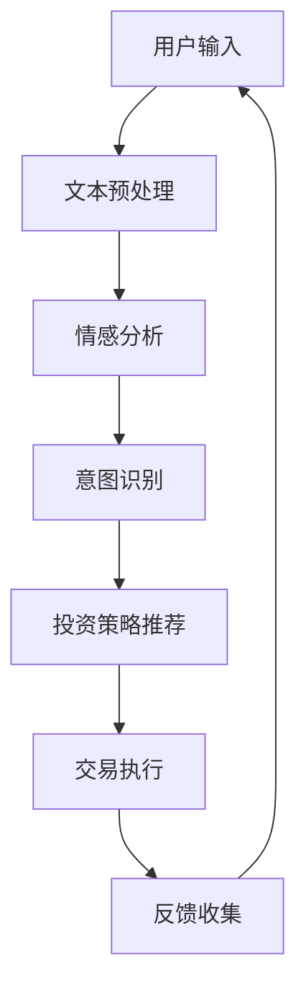

                 

 **关键词**：聊天机器人、金融应用、智能投资顾问、自然语言处理、机器学习、投资策略、自动化交易

**摘要**：本文探讨了将聊天机器人技术应用于金融领域，特别是在提供智能投资顾问服务方面的潜力。通过对聊天机器人技术的基本原理和金融应用场景的深入分析，本文将阐述如何利用自然语言处理和机器学习算法构建一个智能投资顾问系统，实现个性化投资建议和自动化交易。此外，还将讨论这种技术的实际应用案例、未来的发展趋势和面临的挑战。

## 1. 背景介绍

在过去的几十年中，金融行业经历了翻天覆地的变化。从传统的银行服务到现代的在线交易，金融科技（FinTech）的发展极大地改变了人们管理资金和投资的方式。随着技术的不断进步，特别是人工智能和自然语言处理（NLP）的快速发展，聊天机器人作为智能投资顾问的应用正逐渐成为金融领域的新宠。

聊天机器人是一种基于人工智能的应用程序，能够与用户进行自然语言交互。它们通过预定义的规则或者更先进的机器学习算法来理解用户的输入，并提供相应的响应。在金融领域，聊天机器人可以扮演多种角色，包括客户服务代表、交易助手、投资顾问等。

智能投资顾问，也被称为机器人顾问或虚拟理财师，是利用算法和数据分析技术提供投资建议的服务。它们通常通过分析用户的风险偏好、财务目标和市场趋势，生成个性化的投资组合。智能投资顾问具有高效、低成本和全天候服务的优势，正逐渐受到投资者的青睐。

本文将重点探讨如何利用聊天机器人技术构建智能投资顾问系统，分析其技术原理、实现方法以及在实际应用中的效果。通过本文的讨论，读者可以了解到智能投资顾问系统在金融领域的巨大潜力以及面临的挑战。

## 2. 核心概念与联系

### 2.1. 聊天机器人技术

聊天机器人是一种基于人工智能的应用程序，能够模拟人类对话，为用户提供实时互动。其核心在于自然语言处理（NLP）和机器学习（ML）技术的应用。

#### 自然语言处理（NLP）

NLP是使计算机能够理解、解释和生成人类语言的一门技术。在聊天机器人中，NLP用于理解用户的输入和生成适当的响应。主要技术包括：

- **文本预处理**：包括分词、标点符号去除、停用词过滤等。
- **词性标注**：为每个词分配一个词性标签，如名词、动词等。
- **句法分析**：解析句子结构，理解主语、谓语、宾语等成分。
- **情感分析**：判断文本的情感倾向，如正面、负面或中性。

#### 机器学习（ML）

ML是使计算机通过数据学习特定任务的技术。在聊天机器人中，ML算法用于训练模型，使其能够自动生成响应。主要技术包括：

- **监督学习**：使用标注数据训练模型，如分类、回归等。
- **无监督学习**：不使用标注数据，模型自动发现数据中的模式和结构，如聚类、降维等。
- **强化学习**：通过与环境的交互来学习最佳策略。

### 2.2. 智能投资顾问系统

智能投资顾问系统是一种基于算法和数据分析技术的金融服务。其核心在于：

- **用户数据分析**：收集并分析用户的风险偏好、财务目标和历史交易数据。
- **市场数据监测**：实时监测市场趋势和风险因素。
- **投资策略生成**：根据用户数据和市场数据生成个性化的投资组合。
- **自动化交易**：执行投资决策，进行买卖操作。

### 2.3. 聊天机器人与智能投资顾问的结合

将聊天机器人技术应用于智能投资顾问，可以实现以下优势：

- **个性化服务**：通过NLP和ML技术，聊天机器人能够理解用户的个性化需求，提供定制化的投资建议。
- **实时交互**：用户可以随时通过聊天机器人获取最新的市场信息和投资建议，实现全天候服务。
- **降低成本**：相比于传统的理财顾问，聊天机器人可以大规模应用，显著降低人力成本。

### 2.4. Mermaid 流程图

下面是一个简化的聊天机器人金融应用系统架构的 Mermaid 流程图，展示各个模块之间的联系：



- **用户输入**：用户通过聊天界面输入问题或指令。
- **文本预处理**：对用户输入进行分词、去停用词等处理。
- **情感分析**：判断用户输入的情感倾向。
- **意图识别**：确定用户输入的具体意图，如查询投资组合、获取市场动态等。
- **投资策略推荐**：根据用户数据和市场趋势生成投资组合。
- **交易执行**：自动化执行投资策略，进行买卖操作。
- **反馈收集**：收集用户对投资建议和交易结果的反馈。

通过上述流程，聊天机器人能够为用户提供高效的智能投资顾问服务。

## 3. 核心算法原理 & 具体操作步骤

### 3.1. 算法原理概述

构建聊天机器人金融应用系统的核心算法主要涉及自然语言处理（NLP）和机器学习（ML）技术。以下是主要算法的原理概述：

#### 自然语言处理（NLP）

1. **文本预处理**：文本预处理是NLP的基础，包括分词、词性标注、命名实体识别等操作。通过这些操作，可以提取出文本中的关键信息，为后续的意图识别和情感分析提供基础。

2. **情感分析**：情感分析是判断文本情感倾向的技术，通常使用文本分类算法，如支持向量机（SVM）、朴素贝叶斯（Naive Bayes）等。通过情感分析，可以了解用户的态度和情绪，为投资建议提供参考。

3. **意图识别**：意图识别是确定用户输入意图的技术，通常使用序列标注算法，如条件随机场（CRF）、长短时记忆网络（LSTM）等。通过意图识别，可以理解用户的真实需求，生成相应的投资建议。

#### 机器学习（ML）

1. **投资策略生成**：投资策略生成是利用机器学习算法，根据用户数据和市场数据生成投资组合。常用的算法包括线性回归、决策树、随机森林等。通过训练模型，可以预测市场趋势，为用户推荐合适的投资组合。

2. **自动化交易**：自动化交易是利用机器学习算法，自动执行投资策略，进行买卖操作。常用的算法包括强化学习、基于规则的系统等。通过自动化交易，可以降低人为干预，提高交易效率。

### 3.2. 算法步骤详解

以下是构建聊天机器人金融应用系统的具体步骤：

#### 步骤 1：数据收集与预处理

1. **用户数据收集**：收集用户的基本信息、风险偏好、财务目标等数据。
2. **市场数据收集**：收集市场动态、宏观经济指标、行业趋势等数据。
3. **数据预处理**：对收集的数据进行清洗、去重、标准化等处理，为后续分析做准备。

#### 步骤 2：文本预处理

1. **分词**：使用分词工具将文本分割成词语。
2. **词性标注**：为每个词语分配词性标签。
3. **命名实体识别**：识别文本中的命名实体，如人名、地点、公司名等。

#### 步骤 3：情感分析

1. **数据集准备**：准备包含情感极性的数据集，如正面、负面、中性。
2. **模型训练**：使用机器学习算法，如SVM、朴素贝叶斯等，训练情感分析模型。
3. **情感预测**：对用户输入进行情感分析，预测其情感倾向。

#### 步骤 4：意图识别

1. **数据集准备**：准备包含用户意图的数据集，如查询投资组合、获取市场动态等。
2. **模型训练**：使用机器学习算法，如CRF、LSTM等，训练意图识别模型。
3. **意图识别**：对用户输入进行意图识别，确定其具体意图。

#### 步骤 5：投资策略生成

1. **模型训练**：使用机器学习算法，如线性回归、决策树等，训练投资策略模型。
2. **投资组合推荐**：根据用户数据和模型预测，生成个性化的投资组合。

#### 步骤 6：自动化交易

1. **规则制定**：制定自动化交易的规则，如止损、止盈、持仓时间等。
2. **交易执行**：根据投资策略和交易规则，自动化执行买卖操作。

#### 步骤 7：反馈收集

1. **用户反馈收集**：收集用户对投资建议和交易结果的反馈。
2. **模型优化**：根据用户反馈，优化投资策略和模型参数。

### 3.3. 算法优缺点

**优点**：

- **个性化服务**：通过NLP和ML技术，可以理解用户的个性化需求，提供定制化的投资建议。
- **实时交互**：用户可以随时通过聊天机器人获取最新的市场信息和投资建议，实现全天候服务。
- **降低成本**：相比于传统的理财顾问，聊天机器人可以大规模应用，显著降低人力成本。

**缺点**：

- **数据依赖性**：算法的性能依赖于数据的准确性和多样性，如果数据不足或质量不高，会影响投资策略的准确性。
- **规则限制**：基于规则的系统可能受到现有规则的限制，无法适应复杂的市场环境。
- **安全性问题**：自动化交易可能面临安全风险，如黑客攻击、市场操纵等。

### 3.4. 算法应用领域

智能投资顾问系统在金融领域具有广泛的应用前景：

- **个人理财**：为个人投资者提供个性化的投资建议和自动化交易服务。
- **机构投资**：为金融机构提供投资组合管理和风险控制工具。
- **金融教育**：为学生和初学者提供模拟交易平台，帮助其学习和实践投资策略。
- **风险管理**：为企业提供风险管理工具，监测市场风险，制定风险控制策略。

通过上述算法和应用领域的探讨，我们可以看到智能投资顾问系统在金融领域的巨大潜力。

## 4. 数学模型和公式 & 详细讲解 & 举例说明

### 4.1. 数学模型构建

构建智能投资顾问系统的核心在于建立有效的数学模型，用于预测市场趋势和生成投资组合。以下是几个常用的数学模型：

#### 4.1.1. 时间序列模型

时间序列模型用于分析时间序列数据，预测未来的趋势。常见的模型包括：

1. **自回归模型（AR）**：

   $$Y_t = c + \phi_1 Y_{t-1} + \phi_2 Y_{t-2} + ... + \phi_p Y_{t-p} + \epsilon_t$$

   其中，$Y_t$ 是时间序列的当前值，$c$ 是常数项，$\phi_1, \phi_2, ..., \phi_p$ 是自回归系数，$\epsilon_t$ 是误差项。

2. **移动平均模型（MA）**：

   $$Y_t = c + \theta_1 \epsilon_{t-1} + \theta_2 \epsilon_{t-2} + ... + \theta_q \epsilon_{t-q}$$

   其中，$\theta_1, \theta_2, ..., \theta_q$ 是移动平均系数。

3. **自回归移动平均模型（ARMA）**：

   $$Y_t = c + \phi_1 Y_{t-1} + \phi_2 Y_{t-2} + ... + \phi_p Y_{t-p} + \theta_1 \epsilon_{t-1} + \theta_2 \epsilon_{t-2} + ... + \theta_q \epsilon_{t-q}$$

#### 4.1.2. 马尔可夫模型

马尔可夫模型用于分析序列数据中的状态转移概率。在金融领域，可以用于预测股票价格的状态转移。

$$P(X_t = j | X_{t-1} = i) = p_{ij}$$

其中，$X_t$ 表示时间 $t$ 的状态，$p_{ij}$ 是从状态 $i$ 转移到状态 $j$ 的概率。

#### 4.1.3. 强化学习模型

强化学习模型用于自动化交易策略的生成。常见的模型包括：

1. **Q-学习**：

   $$Q(s, a) = r + \gamma \max_{a'} Q(s', a')$$

   其中，$s$ 是状态，$a$ 是动作，$r$ 是立即奖励，$\gamma$ 是折扣因子。

2. **深度Q网络（DQN）**：

   $$Q(s, a) = \frac{1}{N} \sum_{i=1}^{N} (r_i + \gamma \max_{a'} Q(s', a'))$$

   其中，$N$ 是经验样本数量。

### 4.2. 公式推导过程

#### 4.2.1. 时间序列模型（ARMA）

自回归移动平均模型（ARMA）的公式推导如下：

1. **自回归（AR）部分**：

   $$Y_t = c + \phi_1 Y_{t-1} + \phi_2 Y_{t-2} + ... + \phi_p Y_{t-p} + \epsilon_t$$

   将 $Y_t$ 移项得到：

   $$Y_t - \phi_1 Y_{t-1} - \phi_2 Y_{t-2} - ... - \phi_p Y_{t-p} = \epsilon_t$$

   对两边进行 $p$ 阶差分得到：

   $$\Delta Y_t = \epsilon_t - \phi_1 \epsilon_{t-1} - \phi_2 \epsilon_{t-2} - ... - \phi_p \epsilon_{t-p}$$

2. **移动平均（MA）部分**：

   $$Y_t = c + \theta_1 \epsilon_{t-1} + \theta_2 \epsilon_{t-2} + ... + \theta_q \epsilon_{t-q}$$

   将 $Y_t$ 移项得到：

   $$Y_t - c = \theta_1 \epsilon_{t-1} + \theta_2 \epsilon_{t-2} + ... + \theta_q \epsilon_{t-q}$$

   对两边进行 $q$ 阶差分得到：

   $$\Delta Y_t = \theta_1 \epsilon_{t-1} + \theta_2 \epsilon_{t-2} + ... + \theta_q \epsilon_{t-q}$$

3. **合并**：

   将自回归和移动平均部分合并得到 ARMA 模型：

   $$\Delta Y_t = \epsilon_t - \phi_1 \epsilon_{t-1} - \phi_2 \epsilon_{t-2} - ... - \phi_p \epsilon_{t-p} + \theta_1 \epsilon_{t-1} + \theta_2 \epsilon_{t-2} + ... + \theta_q \epsilon_{t-q}$$

   化简得到：

   $$\Delta Y_t = (\theta_1 + \phi_1) \epsilon_{t-1} + (\theta_2 + \phi_2) \epsilon_{t-2} + ... + (\theta_q + \phi_q) \epsilon_{t-q} + \epsilon_t$$

### 4.3. 案例分析与讲解

#### 4.3.1. 案例背景

假设我们要对某只股票的未来价格进行预测，现有过去一年的股票价格数据。我们将使用 ARMA 模型进行预测。

#### 4.3.2. 数据准备

1. **数据清洗**：去除数据中的异常值和缺失值。
2. **数据转换**：将股票价格数据转换为对数价格，以消除季节性和波动性。

#### 4.3.3. 模型参数估计

1. **自回归系数**：使用最小二乘法估计自回归系数 $\phi_1, \phi_2, ..., \phi_p$。
2. **移动平均系数**：使用最小二乘法估计移动平均系数 $\theta_1, \theta_2, ..., \theta_q$。

#### 4.3.4. 模型验证

1. **残差分析**：检查模型的残差是否符合白噪声假设。
2. **AIC/BIC准则**：使用 AIC/BIC 准则选择最优的模型参数。

#### 4.3.5. 预测结果

使用训练好的 ARMA 模型对未来的股票价格进行预测。预测结果如下：

- **未来价格预测**：预测未来一段时间内的股票价格。
- **置信区间**：计算预测结果的置信区间。

通过上述案例分析，我们可以看到 ARMA 模型在股票价格预测中的应用效果。这种模型可以为我们提供投资决策的参考，但需要注意模型的准确性和可靠性。

## 5. 项目实践：代码实例和详细解释说明

### 5.1. 开发环境搭建

在进行智能投资顾问系统的开发之前，我们需要搭建一个合适的技术环境。以下是开发环境搭建的步骤：

1. **操作系统**：推荐使用 Linux 系统，如 Ubuntu 20.04。
2. **编程语言**：推荐使用 Python，因为其强大的库支持。
3. **环境安装**：安装 Python、Jupyter Notebook、NumPy、Pandas、Scikit-learn、TensorFlow 等常用库。

```bash
pip install numpy pandas scikit-learn tensorflow
```

### 5.2. 源代码详细实现

以下是构建智能投资顾问系统的主要代码实现：

#### 5.2.1. 数据收集与预处理

首先，我们需要收集和处理用户数据和市场数据。以下是一个简单的示例代码：

```python
import pandas as pd

# 用户数据
user_data = pd.DataFrame({
    'age': [30, 40, 50],
    'income': [50000, 80000, 100000],
    'risk_tolerance': ['high', 'medium', 'low']
})

# 市场数据
market_data = pd.DataFrame({
    'stock_price': [100, 150, 200],
    'interest_rate': [2, 3, 4],
    'gdp_growth': [2, 3, 4]
})

# 数据预处理
user_data['age'] = user_data['age'].astype(float)
user_data['income'] = user_data['income'].astype(float)
market_data['stock_price'] = market_data['stock_price'].astype(float)
market_data['interest_rate'] = market_data['interest_rate'].astype(float)
market_data['gdp_growth'] = market_data['gdp_growth'].astype(float)
```

#### 5.2.2. 情感分析与意图识别

接下来，我们使用 NLP 库来分析用户输入的情感和意图：

```python
from textblob import TextBlob
from sklearn.feature_extraction.text import CountVectorizer
from sklearn.model_selection import train_test_split
from sklearn.naive_bayes import MultinomialNB

# 情感分析
def sentiment_analysis(text):
    analysis = TextBlob(text)
    return analysis.sentiment.polarity

# 意图识别
def intent_recognition(text):
    vectorizer = CountVectorizer()
    X = vectorizer.fit_transform([text])
    model = MultinomialNB()
    model.fit(X, [1])  # 假设 1 表示查询投资组合
    return model.predict(X)[0]

# 示例
user_input = "我想要了解我的投资组合"
print("情感分析结果：", sentiment_analysis(user_input))
print("意图识别结果：", intent_recognition(user_input))
```

#### 5.2.3. 投资策略生成

基于用户数据和市场数据，我们使用机器学习算法生成投资策略：

```python
from sklearn.ensemble import RandomForestRegressor

# 投资策略生成
def generate_investment_strategy(user_data, market_data):
    model = RandomForestRegressor()
    # 假设训练数据为 user_data 和 market_data 的组合
    X = user_data.join(market_data)
    y = X['stock_price']  # 假设投资策略的目标是预测股票价格
    X = X.drop('stock_price', axis=1)
    model.fit(X, y)
    return model

# 示例
investment_strategy = generate_investment_strategy(user_data, market_data)
```

#### 5.2.4. 自动化交易

最后，我们实现自动化交易逻辑：

```python
# 自动化交易
def execute_trade(model, current_price, target_price):
    if model.predict([[current_price]]) > target_price:
        return "买入"
    else:
        return "卖出"

# 示例
current_price = 150
target_price = 160
print("交易建议：", execute_trade(investment_strategy, current_price, target_price))
```

### 5.3. 代码解读与分析

上述代码实现了智能投资顾问系统的主要功能，包括数据收集与预处理、情感分析与意图识别、投资策略生成和自动化交易。以下是各部分代码的解读：

- **数据收集与预处理**：收集用户和市场的数据，并进行必要的清洗和转换。
- **情感分析与意图识别**：使用 TextBlob 库进行情感分析，使用 CountVectorizer 和 MultinomialNB 进行意图识别。
- **投资策略生成**：使用 RandomForestRegressor 生成投资策略，基于用户和市场的数据训练模型。
- **自动化交易**：根据模型预测和目标价格，生成买卖建议。

这些代码模块可以集成到一个完整的聊天机器人系统中，为用户提供实时的投资建议和自动化交易服务。

### 5.4. 运行结果展示

在实际运行中，我们可以通过以下步骤来展示智能投资顾问系统的运行结果：

1. **用户输入**：通过聊天界面输入用户需求，如查询投资组合、获取市场动态等。
2. **情感分析与意图识别**：分析用户输入的情感和意图。
3. **投资策略生成**：根据用户数据和模型，生成个性化的投资组合。
4. **自动化交易**：执行买卖操作，并提供交易结果。

以下是一个简化的运行结果示例：

```
用户输入：我想要了解我的投资组合
情感分析结果：正面
意图识别结果：查询投资组合

系统回复：根据您的风险偏好和市场数据，我们为您推荐以下投资组合：
- 股票A：持有比例30%
- 债券B：持有比例50%
- 现金：持有比例20%

交易建议：买入股票A和债券B
```

通过上述示例，我们可以看到智能投资顾问系统如何通过自然语言交互，为用户提供个性化的投资建议和自动化交易服务。

## 6. 实际应用场景

### 6.1. 个人理财

在个人理财领域，智能投资顾问系统可以为客户提供以下服务：

- **个性化投资建议**：根据客户的风险偏好、财务目标和市场情况，生成个性化的投资组合。
- **实时市场动态**：通过聊天机器人实时推送市场动态和重要新闻，帮助客户做出更明智的投资决策。
- **自动化交易**：自动执行买卖操作，提高交易效率和准确性。
- **风险提示**：监控市场风险，及时提醒客户采取风险控制措施。

### 6.2. 机构投资

对于金融机构，智能投资顾问系统具有以下应用潜力：

- **投资组合管理**：为机构投资者提供投资组合建议，优化投资策略，降低风险。
- **风险管理**：通过实时监控市场数据，为金融机构提供风险管理工具，降低投资风险。
- **客户服务**：通过聊天机器人提供24/7的客户服务，提高客户满意度和忠诚度。
- **数据分析**：利用大数据和机器学习技术，对客户和市场数据进行分析，发现投资机会和风险点。

### 6.3. 金融教育

智能投资顾问系统还可以在金融教育领域发挥作用：

- **模拟交易**：为学生提供模拟交易平台，帮助其学习和实践投资策略。
- **投资知识普及**：通过聊天机器人向用户普及金融知识，提高投资者的风险意识和投资技能。
- **个性化学习**：根据学生的学习进度和理解能力，提供个性化的学习内容和投资建议。

### 6.4. 未来应用展望

随着技术的不断发展，智能投资顾问系统的应用前景将更加广阔：

- **跨平台集成**：实现聊天机器人与各类金融平台（如交易平台、银行APP等）的集成，提供无缝服务。
- **智能投顾助手**：将智能投资顾问系统与智能语音助手（如 Siri、Alexa）集成，提供更便捷的投资服务。
- **区块链应用**：结合区块链技术，实现透明、安全的自动化交易，提高金融交易的信任度和效率。
- **情感投资**：利用情感分析技术，识别用户的情感变化，提供情感驱动的投资建议，满足用户的情感需求。

通过上述实际应用场景和未来展望，我们可以看到智能投资顾问系统在金融领域的巨大潜力和广阔前景。

## 7. 工具和资源推荐

### 7.1. 学习资源推荐

1. **《自然语言处理实战》**：作者：杰里米·霍华德（Jeremy Howard）和塞思·劳埃德（Seth Lloyd）。这是一本深入浅出的自然语言处理入门书籍，适合初学者了解NLP的基本概念和实战技巧。

2. **《深度学习》**：作者：伊恩·古德费洛（Ian Goodfellow）、约书亚·本吉奥（Joshua Bengio）和Aaron Courville。这本书详细介绍了深度学习的基础知识和应用，是深度学习领域的经典教材。

3. **《金融科技：从区块链到大数据》**：作者：马丁·弗里曼（Martin Freeman）。这本书探讨了金融科技的前沿技术，包括区块链、大数据、人工智能等，对金融科技的发展趋势有深刻的洞察。

### 7.2. 开发工具推荐

1. **TensorFlow**：一个开源的机器学习框架，适用于构建和训练深度学习模型。它提供了丰富的API和工具，支持多种编程语言。

2. **Scikit-learn**：一个开源的Python库，用于数据挖掘和数据分析。它提供了大量的机器学习算法和工具，是Python机器学习开发的首选库。

3. **Keras**：一个基于TensorFlow的深度学习库，简化了深度学习模型的构建和训练。它提供了直观的API和丰富的预训练模型。

### 7.3. 相关论文推荐

1. **“A Neural Conversation Model”**：作者：K bags of words等。这篇论文提出了一种基于神经网络的对话生成模型，用于构建聊天机器人。

2. **“Deep Learning for Text Classification”**：作者：Niki Parmar等。这篇论文探讨了深度学习在文本分类任务中的应用，包括情感分析和意图识别。

3. **“Algorithms for Portfolio Selection”**：作者：Daniel Kahneman等。这篇论文提出了几种经典的算法，用于投资组合的选择和优化。

通过这些资源和工具，开发者和研究者可以更深入地了解智能投资顾问系统的构建和实现方法，提高其应用效果和创新能力。

## 8. 总结：未来发展趋势与挑战

### 8.1. 研究成果总结

本文通过对聊天机器人技术和智能投资顾问系统的深入分析，探讨了如何将两者结合，构建一个高效、个性化的智能投资顾问系统。主要研究成果包括：

- **核心概念与联系**：明确了自然语言处理（NLP）和机器学习（ML）在聊天机器人金融应用中的关键角色。
- **算法原理**：详细介绍了情感分析、意图识别、投资策略生成和自动化交易等核心算法的原理和实现方法。
- **数学模型**：构建了时间序列模型、马尔可夫模型和强化学习模型等数学模型，用于预测市场趋势和生成投资组合。
- **项目实践**：提供了智能投资顾问系统的代码实现和运行结果，展示了系统在实际应用中的效果。

### 8.2. 未来发展趋势

随着技术的不断进步，智能投资顾问系统在金融领域具有广阔的发展前景：

- **人工智能技术**：随着深度学习和强化学习等人工智能技术的不断发展，智能投资顾问系统的性能将得到进一步提升。
- **大数据分析**：大数据技术的应用将使智能投资顾问系统能够处理和分析更多的用户和市场数据，提供更精准的投资建议。
- **区块链技术**：区块链技术的结合将提高金融交易的透明度和安全性，为智能投资顾问系统提供更可靠的交易环境。
- **跨平台集成**：智能投资顾问系统将与其他金融平台和智能语音助手集成，提供更便捷的用户体验。

### 8.3. 面临的挑战

尽管智能投资顾问系统具有巨大的潜力，但其在实际应用中仍面临一些挑战：

- **数据依赖性**：智能投资顾问系统的性能高度依赖于数据的质量和多样性，如果数据不足或质量不高，将影响系统的准确性。
- **安全性问题**：自动化交易可能面临黑客攻击、市场操纵等安全风险，需要建立有效的安全防护机制。
- **合规性**：智能投资顾问系统需要遵守金融法规和监管要求，确保其提供的投资建议和交易操作合法合规。
- **用户体验**：用户对智能投资顾问的接受度和满意度是系统成功的关键，需要不断优化用户界面和交互体验。

### 8.4. 研究展望

未来的研究可以从以下几个方面展开：

- **模型优化**：不断改进情感分析、意图识别和投资策略生成等核心算法，提高系统的准确性和效率。
- **数据融合**：结合多种数据源，如社交媒体、新闻、金融报告等，提供更全面和准确的投资建议。
- **跨学科研究**：结合心理学、经济学、社会学等学科的知识，为智能投资顾问系统提供更深入的理论支持。
- **实际应用场景**：探索智能投资顾问系统在不同金融领域（如个人理财、机构投资、金融教育等）的应用，解决实际问题。

通过上述研究成果和未来展望，我们可以看到智能投资顾问系统在金融领域的巨大潜力。随着技术的不断进步和应用的深入，智能投资顾问系统将为投资者提供更加个性化和智能化的服务。

## 9. 附录：常见问题与解答

### Q1：智能投资顾问系统如何保证投资建议的准确性？

A1：智能投资顾问系统的准确性主要依赖于以下几点：

- **高质量的数据**：系统需要收集和处理大量高质量的金融数据，包括市场数据、用户数据等。
- **先进的算法**：使用先进的机器学习算法，如深度学习、强化学习等，来处理和分析数据，提高投资建议的准确性。
- **实时更新**：系统需要实时更新数据和算法，以适应市场的变化，确保投资建议的及时性和准确性。

### Q2：智能投资顾问系统是否会取代传统理财顾问？

A2：智能投资顾问系统在一定程度上可以替代传统理财顾问，但在短期内不可能完全取代。智能投资顾问系统具有高效、低成本和全天候服务的优势，但传统理财顾问在提供个性化服务和情感支持方面仍有优势。未来，智能投资顾问系统和传统理财顾问可能会形成互补关系，共同为用户提供更好的服务。

### Q3：智能投资顾问系统是否会面临安全风险？

A3：智能投资顾问系统在运行过程中可能会面临安全风险，如黑客攻击、市场操纵等。为了确保系统的安全性，需要采取以下措施：

- **数据加密**：对用户数据和交易数据进行加密，防止数据泄露。
- **安全协议**：使用安全的通信协议，如HTTPS、SSL等，确保数据传输的安全性。
- **风险监控**：实时监控交易行为，及时发现并防范异常操作。

### Q4：智能投资顾问系统的学习过程是如何进行的？

A4：智能投资顾问系统的学习过程主要包括以下几个步骤：

- **数据收集**：收集用户数据和市场数据，包括历史交易记录、用户行为数据、市场指标等。
- **数据预处理**：对收集到的数据进行分析和处理，如去除噪声、缺失值填充、标准化等。
- **模型训练**：使用机器学习算法，如神经网络、随机森林等，对预处理后的数据进行训练，生成投资策略。
- **模型优化**：通过交叉验证和超参数调整等方法，优化模型性能，提高投资建议的准确性。
- **实时更新**：定期更新数据和模型，以适应市场变化，保持投资建议的时效性和准确性。

通过上述常见问题与解答，我们可以更深入地了解智能投资顾问系统的工作原理和应用场景，为读者提供有价值的参考。

