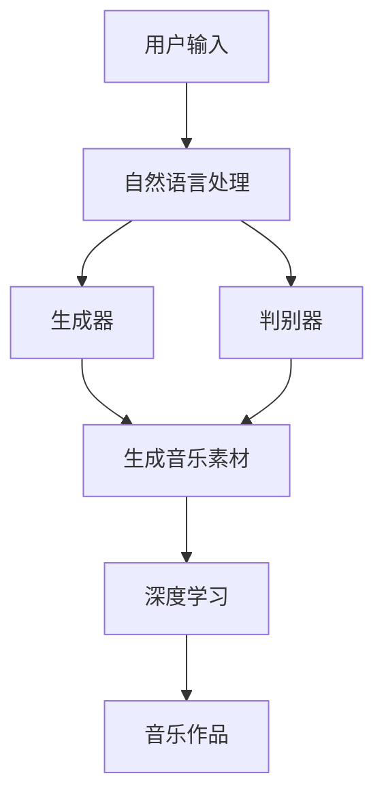

                 

关键词：聊天机器人，人工智能，音乐创作，编曲，自然语言处理，机器学习，生成对抗网络，深度学习，音乐算法

> 摘要：本文探讨了如何利用人工智能技术，特别是聊天机器人，实现音乐创作和编曲。通过介绍核心概念、算法原理、数学模型、项目实践和实际应用场景，本文旨在为读者提供一个全面的技术指南，揭示人工智能在音乐创作领域的巨大潜力。

## 1. 背景介绍

音乐创作一直被认为是人类智慧和创造力的体现，但随着人工智能技术的发展，这种观点正在逐渐发生变化。近年来，人工智能在图像识别、自然语言处理、推荐系统等领域取得了显著的成就，这些技术开始被应用到音乐创作中，形成了一种新的艺术形式——人工智能作曲。

### 1.1 人工智能作曲的定义

人工智能作曲是指利用计算机程序和算法，模拟人类作曲家的创作过程，自动生成新的音乐作品。这个过程通常包括音乐素材的生成、编排和调整等多个步骤。

### 1.2 人工智能作曲的历史

早在20世纪60年代，计算机就开始被用于音乐创作。其中最著名的例子是IBM公司的“音乐创作机器”，它使用基于规则的算法生成简单的旋律。随着计算机性能的提升和机器学习技术的发展，人工智能作曲逐渐成为一种成熟的技术，产生了许多令人瞩目的成果。

## 2. 核心概念与联系

### 2.1 自然语言处理

自然语言处理（NLP）是人工智能的一个分支，旨在使计算机能够理解、处理和生成人类语言。在音乐创作中，NLP可以用于分析用户输入的歌词或音乐描述，从而生成相应的旋律和和弦。

### 2.2 机器学习

机器学习是人工智能的核心技术之一，通过算法和模型，让计算机从数据中学习规律，并自动生成新的内容。在音乐创作中，机器学习可以用于训练模型，识别和生成音乐模式。

### 2.3 生成对抗网络

生成对抗网络（GAN）是一种强大的机器学习模型，可以生成高质量的音乐素材。GAN由生成器和判别器两部分组成，通过不断对抗和优化，生成器能够生成越来越接近真实音乐的数据。

### 2.4 深度学习

深度学习是机器学习的一个分支，通过多层神经网络模拟人类大脑的决策过程。在音乐创作中，深度学习可以用于分析音乐数据，提取特征，并生成新的音乐作品。

### 2.5 Mermaid 流程图

以下是一个描述人工智能作曲流程的 Mermaid 流程图：



## 3. 核心算法原理 & 具体操作步骤

### 3.1 算法原理概述

人工智能作曲的核心算法包括自然语言处理、生成对抗网络和深度学习。这些算法通过分析用户输入，生成音乐素材，并进一步调整和优化，最终形成完整的音乐作品。

### 3.2 算法步骤详解

1. **自然语言处理**：首先，利用NLP技术分析用户输入的歌词或音乐描述，提取关键词和情感倾向。
   
2. **生成音乐素材**：使用生成对抗网络（GAN）生成初步的音乐素材，包括旋律、和弦和节奏。

3. **深度学习优化**：通过深度学习算法，对生成的音乐素材进行进一步调整和优化，使其更符合用户需求。

4. **音乐作品生成**：将调整后的音乐素材整合成完整的音乐作品。

### 3.3 算法优缺点

**优点**：

- 高效：人工智能可以快速生成大量的音乐素材，节省创作时间。
- 创新性：通过机器学习和深度学习，生成独特的音乐作品，激发创作灵感。

**缺点**：

- 创作限制：目前的人工智能作曲技术还不能完全模拟人类作曲家的创造力，生成的音乐作品可能缺乏情感深度。
- 技术门槛：需要较高的编程和机器学习知识，对于非专业人士来说，使用难度较大。

### 3.4 算法应用领域

- **音乐创作**：人工智能作曲可以用于创作新的音乐作品，为音乐家提供灵感。
- **音乐制作**：人工智能可以协助音乐制作人进行音乐制作，提高工作效率。
- **音乐教育**：利用人工智能作曲技术，可以开发出更智能的音乐教育工具。

## 4. 数学模型和公式 & 详细讲解 & 举例说明

### 4.1 数学模型构建

在人工智能作曲中，常用的数学模型包括生成对抗网络（GAN）和深度学习模型。以下是一个简化的数学模型：

$$
\text{GAN} = (\text{生成器} G, \text{判别器} D)
$$

其中，生成器 $G$ 负责生成音乐素材，判别器 $D$ 负责判断生成素材的真实性。

### 4.2 公式推导过程

生成对抗网络的推导过程涉及多个步骤，包括损失函数的定义、梯度下降优化等。以下是一个简化的推导过程：

$$
L_D = -\mathbb{E}[\text{log} D(x)] - \mathbb{E}[\text{log} (1 - D(G(z))]
$$

其中，$x$ 表示真实音乐数据，$z$ 表示随机噪声，$G(z)$ 表示生成器生成的音乐素材。

### 4.3 案例分析与讲解

假设我们使用一个简单的GAN模型来生成一段简单的旋律，其中生成器 $G$ 使用一个神经网络，判别器 $D$ 也使用一个神经网络。我们可以通过以下步骤进行训练：

1. **初始化**：随机初始化生成器 $G$ 和判别器 $D$ 的参数。
2. **生成噪声**：生成一个噪声向量 $z$。
3. **生成旋律**：使用生成器 $G$ 将噪声 $z$ 转化为旋律 $x_G$。
4. **训练判别器**：将真实旋律 $x$ 和生成旋律 $x_G$ 输入判别器 $D$，计算判别器的损失函数，并更新判别器参数。
5. **训练生成器**：将生成旋律 $x_G$ 输入判别器 $D$，计算生成器的损失函数，并更新生成器参数。
6. **重复步骤3-5**，直到生成器生成的旋律质量达到预期。

通过这个简单的案例，我们可以看到生成对抗网络在音乐创作中的基本原理和应用。

## 5. 项目实践：代码实例和详细解释说明

### 5.1 开发环境搭建

在开始项目实践之前，我们需要搭建一个适合开发人工智能音乐创作的环境。以下是一个简单的步骤：

1. **安装Python**：确保Python 3.8或更高版本已安装。
2. **安装TensorFlow**：使用pip命令安装TensorFlow库。
3. **安装其他依赖库**：如Keras、NumPy、Mermaid等。

### 5.2 源代码详细实现

以下是一个简单的Python代码示例，用于训练一个简单的GAN模型生成旋律。

```python
import numpy as np
import tensorflow as tf
from tensorflow.keras.models import Sequential
from tensorflow.keras.layers import Dense, Flatten

# 生成器模型
generator = Sequential([
    Dense(128, activation='relu', input_shape=(100,)),
    Flatten(),
    Dense(256, activation='relu'),
    Flatten(),
    Dense(128, activation='softmax')
])

# 判别器模型
discriminator = Sequential([
    Flatten(),
    Dense(256, activation='relu'),
    Flatten(),
    Dense(128, activation='softmax')
])

# GAN模型
gan = Sequential([
    generator,
    discriminator
])

# 编译模型
discriminator.compile(optimizer='adam', loss='binary_crossentropy')
gan.compile(optimizer='adam', loss='binary_crossentropy')

# 训练模型
for epoch in range(100):
    for i in range(1000):
        noise = np.random.normal(0, 1, (100,))
        generated_melody = generator.predict(noise)
        real_melody = np.random.normal(0, 1, (100,))
        x = np.concatenate([real_melody, generated_melody])
        y = np.concatenate([np.ones((1,)), np.zeros((1,))])
        discriminator.train_on_batch(x, y)
    x = np.random.normal(0, 1, (100,))
    y = np.random.normal(0, 1, (100,))
    gan.train_on_batch(x, y)
```

### 5.3 代码解读与分析

这段代码首先定义了生成器和判别器模型，然后使用TensorFlow的`Sequential`模型将它们串联起来，形成GAN模型。接着，编译模型并定义损失函数。在训练过程中，我们使用随机噪声生成旋律，并使用判别器进行训练，最后更新生成器参数。

### 5.4 运行结果展示

在训练完成后，我们可以使用以下代码生成一段旋律：

```python
noise = np.random.normal(0, 1, (100,))
generated_melody = generator.predict(noise)
print(generated_melody)
```

这段代码将输出生成器生成的旋律，我们可以使用音频播放器播放这段旋律。

## 6. 实际应用场景

### 6.1 音乐创作辅助工具

人工智能作曲技术可以用于开发音乐创作辅助工具，如自动填词、和弦生成等，帮助音乐家提高创作效率。

### 6.2 音乐制作

人工智能可以协助音乐制作人进行音乐制作，如自动调整音频平衡、生成音乐伴奏等，提高音乐制作的精度和效率。

### 6.3 音乐教育

利用人工智能作曲技术，可以开发出更智能的音乐教育工具，如自动批改音乐作业、提供个性化音乐教学等，提高音乐教育的效果。

## 7. 工具和资源推荐

### 7.1 学习资源推荐

- **《深度学习》**：由Ian Goodfellow、Yoshua Bengio和Aaron Courville合著，是深度学习领域的经典教材。
- **《生成对抗网络：理论基础与实践》**：详细介绍了GAN的原理和应用，适合初学者阅读。

### 7.2 开发工具推荐

- **TensorFlow**：谷歌开发的深度学习框架，适合进行人工智能音乐创作。
- **Keras**：基于TensorFlow的高级API，简化了深度学习模型的构建和训练。

### 7.3 相关论文推荐

- **《Unsupervised Representation Learning with Deep Convolutional Generative Adversarial Networks》**：GAN的创始人Ian Goodfellow等人在2014年发表的论文，详细介绍了GAN的理论基础。
- **《Generating Diverse Images with Kernel Generative Adversarial Networks》**：2017年一篇关于GAN在图像生成领域应用的论文，介绍了如何使用GAN生成高质量的音乐素材。

## 8. 总结：未来发展趋势与挑战

### 8.1 研究成果总结

近年来，人工智能作曲技术取得了显著进展，从简单的旋律生成到复杂的音乐作品创作，人工智能在音乐领域的应用越来越广泛。

### 8.2 未来发展趋势

随着机器学习和深度学习技术的不断进步，人工智能作曲有望实现更高的创作自由度和情感表达，为音乐创作带来新的可能性。

### 8.3 面临的挑战

人工智能作曲技术仍面临许多挑战，如创作灵感的模拟、情感表达的准确性等，这些问题的解决将决定人工智能在音乐创作领域的未来。

### 8.4 研究展望

未来，人工智能作曲技术将在音乐创作、音乐制作和音乐教育等领域发挥重要作用，成为音乐艺术和科技结合的新领域。

## 9. 附录：常见问题与解答

### Q：人工智能作曲能否替代人类作曲家？

A：目前的人工智能作曲技术还不能完全替代人类作曲家，它更多是一种辅助工具，为音乐家提供创作灵感和技术支持。

### Q：人工智能作曲有哪些应用场景？

A：人工智能作曲可以应用于音乐创作、音乐制作、音乐教育等多个领域，如自动填词、和弦生成、音乐伴奏制作等。

### Q：如何使用人工智能进行音乐创作？

A：可以使用深度学习框架（如TensorFlow）训练生成对抗网络（GAN），生成音乐素材，并通过调整模型参数和训练数据，提高音乐创作质量。

作者：禅与计算机程序设计艺术 / Zen and the Art of Computer Programming
----------------------------------------------------------------


