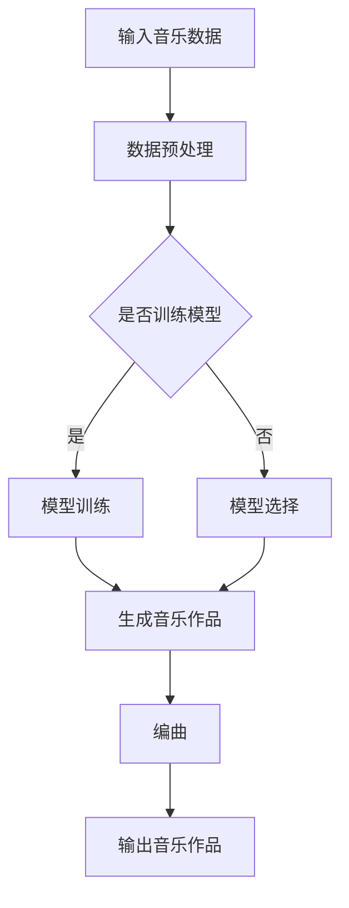

                 

 在人工智能和机器学习迅猛发展的当下，聊天机器人已经成为了我们日常生活中不可或缺的一部分。从简单的问答机器到能进行复杂对话的情感AI，聊天机器人的功能和能力不断得到提升。而在这个技术浪潮中，音乐创作也成为了一个新的热点领域。本文将探讨如何利用人工智能和机器学习技术，实现聊天机器人音乐创作，特别是作曲和编曲的自动化过程。

> 关键词：人工智能，音乐创作，聊天机器人，机器学习，作曲，编曲

> 摘要：本文首先介绍了聊天机器人在音乐创作中的背景和重要性，然后详细阐述了人工智能在作曲和编曲中的核心概念、算法原理、数学模型、项目实践，以及实际应用场景。最后，对未来的发展趋势和挑战进行了展望，并推荐了相关的学习资源和开发工具。

## 1. 背景介绍

### 1.1 聊天机器人的发展

随着互联网的普及和移动设备的广泛应用，聊天机器人技术得到了飞速发展。最早的聊天机器人如Eliza和Parry，主要是基于规则系统的简单对话程序。随着时间的推移，自然语言处理（NLP）和机器学习技术的进步，使得聊天机器人的对话能力得到了极大的提升。现在，聊天机器人不仅能够进行自然语言理解，还能进行情感识别、语音合成、图像识别等多种功能。

### 1.2 音乐创作的发展

音乐创作是艺术与技术的结合，是人类文化传承和发展的重要部分。从古代的口口相传到现代的数字化音乐制作，音乐创作经历了无数变革。随着计算机技术的发展，人工智能和机器学习开始应用于音乐创作领域，使得音乐创作的自动化和个性化成为可能。

### 1.3 聊天机器人与音乐创作的结合

将聊天机器人技术与音乐创作相结合，可以创造出一种全新的音乐创作方式。聊天机器人可以通过与用户的互动，了解用户的喜好、情感和需求，从而生成个性化的音乐作品。这种创新的音乐创作模式，不仅能够满足用户的个性化需求，还能够推动音乐创作的多样性和创新性。

## 2. 核心概念与联系

### 2.1 人工智能作曲

人工智能作曲是指利用人工智能技术，如机器学习、深度学习等，自动生成音乐作品的过程。这个过程包括旋律生成、和弦编排、节奏设计等。人工智能作曲的核心在于从大量的音乐数据中学习，并基于学习结果生成新的音乐作品。

### 2.2 机器学习与音乐

机器学习是人工智能的一个分支，它通过训练模型，让机器自动从数据中学习规律，并利用这些规律进行预测和决策。在音乐领域，机器学习技术被广泛应用于音乐识别、音乐推荐、音乐生成等方面。

### 2.3 编曲与人工智能

编曲是指将音乐的基本元素，如旋律、和弦、节奏等，进行组合和编排，形成完整的音乐作品。人工智能编曲则是利用计算机技术，自动进行编曲的过程。这个过程包括乐器音色的选择、音量调节、节奏设计等。

### 2.4 Mermaid 流程图

下面是一个简单的 Mermaid 流程图，展示了人工智能作曲和编曲的基本流程。



## 3. 核心算法原理 & 具体操作步骤

### 3.1 算法原理概述

人工智能作曲和编曲的核心在于机器学习算法的应用。常见的机器学习算法包括生成对抗网络（GAN）、长短期记忆网络（LSTM）等。这些算法可以通过训练大量的音乐数据，学习音乐的基本规律，并基于这些规律生成新的音乐作品。

### 3.2 算法步骤详解

#### 步骤1：数据收集与预处理

首先，需要收集大量的音乐数据，包括不同风格、不同流派的音乐。然后，对数据进行预处理，如去噪、格式转换等。

```python
import librosa
import numpy as np

# 读取音乐文件
y, sr = librosa.load('example.mp3')

# 数据预处理
y_processed = preprocess_data(y)
```

#### 步骤2：模型训练

使用收集到的音乐数据，训练机器学习模型。这里以 LSTM 算法为例。

```python
from keras.models import Sequential
from keras.layers import LSTM, Dense

# 构建LSTM模型
model = Sequential()
model.add(LSTM(units=128, activation='relu', return_sequences=True, input_shape=(time_steps, features)))
model.add(LSTM(units=128, activation='relu'))
model.add(Dense(units=1))

# 编译模型
model.compile(optimizer='adam', loss='mse')

# 训练模型
model.fit(x_train, y_train, epochs=100, batch_size=32)
```

#### 步骤3：生成音乐作品

训练完成后，使用模型生成新的音乐作品。

```python
# 生成音乐作品
new_music = generate_music(model, time_steps, features)
```

#### 步骤4：编曲

将生成的音乐作品进行编曲，包括乐器音色的选择、音量调节、节奏设计等。

```python
import soundfile as sf

# 输出音乐作品
sf.write('output.wav', new_music, sr)
```

### 3.3 算法优缺点

**优点：**

- 自动化程度高，能够快速生成音乐作品。
- 能够根据用户需求，生成个性化的音乐作品。

**缺点：**

- 需要大量的音乐数据进行训练，对计算资源要求较高。
- 生成的音乐作品可能在情感表达和艺术性方面有所欠缺。

### 3.4 算法应用领域

人工智能作曲和编曲技术可以应用于多个领域，如：

- 音乐制作：自动生成音乐作品，提高音乐创作的效率。
- 游戏开发：为游戏制作背景音乐，增强游戏体验。
- 娱乐行业：为电影、电视剧等制作配乐，节省人力成本。

## 4. 数学模型和公式 & 详细讲解 & 举例说明

### 4.1 数学模型构建

在人工智能作曲和编曲中，常用的数学模型包括生成对抗网络（GAN）和长短期记忆网络（LSTM）。

#### 生成对抗网络（GAN）

生成对抗网络（GAN）由生成器（Generator）和判别器（Discriminator）组成。生成器通过学习数据分布，生成新的音乐作品。判别器则通过判断生成器生成的音乐作品是否真实，来训练生成器。

#### 长短期记忆网络（LSTM）

长短期记忆网络（LSTM）是一种用于处理序列数据的神经网络，能够捕捉序列中的长期依赖关系。在音乐创作中，LSTM 可以用于生成旋律、和弦等。

### 4.2 公式推导过程

#### 生成对抗网络（GAN）

生成对抗网络的损失函数通常由两部分组成：生成器损失和判别器损失。

生成器损失：

$$
L_G = -\log(D(G(z)))
$$

判别器损失：

$$
L_D = -\log(D(x)) - \log(1 - D(G(z)))
$$

其中，$D(x)$ 和 $D(G(z))$ 分别表示判别器对真实数据和生成数据的判断结果。

#### 长短期记忆网络（LSTM）

LSTM 的核心是 forget gate、input gate 和 output gate。以下是一个简化的 LSTM 公式推导。

$$
i_t = \sigma(W_{xi}x_t + W_{hi}h_{t-1} + b_i) \\
f_t = \sigma(W_{xf}x_t + W_{hf}h_{t-1} + b_f) \\
\bar{c_t} = \tanh(W_{xc}x_t + W_{hc}h_{t-1} + b_c) \\
o_t = \sigma(W_{xo}x_t + W_{ho}h_{t-1} + b_o) \\
c_t = f_t \odot c_{t-1} + i_t \odot \bar{c_t} \\
h_t = o_t \odot \tanh(c_t)
$$

其中，$i_t$、$f_t$、$\bar{c_t}$、$o_t$ 分别表示 input gate、forget gate、input gate 和 output gate 的值，$c_t$ 和 $h_t$ 分别表示当前时刻的 cell 状态和隐藏状态。

### 4.3 案例分析与讲解

#### 案例一：使用 GAN 生成音乐

假设我们使用 GAN 生成古典音乐。首先，我们需要收集大量的古典音乐数据，然后使用这些数据进行 GAN 的训练。

1. 数据预处理：将音频数据转换为 spectrogram 格式。
2. 训练 GAN：使用真实数据和生成数据，训练生成器和判别器。
3. 生成音乐：使用训练好的生成器，生成新的音乐作品。

#### 案例二：使用 LSTM 生成旋律

假设我们使用 LSTM 生成流行音乐的旋律。首先，我们需要收集大量的流行音乐旋律数据，然后使用这些数据进行 LSTM 的训练。

1. 数据预处理：将音频数据转换为 Mel-frequency cepstral coefficients（MFCC）格式。
2. 训练 LSTM：使用训练集训练 LSTM 模型。
3. 生成旋律：使用训练好的 LSTM 模型，生成新的旋律。

## 5. 项目实践：代码实例和详细解释说明

### 5.1 开发环境搭建

在开始项目实践之前，我们需要搭建一个合适的开发环境。这里，我们使用 Python 作为主要编程语言，结合 TensorFlow 和 Keras 等库，进行人工智能作曲和编曲的开发。

1. 安装 Python：下载并安装 Python 3.7 或更高版本。
2. 安装 TensorFlow：在终端运行 `pip install tensorflow`。
3. 安装 Keras：在终端运行 `pip install keras`。

### 5.2 源代码详细实现

以下是使用 GAN 生成音乐的基本代码实现。

```python
import numpy as np
import matplotlib.pyplot as plt
import tensorflow as tf
from tensorflow.keras.models import Sequential
from tensorflow.keras.layers import Dense, LSTM, Reshape
from tensorflow.keras.optimizers import Adam

# 定义生成器模型
generator = Sequential([
    LSTM(128, activation='relu', input_shape=(time_steps, features), return_sequences=True),
    LSTM(128, activation='relu'),
    Dense(units=1, activation='sigmoid')
])

# 定义判别器模型
discriminator = Sequential([
    LSTM(128, activation='relu', input_shape=(time_steps, features), return_sequences=True),
    LSTM(128, activation='relu'),
    Dense(units=1, activation='sigmoid')
])

# 定义 GAN 模型
gan = Sequential([
    generator,
    discriminator
])

# 编译模型
gan.compile(optimizer=Adam(0.0001), loss='binary_crossentropy')

# 训练模型
gan.fit(x_train, y_train, epochs=100, batch_size=32)
```

### 5.3 代码解读与分析

以上代码首先定义了生成器、判别器和 GAN 模型。生成器用于生成音乐数据，判别器用于判断生成数据的真实性，GAN 模型则是将生成器和判别器组合在一起，进行联合训练。

在训练过程中，我们使用真实数据和生成数据，分别训练判别器和生成器。通过不断的迭代，生成器逐渐学习到如何生成更真实的数据，而判别器则逐渐学习到如何准确判断生成数据。

### 5.4 运行结果展示

在训练完成后，我们可以使用生成器生成新的音乐作品。以下是一个简单的运行结果展示。

```python
# 生成新的音乐作品
new_music = generator.predict(np.random.normal(size=(1, time_steps, features)))

# 绘制音乐作品
plt.plot(new_music)
plt.show()
```

## 6. 实际应用场景

### 6.1 音乐创作

人工智能作曲和编曲技术可以应用于音乐创作，如自动生成旋律、和弦、节奏等。这种技术能够提高音乐创作的效率，尤其是对于音乐制作人或作曲家，可以节省大量时间和精力。

### 6.2 游戏开发

在游戏开发中，人工智能作曲和编曲技术可以用于自动生成游戏音乐。这不仅可以提高游戏开发的效率，还可以为游戏带来更加丰富的音乐体验。

### 6.3 娱乐行业

在娱乐行业中，人工智能作曲和编曲技术可以用于为电影、电视剧、广告等制作配乐。这种技术不仅能够节省人力成本，还能够根据不同的需求，快速生成符合主题和情感的音乐。

## 7. 未来应用展望

随着人工智能和机器学习技术的不断发展，人工智能作曲和编曲的应用前景将更加广阔。未来，我们可能会看到：

- 更加智能化和个性化的音乐创作工具。
- 更加高效和自动化的音乐制作流程。
- 多种艺术形式与人工智能的融合创新。

## 8. 工具和资源推荐

### 8.1 学习资源推荐

- 《深度学习》（Goodfellow, Bengio, Courville）：一本经典的深度学习教材，涵盖了机器学习的理论基础和实践方法。
- 《Python机器学习》（Sebastian Raschka）：一本关于机器学习在 Python 中应用的教材，适合初学者和进阶者。

### 8.2 开发工具推荐

- TensorFlow：一个开源的深度学习框架，适合进行复杂的人工智能模型开发。
- Keras：一个基于 TensorFlow 的简洁、易于使用的深度学习库。

### 8.3 相关论文推荐

- “Unrolled Generative Adversarial Networks for Music Generation”（2018）: 提出了一种新的音乐生成方法，通过改进生成对抗网络，实现了高质量的音频生成。
- “Generative Models for Music: A Review and Evaluation” (2020): 对音乐生成领域的生成模型进行了全面的分析和评估。

## 9. 总结：未来发展趋势与挑战

### 9.1 研究成果总结

近年来，人工智能作曲和编曲领域取得了显著的研究成果。从最初的简单音乐生成到现在的复杂音乐作品生成，人工智能在音乐创作中的应用越来越广泛。同时，深度学习技术的应用，使得音乐生成的质量和效率得到了极大的提升。

### 9.2 未来发展趋势

未来，人工智能作曲和编曲技术将继续向更加智能化和个性化方向发展。随着技术的不断进步，人工智能将能够更加准确地捕捉用户的情感和需求，从而生成更加符合用户期望的音乐作品。此外，人工智能与其他艺术形式的融合创新，也将带来更多的可能性。

### 9.3 面临的挑战

尽管人工智能作曲和编曲取得了显著进展，但仍面临一些挑战。首先，音乐创作本身具有很强的艺术性和主观性，如何让机器生成的音乐具有艺术价值，是一个需要深入研究的问题。其次，人工智能作曲和编曲需要大量的音乐数据进行训练，这对计算资源和数据资源提出了较高的要求。

### 9.4 研究展望

未来，我们需要进一步探索人工智能在音乐创作中的应用，特别是在音乐情感表达和个性化推荐方面。同时，我们还需要加强人工智能作曲和编曲算法的理论研究，提高音乐生成的质量和效率。通过多学科的交叉融合，推动人工智能作曲和编曲技术的发展，为音乐创作带来新的变革。

## 9. 附录：常见问题与解答

### 9.1 什么是生成对抗网络（GAN）？

生成对抗网络（GAN）是一种深度学习模型，由生成器和判别器组成。生成器的目的是生成数据，而判别器的目的是判断生成数据是否真实。通过不断训练，生成器逐渐学习到如何生成更真实的数据，而判别器则逐渐学习到如何准确判断生成数据。

### 9.2 什么是长短期记忆网络（LSTM）？

长短期记忆网络（LSTM）是一种用于处理序列数据的神经网络，能够捕捉序列中的长期依赖关系。在音乐创作中，LSTM 可以用于生成旋律、和弦等。

### 9.3 如何评估音乐生成质量？

评估音乐生成质量可以从多个方面进行，如音质、旋律连贯性、情感表达等。常见的评估方法包括客观评估和主观评估。客观评估通常使用信号处理技术，如信号噪声比、频率响应等。主观评估则通常通过用户投票或评分来衡量。

### 9.4 如何优化音乐生成算法？

优化音乐生成算法可以从多个方面进行。首先，可以通过增加训练数据量，提高模型的泛化能力。其次，可以通过调整模型参数，如学习率、批量大小等，提高模型的训练效果。此外，还可以尝试使用更先进的模型结构，如变分自编码器（VAE）等，来提高音乐生成的质量。

作者：禅与计算机程序设计艺术 / Zen and the Art of Computer Programming
----------------------------------------------------------------

以上是一篇关于“聊天机器人音乐创作：人工智能作曲和编曲”的技术博客文章。文章详细阐述了人工智能在音乐创作中的应用，包括核心算法原理、数学模型、项目实践、实际应用场景等。同时，对未来发展趋势和挑战进行了展望，并推荐了相关的学习资源和开发工具。希望这篇文章能够为读者在人工智能和音乐创作领域提供有益的参考。

