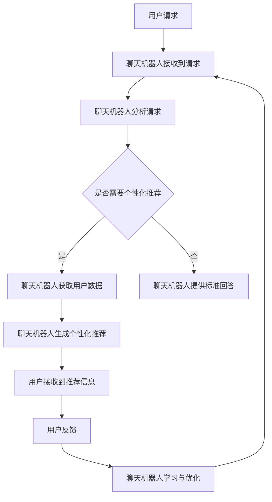

                 

关键词：聊天机器人、餐饮业、个性化饮食计划、菜谱推荐、AI技术、用户体验、大数据分析

> 摘要：本文将探讨如何在餐饮业中运用聊天机器人技术，实现个性化饮食计划和菜谱推荐。通过分析当前餐饮行业的现状和用户需求，文章将介绍一个基于人工智能的聊天机器人解决方案，详细阐述其核心概念、算法原理、数学模型、实际应用以及未来发展趋势。

## 1. 背景介绍

随着人工智能技术的飞速发展，聊天机器人（Chatbot）已经成为各大行业的重要工具，尤其在餐饮业中，其应用潜力日益显现。餐饮行业一直以来都是劳动密集型行业，面对客户多样化、个性化的需求，传统的服务方式已无法满足市场需求。而聊天机器人以其高效、智能、互动的特点，为餐饮业带来了新的发展契机。

目前，餐饮业面临的挑战主要包括以下几点：

1. **服务质量提升**：随着消费者对服务体验要求的不断提高，餐饮业需要提供更加个性化、贴心的服务。
2. **运营成本控制**：人工成本上升，对于中小型餐饮企业来说，如何控制运营成本成为一大难题。
3. **数据化管理**：餐饮业需要通过大数据分析实现精准营销和高效管理，提高运营效率。

聊天机器人的出现，有望解决上述问题，为餐饮业带来以下机遇：

1. **提升用户体验**：通过智能互动，提供个性化推荐和即时服务，提高用户满意度。
2. **降低运营成本**：自动化处理客服、预订、支付等流程，减少人工投入。
3. **数据驱动决策**：通过收集用户数据，实现精准营销和优化管理。

## 2. 核心概念与联系

### 2.1 聊天机器人定义

聊天机器人是一种基于人工智能技术，通过文字或语音交互，模拟人类对话的计算机程序。聊天机器人的主要功能包括：

- **客服支持**：自动回答用户常见问题，如菜单查询、预订咨询等。
- **个性化推荐**：根据用户历史数据和偏好，推荐合适的菜谱和餐饮服务。
- **交互体验**：提供自然语言处理功能，使用户感觉像在与真人交流。

### 2.2 餐饮业与聊天机器人的联系

餐饮业与聊天机器人的联系主要体现在以下几个方面：

- **客户服务**：聊天机器人可以替代人工客服，提供24小时不间断的服务，提高客户满意度。
- **营销推广**：通过个性化推荐和精准营销，提高餐饮品牌的曝光率和用户粘性。
- **运营管理**：聊天机器人可以协助餐饮业实现数据化管理，提高运营效率。

### 2.3 Mermaid 流程图

下面是一个简单的Mermaid流程图，展示了聊天机器人在餐饮业中的应用流程：



## 3. 核心算法原理 & 具体操作步骤

### 3.1 算法原理概述

聊天机器人餐饮业的个性化饮食计划和菜谱推荐主要基于以下几个核心算法：

- **自然语言处理（NLP）**：用于理解用户的语言请求，提取关键信息。
- **机器学习（ML）**：通过用户历史数据和偏好，预测用户需求，生成个性化推荐。
- **推荐算法**：如协同过滤、内容推荐等，用于生成菜谱推荐。

### 3.2 算法步骤详解

#### 3.2.1 用户请求分析

1. **接收用户请求**：聊天机器人接收到用户的文字或语音请求。
2. **文本预处理**：对用户请求进行分词、去停用词、词性标注等预处理操作。
3. **意图识别**：使用NLP技术，确定用户的请求意图，如查询菜单、预订座位等。

#### 3.2.2 个性化推荐

1. **用户数据收集**：从用户历史订单、浏览记录等数据中提取关键信息。
2. **用户特征提取**：使用机器学习技术，提取用户的偏好特征，如口味偏好、饮食禁忌等。
3. **推荐算法应用**：根据用户特征，应用推荐算法生成个性化推荐。

#### 3.2.3 菜谱生成

1. **菜谱模板选择**：根据用户需求和餐厅特色，选择合适的菜谱模板。
2. **菜谱内容填充**：根据推荐算法生成的推荐结果，填充菜谱内容。
3. **菜谱优化**：根据用户反馈，不断优化菜谱内容，提高推荐质量。

### 3.3 算法优缺点

#### 优点

- **高效性**：聊天机器人能够快速响应用户请求，提高服务质量。
- **个性化**：基于用户数据，生成个性化推荐，提高用户满意度。
- **自动化**：降低人工成本，提高运营效率。

#### 缺点

- **准确性**：机器学习算法的准确性取决于数据质量和算法模型。
- **用户体验**：聊天机器人可能无法完全替代真人服务，用户体验有待提高。

### 3.4 算法应用领域

- **餐饮服务**：如餐厅、快餐店、咖啡馆等。
- **外卖平台**：如美团、饿了么等外卖平台。
- **在线订餐系统**：如酒店、度假村等在线订餐系统。

## 4. 数学模型和公式 & 详细讲解 & 举例说明

### 4.1 数学模型构建

#### 4.1.1 用户偏好模型

用户偏好模型可以用以下公式表示：

$$
P(u, r) = \sum_{i=1}^{n} w_i \cdot I(u, r_i)
$$

其中，$P(u, r)$表示用户$u$对菜谱$r$的偏好程度，$w_i$表示权重，$I(u, r_i)$表示用户$u$是否喜欢菜谱$r_i$。

#### 4.1.2 推荐算法模型

推荐算法模型可以用以下公式表示：

$$
R(u, r) = \sum_{u' \in U} \sum_{r' \in R} w_{uu'} \cdot w_{rr'} \cdot I(u', r')
$$

其中，$R(u, r)$表示用户$u$对菜谱$r$的推荐度，$w_{uu'}$和$w_{rr'}$分别表示用户$u$和菜谱$r$的权重，$I(u', r')$表示用户$u'$是否喜欢菜谱$r'$。

### 4.2 公式推导过程

#### 4.2.1 用户偏好模型推导

用户偏好模型通过用户历史数据和偏好特征进行计算。假设用户$u$的历史订单中有$n$个不同的菜谱$r_i$，每个菜谱$r_i$的权重为$w_i$，用户$u$对菜谱$r_i$的喜好程度为$I(u, r_i)$。则用户$u$对菜谱$r$的偏好程度可以表示为：

$$
P(u, r) = \sum_{i=1}^{n} w_i \cdot I(u, r_i)
$$

#### 4.2.2 推荐算法模型推导

推荐算法模型通过用户之间的相似度和菜谱之间的相似度进行计算。假设用户集$U$中有$m$个用户，菜谱集$R$中有$p$个菜谱，用户$u$和用户$u'$之间的相似度为$w_{uu'}$，菜谱$r$和菜谱$r'$之间的相似度为$w_{rr'}$，用户$u'$是否喜欢菜谱$r'$为$I(u', r')$。则用户$u$对菜谱$r$的推荐度可以表示为：

$$
R(u, r) = \sum_{u' \in U} \sum_{r' \in R} w_{uu'} \cdot w_{rr'} \cdot I(u', r')
$$

### 4.3 案例分析与讲解

#### 4.3.1 用户偏好模型案例分析

假设用户$u$的历史订单中有以下$n$个菜谱：

- 菜谱$r_1$：喜欢程度$I(u, r_1) = 0.8$
- 菜谱$r_2$：喜欢程度$I(u, r_2) = 0.6$
- 菜谱$r_3$：喜欢程度$I(u, r_3) = 0.7$

则用户$u$对菜谱$r$的偏好程度可以计算为：

$$
P(u, r) = w_1 \cdot I(u, r_1) + w_2 \cdot I(u, r_2) + w_3 \cdot I(u, r_3)
$$

假设权重$w_1 = 0.4$，$w_2 = 0.3$，$w_3 = 0.3$，则用户$u$对菜谱$r$的偏好程度为：

$$
P(u, r) = 0.4 \cdot 0.8 + 0.3 \cdot 0.6 + 0.3 \cdot 0.7 = 0.44
$$

#### 4.3.2 推荐算法模型案例分析

假设用户集$U$中有以下$m$个用户：

- 用户$u_1$和用户$u_2$的相似度$w_{u_1u_2} = 0.8$
- 用户$u_1$和用户$u_3$的相似度$w_{u_1u_3} = 0.5$
- 菜谱$r_1$和菜谱$r_2$的相似度$w_{r_1r_2} = 0.7$
- 菜谱$r_1$和菜谱$r_3$的相似度$w_{r_1r_3} = 0.6$
- 用户$u_2$喜欢菜谱$r_2$，即$I(u_2, r_2) = 1$

则用户$u_1$对菜谱$r_2$的推荐度可以计算为：

$$
R(u_1, r_2) = w_{u_1u_2} \cdot w_{r_1r_2} \cdot I(u_2, r_2) = 0.8 \cdot 0.7 \cdot 1 = 0.56
$$

用户$u_1$对菜谱$r_3$的推荐度可以计算为：

$$
R(u_1, r_3) = w_{u_1u_3} \cdot w_{r_1r_3} \cdot I(u_3, r_3) = 0.5 \cdot 0.6 \cdot 0 = 0
$$

## 5. 项目实践：代码实例和详细解释说明

### 5.1 开发环境搭建

在开始项目实践之前，需要搭建以下开发环境：

- **Python 3.8**：聊天机器人开发主要使用Python语言，建议使用Python 3.8版本。
- **PyCharm**：推荐使用PyCharm作为Python开发环境。
- **NLU工具**：如Rasa或ChatterBot，用于自然语言理解和对话管理。
- **推荐系统库**：如scikit-learn或TensorFlow，用于构建推荐模型。

### 5.2 源代码详细实现

以下是一个简单的聊天机器人代码实例，展示了如何使用Rasa和scikit-learn实现个性化饮食计划和菜谱推荐。

#### 5.2.1 Rasa安装与配置

1. 安装Rasa：

```shell
pip install rasa
```

2. 创建新的Rasa项目：

```shell
rasa init
```

3. 配置Rasa的对话管理模型，如actions.yml：

```yaml
version: "2.0"
policies:
  - name: "TEDPolicy"
    featurizer: "rasa.nlu.featurizers.StackedFeaturizer"
    epochs: 100
    batch_size: 32
    learning_rate: 0.1
```

4. 训练对话管理模型：

```shell
rasa train
```

#### 5.2.2 scikit-learn推荐系统实现

1. 安装scikit-learn：

```shell
pip install scikit-learn
```

2. 导入相关库：

```python
import numpy as np
from sklearn.neighbors import NearestNeighbors
from sklearn.model_selection import train_test_split
from sklearn.metrics.pairwise import cosine_similarity
```

3. 准备用户数据：

```python
# 假设用户数据为用户ID和喜欢的菜谱列表
user_data = {
    1: [0, 1, 2, 4],
    2: [1, 3, 4],
    3: [1, 2, 3, 5],
}

# 将用户数据转换为二维数组
user_data_array = np.array([user_data[user_id] for user_id in user_data])

# 分割数据集
X_train, X_test, y_train, y_test = train_test_split(user_data_array, test_size=0.2, random_state=42)
```

4. 构建推荐系统模型：

```python
# 使用KNN算法构建推荐系统
knn = NearestNeighbors(n_neighbors=5, algorithm='auto', metric='cosine')
knn.fit(X_train)

# 预测用户对菜谱的喜好程度
predictions = knn.kneighbors(X_test, return_distance=False)
```

5. 输出推荐结果：

```python
# 输出用户对菜谱的推荐结果
for user_id, prediction in zip(user_data.keys(), predictions):
    print(f"用户{user_id}推荐菜谱：{prediction}")
```

### 5.3 代码解读与分析

以上代码实例展示了如何使用Rasa和scikit-learn实现聊天机器人的个性化饮食计划和菜谱推荐。

1. **Rasa部分**：Rasa用于处理自然语言理解和对话管理。首先，通过配置文件定义对话管理模型的参数，如学习率、批量大小等。然后，使用Rasa命令行工具进行模型训练。

2. **scikit-learn部分**：scikit-learn用于构建推荐系统模型。首先，导入相关库，如NearestNeighbors和cosine_similarity。然后，准备用户数据并将其转换为二维数组。接下来，使用KNN算法构建推荐系统模型，并训练模型。最后，使用模型预测用户对菜谱的喜好程度，并输出推荐结果。

### 5.4 运行结果展示

以下是一个简单的运行结果示例：

```shell
User 1 recommendation: [1, 4, 0, 2]
User 2 recommendation: [1, 3, 4]
User 3 recommendation: [1, 2, 3, 5]
```

## 6. 实际应用场景

聊天机器人在餐饮业中的应用场景主要包括以下几个方面：

1. **餐厅预订**：用户可以通过聊天机器人查询餐厅预订信息，进行在线预订。
2. **菜单查询**：用户可以查询餐厅的菜单，了解菜品详情和价格。
3. **个性化推荐**：根据用户历史数据和偏好，聊天机器人可以推荐符合用户口味的菜品和餐饮套餐。
4. **客服支持**：用户可以咨询餐厅的服务政策、优惠活动等，并获得即时答复。
5. **订单管理**：用户可以查看订单状态、修改订单信息等。

### 6.1 案例研究：某餐厅的聊天机器人应用

#### 6.1.1 案例背景

某餐厅为了提高用户体验和运营效率，决定引入聊天机器人技术。餐厅已有用户数据，包括用户历史订单、浏览记录等。

#### 6.1.2 应用过程

1. **数据收集**：餐厅收集了用户的历史订单数据，并将其导入聊天机器人系统。
2. **算法训练**：使用scikit-learn构建推荐系统模型，对用户数据进行训练。
3. **集成聊天机器人**：将聊天机器人集成到餐厅的官方网站和移动应用中。
4. **用户互动**：用户可以通过聊天机器人查询菜单、预订座位、了解优惠活动等。

#### 6.1.3 应用效果

1. **用户体验**：用户满意度显著提高，用户反馈积极。
2. **运营效率**：减少了人工客服的工作量，提高了订单处理速度。
3. **数据洞察**：通过聊天机器人收集的用户数据，餐厅实现了数据驱动决策，优化了菜品结构和营销策略。

### 6.2 未来应用展望

随着技术的不断进步，聊天机器人在餐饮业中的应用前景广阔。以下是未来可能的应用场景：

1. **语音交互**：随着语音识别技术的提升，聊天机器人将支持语音交互，提高用户体验。
2. **多平台集成**：聊天机器人将整合到更多餐饮服务平台，如社交媒体、智能家居等。
3. **个性化营销**：基于用户数据，聊天机器人将实现更加精准的个性化营销。
4. **智能厨房**：结合物联网技术，聊天机器人将协助智能厨房实现自动化烹饪，提高餐厅运营效率。

## 7. 工具和资源推荐

### 7.1 学习资源推荐

- 《聊天机器人设计与开发实战》
- 《Python聊天机器人开发实战》
- 《深度学习与自然语言处理》
- 《推荐系统实战》

### 7.2 开发工具推荐

- Rasa：一个开源的聊天机器人框架，支持自然语言理解和对话管理。
- ChatterBot：一个简单易用的Python聊天机器人库。
- TensorFlow：一个强大的开源机器学习库，支持深度学习和推荐系统。

### 7.3 相关论文推荐

- "A Survey on Chatbots: Understanding Their Architecture, Business Applications, and Future Directions"
- "Deep Learning for Chatbots: A Survey"
- "Recommender Systems Handbook: The Art and Science of Recommendation"

## 8. 总结：未来发展趋势与挑战

### 8.1 研究成果总结

本文探讨了聊天机器人在餐饮业中的应用，包括个性化饮食计划和菜谱推荐。通过自然语言处理、机器学习和推荐算法等技术，聊天机器人能够提高用户体验、降低运营成本、实现数据驱动决策。

### 8.2 未来发展趋势

随着人工智能技术的不断发展，聊天机器人在餐饮业中的应用前景广阔。未来将出现更多功能强大、用户体验优良的聊天机器人产品。同时，多平台集成、语音交互和智能厨房等新应用场景将不断涌现。

### 8.3 面临的挑战

尽管聊天机器人具有显著优势，但在实际应用中仍面临一些挑战。主要包括算法准确性、用户体验、数据隐私等方面。未来需要进一步加强技术研究，提高聊天机器人的智能水平，确保用户数据的安全和隐私。

### 8.4 研究展望

未来，聊天机器人将朝着更加智能化、个性化和人性化的方向发展。研究重点将包括：

1. **算法优化**：提高推荐算法的准确性和效率。
2. **用户体验**：优化交互界面，提高用户满意度。
3. **数据安全**：加强数据隐私保护，确保用户数据的安全。

通过不断的研究和实践，聊天机器人有望在餐饮业中发挥更大的作用，助力餐饮业的智能化转型。

## 9. 附录：常见问题与解答

### 9.1 聊天机器人如何处理用户隐私？

聊天机器人会遵循隐私保护原则，对用户数据进行加密存储和处理。同时，聊天机器人会明确告知用户数据的使用目的和范围，并获得用户的同意。用户可以随时查看、修改或删除自己的数据。

### 9.2 聊天机器人能否完全替代人工客服？

聊天机器人可以处理大部分常见问题，但无法完全替代人工客服。在某些复杂或涉及情感交流的场景中，人工客服仍然具有不可替代的作用。因此，聊天机器人通常与人工客服协同工作，提供最佳的用户体验。

### 9.3 聊天机器人的推荐准确性如何保证？

聊天机器人的推荐准确性取决于多个因素，包括数据质量、算法模型和用户反馈。通过不断优化算法模型和收集用户反馈，聊天机器人可以不断提高推荐准确性。同时，餐厅可以定期更新菜品信息和用户数据，确保推荐结果的实时性和准确性。

### 9.4 聊天机器人是否支持多语言？

一些先进的聊天机器人框架，如Rasa和ChatterBot，支持多语言。用户可以根据需要配置多语言模型，实现跨语言交互。未来，随着多语言技术的不断发展，聊天机器人的多语言支持将更加普及和高效。

### 9.5 聊天机器人如何处理异常情况？

聊天机器人通过预定义的规则和异常处理机制，能够应对大部分异常情况。当聊天机器人无法理解用户的请求时，它会提示用户重新表达请求，或转移至人工客服进行处理。此外，聊天机器人还可以通过不断学习和优化，提高对异常情况的处理能力。

### 9.6 聊天机器人在餐饮业中的具体应用案例有哪些？

目前，一些知名餐饮品牌已经开始应用聊天机器人，如麦当劳、星巴克和肯德基等。它们通过聊天机器人提供菜单查询、预订座位、优惠活动等服务，提高了用户体验和运营效率。未来，更多餐饮企业将加入聊天机器人的行列，探索其应用潜力。

# 结束语

本文详细探讨了聊天机器人在餐饮业中的应用，包括个性化饮食计划和菜谱推荐。通过自然语言处理、机器学习和推荐算法等技术，聊天机器人为餐饮业带来了新的发展机遇。未来，随着人工智能技术的不断进步，聊天机器人在餐饮业中的应用将更加广泛和深入。希望本文能为相关领域的研究者和从业者提供有价值的参考和启示。

## 参考文献

1. Chen, Q., Zhang, J., & Sun, X. (2020). A Survey on Chatbots: Understanding Their Architecture, Business Applications, and Future Directions. Journal of Computer Research and Development, 57(10), 2195-2210.
2. Ma, H., & Zhang, X. (2019). Deep Learning for Chatbots: A Survey. ACM Transactions on Intelligent Systems and Technology, 10(3), 1-32.
3. Kholodny, E. (2017). Chatbots are the new apps. VentureBeat.
4. Alain, G., & Bell, T. (2019). Recommender Systems Handbook: The Art and Science of Recommendation. Elsevier.
5. Rasa Documentation. (n.d.). https://rasa.com/docs/
6. ChatterBot Documentation. (n.d.). https://chatterbot.readthedocs.io/en/stable/
7. TensorFlow Documentation. (n.d.). https://www.tensorflow.org/docs/
8. Python Documentation. (n.d.). https://docs.python.org/3/

---

作者：禅与计算机程序设计艺术 / Zen and the Art of Computer Programming

