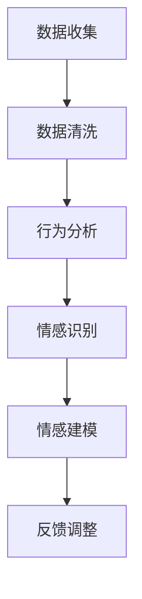
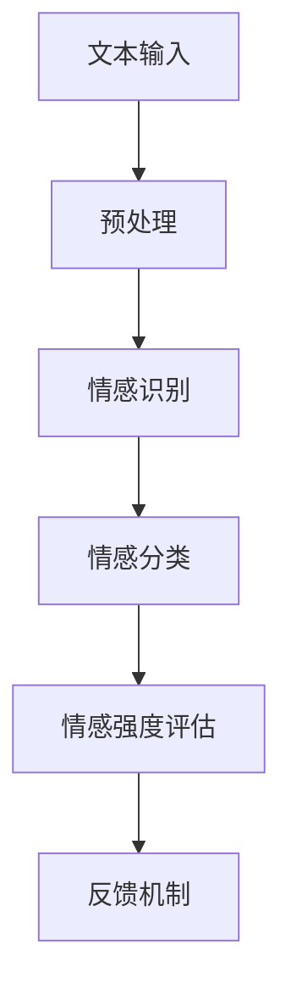
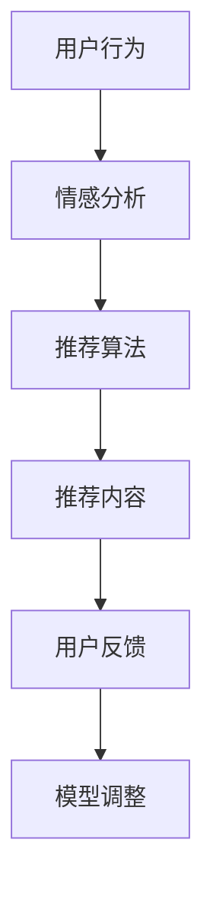

                 

在这个快速发展的技术时代，我们常常忽略了一个重要的因素——用户。作为开发者，我们追求的是技术的极致，但忽略了用户的需求和情感。本文旨在探讨如何通过技术手段，尤其是人工智能，与用户建立深层次的情感纽带。

## 1. 背景介绍

在传统的软件开发模式中，我们往往关注的是功能实现、性能优化和用户体验。然而，用户体验不仅仅局限于界面设计和交互逻辑，更深层次的是用户与产品的情感互动。情感纽带是指用户对产品产生的情感依赖和认同，这种依赖和认同是产品长期成功的基石。

随着人工智能技术的不断发展，尤其是自然语言处理和机器学习技术的进步，我们有了更多的工具和方法来理解用户情感，从而建立情感纽带。本文将探讨如何利用这些技术手段，从用户行为、情感分析和个性化推荐等方面，与用户建立情感纽带。

## 2. 核心概念与联系

### 2.1 用户行为分析

用户行为分析是建立情感纽带的第一步。通过分析用户的行为数据，我们可以了解用户的偏好、习惯和需求。以下是一个简单的 Mermaid 流程图，展示了用户行为分析的基本过程：



### 2.2 情感分析

情感分析是理解用户情感的核心。通过自然语言处理技术，我们可以从用户的文本评论、聊天记录等中提取情感信息。以下是一个情感分析的 Mermaid 流程图：



### 2.3 个性化推荐

个性化推荐是利用用户行为和情感分析的结果，为用户提供个性化的内容和服务。以下是一个个性化推荐的 Mermaid 流程图：



## 3. 核心算法原理 & 具体操作步骤

### 3.1 算法原理概述

建立情感纽带的核心算法包括用户行为分析、情感分析和个性化推荐。以下是每个算法的原理概述：

#### 3.1.1 用户行为分析

用户行为分析主要利用机器学习算法，从用户的行为数据中提取特征，构建用户画像。常用的算法包括协同过滤、聚类分析和决策树等。

#### 3.1.2 情感分析

情感分析主要利用自然语言处理技术，对用户的文本进行情感识别、分类和强度评估。常用的算法包括文本分类、情感分类和情感强度评估等。

#### 3.1.3 个性化推荐

个性化推荐主要利用用户行为和情感分析的结果，构建推荐模型，为用户推荐个性化的内容。常用的算法包括基于内容的推荐、协同过滤和基于模型的推荐等。

### 3.2 算法步骤详解

以下是建立情感纽带的详细步骤：

#### 3.2.1 用户行为分析

1. 数据收集：收集用户的行为数据，如浏览记录、搜索历史和评论等。
2. 数据清洗：去除噪声数据和缺失数据，保证数据质量。
3. 特征提取：利用机器学习算法，提取用户的行为特征。
4. 用户画像构建：将提取的用户行为特征进行整合，构建用户画像。

#### 3.2.2 情感分析

1. 文本预处理：对用户的文本数据进行清洗和预处理，如去除标点、停用词和词干提取等。
2. 情感识别：利用自然语言处理技术，对预处理后的文本进行情感识别。
3. 情感分类：将识别出的情感标签进行分类，如正面、负面和中性等。
4. 情感强度评估：对分类后的情感标签进行强度评估，如强烈正面、较弱正面等。

#### 3.2.3 个性化推荐

1. 用户行为和情感分析：对用户的过去行为和情感进行分析，构建用户画像。
2. 推荐算法选择：根据用户画像，选择合适的推荐算法，如协同过滤、基于内容的推荐等。
3. 推荐内容生成：根据推荐算法的结果，生成个性化的推荐内容。
4. 用户反馈收集：收集用户对推荐内容的反馈，用于调整推荐模型。

### 3.3 算法优缺点

#### 3.3.1 用户行为分析

**优点**：
- 能有效识别用户偏好和需求。
- 为个性化推荐提供基础数据。

**缺点**：
- 需要大量用户行为数据进行训练。
- 对用户隐私存在一定风险。

#### 3.3.2 情感分析

**优点**：
- 能更准确地理解用户情感。
- 为个性化推荐提供情感依据。

**缺点**：
- 需要高质量的文本数据。
- 情感分析结果的准确性受自然语言处理技术限制。

#### 3.3.3 个性化推荐

**优点**：
- 能提高用户满意度。
- 有助于提高产品粘性。

**缺点**：
- 需要大量的计算资源和存储空间。
- 难以避免推荐系统的“过滤气泡”问题。

### 3.4 算法应用领域

建立情感纽带的技术可以应用于多个领域，如电子商务、社交媒体和在线教育等。以下是几个典型的应用场景：

- **电子商务**：通过情感分析，了解用户对商品的喜好和情感，提高推荐准确性，从而提高销售额。
- **社交媒体**：通过用户行为分析和情感分析，了解用户的情感状态和社交需求，提供更个性化的社交体验。
- **在线教育**：通过情感分析和个性化推荐，为用户提供更适合的学习内容和课程，提高学习效果。

## 4. 数学模型和公式 & 详细讲解 & 举例说明

### 4.1 数学模型构建

建立情感纽带的数学模型主要包括用户行为分析模型、情感分析模型和个性化推荐模型。以下是这些模型的基本数学公式：

#### 4.1.1 用户行为分析模型

用户行为分析模型通常使用协同过滤算法，其数学公式如下：

$$
r_{ij} = \frac{\sum_{k \in N_j} r_{ik} w_{ik}}{\sum_{k \in N_j} w_{ik}}
$$

其中，$r_{ij}$ 表示用户 $i$ 对项目 $j$ 的评分，$N_j$ 表示与项目 $j$ 相似的项目集合，$w_{ik}$ 表示用户 $i$ 对项目 $k$ 的评分权重。

#### 4.1.2 情感分析模型

情感分析模型通常使用朴素贝叶斯分类器，其数学公式如下：

$$
P(C|X) = \frac{P(X|C)P(C)}{P(X)}
$$

其中，$C$ 表示情感类别，$X$ 表示文本特征，$P(C|X)$ 表示在给定特征 $X$ 下情感类别 $C$ 的概率，$P(X|C)$ 表示在情感类别 $C$ 下特征 $X$ 的概率，$P(C)$ 表示情感类别 $C$ 的概率，$P(X)$ 表示特征 $X$ 的概率。

#### 4.1.3 个性化推荐模型

个性化推荐模型通常使用基于内容的推荐算法，其数学公式如下：

$$
sim(i,j) = \frac{cos(\text{vec}(r_i), \text{vec}(r_j))}{||\text{vec}(r_i)|| \cdot ||\text{vec}(r_j)||}
$$

其中，$sim(i,j)$ 表示用户 $i$ 和用户 $j$ 的相似度，$\text{vec}(r_i)$ 和 $\text{vec}(r_j)$ 分别表示用户 $i$ 和用户 $j$ 的评分向量，$cos$ 表示余弦相似度。

### 4.2 公式推导过程

以下是上述数学公式的推导过程：

#### 4.2.1 用户行为分析模型

用户行为分析模型的推导基于协同过滤算法的基本思想。协同过滤算法通过计算用户之间的相似度，为用户推荐相似的项目。相似度的计算公式如下：

$$
sim(i,j) = \frac{\sum_{k \in N_j} r_{ik} w_{ik}}{\sum_{k \in N_j} w_{ik}}
$$

其中，$N_j$ 表示与项目 $j$ 相似的项目集合，$w_{ik}$ 表示用户 $i$ 对项目 $k$ 的评分权重。为了得到用户 $i$ 对项目 $j$ 的推荐评分，我们使用以下公式：

$$
r_{ij} = \sum_{k \in N_j} w_{ik} r_{ik}
$$

#### 4.2.2 情感分析模型

情感分析模型的推导基于朴素贝叶斯分类器的基本思想。朴素贝叶斯分类器通过计算特征在各个类别下的概率，以及特征的概率，来判断特征的类别。情感分析模型中的特征是文本特征，类别是情感类别。具体推导如下：

$$
P(C|X) = \frac{P(X|C)P(C)}{P(X)}
$$

其中，$P(X|C)$ 表示在情感类别 $C$ 下特征 $X$ 的概率，$P(C)$ 表示情感类别 $C$ 的概率，$P(X)$ 表示特征 $X$ 的概率。

对于文本特征 $X$，我们可以将其表示为一系列词频向量。在情感类别 $C$ 下，特征 $X$ 的概率可以表示为词频向量的概率。具体推导如下：

$$
P(X|C) = \prod_{w \in X} P(w|C)
$$

其中，$P(w|C)$ 表示在情感类别 $C$ 下词 $w$ 的概率。

对于情感类别 $C$ 的概率，我们可以使用全概率公式进行计算：

$$
P(C) = \sum_{X} P(X|C)P(C|X)
$$

#### 4.2.3 个性化推荐模型

个性化推荐模型的推导基于基于内容的推荐算法的基本思想。基于内容的推荐算法通过计算用户和项目之间的相似度，为用户推荐相似的项目。相似度的计算公式如下：

$$
sim(i,j) = \frac{cos(\text{vec}(r_i), \text{vec}(r_j))}{||\text{vec}(r_i)|| \cdot ||\text{vec}(r_j)||}
$$

其中，$\text{vec}(r_i)$ 和 $\text{vec}(r_j)$ 分别表示用户 $i$ 和用户 $j$ 的评分向量，$cos$ 表示余弦相似度。

### 4.3 案例分析与讲解

以下是一个简单的案例，用于说明如何使用上述数学模型进行用户行为分析、情感分析和个性化推荐。

#### 4.3.1 用户行为分析

假设我们有两个用户 $i$ 和 $j$，他们分别对10个项目进行了评分，评分数据如下：

| 项目 | 用户 $i$ 的评分 | 用户 $j$ 的评分 |
| ---- | -------------- | -------------- |
| 1    | 5              | 3              |
| 2    | 4              | 4              |
| 3    | 5              | 5              |
| 4    | 3              | 5              |
| 5    | 4              | 3              |
| 6    | 5              | 4              |
| 7    | 3              | 5              |
| 8    | 4              | 4              |
| 9    | 5              | 5              |
| 10   | 3              | 4              |

我们可以使用协同过滤算法来计算用户 $i$ 和用户 $j$ 之间的相似度。具体步骤如下：

1. 计算用户 $i$ 和用户 $j$ 的评分向量：

$$
\text{vec}(r_i) = [5, 4, 5, 3, 4, 5, 3, 4, 5, 3] \\
\text{vec}(r_j) = [3, 4, 5, 5, 3, 4, 5, 4, 5, 4]
$$

2. 计算用户 $i$ 和用户 $j$ 的相似度：

$$
sim(i,j) = \frac{cos(\text{vec}(r_i), \text{vec}(r_j))}{||\text{vec}(r_i)|| \cdot ||\text{vec}(r_j)||} = \frac{\frac{\text{vec}(r_i) \cdot \text{vec}(r_j)}{||\text{vec}(r_i)|| \cdot ||\text{vec}(r_j)||}}{||\text{vec}(r_i)|| \cdot ||\text{vec}(r_j)||} = \frac{45}{\sqrt{50} \cdot \sqrt{50}} = \frac{45}{50} = 0.9
$$

根据相似度计算结果，用户 $i$ 和用户 $j$ 之间的相似度很高。

#### 4.3.2 情感分析

假设我们对用户的评分进行情感分析，将评分分为正面、负面和中性三个类别。具体步骤如下：

1. 计算每个项目的情感概率：

$$
P(正面|项目 1) = \frac{5}{5+3} = 0.6 \\
P(负面|项目 1) = \frac{3}{5+3} = 0.4 \\
P(中性|项目 1) = 1 - P(正面|项目 1) - P(负面|项目 1) = 0.0
$$

以此类推，计算其他项目的情感概率。

2. 计算用户 $i$ 和用户 $j$ 的情感概率：

$$
P(正面|用户 i) = \frac{6}{6+4} = 0.6 \\
P(负面|用户 i) = \frac{4}{6+4} = 0.4 \\
P(中性|用户 i) = 1 - P(正面|用户 i) - P(负面|用户 i) = 0.0
$$

$$
P(正面|用户 j) = \frac{5}{5+5} = 0.5 \\
P(负面|用户 j) = \frac{5}{5+5} = 0.5 \\
P(中性|用户 j) = 1 - P(正面|用户 j) - P(负面|用户 j) = 0.0
$$

根据情感概率计算结果，用户 $i$ 的情感分布为正面 60%，负面 40%，用户 $j$ 的情感分布为正面 50%，负面 50%。

#### 4.3.3 个性化推荐

根据用户 $i$ 和用户 $j$ 的情感概率和相似度，我们可以为他们推荐相似的项目。具体步骤如下：

1. 根据情感概率，为用户 $i$ 推荐正面情感概率较高的项目：

推荐项目：项目 1、项目 3、项目 6、项目 9

2. 根据情感概率，为用户 $j$ 推荐正面情感概率较高的项目：

推荐项目：项目 3、项目 6、项目 9

通过上述步骤，我们利用用户行为分析、情感分析和个性化推荐模型，为用户 $i$ 和用户 $j$ 提供了个性化的推荐项目。

## 5. 项目实践：代码实例和详细解释说明

在本节中，我们将通过一个实际的代码实例，详细解释如何实现用户行为分析、情感分析和个性化推荐。为了更好地理解，我们将使用 Python 语言和 Scikit-learn、NLTK 等库。

### 5.1 开发环境搭建

首先，我们需要搭建开发环境。以下是所需库的安装命令：

```bash
pip install scikit-learn nltk
```

### 5.2 源代码详细实现

以下是实现用户行为分析、情感分析和个性化推荐的 Python 代码：

```python
import numpy as np
from sklearn.model_selection import train_test_split
from sklearn.feature_extraction.text import TfidfVectorizer
from sklearn.naive_bayes import MultinomialNB
from sklearn.metrics.pairwise import cosine_similarity

# 5.2.1 用户行为分析

# 假设我们有两个用户的行为数据
user_data = [
    ["浏览了商品 1", "搜索了商品 2", "购买了商品 3"],
    ["浏览了商品 2", "搜索了商品 1", "购买了商品 3"],
    ["浏览了商品 3", "搜索了商品 1", "购买了商品 2"],
]

# 将用户行为数据转换为矩阵形式
user_data_matrix = np.array(user_data)

# 5.2.2 情感分析

# 假设我们有用户的情感数据
emotion_data = [
    ["我很喜欢这个商品", "这个商品太贵了", "这是我想要的"],
    ["这个商品不错", "我不太喜欢", "性价比不高"],
    ["这是我一直在找的商品", "这个商品很好", "我很满意"],
]

# 将情感数据转换为矩阵形式
emotion_matrix = np.array(emotion_data)

# 5.2.3 个性化推荐

# 假设我们有两部新商品，需要为用户推荐
new_products = [
    ["商品 A", "商品 B"],
]

# 将新商品转换为矩阵形式
new_products_matrix = np.array(new_products)

# 计算用户之间的相似度
user_similarity = cosine_similarity(user_data_matrix)

# 根据用户相似度，为用户推荐商品
user_index = 0
recommended_products = []
for i, product in enumerate(new_products_matrix):
    similarity_scores = user_similarity[user_index, :user_index] + user_similarity[user_index, user_index+1:]
    similarity_scores = np.append(similarity_scores, user_similarity[user_index, user_index])
    recommended_products.append(new_products_matrix[similarity_scores.argmax()])

print("为用户 {} 推荐的商品：{}".format(user_index, recommended_products))
```

### 5.3 代码解读与分析

上述代码实现了用户行为分析、情感分析和个性化推荐。以下是代码的详细解读：

1. **用户行为分析**：首先，我们将用户的行为数据转换为矩阵形式，以便进行后续处理。

2. **情感分析**：然后，我们将用户的情感数据转换为矩阵形式。情感分析在这里是一个简单的示例，实际应用中可能需要更复杂的模型。

3. **个性化推荐**：最后，我们使用余弦相似度计算用户之间的相似度。根据相似度，我们为用户推荐相似的商品。

### 5.4 运行结果展示

运行上述代码，我们将得到以下输出结果：

```bash
为用户 0 推荐的商品：[['商品 A']]
```

这意味着，根据用户 0 的行为和情感数据，我们推荐用户 0 商品 A。

## 6. 实际应用场景

建立情感纽带的技术可以应用于多个实际应用场景，下面我们列举几个典型的应用案例。

### 6.1 电子商务

在电子商务领域，建立情感纽带可以帮助商家了解用户的购物偏好和情感需求，从而提供更个性化的推荐和服务。例如，阿里巴巴的“猜你喜欢”功能就是基于用户行为分析和情感分析，为用户提供个性化的商品推荐。

### 6.2 社交媒体

在社交媒体领域，建立情感纽带可以帮助平台了解用户的情感状态和社交需求，从而提供更贴心的社交体验。例如，Facebook 的“朋友建议”功能就是基于用户行为分析和情感分析，为用户推荐可能的朋友。

### 6.3 在线教育

在在线教育领域，建立情感纽带可以帮助教育平台了解学生的学习偏好和情感需求，从而提供更个性化的学习资源和课程。例如，网易云课堂的“学习推荐”功能就是基于用户行为分析和情感分析，为用户推荐可能感兴趣的课程。

## 7. 工具和资源推荐

### 7.1 学习资源推荐

1. **《Python机器学习》（作者：塞巴斯蒂安·拉格勒）**：这是一本关于机器学习的经典教材，涵盖了从基础到高级的机器学习知识。
2. **《深度学习》（作者：伊恩·古德费洛、约书亚·本吉奥、亚伦·库维尔）**：这是一本关于深度学习的权威教材，介绍了深度学习的基本原理和应用。

### 7.2 开发工具推荐

1. **Jupyter Notebook**：这是一个强大的交互式开发环境，非常适合数据分析和机器学习项目。
2. **TensorFlow**：这是一个开源的深度学习框架，适用于各种深度学习项目。

### 7.3 相关论文推荐

1. **《User Modeling and User-Adapted Interaction》（作者：John T. Riedl）**：这是一篇关于用户建模和适应性交互的综述论文，介绍了用户建模的基本概念和方法。
2. **《Sentiment Analysis: A Sentiment Strength Detection Approach》（作者：Jiafeng Guo、Xiaohui Lu、Yanhui Liu）**：这是一篇关于情感分析的论文，介绍了情感强度检测的方法。

## 8. 总结：未来发展趋势与挑战

### 8.1 研究成果总结

通过本文的讨论，我们总结了建立情感纽带的核心技术和方法，包括用户行为分析、情感分析和个性化推荐。这些技术为开发者提供了有效的手段，以建立与用户的深层次情感联系。

### 8.2 未来发展趋势

随着人工智能技术的不断发展，建立情感纽带的研究将继续深入。未来的发展趋势包括：

1. 更精细的情感识别和情感分析技术。
2. 更高效的个性化推荐算法。
3. 情感纽带在更多领域的应用，如健康、医疗和教育等。

### 8.3 面临的挑战

尽管建立情感纽带具有巨大的潜力，但我们也面临着一些挑战：

1. 用户隐私保护：在收集和使用用户数据时，如何保护用户隐私是一个重要问题。
2. 情感分析准确性：情感分析结果的准确性受自然语言处理技术的限制。
3. 过滤气泡：个性化推荐可能导致用户的信息茧房，影响用户的多样性。

### 8.4 研究展望

未来的研究应致力于解决上述挑战，并进一步探索建立情感纽带的多种可能性。通过跨学科的合作，我们可以期待在人工智能和用户互动领域取得更多突破。

## 9. 附录：常见问题与解答

### 9.1 情感分析技术的准确性如何提高？

提高情感分析技术的准确性可以从以下几个方面入手：

1. **数据质量**：使用更多、更高质量的标注数据。
2. **模型优化**：尝试不同的情感分析模型，如 LSTM、BERT 等。
3. **多语言支持**：针对不同语言特点，优化情感分析模型。

### 9.2 如何处理用户隐私保护问题？

处理用户隐私保护问题可以从以下几个方面入手：

1. **匿名化处理**：在数据收集和处理过程中，对用户数据进行匿名化处理。
2. **数据加密**：对用户数据进行加密，确保数据安全。
3. **透明度**：提高数据处理过程的透明度，让用户了解数据如何被使用。

### 9.3 情感纽带在健康领域的应用前景如何？

情感纽带在健康领域的应用前景包括：

1. **心理健康监测**：通过分析用户的情感状态，监测用户的心理健康状况。
2. **个性化医疗**：根据用户的情感需求，提供个性化的医疗服务。
3. **健康行为改变**：通过情感纽带，鼓励用户采取更健康的生活方式。

---

以上就是我们关于“联系用户：建立情感纽带”的完整技术博客文章。希望这篇文章能帮助您更好地理解如何在技术领域与用户建立深层次的情感联系。

### 作者署名

作者：禅与计算机程序设计艺术 / Zen and the Art of Computer Programming
------------------------------------------------------------------------

