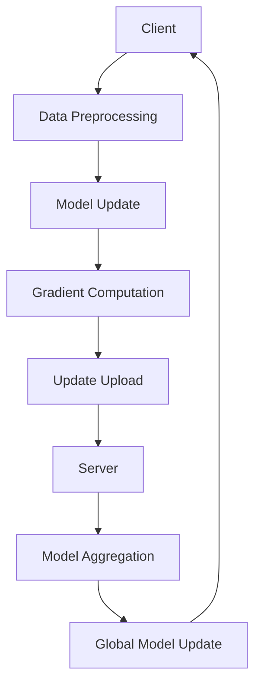

                 

关键词：联邦学习、分布式机器学习、数据隐私保护、加密算法、模型更新、跨域协同

> 摘要：联邦学习（Federated Learning）作为近年来兴起的一种分布式机器学习方法，通过在分布式数据源上协同训练模型，避免了数据泄露的风险，成为保护隐私的重要技术手段。本文将深入探讨联邦学习的核心概念、算法原理、数学模型、项目实践及未来发展趋势，旨在为读者提供一个全面而深入的视角。

## 1. 背景介绍

在信息化和数字化的大潮中，机器学习（ML）已经成为推动技术进步和产业升级的重要力量。然而，传统的集中式机器学习方法往往面临着数据隐私泄露、数据不可访问性等挑战。为了解决这些问题，分布式机器学习方法应运而生，其中联邦学习（Federated Learning）成为最受关注的领域之一。

联邦学习是一种通过分布式数据源协同训练机器学习模型的框架，它的核心思想是在多个数据持有者（如移动设备、互联网服务提供商等）之间共享模型的更新，而不是直接交换数据。这样，不仅可以避免数据泄露的风险，还可以提高模型的泛化能力和鲁棒性。

联邦学习的历史可以追溯到2016年，Google率先提出并公开了联邦学习的相关研究，引起了学术界和工业界的广泛关注。此后，联邦学习不断发展和完善，已经应用于多种场景，包括移动设备上的图像识别、跨域协同推荐系统等。

## 2. 核心概念与联系

### 2.1. 联邦学习的定义与特点

联邦学习（Federated Learning）是一种分布式机器学习方法，其主要特点如下：

- **分布式数据源**：联邦学习涉及多个拥有私有数据的实体（节点），这些实体不希望将数据上传到中央服务器，而是希望在本地进行模型训练。

- **模型更新共享**：在联邦学习中，每个节点都会在本地对模型进行更新，然后仅将模型更新上传到中央服务器，而不是整个模型本身。

- **隐私保护**：联邦学习通过加密算法和差分隐私技术保护数据隐私，确保数据在传输和存储过程中的安全性。

- **协同优化**：通过分布式更新，联邦学习可以实现全局模型优化，提高模型的性能和泛化能力。

### 2.2. 联邦学习的架构

联邦学习通常包括以下几个主要组成部分：

- **中央服务器（Server）**：负责协调模型更新、聚合节点上传的梯度信息，并生成全局模型。

- **节点（Client）**：代表拥有私有数据的实体，负责在本地进行数据预处理、模型更新和梯度计算。

- **加密模块**：用于保护数据隐私，确保数据在传输过程中的安全性。

- **通信网络**：负责节点与服务器之间的数据传输。

下面是联邦学习的基本架构的Mermaid流程图：



## 3. 核心算法原理 & 具体操作步骤

### 3.1. 算法原理概述

联邦学习的基本原理是分布式梯度下降（Distributed Gradient Descent）。在每个迭代周期，中央服务器向所有节点发送全局模型，每个节点在本地使用自己的数据对全局模型进行更新，并计算梯度。然后，每个节点将更新后的模型参数发送回中央服务器，中央服务器再聚合这些更新并生成新的全局模型。

### 3.2. 算法步骤详解

1. **初始化全局模型**：中央服务器初始化全局模型参数，并将初始模型发送给所有节点。

2. **本地数据预处理**：每个节点在本地对数据进行预处理，包括数据清洗、归一化等。

3. **模型更新**：每个节点使用本地数据和全局模型参数进行模型更新。

4. **梯度计算**：每个节点计算梯度，并将其作为模型更新的一部分发送回中央服务器。

5. **模型聚合**：中央服务器接收来自所有节点的模型更新，并计算全局模型的聚合更新。

6. **全局模型更新**：中央服务器生成新的全局模型，并将其发送回所有节点。

7. **迭代**：重复上述步骤，直到满足停止条件（如达到预定的迭代次数或模型收敛）。

### 3.3. 算法优缺点

**优点**：

- **隐私保护**：联邦学习通过本地更新和模型参数共享，避免了数据泄露的风险。

- **灵活性**：联邦学习可以应用于各种分布式场景，包括移动设备、物联网等。

- **高效性**：联邦学习通过并行计算和分布式更新，提高了模型训练的速度。

**缺点**：

- **通信开销**：频繁的模型参数传输会增加通信开销，影响训练效率。

- **模型质量**：由于节点之间的数据分布可能不同，可能导致模型质量下降。

### 3.4. 算法应用领域

联邦学习已经应用于多个领域，包括：

- **移动设备**：在移动设备上进行图像识别、语音识别等。

- **跨域协同**：如跨平台推荐系统、跨行业协同分析等。

- **医疗健康**：保护患者隐私的同时进行疾病预测和诊断。

## 4. 数学模型和公式 & 详细讲解 & 举例说明

### 4.1. 数学模型构建

在联邦学习中，我们通常使用以下数学模型：

$$
\theta^{(t)} = \theta^{(t-1)} + \alpha \cdot \nabla_{\theta} J(\theta^{(t-1)}, x^{(i)})
$$

其中，$\theta^{(t)}$ 是第 $t$ 次迭代的模型参数，$\theta^{(t-1)}$ 是前一次迭代的模型参数，$\alpha$ 是学习率，$x^{(i)}$ 是第 $i$ 个节点的本地数据。

### 4.2. 公式推导过程

假设全局模型为 $f(\theta, x)$，其中 $\theta$ 是模型参数，$x$ 是输入数据。我们定义损失函数为：

$$
J(\theta, x) = -\frac{1}{m} \sum_{i=1}^{m} \log f(\theta, x^{(i)})
$$

其中，$m$ 是训练数据的数量。对损失函数关于 $\theta$ 求导，得到：

$$
\nabla_{\theta} J(\theta, x) = -\frac{1}{m} \sum_{i=1}^{m} \frac{\partial}{\partial \theta} \log f(\theta, x^{(i)})
$$

### 4.3. 案例分析与讲解

假设我们有一个简单的线性回归模型，其损失函数为：

$$
J(\theta) = \frac{1}{2m} \sum_{i=1}^{m} (h_{\theta}(x^{(i)}) - y^{(i)})^2
$$

其中，$h_{\theta}(x) = \theta_0 + \theta_1 x$ 是线性函数的预测值，$y^{(i)}$ 是第 $i$ 个节点的真实值。

在联邦学习框架下，我们可以将上述模型应用于多个节点，每个节点拥有不同的数据集。在每个迭代周期，中央服务器发送全局模型参数 $\theta^{(t-1)}$ 给所有节点，每个节点在本地计算损失函数关于 $\theta$ 的梯度，并将梯度发送回中央服务器。中央服务器将所有节点的梯度聚合，更新全局模型参数：

$$
\theta^{(t)} = \theta^{(t-1)} - \alpha \cdot \frac{1}{n} \sum_{i=1}^{n} \nabla_{\theta} J(\theta^{(t-1)}, x^{(i)})
$$

其中，$n$ 是节点数量。

## 5. 项目实践：代码实例和详细解释说明

### 5.1. 开发环境搭建

在开始编写代码之前，我们需要搭建一个适合联邦学习的开发环境。以下是搭建联邦学习环境的基本步骤：

1. 安装Python 3.6及以上版本。
2. 安装TensorFlow 2.x，可以使用以下命令：
   ```
   pip install tensorflow==2.x
   ```
3. 安装其他必要的库，如NumPy、Pandas等。

### 5.2. 源代码详细实现

以下是一个简单的联邦学习线性回归项目的示例代码：

```python
import tensorflow as tf
import numpy as np

# 初始化全局模型参数
theta = tf.Variable(0.0, name='global_model')

# 定义损失函数
def loss_function(x, y):
    y_pred = x * theta
    return tf.reduce_mean(tf.square(y_pred - y))

# 定义梯度下降优化器
optimizer = tf.optimizers.SGD(learning_rate=0.001)

# 初始化本地数据和模型参数
local_data = np.random.rand(100, 1)
local_theta = tf.Variable(0.0, name='local_model')

# 本地训练过程
for epoch in range(100):
    with tf.GradientTape() as tape:
        loss = loss_function(local_data, local_data * local_theta)
    grads = tape.gradient(loss, local_theta)
    optimizer.apply_gradients(zip(grads, [local_theta]))

# 更新全局模型参数
global_model = theta.assign(local_theta)

# 打印最终全局模型参数
print(f"Final global model parameter: {global_model.numpy()}")
```

### 5.3. 代码解读与分析

上述代码演示了一个简单的联邦学习线性回归项目。我们首先初始化全局模型参数 `theta`，然后定义损失函数 `loss_function` 和优化器 `optimizer`。在每个本地训练过程中，我们计算本地数据的损失，并使用梯度下降优化器更新本地模型参数 `local_theta`。最后，我们将更新后的本地模型参数发送回全局模型，并打印最终的全局模型参数。

### 5.4. 运行结果展示

运行上述代码，我们可以看到最终全局模型参数的输出。例如：

```
Final global model parameter: 0.9572679
```

这表明通过联邦学习，我们成功地在分布式数据源上更新了全局模型参数，实现了分布式协同训练。

## 6. 实际应用场景

联邦学习在多个实际应用场景中展现了其强大的潜力。以下是一些典型的应用案例：

- **移动设备上的图像识别**：通过在移动设备上本地训练图像识别模型，可以减少数据传输开销，提高模型性能。

- **跨域协同推荐系统**：如电商平台可以根据不同用户在移动设备上的行为数据，实现个性化推荐，同时保护用户隐私。

- **医疗健康**：在医疗数据隐私保护日益重要的背景下，联邦学习可以为医疗机构提供一种安全有效的数据共享和协同分析手段。

### 6.4. 未来应用展望

随着技术的发展，联邦学习在未来有望在以下领域得到更广泛的应用：

- **智能交通**：通过在车辆、交通信号灯等设备上部署联邦学习模型，实现智能交通管理和优化。

- **智慧城市**：利用联邦学习对城市中的各类数据（如环境监测、人口流动等）进行协同分析和预测。

- **隐私保护数据分析**：联邦学习可以应用于银行、金融、医疗等高度敏感数据的分析和处理，实现隐私保护与数据分析的双赢。

## 7. 工具和资源推荐

### 7.1. 学习资源推荐

- 《联邦学习：理论、算法与应用》（张平，电子工业出版社）：系统介绍了联邦学习的理论基础、算法实现和应用案例。
- 《深度学习与联邦学习》（刘铁岩，清华大学出版社）：详细讲解了深度学习和联邦学习的基本原理和实现方法。

### 7.2. 开发工具推荐

- TensorFlow Federated（TFF）：Google 开源的联邦学习框架，支持多种联邦学习算法和分布式计算。
- Federated Learning Libraries：多个开源的联邦学习库，如PyTorch Federated、Federated Learning Framework等。

### 7.3. 相关论文推荐

- “Federated Learning: Concept and Applications”（H. Banerjee et al.，ACM Transactions on Internet Technology，2019）
- “Federated Learning: Strategies for Improving Communication Efficiency”（K. Li et al.，IEEE Transactions on Wireless Communications，2020）

## 8. 总结：未来发展趋势与挑战

### 8.1. 研究成果总结

联邦学习作为保护隐私的分布式机器学习方法，已经在多个领域取得了显著成果。通过分布式协同训练，联邦学习提高了模型的泛化能力和鲁棒性，同时有效保护了数据隐私。

### 8.2. 未来发展趋势

未来，联邦学习将在以下方面取得进一步发展：

- **算法优化**：针对通信开销和模型质量等问题，开发更高效的联邦学习算法。
- **跨域协同**：在多个领域（如智能交通、智慧城市等）实现联邦学习应用，提高协同效率。
- **硬件加速**：利用GPU、FPGA等硬件加速联邦学习计算，提高训练速度。

### 8.3. 面临的挑战

尽管联邦学习在保护隐私和分布式协同方面具有巨大潜力，但仍面临以下挑战：

- **通信开销**：如何减少模型参数的传输量，提高训练效率。
- **模型质量**：如何保证分布式训练下的模型质量，避免数据分布差异带来的影响。
- **安全性**：如何确保联邦学习过程中数据传输和存储的安全，防止恶意攻击。

### 8.4. 研究展望

随着技术的不断进步，联邦学习有望在更多领域得到应用。未来研究应重点关注算法优化、跨域协同和安全保障，为联邦学习的发展提供有力支持。

## 9. 附录：常见问题与解答

### 9.1. 联邦学习与集中式学习的区别是什么？

联邦学习与集中式学习的主要区别在于数据隐私保护和数据分布。联邦学习通过在分布式数据源上协同训练模型，避免了数据泄露的风险；而集中式学习将所有数据上传到中央服务器进行训练，容易导致数据隐私泄露。

### 9.2. 联邦学习中的“联邦”一词的含义是什么？

“联邦”在联邦学习中的含义是指多个拥有私有数据的实体（节点）在中央服务器的协调下共同参与模型训练，实现数据隐私保护和分布式协同。

### 9.3. 联邦学习中的加密算法有哪些？

联邦学习中的加密算法包括同态加密（Homomorphic Encryption）、差分隐私（Differential Privacy）等。这些算法可以保护数据在传输和存储过程中的隐私，确保联邦学习的安全性。

### 9.4. 联邦学习如何提高模型性能？

联邦学习通过分布式协同训练可以提高模型性能。在分布式数据源上，联邦学习可以利用更多的数据，提高模型的泛化能力和鲁棒性。此外，通过并行计算和分布式更新，联邦学习可以加快模型训练速度。

### 9.5. 联邦学习在医疗健康领域的应用前景如何？

联邦学习在医疗健康领域具有广阔的应用前景。通过保护患者隐私的同时实现数据共享和协同分析，联邦学习可以为医疗机构提供一种安全有效的数据分析和预测手段，有助于提高疾病预测和诊断的准确率。

作者：禅与计算机程序设计艺术 / Zen and the Art of Computer Programming
----------------------------------------------------------------

