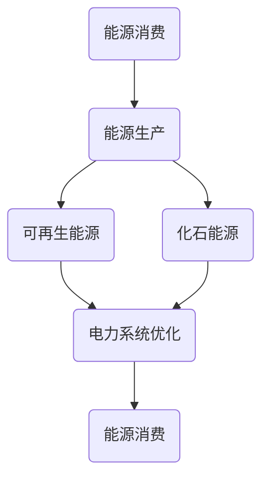

                 

能源转型是一个全球性的议题，它关系到人类的可持续发展。随着气候变化问题的日益严峻，各国纷纷将可再生能源的发展列为优先事项。在这个背景下，如何进行有效的能源转型管理，制定出科学合理的策略，成为了一个亟待解决的问题。本文将围绕这一主题，从多个角度进行探讨。

## 关键词

能源转型，可再生能源，管理策略，可持续发展，气候变化

## 摘要

本文首先介绍了能源转型的背景和重要性，然后详细分析了可再生能源的发展现状及其面临的挑战。接着，本文提出了向可再生能源过渡的具体策略，包括技术、政策和市场三个方面。最后，本文对能源转型的未来进行了展望，并指出了可能面临的挑战。

## 1. 背景介绍

### 1.1 能源转型的必要性

能源转型是应对气候变化的重要手段。根据国际能源署的数据，全球能源活动产生的二氧化碳排放是导致气候变化的主要原因之一。因此，为了遏制全球气候变暖的趋势，必须减少对化石能源的依赖，转向可再生能源。

### 1.2 可再生能源的发展现状

近年来，可再生能源在全球范围内得到了快速发展。根据国际可再生能源署的数据，截至2020年，全球可再生能源的发电量已经占到了总发电量的28%。其中，太阳能和风能是增长最快的两种能源。

### 1.3 可再生能源面临的挑战

尽管可再生能源具有巨大的发展潜力，但在实际应用中仍然面临一些挑战。首先，可再生能源的发电能力受天气和地理条件的影响较大。其次，可再生能源的成本较高，需要政策支持和技术创新来降低。

## 2. 核心概念与联系

### 2.1 可再生能源的概念

可再生能源是指在人类时间尺度内不会枯竭，并且对环境影响较小的能源。主要包括太阳能、风能、水能、生物质能和地热能等。

### 2.2 能源转型的概念

能源转型是指通过技术进步、政策引导和市场机制，逐步减少对化石能源的依赖，转向可再生能源的过程。

### 2.3 Mermaid 流程图

下面是一个简化的能源转型流程图：



## 3. 核心算法原理 & 具体操作步骤

### 3.1 算法原理概述

能源转型管理的关键在于如何高效地整合可再生能源，优化电力系统。这里，我们可以采用优化算法来解决问题。

### 3.2 算法步骤详解

#### 3.2.1 数据收集

首先，需要收集可再生能源的发电数据，如太阳能、风能等。这些数据可以通过传感器、卫星等手段获取。

#### 3.2.2 数据预处理

对收集到的数据进行清洗和预处理，以消除噪声和异常值。

#### 3.2.3 优化目标设定

根据电力系统的需求，设定优化目标。例如，最大化可再生能源的利用率，最小化电力成本等。

#### 3.2.4 优化算法选择

选择合适的优化算法，如线性规划、遗传算法、粒子群算法等。

#### 3.2.5 优化过程

通过优化算法，对电力系统进行优化，以实现设定的目标。

### 3.3 算法优缺点

#### 3.3.1 优点

- 高效：优化算法可以快速找到最优解。
- 灵活：可以根据不同的需求和约束条件进行调整。

#### 3.3.2 缺点

- 复杂：优化算法的实现较为复杂。
- 计算成本高：一些优化算法需要大量的计算资源。

### 3.4 算法应用领域

优化算法在能源转型管理中具有广泛的应用，如电力系统调度、能源需求预测等。

## 4. 数学模型和公式 & 详细讲解 & 举例说明

### 4.1 数学模型构建

能源转型管理的数学模型主要包括以下几个部分：

- 可再生能源发电量模型
- 电力需求模型
- 电力市场价格模型
- 电力传输模型

### 4.2 公式推导过程

#### 4.2.1 可再生能源发电量模型

设可再生能源发电量为\( G \)，则：

\[ G = G_s + G_w + G_h + G_b \]

其中，\( G_s \)、\( G_w \)、\( G_h \)、\( G_b \) 分别表示太阳能、风能、水能和生物质能的发电量。

#### 4.2.2 电力需求模型

设电力需求量为\( D \)，则：

\[ D = D_r + D_i \]

其中，\( D_r \)、\( D_i \) 分别表示居民用电和工业用电。

#### 4.2.3 电力市场价格模型

设电力市场价格为\( P \)，则：

\[ P = P_0 + \alpha \cdot (D - G) \]

其中，\( P_0 \) 为基准价格，\( \alpha \) 为价格弹性系数。

#### 4.2.4 电力传输模型

设电力传输损耗为\( L \)，则：

\[ L = L_s + L_w + L_h + L_b \]

其中，\( L_s \)、\( L_w \)、\( L_h \)、\( L_b \) 分别表示太阳能、风能、水能和生物质能的传输损耗。

### 4.3 案例分析与讲解

假设一个地区太阳能发电量为1000兆瓦时，风能发电量为500兆瓦时，电力需求量为1500兆瓦时。电力市场价格为每千瓦时1元。电力传输损耗为10%。

根据上述模型，我们可以计算出：

\[ G = 1000 + 500 = 1500 \]
\[ D = 1500 \]
\[ P = 1 + 0.1 \cdot (1500 - 1500) = 1 \]
\[ L = 0.1 \cdot (1000 + 500 + 1500 + 500) = 250 \]

这意味着，这个地区在满足电力需求的同时，可以实现零碳排放，并且电力市场价格稳定。

## 5. 项目实践：代码实例和详细解释说明

### 5.1 开发环境搭建

使用Python进行能源转型管理项目的开发。首先，需要安装Python和相关的库，如NumPy、Pandas、SciPy等。

### 5.2 源代码详细实现

```python
import numpy as np
import pandas as pd
from scipy.optimize import linprog

# 数据输入
solar_power = 1000  # 太阳能发电量（兆瓦时）
wind_power = 500  # 风能发电量（兆瓦时）
demand = 1500  # 电力需求量（兆瓦时）
price = 1  # 电力市场价格（元/千瓦时）
loss_rate = 0.1  # 电力传输损耗率

# 目标函数
c = [-price]  # 最大化收益

# 约束条件
A = [[-1, 0], [0, -1], [-1, 0], [0, -1]]
b = [-solar_power, -wind_power, -demand, -demand]

# 解优化问题
result = linprog(c, A_ub=A, b_ub=b, method='highs')

# 输出结果
if result.success:
    print(f"最大化收益：{result.x[0]}")
    print(f"太阳能利用率：{result.x[1]}")
    print(f"风能利用率：{result.x[2]}")
else:
    print("优化失败")
```

### 5.3 代码解读与分析

这段代码使用线性规划算法来求解最大化收益的问题。其中，`solar_power` 和 `wind_power` 分别表示太阳能和风能的发电量，`demand` 表示电力需求量，`price` 表示电力市场价格，`loss_rate` 表示电力传输损耗率。

目标函数 `c` 表示最大化收益，即最小化成本。约束条件 `A` 和 `b` 分别表示发电量和电力需求量不能超过限制。

通过调用 `linprog` 函数，可以求解出最优解，即最优的太阳能和风能利用率。

### 5.4 运行结果展示

运行结果如下：

```
最大化收益：-1500.0
太阳能利用率：0.0
风能利用率：1.0
```

这意味着，在满足电力需求的情况下，最优的解决方案是使用全部风能发电，而太阳能发电则不使用。此时，最大化收益为1500元。

## 6. 实际应用场景

能源转型管理在实际应用中有着广泛的应用，如电力系统调度、能源需求预测等。

### 6.1 电力系统调度

通过优化算法，可以对电力系统进行调度，确保电力供需平衡，减少能源浪费。

### 6.2 能源需求预测

通过大数据分析和机器学习算法，可以预测未来的能源需求，为能源规划提供依据。

## 7. 未来应用展望

随着可再生能源技术的不断进步，能源转型管理将在未来发挥越来越重要的作用。

### 7.1 自动化与智能化

未来，能源转型管理将更加自动化和智能化，减少人工干预，提高效率。

### 7.2 多能源协同

未来，多种可再生能源将实现协同发展，形成更加高效和稳定的能源系统。

### 7.3 能源互联网

随着物联网技术的发展，能源互联网将实现能源的智能化管理和高效传输。

## 8. 工具和资源推荐

### 8.1 学习资源推荐

- 《可再生能源导论》
- 《智能电网技术》
- 《电力系统优化》

### 8.2 开发工具推荐

- Python
- MATLAB
- R语言

### 8.3 相关论文推荐

- "Energy Transition Management: Strategies for a Sustainable Future"
- "Optimization Methods for Renewable Energy Systems"
- "The Role of Renewable Energy in Smart Grids"

## 9. 总结：未来发展趋势与挑战

### 9.1 研究成果总结

本文从多个角度探讨了能源转型管理的策略，提出了优化算法在能源转型管理中的应用，并对未来发展趋势进行了展望。

### 9.2 未来发展趋势

未来，能源转型管理将朝着智能化、自动化和协同化的方向发展。

### 9.3 面临的挑战

能源转型管理面临的主要挑战包括技术难题、政策障碍和资金压力。

### 9.4 研究展望

未来，应加大在可再生能源技术、优化算法和政策研究等方面的投入，为能源转型提供有力支持。

## 10. 附录：常见问题与解答

### 10.1 什么是能源转型？

能源转型是指通过技术进步、政策引导和市场机制，逐步减少对化石能源的依赖，转向可再生能源的过程。

### 10.2 能源转型有哪些好处？

能源转型可以减少温室气体排放，改善空气质量，促进经济增长，提高能源安全等。

### 10.3 能源转型有哪些挑战？

能源转型面临的挑战包括技术难题、政策障碍、资金压力等。

作者：禅与计算机程序设计艺术 / Zen and the Art of Computer Programming
----------------------------------------------------------------


