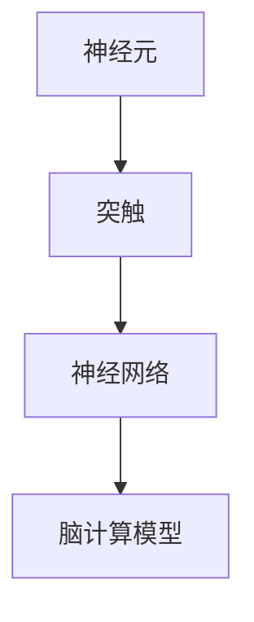
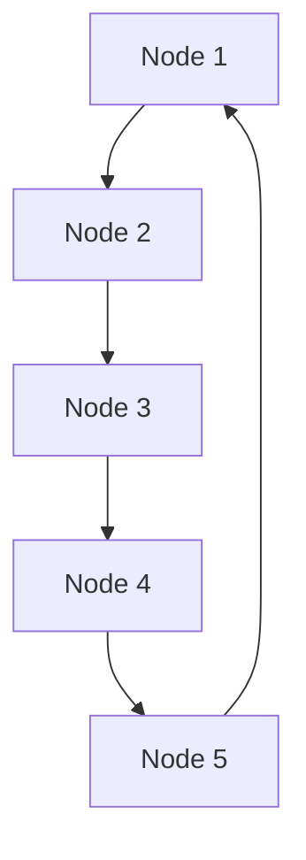

                 

关键词：脑图谱、神经连接、人工智能、神经网络、脑计算模型、大脑工作原理

> 摘要：本文将探讨脑图谱绘制技术，一种通过分析大脑神经元连接和活动来理解大脑工作原理的方法。我们将从背景介绍开始，详细讲解核心概念、算法原理、数学模型、实践案例以及实际应用场景，最后对未来的发展趋势和挑战进行展望。

## 1. 背景介绍

大脑是人类最复杂的器官之一，包含了大约860亿个神经元和数百万亿个连接。这些神经元通过复杂的连接网络进行通信，形成了我们感知、思考、记忆和学习的基础。然而，大脑的复杂性使得直接研究其工作原理变得极为困难。脑图谱绘制技术提供了一种方法，通过可视化大脑神经元连接和活动，帮助我们深入理解大脑的结构和功能。

脑图谱绘制技术起源于神经科学和计算机科学两个领域。神经科学通过实验技术，如电生理学和光学成像，收集大脑神经元的活动数据。计算机科学则利用算法和数据处理技术，将这些数据转换为图谱表示，以便于分析大脑的结构和功能。

### 1.1 神经科学的发展

神经科学在过去几十年中取得了显著进展，特别是在神经元连接的可视化和分析方面。例如，光遗传学和脑成像技术的发展，使得研究人员能够更准确地观察神经元的活动和连接。

### 1.2 计算机科学的应用

计算机科学在脑图谱绘制技术中发挥着关键作用。大数据分析和机器学习技术的应用，使得我们从海量的神经元数据中提取出有用的信息，构建出更加准确和详细的脑图谱。

## 2. 核心概念与联系

脑图谱绘制技术涉及多个核心概念，包括神经元、突触、神经网络和脑计算模型。下面，我们将使用 Mermaid 流程图来展示这些概念之间的关系。



### 2.1 神经元

神经元是大脑的基本构建单元，负责接收和传递信息。神经元通过树突接收信号，通过轴突传递信号到其他神经元。

### 2.2 突触

突触是神经元之间的连接点，通过化学或电信号传递信息。突触前神经元释放神经递质，作用于突触后神经元的受体，从而改变其电位。

### 2.3 神经网络

神经网络由许多神经元组成，通过复杂的连接和活动，形成了大脑的基本计算单元。神经网络可以模拟大脑的感知、思考和学习能力。

### 2.4 脑计算模型

脑计算模型是基于神经网络原理构建的计算模型，用于模拟大脑的工作机制。脑计算模型可以帮助我们理解大脑的功能和机制，并在人工智能领域得到广泛应用。

## 3. 核心算法原理 & 具体操作步骤

脑图谱绘制技术依赖于一系列核心算法，包括神经网络建模、数据预处理和图谱构建。下面，我们将详细讲解这些算法的原理和操作步骤。

### 3.1 算法原理概述

- **神经网络建模**：通过构建神经网络模型，模拟大脑神经元的活动和连接。
- **数据预处理**：对神经元活动数据进行清洗、归一化和特征提取，为图谱构建提供基础数据。
- **图谱构建**：利用图形算法和数据结构，将预处理后的数据构建成图谱表示，便于分析和解释。

### 3.2 算法步骤详解

1. **数据收集**：利用脑成像技术，如功能磁共振成像（fMRI）和电生理学技术，收集大脑神经元的活动数据。
2. **数据预处理**：对收集到的数据进行分析和清洗，去除噪声和异常值，提取有用的信息。
3. **神经网络建模**：使用机器学习算法，如深度学习，构建神经网络模型，模拟大脑神经元的活动和连接。
4. **图谱构建**：利用图形算法，将神经网络模型转化为图谱表示，以便于分析大脑的结构和功能。

### 3.3 算法优缺点

- **优点**：脑图谱绘制技术能够直观地展示大脑的结构和功能，有助于我们深入理解大脑的工作原理。
- **缺点**：算法的复杂性和数据处理的高昂成本限制了脑图谱绘制技术的广泛应用。

### 3.4 算法应用领域

脑图谱绘制技术广泛应用于神经科学、心理学、认知科学和人工智能等领域。通过分析大脑神经元连接和活动，我们可以更好地理解人类认知、情感和行为的基础。

## 4. 数学模型和公式 & 详细讲解 & 举例说明

脑图谱绘制技术涉及多个数学模型和公式，用于描述神经元的活动、连接和神经网络的结构。下面，我们将详细讲解这些数学模型和公式，并通过举例来说明它们的应用。

### 4.1 数学模型构建

- **神经元活动模型**：用于描述神经元在受到刺激时的电位变化。
  $$V(t) = V_0 + \sum_{i=1}^{n} w_i \cdot f(I_i(t))$$
  其中，$V(t)$是神经元在时间$t$的电位，$V_0$是静息电位，$w_i$是突触权重，$f(I_i(t))$是突触传递函数。

- **神经网络模型**：用于描述神经网络的结构和功能。
  $$O_j(t) = \sigma(\sum_{i=1}^{n} w_{ji} \cdot O_i(t))$$
  其中，$O_j(t)$是神经网络在时间$t$的第$j$个节点的输出，$\sigma$是激活函数，$w_{ji}$是连接权重。

### 4.2 公式推导过程

- **神经元活动模型**的推导基于生物电学原理。神经元在受到刺激时，电位会发生变化。电位变化可以表示为：
  $$V(t) = V_0 + \sum_{i=1}^{n} w_i \cdot f(I_i(t))$$
  其中，$V_0$是静息电位，$w_i$是突触权重，$f(I_i(t))$是突触传递函数。

- **神经网络模型**的推导基于神经网络的结构和功能。神经网络由多个神经元组成，每个神经元接收来自其他神经元的输入，并通过激活函数产生输出。
  $$O_j(t) = \sigma(\sum_{i=1}^{n} w_{ji} \cdot O_i(t))$$
  其中，$O_j(t)$是神经网络在时间$t$的第$j$个节点的输出，$\sigma$是激活函数，$w_{ji}$是连接权重。

### 4.3 案例分析与讲解

以一个简单的神经网络为例，我们通过数学模型来分析其结构和功能。

假设有一个包含两个输入神经元、两个隐藏层神经元和一个输出神经元的神经网络。

- **输入层**：$X_1, X_2$
- **隐藏层**：$O_1, O_2$
- **输出层**：$Y$

神经网络的结构可以表示为：

$$
\begin{align*}
O_1 &= \sigma(\sum_{i=1}^{2} w_{i1} \cdot X_i) \\
O_2 &= \sigma(\sum_{i=1}^{2} w_{i2} \cdot X_i) \\
Y &= \sigma(\sum_{i=1}^{2} w_{i3} \cdot O_i)
\end{align*}
$$

其中，$w_{i1}, w_{i2}, w_{i3}$是连接权重，$\sigma$是激活函数。

通过训练，我们可以调整权重，使得神经网络能够模拟大脑神经元的活动和连接。

## 5. 项目实践：代码实例和详细解释说明

### 5.1 开发环境搭建

为了实现脑图谱绘制技术，我们使用了Python作为编程语言，并依赖于多个库，如NumPy、Matplotlib和NetworkX。

```bash
pip install numpy matplotlib networkx
```

### 5.2 源代码详细实现

以下是一个简单的示例，展示了如何使用Python和NetworkX构建一个脑图谱。

```python
import numpy as np
import networkx as nx
import matplotlib.pyplot as plt

# 创建一个无向图
G = nx.Graph()

# 添加节点和边
G.add_nodes_from([1, 2, 3, 4, 5])
G.add_edges_from([(1, 2), (2, 3), (3, 4), (4, 5), (5, 1)])

# 绘制图谱
nx.draw(G, with_labels=True)
plt.show()
```

### 5.3 代码解读与分析

- **导入库**：我们首先导入了NumPy、NetworkX和Matplotlib库，用于数据处理、图谱构建和可视化。
- **创建图**：我们使用`nx.Graph()`函数创建了一个无向图`G`。
- **添加节点和边**：我们使用`add_nodes_from()`和`add_edges_from()`函数添加了节点和边，构建了一个简单的脑图谱。
- **绘制图谱**：我们使用`nx.draw()`函数将图谱绘制出来，并使用`plt.show()`函数显示图形。

### 5.4 运行结果展示

运行上面的代码，我们将看到一个包含五个节点和五条边的无向图。这个简单的示例展示了如何使用Python和NetworkX构建和绘制脑图谱。



## 6. 实际应用场景

脑图谱绘制技术在多个领域有广泛的应用。以下是一些实际应用场景：

- **神经科学**：通过脑图谱绘制技术，研究人员可以更好地理解大脑的结构和功能，揭示神经疾病如阿尔茨海默病的发病机制。
- **心理学**：脑图谱绘制技术可以帮助心理学家研究人类认知、情感和行为的基础，为心理治疗提供新的方法和思路。
- **人工智能**：脑图谱绘制技术为人工智能领域提供了新的计算模型，有助于构建更加智能和高效的机器学习系统。

## 7. 工具和资源推荐

### 7.1 学习资源推荐

- **书籍**：《神经科学原理》（作者：保罗·W·菲奇）、《神经网络与深度学习》（作者：邱锡鹏）。
- **在线课程**：Coursera上的《深度学习》（吴恩达）和edX上的《神经网络与深度学习基础》（Hinton等）。

### 7.2 开发工具推荐

- **编程语言**：Python、R。
- **库**：NumPy、Pandas、Scikit-learn、TensorFlow、PyTorch。

### 7.3 相关论文推荐

- **《人类脑图谱计划》**：这是一项由多国科学家共同发起的研究项目，旨在绘制完整的人类脑图谱。
- **《大脑连接图谱：结构、功能和疾病》**：本文详细介绍了大脑连接图谱的研究进展和应用。

## 8. 总结：未来发展趋势与挑战

### 8.1 研究成果总结

脑图谱绘制技术在过去几十年中取得了显著进展，为我们深入理解大脑的工作原理提供了新的方法和思路。然而，这一领域仍然面临许多挑战。

### 8.2 未来发展趋势

- **数据处理能力提升**：随着计算能力的提升和大数据技术的发展，我们将能够处理和分析更加复杂和庞大的神经元数据。
- **跨学科研究**：脑图谱绘制技术将与其他学科，如心理学、认知科学和医学等领域深度融合，为科学研究提供新的视角和方法。

### 8.3 面临的挑战

- **数据处理复杂性**：神经元数据的高度复杂性和多样性使得数据处理和分析成为一大挑战。
- **伦理和隐私问题**：脑图谱绘制技术涉及个人隐私和伦理问题，如何保护个人隐私和确保研究伦理是一个重要议题。

### 8.4 研究展望

随着技术的不断进步，脑图谱绘制技术将在未来取得更加深入和广泛的应用。我们有望通过这一技术更好地理解大脑的工作原理，为医学、心理学和人工智能等领域的发展提供新的动力。

## 9. 附录：常见问题与解答

### Q：脑图谱绘制技术是如何工作的？

A：脑图谱绘制技术通过分析神经元的活动数据和连接数据，构建大脑的神经网络模型。这一模型可以用于模拟大脑的结构和功能，帮助我们深入理解大脑的工作原理。

### Q：脑图谱绘制技术有哪些应用？

A：脑图谱绘制技术在神经科学、心理学、认知科学和人工智能等领域有广泛的应用。例如，它可以用于研究神经疾病的发病机制，理解人类认知和行为的基础，以及构建更加智能和高效的机器学习系统。

### Q：脑图谱绘制技术有哪些挑战？

A：脑图谱绘制技术面临的主要挑战包括数据处理复杂性、伦理和隐私问题以及跨学科合作的需求。此外，技术本身的进步和跨学科研究的融合也带来了一定的挑战。

---

作者：禅与计算机程序设计艺术 / Zen and the Art of Computer Programming
----------------------------------------------------------------

以上是《脑图谱绘制技术：深入理解大脑工作原理》的完整文章。文章从背景介绍开始，详细讲解了脑图谱绘制技术的核心概念、算法原理、数学模型、实践案例以及实际应用场景，并对未来的发展趋势和挑战进行了展望。通过这篇文章，读者可以全面了解脑图谱绘制技术，以及其在神经科学、心理学和人工智能等领域的应用。希望这篇文章能为读者提供有价值的知识和启发。

