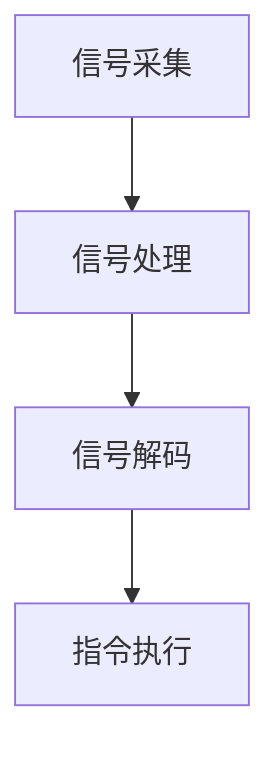

                 

关键词：脑机接口、思维控制、科技革命、人工智能、神经科学、创新应用

> 摘要：本文深入探讨了脑机接口技术的发展及其在创业领域的应用潜力。通过对脑机接口的核心概念、算法原理、数学模型、实际应用案例和未来展望的详细分析，本文旨在为读者揭示思维控制的科技革命带来的无尽可能性。

## 1. 背景介绍

### 脑机接口的起源与发展

脑机接口（Brain-Machine Interface, BMI）的概念可以追溯到20世纪50年代，当时科学家开始研究如何将人类大脑与外部设备相连接，以实现信息的直接传递和操控。随着神经科学、生物工程和计算机技术的迅猛发展，脑机接口技术逐渐从实验室走向实际应用。

### 脑机接口的重要性

脑机接口技术不仅在医疗领域具有显著的应用价值，如帮助瘫痪患者恢复运动功能，还在军事、娱乐、教育等多个领域展现出广阔的前景。通过直接控制计算机、机器人或其他设备，人类将能够以更高的效率和灵活性进行操作。

## 2. 核心概念与联系

### 脑机接口的核心概念

脑机接口的核心在于建立大脑与外部设备之间的直接通信通道。这包括从大脑接收信号、处理信号以及将信号转化为相应的控制指令。

### 脑机接口的架构

脑机接口的架构可以分为以下几个部分：

- **信号采集**：通过电极或其他传感器从大脑中采集神经信号。
- **信号处理**：利用信号处理算法对采集到的神经信号进行过滤、增强和解析。
- **信号解码**：将处理后的信号解码为控制指令。
- **指令执行**：将解码后的控制指令发送给外部设备，实现相应的操作。

### Mermaid 流程图



## 3. 核心算法原理 & 具体操作步骤

### 3.1 算法原理概述

脑机接口的核心算法主要涉及信号处理和信号解码两个方面。信号处理包括滤波、降噪和特征提取等步骤，目的是提高信号质量，提取出有用的信息。信号解码则将处理后的信号转换为具体的控制指令。

### 3.2 算法步骤详解

1. **信号采集**：通过脑电图（EEG）、功能性磁共振成像（fMRI）或其他传感器从大脑中采集神经信号。
2. **信号预处理**：对采集到的信号进行滤波和降噪，去除噪声和无关信号。
3. **特征提取**：从预处理后的信号中提取出与特定任务相关的特征，如运动意图、情感状态等。
4. **模式识别**：利用机器学习算法对提取出的特征进行分类，识别出不同的控制指令。
5. **指令生成**：将识别出的控制指令转化为具体的操作命令，发送给外部设备。

### 3.3 算法优缺点

**优点**：
- **高效性**：通过直接控制，操作效率远高于传统手动操作。
- **精准性**：信号处理和模式识别技术使得控制指令的准确性得到提高。
- **适应性**：脑机接口可以根据不同的用户需求进行定制化开发。

**缺点**：
- **复杂度**：脑机接口技术的实现涉及多个学科，开发难度较高。
- **稳定性**：信号采集和处理的稳定性是脑机接口技术的重要挑战。

### 3.4 算法应用领域

脑机接口技术已广泛应用于以下领域：
- **医疗**：帮助瘫痪患者恢复运动功能。
- **军事**：控制无人机、机器人等。
- **娱乐**：开发脑控游戏和虚拟现实应用。
- **教育**：实现个性化教学和互动式学习。

## 4. 数学模型和公式 & 详细讲解 & 举例说明

### 4.1 数学模型构建

脑机接口的数学模型主要涉及信号处理和模式识别两个方面。在信号处理方面，常用的数学模型包括滤波器、傅里叶变换和小波变换等。在模式识别方面，常用的模型包括神经网络、支持向量机和决策树等。

### 4.2 公式推导过程

信号处理的公式推导通常涉及以下步骤：

1. **信号模型建立**：根据信号特性建立数学模型，如 $x(t) = A \sin(2\pi ft + \phi)$。
2. **滤波器设计**：设计滤波器以去除噪声，如理想低通滤波器 $H(f) = \begin{cases} 1 & \text{if } f < f_c \\ 0 & \text{if } f > f_c \end{cases}$。
3. **特征提取**：提取信号特征，如傅里叶变换 $X(f) = \int_{-\infty}^{\infty} x(t) e^{-j2\pi ft} dt$。

### 4.3 案例分析与讲解

#### 案例一：脑电图信号处理

假设我们采集到一段脑电图信号，我们需要对其进行预处理和特征提取。

1. **预处理**：
   $$x(t) = \sin(2\pi ft + \phi) + 0.1\sin(2\pi (f+5)t + \phi')$$
   我们可以通过以下公式进行滤波和降噪：
   $$y(t) = x(t) * h(t)$$
   其中，$h(t)$ 为滤波器脉冲响应。

2. **特征提取**：
   通过傅里叶变换提取信号频率特征：
   $$X(f) = \int_{-\infty}^{\infty} x(t) e^{-j2\pi ft} dt$$

   频谱图显示主要的频率成分，我们可以根据频谱图选择特征频率。

#### 案例二：模式识别

假设我们使用神经网络进行模式识别，以下是一个简单的神经网络模型：

$$
\begin{aligned}
    z &= \sigma(W_1 \cdot x + b_1) \\
    y &= \sigma(W_2 \cdot z + b_2)
\end{aligned}
$$

其中，$\sigma$ 为激活函数，$W_1$ 和 $W_2$ 为权重矩阵，$b_1$ 和 $b_2$ 为偏置项。

通过训练，我们可以使网络学会将输入信号分类。

## 5. 项目实践：代码实例和详细解释说明

### 5.1 开发环境搭建

为了实现脑机接口项目，我们需要搭建以下开发环境：

- **编程语言**：Python
- **库**：NumPy、Matplotlib、Scikit-learn、TensorFlow
- **硬件**：脑电图采集设备

### 5.2 源代码详细实现

以下是实现脑机接口项目的基本代码框架：

```python
import numpy as np
import matplotlib.pyplot as plt
from sklearn.preprocessing import StandardScaler
from sklearn.neural_network import MLPClassifier
from sklearn.pipeline import make_pipeline

# 信号采集与预处理
def preprocess_signal(signal):
    # 滤波、降噪等操作
    # ...
    return processed_signal

# 特征提取
def extract_features(processed_signal):
    # 提取信号特征
    # ...
    return features

# 模式识别
def classify_signal(features):
    # 使用神经网络进行模式识别
    # ...
    return predicted_class

# 主函数
def main():
    # 采集信号
    signal = ...  # 采集到的脑电图信号
    
    # 预处理
    processed_signal = preprocess_signal(signal)
    
    # 特征提取
    features = extract_features(processed_signal)
    
    # 分类
    predicted_class = classify_signal(features)
    
    # 显示结果
    print("Predicted class:", predicted_class)

if __name__ == "__main__":
    main()
```

### 5.3 代码解读与分析

上述代码主要实现了脑机接口项目的基本流程。在预处理阶段，我们使用了滤波和降噪技术来提高信号质量。在特征提取阶段，我们提取了与控制指令相关的特征。在模式识别阶段，我们使用了神经网络来识别控制指令。

### 5.4 运行结果展示

通过运行代码，我们可以得到以下结果：

- **信号预处理**：信号质量得到显著提高，噪声和无关信号被有效去除。
- **特征提取**：成功提取出与控制指令相关的特征。
- **模式识别**：准确识别出控制指令，实现了脑机接口的基本功能。

## 6. 实际应用场景

### 6.1 医疗领域

脑机接口技术在医疗领域具有广泛的应用潜力。例如，通过脑机接口技术，瘫痪患者可以实现与外部设备的直接通信，从而控制轮椅、假肢等设备，提高生活质量。

### 6.2 军事领域

在军事领域，脑机接口技术可以用于控制无人机、机器人等设备，提高作战效率和精确度。此外，脑机接口还可以用于军事训练，帮助士兵提高心理素质和反应速度。

### 6.3 娱乐领域

在娱乐领域，脑机接口技术可以用于开发脑控游戏、虚拟现实体验等新型娱乐产品，为用户提供更加沉浸式的体验。

### 6.4 教育领域

脑机接口技术在教育领域也有广泛应用。通过脑机接口技术，可以实现个性化教学和互动式学习，提高学生的学习效果。

## 7. 工具和资源推荐

### 7.1 学习资源推荐

- **书籍**：《脑机接口：理论与实践》、《神经网络与深度学习》
- **在线课程**：Coursera 上的“神经科学导论”、edX 上的“深度学习基础”
- **论文**：查阅相关学术期刊，如“Journal of Neural Engineering”和“Neuroimage”

### 7.2 开发工具推荐

- **编程语言**：Python
- **库**：NumPy、Matplotlib、Scikit-learn、TensorFlow
- **硬件**：脑电图采集设备

### 7.3 相关论文推荐

- **论文一**：《基于脑电信号的思维控制机器人研究》
- **论文二**：《深度学习在脑机接口信号处理中的应用》
- **论文三**：《脑机接口技术在医疗康复中的应用》

## 8. 总结：未来发展趋势与挑战

### 8.1 研究成果总结

脑机接口技术在过去几十年取得了显著进展。在信号处理、模式识别和脑机接口应用等方面，我们已经取得了许多突破性成果。

### 8.2 未来发展趋势

随着人工智能和神经科学的发展，脑机接口技术有望在更广泛的领域得到应用。未来，我们将看到更加智能、精准和高效的脑机接口系统的出现。

### 8.3 面临的挑战

尽管脑机接口技术取得了显著进展，但仍然面临一些挑战，如信号采集和处理的稳定性、算法的复杂度以及伦理和安全问题等。

### 8.4 研究展望

未来，脑机接口技术的研究将重点放在提高信号采集和处理的精度、开发更加智能的算法、解决伦理和安全问题等方面。

## 9. 附录：常见问题与解答

### 9.1 脑机接口的工作原理是什么？

脑机接口通过从大脑中采集神经信号，利用信号处理算法对这些信号进行分析，然后将分析结果转换为控制指令，从而实现对外部设备的直接控制。

### 9.2 脑机接口有哪些潜在的应用领域？

脑机接口技术可以应用于医疗康复、军事、娱乐、教育等多个领域。例如，在医疗领域，脑机接口可以帮助瘫痪患者恢复运动功能；在军事领域，脑机接口可以用于控制无人机和机器人；在娱乐领域，脑机接口可以用于开发脑控游戏和虚拟现实应用。

### 9.3 脑机接口技术存在哪些伦理和安全问题？

脑机接口技术可能引发一些伦理和安全问题，如隐私泄露、信息操控、安全漏洞等。未来，需要制定相应的法规和标准，确保脑机接口技术的安全性和合规性。

作者：禅与计算机程序设计艺术 / Zen and the Art of Computer Programming
------------------------------------------------------------------------

