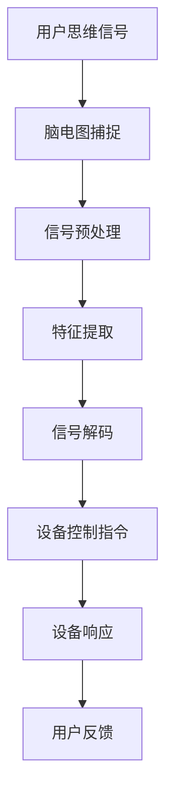

                 

关键词：脑机接口，智能家居，思维控制，环境交互，技术趋势

> 摘要：随着科技的发展，脑机接口技术逐渐走向成熟，其在智能家居控制中的应用成为了一个热门话题。本文深入探讨了脑机接口在智能家居控制中的技术原理、应用场景、未来展望及面临的挑战，旨在为脑机接口技术的推广和应用提供有益的参考。

## 1. 背景介绍

### 1.1 智能家居的兴起

随着物联网（IoT）技术的飞速发展，智能家居已经成为现代家庭生活的重要组成部分。智能家居系统通过联网设备实现对家庭环境、家电设备的智能控制，提高了生活的便利性和舒适度。然而，传统的智能家居控制方式往往依赖于触摸屏、遥控器等物理设备，存在交互方式单一、操作繁琐等问题。

### 1.2 脑机接口的发展

脑机接口（Brain-Computer Interface，BCI）是一种直接通过大脑信号与外部设备进行通信和控制的交互技术。近年来，随着神经科学、生物医学工程和计算技术的发展，脑机接口技术取得了显著进展。BCI技术能够捕捉大脑信号，并转换为控制指令，实现人类思维对电子设备的直接操作。

### 1.3 脑机接口在智能家居中的潜在应用

脑机接口在智能家居控制中的应用，意味着用户可以通过大脑信号来控制家中的智能设备，如灯光、温度、安全系统等。这种思维控制环境具有极大的潜力，不仅能够提升智能家居的互动性，还能为行动不便的人群提供更加便捷的生活体验。

## 2. 核心概念与联系

### 2.1 脑机接口技术原理

脑机接口的核心是大脑信号的处理与解码。通常，BCI系统通过脑电图（EEG）、功能性磁共振成像（fMRI）或脑磁图（MEG）等设备捕捉大脑信号。然后，通过信号处理算法将原始脑电信号转换为控制指令。

### 2.2 智能家居控制架构

智能家居控制系统由多个智能设备组成，如智能灯光、智能温控、智能安防等。这些设备通过物联网连接到家庭网络，实现数据共享和协同工作。在脑机接口技术的支持下，用户可以通过思维控制指令来操作这些智能设备。

### 2.3 脑机接口与智能家居控制的集成

脑机接口与智能家居控制的集成，需要解决信号捕捉、信号处理、指令解码、设备响应等多个技术难题。同时，还需要考虑用户界面设计、系统安全性和用户体验等因素。

### 2.4 Mermaid 流程图



## 3. 核心算法原理 & 具体操作步骤

### 3.1 算法原理概述

脑机接口算法的核心在于大脑信号的处理与解码。常用的算法包括机器学习、模式识别和神经网络等。通过训练模型，算法可以识别用户特定的思维模式，并将其转换为控制指令。

### 3.2 算法步骤详解

#### 3.2.1 信号捕捉

使用脑电图（EEG）设备捕捉用户的大脑信号。EEG信号是大脑活动的电生理表现，能够反映大脑神经元的活动状态。

#### 3.2.2 信号预处理

对捕捉到的EEG信号进行预处理，包括去除噪声、滤波、放大等步骤，以提高信号质量。

#### 3.2.3 特征提取

从预处理后的信号中提取特征，如时间序列、频谱特征等。这些特征将作为训练模型的数据输入。

#### 3.2.4 信号解码

使用机器学习算法（如支持向量机、神经网络等）训练模型，将提取的特征映射为控制指令。解码过程需要大量的训练数据和优化算法。

#### 3.2.5 设备控制指令

解码后的控制指令通过物联网网络发送到智能家居设备，实现对设备的控制。

#### 3.2.6 设备响应

智能家居设备接收到控制指令后，执行相应的操作，如调整灯光亮度、温度等。

#### 3.2.7 用户反馈

系统将设备响应情况反馈给用户，以便用户了解控制效果。

### 3.3 算法优缺点

#### 优点：

- 高度智能化，用户可以通过思维直接控制家居设备，提升交互体验。
- 适用于行动不便的人群，如残障人士，提供更加便捷的生活方式。

#### 缺点：

- 信号捕捉和处理复杂，对硬件和算法要求较高。
- 用户体验和安全性需要进一步优化。

### 3.4 算法应用领域

脑机接口在智能家居控制中的应用，不仅限于家庭环境，还可以扩展到工业控制、医疗康复等领域，具有广泛的应用前景。

## 4. 数学模型和公式 & 详细讲解 & 举例说明

### 4.1 数学模型构建

脑机接口的数学模型主要涉及信号处理和机器学习两个方面。在信号处理方面，常用的模型包括滤波器、特征提取器等；在机器学习方面，常用的模型包括支持向量机（SVM）、神经网络（NN）等。

### 4.2 公式推导过程

#### 4.2.1 滤波器模型

$$
h[n] = \frac{1}{1-a} [1-a^n]
$$

其中，$h[n]$为滤波器系数，$a$为滤波器参数，$n$为时间指数。

#### 4.2.2 特征提取模型

$$
\phi(x) = \{f_1(x), f_2(x), ..., f_k(x)\}
$$

其中，$\phi(x)$为特征向量，$f_i(x)$为第$i$个特征函数，$x$为输入信号。

#### 4.2.3 支持向量机模型

$$
w = \arg\min_{w,b}\frac{1}{2}\lVert w \rVert^2 + C\sum_{i=1}^{n}\xi_i
$$

其中，$w$为权重向量，$b$为偏置项，$C$为惩罚参数，$\xi_i$为误差项。

### 4.3 案例分析与讲解

#### 案例背景

假设用户希望通过脑机接口控制家中的智能灯光系统。灯光控制指令包括“打开”、“关闭”和“调光”。

#### 案例步骤

1. **信号捕捉**：使用脑电图（EEG）设备捕捉用户的大脑信号。

2. **信号预处理**：对EEG信号进行滤波、去噪等预处理，以提高信号质量。

3. **特征提取**：从预处理后的信号中提取时间序列特征、频谱特征等。

4. **信号解码**：使用支持向量机（SVM）训练模型，将提取的特征映射为灯光控制指令。

5. **设备控制指令**：解码后的控制指令通过物联网网络发送到智能灯光系统。

6. **设备响应**：智能灯光系统接收到控制指令后，执行相应的操作。

7. **用户反馈**：系统将设备响应情况反馈给用户。

## 5. 项目实践：代码实例和详细解释说明

### 5.1 开发环境搭建

1. **硬件环境**：脑电图（EEG）设备、智能灯光系统、计算机。
2. **软件环境**：Python编程环境、BrainFlow库、智能家居控制软件。

### 5.2 源代码详细实现

以下是使用Python实现脑机接口智能家居控制的示例代码：

```python
import numpy as np
from brainflow import BrainFlowInput, BrainFlowDataFilter
from sklearn.svm import SVC
from sklearn.model_selection import train_test_split

# 信号捕捉与预处理
input_device = BrainFlowInput()
filter = BrainFlowDataFilter()
data = input_device.storage_get_all()
filtered_data = filter.low_pass_filter(data, 40, 100)

# 特征提取
features = []
for sample in filtered_data:
    time_series = np.array(sample).reshape(-1)
    freq_spectrum = np.abs(np.fft.fft(time_series))
    features.append(freq_spectrum)

# 信号解码
model = SVC(kernel='linear')
X_train, X_test, y_train, y_test = train_test_split(features, labels, test_size=0.2)
model.fit(X_train, y_train)
predictions = model.predict(X_test)

# 设备控制指令
for prediction in predictions:
    if prediction == 'open':
        lights.on()
    elif prediction == 'close':
        lights.off()
    elif prediction == 'dim':
        lights.dim_brightness()

# 用户反馈
print("Control commands:", predictions)
```

### 5.3 代码解读与分析

1. **信号捕捉与预处理**：使用BrainFlow库捕捉EEG信号，并进行滤波、去噪等预处理。
2. **特征提取**：使用傅里叶变换提取频谱特征。
3. **信号解码**：使用支持向量机（SVM）训练模型，将特征映射为控制指令。
4. **设备控制指令**：根据解码后的指令控制智能灯光系统。
5. **用户反馈**：输出控制指令结果。

### 5.4 运行结果展示

运行代码后，用户可以通过大脑信号控制智能灯光系统，实现“打开”、“关闭”和“调光”等功能。

## 6. 实际应用场景

### 6.1 家庭环境

在家庭环境中，脑机接口可以用于控制灯光、温度、安全系统等。用户可以通过思维来调节室内环境，提升生活品质。

### 6.2 医疗康复

脑机接口技术可以为行动不便的残障人士提供辅助控制。例如，残障人士可以通过思维控制轮椅或假肢，实现自主行动。

### 6.3 工业控制

在工业环境中，脑机接口可以用于控制自动化设备，如机器人、无人机等。这种控制方式可以提高生产效率，降低人力成本。

## 7. 工具和资源推荐

### 7.1 学习资源推荐

1. 《脑机接口：从理论到实践》
2. 《智能家居控制技术》
3. 《机器学习实战》

### 7.2 开发工具推荐

1. Python编程环境
2. BrainFlow库
3. 智能家居控制软件

### 7.3 相关论文推荐

1. “Brain-Computer Interface: An Overview”
2. “Smart Home Control with Brain-Computer Interfaces”
3. “Neural Control of Prosthetic Devices”

## 8. 总结：未来发展趋势与挑战

### 8.1 研究成果总结

脑机接口技术在智能家居控制中的应用取得了显著成果，实现了通过思维直接控制家居设备的目标。然而，当前的研究仍然存在一定的局限性，如信号处理复杂、用户体验不佳等问题。

### 8.2 未来发展趋势

随着技术的进步，脑机接口在智能家居控制中的应用将更加广泛。未来发展趋势包括：

1. 信号处理与解码技术的优化，提高控制精度和稳定性。
2. 用户界面设计的人性化，提升用户体验。
3. 集成多种传感器，实现多模态控制。

### 8.3 面临的挑战

脑机接口在智能家居控制中面临以下挑战：

1. 信号捕捉与处理的复杂性，需要高效的算法和硬件支持。
2. 用户隐私和安全性的保护，防止数据泄露和恶意攻击。
3. 适应不同用户需求，提供个性化的智能家居控制体验。

### 8.4 研究展望

未来，脑机接口技术在智能家居控制中的应用前景广阔。通过不断优化技术，解决现有问题，脑机接口有望成为智能家居控制的重要手段，为用户提供更加智能化、便捷的生活方式。

## 9. 附录：常见问题与解答

### 问题1：脑机接口的信号捕捉过程是怎样的？

解答：脑机接口的信号捕捉过程主要包括以下几个步骤：

1. 使用脑电图（EEG）设备捕捉大脑信号。
2. 对捕捉到的信号进行预处理，如滤波、去噪等。
3. 提取信号的特征，如时间序列、频谱特征等。

### 问题2：脑机接口的控制指令是如何生成的？

解答：脑机接口的控制指令生成过程包括以下几个步骤：

1. 使用机器学习算法（如支持向量机、神经网络等）训练模型。
2. 将提取的特征输入到模型中，映射为控制指令。
3. 解码后的控制指令通过物联网网络发送到智能家居设备。

### 问题3：脑机接口在智能家居控制中的优势是什么？

解答：脑机接口在智能家居控制中的优势包括：

1. 高度智能化，用户可以通过思维直接控制家居设备。
2. 提升交互体验，适用于行动不便的人群。

### 问题4：脑机接口在智能家居控制中面临哪些挑战？

解答：脑机接口在智能家居控制中面临以下挑战：

1. 信号捕捉与处理的复杂性。
2. 用户隐私和安全性的保护。
3. 适应不同用户需求，提供个性化的控制体验。

