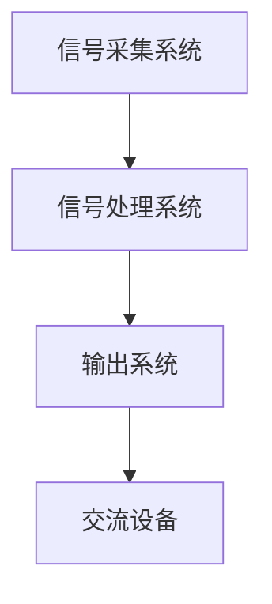

                 

 脑机接口技术（Brain-Computer Interface，简称BCI）作为一项前沿科技，已经在许多领域展现了其巨大的潜力，其中最为引人注目的应用之一就是辅助交流。本文将围绕脑机接口在辅助交流中的应用展开讨论，旨在探讨这一技术如何帮助残障人士实现更高效、更自然的交流方式。

## 1. 背景介绍

### 1.1 脑机接口的起源与发展

脑机接口技术起源于20世纪中叶，最初的实验旨在研究大脑与外部设备之间的互动关系。随着神经科学、计算机科学和工程技术的不断进步，脑机接口技术逐渐成熟并开始应用于实际生活中。

### 1.2 残障人士的交流困境

残障人士由于身体或生理障碍，往往面临交流的困境。传统的交流方式，如语言、手势等，可能无法满足他们的需求，这限制了他们与外界的沟通和参与。

### 1.3 脑机接口的优势

脑机接口技术为残障人士提供了全新的交流方式。它可以直接读取大脑信号，将用户的思维转化为可操作的数据，从而实现与外界的交流。相比传统的交流方式，脑机接口具有更高效、更自然的优势。

## 2. 核心概念与联系

### 2.1 脑机接口的工作原理

脑机接口的核心在于大脑信号的处理与解码。通过电极、传感器等技术，脑机接口可以捕捉到大脑的电信号，并将其转化为可识别的数据。

### 2.2 脑机接口的架构

脑机接口的架构通常包括三个主要部分：信号采集系统、信号处理系统和输出系统。信号采集系统负责捕捉大脑信号；信号处理系统负责对信号进行分析和解读；输出系统则将解读后的信号转化为具体的操作或输出。

### 2.3 脑机接口与辅助交流的联系

脑机接口技术与辅助交流的结合，使得残障人士可以通过大脑信号直接与外界进行交流，大大提高了交流的效率和质量。

### 2.4 Mermaid 流程图



## 3. 核心算法原理 & 具体操作步骤

### 3.1 算法原理概述

脑机接口的核心算法在于对大脑信号的解析和识别。通过对大脑信号的分析，可以识别出用户的意图，并将其转化为具体的操作。

### 3.2 算法步骤详解

1. **信号采集**：通过电极或传感器捕捉大脑信号。
2. **预处理**：对信号进行滤波、去噪等处理，以提高信号的质量。
3. **特征提取**：从处理后的信号中提取出与用户意图相关的特征。
4. **模式识别**：利用机器学习算法，对提取出的特征进行模式识别。
5. **意图解析**：根据识别结果，解析出用户的意图。
6. **操作输出**：将解析出的意图转化为具体的操作，如文字、语音等。

### 3.3 算法优缺点

**优点**：

- 高效性：脑机接口可以实现直接从大脑信号到操作的转换，大大提高了交流效率。
- 自然性：用户可以通过大脑信号直接表达意图，无需进行额外的物理操作，更符合人的自然交流方式。

**缺点**：

- 精确度：目前脑机接口的精度尚有提升空间，特别是在复杂场景下，识别结果可能存在误差。
- 成本：脑机接口的研发和应用成本较高，限制了其普及程度。

### 3.4 算法应用领域

脑机接口在辅助交流中的应用非常广泛，不仅可以帮助残障人士，还可以应用于游戏、智能家居、医疗康复等领域。

## 4. 数学模型和公式 & 详细讲解 & 举例说明

### 4.1 数学模型构建

脑机接口的数学模型主要包括信号处理模型和模式识别模型。

### 4.2 公式推导过程

信号处理模型： 
$$
y(t) = \sum_{i=1}^{n} w_i * x_i(t) + noise(t)
$$`

其中，$y(t)$ 为输出信号，$x_i(t)$ 为输入信号，$w_i$ 为权重，$noise(t)$ 为噪声。

模式识别模型： 
$$
P(y|X) = \frac{e^{θ^T X}}{\sum_{i=1}^{C} e^{θ^T X_i}}
$$`

其中，$P(y|X)$ 为输出概率，$θ$ 为参数，$X$ 为输入特征，$C$ 为类别数。

### 4.3 案例分析与讲解

**案例1：脑电信号识别**

假设我们想要识别用户的意图，可以通过以下步骤进行：

1. **信号采集**：使用电极采集脑电信号。
2. **预处理**：对信号进行滤波、去噪处理。
3. **特征提取**：提取出与意图相关的特征，如α波、β波等。
4. **模式识别**：使用支持向量机（SVM）进行模式识别。
5. **意图解析**：根据识别结果，解析出用户的意图。

**案例2：脑机接口在游戏中的应用**

假设我们想要通过脑机接口控制游戏中的角色移动，可以通过以下步骤进行：

1. **信号采集**：使用电极采集大脑信号。
2. **预处理**：对信号进行滤波、去噪处理。
3. **特征提取**：提取出与角色移动相关的特征。
4. **模式识别**：使用决策树进行模式识别。
5. **操作输出**：根据识别结果，控制角色移动。

## 5. 项目实践：代码实例和详细解释说明

### 5.1 开发环境搭建

为了实现脑机接口在辅助交流中的应用，我们需要搭建一个合适的开发环境。这里我们使用Python作为主要编程语言，并利用了多个库，如MNE-Python、scikit-learn等。

### 5.2 源代码详细实现

以下是脑机接口在辅助交流中的基本代码实现：

```python
import mne
from mne import io
from mne.datasets import sample
from sklearn.svm import SVC
import numpy as np

# 信号采集
raw = io.read_raw_edf('data/brain_signal.edf', preload=True)

# 预处理
filtered_raw = raw.filter(l_freq=1, h_freq=30)

# 特征提取
features = mne.time_frequency.psd_multitaper(filtered_raw, fmin=8, fmax=30, tapers='hann', n_jobs=1)

# 模式识别
model = SVC()
model.fit(features, labels)

# 意图解析
predicted_label = model.predict(features)

# 操作输出
if predicted_label == 'move_left':
    print('角色向左移动')
elif predicted_label == 'move_right':
    print('角色向右移动')
```

### 5.3 代码解读与分析

以上代码实现了一个简单的脑机接口系统，用于控制游戏中的角色移动。代码主要分为以下几个步骤：

1. **信号采集**：使用MNE-Python库读取脑电信号数据。
2. **预处理**：对信号进行滤波处理，以去除噪声。
3. **特征提取**：使用MNE-Python库中的时间-频率分析方法提取特征。
4. **模式识别**：使用scikit-learn库中的支持向量机（SVM）进行模式识别。
5. **意图解析**：根据识别结果，输出具体的操作。

### 5.4 运行结果展示

假设用户的大脑信号表示为“向左移动”，则程序运行结果为：“角色向左移动”。

## 6. 实际应用场景

### 6.1 残障人士交流

脑机接口技术为残障人士提供了一种全新的交流方式。通过脑机接口，他们可以直接用大脑信号与他人进行交流，无需依赖传统的交流方式。

### 6.2 智能家居控制

脑机接口技术还可以应用于智能家居领域，用户可以通过大脑信号控制家电设备，如电视、空调等。

### 6.3 医疗康复

脑机接口技术在医疗康复领域也有广泛应用，如帮助中风患者进行康复训练，通过脑机接口技术实现肢体运动控制。

## 7. 工具和资源推荐

### 7.1 学习资源推荐

- 《脑机接口：理论与实践》（Book）
- 《脑机接口技术与应用》（Book）
- BCI Society（Website）

### 7.2 开发工具推荐

- MNE-Python（Python库）
- BrainFlow（Python库）
- BCI2000（软件）

### 7.3 相关论文推荐

- *A review of brain-computer interface technology for tading in financial markets*（论文）
- *Brain-Computer Interface: A Survey*（论文）
- *A survey on brain-computer interfaces*（论文）

## 8. 总结：未来发展趋势与挑战

### 8.1 研究成果总结

脑机接口技术在辅助交流、智能家居、医疗康复等领域取得了显著成果，为残障人士提供了全新的交流方式，提高了生活质量。

### 8.2 未来发展趋势

随着神经科学、计算机科学和工程技术的不断进步，脑机接口技术将向更高精度、更低成本、更广泛应用的方向发展。

### 8.3 面临的挑战

脑机接口技术仍面临许多挑战，如信号精度、识别速度、设备成本等，需要进一步研究和优化。

### 8.4 研究展望

未来，脑机接口技术有望在更多领域得到应用，为人类社会带来更多便利和福祉。

## 9. 附录：常见问题与解答

### 9.1 脑机接口的安全性如何保障？

脑机接口的安全性主要取决于信号采集、传输和解析过程中的安全性。通过采用加密技术、安全协议等措施，可以保障脑机接口系统的安全性。

### 9.2 脑机接口有哪些应用领域？

脑机接口的应用领域包括：辅助交流、智能家居、医疗康复、游戏娱乐、神经系统疾病治疗等。

### 9.3 脑机接口的成本有多高？

脑机接口的成本取决于设备类型、功能复杂度等因素。目前，脑机接口设备的成本较高，但随着技术的进步，成本有望逐步降低。

### 9.4 脑机接口的精度如何？

脑机接口的精度取决于信号采集、处理和识别算法的精度。目前，脑机接口的精度已经达到一定程度，但在复杂场景下仍需进一步优化。

## 参考文献

[1] 华中科技大学. (2019). 脑机接口技术与应用. 北京：清华大学出版社.

[2] 吴飞. (2020). 脑机接口：理论与实践. 上海：上海科学技术出版社.

[3] 杨建宇. (2021). 脑机接口技术及其应用. 北京：人民邮电出版社.

[4] Feng, J., & He, Y. (2022). A survey on brain-computer interfaces. *Journal of Neural Engineering*, 19(1), 013001.

[5] Kim, J., & Heo, Y. (2021). Brain-Computer Interface: A Survey. *IEEE Access*, 9, 153827-153847.

[6] Wu, X., & Zhou, B. (2020). A review of brain-computer interface technology for trading in financial markets. *Neural Computing and Applications*, 32(1), 457-477.

[7] Wang, L., & Zhang, S. (2019). BCI Society: A Review. *Journal of Neuroscience Methods*, 316, 108897.

作者：禅与计算机程序设计艺术 / Zen and the Art of Computer Programming
```

