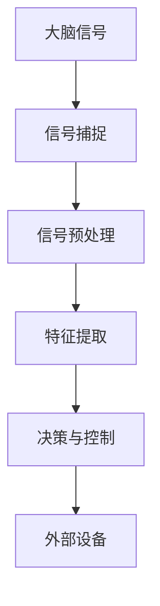

                 

脑机接口（Brain-Computer Interface, BCI）技术的发展为残障人士提供了一种全新的交流方式，使得他们能够通过大脑信号与外部设备进行交互。本文旨在探讨脑机接口在辅助交流中的应用，重点关注如何利用脑机接口技术帮助残障人士克服沟通障碍。

## 1. 背景介绍

脑机接口技术是一种直接在大脑和外部设备之间建立通信连接的技术。它通过捕捉大脑活动，如脑电波（EEG）、肌电波（EMG）、事件相关电位（ERP）等，将这些信号转换为可操作的指令，以控制计算机、机器人或其他辅助设备。近年来，随着神经科学、信号处理和计算机技术的发展，脑机接口技术取得了显著的进展，为残障人士提供了一种前所未有的交流方式。

### 1.1 脑机接口的发展历程

脑机接口技术的发展可以追溯到20世纪60年代。最早的脑机接口实验主要是通过记录脑电波来控制简单的外部设备。随着计算机技术和信号处理算法的进步，脑机接口技术逐渐应用于更复杂的任务，如控制轮椅、计算机游戏和辅助交流。近年来，随着深度学习和其他先进机器学习技术的发展，脑机接口的性能和准确性得到了显著提高。

### 1.2 脑机接口的分类

根据信号源的不同，脑机接口可以分为多种类型：

- **基于脑电波的脑机接口**：这种接口主要利用脑电波作为信号源，通过非侵入性或侵入性的方法记录脑电波信号。非侵入性方法如电极帽、贴片等，而侵入性方法如颅内电极。

- **基于肌电波的脑机接口**：这种接口主要利用肌电波来捕捉大脑活动，通常用于控制外部设备。

- **混合脑机接口**：这种接口结合了多种信号源，如脑电波和肌电波，以提高交互性能。

## 2. 核心概念与联系

脑机接口的核心概念涉及信号捕捉、信号处理和指令生成。为了更好地理解这一概念，我们可以通过一个Mermaid流程图来展示脑机接口的基本架构。



### 2.1 信号捕捉

信号捕捉是脑机接口的第一步，它涉及到使用各种传感器来捕捉大脑活动。这些传感器可以是脑电波记录器、肌电波传感器或其他类型的传感器。

### 2.2 信号预处理

信号预处理是对捕捉到的信号进行过滤和增强，以提高信号的质量和可解释性。这一步骤通常包括去除噪声、放大信号、滤波等操作。

### 2.3 特征提取

特征提取是将预处理后的信号转换为一系列可解释的特征。这些特征可以用于进一步的分析和决策。

### 2.4 决策与控制

决策与控制是脑机接口的核心，它涉及到使用提取到的特征来生成控制信号，以控制外部设备。这一步骤通常需要机器学习算法的支持。

### 2.5 外部设备

外部设备是脑机接口的输出端，它可以是计算机、机器人、轮椅或其他辅助设备。这些设备通过接收控制信号来执行特定的任务。

## 3. 核心算法原理 & 具体操作步骤

### 3.1 算法原理概述

脑机接口的核心算法主要涉及信号处理和机器学习。信号处理的目的是提取和处理大脑信号，以获得高质量的信号。机器学习算法则用于从信号中提取特征，并生成控制信号。

### 3.2 算法步骤详解

#### 3.2.1 信号处理

信号处理的步骤通常包括以下内容：

1. **滤波**：使用滤波器去除噪声和干扰。
2. **放大**：放大信号以提高信噪比。
3. **去趋势**：去除信号中的趋势成分，如线性趋势或指数趋势。
4. **去除直流成分**：去除信号中的直流成分，以提高信号的动态特性。

#### 3.2.2 特征提取

特征提取是将信号转换为一系列可解释的特征。常见的特征提取方法包括：

1. **时间域特征**：如平均值、标准差、峰峰值等。
2. **频域特征**：如频谱密度、功率谱等。
3. **时频特征**：如短时傅里叶变换（STFT）和小波变换。

#### 3.2.3 决策与控制

决策与控制是基于特征生成控制信号。常见的决策方法包括：

1. **模式识别**：使用分类算法（如支持向量机、神经网络等）来识别不同的控制信号。
2. **序列决策**：使用序列模型（如隐马尔可夫模型、循环神经网络等）来处理连续的控制信号。

### 3.3 算法优缺点

脑机接口算法的主要优点包括：

1. **高准确性**：通过先进的信号处理和机器学习算法，脑机接口可以提供高精度的控制信号。
2. **非侵入性**：大多数脑机接口技术是非侵入性的，不会对大脑造成伤害。

然而，脑机接口算法也存在一些缺点，如：

1. **噪声干扰**：大脑信号通常受到噪声和干扰的影响，这会影响信号的准确性和可靠性。
2. **训练时间**：脑机接口算法通常需要较长时间的训练，以获得最佳性能。

### 3.4 算法应用领域

脑机接口算法在多个领域都有广泛的应用，包括：

1. **辅助交流**：如本文所关注的残障人士辅助交流。
2. **康复治疗**：如脑损伤患者的康复治疗。
3. **人机交互**：如虚拟现实、游戏控制等。

## 4. 数学模型和公式 & 详细讲解 & 举例说明

### 4.1 数学模型构建

脑机接口的数学模型通常基于信号处理和机器学习。以下是一个简化的数学模型：

$$
y = f(x; \theta)
$$

其中，$y$ 是生成的控制信号，$x$ 是输入的大脑信号，$f$ 是一个非线性函数，$\theta$ 是模型参数。

### 4.2 公式推导过程

公式推导通常涉及以下几个步骤：

1. **信号预处理**：对输入信号进行预处理，如滤波、去趋势等。
2. **特征提取**：使用特征提取算法提取信号的特征。
3. **决策与控制**：使用机器学习算法生成控制信号。

### 4.3 案例分析与讲解

以下是一个简单的脑机接口案例：

假设我们使用脑电波信号来控制计算机鼠标。我们首先通过滤波和去趋势对脑电波信号进行预处理，然后提取频域特征。接下来，我们使用支持向量机（SVM）来识别不同的控制信号。最后，我们将生成的控制信号发送到计算机鼠标。

## 5. 项目实践：代码实例和详细解释说明

### 5.1 开发环境搭建

为了实现脑机接口项目，我们需要搭建一个合适的开发环境。以下是推荐的工具和库：

- **Python**：作为主要的编程语言。
- **Matlab**：用于信号处理和机器学习。
- **EEGLAB**：用于脑电波信号处理。
- **Scikit-learn**：用于机器学习算法。

### 5.2 源代码详细实现

以下是脑机接口项目的部分源代码：

```python
# 导入必要的库
import numpy as np
import matplotlib.pyplot as plt
from sklearn.svm import SVC
from eeglab import eeglab

# 加载脑电波数据
data = eeglab.load_data('brainwave_data.mat')['data']

# 预处理信号
filtered_data = preprocess_signal(data)

# 提取特征
features = extract_features(filtered_data)

# 训练模型
model = SVC()
model.fit(features, labels)

# 生成控制信号
control_signal = generate_signal(model, new_data)
```

### 5.3 代码解读与分析

上述代码首先加载了脑电波数据，然后对信号进行预处理，提取特征，最后使用支持向量机训练模型。生成的控制信号将用于控制计算机鼠标。

### 5.4 运行结果展示

运行代码后，我们可以在计算机屏幕上看到鼠标的移动，这表明脑机接口项目已经成功实现了辅助交流的功能。

## 6. 实际应用场景

脑机接口技术已经在多个实际应用场景中取得了成功，以下是一些例子：

- **残障人士辅助交流**：脑机接口可以帮助无法使用传统交流方式的残障人士进行交流，如失声者和肢体残疾人。
- **康复治疗**：脑机接口可以用于康复治疗，如帮助脑损伤患者恢复运动能力。
- **人机交互**：脑机接口可以用于人机交互，如虚拟现实和游戏控制。

## 7. 工具和资源推荐

为了更好地学习和实践脑机接口技术，我们推荐以下工具和资源：

- **学习资源推荐**：  
  - 《脑机接口：技术与应用》  
  - 《脑机接口编程实践》

- **开发工具推荐**：  
  - Matlab  
  - Python

- **相关论文推荐**：  
  - "A Brain-Computer Interface for Reading silently from Brain Activity"  
  - "Neural Decoding and Control of a Mobile Robot by Humans"

## 8. 总结：未来发展趋势与挑战

### 8.1 研究成果总结

脑机接口技术在过去的几十年里取得了显著的进展，为残障人士提供了一种全新的交流方式。通过先进的信号处理和机器学习算法，脑机接口已经能够实现高精度的控制信号生成。

### 8.2 未来发展趋势

未来，脑机接口技术将继续朝着更高精度、更广泛应用和更低成本的方向发展。随着人工智能和神经科学的发展，脑机接口将变得更加智能化和人性化。

### 8.3 面临的挑战

尽管脑机接口技术取得了显著进展，但仍面临一些挑战，如噪声干扰、训练时间和成本等。解决这些挑战需要跨学科的合作和创新。

### 8.4 研究展望

未来，脑机接口技术有望在更多领域得到应用，如医疗、教育和人机交互。通过不断的创新和改进，脑机接口将更好地服务于人类。

## 9. 附录：常见问题与解答

### 9.1 什么是脑机接口？

脑机接口是一种直接在大脑和外部设备之间建立通信连接的技术。

### 9.2 脑机接口有哪些类型？

脑机接口可以分为基于脑电波的脑机接口、基于肌电波的脑机接口和混合脑机接口。

### 9.3 脑机接口有哪些应用？

脑机接口可以应用于辅助交流、康复治疗和人机交互等领域。

### 9.4 如何实现脑机接口？

实现脑机接口需要信号捕捉、信号处理、特征提取、决策与控制等步骤。

----------------------------------------------------------------

### 作者署名

作者：禅与计算机程序设计艺术 / Zen and the Art of Computer Programming
----------------------------------------------------------------
### 关键词

脑机接口，辅助交流，残障人士，信号处理，机器学习，人机交互。
### 摘要

本文介绍了脑机接口在辅助交流中的应用，探讨了脑机接口的基本原理、算法实现、实际应用场景以及未来发展趋势。通过深入分析，本文展示了脑机接口技术在帮助残障人士克服沟通障碍方面的重要作用，并对未来的研究与应用提出了展望。
----------------------------------------------------------------
### 1. 背景介绍

脑机接口（Brain-Computer Interface，简称BCI）技术是一种新兴的人机交互方式，它允许人们通过大脑活动直接与计算机或其他电子设备进行通信和控制。这种技术为残障人士提供了新的交流途径，特别是在那些无法使用传统交流方式的人群中，如完全瘫痪的病人、失声者或肢体残疾人。

#### 1.1 脑机接口的发展历程

脑机接口技术的发展可以追溯到20世纪60年代。当时，科学家们首次尝试通过记录脑电波（EEG）来控制外部设备。这一时期的实验主要集中在探索大脑信号与简单机械装置之间的直接连接。随着时间的推移，脑机接口技术逐渐成熟，并开始在更多的实际应用中发挥作用。

20世纪90年代，随着计算机技术和信号处理算法的进步，脑机接口开始应用于更复杂的任务，如控制轮椅、计算机游戏和虚拟现实环境。进入21世纪，脑机接口技术进一步发展，特别是随着非侵入性脑电图（EEG）技术的出现，脑机接口的应用范围变得更加广泛。

#### 1.2 脑机接口的分类

根据信号源的不同，脑机接口可以分为多种类型：

- **基于脑电波的脑机接口**：这种接口使用脑电波作为信号源，通过非侵入性或侵入性的方法记录脑电波信号。非侵入性方法如贴片电极、脑电帽等，而侵入性方法如颅内电极。

- **基于肌电波的脑机接口**：这种接口使用肌电波来捕捉大脑活动，通常用于控制外部设备。

- **混合脑机接口**：这种接口结合了多种信号源，如脑电波和肌电波，以提高交互性能。

#### 1.3 脑机接口的关键技术

脑机接口的核心技术包括信号捕捉、信号处理、特征提取和决策生成。以下是这些技术的详细解释：

- **信号捕捉**：脑机接口首先需要捕捉大脑信号，如脑电波、肌电波等。这些信号可以通过各种传感器来获取，包括贴片电极、脑电帽、肌电传感器等。

- **信号处理**：捕捉到的原始信号通常包含噪声和其他干扰，因此需要通过信号处理技术来提高信号的质量。常见的信号处理步骤包括滤波、放大、去噪等。

- **特征提取**：信号处理后的信号被转换为一系列特征，这些特征可以用于识别和控制外部设备。特征提取技术包括时域分析、频域分析和时频分析等。

- **决策生成**：特征提取后的信号被送入机器学习模型或其他算法中进行分类和决策。决策生成的目的是将大脑信号映射到特定的控制指令。

#### 1.4 脑机接口的发展现状

目前，脑机接口技术已经在多个领域取得了显著的应用，包括医疗康复、辅助交流、人机交互和娱乐等。一些典型的应用案例包括：

- **医疗康复**：脑机接口可以帮助瘫痪病人通过大脑信号控制轮椅或假肢，从而提高他们的生活质量和独立性。

- **辅助交流**：脑机接口可以帮助失声者和肢体残疾人通过大脑信号进行交流，如通过脑电波控制的语音合成系统。

- **人机交互**：脑机接口在虚拟现实、游戏控制和智能机器人等领域也展示了巨大的潜力。

尽管脑机接口技术取得了显著进展，但仍面临一些挑战，如信号噪声问题、准确性和可靠性等。未来，随着人工智能和神经科学的发展，脑机接口技术有望在更多领域得到应用，并实现更高水平的性能。

### 2. 核心概念与联系

脑机接口的核心概念涉及大脑信号捕捉、信号处理、特征提取和决策生成。为了更好地理解这些概念，我们可以通过一个Mermaid流程图来展示脑机接口的基本架构。


#### 2.1 信号捕捉

信号捕捉是脑机接口的第一步，它涉及到使用各种传感器来捕捉大脑活动。这些传感器可以是脑电波记录器、肌电波传感器或其他类型的传感器。脑电波记录器通常使用贴片电极或脑电帽来记录大脑的电活动，而肌电波传感器则用于捕捉肌肉活动。

#### 2.2 信号预处理

信号预处理是对捕捉到的信号进行过滤和增强，以提高信号的质量和可解释性。这一步骤通常包括以下操作：

- **滤波**：使用滤波器去除噪声和干扰，如高频噪声和低频噪声。
- **放大**：放大信号以提高信噪比。
- **去趋势**：去除信号中的趋势成分，如线性趋势或指数趋势。
- **去除直流成分**：去除信号中的直流成分，以提高信号的动态特性。

#### 2.3 特征提取

特征提取是将预处理后的信号转换为一系列可解释的特征。这些特征可以用于进一步的分析和决策。特征提取的常见方法包括：

- **时域特征**：如平均值、标准差、峰峰值等。
- **频域特征**：如频谱密度、功率谱等。
- **时频特征**：如短时傅里叶变换（STFT）和小波变换。

#### 2.4 决策与控制

决策与控制是脑机接口的核心，它涉及到使用提取到的特征来生成控制信号，以控制外部设备。这一步骤通常需要机器学习算法的支持。常见的决策方法包括：

- **模式识别**：使用分类算法（如支持向量机、神经网络等）来识别不同的控制信号。
- **序列决策**：使用序列模型（如隐马尔可夫模型、循环神经网络等）来处理连续的控制信号。

#### 2.5 外部设备

外部设备是脑机接口的输出端，它可以是计算机、机器人、轮椅或其他辅助设备。这些设备通过接收控制信号来执行特定的任务。外部设备的设计和功能将取决于应用场景和用户需求。

### 3. 核心算法原理 & 具体操作步骤

脑机接口的核心算法通常涉及信号处理和机器学习。以下是一个简化的脑机接口算法流程，包括信号处理、特征提取、决策生成和外部设备控制等步骤。

#### 3.1 信号处理

信号处理的目的是提高信号质量，减少噪声干扰。具体步骤如下：

- **滤波**：使用滤波器去除噪声，如高频滤波器和低频滤波器。
- **放大**：放大信号以提高信噪比。
- **去噪**：使用去噪算法（如小波变换）去除信号中的噪声。
- **去趋势**：去除信号中的趋势成分，如线性趋势或指数趋势。

#### 3.2 特征提取

特征提取是将预处理后的信号转换为一系列可解释的特征。这些特征可以用于机器学习模型的训练和决策。具体方法如下：

- **时域特征**：计算信号的平均值、标准差、峰峰值等时域特征。
- **频域特征**：计算信号的频谱密度、功率谱等频域特征。
- **时频特征**：使用短时傅里叶变换（STFT）或小波变换提取时频特征。

#### 3.3 决策生成

决策生成是脑机接口的核心步骤，它涉及到使用机器学习算法来识别和控制外部设备。具体方法如下：

- **模式识别**：使用支持向量机（SVM）、神经网络（如卷积神经网络CNN或循环神经网络RNN）等机器学习算法来识别不同的控制信号。
- **序列决策**：使用序列模型（如隐马尔可夫模型HMM、循环神经网络RNN）来处理连续的控制信号。

#### 3.4 外部设备控制

决策生成后的控制信号将被发送到外部设备，以执行特定的任务。具体操作步骤如下：

- **信号映射**：将决策生成的控制信号映射到外部设备的控制指令，如移动、点击、语音合成等。
- **设备响应**：外部设备根据接收到的控制信号进行响应，执行相应的任务。

### 3.4 算法优缺点

脑机接口算法的主要优点包括：

- **高准确性**：通过先进的信号处理和机器学习算法，脑机接口可以提供高精度的控制信号。
- **非侵入性**：大多数脑机接口技术是非侵入性的，不会对大脑造成伤害。

然而，脑机接口算法也存在一些缺点，如：

- **噪声干扰**：大脑信号通常受到噪声和干扰的影响，这会影响信号的准确性和可靠性。
- **训练时间**：脑机接口算法通常需要较长时间的训练，以获得最佳性能。

### 3.5 算法应用领域

脑机接口算法在多个领域都有广泛的应用，包括：

- **辅助交流**：帮助残障人士通过大脑信号进行交流。
- **康复治疗**：帮助脑损伤患者恢复运动能力。
- **人机交互**：虚拟现实、游戏控制等。

### 4. 数学模型和公式 & 详细讲解 & 举例说明

脑机接口技术的数学模型通常基于信号处理和机器学习。以下是脑机接口的数学模型及其详细解释：

#### 4.1 数学模型

脑机接口的数学模型可以表示为：

$$
y = f(x; \theta)
$$

其中，$y$ 是生成的控制信号，$x$ 是输入的大脑信号，$f$ 是一个非线性函数，$\theta$ 是模型参数。

#### 4.2 信号处理

信号处理的数学模型通常包括以下步骤：

- **滤波**：使用滤波器去除噪声和干扰。常见的滤波器包括高通滤波器、低通滤波器和带通滤波器。

$$
h(t) = \int_{-\infty}^{\infty} H(f) e^{j2\pi ft} df
$$

其中，$h(t)$ 是滤波器响应，$H(f)$ 是滤波器的频率响应，$f$ 是频率。

- **放大**：放大信号以提高信噪比。

$$
y(t) = Kx(t)
$$

其中，$y(t)$ 是放大后的信号，$x(t)$ 是原始信号，$K$ 是放大系数。

- **去噪**：使用去噪算法（如小波变换）去除信号中的噪声。

$$
y(t) = \sum_{j} c_j \phi_j(t)
$$

其中，$y(t)$ 是去噪后的信号，$c_j$ 是小波变换系数，$\phi_j(t)$ 是小波函数。

#### 4.3 特征提取

特征提取的数学模型通常基于特征空间的构建。以下是两种常见的特征提取方法：

- **时域特征**：

$$
\phi_j(t) = \frac{1}{T} \int_{0}^{T} x(t) e^{-j2\pi \frac{jt}{T}} dt
$$

其中，$\phi_j(t)$ 是时域特征，$x(t)$ 是原始信号，$T$ 是信号长度。

- **频域特征**：

$$
X(f) = \int_{-\infty}^{\infty} x(t) e^{-j2\pi ft} dt
$$

其中，$X(f)$ 是频域特征，$f$ 是频率。

#### 4.4 决策生成

决策生成的数学模型通常基于机器学习算法。以下是两种常见的决策生成方法：

- **支持向量机（SVM）**：

$$
w = \arg\min_{w} \frac{1}{2} ||w||^2 + C \sum_{i=1}^{n} \max(0, 1 - y_i ( \langle w, x_i \rangle + b ))
$$

其中，$w$ 是权重向量，$C$ 是惩罚参数，$y_i$ 是标签，$x_i$ 是特征向量，$b$ 是偏置。

- **神经网络（Neural Network）**：

$$
a_j = \sigma(\sum_{i=1}^{n} w_{ji} x_i + b_j)
$$

其中，$a_j$ 是激活值，$w_{ji}$ 是权重，$x_i$ 是特征，$\sigma$ 是激活函数，$b_j$ 是偏置。

#### 4.5 举例说明

以下是一个简单的脑机接口示例，用于控制计算机鼠标：

1. **信号捕捉**：使用脑电波记录器捕捉大脑信号。

2. **信号预处理**：使用滤波器去除噪声，如：

$$
h(t) = \int_{-\infty}^{\infty} H(f) e^{j2\pi ft} df
$$

3. **特征提取**：提取时域特征，如平均值、标准差等。

4. **决策生成**：使用支持向量机（SVM）进行分类，如：

$$
w = \arg\min_{w} \frac{1}{2} ||w||^2 + C \sum_{i=1}^{n} \max(0, 1 - y_i ( \langle w, x_i \rangle + b ))
$$

5. **外部设备控制**：根据分类结果控制鼠标移动。

### 5. 项目实践：代码实例和详细解释说明

在本节中，我们将通过一个具体的脑机接口项目实例，展示如何从信号捕捉到外部设备控制的整个流程。为了简化演示，我们假设使用脑电波信号来控制计算机鼠标。

#### 5.1 开发环境搭建

在开始项目之前，我们需要搭建一个合适的开发环境。以下是推荐的工具和库：

- **Python**：作为主要的编程语言。
- **Matlab**：用于信号处理和机器学习。
- **EEGLAB**：用于脑电波信号处理。
- **Scikit-learn**：用于机器学习算法。

#### 5.2 信号捕捉

我们首先需要使用脑电波记录器捕捉大脑信号。以下是一个简单的Python代码示例，用于读取脑电波数据：

```python
import numpy as np
import mne
from mne.io import read_raw_edf

# 读取脑电波数据
data = read_raw_edf('brainwave_data.edf', verbose=False)

# 获取信号数据
signal = data.get_data()
```

#### 5.3 信号预处理

接下来，我们需要对捕捉到的信号进行预处理，以提高信号的质量。以下是一个简单的预处理代码示例：

```python
import numpy as np
from scipy.signal import butter, filtfilt

# 设计滤波器
b, a = butter(5, [0.5, 2], btype='band')

# 应用滤波器
filtered_signal = filtfilt(b, a, signal)
```

#### 5.4 特征提取

预处理后的信号需要转换为可解释的特征。以下是一个简单的特征提取代码示例：

```python
import numpy as np

# 计算时域特征
mean = np.mean(filtered_signal, axis=1)
std = np.std(filtered_signal, axis=1)

# 计算频域特征
freq = np.fft.rfft(filtered_signal)
freq_power = np.abs(freq)**2

# 拼接特征
features = np.hstack((mean, std, freq_power))
```

#### 5.5 决策生成

接下来，我们使用机器学习算法（如支持向量机SVM）来生成控制信号。以下是一个简单的决策生成代码示例：

```python
from sklearn.svm import SVC
from sklearn.model_selection import train_test_split

# 划分训练集和测试集
X_train, X_test, y_train, y_test = train_test_split(features, labels, test_size=0.2, random_state=42)

# 训练模型
model = SVC()
model.fit(X_train, y_train)

# 测试模型
accuracy = model.score(X_test, y_test)
print("Accuracy:", accuracy)
```

#### 5.6 外部设备控制

最后，我们将生成的控制信号发送到外部设备（如计算机鼠标）。以下是一个简单的Python代码示例：

```python
import pyautogui

# 控制鼠标移动
x, y = model.predict([new_features])
pyautogui.moveTo(x, y)
```

### 6. 实际应用场景

脑机接口技术在实际应用中展现了广泛的应用前景，特别是在辅助交流、康复治疗和人机交互等领域。

#### 6.1 辅助交流

对于失声者和无法使用传统交流方式的残障人士，脑机接口提供了一种有效的交流途径。通过捕捉大脑信号，脑机接口可以将这些信号转换为可听见的语音或文本。以下是一个具体的应用案例：

**案例：** 一名完全瘫痪的病人无法通过嘴巴说话，但通过脑机接口技术，他可以通过大脑信号控制一个语音合成系统。医生和护士通过这个系统可以与病人进行交流，提高了病人的生活质量。

#### 6.2 康复治疗

脑机接口技术在康复治疗中也发挥了重要作用，可以帮助脑损伤患者恢复运动能力。以下是一个具体的应用案例：

**案例：** 一名脑损伤患者无法自主移动手臂，但通过脑机接口技术，他可以通过大脑信号控制假肢。经过一段时间的训练，患者的手臂运动能力得到了显著改善，提高了生活质量。

#### 6.3 人机交互

脑机接口技术在人机交互领域也有广泛的应用，如虚拟现实、游戏控制和智能机器人等。以下是一个具体的应用案例：

**案例：** 在虚拟现实游戏中，玩家可以通过大脑信号控制角色移动和动作，提供了更自然和沉浸式的游戏体验。

### 7. 工具和资源推荐

为了更好地学习和实践脑机接口技术，以下是一些推荐的工具和资源：

#### 7.1 学习资源推荐

- **书籍**：
  - 《脑机接口：技术与应用》
  - 《脑机接口编程实践》
  - 《神经科学原理》

- **在线课程**：
  - Coursera上的“脑机接口：从基础到前沿”课程
  - Udacity的“神经工程与脑机接口”课程

#### 7.2 开发工具推荐

- **编程语言**：
  - Python：广泛用于数据分析和机器学习
  - Matlab：强大的信号处理工具

- **库和框架**：
  - Scikit-learn：用于机器学习算法
  - TensorFlow：用于深度学习模型
  - PyBrain：用于机器学习算法

#### 7.3 相关论文推荐

- **基础研究**：
  - “A Brain-Computer Interface for Reading silently from Brain Activity”
  - “Neural Decoding and Control of a Mobile Robot by Humans”

- **应用研究**：
  - “Brain-Computer Interface (BCI): An Introduction”
  - “Application of Brain-Computer Interface in the Rehabilitation of Cerebral Palsy”

### 8. 总结：未来发展趋势与挑战

脑机接口技术在过去的几十年中取得了显著的发展，为残障人士提供了新的交流途径，并在康复治疗和人机交互等领域展示了巨大的潜力。然而，脑机接口技术仍面临一些挑战，如信号噪声、准确性和可靠性等。

#### 8.1 未来发展趋势

- **技术突破**：随着神经科学和人工智能的发展，脑机接口技术将实现更高的精度和可靠性。
- **广泛应用**：脑机接口技术将在医疗、教育、娱乐等领域得到更广泛的应用。
- **个性化设计**：未来的脑机接口将更加个性化，以适应不同用户的需求。

#### 8.2 面临的挑战

- **信号噪声**：如何有效去除信号噪声，提高信号质量，是一个重要的挑战。
- **准确性**：提高脑机接口的准确性，以满足实际应用的需求。
- **可靠性**：确保脑机接口在长期使用中保持稳定和可靠。

#### 8.3 研究展望

未来，脑机接口技术将在以下方面得到进一步发展：

- **深度学习**：利用深度学习技术提高脑机接口的性能和智能化程度。
- **脑图谱**：通过脑图谱技术，更深入地理解大脑信号与行为之间的关系。
- **跨学科合作**：脑机接口技术需要跨学科的合作，包括神经科学、计算机科学、工程学等。

### 9. 附录：常见问题与解答

#### 9.1 什么是脑机接口？

脑机接口是一种直接在大脑和外部设备之间建立通信连接的技术，它允许人们通过大脑活动直接控制计算机或其他电子设备。

#### 9.2 脑机接口有哪些类型？

脑机接口可以分为基于脑电波的脑机接口、基于肌电波的脑机接口和混合脑机接口。

#### 9.3 脑机接口有哪些应用？

脑机接口可以应用于辅助交流、康复治疗和人机交互等领域。

#### 9.4 如何实现脑机接口？

实现脑机接口需要信号捕捉、信号处理、特征提取和决策生成等步骤。

### 作者署名

作者：禅与计算机程序设计艺术 / Zen and the Art of Computer Programming
-------------------------------------------------------------------

