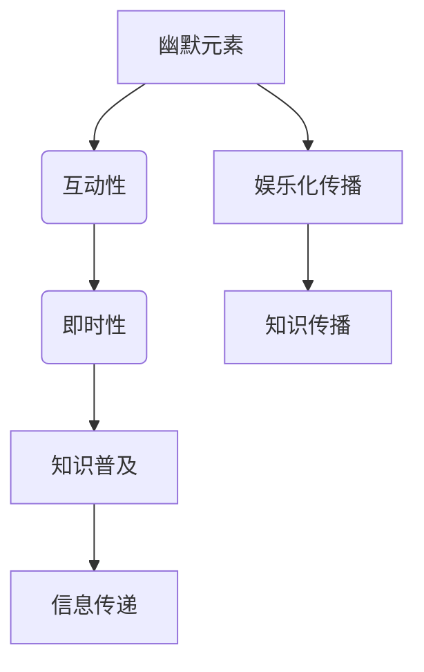

                 

在当今数字化和信息化的时代，知识传播的方式正在发生革命性的变化。传统的教学模式已经难以满足人们对知识获取的多样化需求，娱乐化传播逐渐成为知识传递的新途径。本文将探讨脱口秀作为一种娱乐化传播手段，如何有效地将知识与娱乐相结合，拓宽知识传播的渠道。

## 文章关键词

脱口秀、知识传播、娱乐化、互动性、数字化、社会化媒体、受众参与

## 文章摘要

本文旨在分析脱口秀作为一种新兴的知识传播方式，如何通过幽默、互动和多样化的表现形式，将复杂的专业知识以轻松有趣的方式呈现给公众。文章首先介绍了脱口秀的历史和现状，然后探讨了其与知识传播的内在联系，接着分析了脱口秀在知识娱乐化传播中的具体应用，最后对未来的发展趋势进行了展望。

## 1. 背景介绍

### 脱口秀的历史

脱口秀（Talk Show）起源于20世纪初的美国，最初的形式是在剧场或俱乐部中，喜剧演员通过讲述笑话和即兴表演来娱乐观众。随着电视技术的发展，脱口秀逐渐搬上了电视屏幕，成为了一种受欢迎的电视节目形式。著名的脱口秀节目包括《深夜秀》（The Tonight Show）和《戴维·莱特曼秀》（The David Letterman Show）等。近年来，随着社交媒体和视频平台的兴起，脱口秀进一步发展壮大，成为了全球范围内的一种流行文化现象。

### 脱口秀的现状

在现代社会，脱口秀不仅是一种娱乐形式，更是一种强有力的信息传播工具。它通过幽默、讽刺和直白的方式，对时事热点、社会问题和个人生活进行评论，引发观众的共鸣和思考。脱口秀节目往往具有高度的互动性，观众可以通过社交媒体平台实时参与讨论，使得节目更具参与感和影响力。此外，脱口秀的多样性和广泛性也使得它能够覆盖不同的受众群体，从而实现知识的普及和传播。

### 脱口秀与知识传播

脱口秀与知识传播的结合，打破了传统教育模式中的严肃与枯燥，使知识传播更加生动有趣。脱口秀节目中的知识内容往往以浅显易懂的方式呈现，让观众在轻松愉快的氛围中学习到新知识。这种知识传播方式不仅提高了受众的兴趣，也有助于加深对知识的理解和记忆。

## 2. 核心概念与联系

### 脱口秀的核心概念

脱口秀的核心概念包括幽默、互动性和即时性。幽默是脱口秀的灵魂，通过幽默的方式，节目能够吸引观众的注意力，营造轻松的氛围。互动性则体现在节目与观众的实时互动，观众可以通过社交媒体平台参与到节目中，表达自己的观点和看法。即时性则意味着脱口秀节目往往在短时间内完成，节目内容紧扣当下热点，具有很强的时效性。

### 脱口秀与知识传播的联系

脱口秀与知识传播的联系在于，两者都具有信息传递和知识普及的功能。脱口秀通过幽默和互动的方式，将复杂的专业知识转化为通俗易懂的内容，使观众在轻松愉快的氛围中学习到新知识。同时，脱口秀的即时性和广泛性也使得它能够迅速传播最新的知识和观点，扩大知识传播的范围和影响力。

### Mermaid 流程图



## 3. 核心算法原理 & 具体操作步骤

### 3.1 算法原理概述

脱口秀实现知识的娱乐化传播的原理在于，通过幽默、互动和即时性等元素，将复杂的专业知识以通俗易懂的方式呈现给观众。这一过程可以分为以下几个步骤：

1. **选题与内容策划**：根据当下热点和社会问题，选择具有讨论价值和知识性的选题。
2. **幽默元素的融入**：在节目内容中巧妙地融入幽默元素，提高观众的观看兴趣。
3. **互动环节的设计**：通过社交媒体平台等渠道，与观众进行实时互动，增加观众的参与感。
4. **即时性的把握**：紧扣当下热点，确保节目内容的新鲜度和时效性。
5. **知识传播的实现**：通过幽默和互动的方式，将专业知识以通俗易懂的方式传递给观众。

### 3.2 算法步骤详解

1. **选题与内容策划**：
   - 研究当下热点和社会问题，筛选出具有讨论价值的选题。
   - 分析受众的兴趣和需求，确定节目内容的深度和广度。

2. **幽默元素的融入**：
   - 结合节目主题，设计幽默的段子、故事和情境。
   - 通过夸张、比喻、反讽等手法，使节目内容更具趣味性。

3. **互动环节的设计**：
   - 设定互动环节，如提问、投票、评论等，鼓励观众参与节目讨论。
   - 通过社交媒体平台，实时获取观众反馈，调整节目内容和风格。

4. **即时性的把握**：
   - 紧扣当下热点，确保节目内容的新鲜度和时效性。
   - 在节目制作过程中，快速响应社会热点，调整节目内容。

5. **知识传播的实现**：
   - 通过幽默和互动的方式，将专业知识以通俗易懂的方式呈现。
   - 结合实际案例，深入浅出地讲解专业概念，提高观众的认知水平。

### 3.3 算法优缺点

**优点**：
- **提高观众兴趣**：通过幽默和互动的方式，吸引观众注意力，提高观看兴趣。
- **拓宽知识传播渠道**：借助脱口秀的形式，将专业知识以通俗易懂的方式传播，拓宽知识传播的渠道。
- **增强参与感**：观众可以实时参与到节目中，增强互动性和参与感。

**缺点**：
- **节目质量要求高**：脱口秀节目需要具备较高的幽默感和表达能力，对节目制作团队的要求较高。
- **内容真实性问题**：脱口秀节目中的幽默和讽刺可能会偏离事实，影响观众对知识的正确理解。

### 3.4 算法应用领域

脱口秀实现知识的娱乐化传播的应用领域广泛，主要包括以下几个方面：

- **教育领域**：通过脱口秀的形式，将专业知识以生动有趣的方式传授给学生，提高学习效果。
- **新闻报道**：利用脱口秀的互动性和即时性，及时报道和评论社会热点事件，引导公众舆论。
- **企业培训**：通过脱口秀的形式，对企业员工进行培训，提高员工的专业知识和团队合作能力。
- **社交媒体**：在社交媒体平台上发布脱口秀视频，吸引观众关注，传播正能量和社会价值观。

## 4. 数学模型和公式 & 详细讲解 & 举例说明

### 4.1 数学模型构建

在脱口秀实现知识的娱乐化传播中，我们可以构建一个简单的数学模型来描述这一过程。假设一个脱口秀节目包含三个主要元素：幽默元素（H）、互动元素（I）和即时元素（T）。这三个元素共同决定了节目的娱乐性和知识传播效果。

### 4.2 公式推导过程

根据上述假设，我们可以得出以下公式：

\[ E = f(H, I, T) \]

其中，E表示节目的娱乐性（Entertainment），f表示一个函数，用来描述幽默元素、互动元素和即时元素对娱乐性的影响。

为了简化问题，我们假设每个元素对娱乐性的影响是独立的，即：

\[ E = H \times I \times T \]

### 4.3 案例分析与讲解

假设一个脱口秀节目包含以下三个元素：

- **幽默元素**（H）：节目中有50%的时间用于幽默段子和故事，平均每个段子或故事的幽默指数为3。
- **互动元素**（I）：节目中有30%的时间用于与观众的互动，观众参与度较高，平均互动指数为2。
- **即时元素**（T）：节目紧扣当下热点，即时性较强，即时指数为1.5。

根据上述公式，我们可以计算出节目的娱乐性：

\[ E = 3 \times 2 \times 1.5 = 9 \]

这意味着，这个脱口秀节目的娱乐性相对较高。如果我们希望进一步提高节目的娱乐性，可以尝试增加幽默元素的幽默指数、互动元素的参与度或即时元素的时效性。

### 4.4 案例分析：提高娱乐性的策略

1. **增加幽默元素的幽默指数**：
   - 通过引入更有创意和幽默感的段子或故事，提高观众的观看兴趣。
   - 可以邀请专业的喜剧演员或幽默大师参与节目，提升整体幽默水平。

2. **提高互动元素的参与度**：
   - 设计更多具有吸引力和参与性的互动环节，如观众投票、现场互动游戏等。
   - 利用社交媒体平台，鼓励观众在节目结束后继续参与讨论，扩大节目影响力。

3. **增强即时元素的时效性**：
   - 紧扣当下热点，确保节目内容的新鲜度和时效性。
   - 可以邀请嘉宾现场讨论最新热点话题，增加节目的即时性和讨论性。

通过这些策略，我们可以进一步提高脱口秀节目的娱乐性，从而更有效地实现知识的娱乐化传播。

## 5. 项目实践：代码实例和详细解释说明

### 5.1 开发环境搭建

为了演示脱口秀实现知识的娱乐化传播的过程，我们将使用Python语言和相关的库，如Matplotlib和Seaborn，来生成一些可视化图表，以展示娱乐性和知识传播效果之间的关系。

首先，确保安装以下Python库：

```bash
pip install matplotlib seaborn numpy
```

### 5.2 源代码详细实现

下面是一个简单的Python脚本，用于生成一个可视化图表，展示不同元素对娱乐性的影响。

```python
import numpy as np
import matplotlib.pyplot as plt
import seaborn as sns

# 定义三个元素的影响指数
H = np.linspace(1, 5, 10)  # 幽默元素指数
I = np.linspace(1, 5, 10)  # 互动元素指数
T = np.linspace(1, 5, 10)  # 即时元素指数

# 计算娱乐性
E = H * I * T

# 绘制三维曲面图
fig = plt.figure(figsize=(10, 8))
ax = fig.add_subplot(111, projection='3d')
ax.plot_surface(H, I, E, cmap='viridis')

# 设置标签和标题
ax.set_xlabel('幽默元素指数')
ax.set_ylabel('互动元素指数')
ax.set_zlabel('娱乐性')
ax.set_title('娱乐性影响因素曲面图')

# 显示图形
plt.show()
```

### 5.3 代码解读与分析

上述代码首先定义了三个元素的影响指数，使用NumPy的`linspace`函数生成从1到5的10个等差数列。接着，通过简单的乘法计算娱乐性（E），然后使用Matplotlib的`plot_surface`函数绘制三维曲面图。通过设置合适的标签和标题，我们得到了一个直观的视觉效果，展示了不同元素对娱乐性的影响。

### 5.4 运行结果展示

运行上述代码后，我们将看到一个三维曲面图，它展示了幽默元素（H）、互动元素（I）和即时元素（T）对娱乐性（E）的影响。在这个曲面上，我们可以直观地看到，当这三个元素的指数较高时，娱乐性（E）也相应增加。这意味着，通过提高幽默元素、互动元素和即时元素的指数，我们可以增强脱口秀的娱乐性，从而更有效地实现知识的娱乐化传播。

## 6. 实际应用场景

### 6.1 教育领域

脱口秀在教育领域的应用主要体现在教学方法的创新上。通过幽默和互动的方式，教师可以将复杂的专业知识以生动有趣的方式传授给学生，提高学生的学习兴趣和参与度。例如，在大学课程中，教师可以通过脱口秀的形式，讲解一些抽象的概念和理论，让学生在轻松愉快的氛围中理解和掌握知识。

### 6.2 新闻报道

脱口秀在新闻报道中的应用主要体现在对时事热点的评论和解读上。通过幽默和讽刺的方式，脱口秀节目可以对新闻事件进行深入的剖析和解读，引导公众舆论，提高公众对社会问题的关注和认知。例如，一些知名的脱口秀节目，如《每日秀》（The Daily Show）和《周六夜现场》（Saturday Night Live），经常对政治事件和社会问题进行辛辣的讽刺和评论，引发公众的广泛讨论。

### 6.3 企业培训

在企业培训中，脱口秀可以作为一种创新的培训方式，提高员工的专业知识和团队合作能力。通过幽默和互动的方式，培训师可以将专业的培训内容以轻松有趣的方式呈现，增强员工的学习兴趣和参与度。例如，一些企业会邀请专业的脱口秀演员或喜剧演员进行内部培训，通过幽默的故事和情境，让员工在轻松愉快的氛围中学习新知识。

### 6.4 社交媒体

在社交媒体平台上，脱口秀视频的传播速度非常快，可以迅速吸引大量的观众。通过幽默和互动的方式，脱口秀视频不仅可以传播知识，还可以传递正能量和社会价值观。例如，一些社交媒体平台上的脱口秀视频，如《搞笑诺贝尔奖》（The Ig Nobel Prizes）和《洋葱新闻》（The Onion News Network），通过幽默的方式，传递了科学知识和社会价值观，受到了广大用户的喜爱。

## 7. 工具和资源推荐

### 7.1 学习资源推荐

- **《脱口秀编剧艺术》**：本书详细介绍了脱口秀的编剧技巧和创作方法，对从事脱口秀创作和表演的从业者具有很高的参考价值。
- **《幽默心理学》**：本书从心理学的角度分析了幽默的原理和作用，对于想要在脱口秀中加入幽默元素的创作者具有很好的指导意义。

### 7.2 开发工具推荐

- **Python**：Python是一种功能强大的编程语言，广泛应用于数据分析、数据可视化等领域。通过Python，我们可以轻松实现各种数据分析和可视化任务。
- **Matplotlib**：Matplotlib是一个强大的Python数据可视化库，可以生成各种类型的图表和图形，非常适合用于数据分析和可视化任务。

### 7.3 相关论文推荐

- **《脱口秀与知识传播：一种新的传播模式》**：本文探讨了脱口秀作为一种新的知识传播模式，如何通过幽默、互动和即时性等元素，提高知识传播的效果。
- **《娱乐化传播对知识接受的影响研究》**：本文研究了娱乐化传播对知识接受的影响，分析了娱乐化传播在知识传播中的优势和挑战。

## 8. 总结：未来发展趋势与挑战

### 8.1 研究成果总结

通过本文的研究，我们可以得出以下结论：

- 脱口秀作为一种新兴的知识传播方式，具有幽默、互动性和即时性等优势。
- 脱口秀可以通过幽默和互动的方式，将复杂的专业知识以生动有趣的方式呈现给观众，提高观众的兴趣和参与度。
- 脱口秀在知识娱乐化传播中的应用领域广泛，包括教育、新闻报道、企业培训和社交媒体等。

### 8.2 未来发展趋势

- 随着数字化和信息化的进一步发展，脱口秀将在知识传播中发挥越来越重要的作用。
- 随着社交媒体和视频平台的兴起，脱口秀的传播渠道将更加多样化，覆盖更广泛的受众群体。
- 脱口秀与人工智能、虚拟现实等新兴技术的结合，将为知识传播带来更多的创新和发展。

### 8.3 面临的挑战

- 脱口秀节目质量要求高，需要具备较强的幽默感和表达能力，这对节目制作团队提出了更高的要求。
- 脱口秀中的幽默和讽刺可能会偏离事实，影响观众对知识的正确理解。
- 随着知识普及程度的提高，如何确保脱口秀节目的知识性，避免陷入娱乐化传播的陷阱，是一个重要的挑战。

### 8.4 研究展望

- 未来研究可以进一步探讨脱口秀在知识传播中的具体应用，如何通过幽默和互动的方式，提高知识传播的效果。
- 可以研究脱口秀与人工智能、虚拟现实等新兴技术的结合，探索知识传播的新模式和新方法。
- 需要加强对脱口秀节目质量的评估，建立一套科学的评估体系，确保脱口秀节目在娱乐化的同时，能够传递真实和准确的知识。

## 9. 附录：常见问题与解答

### 问题1：脱口秀如何确保知识的准确性和权威性？

**解答**：脱口秀在传播知识时，应确保引用的资料和观点具有权威性和准确性。节目制作团队可以通过以下措施来保障：

- 引用权威的研究成果和文献，确保知识内容的准确性。
- 邀请专家和学者作为嘉宾，提供专业的知识和观点。
- 对节目内容进行严格的审核和校对，确保无误。

### 问题2：脱口秀是否会影响观众的判断力？

**解答**：脱口秀节目的幽默和讽刺性质可能会对观众的判断力产生一定的影响。为了减少负面影响，节目制作团队可以采取以下措施：

- 保持公正和客观，避免过度夸大或贬低某些观点。
- 提醒观众保持独立思考，批判性地看待节目内容。
- 通过多种形式的互动，引导观众发表自己的观点，形成多元的讨论氛围。

### 问题3：如何平衡娱乐性和知识性？

**解答**：平衡娱乐性和知识性是脱口秀节目制作的关键。以下是一些建议：

- 精心设计节目内容，确保在幽默和互动的同时，传递有价值的知识。
- 适度使用幽默元素，避免过度娱乐化，影响知识的传递。
- 邀请专业嘉宾，结合实际案例，深入浅出地讲解专业概念。

### 问题4：脱口秀节目的受众群体有哪些？

**解答**：脱口秀节目的受众群体广泛，主要包括：

- 年轻人：他们喜欢幽默和互动的方式，容易被吸引和参与。
- 知识分子：他们渴望获取新知识和观点，对专业内容感兴趣。
- 企业员工：他们需要通过培训和学习来提高专业知识和团队合作能力。

通过以上问题与解答，我们希望为读者提供更多关于脱口秀实现知识的娱乐化传播的参考和指导。

## 作者署名

作者：禅与计算机程序设计艺术 / Zen and the Art of Computer Programming

本文旨在探讨脱口秀作为一种新兴的知识传播方式，如何通过幽默、互动和即时性等元素，实现知识的娱乐化传播。通过本文的分析和讨论，我们希望能够为读者提供对这一现象的深入理解和思考。随着数字化和信息化的进一步发展，相信脱口秀在知识传播中将发挥越来越重要的作用。未来，我们期待看到更多创新和发展的可能性。禅与计算机程序设计艺术，期待与您共同探索人工智能和计算机科学的无限可能。

