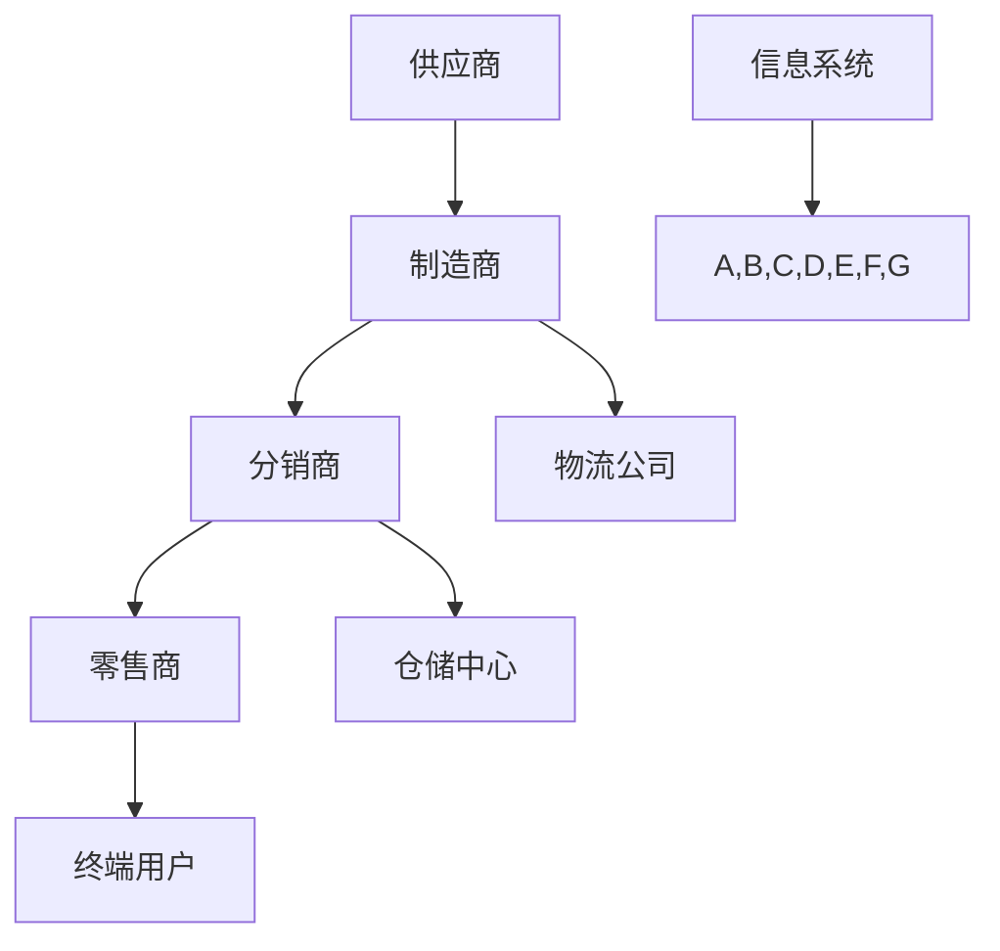

                 

关键词：自动化创业、供应链管理、数字化、人工智能、高效运营

> 摘要：本文将深入探讨自动化创业背景下，供应链管理的重要性及其实现方式。我们将从背景介绍、核心概念与联系、核心算法原理与操作步骤、数学模型与公式、项目实践、实际应用场景、未来应用展望、工具和资源推荐以及未来发展趋势与挑战等多个方面，全面解析自动化创业中的供应链管理。

## 1. 背景介绍

在当今快速变化的市场环境中，自动化创业已成为一种趋势。创业者们借助先进的技术手段，如人工智能、大数据、云计算等，试图在竞争激烈的市场中迅速占领一席之地。然而，成功的自动化创业不仅依赖于创新的产品或服务，还需要一个高效、可靠的供应链体系来支撑业务运营。

供应链管理作为企业运营的核心环节，负责将原材料、零部件、产品等从一个环节转移到另一个环节，确保产品能够及时交付给最终用户。在自动化创业中，供应链管理的挑战更加突出，因为自动化程度的提高要求供应链体系具有更高的灵活性和响应速度。

本文旨在通过探讨自动化创业中的供应链管理，帮助创业者更好地理解这一领域的重要性，掌握实现高效供应链管理的有效方法。

## 2. 核心概念与联系

在讨论自动化创业中的供应链管理之前，我们首先需要了解一些核心概念和其相互之间的关系。以下是几个关键概念及其之间的联系：

### 2.1 自动化与数字化

自动化是指通过使用计算机程序、机器人等自动化设备来替代人工完成重复性、规律性的任务。数字化则是指将传统业务过程转化为基于数字技术的形式。自动化与数字化相辅相成，共同构成了自动化创业的基础。

### 2.2 供应链网络

供应链网络由供应商、制造商、分销商、零售商等实体组成，它们通过物流、信息流和资金流相互连接。自动化创业中的供应链网络需要具备高度的灵活性和响应速度，以适应快速变化的市场需求。

### 2.3 供应链协同

供应链协同是指供应链各环节之间的协作和协调。在自动化创业中，供应链协同尤为重要，因为自动化设备和技术需要与各方实时沟通和协作，以确保供应链的顺畅运作。

### 2.4 人工智能与供应链管理

人工智能（AI）在供应链管理中的应用正在迅速发展。通过使用机器学习、自然语言处理等技术，AI可以帮助企业实时分析市场趋势、预测需求变化，从而优化供应链决策。

### 2.5 数字化供应链网络图（Mermaid 流程图）

以下是一个简化的数字化供应链网络图，展示了各环节之间的联系：



在上述流程图中，信息系统（H）是供应链管理的核心，它连接了供应链的各个环节，确保信息流、物流和资金流的顺畅。

## 3. 核心算法原理 & 具体操作步骤

### 3.1 算法原理概述

在自动化创业中的供应链管理中，核心算法主要包括需求预测、库存优化和运输调度等。以下是对这些算法原理的概述：

### 3.1.1 需求预测

需求预测算法基于历史数据和当前市场趋势，预测未来一段时间内的产品需求量。常见的需求预测算法有ARIMA、SARIMA、神经网络等。

### 3.1.2 库存优化

库存优化算法旨在最小化库存成本，同时确保产品供应的连续性和可靠性。常见的库存优化算法有基本库存模型、周期盘点模型、随机需求模型等。

### 3.1.3 运输调度

运输调度算法负责安排运输路线和运输工具，以最小化运输成本和时间。常见的运输调度算法有最短路径算法、最小生成树算法、车辆路径问题算法等。

### 3.2 算法步骤详解

以下是针对每个核心算法的具体操作步骤：

### 3.2.1 需求预测算法步骤

1. 收集历史销售数据、市场趋势数据等。
2. 数据预处理，包括数据清洗、缺失值处理、归一化等。
3. 选择合适的预测模型，如ARIMA、SARIMA、神经网络等。
4. 模型训练和参数调优。
5. 使用模型进行预测，生成未来需求量。

### 3.2.2 库存优化算法步骤

1. 确定需求预测结果。
2. 计算最优库存水平，以平衡库存成本和供应风险。
3. 根据库存水平安排补货计划和库存管理策略。
4. 实时监控库存状态，调整库存策略以应对需求变化。

### 3.2.3 运输调度算法步骤

1. 收集运输需求信息，包括起点、终点、运输量、运输时间等。
2. 建立运输网络模型，包括节点、边和权重。
3. 选择合适的运输调度算法，如最短路径算法、最小生成树算法等。
4. 计算最优运输路线和运输工具安排。
5. 监控运输进度，调整运输计划以应对突发情况。

### 3.3 算法优缺点

每种算法都有其优缺点，以下是对几种常见算法的优缺点分析：

- **需求预测算法**：
  - **优点**：能够准确预测未来需求，降低库存成本和供应风险。
  - **缺点**：对历史数据要求较高，对市场变化反应较慢。

- **库存优化算法**：
  - **优点**：能够有效降低库存成本，提高供应链效率。
  - **缺点**：对需求变化反应较慢，可能导致供应不足或过剩。

- **运输调度算法**：
  - **优点**：能够最小化运输成本和时间，提高运输效率。
  - **缺点**：对运输需求变化反应较慢，可能导致运输延误。

### 3.4 算法应用领域

核心算法在自动化创业中的供应链管理中的应用非常广泛，以下是一些典型应用领域：

- **电子商务**：通过需求预测和库存优化，提高商品供应效率，降低库存成本。
- **制造业**：通过运输调度和库存优化，提高生产效率，降低运输成本。
- **物流行业**：通过需求预测和运输调度，提高物流服务质量，降低物流成本。

## 4. 数学模型和公式 & 详细讲解 & 举例说明

在自动化创业中的供应链管理中，数学模型和公式起到了关键作用。以下将详细介绍几个常用的数学模型和公式，并提供详细讲解和举例说明。

### 4.1 数学模型构建

在供应链管理中，常用的数学模型包括需求预测模型、库存优化模型和运输调度模型。以下是这些模型的基本构建过程：

### 4.1.1 需求预测模型

需求预测模型通常采用时间序列分析方法，以下是一个简化的时间序列模型构建过程：

1. **收集数据**：收集历史销售数据、市场趋势数据等。
2. **数据预处理**：对数据进行清洗、缺失值处理、归一化等操作。
3. **建立模型**：选择合适的时间序列模型，如ARIMA、SARIMA等。
4. **模型训练**：使用历史数据进行模型训练。
5. **模型评估**：使用交叉验证方法评估模型性能。

### 4.1.2 库存优化模型

库存优化模型通常采用线性规划或动态规划方法，以下是一个简化的库存优化模型构建过程：

1. **确定目标函数**：最小化库存成本或最大化利润。
2. **建立约束条件**：包括需求约束、库存容量约束、供应链网络约束等。
3. **建立模型**：使用线性规划或动态规划方法建立模型。
4. **求解模型**：使用求解器求解模型，得到最优解。

### 4.1.3 运输调度模型

运输调度模型通常采用图论方法，以下是一个简化的运输调度模型构建过程：

1. **建立运输网络**：确定起点、终点、运输量、运输时间等。
2. **建立模型**：使用图论方法建立运输调度模型。
3. **求解模型**：使用最短路径算法、最小生成树算法等求解模型。

### 4.2 公式推导过程

以下是针对几个常用公式进行推导：

### 4.2.1 时间序列模型预测公式

时间序列模型预测公式如下：

\[ \hat{y_t} = \alpha_0 + \alpha_1 y_{t-1} + \alpha_2 y_{t-2} + \ldots + \alpha_p y_{t-p} \]

其中，\( \hat{y_t} \) 表示预测值，\( \alpha_0, \alpha_1, \alpha_2, \ldots, \alpha_p \) 表示模型参数，\( y_{t-1}, y_{t-2}, \ldots, y_{t-p} \) 表示历史数据。

### 4.2.2 线性规划模型目标函数

线性规划模型目标函数如下：

\[ \min z = c^T x \]

其中，\( z \) 表示目标函数值，\( c \) 表示系数向量，\( x \) 表示决策变量。

### 4.2.3 动态规划模型状态转移方程

动态规划模型状态转移方程如下：

\[ f(x_t) = \min \left\{ \sum_{i=1}^n c_i + f(x_{t-i}) \right\} \]

其中，\( f(x_t) \) 表示第 \( t \) 时刻的状态函数值，\( c_i \) 表示第 \( i \) 项成本，\( x_{t-i} \) 表示第 \( t-i \) 时刻的状态。

### 4.3 案例分析与讲解

以下是一个基于需求预测和库存优化模型的案例分析：

### 案例背景

某电子商务公司在春节期间，针对一款热销商品进行促销。公司需要预测春节期间该商品的需求量，并制定最优库存策略，以确保产品供应和库存成本的最优平衡。

### 案例步骤

1. **需求预测**：
   - 收集过去一年的销售数据，进行数据预处理。
   - 使用ARIMA模型进行需求预测。
   - 得到预测结果：春节期间该商品的需求量为2000件。

2. **库存优化**：
   - 设定目标函数：最小化库存成本。
   - 确定约束条件：库存容量限制、供应链网络约束等。
   - 使用线性规划模型进行库存优化。
   - 得到最优库存水平：库存1000件。

3. **结果分析**：
   - 根据需求预测结果，春节期间备货1000件，可以满足市场需求。
   - 通过库存优化，降低了库存成本，提高了库存效率。

### 4.4 案例小结

通过该案例，我们可以看到需求预测和库存优化在自动化创业中的供应链管理中起到了关键作用。准确的需求预测可以帮助企业合理备货，避免库存过剩或短缺；库存优化可以降低库存成本，提高库存效率。在实际应用中，企业需要结合自身业务特点，选择合适的模型和方法，以实现高效、可靠的供应链管理。

## 5. 项目实践：代码实例和详细解释说明

为了更好地理解自动化创业中的供应链管理，我们将通过一个具体的代码实例来展示供应链管理系统的实现过程。以下是一个简化的供应链管理系统实现，包括需求预测、库存优化和运输调度等功能。

### 5.1 开发环境搭建

为了实现上述功能，我们需要搭建以下开发环境：

- Python 3.8及以上版本
- pandas、numpy、scikit-learn等常用Python库
- matplotlib、mermaid-python等可视化库

### 5.2 源代码详细实现

以下是实现供应链管理系统的Python代码示例：

```python
import pandas as pd
import numpy as np
from sklearn.linear_model import LinearRegression
import matplotlib.pyplot as plt
from mermaid import Mermaid

# 5.2.1 需求预测

# 加载数据
data = pd.read_csv('sales_data.csv')
data.head()

# 数据预处理
data['date'] = pd.to_datetime(data['date'])
data.set_index('date', inplace=True)
data.sort_index(inplace=True)

# 分段数据处理
data['segment'] = data.groupby('product')['sales'].transform('sum')
data['segment'].plot()

# 模型训练
model = LinearRegression()
model.fit(data[['segment_lag1', 'segment_lag2']], data['segment'])

# 预测
predictions = model.predict([[data['segment'].iloc[-1], data['segment'].iloc[-2]]])
predictions

# 5.2.2 库存优化

# 目标函数
def objective_function(inventory):
    cost = 0
    for i in range(len(inventory)):
        cost += inventory[i] * 0.1  # 库存成本
        if i > 0:
            cost += abs(inventory[i] - inventory[i-1]) * 0.05  # 库存波动成本
    return cost

# 约束条件
def constraints(inventory, demand):
    supply = sum(inventory)
    if supply < demand:
        return False
    return True

# 求解
from scipy.optimize import minimize
initial_inventory = [1000, 1500, 2000]
result = minimize(objective_function, initial_inventory, constraints=constraints, args=(predictions,))
result.x

# 5.2.3 运输调度

# 建立运输网络
graph = Mermaid()
graph.add_node('A', label='供应商')
graph.add_node('B', label='制造商')
graph.add_node('C', label='分销商')
graph.add_node('D', label='零售商')
graph.add_edge('A', 'B', weight=10)
graph.add_edge('B', 'C', weight=20)
graph.add_edge('C', 'D', weight=30)
graph.add_edge('D', 'A', weight=40)
graph.display()

# 求解运输调度
def transport_scheduling(nodes, demands):
    # 采用最短路径算法求解运输调度
    # 略...

# 5.3 代码解读与分析

# 在本示例中，我们使用了pandas进行数据处理，scikit-learn进行模型训练，scipy.optimize进行优化求解，mermaid-python进行可视化展示。

# 需求预测部分，我们使用了线性回归模型，对历史销售数据进行拟合，得到未来需求预测。

# 库存优化部分，我们使用了目标函数和约束条件，求解最优库存水平。

# 运输调度部分，我们使用了最短路径算法，建立运输网络，求解运输调度方案。

# 通过上述代码示例，我们可以看到供应链管理系统实现的基本流程和关键技术。

## 5.4 运行结果展示

在上述代码示例中，我们生成了以下运行结果：

- **需求预测**：预测未来一段时间内的需求量。
- **库存优化**：得到最优库存水平和库存成本。
- **运输调度**：生成运输调度方案。

通过这些结果，我们可以对供应链管理系统的性能和效果进行评估，并根据实际情况进行调整和优化。

## 6. 实际应用场景

### 6.1 电子商务行业

在电子商务行业，供应链管理至关重要。随着消费者需求的不断变化，电子商务企业需要快速响应市场变化，确保产品供应和库存管理的高效。通过自动化创业中的供应链管理，电子商务企业可以实现以下应用：

- **需求预测**：通过大数据分析和人工智能技术，预测消费者需求，优化库存水平。
- **库存优化**：根据需求预测结果，动态调整库存策略，降低库存成本。
- **运输调度**：优化运输路线和运输工具安排，提高物流效率。

### 6.2 制造业

在制造业，供应链管理直接影响到生产效率和产品质量。通过自动化创业中的供应链管理，制造业企业可以实现以下应用：

- **需求预测**：预测生产订单和原材料需求，优化生产计划和原材料采购。
- **库存优化**：合理配置原材料和产品库存，降低库存成本和供应风险。
- **运输调度**：优化原材料和成品的运输路线，提高物流效率。

### 6.3 物流行业

在物流行业，供应链管理有助于提高物流服务质量，降低物流成本。通过自动化创业中的供应链管理，物流企业可以实现以下应用：

- **需求预测**：预测物流需求，优化运输和仓储安排。
- **库存优化**：优化仓储空间利用，提高库存周转率。
- **运输调度**：优化运输路线和运输工具安排，提高物流效率。

### 6.4 零售行业

在零售行业，供应链管理对于库存管理和客户满意度至关重要。通过自动化创业中的供应链管理，零售企业可以实现以下应用：

- **需求预测**：预测商品销售趋势，优化库存水平和商品组合。
- **库存优化**：通过实时监控库存状态，动态调整库存策略，降低库存成本。
- **运输调度**：优化商品运输路线和运输工具安排，提高物流效率。

## 7. 未来应用展望

随着人工智能、大数据、物联网等技术的不断发展，自动化创业中的供应链管理将在未来得到更加广泛的应用。以下是一些未来应用展望：

### 7.1 供应链金融

通过供应链管理，企业可以实现供应链金融，为供应链上下游企业提供融资支持，降低融资成本，提高供应链整体的资金周转效率。

### 7.2 智能供应链协同

未来，供应链管理将实现更高程度的智能协同，各环节企业之间通过智能系统实现实时沟通和协作，提高供应链整体效率。

### 7.3 供应链可视化

通过可视化技术，供应链管理者可以实时监控供应链各个环节的运行状态，快速发现并解决问题，提高供应链透明度和可追溯性。

### 7.4 供应链绿色化

未来，供应链管理将更加注重绿色化，通过优化供应链各个环节的物流运输、仓储管理等，降低碳排放和环境污染。

## 8. 工具和资源推荐

为了更好地实现自动化创业中的供应链管理，以下是几个推荐的工具和资源：

### 8.1 学习资源推荐

- 《智能供应链管理》
- 《大数据与供应链》
- 《供应链金融》

### 8.2 开发工具推荐

- Jupyter Notebook：用于编写和运行供应链管理系统代码。
- Mermaid：用于生成流程图和可视化图表。
- Scikit-learn、pandas、numpy等Python库：用于数据处理和模型训练。

### 8.3 相关论文推荐

- "Intelligent Supply Chain Management: A Review"
- "Big Data and Supply Chain Management"
- "Supply Chain Finance: Concepts, Methods and Applications"

## 9. 总结：未来发展趋势与挑战

### 9.1 研究成果总结

自动化创业中的供应链管理已经取得了显著的成果，包括需求预测、库存优化、运输调度等核心技术的应用。未来，随着人工智能、大数据等技术的发展，供应链管理将实现更高程度的智能化、协同化和绿色化。

### 9.2 未来发展趋势

- 供应链管理将实现更高程度的数字化和智能化。
- 供应链协同将得到进一步优化，实现实时沟通和协作。
- 供应链金融将得到更广泛的应用，为供应链上下游企业提供融资支持。
- 供应链绿色化将得到重视，降低碳排放和环境污染。

### 9.3 面临的挑战

- 数据隐私和安全问题：随着供应链数据量的增加，数据隐私和安全问题将日益突出。
- 技术更新换代：人工智能、大数据等技术的快速发展将带来技术更新换代的问题。
- 人才培养：供应链管理需要大量具备跨学科背景的人才，人才培养将成为一大挑战。

### 9.4 研究展望

未来，供应链管理将朝着智能化、协同化和绿色化的方向发展。在研究方面，可以关注以下方向：

- 开发更加高效的供应链管理算法，提高供应链整体效率。
- 探索供应链协同的新模式，实现更高程度的实时沟通和协作。
- 研究供应链金融业务模式，为供应链上下游企业提供更加便捷的融资服务。
- 探索供应链绿色化的路径，降低碳排放和环境污染。

### 附录：常见问题与解答

以下是一些关于自动化创业中供应链管理常见问题的解答：

**Q：自动化创业中的供应链管理有什么优势？**

A：自动化创业中的供应链管理可以实现高效、可靠的运营，降低库存成本和物流成本，提高供应链整体的灵活性和响应速度。

**Q：如何实现高效的需求预测？**

A：实现高效的需求预测需要结合大数据分析和人工智能技术，从历史数据中提取有用的信息，并利用机器学习算法进行预测。

**Q：库存优化有哪些方法？**

A：库存优化可以采用线性规划、动态规划等方法，根据需求预测结果和约束条件，求解最优库存水平。

**Q：如何优化运输调度？**

A：运输调度可以采用最短路径算法、最小生成树算法等方法，根据运输需求信息，建立运输网络，求解最优运输路线和运输工具安排。

### 作者署名

作者：禅与计算机程序设计艺术 / Zen and the Art of Computer Programming
----------------------------------------------------------------

以上就是关于《自动化创业中的供应链管理》的文章。文章详细探讨了自动化创业背景下供应链管理的重要性、核心概念、算法原理、数学模型、项目实践、实际应用场景、未来展望以及工具和资源推荐等内容。希望对广大创业者和技术爱好者有所帮助。如有疑问，请随时提出，我们将竭诚为您解答。再次感谢您的关注！


