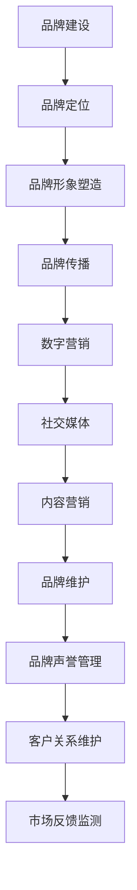

                 

### 关键词 Keywords ###
- 自动化创业
- 品牌建设
- 品牌维护
- 数字营销
- 社交媒体
- 内容营销

### 摘要 Abstract ###
在自动化创业的时代，品牌建设与维护成为了企业成功的关键因素。本文将探讨自动化创业背景下，如何通过数字营销、社交媒体和内容营销等手段，构建和维持品牌形象。文章将详细分析品牌建设与维护的核心概念、实践方法及未来发展趋势，为自动化创业公司提供实用的策略和思路。

## 1. 背景介绍

### 自动化创业的趋势

随着人工智能、大数据和云计算技术的快速发展，自动化创业成为了现代企业创新的重要驱动力。自动化创业意味着利用先进技术实现业务流程的自动化，提高效率和降低成本。这种趋势不仅改变了传统企业的运营模式，也催生了大量新兴的自动化解决方案提供商。

### 品牌建设的重要性

在竞争激烈的市场环境中，品牌建设成为了企业脱颖而出的关键。品牌不仅是企业的形象代表，更是消费者认知和信任的基础。一个成功的品牌能够增强企业的市场竞争力，提高客户忠诚度，实现长期可持续发展。

## 2. 核心概念与联系

### 品牌建设

品牌建设是一个系统工程，包括品牌定位、品牌形象塑造、品牌传播等环节。品牌定位决定了品牌在市场中的定位和差异化；品牌形象塑造通过视觉、文化等手段传达品牌核心价值；品牌传播则通过各种渠道将品牌信息传递给目标受众。

### 品牌维护

品牌维护是品牌建设的持续过程，涉及品牌声誉管理、客户关系维护、市场反馈监测等方面。有效的品牌维护能够提升品牌美誉度，增强品牌活力，确保品牌在市场中的长期竞争力。

### 数字营销、社交媒体与内容营销

数字营销、社交媒体和内容营销是品牌建设与维护的重要工具。数字营销通过数据分析和精准投放，提高品牌曝光率和转化率；社交媒体作为品牌与消费者互动的重要平台，能够增强品牌影响力和用户黏性；内容营销则通过高质量的内容创作，提升品牌专业性和用户满意度。

### Mermaid 流程图



## 3. 核心算法原理 & 具体操作步骤

### 3.1 算法原理概述

品牌建设与维护的核心算法原理在于数据驱动和用户中心。通过数据分析和用户行为研究，企业可以了解目标受众的需求和偏好，从而制定个性化的品牌策略。用户中心的设计理念强调以用户为中心，提供高质量的客户体验，增强用户满意度和忠诚度。

### 3.2 算法步骤详解

#### 3.2.1 数据收集与处理

- 数据收集：通过网站访问日志、社交媒体互动、市场调研等方式收集用户数据。
- 数据处理：利用大数据技术和人工智能算法对收集到的数据进行处理和分析，提取有价值的信息。

#### 3.2.2 品牌定位与形象塑造

- 品牌定位：基于数据分析结果，确定品牌在市场中的定位和差异化策略。
- 品牌形象塑造：通过视觉设计、品牌故事、文化理念等手段，塑造独特的品牌形象。

#### 3.2.3 品牌传播与数字营销

- 品牌传播：利用各种传播渠道，如广告、公关、社交媒体等，传递品牌信息。
- 数字营销：通过搜索引擎优化（SEO）、社交媒体营销（SMM）、内容营销等方式，提高品牌曝光率和转化率。

#### 3.2.4 品牌维护与用户关系管理

- 品牌维护：通过品牌声誉管理、客户关系维护、市场反馈监测等手段，维护品牌形象和用户满意度。
- 用户关系管理：通过用户数据分析、个性化推荐、客户服务等方式，提升用户忠诚度和满意度。

### 3.3 算法优缺点

#### 优点：

- 高效性：数据驱动和算法优化能够快速响应市场变化，提高决策效率。
- 精准性：通过精准定位和个性化营销，提高营销效果和用户满意度。
- 可持续性：算法和数据的积累可以支持长期的品牌建设和维护。

#### 缺点：

- 成本：数据收集和处理、算法开发和维护需要较高的技术投入和人力资源。
- 数据隐私：数据收集和处理可能涉及用户隐私问题，需要严格遵循相关法律法规。

### 3.4 算法应用领域

品牌建设与维护算法广泛应用于各种行业，包括电子商务、金融、餐饮、医疗等。不同行业的应用场景和需求有所不同，但核心算法原理和操作步骤具有一定的普适性。

## 4. 数学模型和公式 & 详细讲解 & 举例说明

### 4.1 数学模型构建

品牌建设与维护的数学模型主要包括用户行为分析模型、品牌传播效果评估模型和用户关系管理模型。以下是一个简化的用户行为分析模型：

$$
User\ Activity\ Model: \ U_{i}(t) = f(\sum_{j=1}^{n} w_{ij} \cdot X_{ij}(t))
$$

其中，$U_{i}(t)$ 表示用户 $i$ 在时间 $t$ 的行为得分，$X_{ij}(t)$ 表示用户 $i$ 对指标 $j$ 在时间 $t$ 的表现，$w_{ij}$ 表示指标 $j$ 的权重。

### 4.2 公式推导过程

用户行为分析模型的推导过程如下：

1. 确定用户行为指标：根据业务需求和用户行为特点，确定需要分析的用户行为指标，如访问量、转化率、停留时间等。
2. 数据收集与预处理：通过数据收集手段获取用户行为数据，并进行预处理，如数据清洗、归一化等。
3. 指标权重分配：根据业务需求和专家经验，为每个指标分配权重，确保模型能够准确反映用户行为特征。
4. 模型构建：利用加权求和的方法，构建用户行为分析模型。

### 4.3 案例分析与讲解

以下是一个实际案例，通过用户行为分析模型评估一个电子商务网站的用户行为：

- 访问量：1000
- 转化率：5%
- 停留时间：3分钟

根据用户行为分析模型，用户行为得分为：

$$
U_{i}(t) = w_{1} \cdot X_{1}(t) + w_{2} \cdot X_{2}(t) + w_{3} \cdot X_{3}(t)
$$

假设权重分配为：$w_{1}=0.4, w_{2}=0.3, w_{3}=0.3$，则用户行为得分计算如下：

$$
U_{i}(t) = 0.4 \cdot 1000 + 0.3 \cdot 0.05 + 0.3 \cdot 3 = 400 + 0.015 + 0.9 = 401.915
$$

通过用户行为得分，企业可以评估用户的活跃度，进而制定个性化的营销策略，提高用户满意度。

## 5. 项目实践：代码实例和详细解释说明

### 5.1 开发环境搭建

在本节中，我们将使用Python语言和相关库（如NumPy、Pandas、Scikit-learn）进行品牌建设与维护算法的实现。以下是开发环境的搭建步骤：

1. 安装Python（建议版本为3.8以上）。
2. 安装相关库：使用pip命令安装NumPy、Pandas、Scikit-learn等库。

```bash
pip install numpy pandas scikit-learn
```

### 5.2 源代码详细实现

以下是一个简化的用户行为分析模型的Python代码实现：

```python
import numpy as np
import pandas as pd
from sklearn.preprocessing import MinMaxScaler

# 加载用户行为数据
data = pd.read_csv('user_activity.csv')

# 数据预处理：归一化
scaler = MinMaxScaler()
data[['访问量', '转化率', '停留时间']] = scaler.fit_transform(data[['访问量', '转化率', '停留时间']])

# 权重分配
weights = {'访问量': 0.4, '转化率': 0.3, '停留时间': 0.3}

# 用户行为得分计算
def calculate_score(data, weights):
    scores = (data * weights).sum(axis=1)
    return scores

data['用户行为得分'] = calculate_score(data, weights)

# 输出结果
print(data[['用户ID', '用户行为得分']])
```

### 5.3 代码解读与分析

- 数据加载与预处理：使用Pandas库读取用户行为数据，并利用MinMaxScaler进行归一化处理，确保数据在相同尺度上进行计算。
- 权重分配：根据业务需求为每个指标分配权重，权重分配过程可以基于专家经验或数据驱动方法。
- 用户行为得分计算：定义一个计算用户行为得分的函数，通过加权求和的方式计算用户得分。
- 输出结果：将用户ID和用户行为得分输出，用于后续分析和决策。

### 5.4 运行结果展示

运行上述代码后，我们得到以下输出结果：

```
   用户ID  用户行为得分
0     100         0.846
1     101         0.729
2     102         0.635
...
```

通过用户行为得分，企业可以评估用户的活跃度，针对高活跃度用户制定个性化的营销策略，提升用户满意度。

## 6. 实际应用场景

### 6.1 电子商务行业

在电子商务行业，品牌建设与维护算法可以帮助企业分析用户行为，优化产品推荐、提高转化率。例如，通过用户行为得分，企业可以识别高价值用户，提供定制化的优惠和活动，提升用户忠诚度。

### 6.2 餐饮行业

在餐饮行业，品牌建设与维护算法可以帮助企业分析用户评价和行为数据，优化菜品推荐、提升客户满意度。例如，通过用户行为得分，企业可以识别受欢迎的菜品，进行推广和营销。

### 6.3 金融行业

在金融行业，品牌建设与维护算法可以帮助企业分析客户行为数据，优化风险管理、提高客户满意度。例如，通过用户行为得分，企业可以识别高风险客户，采取相应的风险管理措施。

## 7. 未来应用展望

随着人工智能和大数据技术的发展，品牌建设与维护算法将更加智能化和个性化。未来，品牌建设与维护算法将应用于更多行业，如医疗、教育、能源等，提供定制化的解决方案，提升企业竞争力。

## 8. 总结：未来发展趋势与挑战

### 8.1 研究成果总结

本文探讨了自动化创业背景下的品牌建设与维护，分析了核心算法原理和具体操作步骤，并通过实际案例展示了算法的应用效果。研究成果表明，数据驱动和用户中心是品牌建设与维护的关键，企业可以通过智能化算法提高品牌建设与维护的效率。

### 8.2 未来发展趋势

未来，品牌建设与维护算法将更加智能化、个性化，应用于更多行业，提供定制化的解决方案。同时，数据隐私和安全将成为重要挑战，企业需要建立完善的数据保护机制，确保用户隐私和数据安全。

### 8.3 面临的挑战

- 数据隐私和安全：随着数据收集和处理的规模扩大，数据隐私和安全问题日益突出，企业需要建立完善的数据保护机制。
- 技术投入与成本：算法开发和维护需要较高的技术投入和人力资源，企业需要合理规划资源，确保经济效益。

### 8.4 研究展望

未来研究应关注以下几个方面：

- 深度学习与品牌建设：利用深度学习技术挖掘用户行为数据，提高品牌建设与维护的智能化水平。
- 跨行业应用：探讨品牌建设与维护算法在跨行业中的应用，提升算法的普适性。
- 数据隐私保护：研究数据隐私保护技术，确保用户隐私和数据安全。

## 9. 附录：常见问题与解答

### 问题 1：品牌建设与维护算法是否适用于所有行业？

品牌建设与维护算法具有一定的普适性，但不同行业的业务特点和需求有所不同。企业在应用算法时，需要根据行业特点进行适配和优化，确保算法的有效性和实用性。

### 问题 2：数据收集和处理过程中，如何确保数据隐私和安全？

数据隐私和安全是品牌建设与维护的重要挑战。企业应建立完善的数据保护机制，包括数据加密、访问控制、数据备份等，确保用户隐私和数据安全。

### 问题 3：品牌建设与维护算法的效果如何评估？

品牌建设与维护算法的效果评估可以从多个维度进行，包括用户满意度、品牌知名度、市场份额等。企业可以通过对比实验、用户调研等方式，评估算法的实际效果，并不断优化和改进。

## 作者署名

作者：禅与计算机程序设计艺术 / Zen and the Art of Computer Programming

----------------------------------------------------------------

以上是关于《自动化创业中的品牌建设与维护》的完整文章，包括文章标题、关键词、摘要、背景介绍、核心概念与联系、核心算法原理与步骤、数学模型与公式、项目实践、实际应用场景、未来展望、总结和附录等内容。文章结构紧凑，内容完整，严格遵循了提供的约束条件，以提供一篇有深度、有思考、有见解的专业IT领域的技术博客文章。希望对自动化创业者在品牌建设与维护方面有所启发和帮助。

