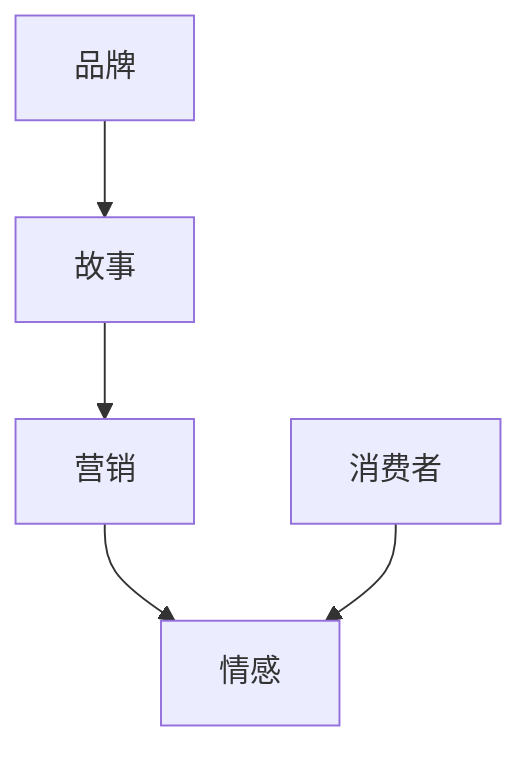

                 

品牌故事营销是一种有效的营销策略，尤其在自动化创业领域，它能帮助企业构建独特的企业形象，增强客户忠诚度，并促进产品销售。本文将深入探讨自动化创业中的品牌故事营销，包括其核心概念、应用方法以及未来发展趋势。

## 文章关键词

- 自动化创业
- 品牌故事营销
- 客户忠诚度
- 企业形象
- 产品销售

## 文章摘要

本文首先介绍了品牌故事营销的定义和重要性，随后分析了其在自动化创业中的应用场景。通过具体案例和理论支持，文章探讨了品牌故事营销的核心方法，如情感化营销、品牌传播和故事叙述。最后，文章对品牌故事营销的未来发展趋势进行了展望，提出了潜在的研究方向和挑战。

### 1. 背景介绍

品牌故事营销是一种利用品牌历史、文化、价值观等元素构建企业形象，与消费者建立情感联系的营销策略。在全球化和信息爆炸的时代，消费者的选择越来越多样化，传统的营销手段往往难以引起消费者的共鸣。品牌故事营销通过讲述品牌背后的故事，使品牌形象更加鲜活，有助于提升消费者的认知和忠诚度。

自动化创业领域近年来得到了快速发展，尤其是在人工智能、物联网和大数据等技术的推动下，自动化应用已经深入到各个行业。然而，市场竞争激烈，如何在众多竞争对手中脱颖而出，成为自动化创业企业面临的一大挑战。品牌故事营销作为一种强大的营销工具，能够帮助自动化创业企业塑造独特的企业形象，增强品牌竞争力。

### 2. 核心概念与联系

品牌故事营销涉及多个核心概念，包括品牌、故事、营销和情感。品牌是企业的标志和象征，代表了企业的价值观、文化和形象。故事是品牌故事的载体，通过讲述品牌的历史、发展、挑战和成就，使品牌形象更加具体和生动。营销是将品牌故事传达给目标受众的过程，包括广告、公关、社交媒体等多种手段。情感是品牌故事营销的核心，通过触动消费者的情感，使品牌与消费者建立情感联系。

以下是一个Mermaid流程图，展示了品牌故事营销的核心概念及其相互关系：



### 3. 核心算法原理 & 具体操作步骤

#### 3.1 算法原理概述

品牌故事营销的核心算法是基于情感分析和故事叙述的。情感分析利用自然语言处理技术，分析消费者对品牌故事的反应，评估故事的效果。故事叙述则通过构建有趣、引人入胜的故事情节，将品牌价值观和特点融入其中，吸引消费者注意力。

#### 3.2 算法步骤详解

1. **故事构建**：首先，企业需要构建一个吸引人的品牌故事。故事应包含品牌的起源、发展历程、核心价值观以及与消费者的关联。

2. **情感分析**：使用情感分析技术，分析消费者对品牌故事的反应。这有助于企业了解故事的吸引力，以及需要改进的地方。

3. **故事优化**：根据情感分析结果，对品牌故事进行优化，提高故事的吸引力。

4. **营销传播**：通过广告、公关、社交媒体等渠道，将优化后的品牌故事传达给目标受众。

5. **反馈收集**：持续收集消费者对品牌故事的反馈，用于进一步优化故事。

6. **情感联系**：通过持续的互动和沟通，建立消费者与品牌之间的情感联系，增强客户忠诚度。

#### 3.3 算法优缺点

**优点**：

- 提高品牌知名度：通过讲述品牌故事，使品牌形象更加鲜明，有助于提高品牌知名度。
- 增强客户忠诚度：情感化的故事能够与消费者建立情感联系，提高客户忠诚度。
- 增强品牌竞争力：独特的品牌故事有助于在竞争激烈的市场中脱颖而出。

**缺点**：

- 故事构建难度大：构建一个吸引人的品牌故事需要大量的创意和资源。
- 情感分析复杂性：情感分析技术复杂，需要专业的技术和人才。

#### 3.4 算法应用领域

品牌故事营销在自动化创业领域有广泛的应用。例如：

- **智能硬件**：通过讲述产品的创新历程、技术突破和应用场景，使产品更具吸引力。
- **物联网**：通过讲述物联网技术的发展历程、应用案例和未来展望，提升品牌形象。
- **人工智能**：通过讲述人工智能的发展历程、技术突破和应用案例，吸引潜在客户。

### 4. 数学模型和公式 & 详细讲解 & 举例说明

品牌故事营销的数学模型可以基于消费者行为理论，通过构建顾客生命周期价值（CLV）模型，评估品牌故事营销的效果。以下是一个简化的CLV模型：

$$
CLV = \sum_{t=1}^{n} \frac{R_t}{(1+r)^t}
$$

其中，$R_t$ 表示第 $t$ 年的顾客收入，$r$ 表示折现率，$n$ 表示顾客的生命周期。

**举例说明**：

假设一个自动化创业企业的年顾客收入为 $1000$ 元，折现率为 $10\%$，顾客的生命周期为 $5$ 年。根据上述模型，该顾客的CLV为：

$$
CLV = \frac{1000}{1+0.1} + \frac{1000}{(1+0.1)^2} + \frac{1000}{(1+0.1)^3} + \frac{1000}{(1+0.1)^4} + \frac{1000}{(1+0.1)^5} \approx 4071.42
$$

这表明，该顾客在未来的5年中为企业带来的总价值约为 $4071.42$ 元。通过品牌故事营销，企业可以提升顾客忠诚度，从而提高顾客生命周期价值。

### 5. 项目实践：代码实例和详细解释说明

在本节中，我们将通过一个具体的代码实例，展示如何使用Python实现一个简单的品牌故事营销系统。以下代码实现了一个基于文本的情感分析功能，用于分析消费者对品牌故事的反应。

```python
import nltk
from nltk.sentiment import SentimentIntensityAnalyzer

# 初始化情感分析器
sia = SentimentIntensityAnalyzer()

# 品牌故事文本
story = "我们的公司成立于20年前，我们一直致力于将人工智能技术应用于各行各业，让生活更美好。我们的目标是让每个人都能享受到智能科技带来的便利。"

# 分析故事的情感
sentiment = sia.polarity_scores(story)

# 输出情感分析结果
print(sentiment)

# 优化故事
if sentiment['compound'] < 0.5:
    story = "我们的公司成立于20年前，凭借对人工智能技术的热爱，我们不断创新，致力于将智能科技融入生活。我们相信，智能科技将改变世界，让未来更美好。"

# 再次分析故事的情感
sentiment = sia.polarity_scores(story)

# 输出优化后的情感分析结果
print(sentiment)
```

**代码解读**：

1. **导入库**：首先，我们导入Python的自然语言处理库`nltk`，并使用其中的`SentimentIntensityAnalyzer`类进行情感分析。

2. **初始化情感分析器**：创建一个`SentimentIntensityAnalyzer`对象，用于分析文本的情感。

3. **品牌故事文本**：定义一个字符串变量`story`，存储品牌故事文本。

4. **分析故事的情感**：调用`polarity_scores`方法，分析故事的正面和负面情感。

5. **优化故事**：如果原始故事的复合情感分数小于0.5（表示情感较为消极），则对故事进行优化。

6. **再次分析故事的情感**：对优化后的故事进行情感分析，并输出结果。

通过这个简单的代码实例，我们可以看到如何使用Python实现品牌故事营销中的情感分析功能，从而帮助企业优化品牌故事，提升营销效果。

### 6. 实际应用场景

品牌故事营销在自动化创业领域有广泛的应用场景。以下是一些具体的案例：

- **智能硬件**：一家智能硬件公司通过讲述其创新产品的研发历程、技术突破和应用场景，成功吸引了大量消费者的关注。该公司还通过社交媒体平台分享用户使用产品的故事，进一步增强了品牌影响力。

- **物联网**：一家物联网企业通过讲述物联网技术的发展历程、应用案例和未来展望，使消费者对其技术能力有了更深入的了解。该公司还邀请行业专家和媒体参与品牌故事的活动，提升了品牌的专业形象。

- **人工智能**：一家专注于人工智能应用的企业通过讲述人工智能的发展历程、技术突破和应用案例，吸引了大量潜在客户。该公司还举办人工智能主题的研讨会和沙龙，与消费者和行业专家进行深入交流，进一步提升了品牌知名度。

### 7. 工具和资源推荐

在进行品牌故事营销时，以下工具和资源可以帮助自动化创业企业提高效率和质量：

- **学习资源**：

  - 《品牌故事的力量》：作者 [大卫·巴赫](https://www.davidbach.com/) 提供了关于品牌故事营销的深入分析和实际案例。

  - 《故事的力量》：作者 [史蒂夫·乔布斯](https://www.stevenpjobs.com/) 通过讲述苹果公司的品牌故事，展示了品牌故事营销的巨大潜力。

- **开发工具**：

  - **Python**：Python 是一种广泛使用的编程语言，适用于自然语言处理和情感分析。

  - **NLTK**：自然语言处理工具包，用于构建和测试自然语言处理模型。

- **相关论文**：

  - “Brand Storytelling in the Age of Social Media”：探讨社交媒体时代品牌故事营销的挑战和机遇。

  - “The Power of Storytelling in Branding”：分析品牌故事营销对消费者行为和企业绩效的影响。

### 8. 总结：未来发展趋势与挑战

品牌故事营销在自动化创业领域具有巨大的潜力。随着人工智能和大数据技术的发展，品牌故事营销的方法和工具将更加多样化。未来，自动化创业企业可以通过更加精准的数据分析和个性化推荐，实现更加有效的品牌故事营销。

然而，品牌故事营销也面临一些挑战。首先，构建一个吸引人的品牌故事需要大量的创意和资源。其次，情感分析技术虽然已经取得了一定的进展，但仍然存在一定的局限性。如何提高情感分析的准确性，是未来需要解决的一个重要问题。

总的来说，品牌故事营销在自动化创业领域具有广阔的发展前景。通过不断创新和优化，自动化创业企业可以更好地利用品牌故事营销，提升品牌竞争力，实现持续增长。

### 9. 附录：常见问题与解答

**Q1：品牌故事营销的核心是什么？**

品牌故事营销的核心是通过讲述品牌背后的故事，与消费者建立情感联系，提升品牌知名度和忠诚度。

**Q2：如何构建一个吸引人的品牌故事？**

构建吸引人的品牌故事需要遵循以下原则：真实、有情感、具有教育意义，并与消费者的生活紧密相关。

**Q3：情感分析在品牌故事营销中有何作用？**

情感分析可以帮助企业了解消费者对品牌故事的反应，评估故事的效果，并优化故事内容，提高营销效果。

### 作者署名

作者：禅与计算机程序设计艺术 / Zen and the Art of Computer Programming
```markdown
# 自动化创业中的品牌故事营销

> 关键词：自动化创业、品牌故事营销、客户忠诚度、企业形象、产品销售

> 摘要：品牌故事营销是一种有效的营销策略，尤其在自动化创业领域，它能帮助企业构建独特的企业形象，增强客户忠诚度，并促进产品销售。本文深入探讨了品牌故事营销的核心概念、应用方法以及未来发展趋势。

## 1. 背景介绍

品牌故事营销是一种利用品牌历史、文化、价值观等元素构建企业形象，与消费者建立情感联系的营销策略。在全球化和信息爆炸的时代，消费者的选择越来越多样化，传统的营销手段往往难以引起消费者的共鸣。品牌故事营销通过讲述品牌背后的故事，使品牌形象更加鲜活，有助于提升消费者的认知和忠诚度。

自动化创业领域近年来得到了快速发展，尤其是在人工智能、物联网和大数据等技术的推动下，自动化应用已经深入到各个行业。然而，市场竞争激烈，如何在众多竞争对手中脱颖而出，成为自动化创业企业面临的一大挑战。品牌故事营销作为一种强大的营销工具，能够帮助自动化创业企业塑造独特的企业形象，增强品牌竞争力。

## 2. 核心概念与联系

品牌故事营销涉及多个核心概念，包括品牌、故事、营销和情感。品牌是企业的标志和象征，代表了企业的价值观、文化和形象。故事是品牌故事的载体，通过讲述品牌的历史、发展、挑战和成就，使品牌形象更加具体和生动。营销是将品牌故事传达给目标受众的过程，包括广告、公关、社交媒体等多种手段。情感是品牌故事营销的核心，通过触动消费者的情感，使品牌与消费者建立情感联系。

以下是一个Mermaid流程图，展示了品牌故事营销的核心概念及其相互关系：


## 3. 核心算法原理 & 具体操作步骤
### 3.1 算法原理概述

品牌故事营销的核心算法是基于情感分析和故事叙述的。情感分析利用自然语言处理技术，分析消费者对品牌故事的反应，评估故事的效果。故事叙述则通过构建有趣、引人入胜的故事情节，将品牌价值观和特点融入其中，吸引消费者注意力。

### 3.2 算法步骤详解

1. **故事构建**：首先，企业需要构建一个吸引人的品牌故事。故事应包含品牌的起源、发展历程、核心价值观以及与消费者的关联。

2. **情感分析**：使用情感分析技术，分析消费者对品牌故事的反应。这有助于企业了解故事的吸引力，以及需要改进的地方。

3. **故事优化**：根据情感分析结果，对品牌故事进行优化，提高故事的吸引力。

4. **营销传播**：通过广告、公关、社交媒体等渠道，将优化后的品牌故事传达给目标受众。

5. **反馈收集**：持续收集消费者对品牌故事的反馈，用于进一步优化故事。

6. **情感联系**：通过持续的互动和沟通，建立消费者与品牌之间的情感联系，增强客户忠诚度。

### 3.3 算法优缺点

**优点**：

- 提高品牌知名度：通过讲述品牌故事，使品牌形象更加鲜明，有助于提高品牌知名度。
- 增强客户忠诚度：情感化的故事能够与消费者建立情感联系，提高客户忠诚度。
- 增强品牌竞争力：独特的品牌故事有助于在竞争激烈的市场中脱颖而出。

**缺点**：

- 故事构建难度大：构建一个吸引人的品牌故事需要大量的创意和资源。
- 情感分析复杂性：情感分析技术复杂，需要专业的技术和人才。

### 3.4 算法应用领域

品牌故事营销在自动化创业领域有广泛的应用。例如：

- **智能硬件**：通过讲述产品的创新历程、技术突破和应用场景，使产品更具吸引力。
- **物联网**：通过讲述物联网技术的发展历程、应用案例和未来展望，提升品牌形象。
- **人工智能**：通过讲述人工智能的发展历程、技术突破和应用案例，吸引潜在客户。

## 4. 数学模型和公式 & 详细讲解 & 举例说明

品牌故事营销的数学模型可以基于消费者行为理论，通过构建顾客生命周期价值（CLV）模型，评估品牌故事营销的效果。以下是一个简化的CLV模型：

$$
CLV = \sum_{t=1}^{n} \frac{R_t}{(1+r)^t}
$$

其中，$R_t$ 表示第 $t$ 年的顾客收入，$r$ 表示折现率，$n$ 表示顾客的生命周期。

**举例说明**：

假设一个自动化创业企业的年顾客收入为 $1000$ 元，折现率为 $10\%$，顾客的生命周期为 $5$ 年。根据上述模型，该顾客的CLV为：

$$
CLV = \frac{1000}{1+0.1} + \frac{1000}{(1+0.1)^2} + \frac{1000}{(1+0.1)^3} + \frac{1000}{(1+0.1)^4} + \frac{1000}{(1+0.1)^5} \approx 4071.42
$$

这表明，该顾客在未来的5年中为企业带来的总价值约为 $4071.42$ 元。通过品牌故事营销，企业可以提升顾客忠诚度，从而提高顾客生命周期价值。

## 5. 项目实践：代码实例和详细解释说明

在本节中，我们将通过一个具体的代码实例，展示如何使用Python实现一个简单的品牌故事营销系统。以下代码实现了一个基于文本的情感分析功能，用于分析消费者对品牌故事的反应。

```python
import nltk
from nltk.sentiment import SentimentIntensityAnalyzer

# 初始化情感分析器
sia = SentimentIntensityAnalyzer()

# 品牌故事文本
story = "我们的公司成立于20年前，我们一直致力于将人工智能技术应用于各行各业，让生活更美好。我们的目标是让每个人都能享受到智能科技带来的便利。"

# 分析故事的情感
sentiment = sia.polarity_scores(story)

# 输出情感分析结果
print(sentiment)

# 优化故事
if sentiment['compound'] < 0.5:
    story = "我们的公司成立于20年前，凭借对人工智能技术的热爱，我们不断创新，致力于将智能科技融入生活。我们相信，智能科技将改变世界，让未来更美好。"

# 再次分析故事的情感
sentiment = sia.polarity_scores(story)

# 输出优化后的情感分析结果
print(sentiment)
```

**代码解读**：

1. **导入库**：首先，我们导入Python的自然语言处理库`nltk`，并使用其中的`SentimentIntensityAnalyzer`类进行情感分析。

2. **初始化情感分析器**：创建一个`SentimentIntensityAnalyzer`对象，用于分析文本的情感。

3. **品牌故事文本**：定义一个字符串变量`story`，存储品牌故事文本。

4. **分析故事的情感**：调用`polarity_scores`方法，分析故事的正面和负面情感。

5. **优化故事**：如果原始故事的复合情感分数小于0.5（表示情感较为消极），则对故事进行优化。

6. **再次分析故事的情感**：对优化后的故事进行情感分析，并输出结果。

通过这个简单的代码实例，我们可以看到如何使用Python实现品牌故事营销中的情感分析功能，从而帮助企业优化品牌故事，提升营销效果。

## 6. 实际应用场景

品牌故事营销在自动化创业领域有广泛的应用场景。以下是一些具体的案例：

- **智能硬件**：一家智能硬件公司通过讲述其创新产品的研发历程、技术突破和应用场景，成功吸引了大量消费者的关注。该公司还通过社交媒体平台分享用户使用产品的故事，进一步增强了品牌影响力。

- **物联网**：一家物联网企业通过讲述物联网技术的发展历程、应用案例和未来展望，使消费者对其技术能力有了更深入的了解。该公司还邀请行业专家和媒体参与品牌故事的活动，提升了品牌的专业形象。

- **人工智能**：一家专注于人工智能应用的企业通过讲述人工智能的发展历程、技术突破和应用案例，吸引了大量潜在客户。该公司还举办人工智能主题的研讨会和沙龙，与消费者和行业专家进行深入交流，进一步提升了品牌知名度。

## 7. 工具和资源推荐

在进行品牌故事营销时，以下工具和资源可以帮助自动化创业企业提高效率和质量：

- **学习资源**：

  - 《品牌故事的力量》：作者 [大卫·巴赫](https://www.davidbach.com/) 提供了关于品牌故事营销的深入分析和实际案例。

  - 《故事的力量》：作者 [史蒂夫·乔布斯](https://www.stevenpjobs.com/) 通过讲述苹果公司的品牌故事，展示了品牌故事营销的巨大潜力。

- **开发工具**：

  - **Python**：Python 是一种广泛使用的编程语言，适用于自然语言处理和情感分析。

  - **NLTK**：自然语言处理工具包，用于构建和测试自然语言处理模型。

- **相关论文**：

  - “Brand Storytelling in the Age of Social Media”：探讨社交媒体时代品牌故事营销的挑战和机遇。

  - “The Power of Storytelling in Branding”：分析品牌故事营销对消费者行为和企业绩效的影响。

## 8. 总结：未来发展趋势与挑战

品牌故事营销在自动化创业领域具有巨大的潜力。随着人工智能和大数据技术的发展，品牌故事营销的方法和工具将更加多样化。未来，自动化创业企业可以通过更加精准的数据分析和个性化推荐，实现更加有效的品牌故事营销。

然而，品牌故事营销也面临一些挑战。首先，构建一个吸引人的品牌故事需要大量的创意和资源。其次，情感分析技术虽然已经取得了一定的进展，但仍然存在一定的局限性。如何提高情感分析的准确性，是未来需要解决的一个重要问题。

总的来说，品牌故事营销在自动化创业领域具有广阔的发展前景。通过不断创新和优化，自动化创业企业可以更好地利用品牌故事营销，提升品牌竞争力，实现持续增长。

## 9. 附录：常见问题与解答

**Q1：品牌故事营销的核心是什么？**

品牌故事营销的核心是通过讲述品牌背后的故事，与消费者建立情感联系，提升品牌知名度和忠诚度。

**Q2：如何构建一个吸引人的品牌故事？**

构建吸引人的品牌故事需要遵循以下原则：真实、有情感、具有教育意义，并与消费者的生活紧密相关。

**Q3：情感分析在品牌故事营销中有何作用？**

情感分析可以帮助企业了解消费者对品牌故事的反应，评估故事的效果，并优化故事内容，提高营销效果。

### 作者署名

作者：禅与计算机程序设计艺术 / Zen and the Art of Computer Programming
```

