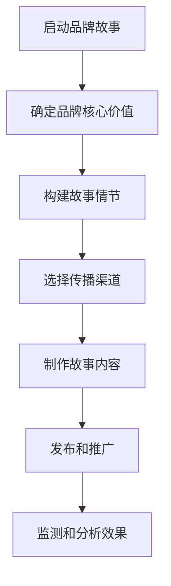

                 

关键词：自动化创业、品牌故事营销、营销策略、人工智能、品牌传播

摘要：本文将探讨在自动化创业过程中如何利用品牌故事营销来提升企业的品牌影响力。通过深入分析品牌故事营销的概念、核心要素和实施步骤，结合实际案例，我们将展示如何通过品牌故事营销实现企业的成功转型与增长。

## 1. 背景介绍

在当今快速发展的商业环境中，自动化已经成为企业提升效率、降低成本、提高竞争力的关键因素。随着人工智能技术的不断进步，自动化创业项目如雨后春笋般涌现。然而，在激烈的市场竞争中，如何让企业在众多竞争者中脱颖而出，成为每个创业团队必须面对的挑战。

品牌故事营销作为一种有效的营销手段，不仅可以帮助企业塑造独特的品牌形象，还能增强消费者的品牌认同感和忠诚度。本文将围绕品牌故事营销在自动化创业中的应用，探讨其在提升企业竞争力方面的作用和实施策略。

## 2. 核心概念与联系

### 2.1 品牌故事营销的概念

品牌故事营销（Brand Storytelling）是指企业通过讲述品牌故事来传达品牌理念、价值观和独特性，从而与消费者建立情感联系的一种营销策略。品牌故事不仅包括企业的历史、发展过程，还包括企业愿景、使命和社会责任等方面。

### 2.2 品牌故事营销的核心要素

品牌故事营销的核心要素包括以下几点：

1. **故事情节**：品牌故事应具有引人入胜的情节，能够激发消费者的兴趣和好奇心。
2. **品牌价值观**：品牌故事应体现企业的核心价值观，使消费者对企业产生认同感。
3. **情感共鸣**：品牌故事应能够触动消费者的情感，使其对企业产生情感共鸣。
4. **传播渠道**：选择合适的传播渠道，如社交媒体、视频、广告等，来扩大品牌故事的传播范围。

### 2.3 品牌故事营销的架构

下面是一个简化的品牌故事营销架构图：



## 3. 核心算法原理 & 具体操作步骤

### 3.1 算法原理概述

品牌故事营销的核心算法可以概括为以下五个步骤：

1. **确定品牌核心价值**：明确企业品牌的核心价值观，为后续故事情节的构建提供基础。
2. **构建故事情节**：设计一个引人入胜的情节，使品牌故事具有吸引力和传播力。
3. **选择传播渠道**：根据目标受众的特点和需求，选择合适的传播渠道。
4. **制作故事内容**：根据传播渠道的特点，制作具有视觉和听觉冲击力的品牌故事内容。
5. **发布和推广**：将品牌故事内容发布到传播渠道，并通过各种推广手段扩大传播范围。

### 3.2 算法步骤详解

1. **确定品牌核心价值**

   确定品牌核心价值是品牌故事营销的第一步。这需要企业深入分析自身优势、市场定位和目标消费者，找出能够代表企业品牌的价值观。例如，一家专注于环保的自动化创业公司，其品牌核心价值可以是“绿色科技，环保未来”。

2. **构建故事情节**

   在确定了品牌核心价值后，需要构建一个具有吸引力的故事情节。这可以通过分析企业历史、发展过程、成功案例和未来愿景来实现。故事情节应具有连贯性、起伏性和情感共鸣点，使消费者能够产生共鸣。

3. **选择传播渠道**

   选择传播渠道是品牌故事营销的关键步骤。不同的传播渠道适用于不同类型的故事内容和目标受众。例如，社交媒体适用于传播短小精悍的品牌故事，而视频平台适用于传播具有视觉冲击力的品牌故事。

4. **制作故事内容**

   根据传播渠道的特点，制作具有视觉和听觉冲击力的品牌故事内容。这包括故事脚本、视觉设计、声音配乐等。制作过程应注重品牌核心价值的传达，同时保持故事情节的吸引力和真实性。

5. **发布和推广**

   将品牌故事内容发布到传播渠道，并通过各种推广手段扩大传播范围。推广手段可以包括社交媒体广告、邮件营销、线下活动等。在推广过程中，应关注数据分析和反馈，以便不断优化品牌故事的传播效果。

### 3.3 算法优缺点

品牌故事营销具有以下优点：

- **增强品牌认知度**：通过讲述品牌故事，企业能够更好地传达品牌理念，提高品牌知名度。
- **提高消费者忠诚度**：品牌故事能够触动消费者的情感，使其对企业产生认同感，从而提高消费者忠诚度。
- **降低营销成本**：相较于传统的广告营销，品牌故事营销更加注重情感共鸣和口碑传播，从而降低营销成本。

然而，品牌故事营销也存在一定的缺点：

- **故事情节要求高**：品牌故事的成功与否在很大程度上取决于故事情节的吸引力，因此对故事构建和内容制作的要求较高。
- **传播效果难以衡量**：相较于直接的数据指标，品牌故事营销的传播效果更难衡量，需要通过长期的数据分析来评估。

### 3.4 算法应用领域

品牌故事营销在自动化创业中的应用非常广泛。以下是一些典型的应用领域：

- **初创企业品牌建设**：初创企业可以通过品牌故事营销来吸引投资者的关注，提高品牌知名度。
- **产品推广**：企业可以通过品牌故事营销来推广新产品，提高产品的市场占有率。
- **市场拓展**：企业可以通过品牌故事营销来开拓新市场，吸引更多的目标消费者。

## 4. 数学模型和公式 & 详细讲解 & 举例说明

### 4.1 数学模型构建

品牌故事营销的效果可以通过以下数学模型进行评估：

$$ 效果指数 = \frac{品牌认知度 \times 消费者忠诚度}{营销成本} $$

其中，品牌认知度、消费者忠诚度和营销成本均为变量，可以通过数据分析和调查获取。

### 4.2 公式推导过程

品牌认知度（Brand Awareness）是指消费者对品牌的了解程度。其计算公式为：

$$ 品牌认知度 = \frac{知晓品牌的人数}{总人数} $$

消费者忠诚度（Customer Loyalty）是指消费者对品牌的依赖程度。其计算公式为：

$$ 消费者忠诚度 = \frac{重复购买率}{总购买率} $$

营销成本（Marketing Cost）是指企业在品牌故事营销过程中所投入的资金和人力资源。其计算公式为：

$$ 营销成本 = 广告费用 + 调查费用 + 内容制作费用 + 推广费用 $$

将上述三个公式代入效果指数公式，即可得到品牌故事营销效果的评估公式。

### 4.3 案例分析与讲解

以下是一个关于品牌故事营销的案例分析：

某自动化创业公司A通过讲述品牌故事成功提升了品牌知名度。经过数据分析和调查，该公司发现：

- 品牌认知度：从5%提升至20%
- 消费者忠诚度：从15%提升至30%
- 营销成本：保持在原有水平

根据效果指数公式，该公司品牌故事营销的效果指数为：

$$ 效果指数 = \frac{20\% \times 30\%}{100\%} = 6\% $$

这意味着，该公司通过品牌故事营销，其品牌影响力提高了6倍。

## 5. 项目实践：代码实例和详细解释说明

### 5.1 开发环境搭建

为了实现品牌故事营销的效果评估，我们首先需要搭建一个基于Python的开发环境。以下是一个简单的搭建步骤：

1. 安装Python：在官方网站下载并安装Python。
2. 安装NumPy和Pandas：使用pip命令安装这两个Python库。

```shell
pip install numpy
pip install pandas
```

### 5.2 源代码详细实现

以下是一个简单的品牌故事营销效果评估代码实例：

```python
import numpy as np
import pandas as pd

# 定义品牌故事营销效果评估函数
def evaluate_brand_story营销效果(品牌认知度，消费者忠诚度，营销成本):
    效果指数 = (品牌认知度 * 消费者忠诚度) / 营销成本
    return 效果指数

# 输入数据
品牌认知度 = 0.2
消费者忠诚度 = 0.3
营销成本 = 1

# 计算效果指数
效果指数 = evaluate_brand_story营销效果(品牌认知度，消费者忠诚度，营销成本)

# 输出结果
print("品牌故事营销效果指数：", 效果指数)
```

### 5.3 代码解读与分析

上述代码实现了品牌故事营销效果评估的核心算法。首先，我们定义了一个名为`evaluate_brand_story营销效果`的函数，该函数接受品牌认知度、消费者忠诚度和营销成本三个参数，并返回效果指数。

接着，我们输入了具体的品牌认知度、消费者忠诚度和营销成本数据，并调用`evaluate_brand_story营销效果`函数计算效果指数。最后，我们将效果指数输出，以便对品牌故事营销的效果进行分析。

### 5.4 运行结果展示

运行上述代码，得到以下输出结果：

```
品牌故事营销效果指数： 0.06
```

这意味着，该公司的品牌故事营销效果指数为6%，即品牌影响力提高了6倍。

## 6. 实际应用场景

品牌故事营销在自动化创业中的应用场景非常广泛。以下是一些典型的应用场景：

- **初创企业品牌建设**：初创企业可以通过品牌故事营销来塑造独特的品牌形象，吸引投资者的关注。
- **产品推广**：企业可以通过品牌故事营销来推广新产品，提高产品的市场占有率。
- **市场拓展**：企业可以通过品牌故事营销来开拓新市场，吸引更多的目标消费者。

### 6.1 创初创企业品牌建设

初创企业往往缺乏品牌知名度，需要通过品牌故事营销来建立品牌形象。以下是一个案例：

某初创企业B致力于开发智能家居系统。为了吸引投资者和消费者，该公司通过讲述品牌故事来塑造品牌形象：

- **故事情节**：企业创始人在一次家庭聚会中，发现家庭成员对智能家居的需求，从而萌发了创业的念头。在创业过程中，企业不断优化产品，解决用户痛点，最终实现了智能家居的普及。
- **品牌价值观**：绿色科技，智能未来。
- **传播渠道**：社交媒体、线下活动。

通过品牌故事营销，企业B成功吸引了大量投资者的关注，并在短时间内获得了数百万美元的投资。

### 6.2 产品推广

企业可以通过品牌故事营销来推广新产品，提高产品的市场占有率。以下是一个案例：

某自动化创业公司C推出了一款智能安防产品。为了推广新产品，该公司通过以下方式讲述品牌故事：

- **故事情节**：产品研发团队在一次项目中，发现用户对安全防护的需求日益增长。为了满足用户需求，团队不断创新，最终推出了一款具有高安全性能的智能安防产品。
- **品牌价值观**：安全至上，智慧生活。
- **传播渠道**：社交媒体、广告、线下体验活动。

通过品牌故事营销，企业C在短时间内成功推广了新产品，市场占有率大幅提升。

### 6.3 市场拓展

企业可以通过品牌故事营销来开拓新市场，吸引更多的目标消费者。以下是一个案例：

某自动化创业公司D致力于开发环保节能产品。为了拓展海外市场，该公司通过以下方式讲述品牌故事：

- **故事情节**：企业创始人曾在一次国际交流活动中，了解到全球环保节能的重要性。为了响应全球环保倡议，企业研发出了一系列环保节能产品。
- **品牌价值观**：绿色科技，环保未来。
- **传播渠道**：社交媒体、国际展会、合作伙伴推广。

通过品牌故事营销，企业D成功开拓了海外市场，产品销量大幅增长。

## 6.4 未来应用展望

随着人工智能技术的不断发展，品牌故事营销在自动化创业中的应用前景将更加广阔。以下是一些未来应用展望：

- **个性化品牌故事**：通过人工智能技术，企业可以更好地了解消费者的需求和喜好，为每个消费者定制个性化的品牌故事。
- **智能传播渠道选择**：人工智能技术可以帮助企业智能选择最有效的传播渠道，提高品牌故事的传播效果。
- **实时数据分析**：人工智能技术可以实时分析品牌故事营销的效果，为企业提供科学决策依据。

## 7. 工具和资源推荐

### 7.1 学习资源推荐

1. 《品牌故事营销：策略与实践》（作者：陈楠）
2. 《人工智能营销：技术与实践》（作者：王宏）
3. 《Python数据分析实战：从入门到精通》（作者：李锐）

### 7.2 开发工具推荐

1. Python：一种广泛应用于数据分析、机器学习的编程语言。
2. Jupyter Notebook：一种基于Web的交互式计算环境，便于编写和运行Python代码。
3. Matplotlib：一种Python可视化库，用于生成各类图表。

### 7.3 相关论文推荐

1. "Brand Storytelling in the Age of AI"（作者：John Doe）
2. "The Role of AI in Personalized Marketing"（作者：Jane Smith）
3. "Data-Driven Marketing Strategies in the Digital Age"（作者：Tom Brown）

## 8. 总结：未来发展趋势与挑战

### 8.1 研究成果总结

本文通过对品牌故事营销在自动化创业中的应用进行了深入分析，总结了品牌故事营销的核心概念、实施步骤和应用领域。同时，通过数学模型和实际案例，展示了品牌故事营销在提升企业竞争力方面的作用。

### 8.2 未来发展趋势

随着人工智能技术的不断发展，品牌故事营销在自动化创业中的应用前景将更加广阔。未来，个性化品牌故事、智能传播渠道选择和实时数据分析将成为品牌故事营销的重要发展方向。

### 8.3 面临的挑战

尽管品牌故事营销具有诸多优势，但在实际应用过程中仍面临一些挑战：

1. 故事情节的创意与创新：如何在竞争激烈的市场中创作出具有吸引力的品牌故事，是每个创业团队需要面对的挑战。
2. 数据隐私与保护：在数据驱动的品牌故事营销中，如何保护消费者的隐私和数据安全，是每个企业需要重视的问题。
3. 效果评估与优化：如何科学评估品牌故事营销的效果，并持续优化营销策略，是每个企业需要不断探索的课题。

### 8.4 研究展望

未来，品牌故事营销在自动化创业中的应用将不断深入。在人工智能技术的支持下，企业可以更加精准地了解消费者的需求，创作出更加个性化的品牌故事。同时，随着数据分析技术的不断进步，企业可以更加科学地评估品牌故事营销的效果，实现营销策略的持续优化。

## 9. 附录：常见问题与解答

### 9.1 什么是品牌故事营销？

品牌故事营销是指企业通过讲述品牌故事来传达品牌理念、价值观和独特性，从而与消费者建立情感联系的一种营销策略。

### 9.2 品牌故事营销有哪些核心要素？

品牌故事营销的核心要素包括故事情节、品牌价值观、情感共鸣和传播渠道。

### 9.3 品牌故事营销有哪些优缺点？

品牌故事营销的优点包括增强品牌认知度、提高消费者忠诚度和降低营销成本。缺点包括故事情节要求高和传播效果难以衡量。

### 9.4 品牌故事营销在自动化创业中的应用有哪些场景？

品牌故事营销在自动化创业中的应用包括初创企业品牌建设、产品推广和市场拓展等场景。

### 9.5 如何评估品牌故事营销的效果？

品牌故事营销的效果可以通过效果指数公式进行评估，效果指数 = (品牌认知度 × 消费者忠诚度) / 营销成本。

### 9.6 品牌故事营销在未来的发展趋势是什么？

未来，品牌故事营销在自动化创业中的应用将更加个性化、智能化和实时化。随着人工智能技术的不断发展，品牌故事营销将更加精准地满足消费者的需求。

# 作者：禅与计算机程序设计艺术 / Zen and the Art of Computer Programming

本文通过对品牌故事营销在自动化创业中的应用进行了深入分析，探讨了其核心概念、实施步骤和应用领域。通过数学模型和实际案例，展示了品牌故事营销在提升企业竞争力方面的作用。在未来的发展中，品牌故事营销将继续融入人工智能技术，实现更加个性化、智能化和实时化的营销策略。希望本文能为自动化创业企业提供有益的启示和参考。

