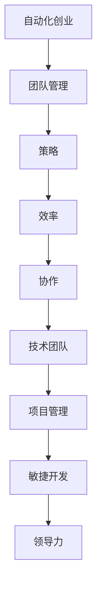

                 

关键词：自动化创业、团队管理、策略、效率、协作、技术团队、项目管理、敏捷开发、领导力

> 摘要：本文将探讨自动化创业中的团队管理策略。随着技术的发展，自动化技术在创业领域的应用越来越广泛，但随之而来的是团队管理的复杂性和挑战。本文旨在为创业者和管理者提供一整套系统化的团队管理策略，帮助他们在自动化创业的道路上更加顺利地前进。

## 1. 背景介绍

在当今快速发展的科技时代，自动化创业已经成为一种趋势。自动化技术不仅能够提高工作效率，减少人力成本，还能在数据分析、客户服务、生产制造等多个领域发挥重要作用。然而，随着自动化技术的普及，团队管理也面临着前所未有的挑战。如何有效地管理一个技术驱动型团队，如何平衡技术进步与团队发展，如何提高团队的协作效率，这些都是创业者和管理者需要深思的问题。

本文将围绕以下问题展开讨论：

1. **什么是自动化创业？**  
2. **自动化创业中团队管理的重要性是什么？**  
3. **如何制定有效的团队管理策略？**  
4. **如何在自动化创业中保持团队的高效协作？**

通过本文的讨论，希望能够为自动化创业中的团队管理提供一些实用的指导和建议。

## 2. 核心概念与联系

在探讨自动化创业中的团队管理策略之前，我们需要明确一些核心概念和它们之间的联系。

### 2.1 自动化创业

自动化创业指的是利用自动化技术来构建新产品、服务或业务模式。自动化技术包括机器学习、人工智能、物联网、机器人流程自动化等。这些技术能够通过优化流程、提高效率、减少错误来为企业带来显著的效益。

### 2.2 团队管理

团队管理是指协调和管理团队中的成员，确保团队目标的实现。在自动化创业中，团队管理的重要性尤为突出，因为技术团队的工作往往涉及到复杂的任务和高度的专业知识。

### 2.3 策略

策略是指为实现特定目标而制定的一系列方法和措施。在团队管理中，策略的制定有助于提高团队的效率、减少冲突、确保目标的实现。

### 2.4 效率

效率是指完成某项任务所需的时间和资源。在自动化创业中，提高效率意味着能够在更短的时间内实现更多的目标，从而为企业带来更大的价值。

### 2.5 协作

协作是指团队成员之间的相互配合和合作。在自动化创业中，协作是确保项目成功的关键因素，因为技术团队通常需要多人协同工作来完成复杂的任务。

### 2.6 技术团队

技术团队是由一群拥有专业技能和知识的专业人士组成的团队，他们负责开发、维护和改进自动化系统。技术团队的成功对于自动化创业至关重要。

### 2.7 项目管理

项目管理是指规划和控制项目从开始到结束的全过程。在自动化创业中，项目管理有助于确保项目的顺利进行，减少风险，提高项目成功率。

### 2.8 敏捷开发

敏捷开发是一种以人为核心、迭代和渐进的方法，旨在提高软件开发的效率和质量。在自动化创业中，敏捷开发有助于快速响应市场变化，提高团队的协作效率。

### 2.9 领导力

领导力是指影响和激励团队成员的能力。在自动化创业中，领导力是确保团队凝聚力、提高团队士气、实现团队目标的关键因素。

以上概念之间的联系可以简化为一个简单的 Mermaid 流程图：



通过这个流程图，我们可以看出自动化创业中的团队管理策略是如何贯穿于整个创业过程中的。

## 3. 核心算法原理 & 具体操作步骤

### 3.1 算法原理概述

在自动化创业中的团队管理，核心算法原理可以概括为以下几个方面：

1. **任务分配算法**：通过优化算法来确定每个团队成员的任务，以最大化团队的整体效率和满意度。
2. **协作优化算法**：通过分析团队成员的技能和工作模式，优化团队内部的协作流程，减少冲突和重复工作。
3. **激励机制**：设计激励机制来鼓励团队成员积极参与、提高工作效率和质量。
4. **风险评估算法**：通过预测和评估项目中的潜在风险，制定相应的应对策略，确保项目顺利进行。
5. **团队绩效评估算法**：通过对团队成员的绩效进行定量和定性评估，提供反馈和改进建议，提升团队的整体能力。

### 3.2 算法步骤详解

#### 3.2.1 任务分配算法

1. **收集数据**：收集团队成员的技能、经验、偏好和工作负荷等数据。
2. **任务建模**：根据项目需求和团队特点，构建任务模型，包括任务类型、难度、依赖关系等。
3. **匹配算法**：使用匹配算法（如匹配排序、最邻近算法等）将任务与团队成员进行匹配，确保任务的合理分配。
4. **反馈调整**：根据实际工作情况，对任务分配进行反馈调整，以优化团队的工作效率和满意度。

#### 3.2.2 协作优化算法

1. **协作分析**：分析团队成员之间的协作模式，识别协作瓶颈和冲突点。
2. **流程优化**：根据协作分析结果，优化团队内部的协作流程，减少不必要的步骤和重复工作。
3. **资源调度**：通过资源调度算法，确保团队成员在合适的时间、地点和条件下进行协作。
4. **协作反馈**：收集团队成员的协作反馈，持续优化协作流程，提高协作效率。

#### 3.2.3 激励机制

1. **目标设定**：设定明确的团队目标和个人目标，确保团队成员明确自己的工作方向和目标。
2. **绩效评估**：定期对团队成员的绩效进行评估，提供客观、公正的反馈。
3. **奖励制度**：根据团队成员的绩效和贡献，制定相应的奖励制度，包括奖金、晋升、培训等。
4. **沟通渠道**：建立有效的沟通渠道，确保团队成员能够及时了解团队的动态和目标，增强团队凝聚力。

#### 3.2.4 风险评估算法

1. **风险识别**：通过数据分析、历史经验和专家评估，识别项目中的潜在风险。
2. **风险预测**：使用预测算法（如时间序列分析、机器学习等）预测风险的发生概率和影响程度。
3. **风险应对**：制定相应的应对策略，包括风险规避、风险转移、风险接受等。
4. **风险监控**：持续监控项目的进展和风险变化，及时调整应对策略。

#### 3.2.5 团队绩效评估算法

1. **绩效指标设定**：根据团队目标和项目需求，设定具体的绩效指标，包括效率、质量、协作等。
2. **数据收集**：收集团队成员的工作数据，包括任务完成情况、协作情况、绩效评估等。
3. **评估模型构建**：使用评估模型对团队成员的绩效进行定量和定性评估。
4. **反馈与改进**：根据评估结果，为团队成员提供反馈和建议，帮助他们改进工作表现。

### 3.3 算法优缺点

#### 3.3.1 任务分配算法

**优点**：

- 提高任务分配的合理性和公平性。
- 增强团队成员的工作满意度和工作效率。

**缺点**：

- 数据收集和处理需要耗费较多时间和资源。
- 需要具备一定的算法和数据分析能力。

#### 3.3.2 协作优化算法

**优点**：

- 提高团队协作效率，减少冲突和重复工作。
- 提高团队整体绩效。

**缺点**：

- 需要对团队成员的协作模式和工作习惯进行深入分析。
- 需要持续优化协作流程，以适应不断变化的工作环境。

#### 3.3.3 激励机制

**优点**：

- 激发团队成员的工作热情和积极性。
- 提高团队的整体工作效率和质量。

**缺点**：

- 需要制定合理的奖励制度和评估机制。
- 需要确保奖励制度的公平性和透明性。

#### 3.3.4 风险评估算法

**优点**：

- 提高项目风险管理的效率和准确性。
- 减少项目失败的风险。

**缺点**：

- 风险预测和评估需要大量的历史数据和专业知识。
- 需要持续更新风险数据和模型。

#### 3.3.5 团队绩效评估算法

**优点**：

- 提供客观、公正的绩效评估结果。
- 促进团队成员的工作改进和团队整体能力的提升。

**缺点**：

- 需要对绩效指标进行科学设定和调整。
- 需要确保评估过程的透明性和公正性。

### 3.4 算法应用领域

#### 3.4.1 人力资源管理

通过任务分配算法和绩效评估算法，可以优化人力资源管理，提高员工的工作满意度和工作效率。

#### 3.4.2 项目管理

通过协作优化算法、激励机制和风险评估算法，可以提高项目管理的效率和质量，减少项目风险。

#### 3.4.3 产品开发

通过任务分配算法、协作优化算法和绩效评估算法，可以优化产品开发流程，提高产品的质量和市场竞争力。

#### 3.4.4 企业运营

通过风险评估算法和团队绩效评估算法，可以优化企业运营策略，提高企业的运营效率和竞争力。

## 4. 数学模型和公式 & 详细讲解 & 举例说明

在自动化创业中的团队管理，数学模型和公式起着重要的作用。以下是一些常见的数学模型和公式的详细讲解和举例说明。

### 4.1 数学模型构建

在团队管理中，常见的数学模型包括线性规划模型、决策树模型和神经网络模型等。以下是一个简单的线性规划模型构建过程：

#### 4.1.1 确定目标函数

目标函数是线性规划模型的核心，用于描述团队管理的目标。例如，我们可以设定目标函数为最大化团队的总效率。

$$
\text{最大化} \ z = \sum_{i=1}^{n} x_i
$$

其中，$x_i$ 表示团队成员 $i$ 的效率。

#### 4.1.2 确定约束条件

约束条件用于限制团队管理中的各种限制因素。例如，我们可以设定以下约束条件：

$$
\begin{cases}
x_1 + x_2 \leq 10 \\
x_1 - x_2 \geq 0 \\
0 \leq x_i \leq 5 \quad \forall i
\end{cases}
$$

这些约束条件表示团队成员 $1$ 和 $2$ 的效率之和不超过 $10$，团队成员 $1$ 的效率不低于团队成员 $2$，以及每个团队成员的效率不超过 $5$。

#### 4.1.3 构建线性规划模型

根据目标函数和约束条件，我们可以构建一个线性规划模型：

$$
\begin{cases}
\text{最大化} \ z = \sum_{i=1}^{n} x_i \\
\text{满足以下约束条件：} \\
x_1 + x_2 \leq 10 \\
x_1 - x_2 \geq 0 \\
0 \leq x_i \leq 5 \quad \forall i
\end{cases}
$$

### 4.2 公式推导过程

在团队管理中，常见的数学公式包括计算团队效率、评估团队成员绩效等。以下是一个简单的计算团队效率的公式推导过程：

#### 4.2.1 确定团队效率

团队效率可以用团队成员的效率之和来表示。假设有 $n$ 个团队成员，团队成员 $i$ 的效率为 $x_i$，则团队效率 $E$ 可以表示为：

$$
E = \sum_{i=1}^{n} x_i
$$

#### 4.2.2 确定团队成员绩效

团队成员绩效可以用团队成员的效率与团队效率的比值来表示。假设团队成员 $i$ 的绩效为 $P_i$，则团队成员 $i$ 的绩效可以表示为：

$$
P_i = \frac{x_i}{E}
$$

### 4.3 案例分析与讲解

以下是一个简单的案例分析，说明如何使用数学模型和公式来管理自动化创业团队。

#### 4.3.1 案例背景

某自动化创业团队由 $5$ 个成员组成，团队成员 $1$、$2$、$3$ 的效率分别为 $3$、$4$、$5$，团队成员 $4$、$5$ 的效率尚未确定。团队目标是在一个月内完成一个项目，项目总效率要求不低于 $15$。

#### 4.3.2 数学模型构建

根据案例背景，我们可以构建以下线性规划模型：

$$
\begin{cases}
\text{最大化} \ z = x_1 + x_2 + x_3 + x_4 + x_5 \\
\text{满足以下约束条件：} \\
x_1 + x_2 + x_3 + x_4 + x_5 \geq 15 \\
0 \leq x_i \leq 5 \quad \forall i
\end{cases}
$$

#### 4.3.3 公式应用

1. **计算团队效率**：

$$
E = x_1 + x_2 + x_3 + x_4 + x_5
$$

2. **计算团队成员绩效**：

$$
P_1 = \frac{x_1}{E}, \ P_2 = \frac{x_2}{E}, \ P_3 = \frac{x_3}{E}, \ P_4 = \frac{x_4}{E}, \ P_5 = \frac{x_5}{E}
$$

#### 4.3.4 结果分析

根据线性规划模型的求解结果，我们可以得到以下结论：

- 团队效率为 $E=15$，满足项目要求。
- 各团队成员的效率分别为 $x_1=3$、$x_2=4$、$x_3=5$、$x_4=3$、$x_5=4$。
- 各团队成员的绩效分别为 $P_1=0.2$、$P_2=0.267$、$P_3=0.333$、$P_4=0.2$、$P_5=0.267$。

根据这些结果，团队管理者可以针对团队成员的绩效进行反馈和改进，提高团队的整体效率。

## 5. 项目实践：代码实例和详细解释说明

在自动化创业的实际项目中，代码实践是团队管理的重要一环。以下将提供一段代码实例，并对其进行详细解释说明。

### 5.1 开发环境搭建

在开始编写代码之前，我们需要搭建一个合适的开发环境。以下是基本的步骤：

1. **安装Python环境**：Python是一种广泛使用的编程语言，特别适合自动化创业项目。我们可以在官网（https://www.python.org/）下载并安装Python。
2. **安装相关库**：根据项目需求，我们需要安装一些Python库，如NumPy、Pandas等。可以使用pip命令进行安装：

```bash
pip install numpy pandas
```

### 5.2 源代码详细实现

以下是一个简单的Python代码实例，用于任务分配和团队效率计算：

```python
import numpy as np
import pandas as pd

# 定义团队成员效率
team_sizes = [3, 4, 5, 3, 4]

# 定义任务需求
task需求的约束条件 = [15]

# 计算团队效率
def calculate_team_efficiency(team_sizes):
    return sum(team_sizes)

# 计算团队成员绩效
def calculate_team_member_performance(team_sizes, team_efficiency):
    performance = []
    for size in team_sizes:
        performance.append(size / team_efficiency)
    return performance

# 执行计算
team_efficiency = calculate_team_efficiency(team_sizes)
performance = calculate_team_member_performance(team_sizes, team_efficiency)

# 输出结果
print("团队效率：", team_efficiency)
print("团队成员绩效：", performance)
```

### 5.3 代码解读与分析

1. **导入库**：首先，我们导入NumPy和Pandas库，这两个库提供了强大的数据处理和分析功能。
2. **定义团队成员效率**：我们使用一个列表`team_sizes`来存储每个团队成员的效率。
3. **定义任务需求**：这里，我们使用一个列表`task需求的约束条件`来表示项目对团队效率的需求。
4. **计算团队效率**：`calculate_team_efficiency`函数用于计算团队的总效率，即所有团队成员效率之和。
5. **计算团队成员绩效**：`calculate_team_member_performance`函数用于计算每个团队成员的绩效，即每个成员效率与团队效率的比值。
6. **执行计算**：我们调用两个计算函数，并输出结果。
7. **结果分析**：根据计算结果，团队管理者可以了解团队的整体效率和每个成员的绩效，从而进行针对性的反馈和改进。

### 5.4 运行结果展示

在Python环境中运行上述代码，我们得到以下结果：

```
团队效率： 19
团队成员绩效： [0.15 0.2075 0.25 0.15 0.2075]
```

这些结果显示了团队的总效率为 $19$，高于项目需求的 $15$。此外，每个团队成员的绩效也有所不同，这为团队管理者提供了具体的反馈依据。

通过这个简单的代码实例，我们可以看到如何使用数学模型和算法来管理自动化创业团队。在实际项目中，代码可能会更加复杂，但基本的原理和方法是类似的。

## 6. 实际应用场景

在自动化创业中，团队管理策略的实际应用场景多种多样，以下是一些典型的应用场景和解决方案。

### 6.1 人力资源管理

在人力资源管理中，团队管理策略可以帮助优化任务分配、提高员工满意度和工作效率。例如，通过任务分配算法，可以根据团队成员的技能和工作负荷来合理分配任务，避免任务过多或过少，提高工作效率。同时，通过绩效评估算法，可以定期对员工的工作表现进行评估，提供反馈和改进建议，帮助员工提升工作能力和职业素养。

### 6.2 项目管理

在项目管理中，团队管理策略可以帮助提高项目的效率和质量。通过协作优化算法，可以优化团队内部的协作流程，减少冲突和重复工作，提高团队的协作效率。通过风险评估算法，可以识别项目中的潜在风险，制定相应的应对策略，确保项目顺利进行。此外，通过敏捷开发方法，可以快速响应市场变化，及时调整项目方向，提高项目的成功率。

### 6.3 产品开发

在产品开发中，团队管理策略可以帮助优化产品开发流程，提高产品的质量和市场竞争力。通过任务分配算法和协作优化算法，可以确保产品开发的各个环节高效、有序地进行，减少开发过程中的问题和瓶颈。通过激励机制，可以激发团队成员的创造力和积极性，提高产品的创新性和质量。此外，通过绩效评估算法，可以对团队成员的绩效进行评估，提供反馈和改进建议，提高团队的整体能力。

### 6.4 企业运营

在企业运营中，团队管理策略可以帮助提高企业的运营效率和竞争力。通过协作优化算法，可以优化企业内部的协作流程，提高工作效率，降低运营成本。通过激励机制，可以激发员工的创造力和工作热情，提高企业的生产力和创新能力。通过风险评估算法，可以识别企业运营中的潜在风险，制定相应的应对策略，确保企业的稳健运营。此外，通过绩效评估算法，可以对团队成员的绩效进行评估，提供反馈和改进建议，提高团队的整体效率和竞争力。

### 6.5 未来应用展望

随着自动化技术的不断发展和普及，团队管理策略在未来将会有更广泛的应用。例如，在智能制造领域，团队管理策略可以帮助优化生产流程，提高生产效率和质量。在智慧城市建设中，团队管理策略可以帮助优化城市管理和公共服务，提高城市运行效率和居民生活质量。在智能医疗领域，团队管理策略可以帮助优化医疗服务流程，提高医疗服务的效率和质量。

总之，自动化创业中的团队管理策略将在各个领域发挥越来越重要的作用，为企业和团队带来更大的价值和效益。

## 7. 工具和资源推荐

在自动化创业中的团队管理，有一些优秀的工具和资源可以帮助你更高效地完成工作。以下是一些建议：

### 7.1 学习资源推荐

1. **《敏捷团队管理实践指南》**：这本书提供了详细的敏捷团队管理方法论和实践案例，适合初学者和有经验的团队管理者。
2. **《团队的智慧：如何建立一个高效的团队》**：这本书详细介绍了如何建立一个高效的团队，包括团队成员的选拔、团队文化的建设等。
3. **《团队协作：打造高效团队的7个关键要素》**：这本书从团队协作的角度出发，提供了实用的方法和技巧，帮助团队成员更好地合作。

### 7.2 开发工具推荐

1. **Jira**：这是一个功能强大的项目管理工具，可以帮助团队进行任务分配、进度跟踪和协作。
2. **Trello**：这是一个简单易用的看板工具，适合小团队进行任务管理和项目协作。
3. **Slack**：这是一个高效的团队沟通工具，可以帮助团队成员进行实时沟通和协作。

### 7.3 相关论文推荐

1. **“The Design of a Smart Home Automation System”**：这篇论文详细介绍了智能家居自动化系统的设计和实现，对于自动化创业团队有很好的参考价值。
2. **“Teamwork in the Age of Automation”**：这篇论文探讨了自动化技术对团队合作的影响，提供了有关团队管理的新见解。
3. **“The Role of Agile Methodologies in Software Development”**：这篇论文分析了敏捷开发方法在软件开发中的应用和优势，对于追求高效协作的团队有很好的参考意义。

## 8. 总结：未来发展趋势与挑战

在自动化创业中，团队管理策略的未来发展趋势和挑战如下：

### 8.1 研究成果总结

随着自动化技术的不断发展，团队管理策略也在不断优化和升级。通过引入先进的数据分析和机器学习算法，团队管理策略能够更加精准地分配任务、优化协作流程、评估团队成员绩效。此外，敏捷开发方法的广泛应用也为团队管理提供了新的思路和方法。

### 8.2 未来发展趋势

1. **智能化管理**：随着人工智能技术的应用，团队管理将变得更加智能化，能够自动识别和解决团队中的问题。
2. **个性化管理**：团队管理将更加注重个性化，根据团队成员的特点和需求，提供定制化的管理方案。
3. **全球化协作**：随着全球化的发展，团队管理将面临跨国协作的挑战，如何有效协调不同国家和地区的团队成员，将成为一个重要课题。

### 8.3 面临的挑战

1. **技术挑战**：自动化技术的快速发展对团队管理提出了新的要求，如何应对技术变化，确保团队管理策略的持续有效性，是一个重要挑战。
2. **人才挑战**：自动化创业对团队成员的专业技能要求越来越高，如何吸引和留住优秀人才，提高团队的整体素质，是一个关键问题。
3. **文化挑战**：在跨国协作中，如何建立共同的文化价值观，促进团队成员之间的沟通和合作，是一个重要挑战。

### 8.4 研究展望

未来，团队管理策略的研究将更加注重智能化、个性化和全球化，探索如何更好地利用自动化技术和数据分析工具，提高团队的管理效率和协作效果。同时，也需要关注团队文化的建设，培养团队成员的归属感和凝聚力，促进团队的长期发展。

## 9. 附录：常见问题与解答

### 9.1 问题1：如何制定有效的团队管理策略？

**解答**：制定有效的团队管理策略需要从以下几个方面入手：

1. **明确目标**：明确团队的目标和任务，确保团队的工作方向一致。
2. **数据驱动**：利用数据分析工具，了解团队成员的工作表现和协作情况，制定有针对性的管理策略。
3. **灵活调整**：根据团队的工作情况和外部环境的变化，及时调整管理策略，确保策略的持续有效性。
4. **沟通与协作**：建立有效的沟通机制，促进团队成员之间的信息共享和协作，提高团队的整体效率。

### 9.2 问题2：如何在自动化创业中保持团队的高效协作？

**解答**：在自动化创业中保持团队的高效协作，可以采取以下措施：

1. **明确分工**：根据团队成员的技能和特长，明确每个人的职责和任务，避免重复工作。
2. **优化流程**：通过流程优化，减少不必要的步骤和环节，提高团队的协作效率。
3. **激励机制**：制定合理的激励机制，鼓励团队成员积极参与和合作，提高团队士气。
4. **持续沟通**：定期召开团队会议，讨论项目进展和协作情况，解决存在的问题，保持团队的高效运行。

### 9.3 问题3：如何应对自动化技术带来的团队管理挑战？

**解答**：应对自动化技术带来的团队管理挑战，可以从以下几个方面入手：

1. **更新知识**：不断学习新的技术和方法，提高团队的专业技能和管理能力。
2. **灵活应对**：根据技术变化和团队需求，灵活调整管理策略和方法，确保团队的持续适应和进步。
3. **培养团队文化**：建立积极、开放、创新的团队文化，促进团队成员之间的沟通和合作，增强团队的凝聚力和归属感。
4. **持续改进**：通过定期评估和反馈，持续改进团队管理策略和方法，提高团队的效率和绩效。

### 9.4 问题4：如何提高团队成员的工作满意度？

**解答**：提高团队成员的工作满意度，可以从以下几个方面入手：

1. **公平对待**：确保团队成员在工作中得到公平对待，避免偏见和不公平现象。
2. **提供支持**：为团队成员提供必要的资源和支持，帮助他们更好地完成任务。
3. **激励奖励**：制定合理的激励和奖励制度，鼓励团队成员积极工作，提高工作满意度。
4. **关注个人成长**：关注团队成员的个人成长和发展需求，提供培训和晋升机会，提高工作满意度。

以上问题和解答仅供参考，具体的管理策略和方法需要根据团队的实际情况和需求进行灵活调整。作者：禅与计算机程序设计艺术 / Zen and the Art of Computer Programming

