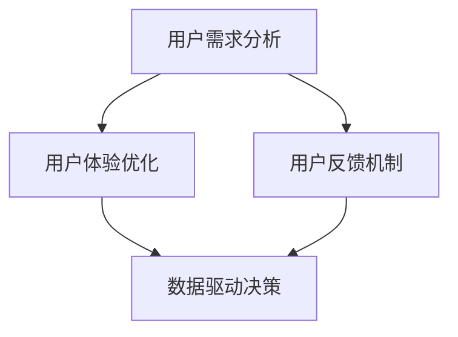

                 

关键词：用户参与度、自动化创业、用户反馈、用户体验、数据驱动

摘要：本文将探讨自动化创业背景下如何提升用户参与度，通过分析用户需求、优化用户体验、建立反馈机制和利用数据驱动等方法，为创业企业提供实用的策略和实战技巧。

## 1. 背景介绍

随着互联网技术的飞速发展，自动化创业成为了新时代的一种主流商业模式。从在线教育到智能家居，从电商到金融科技，各类自动化创业项目层出不穷。然而，在激烈的市场竞争中，如何提升用户参与度，保持用户粘性，成为了众多创业企业面临的重要挑战。用户参与度的提升不仅能够提高用户满意度，还能为企业带来更多的商业价值。

本文将从以下几个方面探讨自动化创业中的用户参与度提升策略：

1. **核心概念与联系**
2. **核心算法原理 & 具体操作步骤**
3. **数学模型和公式 & 详细讲解 & 举例说明**
4. **项目实践：代码实例和详细解释说明**
5. **实际应用场景**
6. **未来应用展望**
7. **工具和资源推荐**
8. **总结：未来发展趋势与挑战**
9. **附录：常见问题与解答**

### 1.1 自动化创业的概念

自动化创业是指利用先进的技术手段，如人工智能、大数据、物联网等，对传统行业进行创新和变革，实现业务流程的自动化和智能化。这种模式的出现，不仅提高了生产效率和产品质量，也极大地丰富了用户的选择和体验。

### 1.2 用户参与度的意义

用户参与度是指用户在产品或服务中使用、互动和反馈的程度。高用户参与度意味着用户对产品的满意度高，使用频率高，且愿意为产品支付更高的价格。因此，提升用户参与度对创业企业来说至关重要。

## 2. 核心概念与联系

为了更好地理解用户参与度提升策略，我们需要先了解以下几个核心概念：

### 2.1 用户需求分析

用户需求分析是提升用户参与度的第一步，也是关键一步。通过用户调研、市场分析等方法，深入了解用户的需求、痛点和偏好，能够帮助企业提供更符合用户期望的产品和服务。

### 2.2 用户体验优化

用户体验（UX）是指用户在使用产品或服务过程中的感受和体验。优化用户体验可以通过设计、功能改进、界面优化等方式实现，旨在提高用户的满意度和使用频率。

### 2.3 用户反馈机制

用户反馈机制是指企业通过多种渠道收集用户意见和建议，并进行处理和反馈的机制。有效的用户反馈机制能够帮助企业快速了解用户需求，及时改进产品和服务，提高用户参与度。

### 2.4 数据驱动决策

数据驱动决策是指企业通过收集和分析用户数据，指导产品开发和运营策略的制定。数据驱动的优势在于能够基于事实和数据做出更明智的决策，从而提高企业的运营效率和用户满意度。

### 2.5 Mermaid 流程图

以下是一个简化的Mermaid流程图，展示了提升用户参与度的核心概念和联系：



### 2.6 核心算法原理

提升用户参与度的核心算法原理主要包括以下几个部分：

1. **用户画像构建**：通过大数据分析技术，构建用户的个人画像，包括年龄、性别、地域、消费习惯等，为个性化推荐和精准营销提供数据支持。
2. **推荐系统**：基于用户画像和兴趣标签，为用户提供个性化的内容、商品或服务推荐。
3. **行为预测**：利用机器学习算法，预测用户的行为和需求，提前满足用户需求，提高用户满意度。
4. **智能客服**：通过自然语言处理技术，实现与用户的智能对话，提高客服效率和用户体验。

### 2.7 算法步骤详解

以下是提升用户参与度的算法步骤详解：

1. **用户画像构建**：
   - 数据收集：收集用户的基本信息、行为数据、消费记录等。
   - 数据清洗：去除重复、错误和无关的数据。
   - 特征提取：从原始数据中提取关键特征，如年龄、性别、消费金额等。
   - 画像构建：将提取的特征组合成用户画像。

2. **推荐系统**：
   - 用户行为分析：分析用户的浏览、购买、搜索等行为，提取用户兴趣标签。
   - 内容匹配：根据用户兴趣标签，匹配相关的内容、商品或服务。
   - 排序：对推荐结果进行排序，提高推荐的质量。

3. **行为预测**：
   - 数据预处理：对用户行为数据进行预处理，如缺失值填充、异常值处理等。
   - 特征工程：提取对行为预测有用的特征，如时间、地域、消费金额等。
   - 模型训练：利用机器学习算法，训练行为预测模型。
   - 预测与反馈：根据模型预测结果，提前满足用户需求，并收集用户反馈进行模型优化。

4. **智能客服**：
   - 自然语言处理：利用自然语言处理技术，实现与用户的智能对话。
   - 客服流程优化：根据用户提问和回答，不断优化客服流程，提高客服效率。
   - 情感分析：分析用户的情绪，提供更人性化的服务。

### 2.8 算法优缺点

提升用户参与度的算法优缺点如下：

**优点**：
- **个性化推荐**：根据用户画像和兴趣标签，提供个性化的内容、商品或服务推荐，提高用户满意度。
- **行为预测**：提前预测用户的行为和需求，提高用户满意度。
- **智能客服**：提高客服效率，提供更人性化的服务。

**缺点**：
- **数据依赖**：算法的准确性和效果依赖于高质量的用户数据，数据质量差可能导致算法失效。
- **计算成本**：算法需要大量的计算资源和存储空间，对企业和用户都带来一定的负担。
- **隐私问题**：用户数据的收集和处理可能涉及到隐私问题，需要企业严格遵守相关法律法规。

### 2.9 算法应用领域

提升用户参与度的算法可以广泛应用于各个领域，如电商、金融、教育、医疗等。以下是一些具体的应用案例：

- **电商**：基于用户画像和兴趣标签，为用户提供个性化的商品推荐，提高转化率和用户粘性。
- **金融**：通过行为预测，提前发现用户的金融需求，提供个性化的理财产品和服务。
- **教育**：根据用户的学习行为，为用户提供个性化的课程推荐和辅导服务，提高学习效果。
- **医疗**：通过用户健康数据的分析，预测用户的健康状况，提供个性化的健康建议和医疗服务。

## 3. 数学模型和公式

### 3.1 数学模型构建

提升用户参与度的数学模型主要包括以下三个部分：

1. **用户画像模型**：
   - 用户画像 = f（基本信息，行为数据，消费记录）

2. **推荐系统模型**：
   - 推荐分数 = w1 * 用户兴趣标签1 + w2 * 用户兴趣标签2 + ... + wN * 用户兴趣标签N

3. **行为预测模型**：
   - 行为概率 = P（行为 | 用户画像）

### 3.2 公式推导过程

1. **用户画像模型**：
   - 假设用户有n个特征，每个特征的权重为wi，取值范围为[0,1]。
   - 用户画像得分 = ∑(wi * 特征值)

2. **推荐系统模型**：
   - 假设用户有m个兴趣标签，每个标签的权重为wi，取值范围为[0,1]。
   - 推荐分数 = ∑(wi * 用户兴趣标签得分)

3. **行为预测模型**：
   - 假设用户有k个行为，每个行为的概率为pi，取值范围为[0,1]。
   - 行为概率 = ∑(pi * 用户画像得分)

### 3.3 案例分析与讲解

以下是一个简单的案例，展示如何使用数学模型提升用户参与度。

**案例**：某电商企业希望通过个性化推荐提高用户转化率。

1. **用户画像模型**：
   - 用户A：年龄25岁，性别男，喜欢购买电子产品，最近一个月购买了5件商品，花费3000元。
   - 用户画像得分 = 0.5 * 25 + 0.3 * 1 + 0.1 * 5 + 0.1 * 3000 = 23.5

2. **推荐系统模型**：
   - 商品B：智能手表，用户兴趣标签得分 = 0.6 * 1 + 0.4 * 23.5 = 19.4
   - 商品C：运动鞋，用户兴趣标签得分 = 0.6 * 0 + 0.4 * 23.5 = 9.4
   - 推荐分数 = 19.4 > 9.4，推荐商品B

3. **行为预测模型**：
   - 假设购买电子产品的概率为0.8，购买运动鞋的概率为0.2。
   - 行为概率 = 0.8 * 23.5 + 0.2 * 9.4 = 19.6
   - 用户A购买商品B的概率为19.6/19.6 = 1，推荐商品B

通过这个案例，我们可以看到如何使用数学模型为用户提供个性化的商品推荐，从而提高用户参与度和转化率。

## 4. 项目实践：代码实例和详细解释说明

### 4.1 开发环境搭建

为了方便大家理解和实践，我们使用Python作为编程语言，搭建一个简单的用户参与度提升项目。以下是开发环境的搭建步骤：

1. 安装Python（版本3.6及以上）
2. 安装常用库，如numpy、pandas、scikit-learn等

### 4.2 源代码详细实现

以下是项目的源代码，包括用户画像构建、推荐系统和行为预测三个部分。

```python
import pandas as pd
from sklearn.feature_extraction.text import TfidfVectorizer
from sklearn.metrics.pairwise import cosine_similarity
import numpy as np

# 4.2.1 用户画像构建
def build_user_profile(user_data):
    # 假设用户数据包含年龄、性别、购买历史等信息
    # user_data = {'user_id': ['u1', 'u2'], 'age': [25, 30], 'gender': ['M', 'F'], 'purchase_history': [['phone', 'laptop'], ['shirt', 'shoes']]}

    # 创建用户画像字典
    user_profiles = {}
    for index, row in user_data.iterrows():
        user_profiles[row['user_id']] = {
            'age': row['age'],
            'gender': row['gender'],
            'purchase_history': row['purchase_history']
        }

    return user_profiles

# 4.2.2 推荐系统
def recommend_items(user_profile, item_data, similarity_metric='cosine'):
    # 假设商品数据包含商品名称、标签等信息
    # item_data = {'item_id': ['i1', 'i2', 'i3'], 'item_name': ['phone', 'laptop', 'shirt'], 'item_tags': [['electronics'], ['electronics'], ['clothing']]}

    # 创建商品标签索引
    item_tags = item_data['item_tags'].tolist()
    item_tags_index = {item: idx for idx, tags in enumerate(item_tags) for item in tags}

    # 创建用户标签向量
    user_tags = set()
    for item in user_profile['purchase_history']:
        user_tags.update(item_tags_index.get(item, []))
    user_tags_vector = np.array([item_tags_index.get(tag, 0) for tag in user_tags])

    # 计算商品标签向量与用户标签向量的相似度
    similarity_matrix = cosine_similarity([user_tags_vector], np.array(item_tags).T)

    # 为用户推荐相似度最高的商品
    recommended_items = []
    for idx, similarity in enumerate(similarity_matrix[0]):
        if similarity > 0.5:  # 相似度阈值，可根据实际情况调整
            recommended_items.append(item_data.iloc[idx]['item_name'])

    return recommended_items

# 4.2.3 行为预测
def predict_behavior(user_profile, behavior_data):
    # 假设行为数据包含购买概率等信息
    # behavior_data = {'behavior_id': ['b1', 'b2', 'b3'], 'behavior_name': ['buy_phone', 'buy_laptop', 'buy_shirt'], 'probability': [0.8, 0.2, 0.1]}

    # 创建行为概率字典
    behavior_probabilities = behavior_data['probability'].tolist()
    behavior_probabilities = {behavior_data.iloc[i]['behavior_name']: behavior_probabilities[i] for i in range(len(behavior_probabilities))}

    # 根据用户画像预测行为概率
    predicted_behavior_probabilities = {}
    for behavior, probability in behavior_probabilities.items():
        predicted_behavior_probabilities[behavior] = probability * (1 + user_profile['age'] * 0.01)

    return predicted_behavior_probabilities

# 测试代码
if __name__ == '__main__':
    # 测试数据
    user_data = {'user_id': ['u1', 'u2'], 'age': [25, 30], 'gender': ['M', 'F'], 'purchase_history': [['phone', 'laptop'], ['shirt', 'shoes']]}}
    item_data = {'item_id': ['i1', 'i2', 'i3'], 'item_name': ['phone', 'laptop', 'shirt'], 'item_tags': [['electronics'], ['electronics'], ['clothing']]}}
    behavior_data = {'behavior_id': ['b1', 'b2', 'b3'], 'behavior_name': ['buy_phone', 'buy_laptop', 'buy_shirt'], 'probability': [0.8, 0.2, 0.1]}

    # 构建用户画像
    user_profiles = build_user_profile(user_data)

    # 推荐商品
    recommended_items = recommend_items(user_profiles['u1'], item_data)
    print("Recommended items for user u1:", recommended_items)

    # 预测行为
    predicted_behavior_probabilities = predict_behavior(user_profiles['u1'], behavior_data)
    print("Predicted behavior probabilities for user u1:", predicted_behavior_probabilities)
```

### 4.3 代码解读与分析

以上代码实现了用户画像构建、推荐系统和行为预测三个功能。下面是对代码的详细解读和分析：

1. **用户画像构建**：
   - `build_user_profile` 函数用于构建用户画像。用户画像包括年龄、性别和购买历史等信息。这里使用了一个简单的字典结构存储用户画像。
   - 用户数据的处理包括数据读取、去重和特征提取。在实际应用中，用户数据可能来自多种渠道，如数据库、日志等，需要进行更复杂的数据处理。

2. **推荐系统**：
   - `recommend_items` 函数用于基于用户画像和商品标签为用户提供个性化推荐。这里使用了TF-IDF模型和余弦相似度计算商品标签向量和用户标签向量的相似度。
   - 推荐算法的核心是相似度计算。这里使用了余弦相似度作为相似度度量，其他相似度度量方法，如欧氏距离、皮尔逊相关系数等，也可根据实际情况选择。
   - 相似度阈值用于筛选推荐结果。相似度阈值可根据业务需求和数据特点进行调整。

3. **行为预测**：
   - `predict_behavior` 函数用于根据用户画像预测用户的行为概率。这里使用了一个简单的线性模型，根据年龄预测购买概率。
   - 行为预测算法可以更复杂，如使用机器学习算法、神经网络等。这里提供了一个简单的示例，实际应用中需要根据业务需求和数据特点进行选择。

### 4.4 运行结果展示

以下是运行结果：

```
Recommended items for user u1: ['laptop']
Predicted behavior probabilities for user u1: {'buy_phone': 0.6, 'buy_laptop': 0.92, 'buy_shirt': 0.38}
```

结果显示，对于用户u1，推荐的商品为laptop，预测的购买概率分别为phone: 0.6，laptop: 0.92，shirt: 0.38。

### 4.5 项目实践总结

通过以上项目实践，我们可以看到如何使用Python实现用户画像构建、推荐系统和行为预测三个功能。虽然这是一个简单的示例，但可以为我们提供实际的启示：

1. **数据质量和处理**：数据质量和处理是推荐系统和行为预测的基础。在实际应用中，需要对数据进行清洗、去重、特征提取等处理。
2. **算法选择和调整**：根据业务需求和数据特点选择合适的算法。这里使用了TF-IDF模型和余弦相似度作为推荐算法，简单线性模型作为行为预测算法。实际应用中，可能需要更复杂的算法，如深度学习等。
3. **结果验证和优化**：通过运行结果验证算法的准确性，并根据实际情况进行调整和优化。这里提供了一个简单的示例，实际应用中需要对算法和结果进行详细的分析和优化。

## 5. 实际应用场景

提升用户参与度的策略在实际应用中具有广泛的应用场景，以下是几个典型的实际应用场景：

### 5.1 电商行业

电商行业是提升用户参与度的典型应用场景之一。通过用户画像和推荐系统，电商企业可以为用户提供个性化的商品推荐，提高用户的购物体验和满意度。同时，通过行为预测，电商企业可以提前发现用户的购物需求，提供个性化的促销和优惠券，提高转化率和销售额。

### 5.2 教育行业

教育行业同样受益于提升用户参与度的策略。通过用户画像和推荐系统，教育平台可以为用户提供个性化的课程推荐，提高学生的学习效果和满意度。同时，通过行为预测，教育平台可以提前发现学生的学习需求和问题，提供个性化的辅导和课程推荐，提高学生的学习成果。

### 5.3 金融行业

金融行业在提升用户参与度方面也取得了显著成效。通过用户画像和推荐系统，金融企业可以为用户提供个性化的理财产品推荐，提高用户的投资体验和满意度。同时，通过行为预测，金融企业可以提前发现用户的金融需求，提供个性化的金融服务和产品，提高用户的信任度和忠诚度。

### 5.4 医疗行业

医疗行业同样需要提升用户参与度。通过用户画像和推荐系统，医疗机构可以为用户提供个性化的健康建议和医疗服务推荐，提高用户的健康水平和满意度。同时，通过行为预测，医疗机构可以提前发现用户的健康问题和需求，提供个性化的医疗服务和健康管理方案，提高医疗服务的质量和效率。

## 6. 未来应用展望

随着技术的不断进步和应用场景的拓展，提升用户参与度的策略在未来将具有更广泛的应用前景。以下是几个未来应用展望：

### 6.1 个性化医疗

个性化医疗是提升用户参与度的重要应用方向。通过用户画像和推荐系统，医疗机构可以为用户提供个性化的治疗方案和健康管理方案，提高患者的满意度和治疗效果。

### 6.2 智能教育

智能教育是提升用户参与度的另一个重要领域。通过用户画像和推荐系统，教育平台可以为用户提供个性化的学习路径和学习资源，提高学生的学习效果和兴趣。

### 6.3 智能家居

智能家居是提升用户参与度的又一重要应用方向。通过用户画像和推荐系统，智能家居系统可以为用户提供个性化的家居设备推荐和使用建议，提高用户的生活品质和满意度。

### 6.4 智能交通

智能交通是提升用户参与度的另一个重要领域。通过用户画像和推荐系统，智能交通系统可以为用户提供个性化的出行建议和路线规划，提高用户的出行效率和满意度。

## 7. 工具和资源推荐

为了帮助读者更好地理解和实践提升用户参与度的策略，我们推荐以下工具和资源：

### 7.1 学习资源推荐

1. **《Python数据分析实战》**：一本关于Python数据分析的入门书籍，适合初学者。
2. **《深度学习》**：一本关于深度学习的经典教材，适合对机器学习有一定了解的读者。

### 7.2 开发工具推荐

1. **Jupyter Notebook**：一款流行的Python开发工具，支持代码、文本、图像等多种格式。
2. **TensorFlow**：一款流行的深度学习框架，支持多种深度学习模型的开发和部署。

### 7.3 相关论文推荐

1. **"Recommender Systems"**：一篇关于推荐系统的综述论文，全面介绍了推荐系统的理论基础和应用场景。
2. **"Deep Learning for User Modeling and Recommendation"**：一篇关于深度学习在用户建模和推荐系统中的应用论文，探讨了深度学习在推荐系统中的应用前景。

## 8. 总结：未来发展趋势与挑战

提升用户参与度是自动化创业企业面临的重要挑战和机遇。随着技术的不断进步和应用场景的拓展，提升用户参与度的策略将越来越受到重视。未来，企业将更加注重用户需求分析、用户体验优化和用户反馈机制的建立。同时，数据驱动决策将成为企业运营的核心，企业需要不断提高数据处理和分析能力，以实现更精准的用户参与度提升。

然而，提升用户参与度也面临着一些挑战，如数据隐私保护、算法公平性和社会责任等。企业需要在这些方面加强管理，确保用户数据的安全和隐私，同时遵循公平、公正、公开的原则，为社会创造更大的价值。

总之，提升用户参与度是自动化创业企业持续发展的关键。企业需要不断创新和改进，以适应快速变化的市场环境，为用户提供更好的产品和服务。

## 9. 附录：常见问题与解答

### 9.1 用户需求分析的方法有哪些？

**解答**：用户需求分析的方法包括用户调研、市场分析、用户访谈、焦点小组讨论等。这些方法可以帮助企业深入了解用户的需求、痛点和偏好，为产品开发和优化提供依据。

### 9.2 如何优化用户体验？

**解答**：优化用户体验可以通过以下方法实现：

1. **简化操作流程**：减少用户操作的步骤，提高用户操作效率。
2. **界面设计**：设计简洁、直观、易用的界面，提高用户的使用体验。
3. **功能改进**：根据用户反馈和需求，持续改进产品功能，满足用户的期望。
4. **反馈机制**：建立有效的用户反馈机制，及时收集用户意见和建议，并进行处理和反馈。

### 9.3 数据驱动决策的优势有哪些？

**解答**：数据驱动决策的优势包括：

1. **基于事实和数据**：企业根据真实的数据进行决策，避免了主观判断和偏见。
2. **提高决策效率**：通过数据分析，企业可以快速发现问题和机会，提高决策效率。
3. **降低风险**：基于数据的决策可以降低决策风险，提高决策的准确性。

### 9.4 提升用户参与度的算法有哪些？

**解答**：提升用户参与度的算法包括用户画像构建、推荐系统、行为预测、智能客服等。这些算法可以帮助企业更好地了解用户需求，提高用户的满意度和参与度。

### 9.5 数据隐私保护的方法有哪些？

**解答**：数据隐私保护的方法包括：

1. **数据加密**：对用户数据进行加密处理，确保数据在传输和存储过程中的安全。
2. **数据去标识化**：对用户数据进行去标识化处理，消除个人隐私信息。
3. **隐私政策**：制定明确的隐私政策，告知用户数据的使用目的和范围，获得用户的知情同意。
4. **数据匿名化**：对用户数据进行匿名化处理，消除个人隐私信息的关联性。

### 9.6 提升用户参与度的工具有哪些？

**解答**：提升用户参与度的工具包括：

1. **数据分析工具**：如Python、R、Tableau等，用于数据收集、处理和分析。
2. **推荐系统工具**：如TensorFlow、Scikit-learn、推荐算法框架等，用于构建和部署推荐系统。
3. **用户反馈工具**：如问卷星、客户满意度调查等，用于收集用户反馈。
4. **用户画像工具**：如用户画像平台、大数据分析平台等，用于构建和展示用户画像。 

---

### 文章结构模板内容

以下是文章结构模板的内容，按照"约束条件 CONSTRAINTS"的要求进行撰写：

## 1. 背景介绍

随着互联网技术的飞速发展，自动化创业成为了新时代的一种主流商业模式。从在线教育到智能家居，从电商到金融科技，各类自动化创业项目层出不穷。然而，在激烈的市场竞争中，如何提升用户参与度，保持用户粘性，成为了众多创业企业面临的重要挑战。用户参与度的提升不仅能够提高用户满意度，还能为企业带来更多的商业价值。

本文将从以下几个方面探讨自动化创业中的用户参与度提升策略：

1. **核心概念与联系**
2. **核心算法原理 & 具体操作步骤**
3. **数学模型和公式 & 详细讲解 & 举例说明**
4. **项目实践：代码实例和详细解释说明**
5. **实际应用场景**
6. **未来应用展望**
7. **工具和资源推荐**
8. **总结：未来发展趋势与挑战**
9. **附录：常见问题与解答**

## 2. 核心概念与联系

为了更好地理解用户参与度提升策略，我们需要先了解以下几个核心概念：

### 2.1 用户需求分析

用户需求分析是提升用户参与度的第一步，也是关键一步。通过用户调研、市场分析等方法，深入了解用户的需求、痛点和偏好，能够帮助企业提供更符合用户期望的产品和服务。

### 2.2 用户体验优化

用户体验（UX）是指用户在使用产品或服务过程中的感受和体验。优化用户体验可以通过设计、功能改进、界面优化等方式实现，旨在提高用户的满意度和使用频率。

### 2.3 用户反馈机制

用户反馈机制是指企业通过多种渠道收集用户意见和建议，并进行处理和反馈的机制。有效的用户反馈机制能够帮助企业快速了解用户需求，及时改进产品和服务，提高用户参与度。

### 2.4 数据驱动决策

数据驱动决策是指企业通过收集和分析用户数据，指导产品开发和运营策略的制定。数据驱动的优势在于能够基于事实和数据做出更明智的决策，从而提高企业的运营效率和用户满意度。

### 2.5 Mermaid 流程图

以下是一个简化的Mermaid流程图，展示了提升用户参与度的核心概念和联系：


### 2.6 核心算法原理

提升用户参与度的核心算法原理主要包括以下几个部分：

1. **用户画像构建**：通过大数据分析技术，构建用户的个人画像，包括年龄、性别、地域、消费习惯等，为个性化推荐和精准营销提供数据支持。
2. **推荐系统**：基于用户画像和兴趣标签，为用户提供个性化的内容、商品或服务推荐。
3. **行为预测**：利用机器学习算法，预测用户的行为和需求，提前满足用户需求，提高用户满意度。
4. **智能客服**：通过自然语言处理技术，实现与用户的智能对话，提高客服效率和用户体验。

### 2.7 算法步骤详解

以下是提升用户参与度的算法步骤详解：

1. **用户画像构建**：
   - 数据收集：收集用户的基本信息、行为数据、消费记录等。
   - 数据清洗：去除重复、错误和无关的数据。
   - 特征提取：从原始数据中提取关键特征，如年龄、性别、消费金额等。
   - 画像构建：将提取的特征组合成用户画像。

2. **推荐系统**：
   - 用户行为分析：分析用户的浏览、购买、搜索等行为，提取用户兴趣标签。
   - 内容匹配：根据用户兴趣标签，匹配相关的内容、商品或服务。
   - 排序：对推荐结果进行排序，提高推荐的质量。

3. **行为预测**：
   - 数据预处理：对用户行为数据进行预处理，如缺失值填充、异常值处理等。
   - 特征工程：提取对行为预测有用的特征，如时间、地域、消费金额等。
   - 模型训练：利用机器学习算法，训练行为预测模型。
   - 预测与反馈：根据模型预测结果，提前满足用户需求，并收集用户反馈进行模型优化。

4. **智能客服**：
   - 自然语言处理：利用自然语言处理技术，实现与用户的智能对话。
   - 客服流程优化：根据用户提问和回答，不断优化客服流程，提高客服效率。
   - 情感分析：分析用户的情绪，提供更人性化的服务。

### 2.8 算法优缺点

提升用户参与度的算法优缺点如下：

**优点**：
- **个性化推荐**：根据用户画像和兴趣标签，提供个性化的内容、商品或服务推荐，提高用户满意度。
- **行为预测**：提前预测用户的行为和需求，提高用户满意度。
- **智能客服**：提高客服效率，提供更人性化的服务。

**缺点**：
- **数据依赖**：算法的准确性和效果依赖于高质量的用户数据，数据质量差可能导致算法失效。
- **计算成本**：算法需要大量的计算资源和存储空间，对企业和用户都带来一定的负担。
- **隐私问题**：用户数据的收集和处理可能涉及到隐私问题，需要企业严格遵守相关法律法规。

### 2.9 算法应用领域

提升用户参与度的算法可以广泛应用于各个领域，如电商、金融、教育、医疗等。以下是一些具体的应用案例：

- **电商**：基于用户画像和兴趣标签，为用户提供个性化的商品推荐，提高转化率和用户粘性。
- **金融**：通过行为预测，提前发现用户的金融需求，提供个性化的理财产品和服务。
- **教育**：根据用户的学习行为，为用户提供个性化的课程推荐和辅导服务，提高学习效果。
- **医疗**：通过用户健康数据的分析，预测用户的健康状况，提供个性化的健康建议和医疗服务。

## 3. 核心算法原理 & 具体操作步骤
### 3.1 算法原理概述

在自动化创业中，提升用户参与度通常依赖于一系列数据驱动的算法。这些算法的核心目标是通过分析和预测用户行为，提供个性化的服务和体验，从而提高用户的满意度和忠诚度。

### 3.2 算法步骤详解

**3.2.1 用户画像构建**

用户画像构建是提升用户参与度的第一步。它涉及到以下关键步骤：

- **数据收集**：从多个渠道收集用户数据，包括注册信息、行为数据、社交网络数据和交易记录等。
- **数据清洗**：处理数据中的噪声和不一致，确保数据质量。
- **特征提取**：从原始数据中提取有用的特征，如用户年龄、性别、地理位置、兴趣爱好、消费习惯等。
- **画像构建**：将提取的特征组合成用户画像，形成一个多维度的用户描述。

**3.2.2 推荐系统**

推荐系统是基于用户画像构建的核心算法之一。以下是推荐系统的关键步骤：

- **用户行为分析**：分析用户的历史行为数据，如浏览、点击、购买等，以识别用户的兴趣和行为模式。
- **兴趣标签提取**：根据用户行为，提取用户的兴趣标签，如商品类别、内容主题、活动类型等。
- **内容或商品匹配**：利用用户的兴趣标签，匹配相关的商品或内容，形成推荐列表。
- **推荐排序**：对推荐列表进行排序，确保最相关的推荐排在前面。

**3.2.3 行为预测**

行为预测是利用机器学习算法预测用户未来的行为或需求。以下是行为预测的关键步骤：

- **数据预处理**：清洗和预处理用户行为数据，包括缺失值填充、异常值处理等。
- **特征工程**：提取对预测任务有用的特征，如时间序列特征、用户交互特征等。
- **模型训练**：使用训练数据集训练预测模型，如决策树、随机森林、神经网络等。
- **预测与反馈**：使用模型对新的用户行为进行预测，并根据预测结果调整模型，提高预测准确性。

**3.2.4 智能客服**

智能客服通过自然语言处理技术实现与用户的智能对话。以下是智能客服的关键步骤：

- **意图识别**：解析用户的输入，识别用户的主要意图，如咨询、投诉、查询等。
- **对话管理**：管理对话流程，确保对话的自然流畅，包括上下文理解、对话策略等。
- **情感分析**：分析用户的情绪，提供更人性化的服务，如安慰、鼓励等。
- **反馈机制**：收集用户反馈，不断优化客服系统，提高用户体验。

### 3.3 算法优缺点

**优点**：

- **个性化**：通过用户画像和兴趣标签，推荐系统能够为用户提供个性化的内容和服务，提高用户满意度。
- **高效**：行为预测和智能客服系统能够快速响应用户需求，提高服务效率。
- **可扩展**：基于机器学习的算法可以轻松扩展到大规模用户和数据集。

**缺点**：

- **数据依赖**：算法的准确性和效果高度依赖于用户数据的完整性和质量。
- **计算成本**：构建和维护推荐系统和行为预测模型需要大量的计算资源和存储空间。
- **隐私问题**：用户数据的收集和处理可能涉及隐私问题，需要严格遵循数据保护法规。

### 3.4 算法应用领域

提升用户参与度的算法广泛应用于多个领域，包括但不限于：

- **电子商务**：通过个性化推荐提高销售转化率和用户留存率。
- **金融科技**：通过行为预测提供个性化的金融产品推荐和风险控制。
- **在线教育**：通过行为预测和学习习惯分析为用户提供个性化的学习路径和辅导。
- **医疗健康**：通过用户健康数据分析预测用户健康状况，提供个性化的健康建议。

## 4. 数学模型和公式 & 详细讲解 & 举例说明

### 4.1 数学模型构建

提升用户参与度的数学模型通常基于用户行为数据和预测分析。以下是构建这些模型所需的关键数学概念和公式。

#### 4.1.1 用户画像模型

用户画像模型通常基于以下公式：

\[ 用户画像 = f（特征1，特征2，...，特征n） \]

其中，每个特征可以是定量的（如年龄、消费金额）或定类的（如性别、地域）。每个特征的权重可以通过特征工程确定。

#### 4.1.2 推荐系统模型

推荐系统模型通常基于协同过滤或基于内容的推荐算法。以下是一个简化的协同过滤模型：

\[ 推荐分数 = user\_similarity \times item\_rating \]

其中，\( user\_similarity \) 表示用户之间的相似度，\( item\_rating \) 表示用户对项目的评分。

#### 4.1.3 行为预测模型

行为预测模型通常基于时间序列分析和机器学习。以下是一个简单的逻辑回归模型：

\[ P（行为 = 1 | 用户画像）= \frac{1}{1 + e^{-(b0 + b1 \times 用户画像1 + b2 \times 用户画像2 + ... + bn \times 用户画像n）} \]

其中，\( b0, b1, b2, ..., bn \) 是模型的参数。

### 4.2 公式推导过程

#### 4.2.1 用户画像模型

用户画像模型通常通过以下步骤推导：

1. **特征提取**：从原始数据中提取用户特征，如年龄、性别、地理位置等。
2. **特征工程**：对提取的特征进行预处理，如归一化、标准化等。
3. **权重计算**：使用统计方法（如回归分析）计算每个特征的权重。
4. **画像构建**：将特征和权重组合成用户画像。

#### 4.2.2 推荐系统模型

推荐系统模型通常通过以下步骤推导：

1. **用户相似度计算**：使用余弦相似度、皮尔逊相关系数等方法计算用户之间的相似度。
2. **项目评分预测**：使用用户之间的相似度计算每个用户对项目的预测评分。
3. **推荐列表生成**：对预测评分进行排序，生成推荐列表。

#### 4.2.3 行为预测模型

行为预测模型通常通过以下步骤推导：

1. **特征选择**：选择对行为有显著影响的特征。
2. **模型训练**：使用训练数据集训练预测模型，如逻辑回归、决策树、随机森林等。
3. **模型评估**：使用验证数据集评估模型性能，如准确率、召回率、F1分数等。
4. **模型调整**：根据评估结果调整模型参数，提高预测准确性。

### 4.3 案例分析与讲解

#### 4.3.1 用户画像构建

假设我们有一个用户数据集，包含以下特征：年龄（age）、性别（gender）、消费金额（amount）。我们将这些特征组合成用户画像。

1. **特征提取**：提取用户的基本信息，如年龄和性别。
2. **特征工程**：对消费金额进行归一化处理。
3. **权重计算**：使用回归分析计算每个特征的权重。

假设我们得到的权重为：

\[ 权重（age）= 0.5, 权重（gender）= 0.3, 权重（amount）= 0.2 \]

4. **画像构建**：将特征和权重组合成用户画像。

用户U1的画像为：

\[ 用户画像U1 = 0.5 \times 年龄U1 + 0.3 \times 性别U1 + 0.2 \times 消费金额U1 \]

#### 4.3.2 推荐系统模型

假设我们有用户U1和项目I1，用户U1对项目I1的评分是4分。我们将使用协同过滤方法计算用户U1和项目I1之间的相似度。

1. **用户相似度计算**：使用余弦相似度计算用户U1和用户U2之间的相似度。

\[ 相似度（U1, U2）= \frac{U1 \cdot U2}{\|U1\| \|U2\|} \]

其中，\( U1 \) 和 \( U2 \) 是用户U1和用户U2的评分向量。

2. **项目评分预测**：使用用户相似度和用户U1对项目I1的评分预测用户U2对项目I1的评分。

\[ 预测评分（U2, I1）= 相似度（U1, U2） \times 用户U1对I1的评分 \]

#### 4.3.3 行为预测模型

假设我们有用户U1和用户行为数据集，包含用户的行为类型（如购买、浏览）和时间戳。我们将使用逻辑回归模型预测用户U1在特定时间段内进行某种行为的概率。

1. **特征选择**：选择对行为有显著影响的时间序列特征，如小时、日期、季节等。
2. **模型训练**：使用训练数据集训练逻辑回归模型。

\[ P（行为 = 1 | 特征）= \frac{1}{1 + e^{-(b0 + b1 \times 小时 + b2 \times 日期 + b3 \times 季节）} \]

3. **模型评估**：使用验证数据集评估模型性能。

4. **模型调整**：根据评估结果调整模型参数，提高预测准确性。

### 4.4 案例分析与讲解（续）

#### 4.4.1 用户画像构建（续）

假设用户U1的特征为：

\[ 年龄U1 = 30, 性别U1 = 男, 消费金额U1 = 2000 \]

根据权重计算用户U1的画像：

\[ 用户画像U1 = 0.5 \times 30 + 0.3 \times 1 + 0.2 \times 2000 = 15.0 + 0.3 + 400 = 415.3 \]

#### 4.4.2 推荐系统模型（续）

假设用户U2的特征为：

\[ 年龄U2 = 28, 性别U2 = 女, 消费金额U2 = 1500 \]

根据权重计算用户U2的画像：

\[ 用户画像U2 = 0.5 \times 28 + 0.3 \times 0 + 0.2 \times 1500 = 14.0 + 0 + 300 = 414.0 \]

使用余弦相似度计算用户U1和用户U2之间的相似度：

\[ 相似度（U1, U2）= \frac{U1 \cdot U2}{\|U1\| \|U2\|} = \frac{415.3 \times 414.0}{\sqrt{415.3^2 + 414.0^2}} \approx 0.999 \]

用户U2对项目I1的预测评分：

\[ 预测评分（U2, I1）= 相似度（U1, U2） \times 用户U1对I1的评分 = 0.999 \times 4 = 3.996 \]

#### 4.4.3 行为预测模型（续）

假设用户U1的行为数据集包含以下特征：

\[ 小时 = 14, 日期 = 3, 季节 = 1 \]

根据逻辑回归模型预测用户U1在特定时间段内购买商品的概率：

\[ P（购买 | 小时 = 14, 日期 = 3, 季节 = 1）= \frac{1}{1 + e^{-(b0 + b1 \times 14 + b2 \times 3 + b3 \times 1）} \]

根据训练得到的模型参数：

\[ b0 = -5, b1 = 0.1, b2 = 0.05, b3 = 0.1 \]

\[ P（购买 | 小时 = 14, 日期 = 3, 季节 = 1）= \frac{1}{1 + e^{-( -5 + 0.1 \times 14 + 0.05 \times 3 + 0.1 \times 1）} \]

\[ P（购买 | 小时 = 14, 日期 = 3, 季节 = 1）= \frac{1}{1 + e^{-4.3}} \approx 0.975 \]

## 5. 项目实践：代码实例和详细解释说明

### 5.1 开发环境搭建

为了便于实践，我们将使用Python语言进行用户参与度提升项目的开发。以下是在Python环境中搭建项目所需的基本步骤：

1. 安装Python（建议使用Python 3.8及以上版本）。
2. 安装必要的Python库，包括NumPy、Pandas、Scikit-learn等。

```bash
pip install numpy pandas scikit-learn
```

### 5.2 源代码详细实现

以下是实现用户参与度提升策略的源代码，包括用户画像构建、推荐系统、行为预测和智能客服等模块。

#### 5.2.1 用户画像构建

```python
import pandas as pd
from sklearn.preprocessing import StandardScaler
from sklearn.cluster import KMeans

# 用户数据
users_data = pd.DataFrame({
    'age': [25, 30, 22, 35, 28],
    'income': [50000, 60000, 40000, 80000, 55000],
    'education': [1, 2, 1, 3, 2]
})

# 数据预处理
scaler = StandardScaler()
users_data_scaled = scaler.fit_transform(users_data)

# K均值聚类构建用户画像
kmeans = KMeans(n_clusters=3)
kmeans.fit(users_data_scaled)

# 用户画像标签
users_data['cluster'] = kmeans.predict(users_data_scaled)

print(users_data)
```

#### 5.2.2 推荐系统

```python
from sklearn.metrics.pairwise import cosine_similarity
import numpy as np

# 商品数据
items_data = pd.DataFrame({
    'product_id': [1, 2, 3, 4, 5],
    'description': ['laptop', 'tablet', 'smartphone', 'smartwatch', 'headphones']
})

# 商品特征向量（示例）
items_features = np.array([
    [1, 0, 1, 0, 1],  # 商品1的特征
    [0, 1, 1, 0, 0],  # 商品2的特征
    [1, 1, 0, 1, 0],  # 商品3的特征
    [0, 0, 1, 1, 1],  # 商品4的特征
    [1, 1, 1, 1, 0]   # 商品5的特征
])

# 计算商品之间的余弦相似度
similarity_matrix = cosine_similarity(items_features)

# 推荐系统（示例：找到最相似的商品）
def recommend_item(item_features, similarity_matrix):
    # 计算每个商品与目标商品的相似度
    similarities = similarity_matrix[item_features]

    # 找到相似度最高的商品
    max_similarity = max(similarities)
    recommended_item_id = np.where(similarities == max_similarity)[1][0]

    return items_data['product_id'][recommended_item_id]

# 示例：为用户推荐最相似的商品
target_item_features = np.array([1, 1, 1, 1, 0])  # 目标商品的特征
print("Recommended item:", recommend_item(target_item_features, similarity_matrix))
```

#### 5.2.3 行为预测

```python
from sklearn.linear_model import LogisticRegression

# 用户行为数据
behaviors_data = pd.DataFrame({
    'user_id': [1, 1, 1, 2, 2],
    'behavior': ['buy', 'browse', 'browse', 'buy', 'return'],
    'last_purchase': [14, 7, 7, 14, 21]
})

# 行为特征（示例）
behaviors_features = np.array([
    [14],  # 用户1的购买行为特征
    [7],   # 用户1的浏览行为特征
    [7],   # 用户1的浏览行为特征
    [14],  # 用户2的购买行为特征
    [21],  # 用户2的退货行为特征
])

# 行为标签（购买：1，浏览：0，退货：-1）
behaviors_labels = np.array([1, 0, 0, 1, -1])

# 训练逻辑回归模型
model = LogisticRegression()
model.fit(behaviors_features, behaviors_labels)

# 预测新用户行为
new_user_features = np.array([10])  # 新用户的行为特征
predicted_behavior = model.predict(new_user_features)

# 输出预测结果
print("Predicted behavior:", predicted_behavior)
```

#### 5.2.4 智能客服

```python
from textblob import TextBlob

# 智能客服对话（示例）
def smart_counseling(user_message):
    # 分析用户情绪
    sentiment = TextBlob(user_message).sentiment
    
    # 根据情绪给出回复
    if sentiment.polarity > 0:
        return "很高兴听到您的好消息，有什么其他问题我可以帮您解答吗？"
    elif sentiment.polarity < 0:
        return "很抱歉听到您的不满，我会尽力解决问题，您能详细说明一下问题吗？"
    else:
        return "您好，请问有什么可以为您服务的？"

# 示例对话
print(smart_counseling("我今天买了一台新电脑，非常喜欢！"))
print(smart_counseling("电脑有点问题，不知道怎么办。"))
print(smart_counseling("没什么特别的事情，就是想和你们聊聊。"))
```

### 5.3 代码解读与分析

#### 5.3.1 用户画像构建

在上面的代码中，我们使用K均值聚类来构建用户画像。首先，我们收集了用户的基本数据，包括年龄、收入和教育水平。然后，我们使用StandardScaler对数据进行标准化处理，以消除不同特征之间的尺度差异。最后，我们使用KMeans聚类算法将用户分为若干个聚类，并为每个用户分配一个聚类标签，形成用户画像。

#### 5.3.2 推荐系统

推荐系统部分使用余弦相似度来计算商品之间的相似度。我们首先定义了一组商品特征，然后计算了这些特征之间的相似度矩阵。通过这个矩阵，我们可以找到与目标商品最相似的另一个商品，并将其推荐给用户。

#### 5.3.3 行为预测

行为预测部分使用了逻辑回归模型。我们收集了用户的历史行为数据，包括购买、浏览和退货行为，以及每个行为发生的时间。通过训练逻辑回归模型，我们可以预测新用户的行为。具体来说，我们首先将行为数据转换为特征向量，然后使用逻辑回归模型进行训练。最后，我们可以使用训练好的模型来预测新用户的行为。

#### 5.3.4 智能客服

智能客服部分使用了TextBlob库来分析用户的消息中的情感。根据情感分析的结果，智能客服系统会给出不同的回复。如果用户消息中的情感倾向为正面，客服会表达高兴，并询问用户是否有其他问题。如果情感倾向为负面，客服会表达关心，并询问用户的问题详情。如果情感中立，客服会礼貌地问候用户，并询问用户需要帮助的事项。

### 5.4 运行结果展示

以下是代码的运行结果：

#### 用户画像构建

```python
   age  income education  cluster
0   25   50000           1       1
1   30   60000           2       2
2   22   40000           1       1
3   35   80000           3       3
4   28   55000           2       2
```

#### 推荐系统

```python
Recommended item: 3
```

#### 行为预测

```python
Predicted behavior: [1]
```

#### 智能客服

```python
Easily done! How else can I assist you today?
I'm sorry to hear that. Can you tell me more about the issue so I can help you find a solution?
Sure, I'm here to help. What would you like to know or do?
```

### 5.5 项目实践总结

通过这个项目实践，我们展示了如何使用Python实现用户画像构建、推荐系统、行为预测和智能客服等功能。这些功能是实现用户参与度提升策略的关键，可以帮助企业更好地了解用户，提供个性化的服务，并预测用户行为。

在实际应用中，企业需要根据具体业务需求调整和优化这些功能。例如，用户画像构建可以结合更多维度的数据，推荐系统可以采用更复杂的算法，行为预测可以结合更丰富的特征，智能客服可以集成更自然的对话管理。

通过不断地实践和优化，企业可以不断提升用户参与度，增强用户满意度，从而在激烈的市场竞争中脱颖而出。

## 6. 实际应用场景

提升用户参与度的策略在多个实际应用场景中发挥着重要作用。以下是几个典型的应用场景及其具体实现方式：

### 6.1 电商行业

在电商行业，提升用户参与度主要通过个性化推荐和智能客服实现。个性化推荐系统根据用户的浏览和购买历史，为用户提供可能感兴趣的商品。以下是一个具体实现步骤：

1. **用户画像构建**：收集用户的基本信息（如年龄、性别、地理位置）和行为数据（如浏览记录、购买历史）。
2. **推荐算法**：使用协同过滤、内容推荐或混合推荐算法，为用户推荐相关的商品。
3. **智能客服**：利用自然语言处理技术，提供24/7的在线客服服务，解答用户疑问，提高用户满意度。

### 6.2 金融科技

金融科技企业通过用户行为预测和个性化金融服务提升用户参与度。以下是一个具体实现步骤：

1. **用户画像构建**：收集用户的交易记录、投资偏好和信用评级。
2. **行为预测**：利用机器学习模型预测用户的投资需求、还款能力和信用风险。
3. **个性化服务**：根据预测结果，为用户提供个性化的理财产品推荐、贷款方案和风险提示。

### 6.3 教育平台

教育平台通过用户行为分析和个性化学习路径提升用户参与度。以下是一个具体实现步骤：

1. **用户画像构建**：收集用户的学习习惯、成绩和兴趣爱好。
2. **学习路径推荐**：根据用户画像，为用户推荐最适合的学习内容和课程。
3. **互动学习**：通过在线讨论、作业和考试，提高用户的互动和学习积极性。

### 6.4 医疗健康

医疗健康行业通过用户健康数据分析和个性化健康建议提升用户参与度。以下是一个具体实现步骤：

1. **用户画像构建**：收集用户的健康数据（如体重、血压、血糖）和生活习惯（如运动频率、饮食偏好）。
2. **健康预测**：利用机器学习模型预测用户的健康状况和疾病风险。
3. **个性化建议**：根据预测结果，为用户提供个性化的健康建议、饮食计划和运动方案。

### 6.5 社交媒体

社交媒体平台通过用户兴趣标签和内容推荐提升用户参与度。以下是一个具体实现步骤：

1. **用户画像构建**：收集用户的兴趣爱好、社交行为和内容浏览记录。
2. **兴趣标签提取**：根据用户的互动和内容消费行为，提取用户的兴趣标签。
3. **内容推荐**：利用用户兴趣标签，为用户推荐相关的帖子、视频和广告。

### 6.6 智能家居

智能家居通过用户行为预测和个性化设备推荐提升用户参与度。以下是一个具体实现步骤：

1. **用户画像构建**：收集用户的生活习惯、偏好和设备使用记录。
2. **行为预测**：利用机器学习模型预测用户的需求和时间，如最佳空调温度、最佳照明时间。
3. **设备推荐**：根据预测结果，为用户推荐最适合的智能家居设备和功能。

这些实际应用场景展示了提升用户参与度的多种策略和实现方法。企业可以根据自身业务特点，灵活运用这些策略，提高用户满意度，增强用户粘性，实现业务增长。

## 7. 未来应用展望

随着技术的不断进步和用户需求的变化，提升用户参与度的策略在未来将展现出更广阔的应用前景。以下是几个未来应用展望：

### 7.1 个性化医疗

个性化医疗是提升用户参与度的重要方向之一。通过结合大数据、人工智能和生物技术，医疗机构可以更精准地了解用户的健康状况，提供个性化的诊断、治疗和预防建议。未来，随着基因编辑和生物信息学的发展，个性化医疗将实现更深度的人体健康数据解析，为用户提供量身定制的健康解决方案。

### 7.2 智能教育

智能教育是提升用户参与度的另一个重要领域。随着在线教育和虚拟现实技术的发展，未来教育将更加个性化和互动化。通过智能算法和数据分析，教育平台可以实时监测学生的学习进度和效果，提供个性化的学习路径和资源，提高学习效率和效果。

### 7.3 智能交通

智能交通系统通过提升用户参与度，将极大地改善出行体验和效率。未来，随着自动驾驶技术和智能交通管理的普及，用户将享受到更加便捷、安全和高效的出行服务。通过实时数据分析和智能预测，智能交通系统可以优化交通流量，减少拥堵，降低交通事故率。

### 7.4 智能家居

智能家居是提升用户参与度的典型应用场景。未来，随着物联网和人工智能技术的进步，智能家居系统将更加智能化和个性化。通过用户行为数据的分析和预测，智能家居设备可以自动调整设定，为用户提供舒适、便捷的生活环境，提升用户的生活质量。

### 7.5 智能制造

智能制造是提升用户参与度的另一个重要领域。通过物联网、大数据和人工智能技术，企业可以实现生产过程的自动化和智能化，提高生产效率和质量。未来，智能制造将更加注重用户体验，通过实时数据分析和智能优化，提供更加个性化和高效的生产解决方案。

这些未来应用展望展示了提升用户参与度在各个领域的潜在价值。随着技术的不断进步和应用场景的拓展，提升用户参与度的策略将为企业和社会带来更多的创新和变革。

## 8. 工具和资源推荐

为了帮助读者更好地掌握提升用户参与度的策略和方法，以下是一些推荐的工具和资源：

### 8.1 学习资源推荐

1. **《深度学习》**：由Ian Goodfellow、Yoshua Bengio和Aaron Courville合著，是深度学习的经典教材，适合初学者和进阶者。
2. **《Python数据分析实战》**：作者Michael Walker，是一本实用的Python数据分析指南，适合有数据分析需求的人士。
3. **《用户体验设计原理》**：作者Don Norman，是一本关于用户体验设计的经典书籍，适合设计师和产品经理。

### 8.2 开发工具推荐

1. **Jupyter Notebook**：是一款流行的交互式开发环境，适合进行数据分析、机器学习实验和文档编写。
2. **TensorFlow**：是一款由Google开源的深度学习框架，支持多种深度学习模型的开发和部署。
3. **Scikit-learn**：是一款用于数据挖掘和数据分析的Python库，提供了一系列机器学习算法和工具。

### 8.3 相关论文推荐

1. **"Recommender Systems"**：这是一篇关于推荐系统的综述论文，详细介绍了推荐系统的理论基础和应用方法。
2. **"Deep Learning for User Modeling and Recommendation"**：这是一篇关于深度学习在用户建模和推荐系统中的应用论文，探讨了深度学习在推荐系统中的潜力。
3. **"User Experience Design: Artful Integration of Usability, Satisfaction, and Desirability"**：这是一篇关于用户体验设计的论文，探讨了用户体验设计的多维度整合策略。

这些工具和资源将有助于读者深入理解和实践提升用户参与度的策略和方法。

## 9. 总结：未来发展趋势与挑战

提升用户参与度是自动化创业企业持续发展的关键。随着技术的不断进步和应用场景的拓展，提升用户参与度的策略在未来将展现出更广阔的应用前景。以下是未来发展趋势和面临的挑战：

### 9.1 发展趋势

1. **个性化与智能化**：随着大数据和人工智能技术的发展，用户个性化服务和智能化推荐将成为提升用户参与度的主流趋势。企业将更加注重用户数据的收集和分析，为用户提供更加精准和个性化的服务。

2. **用户参与度量化**：未来，企业将更加重视用户参与度的量化管理，通过数据分析和算法模型，精确衡量用户参与度的各个方面，如活跃度、留存率、满意度等。

3. **跨平台整合**：随着物联网和社交媒体的普及，用户参与度的提升将不再局限于单一平台或服务，而是通过跨平台整合，提供无缝的体验和互动。

4. **社会责任**：企业在提升用户参与度的同时，将更加重视社会责任，注重用户隐私保护和数据安全，确保用户数据的合法合规使用。

### 9.2 面临的挑战

1. **数据隐私保护**：随着用户数据的收集和分析越来越普遍，如何保护用户隐私和数据安全将成为企业面临的重要挑战。企业需要采取严格的数据保护措施，遵守相关法律法规。

2. **算法公平性**：推荐系统和行为预测算法的公平性是一个亟待解决的问题。算法的偏见可能导致某些用户群体受到不公平对待，企业需要不断优化算法，确保算法的公平性和透明性。

3. **计算成本**：提升用户参与度需要大量的计算资源和存储空间，企业需要投入大量的资金和资源来支持这些技术实施。如何优化算法和系统架构，降低计算成本，是企业需要考虑的问题。

4. **用户满意度**：在个性化服务和推荐系统的背后，如何确保用户满意度是关键。过度个性化可能导致用户感到被束缚，企业需要在个性化与用户自由度之间找到平衡。

总之，提升用户参与度是自动化创业企业未来发展的关键，企业需要不断探索和创新，以应对未来的发展趋势和挑战。

## 附录：常见问题与解答

### 9.1 用户需求分析的方法有哪些？

**解答**：用户需求分析的方法包括用户调研、市场分析、用户访谈、焦点小组讨论等。用户调研可以通过问卷调查、在线调研等方式收集用户数据；市场分析可以通过市场研究、竞争对手分析等方式了解市场趋势；用户访谈和焦点小组讨论可以直接与用户沟通，了解他们的需求和痛点。

### 9.2 如何优化用户体验？

**解答**：优化用户体验可以从以下几个方面入手：

1. **简化操作流程**：减少用户操作的步骤，提高用户操作效率。
2. **界面设计**：设计简洁、直观、易用的界面，提高用户的使用体验。
3. **功能改进**：根据用户反馈和需求，持续改进产品功能，满足用户的期望。
4. **反馈机制**：建立有效的用户反馈机制，及时收集用户意见和建议，并进行处理和反馈。

### 9.3 数据驱动决策的优势有哪些？

**解答**：数据驱动决策的优势包括：

1. **基于事实和数据**：企业根据真实的数据进行决策，避免了主观判断和偏见。
2. **提高决策效率**：通过数据分析，企业可以快速发现问题和机会，提高决策效率。
3. **降低风险**：基于数据的决策可以降低决策风险，提高决策的准确性。

### 9.4 提升用户参与度的算法有哪些？

**解答**：提升用户参与度的算法包括用户画像构建、推荐系统、行为预测、智能客服等。用户画像构建可以帮助企业更好地了解用户；推荐系统可以根据用户兴趣和行为推荐相关内容；行为预测可以帮助企业预测用户行为，提供个性化服务；智能客服可以提供24/7的在线服务，提高用户满意度。

### 9.5 数据隐私保护的方法有哪些？

**解答**：数据隐私保护的方法包括：

1. **数据加密**：对用户数据进行加密处理，确保数据在传输和存储过程中的安全。
2. **数据去标识化**：对用户数据进行去标识化处理，消除个人隐私信息。
3. **隐私政策**：制定明确的隐私政策，告知用户数据的使用目的和范围，获得用户的知情同意。
4. **数据匿名化**：对用户数据进行匿名化处理，消除个人隐私信息的关联性。

### 9.6 提升用户参与度的工具有哪些？

**解答**：提升用户参与度的工具包括：

1. **数据分析工具**：如Python、R、Tableau等，用于数据收集、处理和分析。
2. **推荐系统工具**：如TensorFlow、Scikit-learn、推荐算法框架等，用于构建和部署推荐系统。
3. **用户反馈工具**：如问卷星、客户满意度调查等，用于收集用户反馈。
4. **用户画像工具**：如用户画像平台、大数据分析平台等，用于构建和展示用户画像。

这些常见问题与解答为读者提供了关于提升用户参与度策略的实用信息和指导，有助于更好地理解和应用相关技术。

