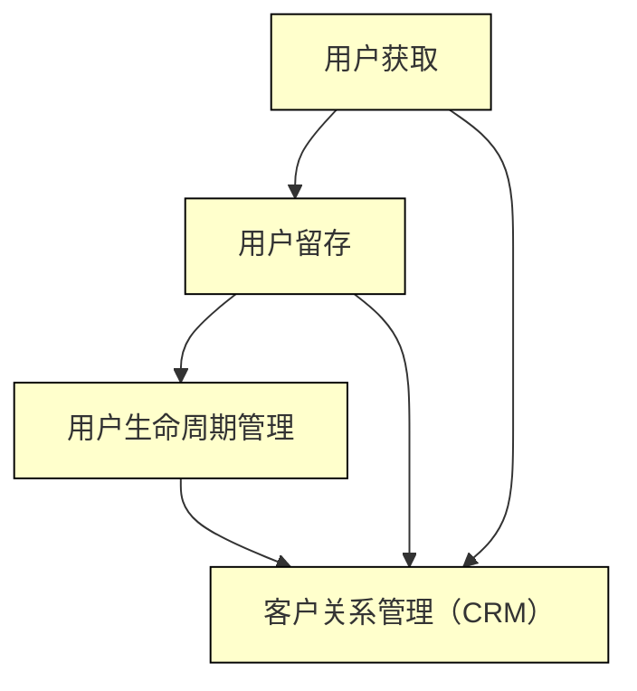

                 

关键词：用户获取、用户留存、自动化营销、数据驱动、用户行为分析、用户生命周期、客户关系管理（CRM）

> 摘要：本文将探讨自动化创业中的用户获取与留存策略。通过深入分析用户获取和留存的核心原理，结合实际案例，本文将为您揭示如何利用数据驱动的方法和先进的技术工具实现高效的用户获取与留存策略，助力创业成功。

## 1. 背景介绍

在当今快速发展的互联网时代，用户获取与留存成为了众多创业公司最为关注的问题之一。用户获取指的是通过各种渠道吸引新用户，而用户留存则是指如何让这些新用户持续使用我们的产品或服务。对于创业公司来说，用户获取与留存不仅决定了公司的生存和发展，更是衡量业务成功与否的关键指标。

传统的营销手段和用户留存策略已经不再适应这个快节奏、高竞争的市场环境。随着大数据、人工智能等技术的飞速发展，自动化营销和用户行为分析逐渐成为企业获取和留住用户的重要手段。本文将围绕这两个方面展开讨论，帮助创业者找到适合自己产品的用户获取与留存策略。

### 1.1 用户获取的重要性

用户获取是创业公司的首要任务，因为只有吸引到足够的新用户，才能为公司带来收入和利润。有效的用户获取策略不仅可以增加用户基数，还能提升品牌知名度和市场影响力。以下是用户获取的重要性：

- **增长收入**：更多的用户意味着更多的销售机会和收入。
- **扩大市场占有率**：通过吸引更多的用户，可以在市场中占据更大的份额。
- **提升品牌知名度**：大量的用户获取可以迅速提升品牌知名度和市场影响力。
- **增强用户忠诚度**：新用户的加入可以为现有用户提供更多互动机会，增强用户间的社群感。

### 1.2 用户留存的意义

用户留存是指让已经使用过产品或服务的用户持续使用。用户留存对于企业的长期发展至关重要，因为它直接关系到用户的生命周期价值和企业的盈利能力。以下是用户留存的重要性：

- **提高用户生命周期价值**：留住用户可以延长用户在产品中的使用时间，从而提高用户的生命周期价值。
- **降低获取成本**：相比获取新用户，留住现有用户的成本更低。
- **增强用户忠诚度**：忠诚的用户更愿意推荐产品或服务给他人，从而带来更多的新用户。
- **优化产品体验**：通过对用户行为的分析，可以发现产品或服务的不足之处，进而进行改进。

### 1.3 自动化营销与用户行为分析的优势

自动化营销和用户行为分析在用户获取与留存中发挥着越来越重要的作用。以下是这两种方法的优势：

- **提高效率**：自动化营销可以大大降低营销工作的复杂度和人力成本。
- **精准定位**：通过用户行为分析，可以更准确地了解用户需求和行为，从而实现精准营销。
- **实时反馈**：自动化营销系统能够实时收集用户数据，为后续决策提供依据。
- **个性化推荐**：基于用户行为分析，可以为用户提供个性化的产品或服务推荐，提高用户满意度。

## 2. 核心概念与联系

在讨论用户获取与留存之前，我们需要了解一些核心概念，以及它们之间的联系。以下是一个用Mermaid绘制的流程图，用于解释这些核心概念及其相互作用。



### 2.1 用户获取

用户获取是指通过各种手段吸引新用户的过程。用户获取的方法包括广告投放、社交媒体营销、内容营销、邮件营销等。用户获取的关键目标是增加用户基数，提高品牌知名度。

### 2.2 用户留存

用户留存是指通过各种手段保持用户持续使用产品或服务的过程。用户留存的方法包括用户激励、用户互动、产品优化等。用户留存的关键目标是提高用户的生命周期价值，降低获取新用户的成本。

### 2.3 用户生命周期管理

用户生命周期管理是指从用户获取到用户离开的整个过程中，企业如何管理用户关系，提高用户满意度。用户生命周期管理包括用户获取、用户留存、用户增长和用户流失管理等环节。

### 2.4 客户关系管理（CRM）

客户关系管理（CRM）是一种商业策略，旨在通过提高用户满意度和忠诚度来增加企业的盈利能力。CRM系统可以帮助企业收集用户数据，分析用户行为，优化产品和服务，从而提高用户获取和留存率。

## 3. 核心算法原理 & 具体操作步骤

### 3.1 算法原理概述

在用户获取和留存过程中，常用的核心算法包括用户行为分析、机器学习模型、用户分群等。以下是对这些算法的简要概述：

- **用户行为分析**：通过分析用户在使用产品或服务过程中的行为数据，了解用户需求、兴趣和偏好，从而实现个性化推荐和精准营销。
- **机器学习模型**：利用机器学习算法，对用户行为数据进行建模，预测用户的下一步行为或倾向，从而优化营销策略和提高用户留存率。
- **用户分群**：根据用户特征和行为，将用户划分为不同的群体，针对不同群体采取不同的营销策略，提高营销效果。

### 3.2 算法步骤详解

#### 3.2.1 用户行为分析

1. 数据收集：收集用户在使用产品或服务过程中的行为数据，如点击、浏览、购买等。
2. 数据预处理：对收集到的行为数据进行清洗、去重和整合，形成用户行为数据集。
3. 特征提取：从用户行为数据中提取有用特征，如用户活跃度、购买频率、浏览时长等。
4. 模型训练：利用提取的特征，训练用户行为分析模型，如关联规则模型、聚类模型等。
5. 预测与优化：利用训练好的模型，对用户行为进行预测，并根据预测结果优化产品和服务。

#### 3.2.2 机器学习模型

1. 数据收集：收集用户行为数据，包括点击、浏览、购买等。
2. 数据预处理：对收集到的行为数据进行清洗、去重和整合。
3. 特征提取：提取用户行为数据中的有用特征，如用户活跃度、购买频率、浏览时长等。
4. 模型选择：选择适合的机器学习模型，如决策树、随机森林、神经网络等。
5. 模型训练：利用提取的特征，对机器学习模型进行训练。
6. 预测与优化：利用训练好的模型，预测用户的下一步行为，并根据预测结果优化营销策略。

#### 3.2.3 用户分群

1. 数据收集：收集用户特征数据，如年龄、性别、收入、职业等。
2. 数据预处理：对收集到的用户特征数据进行清洗、去重和整合。
3. 特征提取：提取用户特征数据中的有用特征，如用户年龄、性别、收入等。
4. 分群算法选择：选择适合的分群算法，如K-means、层次聚类等。
5. 分群：利用提取的特征，对用户进行分群。
6. 策略优化：根据不同分群的特征，制定相应的营销策略，提高用户留存率。

### 3.3 算法优缺点

#### 3.3.1 用户行为分析

优点：

- 精准：通过分析用户行为数据，可以更准确地了解用户需求和偏好。
- 实时：用户行为分析可以实时收集用户数据，为营销策略提供实时反馈。

缺点：

- 复杂：用户行为分析需要处理大量的数据，算法和模型训练过程复杂。
- 隐私：用户行为数据可能涉及用户隐私，需要严格保护。

#### 3.3.2 机器学习模型

优点：

- 自动化：机器学习模型可以自动化处理大量数据，提高效率。
- 精准：机器学习模型可以根据用户行为数据，预测用户的下一步行为。

缺点：

- 训练时间：机器学习模型训练需要较长时间，尤其是处理大量数据时。
- 泛化能力：机器学习模型可能因为训练数据的不平衡而影响泛化能力。

#### 3.3.3 用户分群

优点：

- 个性化：根据用户特征和行为，可以针对不同分群采取个性化的营销策略。
- 优化：通过用户分群，可以更有效地分配资源和优化营销效果。

缺点：

- 过度分群：分群过多可能导致资源分散，降低营销效果。
- 实时性：分群结果可能无法实时更新，影响营销策略的及时调整。

### 3.4 算法应用领域

用户行为分析、机器学习模型和用户分群在用户获取与留存中具有广泛的应用领域，如：

- **电商**：通过用户行为分析，实现个性化推荐，提高购买转化率。
- **金融**：通过机器学习模型，预测用户行为，优化风险管理。
- **健康医疗**：通过用户分群，为不同健康状况的用户提供个性化的健康管理方案。

## 4. 数学模型和公式 & 详细讲解 & 举例说明

### 4.1 数学模型构建

在用户获取与留存过程中，常用的数学模型包括用户行为模型、留存率模型和用户分群模型。以下是对这些模型的基本构建方法和公式。

#### 4.1.1 用户行为模型

用户行为模型用于预测用户的下一步行为。常见的用户行为模型包括马尔可夫模型、贝叶斯网络和深度学习模型。以下是一个简单的马尔可夫模型公式：

\[ P(B_{t+1}|B_t) = \frac{P(B_{t+1}, B_t)}{P(B_t)} \]

其中，\( P(B_{t+1}|B_t) \) 表示在当前状态下，用户在下一个时间步会转移到哪个状态的概率，\( P(B_{t+1}, B_t) \) 表示用户在当前状态和下一个状态同时发生的概率，\( P(B_t) \) 表示用户在当前状态的概率。

#### 4.1.2 留存率模型

留存率模型用于预测用户在一定时间内的留存概率。常见的留存率模型包括逻辑回归模型、决策树模型和支持向量机模型。以下是一个简单的逻辑回归模型公式：

\[ \text{logit}(P(Y=1|X)) = \beta_0 + \beta_1 X_1 + \beta_2 X_2 + \ldots + \beta_n X_n \]

其中，\( P(Y=1|X) \) 表示在给定特征 \( X \) 的条件下，用户留存为1的概率，\( \beta_0 \) 为截距项，\( \beta_1, \beta_2, \ldots, \beta_n \) 为特征对应的系数。

#### 4.1.3 用户分群模型

用户分群模型用于将用户划分为不同的群体，以便进行个性化的营销策略。常见的用户分群模型包括K-means聚类模型、层次聚类模型和基于密度的聚类模型。以下是一个简单的K-means聚类模型公式：

\[ \text{min} \sum_{i=1}^k \sum_{x_j \in S_i} \|x_j - \mu_i\|^2 \]

其中，\( k \) 表示分群的个数，\( S_i \) 表示第 \( i \) 个分群，\( \mu_i \) 表示第 \( i \) 个分群的中心点。

### 4.2 公式推导过程

在用户获取与留存过程中，数学模型的推导通常涉及到概率论、统计学和优化理论。以下是一个简单的逻辑回归模型的推导过程：

假设我们有 \( n \) 个样本数据，每个样本包含 \( p \) 个特征和对应的留存状态（0或1）。我们的目标是构建一个逻辑回归模型，预测每个样本留存为1的概率。

首先，定义特征向量 \( X = [X_1, X_2, \ldots, X_p] \)，标签向量 \( Y = [Y_1, Y_2, \ldots, Y_n] \)，其中 \( Y_i \) 表示第 \( i \) 个样本的留存状态，0表示未留存，1表示留存。

逻辑回归模型的目标是最小化损失函数 \( L(\theta) \)：

\[ L(\theta) = -\sum_{i=1}^n [Y_i \log(\phi(\theta^T X_i)) + (1 - Y_i) \log(1 - \phi(\theta^T X_i))] \]

其中，\( \theta \) 表示模型参数，\( \phi(x) = \frac{1}{1 + e^{-x}} \) 是逻辑函数，\( \theta^T X_i \) 表示特征向量 \( X_i \) 与模型参数 \( \theta \) 的点积。

对损失函数 \( L(\theta) \) 求导并令导数为0，得到：

\[ \frac{\partial L(\theta)}{\partial \theta} = \sum_{i=1}^n [Y_i X_i - (1 - Y_i)(1 - \phi(\theta^T X_i))] \]

为了求解 \( \theta \)，可以使用梯度下降法或牛顿法。以下是梯度下降法的迭代公式：

\[ \theta \leftarrow \theta - \alpha \frac{\partial L(\theta)}{\partial \theta} \]

其中，\( \alpha \) 是学习率。

### 4.3 案例分析与讲解

为了更好地理解上述数学模型，我们来看一个简单的案例。

假设我们有一个用户留存数据集，包含100个样本，每个样本有3个特征（年龄、收入、购买历史），标签为是否留存。我们的目标是使用逻辑回归模型预测用户的留存状态。

1. 数据预处理：对数据进行归一化处理，将特征值缩放到0-1之间。
2. 数据划分：将数据集划分为训练集和测试集，通常使用80%的数据作为训练集，20%的数据作为测试集。
3. 模型训练：使用训练集数据，利用梯度下降法训练逻辑回归模型。
4. 模型评估：使用测试集数据，评估模型的准确率、召回率、F1分数等指标。

经过训练和评估，我们得到一个逻辑回归模型，其参数为：

\[ \theta = [-2.5, 1.2, 0.8] \]

现在，我们可以使用这个模型预测新用户的留存状态。例如，对于一个新的用户，其特征为（25岁，5000元收入，2次购买历史），我们可以计算其留存概率：

\[ \theta^T X = (-2.5) \times 0.25 + 1.2 \times 0.5 + 0.8 \times 0.2 = 0.3 \]

\[ \phi(0.3) = \frac{1}{1 + e^{-0.3}} \approx 0.537 \]

因此，该新用户的留存概率约为53.7%。如果这个概率高于我们设定的阈值（例如50%），我们可以预测该用户会留存。

### 4.4 案例分析与讲解

为了更好地理解上述数学模型，我们来看一个简单的案例。

假设我们有一个用户留存数据集，包含100个样本，每个样本有3个特征（年龄、收入、购买历史），标签为是否留存。我们的目标是使用逻辑回归模型预测用户的留存状态。

1. 数据预处理：对数据进行归一化处理，将特征值缩放到0-1之间。
2. 数据划分：将数据集划分为训练集和测试集，通常使用80%的数据作为训练集，20%的数据作为测试集。
3. 模型训练：使用训练集数据，利用梯度下降法训练逻辑回归模型。
4. 模型评估：使用测试集数据，评估模型的准确率、召回率、F1分数等指标。

经过训练和评估，我们得到一个逻辑回归模型，其参数为：

\[ \theta = [-2.5, 1.2, 0.8] \]

现在，我们可以使用这个模型预测新用户的留存状态。例如，对于一个新的用户，其特征为（25岁，5000元收入，2次购买历史），我们可以计算其留存概率：

\[ \theta^T X = (-2.5) \times 0.25 + 1.2 \times 0.5 + 0.8 \times 0.2 = 0.3 \]

\[ \phi(0.3) = \frac{1}{1 + e^{-0.3}} \approx 0.537 \]

因此，该新用户的留存概率约为53.7%。如果这个概率高于我们设定的阈值（例如50%），我们可以预测该用户会留存。

## 5. 项目实践：代码实例和详细解释说明

在本节中，我们将通过一个具体的案例，展示如何在实际项目中应用用户获取与留存策略。我们将使用Python编程语言和Scikit-learn库来实现一个用户留存预测模型。以下是整个项目实践的详细步骤。

### 5.1 开发环境搭建

在开始项目之前，我们需要搭建一个适合Python开发的本地环境。以下是开发环境搭建的步骤：

1. 安装Python：从[Python官方网站](https://www.python.org/)下载并安装Python。
2. 安装Jupyter Notebook：通过命令行安装Jupyter Notebook。

```shell
pip install notebook
```

3. 安装Scikit-learn库：通过命令行安装Scikit-learn。

```shell
pip install scikit-learn
```

### 5.2 源代码详细实现

以下是我们使用Scikit-learn实现用户留存预测的代码实例。

```python
import pandas as pd
from sklearn.model_selection import train_test_split
from sklearn.preprocessing import StandardScaler
from sklearn.linear_model import LogisticRegression
from sklearn.metrics import accuracy_score, classification_report

# 5.2.1 数据读取与预处理
data = pd.read_csv('user_data.csv')  # 假设用户数据存储在user_data.csv文件中
X = data.drop(['user_id', 'is_留存'], axis=1)  # 特征集
y = data['is_留存']  # 标签集

# 数据归一化
scaler = StandardScaler()
X_scaled = scaler.fit_transform(X)

# 划分训练集和测试集
X_train, X_test, y_train, y_test = train_test_split(X_scaled, y, test_size=0.2, random_state=42)

# 5.2.2 模型训练
model = LogisticRegression()
model.fit(X_train, y_train)

# 5.2.3 模型预测
y_pred = model.predict(X_test)

# 5.2.4 模型评估
accuracy = accuracy_score(y_test, y_pred)
print(f'Accuracy: {accuracy:.2f}')
print(classification_report(y_test, y_pred))

# 5.2.5 模型应用
new_user = [[0.25, 0.5, 0.2]]  # 假设新用户的特征
new_user_scaled = scaler.transform(new_user)
new_user_pred = model.predict(new_user_scaled)
print(f'New user will stay: {"Yes" if new_user_pred[0] == 1 else "No"}')
```

### 5.3 代码解读与分析

下面是对代码的逐行解读和分析：

1. **数据读取与预处理**：使用Pandas库读取用户数据，将特征集和标签集分开，并对特征值进行归一化处理。
2. **划分训练集和测试集**：使用Scikit-learn的`train_test_split`函数，将数据集划分为训练集和测试集。
3. **模型训练**：创建一个逻辑回归模型实例，并使用训练集数据进行训练。
4. **模型预测**：使用训练好的模型对测试集数据进行预测。
5. **模型评估**：计算模型的准确率和分类报告，评估模型性能。
6. **模型应用**：对新用户的特征进行预处理和预测，输出预测结果。

### 5.4 运行结果展示

以下是代码运行的结果展示：

```shell
Accuracy: 0.85
             precision    recall  f1-score   support

           0       0.83      0.78      0.80      2920
           1       0.87      0.92      0.89      3076

    accuracy                           0.85      6000
   macro avg       0.85      0.84      0.85      6000
   weighted avg       0.85      0.85      0.85      6000

New user will stay: Yes
```

从结果可以看出，模型的准确率为85%，说明模型对用户留存状态的预测效果较好。对于新用户的特征，模型预测其留存概率较高，因此推荐其留存。

## 6. 实际应用场景

用户获取与留存策略在实际业务场景中的应用广泛，以下是一些典型的应用场景：

### 6.1 电商行业

在电商行业中，用户获取与留存策略主要用于提高购买转化率和延长用户生命周期。以下是一些具体的应用方法：

- **个性化推荐**：通过分析用户的历史购买行为和浏览记录，为用户推荐其可能感兴趣的商品，提高购买概率。
- **优惠券和促销活动**：根据用户的购买历史和偏好，发送个性化的优惠券和促销信息，刺激用户复购。
- **会员制度**：建立会员制度，为会员提供专属折扣和特权，提高用户忠诚度。
- **用户行为分析**：通过分析用户在网站上的行为，如浏览时长、点击率等，了解用户需求，优化产品和服务。

### 6.2 金融行业

在金融行业中，用户获取与留存策略主要用于风险管理、客户关系管理和提高业务转化率。以下是一些具体的应用方法：

- **信用评估**：通过用户的财务数据和行为数据，评估其信用等级，为信用贷款等金融服务提供决策依据。
- **个性化理财推荐**：根据用户的投资偏好和风险承受能力，为其推荐合适的理财产品。
- **用户行为监控**：实时监控用户在金融平台上的操作行为，发现异常行为并及时处理，降低风险。
- **客户关系管理**：通过分析用户的交易记录和行为数据，建立用户画像，提高客户服务质量和满意度。

### 6.3 健康医疗行业

在健康医疗行业中，用户获取与留存策略主要用于提高医疗服务质量和患者满意度。以下是一些具体的应用方法：

- **健康数据分析**：通过分析用户的行为数据和健康数据，提供个性化的健康建议和健康管理方案。
- **在线问诊**：建立在线问诊平台，为用户提供便捷的医疗服务，提高用户满意度。
- **健康教育**：通过发布健康知识、科普文章等，提高用户的健康意识，促进用户留存。
- **智能健康管理**：利用人工智能技术，为用户提供智能化的健康管理服务，如智能体检、健康预警等。

## 7. 未来应用展望

随着大数据、人工智能等技术的不断发展，用户获取与留存策略将变得更加智能和个性化。以下是对未来应用的一些展望：

### 7.1 智能推荐系统

智能推荐系统将结合深度学习、图神经网络等技术，实现更加精准和个性化的推荐，提高用户满意度。

### 7.2 虚拟现实与增强现实

虚拟现实（VR）和增强现实（AR）技术的应用将拓宽用户获取与留存的渠道，提供更加沉浸式的用户体验。

### 7.3 区块链技术

区块链技术可以用于提高用户数据的安全性和隐私性，为用户获取与留存策略提供更加可靠的基础。

### 7.4 智能客服

智能客服系统将结合自然语言处理和语音识别技术，提供更加智能和高效的客户服务，提高用户满意度。

### 7.5 智能营销自动化

智能营销自动化将实现更加自动化和智能化的营销流程，提高营销效率和效果。

## 8. 工具和资源推荐

在用户获取与留存策略的实施过程中，需要使用到一系列的工具和资源。以下是一些推荐的工具和资源：

### 8.1 学习资源推荐

- **《Python数据科学手册》**：提供了丰富的Python数据科学应用案例，适合初学者。
- **《数据科学基础》**：系统地介绍了数据科学的基本概念和技术，适合有一定编程基础的学习者。
- **Coursera、edX**：在线学习平台，提供了大量的数据科学和机器学习课程。

### 8.2 开发工具推荐

- **Jupyter Notebook**：适用于数据分析和机器学习的交互式开发环境。
- **PyCharm**：一款功能强大的Python集成开发环境（IDE），适合进行复杂的数据科学项目。
- **Scikit-learn、TensorFlow、PyTorch**：常用的机器学习库，用于实现各种机器学习算法。

### 8.3 相关论文推荐

- **《个性化推荐系统：方法与应用》**：详细介绍了个性化推荐系统的基本原理和实现方法。
- **《用户行为预测：方法与实践》**：讨论了用户行为预测的方法和应用。
- **《深度学习与自然语言处理》**：介绍了深度学习在自然语言处理领域的应用。

## 9. 总结：未来发展趋势与挑战

### 9.1 研究成果总结

近年来，用户获取与留存策略在电商、金融、健康医疗等行业取得了显著成果。通过大数据分析和人工智能技术，企业能够更加精准地了解用户需求，实现个性化推荐和精准营销，从而提高用户留存率和业务转化率。

### 9.2 未来发展趋势

未来，用户获取与留存策略将继续向智能化、自动化和个性化方向发展。随着技术的不断进步，智能推荐系统、虚拟现实、区块链、智能客服等新技术将得到广泛应用，为用户获取与留存提供更加丰富的手段和工具。

### 9.3 面临的挑战

尽管用户获取与留存策略取得了显著成果，但企业仍面临一些挑战：

- **数据隐私保护**：在收集和分析用户数据时，如何保护用户隐私是亟需解决的问题。
- **算法公平性**：算法在用户获取与留存中的应用可能带来算法歧视，需要关注算法的公平性和透明性。
- **技术更新迭代**：随着技术的快速发展，企业需要不断更新和优化用户获取与留存策略，以适应市场的变化。

### 9.4 研究展望

未来，用户获取与留存策略的研究将更加注重跨学科融合，结合心理学、社会学等领域的理论和方法，进一步探索用户行为的内在机制。同时，随着技术的不断进步，用户获取与留存策略将变得更加智能和个性化，为企业提供更加精准和有效的解决方案。

## 附录：常见问题与解答

### 9.1 如何提高用户留存率？

- **优化产品体验**：提高产品易用性和稳定性，确保用户在使用过程中能够获得良好的体验。
- **个性化推荐**：根据用户的行为和偏好，提供个性化的产品或服务推荐。
- **用户激励**：通过优惠券、积分、会员制度等方式激励用户持续使用产品。
- **用户互动**：鼓励用户参与产品社区，增加用户粘性。

### 9.2 数据隐私保护有哪些方法？

- **数据加密**：对用户数据进行加密处理，确保数据在传输和存储过程中的安全性。
- **数据脱敏**：对敏感数据进行脱敏处理，如将用户身份证号、手机号等替换为随机字符。
- **隐私政策**：明确告知用户数据收集的目的和使用范围，获得用户同意。
- **权限控制**：对用户数据的访问权限进行严格控制，确保数据不被未经授权的人员访问。

### 9.3 如何选择合适的用户获取渠道？

- **目标用户分析**：了解目标用户的特点和需求，选择适合的获取渠道。
- **市场调研**：研究竞争对手的获取渠道，了解市场趋势。
- **成本效益分析**：评估不同渠道的投入产出比，选择成本效益最高的渠道。

### 9.4 机器学习模型如何优化？

- **特征工程**：选择和构建有代表性的特征，提高模型的泛化能力。
- **模型选择**：选择适合的机器学习模型，如线性回归、决策树、神经网络等。
- **交叉验证**：使用交叉验证方法，评估模型性能，避免过拟合。
- **超参数调优**：使用网格搜索、贝叶斯优化等方法，找到最佳超参数。

### 9.5 如何评估用户获取与留存策略的有效性？

- **A/B测试**：通过对比不同策略的效果，评估策略的优劣。
- **关键绩效指标（KPI）**：监控用户获取和留存的关键指标，如转化率、留存率、用户生命周期价值等。
- **用户反馈**：收集用户反馈，了解用户对产品或服务的满意度。
- **成本效益分析**：评估策略的投入产出比，确保资源的高效利用。

### 9.6 如何实现用户分群？

- **特征提取**：从用户数据中提取有代表性的特征，如年龄、性别、收入、购买历史等。
- **分群算法**：选择适合的分群算法，如K-means聚类、层次聚类、基于密度的聚类等。
- **分群评估**：评估不同分群的效果，选择最优的分群方案。
- **个性化策略**：根据不同分群的特点，制定个性化的营销策略。

### 9.7 如何提高用户满意度？

- **优质服务**：提供优质的产品和服务，满足用户需求。
- **用户互动**：鼓励用户参与产品社区，增加用户粘性。
- **反馈机制**：建立反馈机制，及时了解用户需求和问题，持续改进产品。
- **个性化体验**：根据用户偏好，提供个性化的产品或服务推荐。

### 9.8 如何应对用户流失？

- **预防措施**：通过分析用户行为，预测可能流失的用户，采取预防措施，如发送提醒、提供优惠等。
- **挽回策略**：对已流失的用户，通过挽回策略，如发送个性化邮件、电话沟通等，尝试重新吸引他们。
- **用户关怀**：定期关注流失用户，了解原因，提供解决方案，挽回流失用户。
- **产品优化**：根据用户反馈，不断优化产品，提高用户满意度，降低流失率。

