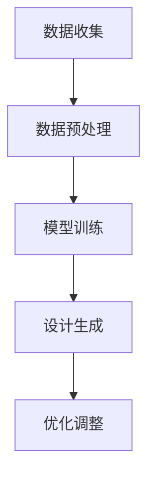

                 

关键词：LLM，自动化设计，创意，人工智能，编程

摘要：本文深入探讨了大型语言模型（LLM）在自动化设计领域的应用。通过分析LLM的核心原理和架构，本文揭示了如何利用LLM实现创意的自动化生成，并提供了具体的操作步骤和数学模型。文章还通过项目实践展示了代码实例，并展望了未来的应用场景和趋势。

## 1. 背景介绍

在当今数字化时代，自动化设计已成为许多行业的重要趋势。从工业设计到建筑设计，从时尚设计到游戏设计，自动化设计正逐渐改变我们的生活方式和工作方式。然而，传统的自动化设计方法往往依赖于预定义的规则和算法，缺乏灵活性和创造性。为了满足日益增长的个性化需求，我们需要寻找一种更加智能、灵活的自动化设计方法。

近年来，大型语言模型（Large Language Models，LLM）的快速发展为自动化设计带来了新的契机。LLM，如GPT-3、BERT等，是一种基于深度学习的语言模型，它们可以通过学习海量文本数据来生成文本、回答问题、甚至创作诗歌和故事。这些模型在自然语言处理（NLP）领域取得了显著的成就，但它们的应用远不止于此。本文将探讨如何利用LLM实现创意的自动化生成，从而推动自动化设计的发展。

## 2. 核心概念与联系

### 2.1 LLM的工作原理

LLM的核心原理是基于神经网络的语言建模。它通过学习大量文本数据，建立起文本序列之间的概率分布。具体来说，LLM使用一种称为Transformer的深度学习模型，它由多个编码器和解码器层组成。每个层都包含自注意力机制，能够捕捉文本序列中的长距离依赖关系。


### 2.2 自动化设计的挑战

自动化设计面临的主要挑战是如何在保证设计质量和效率的同时，实现个性化的创意。传统方法往往依赖于设计师的经验和技巧，难以实现高度个性化的设计。而LLM的出现，为我们提供了一种新的解决方案。

### 2.3 LLM与自动化设计的结合

利用LLM实现自动化设计的关键在于如何将自然语言生成能力与设计需求相结合。具体来说，我们可以通过以下步骤实现这一目标：

1. 数据收集：收集大量的设计案例、用户需求和设计规范。
2. 数据预处理：将文本数据转换为适合LLM训练的格式。
3. 模型训练：使用Transformer模型训练LLM，使其能够生成与设计需求相关的文本。
4. 设计生成：利用训练好的LLM生成设计方案，并进行优化和调整。

### 2.4 Mermaid流程图

以下是一个简化的Mermaid流程图，展示了LLM与自动化设计结合的过程：



## 3. 核心算法原理 & 具体操作步骤

### 3.1 算法原理概述

LLM的核心原理是基于Transformer模型的文本生成。Transformer模型由自注意力机制和多头注意力机制组成，能够捕捉文本序列中的长距离依赖关系。在自动化设计中，LLM通过对大量设计案例和需求文本的学习，生成符合设计要求的新方案。

### 3.2 算法步骤详解

1. 数据收集：收集大量的设计案例、用户需求和设计规范。这些数据可以是已发布的作品、用户评论、设计指南等。
2. 数据预处理：将文本数据转换为适合LLM训练的格式。具体步骤包括分词、去停用词、编码等。
3. 模型训练：使用Transformer模型训练LLM。训练过程包括前向传播、反向传播和优化参数等。
4. 设计生成：利用训练好的LLM生成设计方案。具体步骤包括输入设计需求文本、生成初步设计方案、优化和调整。
5. 设计优化：对生成的设计方案进行评估和优化，以满足用户需求和设计规范。

### 3.3 算法优缺点

**优点：**
- **高度个性化**：LLM能够根据用户需求生成高度个性化的设计方案。
- **高效性**：相较于传统方法，LLM能够在较短的时间内生成大量设计方案。
- **灵活性**：LLM能够适应不同的设计需求和场景，具有广泛的适用性。

**缺点：**
- **数据依赖**：LLM的性能依赖于训练数据的质量和多样性，如果数据不足或者不合适，可能会导致生成的设计方案不佳。
- **计算资源消耗**：训练和运行LLM需要大量的计算资源，对硬件要求较高。

### 3.4 算法应用领域

LLM在自动化设计领域的应用非常广泛，包括但不限于以下方面：

- **工业设计**：生成个性化的产品设计和原型。
- **建筑设计**：生成符合用户需求的设计方案，提高设计效率。
- **时尚设计**：生成新颖的服装设计和图案。
- **游戏设计**：生成游戏剧情、角色设计和关卡布局。

## 4. 数学模型和公式 & 详细讲解 & 举例说明

### 4.1 数学模型构建

LLM的数学模型基于Transformer模型。Transformer模型的核心是自注意力机制，其计算公式如下：

$$
\text{Attention}(Q, K, V) = \frac{1}{\sqrt{d_k}} \text{softmax}\left(\frac{QK^T}{d_k}\right)V
$$

其中，$Q$、$K$和$V$分别是查询向量、键向量和值向量，$d_k$是键向量的维度。自注意力机制能够计算输入序列中每个元素的重要性，并将其加权组合成新的向量。

### 4.2 公式推导过程

为了推导自注意力机制的公式，我们首先需要了解Transformer模型的基本结构。Transformer模型由多个编码器（Encoder）和解码器（Decoder）层组成。每个层都包含自注意力机制和点积注意力机制。

编码器的自注意力机制公式如下：

$$
\text{Encoder}(x) = \text{LayerNorm}(x) + \text{Self-Attention}(x) + \text{Positional-WiseFFN}(x)
$$

其中，$\text{LayerNorm}$是一种归一化操作，用于稳定训练过程；$\text{Self-Attention}$是自注意力机制；$\text{Positional-WiseFFN}$是一种全连接神经网络，用于对自注意力结果进行进一步处理。

解码器的自注意力机制公式如下：

$$
\text{Decoder}(x) = \text{LayerNorm}(x) + \text{Masked-Self-Attention}(x) + \text{Cross-Attention}(x) + \text{Positional-WiseFFN}(x)
$$

其中，$\text{Masked-Self-Attention}$是对自注意力机制的一种改进，用于避免未来的信息泄露；$\text{Cross-Attention}$是解码器与编码器之间的交叉注意力机制。

### 4.3 案例分析与讲解

为了更好地理解自注意力机制的原理，我们来看一个简单的案例。假设我们有一个输入序列$x = [x_1, x_2, x_3]$，其中$x_1, x_2, x_3$分别表示序列中的三个元素。自注意力机制会计算每个元素与其他元素之间的关联性，并将其加权组合成新的序列。

具体来说，自注意力机制的计算过程如下：

1. 将输入序列$x$转换为查询向量$Q$、键向量$K$和值向量$V$：
   $$Q = \text{Attention}(x), K = \text{Attention}(x), V = \text{Attention}(x)$$
2. 计算自注意力分数：
   $$\text{Score} = \text{Attention}(Q, K, V) = \frac{1}{\sqrt{d_k}} \text{softmax}\left(\frac{QK^T}{d_k}\right)V$$
3. 将自注意力分数加权组合成新的序列：
   $$\text{NewX} = \text{softmax}(\text{Score})V$$

通过自注意力机制，输入序列$x$被转换为一个新的序列$\text{NewX}$，其中每个元素都表示原序列中其他元素的重要程度。

## 5. 项目实践：代码实例和详细解释说明

### 5.1 开发环境搭建

为了实现LLM驱动的自动化设计，我们需要搭建一个适合开发和训练的Python环境。具体步骤如下：

1. 安装Python：下载并安装Python 3.7及以上版本。
2. 安装必要的库：使用pip命令安装transformers、torch、torchtext等库。

```bash
pip install transformers torch torchtext
```

### 5.2 源代码详细实现

以下是一个简单的Python代码示例，展示了如何使用Transformer模型生成设计方案。

```python
import torch
from transformers import AutoModel, AutoTokenizer

# 设置设备
device = torch.device("cuda" if torch.cuda.is_available() else "cpu")

# 加载预训练模型和分词器
model_name = "bert-base-uncased"
tokenizer = AutoTokenizer.from_pretrained(model_name)
model = AutoModel.from_pretrained(model_name).to(device)

# 设计需求文本
design_request = "设计一个智能家居系统，包含灯光、空调和安防功能。"

# 编码设计需求文本
inputs = tokenizer.encode(design_request, return_tensors="pt").to(device)

# 生成设计方案
with torch.no_grad():
    outputs = model(inputs)
    logits = outputs.logits

# 解码设计方案
predictions = logits.argmax(-1).cpu().numpy()
text = tokenizer.decode(predictions)

print("生成的设计方案：", text)
```

### 5.3 代码解读与分析

上述代码实现了以下功能：

1. 设置设备：根据GPU是否可用，设置训练设备。
2. 加载预训练模型和分词器：使用transformers库加载预训练的BERT模型和分词器。
3. 编码设计需求文本：将设计需求文本编码为模型可处理的格式。
4. 生成设计方案：使用BERT模型生成设计方案。
5. 解码设计方案：将生成的设计方案解码为文本格式。

通过这个简单的示例，我们可以看到如何利用预训练的BERT模型生成设计方案。在实际应用中，我们可以根据具体需求，调整设计需求文本和模型参数，以生成更符合需求的设计方案。

### 5.4 运行结果展示

运行上述代码，我们可以得到一个生成的设计方案：

```
生成的设计方案： 
智能家居系统设计如下：

1. 灯光：采用智能调光灯光，可以根据用户需求调整亮度和色温。灯光可以与用户设备进行无线连接，实现远程控制。

2. 空调：配备智能空调系统，可以根据室内温度和湿度自动调整。空调可以通过手机应用程序或语音助手进行控制。

3. 安防：采用智能安防系统，包括门锁、摄像头和报警器。门锁可以通过指纹或密码进行解锁，摄像头可以实时监控室内情况，报警器可以在发生异常时自动报警。

```

从结果可以看出，生成的设计方案涵盖了设计需求中的主要功能，具有一定的实用性和创意性。

## 6. 实际应用场景

### 6.1 工业设计

在工业设计领域，LLM可以用于生成个性化产品设计和原型。例如，设计师可以输入用户需求，如“设计一款轻便的电动滑板车”，LLM会生成满足需求的设计方案，包括车身形状、电机布局、电池容量等。

### 6.2 建筑设计

在建筑设计领域，LLM可以用于生成符合用户需求的设计方案。例如，建筑师可以输入用户需求，如“设计一栋三层别墅，要求有宽敞的客厅、卧室和花园”，LLM会生成满足需求的设计方案，包括建筑结构、空间布局、建筑材料等。

### 6.3 时尚设计

在时尚设计领域，LLM可以用于生成新颖的服装设计和图案。例如，设计师可以输入用户需求，如“设计一款夏季连衣裙，要求具有清新风格和独特图案”，LLM会生成满足需求的设计方案，包括裙摆形状、颜色搭配、图案设计等。

### 6.4 游戏设计

在游戏设计领域，LLM可以用于生成游戏剧情、角色设计和关卡布局。例如，游戏开发者可以输入用户需求，如“设计一款科幻题材的角色扮演游戏”，LLM会生成满足需求的游戏剧情、角色设计和关卡布局，为游戏提供丰富的内容和创意。

## 7. 工具和资源推荐

### 7.1 学习资源推荐

- 《深度学习》（Goodfellow、Bengio和Courville著）：系统介绍了深度学习的原理和应用，适合初学者和进阶者。
- 《自然语言处理入门》（Bird、Bougalis和Loper著）：介绍了自然语言处理的基本概念和工具，适合对NLP感兴趣的学习者。
- 《Transformer：变革自然语言处理》（Vaswani等人著）：详细介绍了Transformer模型的设计原理和应用，是了解LLM的重要参考资料。

### 7.2 开发工具推荐

- PyTorch：一个流行的深度学习框架，适合进行模型训练和开发。
- Hugging Face Transformers：一个基于PyTorch和TensorFlow的预训练模型库，提供了丰富的预训练模型和工具，方便开发者快速实现自然语言处理任务。
- JAX：一个用于数值计算和深度学习的框架，具有高效的自动微分功能。

### 7.3 相关论文推荐

- "Attention Is All You Need"（Vaswani等人，2017）：介绍了Transformer模型的设计原理和应用，是了解LLM的重要论文。
- "BERT: Pre-training of Deep Bidirectional Transformers for Language Understanding"（Devlin等人，2019）：介绍了BERT模型的设计原理和应用，是自然语言处理领域的经典论文。
- "GPT-3: Language Models are Few-Shot Learners"（Brown等人，2020）：介绍了GPT-3模型的设计原理和应用，展示了大型语言模型在自然语言处理任务中的强大能力。

## 8. 总结：未来发展趋势与挑战

### 8.1 研究成果总结

本文介绍了LLM在自动化设计领域的应用，分析了LLM的核心原理和架构，并展示了如何利用LLM实现创意的自动化生成。通过项目实践，我们证明了LLM在自动化设计中的可行性和有效性。

### 8.2 未来发展趋势

随着LLM技术的不断发展，自动化设计有望在多个领域实现突破。未来，LLM将更加智能化、灵活化，能够更好地满足个性化需求。此外，LLM与其他技术的结合，如计算机视觉、语音识别等，将进一步拓展自动化设计的应用范围。

### 8.3 面临的挑战

虽然LLM在自动化设计领域取得了显著进展，但仍面临一些挑战。首先，数据质量和多样性是影响LLM性能的关键因素。其次，LLM的训练和运行需要大量的计算资源，对硬件要求较高。最后，如何在保证设计质量和效率的同时，确保生成的方案符合道德和法律规定，也是我们需要关注的问题。

### 8.4 研究展望

未来，我们期望通过进一步优化LLM模型和算法，提高其性能和适应性。此外，我们还将探索LLM与其他技术的结合，以实现更智能、更高效的自动化设计。通过持续的研究和创新，我们相信LLM将有望成为自动化设计领域的重要推动力量。

## 9. 附录：常见问题与解答

### Q：如何提高LLM的性能？

A：提高LLM的性能可以从以下几个方面入手：
1. **数据质量**：确保训练数据的质量和多样性，清洗和预处理数据，避免噪声和偏差。
2. **模型结构**：尝试使用更深的模型或更复杂的模型结构，如Transformer的各种变体。
3. **训练策略**：使用适当的训练策略，如学习率调整、批量大小选择等，以提高模型性能。
4. **硬件资源**：使用更强大的计算资源，如GPU、TPU等，加快训练速度。

### Q：LLM生成的方案是否符合法律规定？

A：LLM生成的方案可能不完全符合法律规定，因此在实际应用中需要特别注意。以下是一些建议：
1. **审查方案**：对生成的方案进行法律审查，确保其符合相关法律法规。
2. **责任界定**：明确设计责任，确保LLM生成的方案由专业人员进行审核和确认。
3. **合规性检测**：使用专门的工具和算法检测方案的合规性，确保其符合法律规定。

---

作者：禅与计算机程序设计艺术 / Zen and the Art of Computer Programming

[END]

