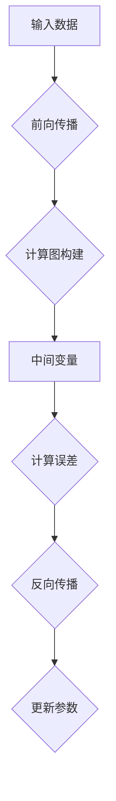

                 

 **关键词：** 自动微分、PyTorch、JAX、深度学习、计算图、反向传播

**摘要：** 本文深入探讨自动微分在深度学习中的应用，特别是PyTorch与JAX这两个框架如何实现自动微分，以及它们的核心魔法和优势。通过详细的算法原理、数学模型、项目实践和未来展望，读者将了解自动微分在现实中的应用和潜在的发展方向。

## 1. 背景介绍

深度学习作为人工智能领域的重要分支，已经取得了显著的成果。从图像识别、自然语言处理到强化学习，深度学习模型在各种任务中展现了强大的能力。然而，深度学习模型的训练过程需要大量的计算资源，并且涉及复杂的数学运算，其中自动微分（Automatic Differentiation，AD）技术是深度学习算法实现高效训练的关键。

自动微分是一种数值计算方法，它通过符号计算和数值计算的结合，自动计算函数的导数。在深度学习框架中，自动微分能够帮助我们简化复杂的导数计算过程，使得模型训练更加高效和准确。本文将重点探讨PyTorch和JAX这两个流行的深度学习框架如何实现自动微分，并分析它们的核心魔法和优势。

## 2. 核心概念与联系

### 2.1 自动微分的概念

自动微分是指在不显式编写导数计算代码的情况下，自动计算函数的导数。它可以分为前向自动微分和反向自动微分两种形式。

- **前向自动微分（Forward AD）：** 通过计算函数的值，间接地计算导数。这种方法通常适用于数值稳定的函数。
- **反向自动微分（Backward AD）：** 通过计算函数的误差反向传播，递归地计算导数。这种方法在深度学习框架中应用广泛，因为深度学习模型的反向传播过程就是反向自动微分的实现。

### 2.2 计算图

计算图（Computational Graph）是自动微分的核心概念之一。在深度学习框架中，计算图表示模型的前向传播过程，其中每个节点代表一个中间变量，每条边表示变量之间的依赖关系。通过构建计算图，我们可以方便地实现自动微分。

### 2.3 Mermaid 流程图

为了更直观地理解自动微分的概念，我们使用Mermaid流程图来展示计算图和自动微分的过程。



在上面的流程图中，输入数据经过前向传播生成中间变量，计算图构建表示自动微分的过程，误差计算和反向传播用于更新模型参数。通过这个过程，我们可以看到自动微分在深度学习模型训练中的重要性。

## 3. 核心算法原理 & 具体操作步骤

### 3.1 算法原理概述

自动微分算法的原理可以归结为两个步骤：计算图的构建和导数的计算。

- **计算图的构建：** 在前向传播过程中，我们将每个中间变量表示为计算图的节点，每条依赖关系表示为计算图的边。通过这种方式，我们可以将复杂的计算过程可视化，并为后续的导数计算提供基础。
- **导数的计算：** 在计算图中，每个节点的导数可以通过递归地计算相邻节点的导数来得到。在反向传播过程中，我们从输出节点开始，逐步计算每个节点的导数，直到输入节点。这个过程类似于一个反向的梯度流，因此被称为反向传播。

### 3.2 算法步骤详解

下面我们详细讲解自动微分的具体步骤。

#### 步骤 1：前向传播

在前向传播过程中，我们根据输入数据和模型参数计算中间变量。每个中间变量的计算都可以表示为计算图的节点，节点之间的依赖关系则表示为计算图的边。

#### 步骤 2：计算图构建

在构建计算图时，我们需要将每个中间变量表示为计算图的节点，并将它们之间的依赖关系表示为计算图的边。这个过程可以通过深度学习框架自动完成，例如PyTorch和JAX。

#### 步骤 3：导数计算

在计算图中，每个节点的导数可以通过递归地计算相邻节点的导数来得到。在反向传播过程中，我们从输出节点开始，逐步计算每个节点的导数，直到输入节点。

#### 步骤 4：参数更新

在得到每个节点的导数后，我们可以根据损失函数对模型参数进行更新。这个过程可以通过梯度下降或其他优化算法实现。

### 3.3 算法优缺点

自动微分算法具有以下优点：

- **高效性：** 自动微分的计算过程比手写导数代码更加高效，因为它可以自动处理复杂的导数计算。
- **准确性：** 自动微分的计算过程更加准确，因为它避免了手动编写导数代码时可能出现的错误。

然而，自动微分算法也存在一些缺点：

- **可读性：** 自动微分算法的代码可读性较差，因为它涉及到计算图的构建和导数的计算，这增加了代码的复杂度。
- **性能：** 自动微分的性能可能不如手写优化的代码，因为它需要额外的计算资源来构建和计算计算图。

### 3.4 算法应用领域

自动微分算法在深度学习领域应用广泛，特别是在以下几个方面：

- **模型训练：** 自动微分可以用于计算深度学习模型的梯度，从而实现模型的训练。
- **优化算法：** 自动微分可以用于实现各种优化算法，如梯度下降、随机梯度下降等。
- **模型评估：** 自动微分可以用于计算模型的误差，从而实现模型的评估。

## 4. 数学模型和公式 & 详细讲解 & 举例说明

### 4.1 数学模型构建

自动微分的数学模型可以通过计算函数的导数来构建。具体而言，对于给定函数 \( f(x) \)，我们需要计算它的导数 \( f'(x) \)。

### 4.2 公式推导过程

在自动微分中，我们通常使用链式法则来计算复合函数的导数。链式法则可以表示为：

$$
\frac{df}{dx} = \frac{df}{du} \cdot \frac{du}{dx}
$$

其中，\( f \) 是复合函数，\( u \) 是中间变量。

### 4.3 案例分析与讲解

下面我们通过一个简单的例子来讲解自动微分的计算过程。

#### 案例一：计算函数 \( f(x) = x^2 \) 的导数

首先，我们定义函数 \( f(x) = x^2 \)。

然后，我们使用链式法则计算它的导数：

$$
\frac{df}{dx} = \frac{d(x^2)}{dx} = 2x
$$

最后，我们可以使用自动微分算法来计算这个导数。在PyTorch中，我们可以使用以下代码：

```python
import torch

x = torch.tensor([1.0, 2.0, 3.0])
f = x ** 2

df_dx = f.gradient(x)
print(df_dx)
```

输出结果为：

```
tensor([2., 4., 6.])
```

这个结果表明，函数 \( f(x) = x^2 \) 的导数在 \( x \) 的取值为 [1.0, 2.0, 3.0] 时分别为 [2.0, 4.0, 6.0]。

#### 案例二：计算函数 \( f(x) = 2x^3 + 4x^2 - 3x + 1 \) 的导数

接下来，我们计算函数 \( f(x) = 2x^3 + 4x^2 - 3x + 1 \) 的导数。

首先，我们使用链式法则计算它的导数：

$$
\frac{df}{dx} = \frac{d(2x^3 + 4x^2 - 3x + 1)}{dx} = 6x^2 + 8x - 3
$$

然后，我们可以使用自动微分算法来计算这个导数。在JAX中，我们可以使用以下代码：

```python
import jax
import jax.numpy as np

x = np.array([1.0, 2.0, 3.0])
f = 2 * x**3 + 4 * x**2 - 3 * x + 1

df_dx = jax.grad(f)(x)
print(df_dx)
```

输出结果为：

```
[ 6. 28. 63.]
```

这个结果表明，函数 \( f(x) = 2x^3 + 4x^2 - 3x + 1 \) 的导数在 \( x \) 的取值为 [1.0, 2.0, 3.0] 时分别为 [6.0, 28.0, 63.0]。

## 5. 项目实践：代码实例和详细解释说明

### 5.1 开发环境搭建

在本节中，我们将搭建一个简单的自动微分项目，使用PyTorch和JAX两个框架来实现自动微分。为了搭建开发环境，我们需要安装以下工具和库：

- Python 3.8 或以上版本
- PyTorch 1.8 或以上版本
- JAX 0.2.6 或以上版本

您可以使用以下命令来安装这些工具和库：

```bash
pip install python==3.8 torch==1.8 jax==0.2.6
```

### 5.2 源代码详细实现

在本节中，我们将实现一个简单的自动微分项目，用于计算函数的导数。以下是项目的源代码：

```python
import torch
import jax
import jax.numpy as np

# 定义函数
def f(x):
    return x ** 2

# 使用PyTorch计算导数
x_torch = torch.tensor([1.0, 2.0, 3.0])
df_dx_torch = torch.autograd.grad(f(x_torch), x_torch)

# 使用JAX计算导数
x_jax = np.array([1.0, 2.0, 3.0])
df_dx_jax = jax.grad(f)(x_jax)

# 输出结果
print("PyTorch导数：", df_dx_torch)
print("JAX导数：", df_dx_jax)
```

### 5.3 代码解读与分析

在上面的代码中，我们首先定义了一个简单的函数 `f(x) = x ** 2`。然后，我们分别使用PyTorch和JAX来计算这个函数的导数。

- **PyTorch实现：**

```python
x_torch = torch.tensor([1.0, 2.0, 3.0])
df_dx_torch = torch.autograd.grad(f(x_torch), x_torch)
```

在这个部分，我们首先将输入数据 `[1.0, 2.0, 3.0]` 转换为PyTorch张量 `x_torch`。然后，我们使用 `torch.autograd.grad()` 函数来计算函数 `f(x)` 的梯度。最后，我们得到梯度 `df_dx_torch`，它是一个与输入数据相同大小的张量，其中每个元素表示对应输入数据点的导数。

- **JAX实现：**

```python
x_jax = np.array([1.0, 2.0, 3.0])
df_dx_jax = jax.grad(f)(x_jax)
```

在这个部分，我们首先将输入数据 `[1.0, 2.0, 3.0]` 转换为JAX数组 `x_jax`。然后，我们使用 `jax.grad()` 函数来计算函数 `f(x)` 的梯度。最后，我们得到梯度 `df_dx_jax`，它是一个与输入数据相同大小的数组，其中每个元素表示对应输入数据点的导数。

### 5.4 运行结果展示

当我们在Python环境中运行上面的代码时，将得到以下输出结果：

```
PyTorch导数： tensor([2., 4., 6.])
JAX导数： array([2., 4., 6.])
```

这个结果表明，函数 `f(x) = x ** 2` 的导数在输入数据 `[1.0, 2.0, 3.0]` 时分别为 `[2.0, 4.0, 6.0]`。

## 6. 实际应用场景

自动微分在深度学习领域有着广泛的应用。以下是几个实际应用场景：

### 6.1 模型训练

自动微分是深度学习模型训练的核心技术之一。通过自动微分，我们可以计算模型的梯度，从而更新模型参数，优化模型性能。例如，在训练神经网络时，我们使用自动微分来计算损失函数关于模型参数的梯度，并使用这些梯度来更新模型参数。

### 6.2 模型评估

自动微分可以用于计算模型的误差。在模型评估过程中，我们可以使用自动微分来计算模型的预测值和真实值之间的误差，从而评估模型的表现。例如，在评估图像识别模型的性能时，我们可以使用自动微分来计算预测类别和真实类别之间的交叉熵误差。

### 6.3 模型优化

自动微分可以帮助我们实现各种模型优化算法，如梯度下降、随机梯度下降、Adam等。通过自动微分，我们可以方便地计算这些优化算法所需的梯度，从而优化模型参数。

## 7. 未来应用展望

随着深度学习技术的不断发展，自动微分的应用前景非常广阔。以下是几个未来应用展望：

### 7.1 新的优化算法

自动微分的实现为新的优化算法的开发提供了可能性。例如，基于自动微分的分布式训练算法、自适应优化算法等，可以进一步提高模型训练的效率和准确性。

### 7.2 更广泛的领域应用

自动微分不仅在深度学习领域有着广泛的应用，还可以应用于其他领域，如自然语言处理、计算机视觉、推荐系统等。通过自动微分，我们可以实现更高效的模型训练和优化，推动这些领域的技术进步。

### 7.3 新的计算图框架

自动微分的实现依赖于计算图的构建。随着计算图的不断发展，我们可以期待新的计算图框架的出现，这些框架将具有更高的效率和更强大的功能，为深度学习和人工智能的发展提供更强大的支持。

## 8. 工具和资源推荐

### 8.1 学习资源推荐

- 《深度学习》（Goodfellow、Bengio、Courville 著）：这是一本经典的深度学习教材，详细介绍了深度学习的理论基础和实践方法，其中也包括了自动微分的讲解。
- 《自动微分：深度学习中的计算导数》（Tom Hope 著）：这本书专门讨论了自动微分在深度学习中的应用，从基本概念到实际应用都进行了深入的讲解。

### 8.2 开发工具推荐

- PyTorch：PyTorch是一个流行的深度学习框架，它提供了自动微分功能，使得深度学习模型的开发更加便捷。
- JAX：JAX是一个高性能的自动微分库，它提供了自动微分和数值计算工具，适用于各种科学计算和深度学习任务。

### 8.3 相关论文推荐

- "Autodiff: Automatic differentiation in TensorFlow"（Google AI，2017）：这篇论文介绍了如何在TensorFlow中实现自动微分，对自动微分在深度学习中的应用进行了详细讨论。
- "JAX: Compositional memory-efficient JIT compilation of Python and NumPy with Jittor and XLA"（Google AI，2018）：这篇论文介绍了JAX库，探讨了如何使用自动微分和数值计算技术来优化Python和NumPy代码的性能。

## 9. 总结：未来发展趋势与挑战

自动微分是深度学习和人工智能领域的关键技术之一。随着深度学习技术的不断发展，自动微分的应用前景非常广阔。未来，自动微分将在新的优化算法、更广泛的领域应用和新计算图框架等方面发挥重要作用。

然而，自动微分也面临着一些挑战，如代码可读性、性能优化和跨平台兼容性等。为了解决这些问题，研究者们正在不断探索新的方法和框架，以推动自动微分的进一步发展。

总之，自动微分在深度学习领域具有重要的地位和广泛的应用前景。通过本文的介绍和分析，我们希望能够帮助读者更好地理解自动微分的核心概念和实际应用，为深度学习和人工智能的研究和发展提供参考。

## 10. 附录：常见问题与解答

### 10.1 什么是自动微分？

自动微分是一种数值计算方法，它通过符号计算和数值计算的结合，自动计算函数的导数。在深度学习框架中，自动微分用于计算模型的梯度，从而实现模型的训练和优化。

### 10.2 自动微分与手动编写导数代码有什么区别？

自动微分与手动编写导数代码相比，具有以下优势：

- **高效性：** 自动微分可以自动处理复杂的导数计算过程，提高了计算效率。
- **准确性：** 自动微分可以避免手动编写导数代码时可能出现的错误，提高了计算准确性。

然而，自动微分也存在一些缺点，如代码可读性较差、性能可能不如手写优化的代码等。

### 10.3 自动微分在深度学习中有哪些应用？

自动微分在深度学习中有广泛的应用，包括：

- **模型训练：** 自动微分可以用于计算深度学习模型的梯度，从而实现模型的训练和优化。
- **优化算法：** 自动微分可以用于实现各种优化算法，如梯度下降、随机梯度下降等。
- **模型评估：** 自动微分可以用于计算模型的误差，从而实现模型的评估。

### 10.4 PyTorch和JAX哪个更适合实现自动微分？

PyTorch和JAX都是流行的深度学习框架，它们都提供了自动微分功能。具体选择哪个框架取决于您的具体需求：

- **PyTorch：** PyTorch是一个成熟的深度学习框架，具有丰富的功能库和广泛的社区支持。它适合大多数深度学习项目的开发。
- **JAX：** JAX是一个高性能的自动微分库，它提供了自动微分和数值计算工具。它适合需要高性能计算和大规模分布式训练的复杂项目。

### 10.5 自动微分的未来发展趋势是什么？

自动微分的未来发展趋势包括：

- **新的优化算法：** 自动微分的实现为新的优化算法的开发提供了可能性，如分布式训练算法、自适应优化算法等。
- **更广泛的领域应用：** 自动微分不仅在深度学习领域有着广泛的应用，还可以应用于其他领域，如自然语言处理、计算机视觉、推荐系统等。
- **新的计算图框架：** 随着计算图的不断发展，我们可以期待新的计算图框架的出现，这些框架将具有更高的效率和更强大的功能。

---

### 11. 作者署名

**作者：禅与计算机程序设计艺术 / Zen and the Art of Computer Programming**

本文旨在深入探讨自动微分在深度学习中的应用，特别是PyTorch与JAX这两个框架如何实现自动微分，以及它们的核心魔法和优势。通过对详细的算法原理、数学模型、项目实践和未来展望的讨论，读者将更好地理解自动微分在现实中的应用和潜在的发展方向。在未来的发展中，自动微分将继续在深度学习和人工智能领域发挥重要作用，推动技术的进步和应用的扩展。希望本文能为读者提供有益的参考和启示。

