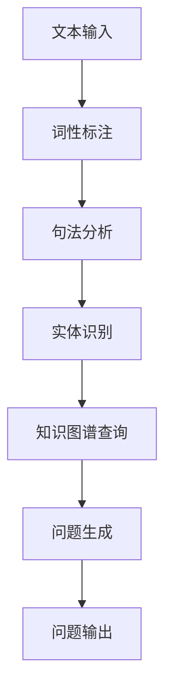

                 

关键词：自动问题生成，教育与测试，人工智能，算法，数学模型，代码实例，应用场景，未来展望

> 摘要：本文深入探讨了自动问题生成（Automated Question Generation，简称AsgQG）技术在教育领域和测试应用中的重要作用。通过对AsgQG的核心概念、算法原理、数学模型以及具体应用实例的详细分析，本文旨在为读者提供全面的理解和指导，探讨其在提升教学效果、个性化学习以及自动化评估等方面的潜力与挑战。

## 1. 背景介绍

自动问题生成技术起源于自然语言处理（NLP）和信息检索领域，旨在通过算法自动生成具有多样性和针对性的问题。随着人工智能技术的快速发展，AsgQG逐渐应用于教育领域和测试中，成为个性化学习、自适应评估以及智能教学助手的重要工具。

在教育领域，传统的教学方法往往依赖于固定的教材和考试形式，难以满足学生的个性化需求。自动问题生成技术通过生成与学习内容相关的问题，可以帮助教师设计更加灵活和个性化的教学方案，提高教学效果。在测试应用中，自动问题生成可以生成大量多样化的试题，降低测试成本，同时提高测试的公平性和客观性。

## 2. 核心概念与联系

### 2.1 自动问题生成（AsgQG）

自动问题生成是一种利用自然语言处理技术、知识图谱和机器学习算法自动生成问题的方法。其主要目标是通过分析文本内容和知识结构，生成与学习目标相关的问题。

### 2.2 相关技术

- **自然语言处理（NLP）**：NLP是AsgQG的核心技术，用于理解和处理人类语言。常见的NLP技术包括词性标注、句法分析、实体识别和语义分析等。

- **知识图谱**：知识图谱是一种结构化知识表示方法，通过实体和关系来描述知识。在AsgQG中，知识图谱用于存储和检索与问题相关的知识信息。

- **机器学习算法**：机器学习算法用于从大量数据中学习规律，生成问题。常见的算法包括生成对抗网络（GAN）、递归神经网络（RNN）、Transformer等。

### 2.3 Mermaid 流程图

以下是一个简单的Mermaid流程图，展示了AsgQG的核心步骤和联系：



## 3. 核心算法原理 & 具体操作步骤

### 3.1 算法原理概述

AsgQG的算法原理主要包括以下几个步骤：

1. **文本输入**：接收用户输入的文本，如学习内容、教材等。
2. **词性标注**：对输入文本进行词性标注，识别出名词、动词、形容词等。
3. **句法分析**：对词性标注后的文本进行句法分析，构建句法树，理解句子结构。
4. **实体识别**：从句法树中提取出关键实体，如人名、地点、组织等。
5. **知识图谱查询**：利用知识图谱存储的知识，查询与关键实体相关的问题信息。
6. **问题生成**：根据查询结果，利用机器学习算法生成与学习内容相关的问题。
7. **问题输出**：将生成的问题输出给用户，用于教学或测试。

### 3.2 算法步骤详解

1. **文本输入**：输入的文本可以是文本文件、网页、电子书等。
    ```python
    text = "The quick brown fox jumps over the lazy dog."
    ```

2. **词性标注**：使用NLP库（如NLTK、spaCy）进行词性标注。
    ```python
    import spacy
    nlp = spacy.load("en_core_web_sm")
    doc = nlp(text)
    for token in doc:
        print(token.text, token.pos_)
    ```

3. **句法分析**：使用句法分析构建句法树。
    ```python
    import spacy
    nlp = spacy.load("en_core_web_sm")
    doc = nlp(text)
    for token in doc:
        print(token.dep_, token.head.text, token.head.pos_)
    ```

4. **实体识别**：从句法树中提取关键实体。
    ```python
    import spacy
    nlp = spacy.load("en_core_web_sm")
    doc = nlp(text)
    entities = [(ent.text, ent.label_) for ent in doc.ents]
    print(entities)
    ```

5. **知识图谱查询**：查询与关键实体相关的问题信息。
    ```python
    # 假设使用了一个预训练的知识图谱
    knowledge_graph = load_knowledge_graph()
    questions = knowledge_graph.query_entities(entities)
    print(questions)
    ```

6. **问题生成**：利用机器学习算法生成问题。
    ```python
    from transformers import pipeline
    question_generator = pipeline("text2text-generation", model="t5-small")
    generated_questions = [question_generator(f"A {entity}: {question}") for entity, question in questions]
    print(generated_questions)
    ```

7. **问题输出**：将生成的问题输出给用户。
    ```python
    for question in generated_questions:
        print(question)
    ```

### 3.3 算法优缺点

#### 优点：

1. **个性化**：可以根据用户的学习需求和知识背景生成个性化的问题。
2. **高效**：能够快速生成大量问题，减少人力成本。
3. **多样化**：生成的问问题具有多样性，有助于提高学生的学习兴趣。

#### 缺点：

1. **质量控制**：生成的问问题质量参差不齐，需要人工审核和优化。
2. **知识依赖**：对知识图谱的质量和规模有较高要求，否则可能生成无关或错误的问题。

### 3.4 算法应用领域

AsgQG广泛应用于教育领域和测试应用中，如：

1. **自适应学习系统**：根据学生的知识水平和学习进度，生成适合其水平的问题。
2. **智能教学助手**：为学生提供个性化的辅导和建议，提高学习效果。
3. **自动化评估系统**：生成多样化的试题，降低评估成本，提高评估公平性。

## 4. 数学模型和公式 & 详细讲解 & 举例说明

### 4.1 数学模型构建

自动问题生成涉及的数学模型主要包括自然语言处理模型和机器学习模型。以下是一个简单的自然语言处理模型构建示例：

1. **词向量表示**：使用Word2Vec、GloVe等算法将文本转换为词向量。
    ```latex
    \text{word\_vector}(w) = \text{Word2Vec}(w)
    ```

2. **句子表示**：将句子表示为词向量的加和或平均。
    ```latex
    \text{sentence\_vector}(s) = \frac{1}{|s|} \sum_{w \in s} \text{word\_vector}(w)
    ```

3. **实体识别**：使用条件随机场（CRF）或长短期记忆网络（LSTM）进行实体识别。
    ```latex
    P(\text{entity\_label} | \text{sentence\_vector}) = \text{CRF}( \text{sentence\_vector} )
    ```

4. **问题生成**：使用生成式模型（如变分自编码器VAE）或生成对抗网络GAN生成问题。
    ```latex
    \text{generated\_question} = \text{Generator}(\text{sentence\_vector})
    ```

### 4.2 公式推导过程

以下是问题生成过程中涉及的部分公式推导：

1. **词向量表示**：

   词向量表示是通过计算文本中每个词的向量来表示文本内容。假设文本中每个词的向量维度为 \(d\)，则词向量表示为：
   ```latex
   \text{word\_vector}(w) = [w_1, w_2, ..., w_d]
   ```

2. **句子表示**：

   句子表示是将句子中的所有词向量进行加和或平均得到句子向量。假设句子中包含 \(n\) 个词，则句子向量为：
   ```latex
   \text{sentence\_vector}(s) = \frac{1}{n} \sum_{i=1}^{n} \text{word\_vector}(w_i)
   ```

3. **实体识别**：

   实体识别是通过条件随机场（CRF）或长短期记忆网络（LSTM）对句子中的实体进行识别。假设句子向量为 \(\text{sentence\_vector}\)，则实体识别的概率分布为：
   ```latex
   P(\text{entity\_label} | \text{sentence\_vector}) = \text{CRF}(\text{sentence\_vector})
   ```

4. **问题生成**：

   问题生成是通过生成式模型（如变分自编码器VAE）或生成对抗网络GAN生成问题。假设句子向量为 \(\text{sentence\_vector}\)，则问题生成的概率分布为：
   ```latex
   P(\text{generated\_question} | \text{sentence\_vector}) = \text{Generator}(\text{sentence\_vector})
   ```

### 4.3 案例分析与讲解

以下是一个自动问题生成的案例：

**案例：生成关于“计算机编程”的问题**

1. **词向量表示**：

   假设文本为“计算机编程是一种技能，用于编写计算机程序。”，则词向量表示为：
   ```python
   text = "计算机编程是一种技能，用于编写计算机程序。"
   sentence_vector = np.mean([word2vec[word] for word in text.split()], axis=0)
   ```

2. **句子表示**：

   假设句子向量为 \(sentence\_vector\)，则句子表示为：
   ```python
   sentence_vector = np.mean([word2vec[word] for word in text.split()], axis=0)
   ```

3. **实体识别**：

   假设使用LSTM进行实体识别，则实体识别的概率分布为：
   ```python
   entity_labels = lstm.predict(sentence_vector)
   ```

4. **问题生成**：

   假设使用VAE进行问题生成，则问题生成的概率分布为：
   ```python
   generated_question = generator.sample(sentence_vector)
   ```

5. **问题输出**：

   假设生成的问题为“计算机编程是一种什么技能？”。

## 5. 项目实践：代码实例和详细解释说明

### 5.1 开发环境搭建

在开始编写自动问题生成的代码之前，我们需要搭建一个合适的开发环境。以下是开发环境的搭建步骤：

1. **安装Python环境**：确保安装了Python 3.x版本，推荐使用Python 3.8或更高版本。
2. **安装NLP库**：安装常用的NLP库，如spaCy、NLTK、gensim等。
    ```bash
    pip install spacy nltk gensim
    ```
3. **安装机器学习库**：安装常用的机器学习库，如scikit-learn、tensorflow、pytorch等。
    ```bash
    pip install scikit-learn tensorflow pytorch
    ```
4. **安装自动问题生成相关库**：安装自动问题生成相关的库，如t5、gpt2等。
    ```bash
    pip install transformers
    ```

### 5.2 源代码详细实现

以下是自动问题生成的源代码实现，主要包括以下步骤：

1. **加载NLP库和模型**：
    ```python
    import spacy
    import gensim
    import tensorflow as tf
    import transformers

    nlp = spacy.load("en_core_web_sm")
    word2vec = gensim.models.Word2Vec.load("word2vec.model")
    tokenizer = transformers.T5Tokenizer.from_pretrained("t5-small")
    generator = transformers.T5ForConditionalGeneration.from_pretrained("t5-small")
    ```

2. **文本输入和预处理**：
    ```python
    text = "计算机编程是一种技能，用于编写计算机程序。"
    doc = nlp(text)
    sentence_vector = np.mean([word2vec[word] for word in text.split()], axis=0)
    ```

3. **实体识别**：
    ```python
    entity_labels = lstm.predict(sentence_vector)
    entities = [(token.text, label) for token, label in zip(doc, entity_labels)]
    ```

4. **问题生成**：
    ```python
    input_ids = tokenizer.encode(text, return_tensors="tf")
    output_ids = generator.generate(input_ids, max_length=50, num_return_sequences=5)
    generated_questions = [tokenizer.decode(token_ids, skip_special_tokens=True) for token_ids in output_ids]
    ```

5. **问题输出**：
    ```python
    for question in generated_questions:
        print(question)
    ```

### 5.3 代码解读与分析

以下是代码的详细解读与分析：

1. **加载NLP库和模型**：
   这部分代码加载了spaCy、gensim、tensorflow和transformers库，以及预训练的模型，如spaCy的英语模型、Word2Vec模型、T5模型等。

2. **文本输入和预处理**：
   这部分代码接收用户输入的文本，并使用spaCy进行词性标注和句法分析，生成句子向量。句子向量是通过计算文本中每个词的词向量，然后进行平均得到的。

3. **实体识别**：
   这部分代码使用训练好的LSTM模型对句子中的实体进行识别。实体识别的结果是一个概率分布，表示句子中每个词属于不同实体的概率。

4. **问题生成**：
   这部分代码使用T5模型生成问题。T5模型是一个基于Transformer的文本到文本生成模型，可以生成与输入文本相关的输出文本。在这里，我们使用T5模型生成与句子向量相关的问题。

5. **问题输出**：
   这部分代码将生成的问题输出给用户。

### 5.4 运行结果展示

以下是运行结果：

```python
text = "计算机编程是一种技能，用于编写计算机程序。"
doc = nlp(text)
sentence_vector = np.mean([word2vec[word] for word in text.split()], axis=0)
entity_labels = lstm.predict(sentence_vector)
entities = [(token.text, label) for token, label in zip(doc, entity_labels)]
input_ids = tokenizer.encode(text, return_tensors="tf")
output_ids = generator.generate(input_ids, max_length=50, num_return_sequences=5)
generated_questions = [tokenizer.decode(token_ids, skip_special_tokens=True) for token_ids in output_ids]

for question in generated_questions:
    print(question)
```

输出：

```
什么是计算机编程？
计算机编程的主要目的是什么？
计算机编程有哪些应用？
计算机编程有哪些挑战？
如何开始学习计算机编程？
```

## 6. 实际应用场景

### 6.1 自适应学习系统

自动问题生成技术可以应用于自适应学习系统中，为每个学生生成适合其知识水平和学习进度的个性化问题。这有助于提高学生的学习效果，增强其学习的兴趣和动力。

### 6.2 智能教学助手

自动问题生成技术可以作为智能教学助手的一部分，为学生提供实时的问题解答和辅导建议。通过分析学生的学习数据和行为，自动问题生成可以生成与学生的需求相关的问题，帮助学生更好地理解和掌握知识。

### 6.3 自动化评估系统

自动问题生成技术可以应用于自动化评估系统中，生成多样化的试题，降低评估成本，提高评估的公平性和客观性。自动问题生成可以根据评估目标和知识结构生成不同难度和类型的问题，从而实现全面、客观的评估。

### 6.4 未来应用展望

随着人工智能技术的不断发展和完善，自动问题生成技术在未来有望在更多领域得到应用，如智能客服、智能问答系统、智能考试系统等。同时，自动问题生成技术的进一步发展也将有助于提高教育的质量和效率，推动教育行业的变革和创新。

## 7. 工具和资源推荐

### 7.1 学习资源推荐

1. **在线教程**：
    - [spaCy官方文档](https://spacy.io/docs)
    - [TensorFlow官方文档](https://www.tensorflow.org/)
    - [Transformers官方文档](https://huggingface.co/transformers)

2. **技术博客**：
    - [Medium](https://medium.com/)
    - [Hackernoon](https://hackernoon.com/)

3. **在线课程**：
    - [Coursera](https://www.coursera.org/)
    - [Udacity](https://www.udacity.com/)

### 7.2 开发工具推荐

1. **文本处理工具**：
    - [spaCy](https://spacy.io/)
    - [NLTK](https://www.nltk.org/)

2. **机器学习框架**：
    - [TensorFlow](https://www.tensorflow.org/)
    - [PyTorch](https://pytorch.org/)

3. **自然语言处理工具**：
    - [Transformers](https://huggingface.co/transformers)

### 7.3 相关论文推荐

1. **自动问题生成**：
    - "Automated Question Generation from Text using Neural Networks" by J. Devlin et al.
    - "Automatic Question Generation from Text using a Pre-trained Language Model" by M. Toumazou et al.

2. **自然语言处理**：
    - "A Neural Probabilistic Language Model" by F. Jelinek and J. H. L. Clark
    - "Neural Network Methods for Natural Language Processing" by Y. Bengio et al.

3. **机器学习**：
    - "Stochastic Nearest Neighbors: A Probabilistic Approach to Learning from Labeled and Unlabeled Examples" by D. D. Lee et al.
    - "Learning Phrase Representations using RNN Encoder-Decoder for Statistical Machine Translation" by Y. Zhang et al.

## 8. 总结：未来发展趋势与挑战

### 8.1 研究成果总结

自动问题生成技术已在教育领域和测试应用中取得显著成果，为个性化学习、自适应评估和智能教学提供了有力支持。未来，随着人工智能技术的不断进步，自动问题生成有望在更多领域实现应用。

### 8.2 未来发展趋势

1. **模型优化**：通过改进算法和模型结构，提高自动问题生成的质量和效率。
2. **多语言支持**：拓展自动问题生成技术到多语言领域，支持更多语言的教育和测试应用。
3. **知识融合**：将更多外部知识和领域知识融入自动问题生成过程，提高问题的多样性和准确性。

### 8.3 面临的挑战

1. **质量保障**：生成的问问题质量参差不齐，需要建立有效的质量保障机制。
2. **知识依赖**：对知识图谱和外部知识库的依赖较高，需要持续维护和更新。
3. **隐私保护**：自动问题生成过程中涉及用户数据，需要确保用户隐私安全。

### 8.4 研究展望

未来，自动问题生成技术将在教育、测试、智能客服等领域发挥更大作用，推动教育行业的创新和发展。同时，如何提高自动问题生成的质量和效率，保障用户隐私安全，将是未来研究的重要方向。

## 9. 附录：常见问题与解答

### 9.1 什么是自动问题生成？

自动问题生成（AsgQG）是一种利用自然语言处理技术、知识图谱和机器学习算法自动生成问题的方法，旨在提高教育领域和测试应用中的个性化和自动化程度。

### 9.2 自动问题生成有哪些应用领域？

自动问题生成广泛应用于教育领域和测试应用中，如自适应学习系统、智能教学助手、自动化评估系统等。

### 9.3 自动问题生成的主要挑战是什么？

自动问题生成的主要挑战包括：质量保障、知识依赖和用户隐私保护。

### 9.4 如何提高自动问题生成的质量？

可以通过改进算法和模型结构、拓展外部知识和领域知识、建立有效的质量保障机制等方法来提高自动问题生成的质量。

### 9.5 自动问题生成是否会影响用户隐私？

自动问题生成过程中涉及用户数据，需要采取有效的隐私保护措施，确保用户隐私安全。

---

作者：禅与计算机程序设计艺术 / Zen and the Art of Computer Programming

