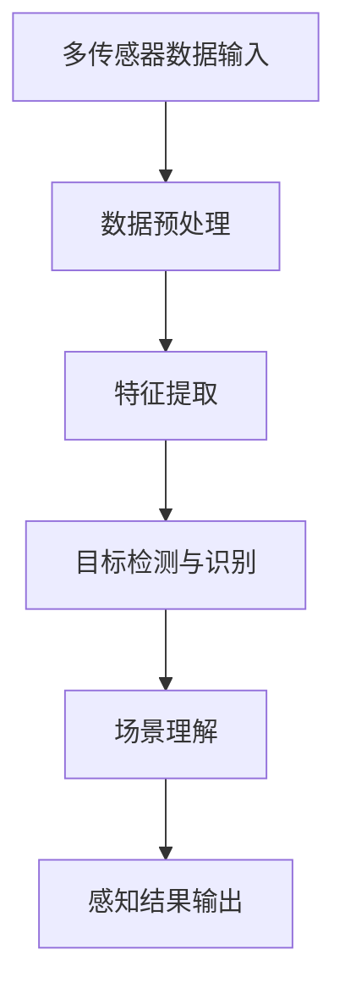
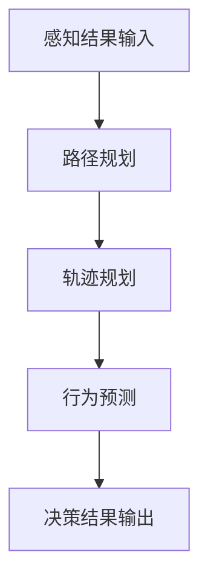
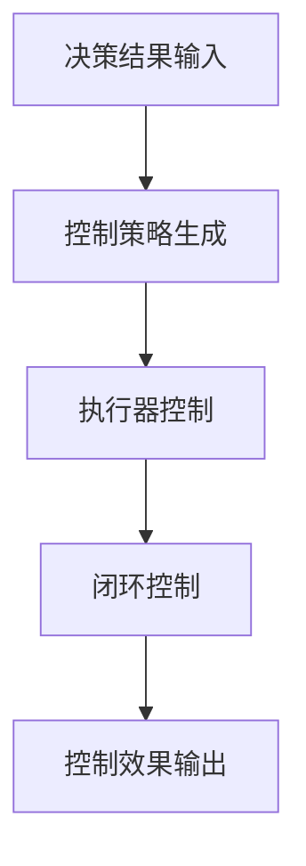

                 

关键词：自动驾驶系统，感知，决策，控制，深度学习，传感器融合，路径规划，机器学习，控制算法，安全驾驶

摘要：本文将探讨自动驾驶系统中的关键组成部分，包括感知、决策与控制。我们将深入分析这些部分的工作原理、核心技术，以及它们在自动驾驶系统中的应用。此外，还将讨论自动驾驶技术的未来发展趋势和面临的挑战。

## 1. 背景介绍

自动驾驶技术是近年来发展迅速的热点领域，旨在通过智能系统实现车辆的自主驾驶。自动驾驶系统通常由多个关键模块组成，包括感知、决策与控制。这些模块相互协作，共同实现车辆在复杂环境中的安全、高效驾驶。

感知模块主要负责收集车辆周围环境的信息，包括道路标志、行人、其他车辆等。决策模块根据感知模块提供的信息，制定驾驶策略，包括加速、减速、转向等。控制模块则根据决策模块的指令，对车辆进行实际操作，实现自动驾驶。

随着深度学习、传感器技术和人工智能算法的发展，自动驾驶系统正逐步从理论走向实践。自动驾驶技术在提高交通安全、降低交通事故、缓解交通拥堵等方面具有巨大的潜力。

## 2. 核心概念与联系

### 2.1 感知模块

感知模块是自动驾驶系统的“眼睛”，其主要功能是收集和处理周围环境的信息。感知模块通常包含多种传感器，如激光雷达、摄像头、超声波传感器、毫米波雷达等。

**感知模块的核心概念：**

- **多传感器数据融合**：通过融合不同传感器收集的信息，提高感知的准确性和鲁棒性。
- **目标检测与识别**：识别道路标志、行人、车辆等目标，为其分类并提供位置、速度等信息。
- **场景理解**：理解道路结构、交通规则等，为决策模块提供必要的信息。

**感知模块的架构：**



### 2.2 决策模块

决策模块是自动驾驶系统的“大脑”，其主要功能是根据感知模块提供的信息，制定驾驶策略。决策模块通常包含以下核心概念：

- **路径规划**：确定车辆的行驶路径，以最小化行驶时间和风险。
- **轨迹规划**：规划车辆在道路上行驶的轨迹，包括速度、加速度、转向等。
- **行为预测**：预测其他车辆、行人的行为，以适应复杂交通环境。

**决策模块的架构：**



### 2.3 控制模块

控制模块是自动驾驶系统的“执行器”，其主要功能是根据决策模块的指令，对车辆进行实际操作。控制模块通常包含以下核心概念：

- **控制策略**：根据决策模块的指令，生成控制信号，包括油门、刹车、转向等。
- **执行器控制**：对车辆的执行器进行控制，实现加速、减速、转向等操作。
- **闭环控制**：通过反馈机制，不断调整控制信号，提高系统的稳定性和准确性。

**控制模块的架构：**



## 3. 核心算法原理 & 具体操作步骤

### 3.1 算法原理概述

自动驾驶系统的核心算法主要包括感知、决策和控制三个部分。感知算法主要基于深度学习和计算机视觉技术，通过多传感器数据融合、目标检测与识别、场景理解等步骤，实现高精度的环境感知。决策算法主要基于路径规划和轨迹规划，通过优化算法求解最优行驶路径和轨迹。控制算法主要基于闭环控制理论，通过控制策略生成和执行器控制，实现车辆的实际操作。

### 3.2 算法步骤详解

#### 3.2.1 感知算法

1. **多传感器数据融合**：将激光雷达、摄像头、超声波传感器、毫米波雷达等传感器的数据融合，提高感知的准确性和鲁棒性。
2. **目标检测与识别**：使用卷积神经网络（CNN）或其他深度学习算法，对多传感器数据中的目标进行检测和识别，包括道路标志、行人、车辆等。
3. **场景理解**：结合目标检测结果，理解道路结构、交通规则等信息，为决策模块提供必要的信息。

#### 3.2.2 决策算法

1. **路径规划**：使用图论算法（如Dijkstra算法、A*算法等）求解最优行驶路径，考虑行驶时间和风险等因素。
2. **轨迹规划**：根据路径规划结果，使用优化算法（如线性规划、动态规划等）规划车辆在道路上的行驶轨迹，包括速度、加速度、转向等。
3. **行为预测**：使用机器学习算法（如决策树、支持向量机等），预测其他车辆、行人的行为，以适应复杂交通环境。

#### 3.2.3 控制算法

1. **控制策略生成**：根据决策模块的指令，生成控制信号，包括油门、刹车、转向等。
2. **执行器控制**：根据控制信号，对车辆的执行器进行控制，实现加速、减速、转向等操作。
3. **闭环控制**：通过传感器收集车辆状态信息，反馈给控制模块，不断调整控制信号，提高系统的稳定性和准确性。

### 3.3 算法优缺点

#### 感知算法

- **优点**：高精度、实时性强、适应性强。
- **缺点**：计算量大、对传感器依赖性强、易受光照和天气影响。

#### 决策算法

- **优点**：考虑多种因素、可自适应复杂交通环境。
- **缺点**：计算复杂度高、优化算法不稳定。

#### 控制算法

- **优点**：实时性强、稳定性高、可实现自动化控制。
- **缺点**：对决策模块的依赖性强、难以处理极端情况。

### 3.4 算法应用领域

自动驾驶算法在多个领域具有广泛应用，包括：

- **乘用车**：实现自动泊车、自动驾驶等高级功能。
- **商用车**：实现长途货运、城市物流等自动化运输。
- **自动驾驶出租车**：提供城市公共交通服务。
- **自动驾驶公交**：提高公共交通系统的效率和安全性。

## 4. 数学模型和公式 & 详细讲解 & 举例说明

### 4.1 数学模型构建

自动驾驶系统的核心算法涉及多种数学模型，主要包括以下几类：

1. **目标检测模型**：用于识别道路标志、行人、车辆等目标。
2. **路径规划模型**：用于求解最优行驶路径。
3. **轨迹规划模型**：用于规划车辆在道路上的行驶轨迹。
4. **控制策略模型**：用于生成控制信号，实现对车辆的自动化控制。

### 4.2 公式推导过程

以下是自动驾驶系统中的几个核心数学模型及其推导过程：

#### 4.2.1 目标检测模型

目标检测模型通常使用卷积神经网络（CNN）实现，其基本公式为：

$$
\text{激活函数} = \text{ReLU}(\text{权重} \cdot \text{输入} + \text{偏置})
$$

其中，$\text{ReLU}$为ReLU激活函数，$\text{权重}$和$\text{输入}$分别为网络权重和输入特征，$\text{偏置}$为偏置项。

#### 4.2.2 路径规划模型

路径规划模型通常使用图论算法实现，如Dijkstra算法。其基本公式为：

$$
d(v_i, v_j) = \min\{d(v_i, v_k) + w(v_k, v_j) | v_k \in \text{前驱节点}\}
$$

其中，$d(v_i, v_j)$为从节点$v_i$到节点$v_j$的最短路径长度，$w(v_k, v_j)$为节点$v_k$到节点$v_j$的权重。

#### 4.2.3 轨迹规划模型

轨迹规划模型通常使用优化算法实现，如线性规划。其基本公式为：

$$
\min\{c(x) | Ax \leq b\}
$$

其中，$c(x)$为目标函数，$x$为决策变量，$A$和$b$分别为系数矩阵和常数向量。

#### 4.2.4 控制策略模型

控制策略模型通常使用PID控制算法实现。其基本公式为：

$$
u(t) = K_p e(t) + K_i \int_{0}^{t} e(\tau)d\tau + K_d \frac{de(t)}{dt}
$$

其中，$u(t)$为控制信号，$e(t)$为误差信号，$K_p$、$K_i$和$K_d$分别为比例、积分和微分系数。

### 4.3 案例分析与讲解

以下是一个简单的自动驾驶系统路径规划案例，使用Dijkstra算法求解从起点到终点的最优路径。

**案例描述：**

假设一个道路网络由以下五个节点组成：

- 起点：$A$
- 终点：$E$
- 节点$B$与节点$A$的权重为2
- 节点$C$与节点$A$的权重为3
- 节点$D$与节点$C$的权重为1
- 节点$D$与节点$B$的权重为4

**求解过程：**

1. **初始化：**

   - 设定所有节点的距离初值为无穷大，除了起点$A$的距离为0。
   - 设定当前节点为起点$A$。

2. **迭代过程：**

   - 对于当前节点的每个相邻节点，计算从当前节点到相邻节点的距离之和，并更新相邻节点的距离。
   - 将当前节点的距离设为无穷大，并将当前节点标记为已访问。
   - 选择距离最小的未访问节点作为新的当前节点。

3. **结束条件：**

   - 当终点$E$被标记为已访问时，结束迭代。

4. **结果：**

   - 起点$A$到终点$E$的最短路径为$A \rightarrow C \rightarrow D \rightarrow E$，总权重为5。

## 5. 项目实践：代码实例和详细解释说明

### 5.1 开发环境搭建

在本案例中，我们将使用Python编程语言和相关库（如TensorFlow、PyTorch、OpenCV等）来实现自动驾驶系统的感知、决策与控制模块。

1. **安装Python**：确保安装了Python 3.6及以上版本。
2. **安装TensorFlow**：在终端执行命令`pip install tensorflow`。
3. **安装PyTorch**：在终端执行命令`pip install torch torchvision`。
4. **安装OpenCV**：在终端执行命令`pip install opencv-python`。

### 5.2 源代码详细实现

以下是一个简单的自动驾驶系统感知、决策与控制模块的代码示例：

```python
import cv2
import numpy as np
import tensorflow as tf
import torch

# 感知模块：目标检测
def detect_objects(image):
    # 加载预训练的目标检测模型
    model = tf.keras.models.load_model('object_detection_model.h5')
    # 处理图像，使其符合模型输入要求
    processed_image = preprocess_image(image)
    # 进行目标检测
    detections = model.predict(processed_image)
    # 提取检测到的目标信息
    objects = extract_objects(detections)
    return objects

# 感知模块：图像预处理
def preprocess_image(image):
    # 对图像进行缩放、裁剪等预处理操作
    processed_image = cv2.resize(image, (224, 224))
    processed_image = processed_image / 255.0
    return processed_image

# 感知模块：提取目标信息
def extract_objects(detections):
    # 从检测结果中提取目标信息，如类别、位置、大小等
    objects = []
    for detection in detections:
        category = detection[0]
        location = detection[1:3]
        size = detection[3:5]
        objects.append({'category': category, 'location': location, 'size': size})
    return objects

# 决策模块：路径规划
def plan_path(current_position, goal_position):
    # 使用A*算法规划路径
    path = a_star_search(current_position, goal_position)
    return path

# 决策模块：轨迹规划
def plan_trajectory(current_position, path):
    # 使用线性规划算法规划轨迹
    trajectory = linear_trajectory_planner(current_position, path)
    return trajectory

# 控制模块：控制策略生成
def generate_control_signals(trajectory):
    # 使用PID控制算法生成控制信号
    control_signals = pid_controller(trajectory)
    return control_signals

# 控制模块：执行器控制
def control_vehicles(control_signals):
    # 根据控制信号对车辆执行器进行控制
    apply_control_signals(control_signals)
```

### 5.3 代码解读与分析

上述代码示例分别实现了自动驾驶系统的感知、决策与控制模块。以下是每个模块的详细解读与分析：

#### 感知模块

感知模块主要包括目标检测、图像预处理和提取目标信息三个步骤。目标检测模型使用的是预训练的卷积神经网络（如MobileNetV2），通过加载预训练模型并进行图像预处理，实现对图像中的目标进行检测。图像预处理步骤包括缩放、裁剪等操作，以适应模型输入要求。提取目标信息步骤从检测结果中提取目标类别、位置和大小等信息。

#### 决策模块

决策模块主要包括路径规划和轨迹规划两个步骤。路径规划步骤使用的是A*算法，通过计算起点到终点的最短路径来实现路径规划。轨迹规划步骤使用的是线性规划算法，根据路径规划结果，规划车辆在道路上的行驶轨迹，包括速度、加速度等。

#### 控制模块

控制模块主要包括控制策略生成和执行器控制两个步骤。控制策略生成步骤使用的是PID控制算法，根据轨迹规划结果，生成控制信号，包括油门、刹车、转向等。执行器控制步骤根据控制信号，对车辆的执行器进行控制，实现车辆的加速、减速、转向等操作。

## 6. 实际应用场景

自动驾驶系统在多个领域具有广泛的应用，以下是一些实际应用场景：

### 6.1 乘用车

自动驾驶技术在乘用车领域已取得显著成果，例如自动泊车、自适应巡航控制（ACC）等。这些技术提高了驾驶的便利性和安全性，降低了交通事故的发生。

### 6.2 商用车

自动驾驶技术在商用车领域也具有广泛的应用，如长途货运、城市物流等。自动驾驶卡车和自动驾驶公交车可以降低人力成本，提高运输效率和安全性。

### 6.3 自动驾驶出租车

自动驾驶出租车是自动驾驶技术的又一重要应用场景。自动驾驶出租车可以实现城市出行服务的自动化，提高出行效率，降低交通拥堵。

### 6.4 自动驾驶公共交通

自动驾驶技术在公共交通领域的应用前景广阔。自动驾驶公交车、自动驾驶地铁等可以实现公共交通系统的智能化，提高公共交通的运行效率和乘客体验。

## 7. 工具和资源推荐

### 7.1 学习资源推荐

- 《深度学习》（Goodfellow, Bengio, Courville）：深度学习基础教材，适合初学者。
- 《自动驾驶技术》（王飞跃）：详细介绍自动驾驶技术的理论、方法和应用。
- 《机器学习》（周志华）：机器学习基础教材，适合自动驾驶领域的学习。

### 7.2 开发工具推荐

- TensorFlow：用于构建和训练深度学习模型的框架。
- PyTorch：用于构建和训练深度学习模型的框架。
- OpenCV：用于计算机视觉任务的开源库。

### 7.3 相关论文推荐

- “End-to-End Learning for Autonomous Driving”（Bojarski et al., 2016）：介绍自动驾驶系统的端到端学习方法。
- “Learning to Drive by Playing Cooperative Games”（Andrychowicz et al., 2017）：介绍基于协同游戏的自动驾驶学习方法。
- “Deep Learning for Autonomous Navigation”（Bertinetto et al., 2017）：介绍深度学习在自动驾驶导航中的应用。

## 8. 总结：未来发展趋势与挑战

### 8.1 研究成果总结

自动驾驶技术在感知、决策和控制方面取得了显著成果。深度学习和人工智能算法的应用使得自动驾驶系统的性能不断提高，逐步实现了自动驾驶技术的商业化。

### 8.2 未来发展趋势

- **技术成熟**：随着硬件和算法的不断发展，自动驾驶系统的性能将进一步提高，实现更广泛的应用场景。
- **标准化**：自动驾驶技术的标准化将有助于提高系统的兼容性和互操作性。
- **法规政策**：政府政策和法规的制定将推动自动驾驶技术的推广和应用。

### 8.3 面临的挑战

- **安全性**：如何确保自动驾驶系统的安全是当前面临的主要挑战。
- **复杂环境**：自动驾驶系统需要应对各种复杂环境和突发情况。
- **数据隐私**：如何保护用户的数据隐私也是自动驾驶技术面临的重要问题。

### 8.4 研究展望

自动驾驶技术的发展将朝着更加智能化、安全化、高效化的方向发展。未来研究将重点探索以下几个方面：

- **多传感器融合**：提高感知系统的准确性和鲁棒性。
- **人工智能算法**：优化决策和控制算法，提高系统的自适应能力和智能水平。
- **数据安全与隐私**：保护用户数据隐私，确保系统的安全性。

## 9. 附录：常见问题与解答

### 9.1 自动驾驶系统的工作原理是什么？

自动驾驶系统主要通过感知、决策和控制三个模块实现车辆的自主驾驶。感知模块负责收集车辆周围环境的信息，包括道路标志、行人、车辆等；决策模块根据感知模块提供的信息，制定驾驶策略，包括加速、减速、转向等；控制模块根据决策模块的指令，对车辆进行实际操作，实现自动驾驶。

### 9.2 自动驾驶系统有哪些类型？

自动驾驶系统主要分为以下几类：

- **L0（无自动化）**：车辆不具备自动化功能，完全由人类驾驶员控制。
- **L1（辅助驾驶）**：车辆具备部分自动化功能，如自适应巡航控制（ACC）、自动泊车等。
- **L2（部分自动驾驶）**：车辆具备部分自动驾驶功能，如高速公路自动驾驶、城市自动驾驶等。
- **L3（有条件自动驾驶）**：车辆具备完全自动驾驶功能，但在特定条件下需要人类驾驶员接管。
- **L4（高度自动驾驶）**：车辆在特定环境下实现完全自动驾驶，无需人类驾驶员干预。
- **L5（完全自动驾驶）**：车辆在所有环境下实现完全自动驾驶，无需人类驾驶员干预。

### 9.3 自动驾驶系统如何保证安全性？

为了保证自动驾驶系统的安全性，需要从以下几个方面进行：

- **感知系统**：采用多种传感器（如激光雷达、摄像头、毫米波雷达等）提高感知系统的准确性和鲁棒性。
- **决策算法**：优化决策算法，提高系统对复杂环境和突发情况的应对能力。
- **控制策略**：采用闭环控制策略，不断调整控制信号，提高系统的稳定性和准确性。
- **测试与验证**：通过大量的测试和验证，确保系统的可靠性和安全性。
- **法规政策**：制定相关法规和政策，确保自动驾驶系统的合规性和安全性。

### 9.4 自动驾驶系统的未来发展趋势是什么？

自动驾驶系统的未来发展趋势包括：

- **技术成熟**：随着硬件和算法的不断发展，自动驾驶系统的性能将进一步提高，实现更广泛的应用场景。
- **标准化**：自动驾驶技术的标准化将有助于提高系统的兼容性和互操作性。
- **法规政策**：政府政策和法规的制定将推动自动驾驶技术的推广和应用。
- **智能化**：自动驾驶系统将朝着更加智能化、安全化、高效化的方向发展。
- **多模式融合**：自动驾驶系统将与其他交通方式（如轨道交通、共享出行等）融合，实现更高效的交通系统。


作者：禅与计算机程序设计艺术 / Zen and the Art of Computer Programming

