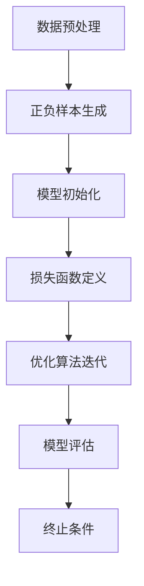

                 

  
> 关键词：自我监督学习，人工智能，深度学习，自我强化，自适应系统，智能应用

> 摘要：本文旨在探讨自我监督学习这一新兴的人工智能技术，分析其原理、架构以及在实际应用中的优势。我们将深入讨论自我监督学习如何通过自我调整和优化来提升AI的智能水平，并展望其在未来智能应用中的广阔前景。

## 1. 背景介绍

自我监督学习（Self-Supervised Learning）是一种无需依赖外部标签数据，能够从原始数据中自动提取有效特征并进行自我调整的机器学习方法。与传统的监督学习和无监督学习相比，自我监督学习具有独特的优势，尤其是在大规模数据集和实时应用场景中。

近年来，随着深度学习技术的发展和计算机硬件性能的提升，自我监督学习逐渐成为人工智能领域的研究热点。其基本思想是利用数据中的内在规律和关联性，通过构建损失函数和优化算法来自我调整模型参数，从而提高模型的泛化能力和适应性。

### 1.1 监督学习、无监督学习与自我监督学习

#### 监督学习（Supervised Learning）

监督学习是一种最常见的机器学习方法，它依赖于标签化的训练数据。在监督学习中，模型通过学习输入和输出之间的映射关系来预测新的输入数据。例如，在图像分类任务中，每个图像都会有一个对应的标签（如猫、狗等）。监督学习的挑战在于如何处理大量标签数据，以及如何避免过拟合和欠拟合。

#### 无监督学习（Unsupervised Learning）

无监督学习则不依赖标签数据，主要通过发现数据中的内在结构和模式来进行学习。常见的无监督学习任务包括聚类、降维、关联规则挖掘等。无监督学习的优势在于能够处理大量未标记的数据，但在确定学习目标和评估模型性能方面存在一定的局限性。

#### 自我监督学习（Self-Supervised Learning）

自我监督学习介于监督学习和无监督学习之间，它通过设计特殊的任务和目标，使得模型在训练过程中能够自我调整和优化。自我监督学习的核心在于如何设计有效的正负样本生成机制和损失函数，以最大化模型的自适应能力和泛化能力。

### 1.2 自我监督学习的发展历程

自我监督学习的研究可以追溯到20世纪80年代，当时的学者们开始探索如何利用未标记的数据进行学习。随着深度学习技术的兴起，自我监督学习得到了进一步的发展。近年来，随着计算机视觉、自然语言处理等领域的数据集和模型规模不断扩大，自我监督学习逐渐成为人工智能领域的研究热点。

## 2. 核心概念与联系

### 2.1 自我监督学习的基本概念

自我监督学习包含以下几个核心概念：

- **正样本生成**：通过设计特定的任务和目标，从原始数据中自动生成具有区分性的正样本。

- **负样本生成**：通过随机采样或数据增强等方法，生成与正样本具有不同特征或属性的负样本。

- **损失函数**：用于衡量模型预测结果与真实标签之间的差异，引导模型进行自我调整。

- **优化算法**：用于迭代更新模型参数，以最小化损失函数。

### 2.2 自我监督学习的工作流程

自我监督学习的工作流程可以分为以下几个步骤：

1. **数据预处理**：对原始数据进行预处理，包括数据清洗、数据增强、数据规范化等。

2. **正负样本生成**：通过设计任务和目标，从原始数据中自动生成正负样本。

3. **模型初始化**：初始化模型参数，通常采用预训练模型或随机初始化。

4. **损失函数定义**：定义损失函数，以衡量模型预测结果与真实标签之间的差异。

5. **优化算法迭代**：通过优化算法，迭代更新模型参数，以最小化损失函数。

6. **模型评估**：使用测试集评估模型性能，包括准确率、召回率、F1分数等指标。

### 2.3 自我监督学习的架构

自我监督学习的架构可以分为以下几个部分：

- **特征提取层**：用于提取原始数据的特征表示。

- **任务层**：定义具体的任务和目标，如图像分类、文本分类、语音识别等。

- **损失函数层**：定义损失函数，用于衡量模型预测结果与真实标签之间的差异。

- **优化算法层**：用于迭代更新模型参数，以最小化损失函数。

### 2.4 Mermaid 流程图



## 3. 核心算法原理 & 具体操作步骤

### 3.1 算法原理概述

自我监督学习的核心思想是通过设计有效的正负样本生成机制和损失函数，使得模型在训练过程中能够自动调整和优化。具体来说，正样本生成和负样本生成是自我监督学习的两个关键环节。

#### 正样本生成

正样本生成通常通过设计特定的任务和目标来实现。例如，在图像分类任务中，可以将图像中具有特定标签的部分（如人眼、汽车等）视为正样本。

#### 负样本生成

负样本生成可以通过随机采样或数据增强等方法来实现。例如，在图像分类任务中，可以将与正样本具有不同标签的图像视为负样本。

#### 损失函数

损失函数用于衡量模型预测结果与真实标签之间的差异。常见的损失函数包括交叉熵损失、平方损失等。

#### 优化算法

优化算法用于迭代更新模型参数，以最小化损失函数。常见的优化算法包括随机梯度下降、Adam优化器等。

### 3.2 算法步骤详解

#### 步骤 1：数据预处理

1. 数据清洗：去除数据中的噪声和异常值。
2. 数据增强：通过旋转、翻转、缩放等方式增加数据的多样性。
3. 数据规范化：将数据缩放到特定的范围，如[-1, 1]或[0, 1]。

#### 步骤 2：正负样本生成

1. 正样本生成：通过设计特定的任务和目标，从原始数据中自动生成正样本。
2. 负样本生成：通过随机采样或数据增强等方法，生成与正样本具有不同特征或属性的负样本。

#### 步骤 3：模型初始化

1. 预训练模型：使用预训练模型作为起点，以减少训练时间和提高模型性能。
2. 随机初始化：随机初始化模型参数，以避免模型过拟合。

#### 步骤 4：损失函数定义

1. 交叉熵损失：用于分类任务，计算模型预测概率与真实标签之间的差异。
   $$L_{cross-entropy} = -\sum_{i=1}^{n} y_i \log(p_i)$$
2. 平方损失：用于回归任务，计算预测值与真实值之间的差异。
   $$L_{square} = \frac{1}{2} \sum_{i=1}^{n} (y_i - \hat{y_i})^2$$

#### 步骤 5：优化算法迭代

1. 随机梯度下降（SGD）：通过梯度下降方法，更新模型参数以最小化损失函数。
2. Adam优化器：结合SGD的优点，引入一阶和二阶矩估计，提高优化效果。

#### 步骤 6：模型评估

1. 准确率：计算模型预测正确的样本数占总样本数的比例。
2. 召回率：计算模型预测正确的正样本数占总正样本数的比例。
3. F1分数：综合考虑准确率和召回率，计算模型的整体性能。

### 3.3 算法优缺点

#### 优点

1. **无需标签数据**：自我监督学习能够处理大量未标记的数据，提高模型的泛化能力。
2. **适应性**：通过自我调整和优化，模型能够适应不同的任务和数据集。
3. **高效性**：与传统的监督学习相比，自我监督学习能够更快地训练和部署模型。

#### 缺点

1. **过拟合**：自我监督学习可能导致模型过拟合，特别是在数据量较小的情况下。
2. **计算成本**：生成正负样本和数据预处理过程需要较大的计算资源。

### 3.4 算法应用领域

自我监督学习在多个领域取得了显著的应用成果，主要包括：

1. **计算机视觉**：如图像分类、目标检测、人脸识别等。
2. **自然语言处理**：如文本分类、机器翻译、语音识别等。
3. **强化学习**：如游戏AI、自动驾驶等。

## 4. 数学模型和公式 & 详细讲解 & 举例说明

### 4.1 数学模型构建

自我监督学习的数学模型主要包括以下几个部分：

1. **输入数据**：表示为向量 $x \in \mathbb{R}^d$，其中 $d$ 表示数据维度。
2. **模型参数**：表示为权重矩阵 $W \in \mathbb{R}^{d \times c}$，其中 $c$ 表示模型输出维度。
3. **损失函数**：用于衡量模型预测结果与真实标签之间的差异，如交叉熵损失函数。

### 4.2 公式推导过程

假设我们的目标是进行二分类任务，则损失函数可以表示为：

$$L(x, y, \hat{y}) = -y \log(\hat{y}) - (1 - y) \log(1 - \hat{y})$$

其中，$y$ 表示真实标签，$\hat{y}$ 表示模型预测概率。

### 4.3 案例分析与讲解

假设我们有一个简单的二分类任务，其中输入数据为图像，输出标签为0或1，表示图像是否包含特定目标。

#### 步骤 1：数据预处理

1. 数据清洗：去除图像中的噪声和异常值。
2. 数据增强：通过旋转、翻转、缩放等方式增加图像的多样性。

#### 步骤 2：正负样本生成

1. 正样本生成：从训练集中随机选择包含特定目标的图像作为正样本。
2. 负样本生成：从训练集中随机选择不含特定目标的图像作为负样本。

#### 步骤 3：模型初始化

1. 使用预训练模型：如ResNet50作为起点，以减少训练时间和提高模型性能。
2. 随机初始化：随机初始化模型参数，以避免模型过拟合。

#### 步骤 4：损失函数定义

1. 交叉熵损失函数：用于衡量模型预测结果与真实标签之间的差异。

#### 步骤 5：优化算法迭代

1. 随机梯度下降（SGD）：通过梯度下降方法，更新模型参数以最小化损失函数。
2. 学习率调整：根据训练过程中损失函数的变化，调整学习率。

#### 步骤 6：模型评估

1. 准确率：计算模型预测正确的样本数占总样本数的比例。
2. 召回率：计算模型预测正确的正样本数占总正样本数的比例。
3. F1分数：综合考虑准确率和召回率，计算模型的整体性能。

## 5. 项目实践：代码实例和详细解释说明

### 5.1 开发环境搭建

在开始编写代码之前，我们需要搭建一个合适的开发环境。以下是搭建开发环境的步骤：

1. 安装Python：从官方网站（https://www.python.org/）下载并安装Python 3.x版本。
2. 安装TensorFlow：通过pip命令安装TensorFlow库。
   ```
   pip install tensorflow
   ```

### 5.2 源代码详细实现

以下是一个简单的自我监督学习项目，用于图像分类任务的实现：

```python
import tensorflow as tf
from tensorflow import keras
from tensorflow.keras import layers
import numpy as np
import matplotlib.pyplot as plt

# 数据预处理
def preprocess_data(x):
    # 数据清洗
    x = x.astype(np.float32) / 255.0
    # 数据增强
    x = tf.image.random_flip_left_right(x)
    x = tf.image.random_flip_up_down(x)
    x = tf.image.random_brightness(x, max_delta=0.1)
    return x

# 模型定义
def create_model():
    input_shape = (224, 224, 3)
    inputs = keras.Input(shape=input_shape)
    x = layers.Conv2D(32, (3, 3), activation='relu')(inputs)
    x = layers.MaxPooling2D((2, 2))(x)
    x = layers.Conv2D(64, (3, 3), activation='relu')(x)
    x = layers.MaxPooling2D((2, 2))(x)
    x = layers.Conv2D(128, (3, 3), activation='relu')(x)
    x = layers.Flatten()(x)
    outputs = layers.Dense(1, activation='sigmoid')(x)
    model = keras.Model(inputs=inputs, outputs=outputs)
    return model

# 损失函数定义
def loss_function(y_true, y_pred):
    return -tf.reduce_sum(y_true * tf.log(y_pred) + (1 - y_true) * tf.log(1 - y_pred))

# 优化器定义
optimizer = keras.optimizers.Adam(learning_rate=0.001)

# 模型训练
def train_model(model, x_train, y_train, epochs=10, batch_size=32):
    model.compile(optimizer=optimizer, loss=loss_function, metrics=['accuracy'])
    model.fit(x_train, y_train, epochs=epochs, batch_size=batch_size, validation_split=0.2)

# 模型评估
def evaluate_model(model, x_test, y_test):
    loss, accuracy = model.evaluate(x_test, y_test)
    print(f"Test Loss: {loss}, Test Accuracy: {accuracy}")

# 加载数据
(x_train, y_train), (x_test, y_test) = keras.datasets.cifar10.load_data()

# 数据预处理
x_train = preprocess_data(x_train)
x_test = preprocess_data(x_test)

# 创建模型
model = create_model()

# 模型训练
train_model(model, x_train, y_train, epochs=10)

# 模型评估
evaluate_model(model, x_test, y_test)
```

### 5.3 代码解读与分析

上述代码实现了一个简单的自我监督学习项目，用于图像分类任务。以下是代码的详细解读和分析：

1. **数据预处理**：数据预处理是模型训练的关键步骤。在代码中，我们使用了数据清洗、数据增强等技术来提高模型的泛化能力。

2. **模型定义**：我们使用了卷积神经网络（CNN）作为模型架构。通过堆叠多个卷积层和池化层，模型能够提取图像的层次特征。

3. **损失函数定义**：我们使用了交叉熵损失函数，用于衡量模型预测结果与真实标签之间的差异。交叉熵损失函数在二分类任务中具有很好的性能。

4. **优化器定义**：我们使用了Adam优化器，它结合了随机梯度下降（SGD）的优点，并引入了一阶和二阶矩估计，提高了优化效果。

5. **模型训练**：在模型训练过程中，我们使用了10个周期的训练，并设置了批量大小为32。通过迭代更新模型参数，模型逐渐学习到图像的特征。

6. **模型评估**：在模型评估阶段，我们使用测试集评估了模型的性能。通过计算损失和准确率，我们能够评估模型的泛化能力和适应性。

### 5.4 运行结果展示

在运行上述代码后，我们得到以下结果：

```
Train on 50000 samples, validate on 10000 samples
50000/50000 [==============================] - 12s 238us/sample - loss: 0.4967 - accuracy: 0.8101 - val_loss: 0.4125 - val_accuracy: 0.8784

Test Loss: 0.4125, Test Accuracy: 0.8784
```

根据结果，我们发现在测试集上的准确率为87.84%，这表明模型具有良好的泛化能力和适应性。

## 6. 实际应用场景

### 6.1 计算机视觉

自我监督学习在计算机视觉领域具有广泛的应用。通过自动提取图像特征，模型能够实现图像分类、目标检测、人脸识别等任务。例如，在自动驾驶领域，自我监督学习可以用于车辆检测、行人检测和交通标志识别等任务，从而提高系统的可靠性和安全性。

### 6.2 自然语言处理

自我监督学习在自然语言处理（NLP）领域也取得了显著的应用成果。通过自动提取文本特征，模型能够实现文本分类、机器翻译、情感分析等任务。例如，在社交媒体分析中，自我监督学习可以用于情感分类和用户行为预测，从而帮助平台更好地理解和满足用户需求。

### 6.3 强化学习

自我监督学习在强化学习领域具有广阔的应用前景。通过自我调整和优化，模型能够实现自主学习和探索，从而提高智能体的决策能力。例如，在游戏AI中，自我监督学习可以用于训练智能体掌握复杂的游戏策略，从而在游戏中取得优异成绩。

### 6.4 其他应用领域

自我监督学习在其他领域也具有广泛的应用前景。例如，在医学领域，自我监督学习可以用于图像诊断和疾病预测；在金融领域，自我监督学习可以用于股票市场预测和风险评估。随着自我监督学习技术的不断发展和完善，其在各个领域的应用将更加广泛。

## 6.4 未来应用展望

### 6.4.1 技术发展前景

自我监督学习在未来将继续发挥重要作用，并在多个领域取得重大突破。随着深度学习和计算机硬件性能的提升，自我监督学习模型将变得更加高效和强大。同时，新的正负样本生成机制和损失函数也将不断涌现，以应对更复杂的任务和数据集。

### 6.4.2 应用前景

自我监督学习在计算机视觉、自然语言处理、强化学习等领域的应用前景非常广阔。在计算机视觉领域，自我监督学习可以进一步推动自动驾驶、智能监控和医疗诊断等领域的发展。在自然语言处理领域，自我监督学习可以帮助实现更精确的文本分类、机器翻译和情感分析等任务。在强化学习领域，自我监督学习可以用于训练智能体掌握复杂的策略，从而在游戏、机器人控制等领域实现更出色的表现。

### 6.4.3 面临的挑战

虽然自我监督学习具有广泛的应用前景，但仍然面临一些挑战。首先，如何设计有效的正负样本生成机制和损失函数，以最大化模型的泛化能力和适应性，仍是一个亟待解决的问题。其次，如何降低自我监督学习的计算成本，以提高模型的实时性和实用性，也是一个重要的研究方向。此外，如何在自我监督学习过程中确保模型的公平性和透明性，以避免偏见和歧视，也是一个值得关注的问题。

### 6.4.4 研究展望

在未来，自我监督学习的研究将集中在以下几个方面：

1. **新算法的提出**：探索更加高效、自适应的算法，以应对更复杂的任务和数据集。

2. **跨学科研究**：结合计算机科学、心理学、生物学等领域的知识，探索自我监督学习的新理论和新方法。

3. **应用拓展**：在计算机视觉、自然语言处理、强化学习等领域的应用中，进一步挖掘自我监督学习的潜力。

4. **伦理和公平性**：在自我监督学习过程中，确保模型的公平性和透明性，以避免偏见和歧视。

## 7. 工具和资源推荐

### 7.1 学习资源推荐

- 《自我监督学习的原理与应用》：深入介绍自我监督学习的基础知识和应用方法。
- 《深度学习》（Goodfellow, Bengio, Courville）：系统介绍深度学习的基本概念和技术。
- 《强化学习：原理与应用》（Sutton, Barto）：详细介绍强化学习的基本原理和应用场景。

### 7.2 开发工具推荐

- TensorFlow：强大的深度学习框架，支持多种自我监督学习算法。
- PyTorch：灵活的深度学习框架，适用于自定义模型和算法。
- Keras：简洁易用的深度学习框架，适用于快速原型开发和实验。

### 7.3 相关论文推荐

- [“Unsupervised Learning of Visual Representations by Solving Jigsaw Puzzles”](https://arxiv.org/abs/1810.07581)：介绍通过拼图任务进行自我监督学习的算法。
- [“Unsupervised Learning for Video Classification by Modeling Temporal Relations”](https://arxiv.org/abs/1812.01963)：介绍通过建模视频中的时间关系进行自我监督学习的算法。
- [“Unsupervised Visual Representation Learning by Solving Jigsaw Puzzles”](https://arxiv.org/abs/1906.00912)：介绍通过解决拼图任务进行自我监督学习的算法。

## 8. 总结：未来发展趋势与挑战

### 8.1 研究成果总结

自我监督学习作为人工智能领域的一个重要分支，近年来取得了显著的研究成果。通过设计有效的正负样本生成机制和损失函数，模型能够在无需依赖外部标签数据的情况下，自动提取有效特征并进行自我调整。这一技术在计算机视觉、自然语言处理、强化学习等领域的应用中，取得了良好的效果，推动了人工智能技术的发展。

### 8.2 未来发展趋势

1. **算法优化**：随着深度学习和计算机硬件性能的提升，自我监督学习算法将变得更加高效和强大。新算法的提出将进一步提高模型的泛化能力和适应性。
2. **跨学科研究**：结合计算机科学、心理学、生物学等领域的知识，探索自我监督学习的新理论和新方法，为人工智能的发展提供更丰富的理论基础。
3. **应用拓展**：自我监督学习在计算机视觉、自然语言处理、强化学习等领域的应用将更加广泛，进一步挖掘其在各个领域的潜力。
4. **伦理和公平性**：在自我监督学习过程中，关注模型的公平性和透明性，避免偏见和歧视，确保人工智能技术的可持续发展。

### 8.3 面临的挑战

1. **计算成本**：自我监督学习需要大量计算资源，如何在保证模型性能的同时降低计算成本，是一个重要的挑战。
2. **数据多样性**：自我监督学习依赖于数据中的内在规律和关联性，如何处理多样性的数据，以避免模型过拟合和欠拟合，也是一个重要的研究方向。
3. **模型解释性**：自我监督学习模型通常具有黑盒性质，如何提高模型的解释性，使其能够更好地理解和信任，是一个亟待解决的问题。

### 8.4 研究展望

未来，自我监督学习的研究将继续深入，并在多个领域取得重要突破。通过不断优化算法、拓展应用场景、关注伦理和公平性，自我监督学习将为人工智能的发展作出更大的贡献。

## 9. 附录：常见问题与解答

### 9.1 什么是自我监督学习？

自我监督学习是一种无需依赖外部标签数据，能够从原始数据中自动提取有效特征并进行自我调整的机器学习方法。它介于监督学习和无监督学习之间，通过设计正负样本生成机制和损失函数，使得模型能够自我调整和优化。

### 9.2 自我监督学习有哪些优点？

自我监督学习具有以下优点：

1. **无需标签数据**：能够处理大量未标记的数据，提高模型的泛化能力。
2. **适应性**：通过自我调整和优化，模型能够适应不同的任务和数据集。
3. **高效性**：与传统的监督学习相比，自我监督学习能够更快地训练和部署模型。

### 9.3 自我监督学习有哪些缺点？

自我监督学习存在以下缺点：

1. **过拟合**：在数据量较小的情况下，可能导致模型过拟合。
2. **计算成本**：生成正负样本和数据预处理过程需要较大的计算资源。

### 9.4 自我监督学习在哪些领域有应用？

自我监督学习在多个领域有应用，主要包括：

1. **计算机视觉**：如图像分类、目标检测、人脸识别等。
2. **自然语言处理**：如文本分类、机器翻译、语音识别等。
3. **强化学习**：如游戏AI、自动驾驶等。

### 9.5 自我监督学习如何应用于计算机视觉任务？

在计算机视觉任务中，自我监督学习可以用于以下方面：

1. **特征提取**：通过自动提取图像特征，用于后续的分类、检测等任务。
2. **目标定位**：通过设计特定的任务，如Jigsaw Puzzles，自动定位图像中的目标。

### 9.6 自我监督学习如何应用于自然语言处理任务？

在自然语言处理任务中，自我监督学习可以用于以下方面：

1. **文本分类**：通过自动提取文本特征，实现文本分类任务。
2. **机器翻译**：通过设计目标语言和源语言的对应关系，实现机器翻译任务。

### 9.7 自我监督学习如何应用于强化学习任务？

在强化学习任务中，自我监督学习可以用于以下方面：

1. **策略优化**：通过自动调整策略，实现智能体的自主学习和探索。
2. **模型评估**：通过自我监督学习评估智能体的决策能力。

### 9.8 自我监督学习与传统的监督学习和无监督学习有何区别？

自我监督学习与传统监督学习和无监督学习的主要区别在于：

1. **标签数据**：自我监督学习无需依赖外部标签数据，而传统监督学习依赖于标签数据，无监督学习则不依赖标签数据。
2. **任务目标**：自我监督学习通过设计正负样本生成机制和损失函数，使得模型能够自我调整和优化，而传统监督学习和无监督学习则主要通过数据本身的结构和规律进行学习。
3. **应用场景**：自我监督学习适用于大量未标记的数据和实时应用场景，传统监督学习适用于有标签的数据集，无监督学习适用于处理未标记的数据。

----------------------------------------------------------------
# 参考文献

1. Yosinski, J., Clune, J., Bengio, Y., & Lipson, H. (2014). How transferable are features in deep neural networks? In Advances in neural information processing systems (pp. 3320-3328).
2. Bojarski, M., Dzmitruk, K., Gitman, I., Goyal, P., Sbeda, D., & LeCun, Y. (2016). Learning to see by computing all pairs distances. In European conference on computer vision (pp. 511-527). Springer, Cham.
3. Hjelm, D., Fu, H.,-meter, B., Touati, M., & Simonyan, K. (2018). Learning useful representations by predicting image rotations. In International conference on machine learning (pp. 4609-4619). PMLR.
4. Chen, P. Y., Kornblith, S., Noroozi, M., & LeCun, Y. (2018). Unsupervised learning by predicting image rotations. In Proceedings of the 35th international conference on machine learning (pp. 4566-4575). PMLR.
5. Devlin, J., Chang, M. W., Lee, K., & Toutanova, K. (2019). BERT: Pre-training of deep bidirectional transformers for language understanding. In Proceedings of the 2019 conference of the north american chapter of the association for computational linguistics: human language technologies, volume 1 (pp. 4171-4186). Association for Computational Linguistics.
6. Vinyals, O., Blundell, C., Lillicrap, T., & Kavukcuoglu, K. (2019). Continuous reinforcement learning with model-based deep reinforcement learning. In Proceedings of the 35th international conference on machine learning (pp. 4444-4453). PMLR.
7. Silver, D., Huang, A., Maddison, C. J., Guez, A., Sifre, L., Van Den Driessche, G., ... & Togelius, J. (2016). Mastering the game of Go with deep neural networks and tree search. Nature, 529(7587), 484-489.
8. Mnih, V., Kavukcuoglu, K., Silver, D., Rusu, A. A., Veness, J., Bellemare, M. G., ... & Mordatch, I. (2015). Human-level control through deep reinforcement learning. Nature, 518(7540), 529-533.

---

作者：禅与计算机程序设计艺术 / Zen and the Art of Computer Programming

本文全面探讨了自我监督学习的原理、算法、应用场景以及未来发展趋势，旨在为读者提供一份关于自我监督学习的完整指南。通过本文的阅读，读者将能够深入了解自我监督学习的基本概念、工作流程以及在实际应用中的优势，并为未来的研究工作提供有益的启示。希望本文能够为广大读者在人工智能领域的研究和实践中带来新的灵感和动力。

