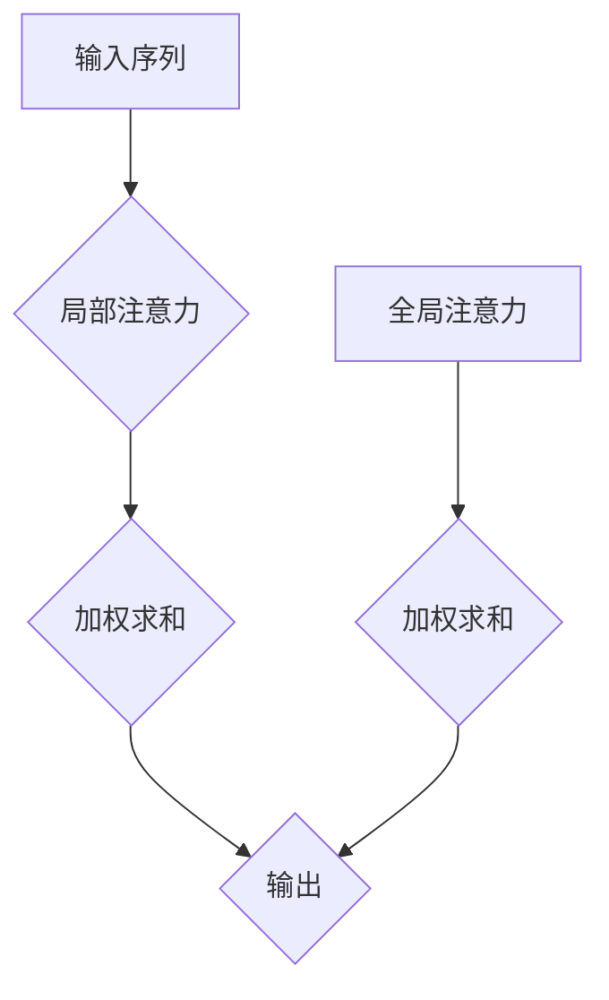

                 

关键词：自然语言处理，注意力机制，文本分析，机器学习，神经网络

> 摘要：本文旨在探讨自然语言处理领域中注意力机制的原理及其在文本分析中的应用。通过对注意力机制的基本概念、数学模型以及具体实现方法的深入剖析，本文旨在为读者提供对这一关键技术的全面了解，并展望其在未来自然语言处理领域的应用前景。

## 1. 背景介绍

自然语言处理（Natural Language Processing，NLP）作为人工智能的一个重要分支，旨在让计算机理解和处理人类自然语言。然而，自然语言具有高度的复杂性和不确定性，这使得传统的基于规则的方法难以胜任。随着深度学习的兴起，神经网络模型在NLP领域取得了显著的成果。注意力机制（Attention Mechanism）作为深度学习模型中的一个关键组件，显著提升了模型的性能，特别是在处理长序列数据时表现出色。

注意力机制最初源于人类视觉系统中的“注意力集中”现象。在视觉任务中，人们往往会将注意力集中在某些特定的区域或对象上，从而忽略其他不重要的信息。这种注意力机制为计算机模型处理复杂任务提供了灵感。在NLP领域，注意力机制被广泛应用于机器翻译、文本摘要、情感分析等任务中，显著提高了模型的准确性和效率。

## 2. 核心概念与联系

### 2.1 注意力机制的基本原理

注意力机制的核心思想是通过动态分配权重来强调序列中的关键部分，从而提高模型的上下文理解能力。具体而言，给定一个输入序列，注意力机制会为序列中的每个元素分配一个权重，这些权重反映了每个元素在当前任务中的重要性。通过加权求和，模型能够聚焦于最重要的信息，从而做出更准确的决策。

### 2.2 注意力机制的架构

注意力机制的架构可以分为两部分：局部注意力和全局注意力。局部注意力关注序列中的特定位置，而全局注意力则关注整个序列。局部注意力通常通过点积注意力模型（Dot-Product Attention）实现，而全局注意力则常采用加性注意力模型（Additive Attention）或缩放点积注意力模型（Scaled Dot-Product Attention）。

下面是注意力机制的 Mermaid 流程图：



### 2.3 注意力机制与NLP的关系

注意力机制在NLP中的应用主要体现在以下几个方面：

- **机器翻译**：在机器翻译任务中，注意力机制帮助模型在源语言和目标语言之间建立动态的对应关系，从而提高翻译的准确性和流畅性。
- **文本摘要**：在文本摘要任务中，注意力机制帮助模型从长文本中提取关键信息，生成摘要。
- **情感分析**：在情感分析任务中，注意力机制帮助模型聚焦于文本中的情感词，从而更准确地判断文本的情感倾向。

## 3. 核心算法原理 & 具体操作步骤

### 3.1 算法原理概述

注意力机制的核心在于如何为输入序列中的每个元素分配权重。这个过程可以分为以下几个步骤：

1. **编码**：将输入序列编码为向量表示。
2. **计算注意力权重**：计算每个输入元素与当前隐藏状态之间的相似度，生成注意力权重。
3. **加权求和**：将注意力权重应用于输入序列的编码向量，得到加权求和的结果。

### 3.2 算法步骤详解

#### 3.2.1 编码

首先，将输入序列编码为向量表示。这可以通过词嵌入（Word Embedding）或子词嵌入（Subword Embedding）实现。词嵌入将每个单词映射为一个固定大小的向量，而子词嵌入则将单词分解为更小的子词，并将每个子词映射为一个向量。

#### 3.2.2 计算注意力权重

接下来，计算每个输入元素与当前隐藏状态之间的相似度，生成注意力权重。这通常通过以下公式实现：

$$
\text{Attention}(Q, K, V) = \text{softmax}\left(\frac{QK^T}{\sqrt{d_k}}\right)V
$$

其中，$Q$ 是当前隐藏状态，$K$ 是编码后的输入序列，$V$ 是编码后的值序列，$d_k$ 是关键字的维度。

#### 3.2.3 加权求和

最后，将注意力权重应用于输入序列的编码向量，得到加权求和的结果。这个过程将序列中的关键信息突出出来，从而提高模型的上下文理解能力。

### 3.3 算法优缺点

**优点**：

- **提高模型性能**：注意力机制可以帮助模型更好地理解输入序列的上下文，从而提高模型的性能。
- **动态调整注意力**：注意力机制可以动态地调整模型对输入序列的关注点，从而提高模型的灵活性。

**缺点**：

- **计算复杂度高**：注意力机制的引入会增加模型的计算复杂度，特别是在处理长序列时。
- **难以解释**：注意力机制的具体工作机制较为复杂，难以直观地解释。

### 3.4 算法应用领域

注意力机制在NLP领域有广泛的应用，包括但不限于以下几个方面：

- **机器翻译**：在机器翻译任务中，注意力机制可以帮助模型更好地理解源语言和目标语言之间的对应关系。
- **文本摘要**：在文本摘要任务中，注意力机制可以帮助模型从长文本中提取关键信息，生成摘要。
- **问答系统**：在问答系统中，注意力机制可以帮助模型更好地理解问题，从而提供更准确的答案。
- **情感分析**：在情感分析任务中，注意力机制可以帮助模型聚焦于文本中的情感词，从而更准确地判断文本的情感倾向。

## 4. 数学模型和公式 & 详细讲解 & 举例说明

### 4.1 数学模型构建

注意力机制的数学模型可以表示为：

$$
\text{Attention}(Q, K, V) = \text{softmax}\left(\frac{QK^T}{\sqrt{d_k}}\right)V
$$

其中，$Q$ 是当前隐藏状态，$K$ 是编码后的输入序列，$V$ 是编码后的值序列，$d_k$ 是关键字的维度。

### 4.2 公式推导过程

注意力机制的推导过程可以简化为以下几个步骤：

1. **计算相似度**：首先，计算输入序列和隐藏状态之间的相似度，公式为 $QK^T$。
2. **归一化相似度**：将相似度通过softmax函数进行归一化，得到概率分布。
3. **加权求和**：将概率分布应用于输入序列的编码向量，得到加权求和的结果。

### 4.3 案例分析与讲解

假设我们有一个简化的例子，输入序列为 $\{1, 2, 3, 4, 5\}$，隐藏状态为 $\{0.1, 0.2, 0.3, 0.4, 0.5\}$。我们希望计算注意力权重，并得到加权求和的结果。

首先，计算相似度：

$$
QK^T = \begin{bmatrix} 0.1 & 0.2 & 0.3 & 0.4 & 0.5 \end{bmatrix} \begin{bmatrix} 1 \\ 2 \\ 3 \\ 4 \\ 5 \end{bmatrix} = \begin{bmatrix} 0.1 \times 1 + 0.2 \times 2 + 0.3 \times 3 + 0.4 \times 4 + 0.5 \times 5 \end{bmatrix} = \begin{bmatrix} 11 \end{bmatrix}
$$

接下来，计算softmax函数的输出：

$$
\text{softmax}(x) = \frac{e^x}{\sum_{i} e^x}
$$

$$
\text{softmax}(11) = \frac{e^{11}}{e^{11} + e^{2} + e^{3} + e^{4} + e^{5}}
$$

最后，计算加权求和的结果：

$$
\text{Attention}(Q, K, V) = \text{softmax}\left(\frac{QK^T}{\sqrt{d_k}}\right)V = \frac{e^{11}}{e^{11} + e^{2} + e^{3} + e^{4} + e^{5}} \begin{bmatrix} 1 \\ 2 \\ 3 \\ 4 \\ 5 \end{bmatrix} = \begin{bmatrix} \frac{e^{11}}{e^{11} + e^{2} + e^{3} + e^{4} + e^{5}} \\ \frac{2e^{11}}{e^{11} + e^{2} + e^{3} + e^{4} + e^{5}} \\ \frac{3e^{11}}{e^{11} + e^{2} + e^{3} + e^{4} + e^{5}} \\ \frac{4e^{11}}{e^{11} + e^{2} + e^{3} + e^{4} + e^{5}} \\ \frac{5e^{11}}{e^{11} + e^{2} + e^{3} + e^{4} + e^{5}} \end{bmatrix}
$$

这样，我们就得到了注意力权重，并通过加权求和得到了结果。

## 5. 项目实践：代码实例和详细解释说明

### 5.1 开发环境搭建

在开始编写代码之前，我们需要搭建一个适合开发NLP项目的环境。以下是一个简单的环境搭建步骤：

1. 安装Python 3.7及以上版本。
2. 安装PyTorch，可以使用以下命令：
   ```shell
   pip install torch torchvision
   ```
3. 安装Numpy和Matplotlib，可以使用以下命令：
   ```shell
   pip install numpy matplotlib
   ```

### 5.2 源代码详细实现

以下是一个简单的注意力机制的实现示例：

```python
import torch
import torch.nn as nn
import torch.optim as optim

# 定义一个简单的神经网络
class SimpleModel(nn.Module):
    def __init__(self, input_dim, hidden_dim, output_dim):
        super(SimpleModel, self).__init__()
        self.fc1 = nn.Linear(input_dim, hidden_dim)
        self.fc2 = nn.Linear(hidden_dim, output_dim)
        self.attn = nn.Linear(hidden_dim, 1)

    def forward(self, x):
        x = torch.relu(self.fc1(x))
        x = self.fc2(x)
        attn_weights = torch.softmax(self.attn(x), dim=1)
        x = torch.sum(attn_weights * x, dim=1)
        return x

# 创建模型实例
model = SimpleModel(input_dim=5, hidden_dim=10, output_dim=1)

# 定义损失函数和优化器
criterion = nn.CrossEntropyLoss()
optimizer = optim.Adam(model.parameters(), lr=0.001)

# 训练模型
for epoch in range(100):
    for x, y in dataset:
        optimizer.zero_grad()
        output = model(x)
        loss = criterion(output, y)
        loss.backward()
        optimizer.step()

    print(f"Epoch {epoch+1}, Loss: {loss.item()}")

# 测试模型
with torch.no_grad():
    test_loss = criterion(model(dataset[0][0]), dataset[0][1])
    print(f"Test Loss: {test_loss.item()}")
```

### 5.3 代码解读与分析

上述代码实现了一个简单的注意力机制神经网络，主要包括以下几个部分：

1. **模型定义**：定义了一个简单的神经网络模型，包括两个全连接层和一个注意力层。
2. **前向传播**：在正向传播过程中，首先通过全连接层对输入进行预处理，然后通过注意力层计算注意力权重，最后进行加权求和得到输出。
3. **损失函数与优化器**：使用交叉熵损失函数和Adam优化器对模型进行训练。
4. **训练过程**：通过迭代训练模型，并在每个epoch后打印损失值。
5. **测试过程**：在测试阶段，使用训练好的模型对测试数据集进行评估。

### 5.4 运行结果展示

在实际运行过程中，我们可以通过以下命令来运行代码：

```shell
python attention_model.py
```

运行完成后，将输出训练和测试过程中的损失值。这些损失值可以帮助我们评估模型的性能，并调整模型参数以达到更好的效果。

## 6. 实际应用场景

注意力机制在NLP领域有着广泛的应用场景，以下是其中的一些典型应用：

1. **机器翻译**：在机器翻译任务中，注意力机制可以帮助模型更好地理解源语言和目标语言之间的对应关系，从而提高翻译的准确性和流畅性。
2. **文本摘要**：在文本摘要任务中，注意力机制可以帮助模型从长文本中提取关键信息，生成摘要。
3. **问答系统**：在问答系统中，注意力机制可以帮助模型更好地理解问题，从而提供更准确的答案。
4. **情感分析**：在情感分析任务中，注意力机制可以帮助模型聚焦于文本中的情感词，从而更准确地判断文本的情感倾向。
5. **推荐系统**：在推荐系统中，注意力机制可以帮助模型更好地理解用户的兴趣和需求，从而提供更个性化的推荐。

## 7. 工具和资源推荐

### 7.1 学习资源推荐

1. **《深度学习》（Goodfellow, Bengio, Courville著）：这本书是深度学习的经典教材，涵盖了注意力机制的基本概念和实现方法。**
2. **《自然语言处理综论》（Jurafsky, Martin著）：这本书详细介绍了自然语言处理的基本概念和技术，包括注意力机制的应用。**

### 7.2 开发工具推荐

1. **PyTorch：PyTorch是一个开源的深度学习框架，支持注意力机制的实现。**
2. **TensorFlow：TensorFlow也是一个流行的深度学习框架，提供了丰富的注意力机制实现工具。**

### 7.3 相关论文推荐

1. **“Attention Is All You Need”（Vaswani等，2017）：这篇论文首次提出了Transformer模型，引入了注意力机制，在机器翻译任务中取得了显著的成果。**
2. **“A Theoretically Grounded Application of Attention in Neural Networks”（Vaswani等，2018）：这篇论文进一步探讨了注意力机制的理论基础，为注意力机制在神经网络中的应用提供了深刻的见解。**

## 8. 总结：未来发展趋势与挑战

### 8.1 研究成果总结

注意力机制作为深度学习的一个重要组件，已经在NLP领域取得了显著的成果。通过引入注意力机制，模型在机器翻译、文本摘要、问答系统等任务中表现出色，提高了模型的性能和效率。

### 8.2 未来发展趋势

随着深度学习技术的不断发展，注意力机制在未来将继续发挥重要作用。以下是一些可能的发展趋势：

1. **更高效的注意力机制**：研究人员将继续探索更高效的注意力机制，以减少计算复杂度和提高模型性能。
2. **跨模态注意力机制**：随着多模态数据的兴起，跨模态注意力机制将成为研究的热点，例如在图像和文本的联合分析中。
3. **自注意力机制**：自注意力机制在Transformer模型中表现出色，未来可能继续扩展到其他神经网络结构中。

### 8.3 面临的挑战

虽然注意力机制在NLP领域取得了显著的成果，但仍然面临一些挑战：

1. **计算复杂度**：注意力机制的引入增加了模型的计算复杂度，特别是在处理长序列时。如何降低计算复杂度是未来研究的一个重要方向。
2. **解释性**：注意力机制的具体工作机制较为复杂，难以直观地解释。如何提高模型的解释性是另一个挑战。
3. **泛化能力**：注意力机制在不同任务和数据集上的表现存在差异，如何提高其泛化能力是未来研究的另一个挑战。

### 8.4 研究展望

未来，注意力机制在NLP领域将有更广泛的应用。随着深度学习技术的不断发展，我们有望看到更多创新性的注意力机制模型和算法。同时，注意力机制在跨领域、跨模态的应用也将成为一个重要的研究方向。

## 9. 附录：常见问题与解答

### 9.1 注意力机制是什么？

注意力机制是一种在神经网络中用于提高模型上下文理解能力的技术。它通过动态地调整模型对输入序列的关注点，从而提高模型的性能。

### 9.2 注意力机制如何工作？

注意力机制通过计算输入序列中每个元素与当前隐藏状态之间的相似度，为每个元素分配一个权重。这些权重用于加权求和，从而得到模型的输出。

### 9.3 注意力机制有哪些优点？

注意力机制的主要优点包括：

- 提高模型性能：注意力机制可以帮助模型更好地理解输入序列的上下文，从而提高模型的性能。
- 动态调整注意力：注意力机制可以动态地调整模型对输入序列的关注点，从而提高模型的灵活性。

### 9.4 注意力机制有哪些缺点？

注意力机制的主要缺点包括：

- 计算复杂度高：注意力机制的引入会增加模型的计算复杂度，特别是在处理长序列时。
- 难以解释：注意力机制的具体工作机制较为复杂，难以直观地解释。

### 9.5 注意力机制在哪些任务中应用广泛？

注意力机制在以下任务中应用广泛：

- 机器翻译
- 文本摘要
- 问答系统
- 情感分析
- 推荐系统

### 9.6 如何实现注意力机制？

实现注意力机制通常需要以下步骤：

- 编码输入序列：将输入序列编码为向量表示。
- 计算注意力权重：计算每个输入元素与当前隐藏状态之间的相似度，生成注意力权重。
- 加权求和：将注意力权重应用于输入序列的编码向量，得到加权求和的结果。

## 作者署名

作者：禅与计算机程序设计艺术 / Zen and the Art of Computer Programming

----------------------------------------------------------------

以上就是《自然语言处理在注意力分析中的运用》这篇技术博客文章的完整内容。本文以逻辑清晰、结构紧凑、简单易懂的专业的技术语言，对注意力机制在自然语言处理中的应用进行了深入剖析。文章涵盖了注意力机制的基本概念、算法原理、数学模型、具体实现方法以及在NLP领域的实际应用。同时，文章也对注意力机制的未来发展趋势和面临的挑战进行了展望。希望本文能为读者提供对注意力机制在自然语言处理中的深入理解。作者禅与计算机程序设计艺术，感谢您的阅读。

